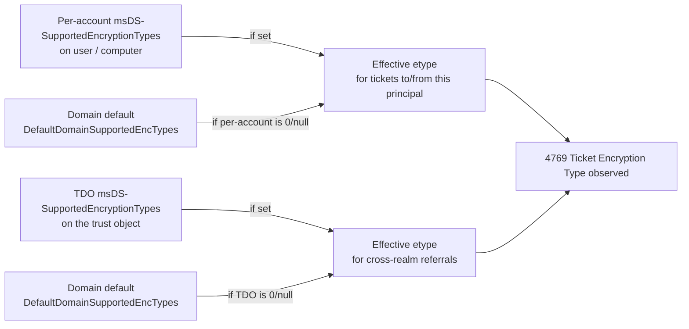
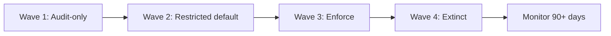

# Remediation, AES Migration, Cutover, and RC4 Extinction

> **Article 3 of 3 — RC4 Hardening series.** Read in order:
>
> 1. [RC4 Fundamentals, Obsolescence, and Risks of Continued Use](./1.%20RC4%20Fundamentals%2C%20Obsolescence%2C%20and%20Risks%20of%20Continued%20Use.md) — *why* RC4 is dangerous and what attackers actually do with it.
> 2. [Legacy Dependency Mapping and Technical Inventory](./2.%20Legacy%20Dependency%20Mapping%20and%20Technical%20Inventory.md) — *where* RC4 still lives in your estate.
> 3. **Remediation, AES migration, cutover, and RC4 extinction** *(this article)* — *how* to remove it without breaking production.
>
> This article is a **conceptual blueprint** for the cutover — levers, phases, gates, exception discipline, end-state definition. The technical runbooks (PowerShell, GPO paths, registry keys, `ktpass`, `Reset-KrbTgt-Password-For-RWDCs-And-RODCs.ps1`, etc.) live in dedicated annex articles in the same folder.

Goal: turn the inventory from the previous article into an actual cutover plan that ends with RC4 measurably extinct, without breaking production along the way.

## 0. What this article actually delivers 🏗️

The previous articles set the stage:

- **Article 1** explained *why* RC4 is dangerous and what attackers actually do with it.
- **Article 2** explained *how to find* every dependency that still uses it, ranked by risk and effort.

This one is the **construction site**. By the end, you should know exactly which switch to flip on which day, in which order, with which rollback path, and how to prove afterwards that RC4 is gone.

End state — what "RC4 extinct" looks like, measurably:

- Zero `4769` events with `TicketEncryptionType` in `0x17` (RC4-HMAC) **or `0x18` (RC4-HMAC-EXP)** over a 14-day window (excluding declared exceptions). The `0x18` value in the event field is *export-grade RC4*, not AES — see [Article 1 §6 namespace trap](./1.%20RC4%20Fundamentals%2C%20Obsolescence%2C%20and%20Risks%20of%20Continued%20Use.md).
- 100% of **service principals** (user accounts holding an SPN, gMSA, sMSA) in `msDS-SupportedEncryptionTypes = 0x18` (AES128 + AES256), **with `pwdLastSet` after the domain's AES-support cutoff** (the `Read-only Domain Controllers` group's `whenCreated`) — capability without rotation is the [stale-key trap from Article 1 §2](./1.%20RC4%20Fundamentals%2C%20Obsolescence%2C%20and%20Risks%20of%20Continued%20Use.md), not extinction. **Computer accounts are explicitly out of scope for this service-principal metric**: outside an explicit AES-only policy, `0x1C` can remain the Windows compatibility baseline when machine-password rotation is healthy. Inside the AES-only GPO scope, however, a persistent `0x1C` is declarative drift to investigate even when runtime evidence shows only AES. Computer accounts remain covered by the previous bullet (zero RC4 `4769` events) and by this policy-convergence check. Regular user accounts without an SPN fall back to the domain default and are not in scope for explicit per-account values. `krbtgt` is a special case (see §3.5) — do **not** set this attribute on it.
- Trust objects (TDOs) at `0x18`, with trust passwords rotated since AES support was enabled.
- `krbtgt` key rotated within the last 90 days.
- Exception list is short, dated, owner-assigned, with a sunset plan.

Everything below is about getting from "inventory done" to that state.

## 1. The three levers you will actually operate 🎚️

Before tactics, the big picture. RC4 lives in three different layers of AD, and each has its own switch. You will touch all three before you can declare extinction.

| Lever | Where it lives | What it controls | Typical syntax |
| --- | --- | --- | --- |
| **Per-account capability** | `msDS-SupportedEncryptionTypes` on user / computer / `inetOrgPerson` objects | Which etypes a specific principal is allowed to use. Overrides default policy. | `Set-ADUser` (or `Set-ADComputer`) `... -Replace @{'msDS-SupportedEncryptionTypes'=24}` |
| **Domain / DC defaults** | `HKLM\SYSTEM\CurrentControlSet\Services\Kdc\DefaultDomainSupportedEncTypes` on every DC (deployed via GPO Preferences → Registry, or by direct registry write — *not* by the MSS GPO listed below) | The fallback etype the KDC selects for a service ticket when the target account's `msDS-SupportedEncryptionTypes` is `0` or absent. KB5073381 turns this same value into the **enforced** default from Apr 14, 2026 (Microsoft Phase 2). | GPO Preferences → Registry, or `New-ItemProperty` direct write |
| **Trust capability** | `msDS-SupportedEncryptionTypes` on the TDO + trust password recency (see explainer below) | Which etypes are allowed on cross-domain / cross-forest referral tickets. | `Set-ADObject -Identity <TDO-DN> -Replace @{...}` + `netdom trust ... /resetOneSide` |

> ℹ️ **Two related but distinct switches — do not confuse them.**
>
> - The Microsoft baseline GPO **`Network security: Configure encryption types allowed for Kerberos`** writes `HKLM\SYSTEM\CurrentControlSet\Control\Lsa\Kerberos\Parameters\SupportedEncryptionTypes` — a **member-side / client-side** value that controls which etypes a Windows machine accepts when *acting as a Kerberos client or server*. It is **not** the KDC fallback in the table above.
> - The KDC fallback (`DefaultDomainSupportedEncTypes`) and the member-side allowed list are deployed together in practice, but they are different keys and are listed separately in [§2 — *Where the per-DC switches live*](#where-the-per-dc-switches-live).
>
> **Trust password recency:** the TDO's AES key only exists if the trust password was rotated since AES support landed in the domain. A TDO advertising `0x18` whose password predates that cutoff has no AES key on disk — the [stale-key trap from Article 1 §2](./1.%20RC4%20Fundamentals%2C%20Obsolescence%2C%20and%20Risks%20of%20Continued%20Use.md), applied to a trust object.

Two rules to keep in mind from now on:

1. **The most specific value wins on each ticket flow.** For tickets *to/from a principal*, that principal's `msDS-SupportedEncryptionTypes` overrides the domain default. For *cross-realm referrals*, the TDO's `msDS-SupportedEncryptionTypes` overrides the domain default on that trust path. Both ignore the domain default when set. Concretely: if a service account has `0x1C`, no amount of domain-level AES policy — not even `DefaultDomainSupportedEncTypes = 0x18` on every DC — will make its tickets RC4-free; the per-account value wins.
2. **Capability ≠ key material.** An account can advertise AES (`0x18`) but have no usable AES key, because AD only derives AES keys at password set time. Old accounts that have never rotated since AES was supported are the [classic stale-key trap from Article 1 §2](./1.%20RC4%20Fundamentals%2C%20Obsolescence%2C%20and%20Risks%20of%20Continued%20Use.md).

Mental model for the cutover:

The plan in the rest of this article: fix the leaves first (per-account, per-trust), then the trunk (default policy), then enforce.

## 2. Two Microsoft rollouts that shape the cutover 📅

Microsoft did not flip RC4 off in one update. Two separate cumulative-update trains land in this article — they affect different things and arrive on different dates. Mixing them up is the most common reason a remediation plan looks wrong on paper.

| KB / CVE | Released | What it changed | Where it shows up in this article |
| --- | --- | --- | --- |
| **KB5021131 / CVE-2022-37966** | **November 2022** | KDC defaults *session keys* to AES even when the ticket envelope is RC4. Cross-domain referral tickets default to AES whenever the trust password contains AES key material. | §3.3 (trust remediation no longer needs an explicit TDO bitmask flip on patched DCs). |
| **KB5073381** | **January 2026**, with default-flips on **April 14, 2026** and **July 2026** | Adds the per-DC `RC4DefaultDisablementPhase` valve and **9 new Kdcsvc events (201-209)** in the System log. From April 2026, the effective fallback for accounts whose `msDS-SupportedEncryptionTypes` is unset becomes **AES-only (`0x18`)**. From July 2026 the valve is removed and AES-only is permanent. | §3.1 (Kdcsvc 202/207 = stale-key trap firing in production), §5 (the cutover waves work *with* this rollout, not in parallel). |

> ⚠️ **What did *not* change with KB5021131.** Service ticket envelope encryption still depends on the target account's `msDS-SupportedEncryptionTypes`. A null or zero value silently produced an RC4 envelope right up until KB5073381 closed that door. Hence the entire per-account remediation work in §3.

> 📌 **Where you are on the timeline.** This article is published in May 2026, so by the time you read it your DCs are most likely **past April 14, 2026 — already enforcing AES-only by default for unspecified accounts**. Errors `203 / 204 / 208 / 209` in the DC System log mean an account is breaking right now. The triage grid for those errors lives in [Article 1 §6 — *What to do if Phase 2 is breaking your production right now*](./1.%20RC4%20Fundamentals%2C%20Obsolescence%2C%20and%20Risks%20of%20Continued%20Use.md). Use that emergency procedure first; only then come back to this article for the structured cutover.

### The phase model you actually operate against

Article 1 §6 walks through the full 9-event Kdcsvc grid and the three-date timeline. For the cutover work in this article you only need the **operator-facing summary** of what each Microsoft phase enables you to do:

| Microsoft phase (KB5073381) | Date | What the DC does | What you can do during this phase |
| --- | --- | --- | --- |
| **Phase 1 — Initial Deployment** | Jan 13 → Apr 14, 2026 | Knob default = `0` (silent). Setting `RC4DefaultDisablementPhase = 1` enables **warning** events 201/202/205/206/207 without blocking anything. | Audit. The whole §3 inventory and remediation work happens here without breaking anything in production. |
| **Phase 2 — Enforcement with manual rollback** | Apr 14 → Jul 2026 | Knob default = `2`. AES-only fallback active by default. Errors 203/204/208/209 fire on every breaking request. Knob can still be rolled back to `0` or `1` for an emergency. | Finish remediation. Remaining failures surface as enforce errors with the offending account name pre-extracted — finish the §3 patterns one by one. The rollback knob is the panic button referenced in §6, **not** a strategy. |
| **Phase 3 — Permanent enforcement** | From Jul 2026 | The knob is no longer read. AES-only fallback is locked in code. The only remaining override is an explicit per-account `msDS-SupportedEncryptionTypes` value carrying the RC4 bit. | Maintain. The exception list (§7) becomes the only legitimate residual RC4 surface. Anything else is drift. |

The full event grid (201-209), the four-cell mental model that decodes them, and the "what to do right now if Phase 2 is breaking production" emergency triage are spelled out in **[Article 1 §6](./1.%20RC4%20Fundamentals%2C%20Obsolescence%2C%20and%20Risks%20of%20Continued%20Use.md)**. This article does not duplicate them — it consumes them.

### Where the per-DC switches live

Three registry locations drive Kerberos enforcement behavior on a DC and on member servers. You touch them via GPO, never directly outside a change window.

> 🧠 **Mental model for the first two switches.** `DefaultDomainSupportedEncTypes` says *what you want as fallback*. `RC4DefaultDisablementPhase` says *whether Microsoft actually lets you use it*. The first is your admin preference; the second is the override Microsoft layered on top to drive the Phase 1 → Phase 3 rollout. Same DC, two distinct knobs.

- **`HKLM\SYSTEM\CurrentControlSet\Services\Kdc\DefaultDomainSupportedEncTypes`** — the **trunk-level fallback**: which etypes the KDC selects when an account's `msDS-SupportedEncryptionTypes` is `0` or absent. The safe target is **`0x18`** (AES128 + AES256). From April 2026 onward, KB5073381 enforces AES-only fallback **regardless of this value's RC4 bit** — meaning a configuration like `0x1C` (with RC4 still allowed) is silently overridden by the KDC. Setting `0x18` explicitly is now a *belt-and-braces alignment* that survives any future regression and the July 2026 valve removal. Anything with the RC4 bit set (e.g. `0x1C`) still raises Kdcsvc event **205** during Phase 1 audit.
- **`HKLM\SOFTWARE\Microsoft\Windows\CurrentVersion\Policies\System\Kerberos\Parameters\RC4DefaultDisablementPhase`** — the **KB5073381 valve** (`0` silent, `1` audit, `2` enforce). Per Article 1 §6, this knob is your audit switch during Microsoft Phase 1 and your emergency panic button during Phase 2; it is removed in Phase 3 (July 2026).
- **`HKLM\SYSTEM\CurrentControlSet\Control\Lsa\Kerberos\Parameters\SupportedEncryptionTypes`** — the **client-side** counterpart: which etypes a member machine (not a DC) supports for its own outgoing/incoming Kerberos. Written by GPO `Network security: Configure encryption types allowed for Kerberos`. Tightening this on member servers is the §5 Wave 3 step.

A related registry value (`KrbtgtFullPacSignature`) controls the PAC signature hardening that often ships in the same KB train as RC4 rollouts. Different CVE family (CVE-2022-37967), same operational discipline: track its phase value alongside RC4.

The exact REG_DWORD encodings, the GPO paths, and the ticket-cache purge / KDC service restart sequence required to apply changes safely live in the **DC enforcement runbook** annex (to be created). Treat them as runbook content, not as part of the conceptual blueprint.

## 3. Remediation per dependency type 🔧

This is the per-pattern playbook. Match each row in your article-2 backlog to one of the patterns below. Each pattern names *what* to do and *why*; the actual command-level runbooks live in dedicated annex articles.

### 3.1 — Service account with `0x1C` and stale secret (the classic quick win)

Pattern: account advertises both AES and RC4, password is old, runtime emits RC4 because no AES key was ever derived (or because the application pins RC4 client-side).

> ⚠️ **Order matters — rotate before tightening.** If the account is in the stale-key trap (no AES key on disk), tightening `msDS-SupportedEncryptionTypes` to `0x18` *before* rotating the password breaks authentication immediately: the KDC sees AES required, no AES key available, and refuses every ticket request. Always rotate first to derive the AES keys, validate that AES tickets are now issued, *then* tighten the capability.

Conceptual procedure:

1. **Pre-check the AD state** — confirm the current `msDS-SupportedEncryptionTypes`, `PasswordLastSet`, and the SPN list before touching anything.
2. **Rotate the secret first** — non-negotiable, and it must come before any capability change. AD only derives AES keys at password set time; the rotation is what populates the AES key material in NTDS.dit while the existing capability (typically `0x1C`) still allows fallback. Hand the new password to the service owner through the secret-vault channel, never through tickets or chat.
3. **Validate AES is actually issued** — purge the ticket cache, force a new service ticket, and confirm the etype is **`0x11` (AES128) or `0x12` (AES256)** on the issued ticket. If `0x17`/`0x18` persists at this point, the application is pinning RC4 client-side — stop and jump to pattern 3.4 *before* tightening the capability.
4. **Tighten the capability to AES-only** (`msDS-SupportedEncryptionTypes = 0x18`). Safe now: AES keys exist, validation passed.
5. **Re-validate from a client** — purge again, new ticket, confirm AES etype is still issued.
6. **Watch the SIEM for 24-48h** — confirm `4769` no longer shows `0x17` (RC4-HMAC) **or `0x18` (RC4-HMAC-EXP)** for the SPN before marking the row "remediated".

Common gotcha: if `4769` stays at `0x17`/`0x18` after rotation, the application itself is pinning an etype client-side (JDBC string, `krb5.conf`, IIS app pool identity, Java GSS settings). The fix is then in the application config, not in AD. See pattern 3.4.

Runbook: **Service account RC4-to-AES remediation** annex (to be created).

### 3.2 — Computer account with stale machine password

Pattern: a server's machine account hasn't rotated its password since AES was added. Rare on Windows (machine passwords rotate every 30 days by default), common on appliances or domain-joined VMs that paused their rotation, or on hosts where machine password change was disabled years ago and never revisited.

> ℹ️ **Default `0x1C` on a healthy Windows computer account is not, by itself, evidence that RC4 is being used.** Without an explicit AES-only policy, `0x1C` is the normal Windows capability value: RC4, AES128 and AES256. Healthy machine-password rotation supplies fresh AES keys, and modern peers normally negotiate AES. However, `0x1C` still *advertises* RC4 and permits an RC4-only requester to find a common etype. In an estate where `Network security: Configure encryption types allowed for Kerberos` is explicitly set to AES128 + AES256 on the host, a persistent `0x1C` is therefore a **declarative drift finding**: Windows normally updates its own `msDS-SupportedEncryptionTypes` from the effective Kerberos configuration, although propagation is not immediate. Verify the resultant GPO and `HKLM\SYSTEM\CurrentControlSet\Control\Lsa\Kerberos\Parameters\SupportedEncryptionTypes`, then let the host converge its AD attribute; do not treat a manual LDAP edit as the first fix. Runtime `4768` / `4769` evidence remains the authority for determining whether RC4 was actually used.

Conceptual procedure:

1. **Pre-check** — `msDS-SupportedEncryptionTypes`, `pwdLastSet`, host OS / appliance type, rotation policy on the host.
2. **Force machine password rotation from the affected host** against a writable DC. On Windows: `Reset-ComputerMachinePassword` or `nltest /sc_change_pwd:<domain>`. On a non-Windows appliance: vendor-specific procedure (often a domain re-join).
3. **Validate AES is now issued** — from the host, purge the ticket cache, request a new service ticket for one of its SPNs, and confirm the etype is **`0x11` (AES128) or `0x12` (AES256)**. If `0x17`/`0x18` persists, the client side of the appliance is pinning RC4 — jump to pattern 3.4.
4. **Align capability with the intended policy.** If no AES-only policy is assigned and machine-password rotation is healthy, `0x1C` can remain the Windows compatibility baseline. If the host is explicitly governed by the AES-only GPO, confirm that the effective registry value contains only AES and investigate any `0x1C` that persists after policy processing and AD replication; the computer should publish the policy-aligned value itself. For appliances or manually managed principals, set AES-only explicitly only after step 3 has confirmed AES keys are present.
5. **Watch the SIEM for 24-48h** — confirm `4769` no longer shows `0x17` (RC4-HMAC) or `0x18` (RC4-HMAC-EXP) targeting the host's SPNs before marking the row "remediated".

Runbook: **Computer account stale-key remediation** annex (to be created).

### 3.3 — Trust legacy (TDO)

Pattern: cross-domain or cross-forest trust still emits RC4 referrals (`Service Name = krbtgt/<TARGET-REALM>` in 4769 telemetry).

> ℹ️ **What changed in November 2022 (KB5021131 / CVE-2022-37966).** Before that update, referral tickets were issued in RC4 by default unless AES was explicitly enabled on the TDO via the Active Directory Domains and Trusts GUI or `ksetup`. That step is **no longer required** on patched DCs: the KDC now defaults referral ticket encryption to AES whenever the trust password contains AES key material. If your DCs on both sides of the trust are at or above the November 2022 update, the trust will produce AES referrals without any TDO flag change — confirmed by Microsoft in the *Active Directory Hardening Series – Part 4* blog post.
>
> What still matters: the **trust password must contain AES keys**. Trusts whose password was set in the pre-AES era have only an RC4 key derived. Rotation is what fixes that, not the TDO bitmask.

This is the most coordinated procedure because **trust passwords have two ends** and both must agree. A unilateral change breaks the trust.

> ⚠️ **Order matters — rotate before tightening (TDO edition).** Same stale-key trap as §3.1 / §3.2: if you set the TDO `msDS-SupportedEncryptionTypes` to AES-only (`0x18`) while the trust password was last set in the pre-AES era, no AES key has ever been derived for that trust and the referral path breaks immediately. Rotation derives the AES keys; tightening the bitmask comes after.

Conceptual procedure:

1. **Pre-check both sides** — current TDO `msDS-SupportedEncryptionTypes`, last password change (`whenChanged` on the TDO), trust direction (one-way / two-way), and DC patch level on both forests. In 2026 the patch-level check is mostly historical (all DCs should be well past the November 2022 update), but worth confirming on out-of-band or isolated DCs.
2. **Rotate the trust password first** — non-negotiable, and **before** any TDO bitmask change. On a two-way trust: `netdom trust <TRUSTING_DOMAIN> /domain:<TRUSTED_DOMAIN> /Reset /UserO:... /PasswordO:... /UserD:... /PasswordD:...`. On a one-way trust: `/resetOneSide` on the trusting side. The reset **generates a new shared secret automatically and propagates it** to the other side via the trust authentication channel — do not try to set an identical password manually on both sides.
3. **Validate cross-realm authentication** — initiate a cross-realm authentication from a client of the source domain to a resource of the target domain, and confirm the resulting `4769` carries an AES etype (`0x11` AES128-CTS-HMAC-SHA1-96 or `0x12` AES256-CTS-HMAC-SHA1-96). If `0x17` / `0x18` persists: the rotation didn't propagate on one side, or a DC on one side is below the November 2022 baseline.
4. **Tighten TDO capability only if needed.** On a modern post-Nov-2022 estate this step is usually superfluous — AES is already the default for referrals. On older estates, set `msDS-SupportedEncryptionTypes = 0x18` on the TDO **on both sides** now that AES keys have been derived (steps 2 + 3 confirmed).
5. **Watch the SIEM for 24-48h** — confirm that `4769` events with `Service Name = krbtgt/<TARGET-REALM>` no longer carry `0x17` / `0x18`.

Runbook: existing **[Hardening Kerberos Encryption on AD Trusts](../Hardening%20Kerberos%20Encryption%20on%20AD%20Trusts/Hardening%20Kerberos%20Encryption%20on%20AD%20Trusts.md)** annex.

### 3.4 — Vendor appliance / non-Windows Kerberos client

Pattern: a non-Windows Kerberos client (Linux server, biomedical or OT appliance, network gear, Java app) is advertising RC4-only, often because its client-side Kerberos config was pinned years ago and never revisited.

Two paths exist depending on whether the client side can be modified.

**Path A — client-side fix is possible.**

Conceptual procedure:

1. **AD-side prerequisite (do this first).** Confirm the AD service account the appliance authenticates as (user account holding the SPN, or sMSA / gMSA) advertises AES in `msDS-SupportedEncryptionTypes` — default `0x1C` is fine. Then **rotate the account password** so AES keys are actually derived (same stale-key rule as §3.1). Without this step, no amount of client-side configuration will produce AES tickets.
2. **Update the client Kerberos config** to remove RC4 from the allowed etype lists. The exact location depends on the stack:
   - MIT / Heimdal Kerberos: `krb5.conf` → `default_tkt_enctypes`, `default_tgs_enctypes`, `permitted_enctypes`.
   - Java: JVM Kerberos system properties (`sun.security.krb5.*`) or the `krb5.conf` honored by the JVM's GSS implementation.
   - Other vendor stacks: check the vendor's Kerberos configuration documentation.
3. **Re-issue the keytab with AES keys** if the client uses one. Keytabs generated before step 1's password rotation contain only RC4 keys — re-issue via `ktpass /crypto AES256-SHA1` (or the equivalent for sMSA / gMSA) after AES keys are present on the AD account.
4. **Validate** — the client should now obtain AES-encrypted tickets. Confirm via `klist -e` (MIT) or the stack's native Kerberos tooling, and via DC-side `4769` telemetry showing `0x11` / `0x12` for the appliance's principal.
5. **Watch the SIEM for 24-48h** — confirm no `0x17` regression for the principal.

**Path B — vendor cannot support AES** (the real-world case for many appliances).

This is an exception case, handled via §7 exception management:

- Document as **temporary exception** (template in §7).
- Set `msDS-SupportedEncryptionTypes = 0x1C` **on the AD service account** (the principal the appliance authenticates as — not on the appliance's device object) to keep RC4 available *only* for this principal, while the global policy goes AES-only.
- Open a vendor track, get a written EOL or AES-support roadmap, set an exception sunset date.
- **Rotate the exception account's password on a defined cadence** (even if it stays RC4-derived) — a stale RC4 secret remains a Kerberoast offline-crack target; periodic rotation reduces that surface.
- Apply network containment so a recovered RC4 service password has minimal blast radius.
- Layer the §4 compensating controls (FAST, MDI detection) over the residual surface.

Runbook: **Non-Windows Kerberos client AES migration** annex (to be created), with sub-procedures per stack (MIT/Heimdal, Java GSS, common appliance vendors).

### 3.5 — `krbtgt` itself (the most delicate)

Pattern: even if every other account is AES, the TGT itself is sealed with `K_krbtgt`. If the `krbtgt` password is years old, an RC4 TGT path can still exist, and Golden Ticket resilience suffers regardless of how clean the rest of the estate looks.

> ℹ️ **Two facts that change how aggressively you need to act.**
>
> - With **DFL ≥ 2008** and a `krbtgt` password that has been reset at least once since the domain started supporting AES (2008R2 era), the KDC issues TGTs encrypted with AES regardless of `msDS-SupportedEncryptionTypes` on the `krbtgt` account. Microsoft is explicit: do **not** set `msDS-SupportedEncryptionTypes` on `krbtgt`. The combination of DFL + AES key in password history is what drives the behavior.
> - The fast detection signal for a stale `krbtgt`: compare `pwdLastSet` on the `krbtgt` account to the `whenCreated` of the built-in domain group **`Read-only Domain Controllers`**. The RODC group is created when the first DC at functional level 2008 is promoted — i.e. when AES support became available. A `pwdLastSet` older than that means the current `krbtgt` password may still be a pre-AES password with no AES key derived.

The audit script in Article 2 flags a stale `krbtgt` via exactly this `pwdLastSet` < RODC-group-`whenCreated` test. That signal is the entry point into this procedure.

Conceptual procedure:

1. **Use the recommended Microsoft krbtgt rotation script** — do not roll your own. Custom rotation logic has historically broken replication and locked admins out of their own domain. Microsoft references the community-maintained `Reset-KrbTgt-Password-For-RWDCs-And-RODCs.ps1` from `zjorz/Public-AD-Scripts` (Jorge de Almeida Pinto, MS MVP) in the *Decrypting the Selection of Supported Kerberos Encryption Types* guidance.

> ⚠️ **No rollback.** `krbtgt` rotation cannot be undone — there is no "set the previous krbtgt password back" command. If a reset breaks replication or authentication, recovery means restoring DCs from backup. This is why steps 3 (operational rules) and 4 (validation) are not optional.

2. **Two consecutive resets, separated by at least the TGT lifetime** (default 10 hours), with replication validation between them. The two-reset rule is rooted in how `krbtgt` stores its keys: `krbtgt` has only **two password slots** (current `N` and previous `N-1`). A single reset still leaves the old password (potentially the pre-AES one) in slot `N-1` — Golden Tickets forged with the old key still validate against that slot. The second reset, performed after the TGT lifetime has elapsed so legitimate TGTs naturally expire, displaces the old password from slot `N-1` entirely. After two resets, both slots hold post-rotation AES keys.
3. **Operational rules** — never during an unmonitored window, never during month-end critical processing, never with a single DC online, never without recent backups verified.
4. **Validate** — after each reset, confirm: (i) every DC reports a fresh `whenChanged` on the `krbtgt` account; (ii) replication is healthy on every DC (`repadmin /showrepl`, `repadmin /replsum`); (iii) on a test client, `klist purge` followed by a fresh authentication produces a TGT visible in `klist -e` with an AES etype; (iv) `4769` traffic shows no surge of failures.
5. **Watch the SIEM for 24-48h after the second reset** — focus on Kerberos failure spikes (`4768` / `4771` with `0xE` / `0x18`), authentication anomalies on service accounts, and any DC replication warning.

Cadence after migration: rotate `krbtgt` at least every 90 days. Some hardened estates run a 30-day cadence as part of their standing operational calendar.

Runbook: **`krbtgt` rotation runbook** annex (to be created), wrapping the recommended script with the validation, replication, and rollback steps required to run it safely.

## 4. When remediation is not possible: compensating controls 🛡️

Some dependencies cannot be remediated within the cutover window — vendor appliances on contract, frozen legacy apps, M&A-acquired domains, OT or biomedical systems with rigid certification cycles. The discipline here is that **"we still have RC4 somewhere" must not mean "we are exposed"**. Three Microsoft-native control families reduce the residual attack surface while exceptions remain on the books. The primary consumers of this layer are the §3.4 Path B exceptions (appliance principals that cannot move off RC4 within the cutover window), but the same controls harden the entire estate and are worth running permanently.

These are mitigations, not substitutes. They do not remove RC4 from the estate. They make the residual RC4 less attractive to attackers and easier to detect. The most resilient estates run all three permanently, even after RC4 extinction, because they also defend against the next legacy etype that gets deprecated.

### 4.1 — FAST / Kerberos armoring (RFC 6113)

FAST wraps the AS exchange (AS-REQ + AS-REP) inside an encrypted tunnel keyed from the client machine's TGT. The pre-auth blob and the AS-REP `enc-part` are no longer directly observable on the wire — the offline-cracking primitive behind AS-REP roasting and pre-auth offline cracking is removed, even when the targeted account remains RC4-capable.

Conceptual fit:

- **Mitigates**: AS-REP roasting, pre-auth offline cracking on user accounts.
- **Does not mitigate**: Kerberoasting. The TGS-REP service ticket blob is sealed with `K_svc` and is outside the FAST tunnel. Service-account password length and AES enforcement remain the right defenses for that vector.
- **Prerequisites**: **domain functional level ≥ Windows Server 2012** (required to push FAST armoring policy via GPO / claims), modern client stacks. Very old or embedded Kerberos stacks (legacy MIT/Heimdal versions, fossilized appliance clients) may not support FAST, so enforcement mode can break those flows.
- **Implementation**: KDC-side and client-side policy. See the dedicated FAST armoring annex (to be created) for the runbook.

### 4.2 — PKINIT / smartcard / gMSA

This family replaces password-derived long-term keys with credential material that cannot be brute-forced from a candidate password list:

- **PKINIT / smartcard logon** — the AS exchange uses a Diffie-Hellman key authenticated by the client's certificate, not a key derived from a password. AS-REP roasting and pre-auth offline cracking become structurally impossible on those accounts, regardless of RC4 capability. Natural baseline for Tier 0 administrators.

> ⚠️ **PKINIT alone is not enough — enforce smartcard.** Enrolling a user for smartcard logon does *not* automatically disable the password-based AS-REQ path. If the account still has a password set and the **`Smart card is required for interactive logon`** flag (UAC bit `0x40000`, attribute `SmartcardLogonRequired`) is not set, the account remains AS-REP-roastable via the classic password-derived path regardless of the certificate. The flag is what forces all AS-REQs for that principal through PKINIT; without it, PKINIT is opt-in per request and the offline-cracking primitive survives.

- **gMSA (group Managed Service Accounts)** — not PKINIT, but solves the same offline-cracking problem on the service side: the password is a **very long random value (~240 bytes)** rotated automatically by AD. Even with RC4 enabled on the account, brute-forcing such a secret is computationally infeasible.

Conceptual fit:

- **Mitigates**: AS-REP roasting on user accounts; Kerberoasting on gMSA-protected services.
- **Does not mitigate**: service tickets issued to non-gMSA service accounts, or downstream services still RC4-capable. Protects the identity, not the path.
- **Prerequisites**: functional PKI / AD CS for smartcard; gMSA migration feasibility for service accounts. AD CS misconfigurations (ESC-class) introduce their own attack surface and must be assessed first.
- **Implementation**: PKI enrollment for smartcard, password retrieval pattern change for gMSA. See the dedicated PKINIT and gMSA migration annexes (to be created).

### 4.3 — Defender for Identity

MDI sensors deployed on domain controllers analyze Kerberos traffic in real time and surface RC4 usage patterns and Kerberoasting-style behavior (high-volume TGS-REQ from a single principal targeting many SPNs in a short window).

Conceptual fit:

- **Detective only** — cannot block AS-REQ or TGS-REQ in real time.
- **Cannot detect offline cracking** (step 4 of the article-1 walkthrough); nothing can, because it happens off the network.
- **Compresses the detection window** for ticket-request anomalies from "discovered post-incident" to "alerted in minutes". That is the entire value.
- **Concrete MDI alerts that surface RC4 abuse**: *Suspected AS-REP roasting attack*, *Suspected Kerberoasting attempt*, *Suspected Kerberos brute-force attack*. These should route to a Tier 1+ priority queue with a documented response runbook.
- **Doubles as a complementary inventory source** for article 2: the *Weak cipher usage* report shows RC4 ticket trends per identity over time.

### Stack the three together

| Control | Mitigates | Limits | Layer |
| --- | --- | --- | --- |
| **FAST armoring** | AS-REP roasting, pre-auth offline cracking | Does not protect TGS / Kerberoasting; requires modern clients | Protocol |
| **PKINIT / smartcard / gMSA** | AS-REP roasting on users; Kerberoasting on gMSA-protected services | Identity-level, not path-level | Identity |
| **Defender for Identity** | Detection of Kerberoasting & AS-REP roasting in flight | Detective only, no prevention | Telemetry |

These layers are complementary, not alternatives. FAST eliminates a broad class of offline-cracking, PKINIT/gMSA removes the password-derived target altogether for selected identities, and MDI catches what slips through both. None of this replaces the cutover work in the rest of this article — it is what keeps the residual surface manageable while the cutover progresses and what hardens the estate against the next deprecated etype.

## 5. The cutover (wave by wave) 🚦

You don't flip RC4 off in one change window. You walk through **operator waves**, each gated by measurable telemetry. *(Naming convention: "wave" here is the cutover step you operate; "phase" is reserved throughout this series for Microsoft's KB5073381 phases from §2 — they advance on Microsoft's calendar regardless of where you are in your waves.)*

### Wave 1 — Audit-only

- Action: nothing changes in production behavior. Enable all auditing and SIEM dashboards from articles 1 and 2. Set `RC4DefaultDisablementPhase = 1` on every DC if you are still in Microsoft Phase 1, so Kdcsvc 201/202/205/206/207 warnings populate the System log.
- Exit criteria: complete inventory (the backlog produced by [Article 2](./2.%20Legacy%20Dependency%20Mapping%20and%20Technical%20Inventory.md)), every row has an owner, telemetry baseline stable for at least 14 days.

### Wave 2 — Restricted default

- Action: align `DefaultDomainSupportedEncTypes` to `0x18` (AES128 + AES256) via GPO on DCs. Accounts that have `msDS-SupportedEncryptionTypes` set explicitly are unaffected; accounts with zero/absent value fall back to the new default. **On post-April-2026 (Microsoft Phase 2) estates this is mostly *belt-and-braces*** — KB5073381 already enforces AES-only as the implicit default. Setting the registry value explicitly nonetheless makes the intent durable past July 2026 (when the KB5073381 valve disappears) and survives any future regression of Microsoft's defaults.
- Per-account remediation continues in parallel: §3.1 / §3.2 for every quick win.
- Exit criteria: RC4 ticket count in 4769 dropped by ≥ 80% week-over-week. Every remaining RC4 source is identified and has an action plan.

### Wave 3 — Enforce

- Action: deploy GPO `Network security: Configure encryption types allowed for Kerberos = AES128 + AES256` on all DCs and on all member servers within scope. **For service principals (user accounts holding an SPN, gMSA, sMSA), per-account `msDS-SupportedEncryptionTypes = 0x1C` from this wave onward marks a declared exception — nothing else.** For Windows computer accounts in this GPO scope, a persistent `0x1C` after policy processing and AD replication is a convergence finding to investigate, not automatically an RC4 exception or proof of RC4 use (see §3.2).
- Trust rotations (§3.3) and `krbtgt` rotation (§3.5) happen in this wave.
- Exit criteria: ≤ 5 RC4 sources remain, all on the documented exception list with a sunset date.

### Wave 4 — Extinct

- Action: per-account exceptions sunset one by one. Each removal validated by 4769 telemetry over 7 days.
- Exit criteria: zero `4769` with `TicketEncryptionType` in `0x17` / `0x18` over 14 days (excluding still-declared exceptions). All §0 metrics green.

### Monitor (post-extinction)

- Permanent SIEM rule: any new RC4 ticket = high-severity alert. Drift detection.
- Permanent control: quarterly review of service principals (user accounts holding an SPN, gMSA, sMSA) whose `msDS-SupportedEncryptionTypes` is not `0x18` — every such principal must map to an active exception. Review computer accounts separately against their assigned policy: `0x1C` can remain the compatibility baseline outside the AES-only scope, but is drift when it persists on a host governed by that policy (see §3.2).

### Gate criteria summary

| Wave exit | Quantitative criterion | Qualitative criterion |
| --- | --- | --- |
| 1 → 2 | Telemetry baseline ≥ 14 d, inventory 100% owned | Every row in backlog has action + owner |
| 2 → 3 | RC4 (`0x17`/`0x18`) in 4769 dropped ≥ 80% WoW | Every remaining source identified |
| 3 → 4 | ≤ 5 RC4 sources, all on exception list | Sunset dates ≤ 6 months |
| 4 → Monitor | 0 RC4 (`0x17`/`0x18`) in 4769 over 14 d (excl. exceptions) | All §0 metrics green |

## 6. Rollback procedure 🔄

Hope nobody needs it. Have it ready anyway.

> ℹ️ **Scope of this section.** The procedure below covers the two rollback paths most operators will execute: **GPO-driven encryption policy changes** (Wave 2 / Wave 3 GPO deploys, §5) and **per-account `msDS-SupportedEncryptionTypes` changes** (§3.1 / §3.2 / §3.4). Two operations in §3 have different rollback semantics and are **not** covered here:
>
> - **Trust password rotation (§3.3)** — there is no « undo », only re-rotation. If validation fails, re-run the reset on the side that did not propagate.
> - **`krbtgt` rotation (§3.5)** — has **no rollback at all**. Recovery from a broken rotation is restoring DCs from backup. See the `⚠️ No rollback` callout in §3.5.

### When to rollback

Pre-defined triggers (decide *before* the change, not during the incident):

- Kerberos failure rate exceeds 5× baseline for more than 10 minutes. Use **`4771`** (Kerberos pre-authentication failure) and **`4768`** failure events as the primary failure pulse — these capture the AS-exchange failures that drive the bulk of authentication outages and are reliably audited by default. (`4769` failures also exist when the *Kerberos Service Ticket Operations* audit subcategory is set to Failure, but they are a secondary indicator and depend on local audit configuration.) On post-April-2026 estates, cross-check with KB5073381 enforcement errors `203 / 204 / 208 / 209` in the DC System log.
- More than one business-critical application reports authentication failure.
- Cross-forest trust authentication fails for any production-priority partner.

Anything less = forward-fix. Anything more = rollback.

### How to rollback (conceptually)

For a GPO-driven change, the rollback sequence is:

1. **Disable the GPO link** at the OU where the change was applied — do not delete the GPO itself, preserve the audit trail.
2. **Force replication and policy refresh** on every DC so the previous behavior takes effect quickly — typically `repadmin /syncall /AdeP` on a hub DC, then `gpupdate /force` on every DC.
3. **Purge the KDC ticket cache** on the DCs that were issuing failing tickets, so subsequent ticket requests rebuild from the rolled-back policy — `klist -li 0x3e7 purge` (LocalSystem context) on each affected DC.
4. **Validate** — affected applications retry within their normal Kerberos cache lifetime (max 10 hours, often seconds with retry logic). If still failing after the cache lifetime, the issue is downstream (app config, network), not the GPO.

For a per-account change, the rollback is to revert `msDS-SupportedEncryptionTypes` back to its pre-change value (typically `0x1C`) as a temporary safety net while the root cause is investigated.

The exact commands (GPO link disablement, DC ticket cache purge, per-account revert) live in the **Cutover & rollback runbook** annex (to be created).

### How to avoid having to rollback

- **Canary DCs** — apply the change to one DC first. Watch for 24h before propagating to the rest of the fleet. *Note: client-to-DC affinity is non-deterministic, so a canary validates the KDC behavior of that DC but does not exhaustively exercise every session path; pair the canary with the pilot-app and synthetic-transaction checks below.*
- **Pilot app** — pick one non-critical application and have its owner validate AES-only end-to-end before the change window.
- **Synthetic transaction** — script a Kerberos service ticket request at a fixed interval from a monitoring host, and verify the resulting etype with `klist -e` (or the SIEM-side `4769` for that principal). Alert on the first failure or on the first `0x17` regression.

## 7. Exception management 📋

Some dependencies cannot be fixed inside the cutover. They must be exceptions, not omissions.

The primary feeder of this section is **§3.4 Path B** (appliance principals whose stack cannot speak AES). Trust-side exceptions (§3.3) and any other long-lived RC4 principal go through the same template.

Template — every exception must have all these fields, in your CMDB or wiki:

| Field | Example |
| --- | --- |
| **Principal** | `svc-biomed-print` (user account holding SPN `HTTP/printsrv-bio-01.contoso.com`, used by a vendor appliance whose stack supports only RC4-HMAC) |
| **Principal type** | Service account (user-with-SPN). For computer accounts at `0x1C`, see §3.2: they are compatibility baseline outside the AES-only scope, but a convergence finding inside it. |
| **Owner (named)** | Jane Doe, Biomedical Infrastructure |
| **Why AES is impossible** | Vendor firmware v3.2 supports only RC4-HMAC. Ticket #INC0042 open with vendor. |
| **Technical override** | `msDS-SupportedEncryptionTypes = 0x1C` set explicitly on this account (overrides the AES-only domain GPO from §5 Wave 3) |
| **Compensating controls** | Network segment isolated; account permissions restricted to printer-only SPN; FAST armoring in enforce mode (§4.1); MDI *Suspected Kerberoasting attempt* alerts routed to Tier 1 (§4.3) |
| **Risk acceptance / sign-off** | Approved by CISO 2026-05-15, ref RISK-2026-018 |
| **Sunset date (max +6 months)** | 2026-11-30 |
| **Exit plan** | Vendor firmware v4.0 (AES support, ETA Q3) OR appliance decommission (replacement RFP in flight) |
| **Review cadence** | Quarterly, next: 2026-09-01 |

Why this matters:

- An undated exception becomes permanent. Then it becomes invisible. Then it becomes the next pentest finding.
- A dated exception with a named owner forces a quarterly decision: extend or sunset.

Quarterly exception review checklist:

- Is the technical reason still valid (vendor patched? appliance still in use?).
- Has the sunset date been respected or formally extended (with new owner sign-off)?
- Is the compensating control still in place?
- Has the exception been re-tested (try AES, see if it actually still fails)?

## 8. "Extinct" — measurable definition of done ✅

Six criteria, all must be green simultaneously over a 14-day window before declaring RC4 extinct:

| Metric | Target | Source |
| --- | --- | --- |
| 4769 with `TicketEncryptionType` in `0x17` (RC4-HMAC) or `0x18` (RC4-HMAC-EXP) | 0 (excluding declared exceptions) | SIEM / Defender / Sentinel |
| **Service principals** (user-with-SPN, gMSA, sMSA) with `msDS-SupportedEncryptionTypes` allowing RC4 (bit `0x04`) | Equal to the §7 exception list count — no surprises. *Computer accounts are assessed separately against their assigned Kerberos policy; see §3.2.* | AD attribute scan |
| Principals where AES-only (`0x18`) was set **explicitly** (user / sMSA / manual computer / TDO) and whose `pwdLastSet` predates the AES-support cutoff (the `Read-only Domain Controllers` group's `whenCreated`) | 0 — capability without a post-AES rotation is the [stale-key trap](./1.%20RC4%20Fundamentals%2C%20Obsolescence%2C%20and%20Risks%20of%20Continued%20Use.md), not extinction. *Auto-rotating principals (Windows computers, gMSA) are out of scope: their password rotates within 30 days by design.* | AD attribute scan |
| Trust objects with RC4 capability | 0 | TDO scan |
| `krbtgt` password age | ≤ 90 days | AD attribute scan |
| KB5073381 Kdcsvc events 201/202/206/207 (Phase-1 warnings) and 203/204/208/209 (Phase-2 enforce errors) | 0 over the 14-day window | DC System log → SIEM |

The verification queries that produce these numbers (LDAP bitwise scan of `msDS-SupportedEncryptionTypes`, TDO enumeration, `krbtgt` password age, residual RC4 KQL over 14 days, Kdcsvc event count) live in the **RC4 telemetry & inventory reporting** annex (to be created). Each metric maps to one query — when every output is empty (or matches the documented exception list exactly), RC4 is extinct.

## 9. After extinction — what comes next 🔭

Extinction is not the finish line. It is the starting line for ongoing hygiene.

- **Drift detection** — permanent SIEM rule on `4769` with `TicketEncryptionType` in `0x17` (RC4-HMAC) or `0x18` (RC4-HMAC-EXP). First hit = ticket on the identity team.
- **Account onboarding policy** — any new **service principal** (user account holding an SPN, gMSA, sMSA) or **trust object** must be created with `msDS-SupportedEncryptionTypes = 0x18` from day one. Bake it into your provisioning tooling. Computer accounts created via standard domain join may initially publish the Windows compatibility default `0x1C`; hosts assigned the AES-only GPO must subsequently converge to the policy-aligned capability value (see §3.2).
- **`krbtgt` cadence** — keep the 90-day (or 30-day) rotation in your operational calendar.
- **Quarterly exception review** — even if the list is empty, run the review. It catches the silent re-introduction.
- **Annual posture audit** — re-run the article-2 inventory once a year on the whole domain. RC4 has a way of coming back through migrations, M&A, and shadow IT.

RC4 extinction is the end of *this* migration. The hygiene loop above is what keeps the next deprecated etype (or the next regression of yours) from becoming a 3-article project all over again.

## Technical References

- [Article 1 — RC4 Fundamentals, Obsolescence, and Risks of Continued Use](./1.%20RC4%20Fundamentals%2C%20Obsolescence%2C%20and%20Risks%20of%20Continued%20Use.md)
- [Article 2 — Legacy Dependency Mapping and Technical Inventory](./2.%20Legacy%20Dependency%20Mapping%20and%20Technical%20Inventory.md)
- [`Kerberos Encryption Audit/Invoke-KerberosEncryptionAudit.ps1`](./Kerberos%20Encryption%20Audit/Invoke-KerberosEncryptionAudit.ps1) — the inventory-phase audit script (documented in Article 2 §6 and in [`How to use Invoke-KerberosEncryptionAudit Script.md`](./Kerberos%20Encryption%20Audit/How%20to%20use%20Invoke-KerberosEncryptionAudit%20Script.md)).
- [Hardening Kerberos Encryption on AD Trusts](../Hardening%20Kerberos%20Encryption%20on%20AD%20Trusts/Hardening%20Kerberos%20Encryption%20on%20AD%20Trusts.md)
- [RC4 HMAC Report (Defender for Identity)](../../../020%20-%20Microsoft%20Defender/Defender%20for%20Identity/Reporting/RC4%20HMAC%20Report.md)

External references (always consult the live versions):

- Microsoft Tech Community — *Decrypting the Selection of Supported Kerberos Encryption Types* (Jerry Devore, MSFT). Foundation reference for Kerberos etype selection logic, the `msDS-SupportedEncryptionTypes` decoder ring, and the Do's & Don'ts of RC4 disablement.
- Microsoft Tech Community — *Active Directory Hardening Series – Part 4 – Enforcing AES for Kerberos* (Jerry Devore, MSFT). Documents the November 2022 referral ticket / session key default change and the January 2025 cumulative update audit field enhancements (`MSDS-SupportedEncryptionTypes`, `Available Keys`, `Advertized Etypes`, `Pre-Authentication EncryptionType`, `Session Encryption Type`).
- Microsoft Support — **KB5021131**: *How to manage the Kerberos protocol changes related to CVE-2022-37966*. Authoritative source for the November 2022 behavior change and `DefaultDomainSupportedEncTypes` semantics.
- Microsoft Support — **KB5073381**: *How to manage Kerberos protocol changes related to RC4 default disablement*. Authoritative source for the three-phase rollout (Audit → Enforce → Hard-removal), the `RC4DefaultDisablementPhase` valve, and the new Kdcsvc 201-209 events.
- Microsoft Learn — *Kerberos encryption types supported by AD*.
- GitHub — `zjorz/Public-AD-Scripts/Reset-KrbTgt-Password-For-RWDCs-And-RODCs.ps1` (community-maintained krbtgt rotation script referenced by Microsoft guidance).
- MSRC — always consult the current advisory and KB article train for any **post-2022 RC4-related CVE** under active rollout when planning the enforcement phase.

