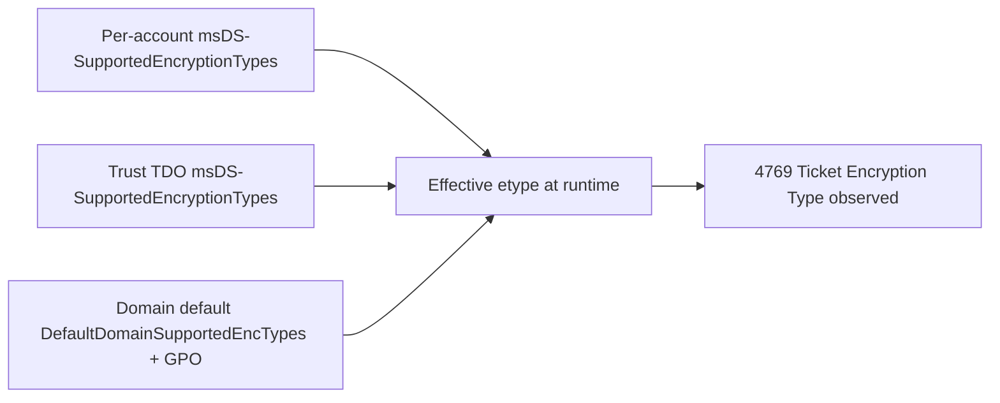
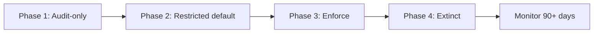

# Remediation, AES Migration, Cutover, and RC4 Extinction

Goal: turn the inventory from the previous article into an actual cutover plan that ends with RC4 measurably extinct, without breaking production along the way.

## 0. What this article actually delivers 🏗️

The previous articles set the stage:

- **Article 1** explained *why* RC4 is dangerous and what attackers actually do with it.
- **Article 2** explained *how to find* every dependency that still uses it, ranked by risk and effort.

This one is the **construction site**. By the end, you should know exactly which switch to flip on which day, in which order, with which rollback path, and how to prove afterwards that RC4 is gone.

End state — what "RC4 extinct" looks like, measurably:

- Zero `4769` events with `TicketEncryptionType == 0x17` over a 14-day window (excluding declared exceptions).
- 100% of relevant accounts in `msDS-SupportedEncryptionTypes = 0x18` (AES128 + AES256).
- Trust objects (TDOs) in `0x18`, with trust passwords rotated since AES support was enabled.
- `krbtgt` key rotated within the last 90 days.
- Exception list is short, dated, owner-assigned, with a sunset plan.

Everything below is about getting from "inventory done" to that state.

## 1. The three levers you will actually operate 🎚️

Before tactics, the big picture. RC4 lives in three different layers of AD, and each has its own switch. You will touch all three before you can declare extinction.

| Lever | Where it lives | What it controls | Typical syntax |
| --- | --- | --- | --- |
| **Per-account capability** | `msDS-SupportedEncryptionTypes` on user / computer / `inetOrgPerson` objects | Which etypes a specific principal is allowed to use. Overrides default policy. | `Set-ADUser ... -Replace @{'msDS-SupportedEncryptionTypes'=24}` |
| **Domain / DC defaults** | `HKLM\SYSTEM\CurrentControlSet\Services\Kdc\Parameters\DefaultDomainSupportedEncTypes` + GPO `Network security: Configure encryption types allowed for Kerberos` | Default etype set when account-level value is absent or zero. Also drives client negotiation. | GPO MSS policy or direct registry. |
| **Trust capability** | `msDS-SupportedEncryptionTypes` on the TDO + trust password recency | Which etypes are allowed on cross-domain / cross-forest referral tickets. | `Set-ADTrust` + `netdom trust ... /resetOneSide` |

Two rules to keep in mind from now on:

1. **The most specific value wins.** Per-account beats trust beats domain default. If a service account has `0x1C`, no amount of domain-level AES policy will make it RC4-free.
2. **Capability ≠ key material.** An account can advertise AES (`0x18`) but have no usable AES key, because AD only derives AES keys at password set time. Old accounts that have never rotated since AES was supported are the classic trap from article 1.

Mental model for the cutover:



The plan in the rest of this article: fix the leaves first (per-account, per-trust), then the trunk (default policy), then enforce.

## 2. The Microsoft phased rollout (CVE-2026-20833 and Kdcsvc events) 📅

Microsoft does not flip RC4 off in one update. Like every recent Kerberos hardening (PAC signature, RC4 deprecation, NetLogon, etc.), it ships as a multi-phase rollout tied to a security CVE — in this case, **CVE-2026-20833**. Always consult the current MSRC advisory and KB article for exact dates: the phases shift as Microsoft observes telemetry.

The pattern is always the same:

| Phase | What the DC does | Your job during this phase |
| --- | --- | --- |
| **1. Compatibility / Audit-only** | Behavior unchanged. DC logs warnings when RC4 is used. | Collect warnings, complete the inventory, no breakage yet. |
| **2. Audit-default** | RC4 still allowed by default but new installs / new objects no longer default to RC4 capability. | Start remediation. Per-account `0x18` on quick wins. |
| **3. Enforced-by-default** | RC4 disabled unless explicitly allowed per-account or per-trust. | Final remediation wave. Exceptions become explicit `0x1C` per object. |
| **4. Hard removal** | RC4 path removed from the KDC. No override possible (or only via a temporary registry escape hatch). | Exceptions must be gone. Decommission or replace. |

### Reading where you are: Kdcsvc events

Modern Windows DCs emit dedicated KDC events when phase-related decisions happen. For RC4 hardening rollouts, expect events in the **Kdcsvc range (typically 201–209 during phased crypto hardening)** in the `System` log (provider `Microsoft-Windows-Kerberos-Key-Distribution-Center` / `Kdcsvc`). Always cross-check the exact event IDs and meanings against the KB article tied to the CVE you are deploying.

What to do with them:

- Pipe them into your SIEM next to `4768`/`4769`.
- Build one dashboard per phase, so you can see which DCs have rolled into which phase.
- Treat any event indicating "RC4 ticket issued under enforcement" as a real-time remediation cue, not a noisy log.

Quick KQL skeleton to spot phase-related events on DCs:

```kql
Event
| where Source == "Microsoft-Windows-Kerberos-Key-Distribution-Center"
| where EventID between (200 .. 300)
| summarize Count = count() by Computer, EventID, bin(TimeGenerated, 1h)
| order by Computer, TimeGenerated
```

### Where the per-DC switches live (registry)

Two registry keys matter on every DC. Always change them through GPO when possible, never manually outside a change window.

```text
HKLM\SYSTEM\CurrentControlSet\Services\Kdc\Parameters
    DefaultDomainSupportedEncTypes (REG_DWORD)
        Sets the default msDS-SupportedEncryptionTypes used when an account's
        attribute is zero or absent. Common target: 0x18 (24) for AES-only domains.

HKLM\SYSTEM\CurrentControlSet\Control\Lsa\Kerberos\Parameters
    SupportedEncryptionTypes (REG_DWORD)
        Client/server-side supported etypes for Kerberos requests originating
        from this machine. Driven by the GPO "Network security: Configure
        encryption types allowed for Kerberos" on member servers.
```

For PAC-related hardening that often ships alongside RC4 rollouts (separate CVE family, but same KB train):

```text
HKLM\SYSTEM\CurrentControlSet\Services\Kdc
    KrbtgtFullPacSignature (REG_DWORD)
        0 = Disabled, 1 = Audit, 2 = Enforced, 3 = Removed.
        Track this alongside RC4 rollout — same operational discipline.
```

Reboot is not strictly required to apply these on DCs, but a `klist purge -li 0x3e7` on the DC plus a Kerberos service restart is the safe recipe before measuring impact.

## 3. Remediation per dependency type 🔧

This is the per-pattern playbook. Match each row in your article-2 backlog to one of the recipes below.

### 3.1 — Service account with `0x1C` and stale secret (the classic quick win)

Pattern: account advertises both AES and RC4, password is old, runtime emits RC4 because no AES key was ever derived (or app pins RC4).

Procedure:

1. **Pre-check** — confirm the AD state before touching anything:

   ```powershell
   Get-ADUser svc_sql_legacy -Properties msDS-SupportedEncryptionTypes, PasswordLastSet, ServicePrincipalName
   ```

2. **Tighten the capability** to AES-only:

   ```powershell
   Set-ADUser svc_sql_legacy -Replace @{ 'msDS-SupportedEncryptionTypes' = 24 }   # 24 = 0x18
   ```

3. **Rotate the secret** so AES keys are actually derived. This is the non-negotiable step:

   ```powershell
   $newPwd = ConvertTo-SecureString -AsPlainText -Force `
       (New-Guid).Guid.Replace('-','') + 'Aa1!'   # 36+ chars, random
   Set-ADAccountPassword svc_sql_legacy -NewPassword $newPwd -Reset
   ```

   Hand the new password to the service owner through your normal secret-vault channel. Never paste it in tickets or chat.

4. **Validate from a client** — request a fresh service ticket and confirm the etype:

   ```powershell
   klist purge
   # Trigger the app or force a ticket request
   Add-Type -AssemblyName System.IdentityModel
   New-Object System.IdentityModel.Tokens.KerberosRequestorSecurityToken `
     -ArgumentList "MSSQLSvc/sql01.corp.contoso.com:1433"
   klist
   ```

   In `klist` output, look for `KerbTicket Encryption Type: AES-256-CTS-HMAC-SHA1-96`. If you still see `RC4-HMAC(NT)`, AES key derivation didn't happen — go back to step 3.

5. **Watch the SIEM for 24-48h** — confirm `4769` no longer shows `0x17` for this SPN. Only then mark the row "remediated" in the backlog.

Common gotcha: the application restarts and silently reverts to RC4 because its own config (JDBC string, krb5.conf, IIS app pool identity) pinned an etype. If 4769 stays at `0x17`, the problem is client-side, not AD-side.

### 3.2 — Computer account with stale machine password

Pattern: a server's machine account hasn't rotated its password since AES was added (rare on Windows, common on appliances or domain-joined VMs that paused their password rotation).

Procedure:

1. **Force machine password rotation** from the affected host:

   ```powershell
   # From the target machine, elevated
   Reset-ComputerMachinePassword -Server dc01.corp.contoso.com
   ```

2. **Alternative** (older syntax, same effect):

   ```cmd
   nltest /sc_change_pwd:corp.contoso.com
   ```

3. **Tighten capability** if it was `0x1C`:

   ```powershell
   Set-ADComputer server01 -Replace @{ 'msDS-SupportedEncryptionTypes' = 24 }
   ```

4. **Validate** — `klist` on the host, confirm AES on subsequent service tickets.

### 3.3 — Trust legacy (TDO)

Pattern: cross-domain or cross-forest trust still emits RC4 referrals (`Service Name = krbtgt/<TARGET-REALM>`).

This is the most coordinated procedure because **trust passwords have two ends** and both must agree.

Procedure:

1. **Pre-check** — current trust state on both sides:

   ```powershell
   Get-ADTrust -Filter * -Properties msDS-SupportedEncryptionTypes, whenChanged |
     Select-Object Name, Direction, TrustType, msDS-SupportedEncryptionTypes, whenChanged
   ```

2. **Enable AES support on the TDO** (both sides):

   ```powershell
   Set-ADTrust -Identity partner.legacy -UsesAESKeys $true
   ```

   Or directly via attribute:

   ```powershell
   Set-ADObject -Identity (Get-ADTrust partner.legacy).DistinguishedName `
                -Replace @{ 'msDS-SupportedEncryptionTypes' = 24 }
   ```

3. **Rotate the trust password** — required to actually derive AES trust keys. Coordinate with the partner admin: this is a synchronized two-side operation.

   ```cmd
   netdom trust corp.contoso.com /domain:partner.legacy /resetOneSide /passwordT:<strong-shared-secret>
   ```

   Run the same on the partner side with the same secret. Mismatch = trust broken.

4. **Validate** — initiate cross-realm auth from a client in your domain to a resource in the partner domain, then check `4769` on your DC:

   ```kql
   SecurityEvent
   | where EventID == 4769 and ServiceName startswith "krbtgt/PARTNER.LEGACY"
   | summarize Count = count() by TicketEncryptionType, bin(TimeGenerated, 1h)
   ```

   Expect `0x12` (AES256). If `0x17` persists, the trust password rotation didn't propagate on one side.

### 3.4 — Vendor appliance / MIT / Heimdal client

Pattern: a non-Windows Kerberos client (Linux server, biomed appliance, network gear) is advertising RC4-only, often because its `krb5.conf` was pinned years ago.

Procedure A — client-side fix is possible:

1. **Edit `krb5.conf`** on the client:

   ```ini
   [libdefaults]
       default_tkt_enctypes = aes256-cts-hmac-sha1-96 aes128-cts-hmac-sha1-96
       default_tgs_enctypes = aes256-cts-hmac-sha1-96 aes128-cts-hmac-sha1-96
       permitted_enctypes   = aes256-cts-hmac-sha1-96 aes128-cts-hmac-sha1-96
   ```

   Removing `rc4-hmac` from these lines is the actual fix. Restart the dependent service.

2. **Regenerate the keytab** with AES keys via `ktpass`:

   ```cmd
   ktpass -princ HTTP/app01.corp.contoso.com@CORP.CONTOSO.COM ^
          -mapuser svc_app01@corp.contoso.com ^
          -crypto AES256-SHA1 ^
          -ptype KRB5_NT_PRINCIPAL ^
          -pass * ^
          -out app01.keytab
   ```

   Move the keytab to the client securely. Restart the service.

3. **Validate** with `kinit` from the client:

   ```bash
   kinit -k -t /etc/app01.keytab HTTP/app01.corp.contoso.com
   klist -e   # expect aes256-cts-hmac-sha1-96
   ```

Procedure B — vendor can't support AES (the real-world case for many appliances):

- Document as **temporary exception** (template in §6).
- Per-account `msDS-SupportedEncryptionTypes = 0x1C` to keep RC4 available *only* for this principal, while the global policy goes AES-only.
- Vendor track: open a ticket, get a written EOL/AES roadmap from the vendor, set an exception sunset date.
- Network containment: restrict the appliance to its absolutely-needed flows, so a recovered RC4 service password has minimal blast radius.

### 3.5 — `krbtgt` itself (the most delicate)

Pattern: even if every other account is AES, the TGT itself is sealed with `K_krbtgt`. If the `krbtgt` password is years old, an RC4 TGT path can still exist, and Golden Ticket resilience suffers.

Procedure:

1. **Use the official Microsoft script** — do not roll your own. The script lives at:

   - GitHub: `microsoft/New-KrbtgtKeys.ps1` (Microsoft-published).
   - Use the modes documented in the script (`-Mode 9 -OneRODC` etc.).

2. **Two consecutive resets** with replication validation between them. The 10-hour minimum gap is there so existing TGTs naturally expire without breaking ongoing sessions.

3. **Never** during a weekend with no on-call, never during month-end critical processing, never with a single DC online.

4. **Validate** — after both resets, check that all DCs report a fresh `whenChanged` on the `krbtgt` account, and that 4769 traffic remains stable.

Cadence after migration: rotate `krbtgt` at least every 90 days. Some hardened estates do 30-day cadence.

## 4. The cutover (phase by phase) 🚦

You don't flip RC4 off in one change window. You walk through phases, each gated by measurable telemetry.



### Phase 1 — Audit-only

- Action: nothing changes in production behavior. Enable all auditing and SIEM dashboards from articles 1 and 2.
- Exit criteria: complete inventory (the §0 backlog from article 2), every row has an owner, telemetry baseline stable for at least 14 days.

### Phase 2 — Restricted default

- Action: tighten `DefaultDomainSupportedEncTypes` to `0x18` (AES128 + AES256) via GPO on DCs. Accounts that have `msDS-SupportedEncryptionTypes` set explicitly are unaffected; accounts with zero/absent value fall back to the new default.
- Per-account remediation continues in parallel: §3.1 / §3.2 for every quick win.
- Exit criteria: RC4 ticket count in 4769 dropped by ≥ 80% week-over-week. Every remaining RC4 source is identified and has an action plan.

### Phase 3 — Enforce

- Action: deploy GPO `Network security: Configure encryption types allowed for Kerberos = AES128 + AES256` on all DCs and on all member servers within scope. Per-account `0x1C` becomes the explicit marker of a declared exception, nothing else.
- Trust rotations (§3.3) and `krbtgt` rotation (§3.5) happen in this phase.
- Exit criteria: ≤ 5 RC4 sources remain, all on the documented exception list with a sunset date.

### Phase 4 — Extinct

- Action: per-account exceptions sunset one by one. Each removal validated by 4769 telemetry over 7 days.
- Exit criteria: zero `4769` with `TicketEncryptionType == 0x17` over 14 days (excluding still-declared exceptions). All four §0 metrics green.

### Monitor (post-extinction)

- Permanent SIEM rule: any new RC4 ticket = high-severity alert. Drift detection.
- Permanent control: quarterly review of `msDS-SupportedEncryptionTypes != 0x18` across all relevant principals.

### Gate criteria summary

| Phase exit | Quantitative criterion | Qualitative criterion |
| --- | --- | --- |
| 1 → 2 | Telemetry baseline ≥ 14 d, inventory 100% owned | Every row in backlog has action + owner |
| 2 → 3 | RC4 in 4769 dropped ≥ 80% WoW | Every remaining source identified |
| 3 → 4 | ≤ 5 RC4 sources, all on exception list | Sunset dates ≤ 6 months |
| 4 → Monitor | 0 RC4 in 4769 over 14 d (excl. exceptions) | All §0 metrics green |

## 5. Rollback procedure 🔄

Hope nobody needs it. Have it ready anyway.

### When to rollback

Pre-defined triggers (decide *before* the change, not during the incident):

- Kerberos error rate (`4768`/`4769` failure ratio) exceeds 5× baseline for more than 10 minutes.
- More than one business-critical application reports authentication failure.
- Cross-forest trust authentication fails for any production-priority partner.

Anything less = forward-fix. Anything more = rollback.

### How to rollback (fast)

For a GPO-driven change:

1. **Revert the GPO** by disabling the link on the DC OU (do not delete — preserve the audit trail).

   ```powershell
   Set-GPLink -Name "Kerberos-AES-Only" -Target "OU=Domain Controllers,DC=corp,DC=contoso,DC=com" `
              -LinkEnabled No
   ```

2. **Force replication and gpupdate** on every DC:

   ```powershell
   Get-ADDomainController -Filter * | ForEach-Object {
       Invoke-Command -ComputerName $_.HostName -ScriptBlock { gpupdate /force }
   }
   ```

3. **Purge KDC ticket cache** on the DCs that were issuing failing tickets:

   ```powershell
   Invoke-Command -ComputerName <DC> -ScriptBlock { klist purge -li 0x3e7 }
   ```

4. **Validate** — affected applications retry within their normal Kerberos cache lifetime (max 10 hours, often seconds with retry logic). If still failing, the issue is downstream (app config, network), not the GPO.

For a per-account change:

```powershell
# Revert to 0x1C (allow both AES and RC4) as a temporary safety net
Set-ADUser svc_sql_legacy -Replace @{ 'msDS-SupportedEncryptionTypes' = 28 }
```

### How to avoid having to rollback

- **Canary DCs** — apply the change to 1 DC out of N first. Watch for 24h before propagating.
- **Pilot app** — pick one non-critical app and have its owner validate AES-only end-to-end before the change window.
- **Synthetic transaction** — script a Kerberos service ticket request every 5 minutes from a monitoring host. Alert on first failure.

## 6. Exception management 📋

Some dependencies cannot be fixed inside the cutover. They must be exceptions, not omissions.

Template — every exception must have all these fields, in your CMDB or wiki:

| Field | Example |
| --- | --- |
| **Principal** | `printsrv-bio-01$` |
| **Owner (named)** | Jane Doe, Biomedical Infrastructure |
| **Why AES is impossible** | Vendor firmware v3.2 supports only RC4-HMAC. Ticket #INC0042 open with vendor. |
| **Technical override** | `msDS-SupportedEncryptionTypes = 0x1C` (per-account, not domain default) |
| **Compensating controls** | Network segment isolated; account permissions restricted to printer-only SPN |
| **Sunset date (max +6 months)** | 2026-11-30 |
| **Exit plan** | Vendor firmware v4.0 (AES support, ETA Q3) OR appliance decommission (replacement RFP in flight) |
| **Review cadence** | Quarterly, next: 2026-08-01 |

Why this matters:

- An undated exception becomes permanent. Then it becomes invisible. Then it becomes the next pentest finding.
- A dated exception with a named owner forces a quarterly decision: extend or sunset.

Quarterly exception review checklist:

- Is the technical reason still valid (vendor patched? appliance still in use?).
- Has the sunset date been respected or formally extended (with new owner sign-off)?
- Is the compensating control still in place?
- Has the exception been re-tested (try AES, see if it actually still fails)?

## 7. "Extinct" — measurable definition of done ✅

Five criteria, all must be green simultaneously over a 14-day window before declaring RC4 extinct:

| Metric | Target | Source |
| --- | --- | --- |
| 4769 with `TicketEncryptionType == 0x17` | 0 (excluding declared exceptions) | SIEM / Defender / Sentinel |
| Accounts with `msDS-SupportedEncryptionTypes` allowing RC4 (bit `0x04`) | Equal to exception list count, no surprises | AD attribute scan |
| Trust objects with RC4 capability | 0 | `Get-ADTrust` |
| `krbtgt` password age | ≤ 90 days | `Get-ADUser krbtgt -Properties PasswordLastSet` |
| Phase-related Kdcsvc events indicating RC4 fallback | 0 | DC System log → SIEM |

Quick verification queries:

```powershell
# 1 — accounts still RC4-capable (and not on the documented exception list)
Get-ADObject -LDAPFilter "(msDS-SupportedEncryptionTypes:1.2.840.113556.1.4.804:=4)" `
             -Properties msDS-SupportedEncryptionTypes |
  Select-Object Name, ObjectClass, msDS-SupportedEncryptionTypes

# 2 — trusts
Get-ADTrust -Filter * -Properties msDS-SupportedEncryptionTypes |
  Where-Object { ($_.'msDS-SupportedEncryptionTypes' -band 0x04) -eq 0x04 -or `
                 [string]::IsNullOrEmpty($_.'msDS-SupportedEncryptionTypes') }

# 3 — krbtgt freshness
Get-ADUser krbtgt -Properties PasswordLastSet |
  Select-Object @{n='AgeDays';e={(New-TimeSpan -Start $_.PasswordLastSet).Days}}
```

```kql
// 4 — residual RC4 over 14 days
SecurityEvent
| where TimeGenerated > ago(14d)
| where EventID == 4769 and TicketEncryptionType == "0x17"
| summarize Count = count() by ServiceName, IpAddress
| order by Count desc
```

If every output is empty (or matches the documented exception list exactly), RC4 is extinct.

## 8. After extinction — what comes next 🔭

Extinction is not the finish line. It is the starting line for ongoing hygiene.

- **Drift detection** — permanent SIEM rule on `4769` with `0x17`. First hit = ticket on the identity team.
- **Account onboarding policy** — any new service account, computer account, or trust must be created with `msDS-SupportedEncryptionTypes = 0x18` from day one. Bake it into your provisioning tooling.
- **`krbtgt` cadence** — keep the 90-day (or 30-day) rotation in your operational calendar.
- **Quarterly exception review** — even if the list is empty, run the review. It catches the silent re-introduction.
- **Annual posture audit** — re-run the article-2 inventory once a year on the whole domain. RC4 has a way of coming back through migrations, M&A, and shadow IT.

This connects naturally to the next article in the series, focused on post-extinction monitoring and drift detection.

## Related Technical References Already in This Repository

- [Article 1 — RC4 Fundamentals, Obsolescence, and Risks of Continued Use](./1.%20RC4%20Fundamentals%2C%20Obsolescence%2C%20and%20Risks%20of%20Continued%20Use.md)
- [Article 2 — Legacy Dependency Mapping and Technical Inventory](./2.%20Legacy%20Dependency%20Mapping%20and%20Technical%20Inventory.md)
- [Weak supported encryption algorithms on DCs](../Weak%20supported%20encryption%20algorithms%20on%20DCs.md)
- [Audit and Enforcement of Kerberos Encryption Type](../Audit%20and%20Enforcement%20of%20Kerberos%20Encryption%20Type/Audit%20and%20Enforcement%20of%20Kerberos%20Encryption%20Type.md)
- [Hardening Kerberos Encryption on AD Trusts](../Hardening%20Kerberos%20Encryption%20on%20AD%20Trusts/Hardening%20Kerberos%20Encryption%20on%20AD%20Trusts.md)
- [RC4 HMAC Report (Defender for Identity)](../../../020%20-%20Microsoft%20Defender/Defender%20for%20Identity/Reporting/RC4%20HMAC%20Report.md)

External references (always consult the live versions):

- MSRC advisory for **CVE-2026-20833** — current phase and KB article train.
- Microsoft Learn — *Kerberos encryption types supported by AD*.
- Microsoft GitHub — `New-KrbtgtKeys.ps1` (krbtgt rotation script).

## Glossary (cutover-specific terms) 📖

| Term | One-line meaning |
| --- | --- |
| **Per-account capability** | The `msDS-SupportedEncryptionTypes` value set directly on a user / computer / TDO. Most specific level, overrides defaults. |
| **`DefaultDomainSupportedEncTypes`** | Registry value on each DC that sets the fallback etype bitmask when an account-level value is zero or absent. |
| **Stale key trap** | An account advertising AES capability but having no AES key material, because the password was set before AES support and was never rotated. |
| **Audit phase** | Microsoft rollout phase where behavior is unchanged but events log RC4 usage. Inventory phase, not breakage phase. |
| **Enforce phase** | Phase where the DC actively refuses RC4 unless explicit per-account/per-trust override exists. |
| **Hard removal** | Final Microsoft phase where the RC4 code path is removed; no override possible. |
| **Kdcsvc events** | Events emitted by the `Microsoft-Windows-Kerberos-Key-Distribution-Center` provider on DCs, indicating phase-related decisions during crypto hardening rollouts. |
| **`KrbtgtFullPacSignature`** | Registry control for the PAC signature hardening rollout. Often deployed alongside RC4 rollouts in the same KB train. Different CVE family, same operational discipline. |
| **`ktpass`** | Built-in Windows tool to generate Kerberos keytab files (typically for non-Windows clients) with a chosen etype. `-crypto AES256-SHA1` is the modern target. |
| **Keytab** | File containing one or more Kerberos principal keys, used by non-Windows clients to authenticate without typing a password. Must be regenerated when the underlying password changes. |
| **`krb5.conf`** | MIT / Heimdal Kerberos client configuration file. Pinning `rc4-hmac` in `default_tkt_enctypes` is the most common cause of RC4 persistence on Linux/Unix clients. |
| **Trust password rotation** | Resetting the shared secret of a TDO on both sides of a trust simultaneously. Required for AES trust keys to be derived. |
| **Canary DC** | One DC where a Kerberos hardening change is applied first, monitored for impact, before rolling to the rest of the fleet. |
| **Synthetic Kerberos transaction** | Scripted ticket request issued at a fixed interval from a monitoring host, to detect Kerberos failures before users do. |
| **Exception sunset** | The expiration date attached to a declared RC4 exception, forcing a re-decision instead of letting the exception become permanent by default. |
| **Drift** | Re-introduction of RC4 capability after extinction (new service account, vendor change, M&A). Caught by post-extinction monitoring rules. |
