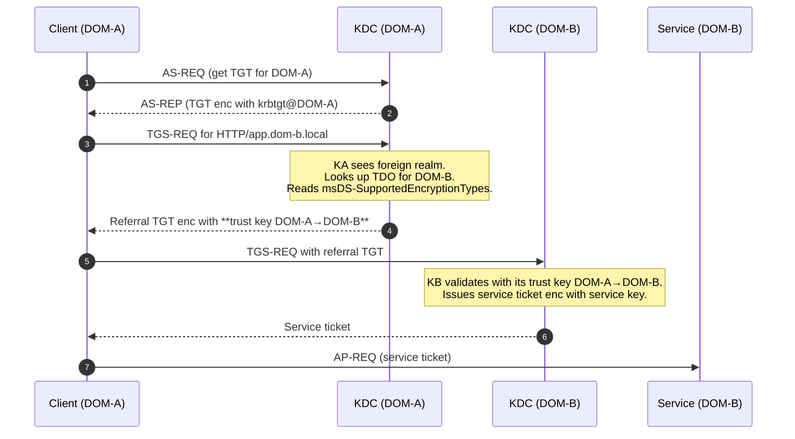
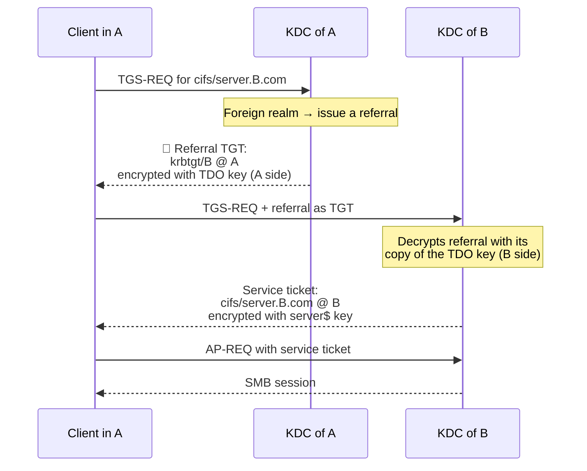
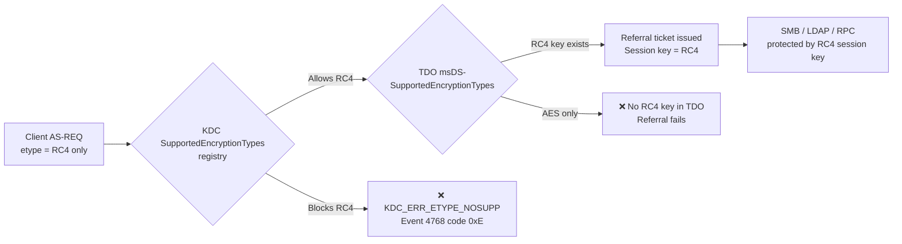
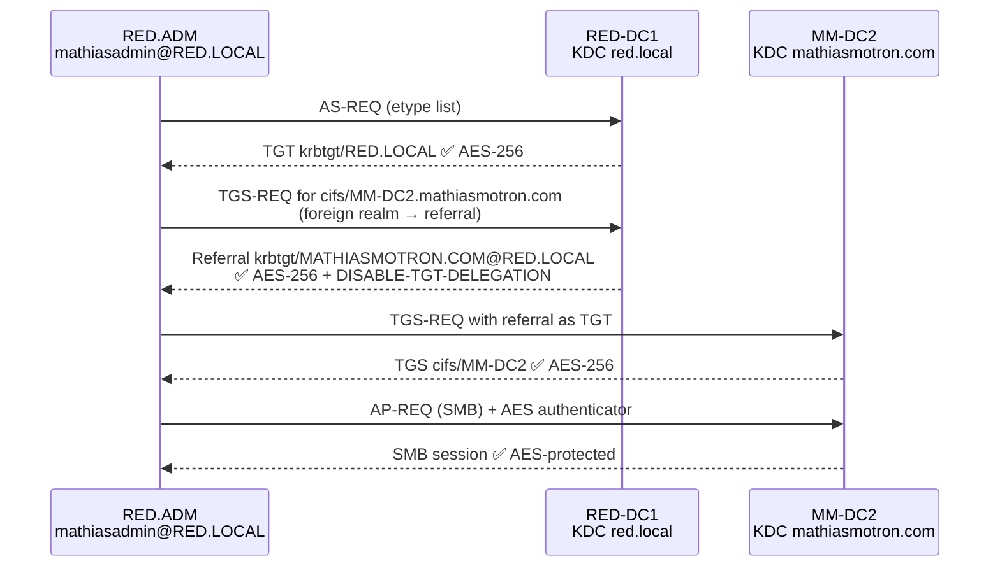

# Hardening Kerberos Encryption on Active Directory Trusts
🗓️ Published: 2026-05-21

## TL;DR

If you hardened Kerberos on your domain (KB5021131 / CVE-2022-37966) but never touched the **Trusted Domain Objects (TDOs)**, your forest still issues **RC4 referral tickets** across every trust. The directory looks clean, the DCs look clean, and yet event `4769` (Kerberos service ticket request) keeps showing RC4 for `krbtgt/REMOTE.LOCAL`. That is the gap this article closes.

> 🧠 **Quick primer — a Kerberos ticket carries two encrypted things.**
> A ticket is not a single blob: it is an envelope that contains a session key. Each layer is controlled by a different setting and protects against a different threat.
>
> | Layer | What it is | Controlled by | Protects against |
> |---|---|---|---|
> | **Ticket encryption** (`KerbTicket Encryption Type` in `klist`) | The envelope itself, sealed with the **long-term key of the destination server** — for a cross-realm referral, that key is the TDO key | `msDS-SupportedEncryptionTypes` on the **TDO** | Offline cracking of the trust key (a.k.a. trust kerberoasting) |
> | **Session key** (`Session Key Type` in `klist`) | An **ephemeral key** the KDC generates and embeds *inside* the ticket, used after authentication to protect SMB / LDAP / RPC traffic between client and server | What the client advertises in its request **+** the KDC GPO *Network security: Configure encryption types allowed for Kerberos* | Live cryptanalysis of the session traffic (RC4 weaknesses) |
>
> Hardening the TDO without hardening the KDC GPO closes the first threat and leaves the second one wide open. This is exactly the trap Labs 2 and 3 demonstrate.
>
> ```text
> ┌─────────────────────────────────────────────────────────────────┐
> │  Kerberos ticket (envelope sealed with the server long-term key)│
> │                                                                 │
> │   KerbTicket Encryption Type  ←  controlled by msDS-Supported   │
> │                                  EncryptionTypes on the TDO     │
> │                                                                 │
> │   ┌─────────────────────────────────────────────────────────┐   │
> │   │ Session key (used to protect SMB/LDAP/RPC after auth)   │   │
> │   │ Session Key Type   ←  controlled by what the client     │   │
> │   │                       advertises + the KDC GPO          │   │
> │   └─────────────────────────────────────────────────────────┘   │
> └─────────────────────────────────────────────────────────────────┘
> ```

- 🎯 **At the TDO layer, `msDS-SupportedEncryptionTypes` is the authoritative control for the referral enctype.** The GUI checkbox *"The other domain supports Kerberos AES Encryption"* is a *way to write* that attribute (it is not just decorative — see [The GUI checkbox](#the-gui-checkbox--the-other-domain-supports-kerberos-aes-encryption)), but it is opaque, sometimes greyed out, and slow to take effect. The KDC GPO default applies only to accounts whose attribute is unset — it does not override the TDO.
- 🔁 **Both sides of every trust must be updated**, and **the trust password must be rotated** afterwards so AES keys are actually materialized.
- 🧨 **Order matters.** Forgetting just one TDO leaves a downgrade path open. Tightening the KDC GPO (banning RC4 on the DCs) **before** all TDOs are hardened breaks cross-realm authentication. **TDO first, then KDC GPO.**
- 🪤 **TDO hardened ≠ trust hardened.** A TDO at `0x18` blocks RC4 on the referral ticket but does **not** block RC4 on the session key. You also need the GPO *Network security: Configure encryption types allowed for Kerberos* at `0x80000018` (AES128 + AES256 + future, RC4 removed) on the Domain Controllers OU. Demonstrated in [Lab 2](#lab-2--a-hardened-tdo-is-still-not-enough-forest-trust-to-a-red-forest-) and [Lab 3](#lab-3--a-production-forest-trust-stuck-in-transition-the-most-common-state-in-the-wild-).

---

## Why this matters 🔍

Kerberos hardening usually focuses on local accounts, with three well-known controls:

- 👤 **`msDS-SupportedEncryptionTypes`** on user accounts, computer accounts, and service accounts
- 🏛️ **`DefaultDomainSupportedEncTypes`** on the KDC (registry value applied to accounts whose attribute is unset)
- 📜 **GPO *Network security: Configure encryption types allowed for Kerberos*** applied to clients and DCs

Those controls are necessary, but they all operate **inside one domain**. The moment a ticket has to cross a trust, the rules change. The KDC stops looking at the user's account and starts looking at the **TDO of the destination realm**. If that TDO still allows RC4, the referral ticket goes out in RC4 — even if every other knob in the environment screams "AES only".

That is the trap. You harden the accounts, you harden the KDC, you harden the clients. You think you are done. And then a quick `klist` after a cross-forest logon shows a `krbtgt/REMOTE.LOCAL` ticket in `RC4_HMAC_MD5`, and you realize the trust has been silently downgrading the entire crypto story for years.

> 🕵️ **Threat angle.** Cross-realm RC4 is one of the favorite tools of red teamers: RC4 referral tickets are crackable offline (no salt, MD5-derived), the trust account password is rarely rotated in practice, and the resulting forged TGT can be reused to forge inter-realm tickets. This is the trust-key equivalent of a Golden Ticket — and it survives most "we did the AES migration" claims.

---

## Anatomy of a trust 🧠

### The Trusted Domain Object (TDO)

Every trust — forest, external, MIT realm, intra-forest parent/child, shortcut — is materialized in AD as a **`trustedDomain`** object living under `CN=System,DC=<domain>`. From an outsider's perspective, the trust is "a relationship between two domains". From AD's perspective, it is **two objects** (one per side), holding **passwords, attributes, and metadata**.

A trust has two TDOs because trust passwords are stored on **both sides** independently. The KDC of domain `A` knows the secret it shares with domain `B`. The KDC of domain `B` knows the same secret from the other side. The two sides must stay in sync, which is why rotating a trust password is more involved than rotating a regular account password.

### The key attributes

| Attribute | Role |
|---|---|
| `flatName` | Short NetBIOS name of the trusted domain |
| `trustPartner` | DNS name of the trusted domain |
| `trustDirection` | `1` = Inbound, `2` = Outbound, `3` = Bidirectional |
| `trustType` | `1` = downlevel/NT4, `2` = uplevel/AD, `3` = MIT realm, `4` = DCE (legacy) |
| `trustAttributes` | Bitmask: transitivity, forest, within-forest, MIT, **`0x100` = USES_AES_KEYS** |
| **`msDS-SupportedEncryptionTypes`** | **The bitmask that actually controls referral ticket encryption** |
| `whenChanged` | Useful proxy to know if the TDO was recently rotated |

### The trust password and its derived keys

A trust password is a long random secret negotiated when the trust is created. From this secret, AD **derives** multiple cryptographic keys, **one per supported encryption type**:

- DES-CBC-MD5 (`0x1`) — legacy
- DES-CBC-CRC (`0x2`) — legacy
- RC4-HMAC (`0x4`)
- AES128-CTS-HMAC-SHA1-96 (`0x8`)
- AES256-CTS-HMAC-SHA1-96 (`0x10`)

**Critical point:** changing `msDS-SupportedEncryptionTypes` only *declares* which enctypes are allowed. The corresponding **keys are only derived when the trust password is (re)set**. If you flip the attribute to "AES only" but never rotate the trust password, the KDC has nothing to encrypt the referral ticket with, and falls back to whichever key still exists — usually RC4.

This is the same mechanic as for regular service accounts after enabling AES on `msDS-SupportedEncryptionTypes`: the attribute promises, the secret rotation delivers.

#### The two-step nature of TDO hardening (declare → materialize)

This is subtle enough that it produces a third possible state of the TDO, halfway between "naked" and "really hardened", which is the **most dangerous** because it audits as green:

| State | `msDS-SupportedEncryptionTypes` | Keys actually present in `supplementalCredentials` | What the KDC ships in a referral |
|---|---|---|---|
| **A — Naked** | `0x0` (unset) or `0x4` (RC4) | RC4 (+ maybe DES) — no AES | RC4 referral. Crackable offline. |
| **B — Declared only** ⚠️ | `0x18` (AES) | **Still RC4 only** — no rotation happened after the flip | KDC has no AES key to use → either falls back to RC4 anyway, or fails with `KDC_ERR_ETYPE_NOSUPP` |
| **C — Really hardened** ✅ | `0x18` (AES) | AES128 + AES256 derived from the latest trust password | AES referral. Trust key effectively unrecoverable offline. |

The trap is **state B**: the audit script reads the attribute and reports `AES-only [OK]`, `Get-ADTrust -Properties msDS-SupportedEncryptionTypes` shows `0x18`, `ksetup /getenctypeattr remote.lab` lists only AES enctypes, third-party tooling (Quest, Semperis, Tenable, BloodHound) turns the trust green in their dashboards — but the long-term key material in `supplementalCredentials` is still the RC4 derived from a trust password that hasn't been rotated since 2017. An attacker capturing a referral ticket gets the same RC4 hash as if you had done nothing at all.

**Why this happens**

The keys in `supplementalCredentials` are derived from the **trust password at the moment of the password change**, using whatever enctypes were active at that moment. If you set the trust password in 2017 when the TDO allowed RC4, you derived an RC4 key. Flipping `msDS-SupportedEncryptionTypes` to `0x18` in 2026 changes the *policy* attached to the TDO, but **does not retroactively re-derive keys** from the existing password. No KDC, no replication, no scheduled task goes back and generates AES keys for you. The only event that produces fresh AES keys is a **password rotation** ([`netdom trust /Reset`](https://learn.microsoft.com/en-us/windows-server/administration/windows-commands/netdom-trust) or its `/ResetOneSide` variant) — which forces the LSA to re-derive *all* enctype keys from the new password, this time honoring the current attribute.

> 💡 **And no, automatic rotation does NOT save you.** Forest trusts and external trusts are **not** rotated automatically by Windows, contrary to a widespread belief. Only **intra-forest trusts** (parent/child, shortcut) are managed by NETLOGON on a 30-day cycle — and even those can stall silently when replication or connectivity is degraded. For any forest or external trust, the password is **exactly the one set at trust creation** (or at the last manual `netdom trust /Reset`). If you have not run `Reset` yourself, your 2017 trust still ships 2017 keys today. The [`netdom trust`](https://learn.microsoft.com/en-us/windows-server/administration/windows-commands/netdom-trust) reference confirms `/Reset` is the *manual* operation that rotates the secret — there is no built-in scheduler counterpart for inter-forest trusts.

**How to detect state B**

Three independent signals you can correlate:

1. **`whenChanged` on the TDO is older than the change to `msDS-SupportedEncryptionTypes`.** If the attribute change happened during this year's hardening campaign but `whenChanged` says 2021, you have not rotated since the flip.
2. **`klist` from a cross-realm access shows the referral's `KerbTicket Encryption Type` is RC4** (or the access fails with a Kerberos error in event `4769` when the KDC is GPO-restricted to AES). This is the runtime test — see Lab 2 Step 1 for what a *good* baseline looks like (AES-256 on the referral, confirming the keys are materialized).
3. **The 4769 event for `krbtgt/REMOTE @ LOCAL` shows `TicketEncryptionType=0x17`** (RC4-HMAC). This is the on-DC equivalent of signal #2 and is what the audit procedure in this article hunts for.

**How to fix it**

Always pair an attribute change with a trust password rotation, in the **same maintenance window**:

**Step 1 — declare the new policy on the TDO.** Pick *one* of the three equivalent forms (they all write the same `msDS-SupportedEncryptionTypes` attribute):

```cmd
:: Classic CLI — ksetup /setenctypeattr writes the LDAP attribute on the TDO
ksetup /setenctypeattr remote.lab AES256-CTS-HMAC-SHA1-96 AES128-CTS-HMAC-SHA1-96
```

```powershell
# PowerShell — same effect, scriptable
$tdo = (Get-ADTrust -Identity 'remote.lab').DistinguishedName
Set-ADObject -Identity $tdo -Replace @{ 'msDS-SupportedEncryptionTypes' = 0x18 }
```

```cmd
:: netdom — same effect, accepts remote credentials
netdom trust local.lab /Domain:remote.lab /EncType:AES256
```

**Step 2 — rotate the trust password to materialize the AES keys.**

```cmd
netdom trust local.lab /Domain:remote.lab /Reset /UserO:LOCAL\admin /PasswordO:* /UserD:REMOTE\admin /PasswordD:*
```

> ⚠️ **`/Reset` can briefly break the trust** if either side is unreachable or the credentials are wrong. Do it inside a maintenance window, and make sure both DCs (local and remote) are healthy and replicating. This is why the two steps belong to the same change ticket — you do not want to flip the attribute on Monday and discover on Friday that the rotation never happened.

**Step 3 — verify the rotation actually took place.**

```powershell
# whenChanged must be RECENT (within minutes of the Reset)
Get-ADTrust -Identity 'remote.lab' -Properties whenChanged, msDS-SupportedEncryptionTypes |
    Format-List Name, whenChanged, msDS-SupportedEncryptionTypes
```

A `whenChanged` timestamp that matches the moment you ran `/Reset` confirms the LSA wrote a new password and re-derived all enctype keys. Repeat the check on a DC of the **remote** side — it must also have a fresh `whenChanged`, otherwise the rotation only updated one side and the trust is half-rotated (a state worse than not having rotated at all).

The [Remediation procedure](#-remediation-procedure) section formalizes this as a four-step sequence — the rotation is **not** an optional follow-up, it is what turns a declarative `0x18` into actual AES cryptography on the wire.

> 🧠 **The rule.** `msDS-SupportedEncryptionTypes` is a **policy attribute**, not a key generator. AES keys appear in `supplementalCredentials` **only** when the trust password is (re)set with the attribute already in place. **Attribute without rotation = false sense of security.** Always treat the two changes as one atomic operation in the change ticket.

### The GUI checkbox — *"The other domain supports Kerberos AES Encryption"*

Found in *Active Directory Domains and Trusts* → trust properties → General tab.

This box is **the most misunderstood control in the entire trust-hardening discussion**, and that includes earlier drafts of this article. The truthful answer to *"what does it actually do?"* is: **it depends on the Windows version, and Microsoft has never fully documented its runtime semantics publicly.** What follows is the picture that emerges from cross-referencing the [MS-ADTS spec](https://learn.microsoft.com/en-us/openspecs/windows_protocols/ms-adts/) and observed lab behavior on multiple Windows Server versions.

| Era | Effective behavior of the checkbox |
|---|---|
| **Windows Server 2003 / 2008** | Sets `trustAttributes` bit `0x100` = `TRUST_ATTRIBUTE_USES_AES_KEYS`. Legacy KDCs consult this bit when deriving the trust referral key |
| **Windows Server 2012 R2 → November 2022** | In addition to the `0x100` bit, checking the box also writes AES-allowing values into `msDS-SupportedEncryptionTypes` on the TDO. This second effect is **not documented in MS-ADTS** but is consistently reproducible in lab and is the mechanism by which the referral TGS actually starts using AES. The change is **not instant** — labs have reported needing one or two DC reboots before the new enctype was effectively honored on referrals |
| **Windows Server 2012 R2 onwards, post-November 2022 (KB5021131 / CVE-2022-37966)** | Microsoft changed Windows to **assume AES support by default on trusts**, regardless of the checkbox state. See [Beyond RC4 for Windows Authentication (Microsoft, Dec 2025)](https://www.microsoft.com/en-us/windows-server/blog/2025/12/03/beyond-rc4-for-windows-authentication/). The checkbox still writes the underlying attributes, but the runtime KDC no longer strictly depends on them to attempt AES |

**A note on availability.** The checkbox is **frequently greyed out** — most commonly because the trusted forest's DFL is too low, or because the trust type does not support it (e.g., an external trust to a non-Windows realm). When greyed out, the only way to declare AES on the TDO is via the LDAP attribute directly (`ksetup /setenctypeattr`, `Set-ADObject`, or `netdom trust /EncType`).

**Why this matters for hardening in 2026.**

1. **The checkbox is not a placebo.** A widespread internet claim (including an earlier draft of this article) was that it only sets the `0x100` bit and does nothing else. Microsoft engineering discussions and lab behavior contradict this — it also touches `msDS-SupportedEncryptionTypes`, at least on Windows Server 2012 R2 and later. Always read both `trustAttributes` and `msDS-SupportedEncryptionTypes` **after** clicking it to know what it actually wrote.
2. **The checkbox is not sufficient hardening either.** It writes the policy attribute, but it does **not** rotate the trust password — so the AES keys may not be materialized in `supplementalCredentials` even if the attribute is set. You still need a `netdom trust /Reset` (see [How to fix it](#how-to-fix-it)).
3. **Prefer the LDAP attribute path for scripted, auditable change.** `ksetup /setenctypeattr` and `Set-ADObject` are explicit about *what value you wrote*, are scriptable, and take effect on the next LSA refresh without the multi-reboot delay reported with the GUI path. The checkbox is fine for a one-off, but a `Get-ADTrust -Properties msDS-SupportedEncryptionTypes, trustAttributes` afterwards is mandatory either way.

**Bottom line.** The checkbox is a legitimate (if opaque and slow) way to declare AES on a trust. It is **not** purely cosmetic, but it is **not** a magic AES switch either — without a follow-up password rotation, the declaration remains paper-only. And on post-November-2022 Windows, the checkbox state is becoming progressively irrelevant to the *runtime* KDC decision, even though it still controls the *declared* state seen by directory tooling.

#### Side-by-side summary of trust-hardening tools

| Tool | What it actually does | "Is the trust hardened?" answer |
|---|---|---|
| GUI checkbox *"The other domain supports Kerberos AES Encryption"* | Sets `trustAttributes` bit `0x100`; on Windows Server 2012 R2+ also touches `msDS-SupportedEncryptionTypes` (undocumented but reproducible). Slow to take effect, sometimes greyed out, no rotation | ⚠️ Writes the policy attribute, but a `Get-ADTrust` verification + a password rotation are still required |
| `Get-ADTrust -Properties msDS-SupportedEncryptionTypes` | Reads the TDO attribute | ✅ Authoritative for the declared policy |
| `ksetup /getenctypeattr <realm>` | Reads the same TDO attribute via the LSA API | ✅ Authoritative for the declared policy |
| Runtime `klist` cross-realm test | Shows the **actual** `KerbTicket Encryption Type` and `Session Key Type` on a real referral | ✅ Only way to confirm AES keys are *materialized* and sessions are *negotiated* in AES |

> 🪤 **The one-liner.** *Anything that does not name `msDS-SupportedEncryptionTypes` on the TDO is a distraction. Anything that does, but does not verify a fresh `whenChanged` after a rotation, is incomplete. Only a runtime `klist` from a cross-realm access confirms the trust is actually hardened on the wire.*

### The Kerberos cross-realm flow



The enctype of the **referral TGT** in step 4 is the one that depends on the TDO. If the TDO allows only RC4, that referral TGT is RC4. End of story.

---

## All trust types side by side 📊

| Type | `trustType` | Typical `trustAttributes` | Transitive? | Where do the TDOs live? | AES on the wire? |
|---|---|---|---|---|---|
| **Forest trust** | `2` (`UPLEVEL` / AD) | `0x8` = `FOREST_TRANSITIVE`, optionally `+0x4` (`QUARANTINED`) or `+0x100` (`USES_AES_KEYS`) | ✅ Within forests | Root domain of each forest | Yes if `msDS-SupportedEncryptionTypes` is set on **both** TDOs + password rotated since |
| **External trust** | `2` (`UPLEVEL` / AD) | `0x0` (legacy) or `+0x4` (`QUARANTINED`) or `+0x40` (`TREAT_AS_EXTERNAL`) | ❌ | Each participating domain | Yes if both TDOs are configured. Most often left in the legacy `0x0` state and forgotten |
| **Realm trust (MIT / Heimdal)** | `3` (`MIT`) | `0x1` (`NON_TRANSITIVE`) by default; can be created transitive | Variable (set at creation) | Local domain only — the remote side is non-Windows | Depends on the MIT KDC's `krb5.conf` enctypes **and** the Windows TDO's `msDS-SupportedEncryptionTypes`. Both must agree |
| **Parent ↔ Child (intra-forest)** | `2` (`UPLEVEL` / AD) | `0x20` = `WITHIN_FOREST` | ✅ Auto | Each domain in the forest | Yes if `msDS-SupportedEncryptionTypes` is set. Auto-created TDOs are **not** automatically modernized — they keep whatever was the default when the forest was built |
| **Shortcut / Cross-link trust** | `2` (`UPLEVEL` / AD) | `0x20` = `WITHIN_FOREST` | ✅ | Each domain involved | Same constraints as parent/child |

> 💡 **Yes, intra-forest trusts count.** A forest built on Windows Server 2008 schema and never reset to AES still carries RC4 trust keys between every parent and every child. Auto-created does **not** mean auto-modernized.

> 📖 **What is `trustAttributes`, really?** It is the **structural/identity bitmask of the trust** — it describes *what kind of trust this is* (transitive, intra-forest, external, realm) and *which security behaviors are turned on* (SID filtering with `0x4 QUARANTINED`, anti-rebound transitivity with `0x40 TREAT_AS_EXTERNAL`, selective auth, etc.). It is **not** a cryptographic policy attribute. The one historical exception is bit `0x100 USES_AES_KEYS` — added back when there was no other place to declare AES on a trust — which is why it confuses everyone. The cryptographic policy lives in `msDS-SupportedEncryptionTypes`, not here. Full bit list in [\[MS-ADTS\] 6.1.6.7.9 trustAttributes](https://learn.microsoft.com/en-us/openspecs/windows_protocols/ms-adts/e9a2d23c-c31e-4a6f-88a0-6646fdb51a3c).

---

## The 2 things that actually matter: policy + materialization 🛠️

Strip away the GUI, the third-party reports, the legacy attributes, and what is left when you ask *"is this trust hardened to AES?"* are **two** cryptographic questions:

1. **What enctypes is the KDC *allowed* to put on the wire for this trust?** → `msDS-SupportedEncryptionTypes`
2. **Do the corresponding AES keys actually *exist* in `supplementalCredentials`?** → trust password rotation

Everything else — the GUI checkbox, `trustAttributes` bit `0x100`, the KDC GPO default — is either a *way to write* one of these two things, or a *declarative marker* read by tooling. Neither of them is itself a third control point.

### Control 1 — `msDS-SupportedEncryptionTypes` (the policy)

- **Where**: attribute on the TDO in `CN=System,DC=<domain>`
- **Type**: bitmask (`0x1` DES-CBC-CRC, `0x2` DES-CBC-MD5, `0x4` RC4, `0x8` AES128, `0x10` AES256)
- **What it does**: tells the local KDC *"when issuing a referral ticket for this trust, use one of these enctypes"*
- **Hardened value**: `0x18` = AES128 + AES256
- **Who reads it**: the local KDC at ticket-issuance time, on every cross-realm referral
- **How to write it**: `ksetup /setenctypeattr`, `Set-ADObject`, `netdom trust /EncType`, or the GUI checkbox (see [The GUI checkbox](#the-gui-checkbox--the-other-domain-supports-kerberos-aes-encryption))

This is the **policy attribute**. Without it set correctly on **both** sides of the trust, AES never happens — no matter what any other knob says.

### Control 2 — the trust password rotation (the materialization)

- **Where**: stored on both sides of the trust, in the TDO and in the LSA secrets, with per-enctype derived keys in `supplementalCredentials`
- **Default rotation cadence**: 30 days — but **never automatic** on forest and external trusts (see the [💡 callout in Anatomy of a trust](#anatomy-of-a-trust-))
- **What it does**: derives the per-enctype keys from the shared secret. If the password has not been rotated since `msDS-SupportedEncryptionTypes` was widened to include AES, **no usable AES key exists**, regardless of what the attribute says
- **How to trigger it**: `netdom trust <local> /Domain:<remote> /Reset /PasswordT:<password>`

This is the **materialization step**. The policy attribute is just a label until the password rotation actually generates the AES keys derived from it.

> 🧠 **Policy without materialization = false sense of security.** A TDO at `msDS-SupportedEncryptionTypes = 0x18` whose `whenChanged` predates the policy change still has only RC4 keys in `supplementalCredentials`. The KDC sees AES declared, tries AES, finds no key, and **silently falls back to RC4** on the wire. Verify both attributes **and** a fresh `whenChanged` after rotation — and confirm with a runtime `klist` from a real cross-realm access.

### And `trustAttributes` bit `0x100`? Not a control point — a declarative marker

The famous GUI checkbox bit (`USES_AES_KEYS`) **is not** a third cryptographic control. On Windows Server 2012 R2 and later, the modern KDC does not consult it to choose the referral enctype — it reads `msDS-SupportedEncryptionTypes` directly. Since the November 2022 update (KB5021131), Windows even assumes AES support on trusts by default regardless of the bit's state.

What the bit still does:

- It is **read by directory tooling** (Quest, Semperis, Tenable, BloodHound, AD reports) to fill the "AES enabled" column
- It is **written by the GUI checkbox**, alongside `msDS-SupportedEncryptionTypes` (the checkbox modifies both)
- It is **part of the trust's declared identity**, in the same way as `WITHIN_FOREST` or `QUARANTINED` — descriptive, not operational

Treat the bit as a *flag for humans and report tools*, not as a runtime KDC control. The full discussion of what the GUI checkbox actually writes lives in [The GUI checkbox](#the-gui-checkbox--the-other-domain-supports-kerberos-aes-encryption).

---

## How DC-side hardening interacts with trust TDOs 💥

There are three classic "I hardened Kerberos on the DCs" patterns, and each one interacts differently with stale trust TDOs. Two of them (B and C) can break cross-realm authentication overnight if the TDOs were not modernized first; one of them (A) silently does nothing for trusts and is often mistaken for a hardening win.

### Scenario A — Setting `DefaultDomainSupportedEncTypes = 0x18` on the DCs

`HKLM\SYSTEM\CurrentControlSet\Services\Kdc\DefaultDomainSupportedEncTypes = 0x18`

- This value is consulted by the KDC **only for accounts where `msDS-SupportedEncryptionTypes` is unset or `0`** — it is a *fallback default*, not an override
- TDOs almost always have `msDS-SupportedEncryptionTypes` explicitly set (the trust creation wizard writes a value, even if it is the historical `0x4` RC4-only)
- **Outcome**: this registry has **no practical effect on trusts**. Whatever is on the TDO wins
- **Symptom**: nothing breaks, nothing improves. The "hardening" exists only on paper. Tooling that reads the registry will report "AES enforced", while the trust referral stays in RC4

### Scenario B — GPO *Network security: Configure encryption types allowed for Kerberos* set to AES only

This GPO writes `HKLM\SYSTEM\CurrentControlSet\Control\Lsa\Kerberos\Parameters\SupportedEncryptionTypes`. **A DC plays two distinct Kerberos roles** and this single registry value governs only one of them:

| Role | Registry value consulted |
|---|---|
| DC acting as **KDC** (issuing tickets) | `Services\Kdc\DefaultDomainSupportedEncTypes` (scenario A) — and the per-account `msDS-SupportedEncryptionTypes` on each principal it issues tickets for |
| DC acting as **Kerberos client** (talking to another realm's KDC, presenting tickets, decrypting referrals it receives) | `Control\Lsa\Kerberos\Parameters\SupportedEncryptionTypes` — this is what the GPO sets |

So when this GPO is tightened to AES-only:

- The DC, **as a client**, refuses to accept or decrypt a referral TGT encrypted in RC4
- Cross-realm authentication breaks the moment a TDO still hands out an RC4-encrypted referral
- **Symptom**: `KDC_ERR_ETYPE_NOSUPP` (0xE) in event `4769` with `Target Name: krbtgt/REMOTE.LOCAL`, often followed by silent NTLM fallback (event `4624` Logon Type 3 with `Authentication Package: NTLM`)
- **Order matters**: always upgrade all TDOs to `msDS-SupportedEncryptionTypes = 0x18` **and** rotate their passwords *before* enforcing this GPO. The reverse order is one of the most common ways to take down a forest's Monday morning logon spike

### Scenario C — Enabling enforcement modes for the November 2022 Kerberos patches

Two CVEs were released in November 2022 and are frequently confused with each other:

| CVE | Patch family | What enforcement does | How a stale-RC4 trust trips it |
|---|---|---|---|
| **CVE-2022-37966** | Kerberos RC4 weakness (Elevation of Privilege) | Sets the runtime default to **assume AES support** on trusts and on accounts, even when `msDS-SupportedEncryptionTypes` is unset. Publicly documented by Microsoft in [*Active Directory Hardening Series — Part 4*](https://techcommunity.microsoft.com/t5/core-infrastructure-and-security/active-directory-hardening-series-part-4-enforcing-aes-for/ba-p/4114965): *"Previously it was necessary to enable AES in the trust settings. Otherwise RC4 was used for the referral tickets. That is no longer necessary given referral tickets will now default to AES."* | A trust whose TDO password has not been rotated since AES was declared has **no AES key** in `supplementalCredentials`. The KDC tries AES, finds no key, and the referral fails with `KDC_ERR_ETYPE_NOSUPP` (0xE) |
| **CVE-2022-37967** | Kerberos PAC signature weakness | Enables `KrbtgtFullPacSignature` enforcement — the KDC now requires a full PAC signature on cross-realm referrals | A trust that has not been reset since the patch may not produce a valid signature; cross-realm logons fail with PAC-validation errors (typically `KDC_ERR_PADATA_TYPE_NOSUPP` / `KDC_ERR_GENERIC` or event `14` on the validator side) |

**Symptom common to both**: cross-realm logons that worked yesterday start failing today. Operators often blame DNS, replication, or "the other team", because nothing visibly changed on their side — the change was a patch deployment that flipped from *audit* mode to *enforcement* mode. See Microsoft's guidance in [KB5021131](https://support.microsoft.com/en-us/topic/kb5021131-how-to-manage-the-kerberos-protocol-changes-related-to-cve-2022-37966-fd837ac3-cdec-4e76-a6ec-86e67501407d) for the timeline and `RegistryKey` knobs.

**Mitigation order**: refresh every TDO (`msDS-SupportedEncryptionTypes = 0x18` + `netdom trust /Reset`) **before** the enforcement deadline. Once the AES key is materialized on both sides and the password is fresh, both CVE-2022-37966 and CVE-2022-37967 enforcement become non-events.

### Symptom → cause mapping

| Symptom | Likely cause | Where to look |
|---|---|---|
| Cross-domain logon works but **feels slow** | Kerberos cross-realm failing, falling back to NTLM | Event `4625` on the target server, `4624` Logon Type 3 with `NTLM` package |
| `klist` shows TGT cross-realm in `RC4_HMAC_MD5` | Remote TDO still RC4-only **or** trust password not rotated since AES enablement | `Get-ADTrust -Properties msDS-SupportedEncryptionTypes`, `whenChanged` on the TDO |
| Event `4769` with `Failure code 0xE`, target `krbtgt/REMOTE.LOCAL` | Client refuses RC4, TDO offers RC4 | TDO on the source side + GPO Kerberos enctype on the client/DC |
| Event `4769` `Failure code 0xD` (`KDC_ERR_BADOPTION`) on cross-realm | Often related to trust attributes / forest routing, not enctype | `trustAttributes`, `msDS-TrustForestTrustInfo` |

---

## The referral ticket — the only thing that crosses the trust 🎫

Every conversation about trust hardening eventually comes back to the same artefact: the **referral ticket**. It is the only Kerberos object that physically crosses the boundary between two realms, it is the only thing encrypted with the trust's long-term key, and it is the one piece of material an attacker can capture passively. Understanding it is the prerequisite for understanding why `msDS-SupportedEncryptionTypes` on the TDO matters at all.

### What a referral actually is

When a client in realm `A` wants to talk to a service `cifs/server.B.com` in realm `B`, the KDC of `A` **cannot** issue the final service ticket itself. It does not know the long-term key of the machine account `server$` in domain `B`. So Kerberos handles cross-realm authentication with a relay step:



The referral is just a special TGT. Its `Server` field is `krbtgt/<REMOTE_REALM> @ <LOCAL_REALM>`, and that exact format is the signature you spot in `klist`:

```
Server: krbtgt/MATHIASMOTRON.COM @ RED.LOCAL    ← this is a referral
Server: cifs/MM-DC2.mathiasmotron.com @ ...     ← this is a final service ticket
```

The referral is encrypted with a **per-enctype key derived from the trust password** of the TDO — specifically, with the version of that derived key whose enctype is chosen by the issuing KDC according to its `msDS-SupportedEncryptionTypes`. The password itself never leaves the LSA secrets; what is on the wire is the ticket, sealed with the derived key. **That derived key is what AES on the TDO actually protects.**

### Referrals across topologies

Different trust topologies generate different referral chains, but the principle is identical — every hop emits one referral, each sealed by its corresponding TDO key:

| Topology | Referral chain | Hops |
|---|---|---|
| Intra-forest parent ↔ child | 1 referral, direct | 1 |
| Intra-forest between two children (`a.foo.com` → `b.foo.com`) | Two referrals via the forest root TDOs (unless a shortcut trust exists) | 2 |
| Forest trust (direct) | 1 cross-forest referral | 1 |
| Shortcut trust | 1 direct referral (bypasses the transitive chain) | 1 |
| External trust (domain-to-domain, non-transitive) | 1 referral, no further hops allowed | 1 |
| MIT realm trust | 1 referral toward the MIT realm, **no PAC** | 1 |

A client crossing three trusts to reach a resource generates **three referrals**, each one independently encrypted with a different TDO key. Hardening one TDO in the chain and forgetting the others leaves a downgrade path open at the weakest link.

### Why the referral is the *only* thing that crosses

It is worth spelling out, because this is the crypto-architectural property that makes TDO hardening necessary:

- The **client's user password** never crosses the trust — it lives only in `ntds.dit` of realm `A`
- The **`krbtgt` key of A** never crosses the trust — it stays in realm `A`
- The **`krbtgt` key of B** never crosses the trust — it stays in realm `B`
- The **machine account key of `server$`** never crosses the trust — it stays in realm `B`

The **TDO key** is the only secret **shared** between the two realms (in two copies, one per side). And the **referral ticket** is the only Kerberos object that physically traverses that shared boundary. If you can crack the TDO key, you have effectively replicated the trust on the attacker side.

### Trust kerberoasting — same algorithm, different principal

There is an exact parallel between the classical kerberoasting of a service account and what one can do against a TDO:

| Aspect | Classical kerberoasting | Trust kerberoasting |
|---|---|---|
| Target principal | Service account with SPN | TDO (cross-realm principal) |
| Captured artefact | TGS-REP for the SPN | Referral TGT (`krbtgt/REMOTE@LOCAL`) |
| Encryption algorithm if RC4 was negotiated | RC4-HMAC-MD5 over the service key | RC4-HMAC-MD5 over the TDO key |
| Offline crack mode | Hashcat mode `13100` (`Kerberos 5, etype 23, TGS-REP`) | Same mode `13100` — only the principal differs |
| Payoff | Impersonate that one service | Forge inter-realm TGTs, decrypt past and future referrals until next trust password rotation |
| Mitigation | `msDS-SupportedEncryptionTypes = 0x18` on the service + long random password | `msDS-SupportedEncryptionTypes = 0x18` on the TDO + trust password rotation |

The cryptography is identical — same key derivation, same offline crack pattern. What changes is the **scope of the prize**: a service account compromise affects one service; a TDO compromise affects every cross-realm authentication, in both directions, until the next trust password rotation. And since trust passwords are not rotated automatically on most legacy trusts, "until next rotation" often means "for years".

### The asymmetry that catches people out

The referral is encrypted by the KDC that **issues** it, using **that side's** copy of the TDO key. Concretely, in a bidirectional trust between A and B:

- Traffic `A → B`: referral issued by KDC of A, encrypted with the A-side TDO key, whose enctype is governed by `msDS-SupportedEncryptionTypes` on the **A-side TDO**.
- Traffic `B → A`: referral issued by KDC of B, encrypted with the B-side TDO key, whose enctype is governed by `msDS-SupportedEncryptionTypes` on the **B-side TDO**.

So hardening one TDO does not protect the reverse direction. **Both TDOs must be hardened**, on both sides of the trust.

```text
                  Forest A                                Forest B
  ┌─────────────────────────┐                  ┌─────────────────────────┐
  │ TDO of B in A          │                  │ TDO of A in B          │
  │ msDS-SET = ?  ────────┼── A → B referral ──→ │ (KDC of B decrypts)    │
  │                       │                  │                       │
  │ (KDC of A decrypts) ← ┼── B → A referral ────│ msDS-SET = ?  ────────│
  └─────────────────────────┘                  └─────────────────────────┘
         Issues A→B referrals,             Issues B→A referrals,
         decrypts B→A referrals            decrypts A→B referrals
```

The **A-side TDO** governs the enctype of every `A → B` referral. The **B-side TDO** governs the enctype of every `B → A` referral. They are independent attributes on independent objects in independent directories, and they can drift out of sync — which is exactly the asymmetry observed between `mathiasmotron.com` and `red.local` in [Lab 2](#lab-2--a-hardened-tdo-is-still-not-enough-forest-trust-to-a-red-forest-).

The audit script in this article reads only the local TDO — you must run it on both forests to get the complete picture.

### One-line summary

> 🎫 **The referral ticket is the only Kerberos object that crosses a trust. AES on the TDO ensures that this single object is sealed with an unbreakable long-term key. Without it, the trust password is one passive capture away from being cracked offline.**

---

## Lab 1 — `KerbTicket Encryption` vs `Session Key` on an intra-forest trust 🧪

This is the single biggest source of false confidence in trust hardening: an admin runs `klist` after a cross-domain access, sees `AES-256-CTS-HMAC-SHA1-96` on every ticket, and concludes the trust is hardened. **It is not.** `klist` shows two encryption-related fields per ticket, and they answer **completely different questions**.

### Setup

The lab used below has the following layout:

- Parent domain: `mathiasmotron.com` — DCs `MM-DC2`, `MM-DC3`
- Child domain: `child.mathiasmotron.com` — DC `MM-DC4`
- Intra-forest parent/child trust (`trustAttributes = 0x20 = WITHIN_FOREST`)
- TDO `msDS-SupportedEncryptionTypes` is **unset (`0x0`)** — the default state nobody ever changes
- Test user: `darth.vader@mathiasmotron.com`, logging on from a workstation joined to the parent

> 💡 **Why does the baseline below show AES-256 if the TDO is at `0x0`?** Since the November 2022 KB5021131 patch (CVE-2022-37966), Windows KDCs **assume AES support on trusts by default**, even when `msDS-SupportedEncryptionTypes` is unset. See [The GUI checkbox](#the-gui-checkbox--the-other-domain-supports-kerberos-aes-encryption) for the full timeline. This is what lets the baseline tickets below come out AES-256 despite the TDO being at `0x0` — and it is also what makes the downgrade in Step 2 so easy: nothing on the TDO actively forbids RC4 when a client asks for it.

### Step 1 — Baseline observation

A normal client, no tweaks, accesses a share on the child DC:

```powershell
klist purge
Test-Path "\\mm-dc4.child.mathiasmotron.com\sysvol"
klist
```

Relevant tickets:

```
#0> Server: krbtgt/CHILD.MATHIASMOTRON.COM @ MATHIASMOTRON.COM
    KerbTicket Encryption Type: AES-256-CTS-HMAC-SHA1-96
    Session Key Type:           AES-256-CTS-HMAC-SHA1-96
    Kdc Called: MM-DC2.mathiasmotron.com

#2> Server: cifs/MM-DC4.child.mathiasmotron.com @ CHILD.MATHIASMOTRON.COM
    KerbTicket Encryption Type: AES-256-CTS-HMAC-SHA1-96
    Session Key Type:           AES-256-CTS-HMAC-SHA1-96
    Kdc Called: MM-DC4.child.mathiasmotron.com
```

Everything is AES-256. Easy conclusion: "the trust is fine." **This conclusion is wrong**, and the next step proves it.

### Step 2 — A legacy-acting client

Without touching the trust at all, simulate a client that only advertises RC4 in its Kerberos requests (think: an old Windows 7 box, a misconfigured Linux SSSD client, a third-party SSO appliance, or an attacker-controlled host).

> ⚠️ **Lab only.** The registry value below forces the client to advertise **only RC4** in its Kerberos `etype` field. Use it on a throw-away test workstation and revert it immediately after — see [Cleanup after the lab test](#cleanup-after-the-lab-test). Never apply this on a production host.

On the test workstation, in an elevated PowerShell session:

```powershell
$path = 'HKLM:\SYSTEM\CurrentControlSet\Control\Lsa\Kerberos\Parameters'
New-Item -Path $path -Force | Out-Null
# 0x4 = RC4-HMAC only (bit for AES128 = 0x8, AES256 = 0x10 are intentionally omitted)
Set-ItemProperty -Path $path -Name 'SupportedEncryptionTypes' -Value 0x4 -Type DWord

# LSASS only reads this value on cold start — reboot is the cleanest reset
Restart-Computer
```

After reboot, log on again as the same user, then redo the exact same access:

```powershell
klist purge
Test-Path "\\mm-dc4.child.mathiasmotron.com\sysvol"
klist
```

Same tickets, but look at the two encryption fields side by side:

```
#0> Server: krbtgt/CHILD.MATHIASMOTRON.COM @ MATHIASMOTRON.COM
    KerbTicket Encryption Type: AES-256-CTS-HMAC-SHA1-96   ← unchanged
    Session Key Type:           RSADSI RC4-HMAC(NT)         ← DOWNGRADED
    Kdc Called: MM-DC2.mathiasmotron.com

#2> Server: cifs/MM-DC4.child.mathiasmotron.com @ CHILD.MATHIASMOTRON.COM
    KerbTicket Encryption Type: AES-256-CTS-HMAC-SHA1-96   ← unchanged
    Session Key Type:           RSADSI RC4-HMAC(NT)         ← DOWNGRADED
    Kdc Called: MM-DC4.child.mathiasmotron.com
```

The access still succeeds. Every ticket is still "AES-256" in the field most admins look at. **But every session is in fact protected by RC4.**

### Side-by-side observation

| Field on the ticket | Normal client | Downgraded client | Who controls it |
|---|---|---|---|
| `KerbTicket Encryption Type` | AES-256 | AES-256 | The **server's long-term key** (TDO for the referral, machine account for the service ticket). The client has no say. |
| `Session Key Type` | AES-256 | **RC4-HMAC** | The **enctypes the client advertises** in its AS-REQ / TGS-REQ. The KDC picks the strongest one the client claims to support. |

### Why these two fields are different

- **`KerbTicket Encryption Type`** is the algorithm used to encrypt the **ticket itself**. The ticket is sealed with the long-term key of the server principal: the TDO key for a referral ticket, the machine account key for a service ticket. The server has to be able to decrypt its own ticket, so the KDC has no choice — it picks from the enctypes for which a long-term key exists in `supplementalCredentials` for that principal.

- **`Session Key Type`** is the algorithm used for the **ephemeral key** that the KDC generates and embeds *inside* the ticket so the client and the server can talk securely afterwards. The KDC chooses this enctype from the **client's announced supported types**. If the client says "I only do RC4", the KDC generates an RC4 session key — even when the server-side ticket itself is AES.

### Why the downgrade matters

The session key is what protects everything after the ticket presentation:

- The Kerberos **authenticator** in the AP-REQ is encrypted with it.
- The **PAC signature** (well, one of them) uses it.
- The **SMB session signing / encryption keys**, the **LDAP signing keys**, and any application-level Kerberos-derived secret are **derived from this session key**.

In the lab capture above, the actual SMB traffic between the workstation and `MM-DC4` was protected by an RC4-derived key, even though every ticket on disk showed AES-256. A passive attacker observing the wire saw RC4-encrypted SMB. An active attacker positioned for downgrade saw the whole exchange use a stream cipher with well-known biases.

> 🧠 **The rule to remember.**
> `KerbTicket Encryption Type` reflects what the **server can decrypt**.
> `Session Key Type` reflects what the **client said it can decrypt**.
> The KDC honors the **weakest** of the two demands. `klist` showing AES-256 in the ticket field is **not** a proof of hardening.

### What it would take to block the downgrade

Three different controls — none of them alone is sufficient.



| Control | Where | Scope | Stops the downgrade above? |
|---|---|---|---|
| `msDS-SupportedEncryptionTypes = 0x18` on the TDO | TDO in AD | Per-trust | ⚠️ **Partially.** Removes the RC4 long-term key from the TDO **after the next trust password rotation**, so the *KerbTicket* field can no longer be RC4. But the *session key* can still be RC4 if the KDC is allowed to issue one. |
| `SupportedEncryptionTypes = 0x18` on the KDC's `HKLM\SOFTWARE\Microsoft\Windows\CurrentVersion\Policies\System\Kerberos\Parameters` (via the GPO **Network security: Configure encryption types allowed for Kerberos**) | KDC (every DC) | Per-DC | ✅ **Yes.** The KDC will refuse any AS-REQ / TGS-REQ that does not include AES in the `etype` list — event `4768` / `4769` with `Result Code 0xE` (`KDC_ERR_ETYPE_NOSUPP`). |
| The same GPO applied to **clients** | Clients | Per-client | ✅ Belt and braces — the client physically cannot advertise RC4. |

### Event IDs to watch during the rollout

| Event | Channel | Meaning during a hardening rollout |
|---|---|---|
| `4768` `Result Code 0xE` | DC Security log | `KDC_ERR_ETYPE_NOSUPP` — KDC refused to issue a TGT because no acceptable enctype intersection. Expected on legacy clients once you enable AES-only on the KDC. |
| `4769` `Failure code 0xE` | DC Security log | Same, on the service ticket request. The `Service Name` field tells you whether the failure is on a normal account or on `krbtgt/REMOTE.LOCAL` (cross-realm). |
| `4769` `Failure code 0xD` | DC Security log | `KDC_ERR_BADOPTION` — sometimes seen during cross-realm transitions, often a routing / trust attribute issue, not enctype. |
| `5805` | NETLOGON, DC | The trust password could not be verified — typical of a half-rotated trust. |

### Cleanup after the lab test

The registry value forced on the test client in Step 2 must be removed — leaving an RC4-only client lying around is a self-inflicted vulnerability. On the same test workstation, in an elevated PowerShell session:

```powershell
$path = 'HKLM:\SYSTEM\CurrentControlSet\Control\Lsa\Kerberos\Parameters'
Remove-ItemProperty -Path $path -Name 'SupportedEncryptionTypes' -ErrorAction SilentlyContinue
Restart-Computer
```

After reboot, validate the cleanup:

```powershell
klist purge
Test-Path "\\mm-dc4.child.mathiasmotron.com\sysvol"
klist
```

Both `KerbTicket Encryption Type` **and** `Session Key Type` should now be back to AES-256 on every ticket. If a `Session Key Type` still shows RC4, the registry value is still in effect or a GPO is re-applying it — check `gpresult /h` and the `Network security: Configure encryption types allowed for Kerberos` policy.

> 🛡️ **Operational consequence for this article.**
> Hardening the TDOs (the focus of the [Remediation procedure](#-remediation-procedure) below) is necessary but not sufficient. To fully eliminate RC4 across a trust, you also need the **KDC-side** enforcement (`SupportedEncryptionTypes = 0x18` on every DC) so the KDC actively refuses to mint RC4 session keys, even for clients that ask for them.

---

## Lab 2 — A hardened TDO is still not enough (forest trust to a Red Forest) 🧪

The Lab 1 setup left an obvious question open: *"that downgrade worked because the TDO was at `0x0` — what if the TDO is properly hardened to `0x18`?"* This lab answers that question on a real forest trust, with a non-trivial topology, and the result is uncomfortable: **the TDO attribute alone does not block the session key downgrade**. The only thing that actually closes the pattern is **KDC-side enforcement**.

### Setup

The lab uses an **ESAE-style Red Forest** layout — the kind of architecture that is supposed to be the gold standard for Tier 0 protection:

- Production forest `mathiasmotron.com` — DCs `MM-DC2`, `MM-DC3`
- Admin forest `red.local` — DC `RED-DC1`
- **One-way forest trust**: `mathiasmotron.com` trusts `red.local` (Outbound on the prod side, Inbound on the red side)
- `trustAttributes` on the prod-side TDO: `0x458` = `FOREST_TRANSITIVE | CROSS_ORGANIZATION | TREAT_AS_EXTERNAL | PIM_TRUST`
- `msDS-SupportedEncryptionTypes` on the TDO: **`0x18` (AES only) on the red side**, **`0x0` (unset) on the prod side**
- Workstation: `RED.ADM.red.local`, user `RED\mathiasadmin`
- Resource targeted from RED: `\\MM-DC2.mathiasmotron.com\sysvol`

> 🧠 **Why the asymmetry on the TDO matters.** A trust has *two* TDOs, one per side, and each one is configured independently. In a Red Forest where the red team owns the admin forest but not the prod forest, this is extremely common: the red team hardens its TDO, the prod team forgets to mirror the change. The audit script in this article surfaces that asymmetry by running it on both sides — see also [Audit procedure](#-audit-procedure) below.

### Step 1 — Baseline observation, normal client

A normal RED.ADM client, no registry tweaks, accesses the prod DC share:

```powershell
klist purge
Test-Path "\\MM-DC2.mathiasmotron.com\sysvol"
klist
```

The interesting tickets:

```
#0> Server: krbtgt/MATHIASMOTRON.COM @ RED.LOCAL
    KerbTicket Encryption Type: AES-256-CTS-HMAC-SHA1-96
    Session Key Type:           AES-256-CTS-HMAC-SHA1-96
    Cache Flags: 0x200 -> DISABLE-TGT-DELEGATION
    Kdc Called: RED-DC1.red.local

#2> Server: cifs/MM-DC2.mathiasmotron.com @ MATHIASMOTRON.COM
    KerbTicket Encryption Type: AES-256-CTS-HMAC-SHA1-96
    Session Key Type:           AES-256-CTS-HMAC-SHA1-96
    Cache Flags: 0x200 -> DISABLE-TGT-DELEGATION
    Kdc Called: MM-DC2.mathiasmotron.com
```

Two notable observations:

1. **The referral TDO key is genuinely AES-256.** Ticket #0 is the inter-realm referral. It is encrypted with the long-term key of the TDO stored on the red side (because the red KDC is the issuer). The fact that the `KerbTicket Encryption Type` is AES-256 proves that the red-side TDO has materialized AES keys in `supplementalCredentials` — not just declared them via `msDS-SupportedEncryptionTypes = 0x18`. A trust password rotation has actually happened on the red side after the hardening.
2. **`Cache Flags: 0x200 → DISABLE-TGT-DELEGATION`** is propagated from the referral to the final service ticket. This is the Kerberos delegation lockdown that the `PIM_TRUST` attribute (`0x400`) and / or the matching KDC policy enable. It means even an over-permissive prod service cannot abuse this ticket via S4U2Proxy. **It is not an encryption control, but it is part of the Red Forest hardening story** and it survives the downgrade attempts below — which is reassuring.

The cross-forest Kerberos chain at this point looks like:



Everything is AES-256 from end to end. The TDO is hardened. The clients are modern. **What could possibly go wrong?**

### Step 2 — Same setup, RC4-only client

Without touching the trust, the TDO, or the prod side, simulate a legacy-acting client by applying the same registry value as in Lab 1:

```powershell
# On RED.ADM, elevated PS — LAB ONLY
$path = 'HKLM:\SYSTEM\CurrentControlSet\Control\Lsa\Kerberos\Parameters'
New-Item -Path $path -Force | Out-Null
Set-ItemProperty -Path $path -Name 'SupportedEncryptionTypes' -Value 0x4 -Type DWord
Restart-Computer
```

After reboot, redo exactly the same access. **The access succeeds (`Test-Path True`)**, and the tickets in cache:

```
#0> Server: krbtgt/MATHIASMOTRON.COM @ RED.LOCAL
    KerbTicket Encryption Type: AES-256-CTS-HMAC-SHA1-96     ← unchanged
    Session Key Type:           RSADSI RC4-HMAC(NT)           ← DOWNGRADED
    Cache Flags: 0x200 -> DISABLE-TGT-DELEGATION

#2> Server: cifs/MM-DC2.mathiasmotron.com @ MATHIASMOTRON.COM
    KerbTicket Encryption Type: AES-256-CTS-HMAC-SHA1-96     ← unchanged
    Session Key Type:           RSADSI RC4-HMAC(NT)           ← DOWNGRADED
    Cache Flags: 0x200 -> DISABLE-TGT-DELEGATION
```

**This is the key result of the entire article.** The TDO is at `0x18`. The TDO long-term keys are genuinely AES (Step 1 proved it). The prod machine account is AES. The forest trust is supposedly hardened. And yet, **every session is in fact protected by RC4**.

The same conclusion as Lab 1 holds — `KerbTicket Encryption Type` and `Session Key Type` answer different questions — but the implication is stronger here:

> 🎯 **`msDS-SupportedEncryptionTypes = 0x18` on the TDO is a *necessary* but *not sufficient* control.** It guarantees that the tickets (TGT inter-realm, service tickets) are encrypted with AES long-term keys. It does **not** prevent the KDC from issuing an RC4 session key inside an AES-encrypted ticket when the client advertises only RC4.

This is the trap that catches even mature ESAE deployments: the audit script says `AES-only [OK]`, `klist` shows `AES-256` in the field most admins inspect, and yet the actual cryptographic protection of the channel is RC4.

### Step 3 — Add the KDC enforcement on the red side

The only control that actually closes the pattern is the **GPO `Network security: Configure encryption types allowed for Kerberos`**, scoped to the **Domain Controllers** OU. This GPO writes a registry value that the KDC honors at runtime to decide which enctypes it accepts to mint tickets and session keys.

#### What is the current state of the GPO?

Before changing anything, read the current effective value on RED-DC1 — you may already have a GPO in place from a previous KB5021131 migration phase. The GPO writes to the **Policy** registry path (not the legacy `Lsa\Kerberos\Parameters` path):

```powershell
Get-ItemProperty 'HKLM:\SOFTWARE\Microsoft\Windows\CurrentVersion\Policies\System\Kerberos\Parameters' `
    -Name SupportedEncryptionTypes -ErrorAction SilentlyContinue
```

In the lab, RED-DC1 returned `2147483644` = **`0x8000001C`**, which decodes as:

| Bit | Meaning |
|---|---|
| `0x80000000` | Use the future encryption types (recommended post-CVE-2022-37966) |
| `0x10` | AES256-CTS-HMAC-SHA1-96 |
| `0x08` | AES128-CTS-HMAC-SHA1-96 |
| **`0x04`** | **RC4-HMAC** ← this is what allowed the downgrade in Step 2 |

This is the **transition value** Microsoft recommends during a KB5021131 rollout: AES is enabled and preferred, but RC4 is still accepted to avoid breaking legacy clients while you finish migrating. Many organizations get stuck on this value, mistakenly believing it equates to "AES-only".

The target value to actually block RC4 is **`0x80000018`** — same as before, **minus the `0x04` bit**.

#### Apply the change via GPMC

1. Open **Group Policy Management Console** on a DC (or admin workstation with RSAT).
2. Locate the GPO that already configures Kerberos enctypes on the **Domain Controllers** OU (in the lab it is linked at `red.local → Domain Controllers`). If none exists, create one — e.g. **`Kerberos - Enforce AES Only`** — and link it to the `Domain Controllers` OU.
3. Edit the GPO. Navigate to:

    `Computer Configuration → Policies → Windows Settings → Security Settings → Local Policies → Security Options`

4. Locate **Network security: Configure encryption types allowed for Kerberos**.
5. **Define the policy** and check **only**:
    - ✅ AES128_HMAC_SHA1
    - ✅ AES256_HMAC_SHA1
    - ✅ Future encryption types
    - ❌ **Uncheck** RC4_HMAC_MD5
    - ❌ Uncheck DES_CBC_CRC and DES_CBC_MD5

6. OK / Apply / close.

#### Force the refresh and verify

```powershell
# On RED-DC1
gpupdate /target:computer /force

# Re-read the same value
Get-ItemProperty 'HKLM:\SOFTWARE\Microsoft\Windows\CurrentVersion\Policies\System\Kerberos\Parameters' `
    -Name SupportedEncryptionTypes
```

The value should now be **`2147483632` = `0x80000018`** — RC4 bit removed.

> 🧠 **Why the GPO and not a manual `Set-ItemProperty`.** The KDC reads two registry paths: the **Policy** path (`SOFTWARE\Microsoft\Windows\CurrentVersion\Policies\System\Kerberos\Parameters`, written by Group Policy) and the **Lsa** path (`SYSTEM\CurrentControlSet\Control\Lsa\Kerberos\Parameters`, where some legacy tooling writes). On most modern environments the Policy path is the effective source of truth, and a manual edit to the Lsa path will be ignored if a GPO is already in force — exactly because the GPO refresh will overwrite or take precedence on the next cycle. Always change Kerberos enctype policy at the GPO level.

#### Re-run the downgrade attempt

From RED.ADM (the client-side RC4-only registry value from Step 2 is still in effect):

```powershell
klist purge
Test-Path "\\MM-DC2.mathiasmotron.com\sysvol"
klist
```

Result:

```
False
```

```
Cached Tickets: (0)
```

**No tickets at all.** Not even the initial TGT. The red KDC refused to issue anything because the client only advertised RC4 in its `etype` list, and the GPO-driven `SupportedEncryptionTypes = 0x80000018` now tells the KDC to refuse anything that does not include AES.

### Step 4 — Forensic evidence in the Security log

On RED-DC1, the Security log captures the refusal as event **4768** (TGT request) with a very specific signature:

```powershell
Get-WinEvent -FilterHashtable @{LogName='Security'; Id=4768} -MaxEvents 50 |
  Where-Object { $_.Message -match 'mathiasadmin' } |
  Select-Object TimeCreated, Id,
    @{n='Code';e={
        if ($_.Message -match '(?:Failure Code|Result Code):\s+(0x[\da-f]+)') { $matches[1] }
    }},
    @{n='TicketEnc';e={
        if ($_.Message -match 'Ticket Encryption Type:\s+(0x[\da-f]+)') { $matches[1] }
    }} | Format-Table -AutoSize
```

Output during the test:

```
TimeCreated            Id Code TicketEnc
-----------            -- ---- ---------
5/21/2026 9:49:16 AM 4768 0xE  0xFFFFFFFF
5/21/2026 9:49:16 AM 4768 0xE  0xFFFFFFFF
5/21/2026 9:49:16 AM 4768 0xE  0xFFFFFFFF
... (17 retries in ~2 seconds) ...
5/21/2026 9:48:26 AM 4768 0xE  0xFFFFFFFF
5/21/2026 9:46:30 AM 4768 0x0  0x12      ← baseline (AES-256)
5/21/2026 9:35:20 AM 4768 0x0  0x12      ← baseline (AES-256)
5/21/2026 9:20:04 AM 4768 0x0  0x12      ← baseline (AES-256)
```

Two fields, one signature:

- **`Result Code 0xE`** = `KDC_ERR_ETYPE_NOSUPP` (RFC 4120 §7.5.9). The KDC could not find a common encryption type with the client.
- **`Ticket Encryption Type 0xFFFFFFFF`** = "no encryption type chosen / no intersection". This is the canonical pair that proves the refusal was driven by encryption type policy, not by a bad password, a locked account, or a network issue.

The **17 retries in ~2 seconds** are LSASS / NETLOGON not giving up. This burst pattern is a great SOC signature: a sudden cluster of `4768` events with `Result Code 0xE` and `Ticket Encryption Type 0xFFFFFFFF`, all from the same client, is either a misconfigured legacy client that needs to be migrated, or an attacker actively probing for RC4 downgrade on a sensitive account.

> 📚 **A note on encryption type codes.** Numbers seen in the events:
> - `0x12` = 18 = `AES256-CTS-HMAC-SHA1-96`
> - `0x11` = 17 = `AES128-CTS-HMAC-SHA1-96`
> - `0x17` = 23 = `RC4-HMAC`
> - `0x03` =  3 = `DES-CBC-MD5`
> - `0xFFFFFFFF` = no enctype agreed
>
> These are the **RFC 3961 / RFC 4757 enctype numbers**, not the bit positions used in `msDS-SupportedEncryptionTypes`. Easy to confuse — the attribute uses bitmask positions (0x4, 0x8, 0x10), the events use enctype numbers (0x17, 0x11, 0x12). The audit script outputs both worlds in a normalized way to avoid the confusion.

### Lab 2 — outcome matrix

Putting the three steps side by side makes the conclusion impossible to miss:

| Step | TDO `0x18` (red side) | KDC enctype GPO (red side) | Client advertises | `KerbTicket Enc` | `Session Key` | Access | Verdict |
|---|---|---|---|---|---|---|---|
| 1 — baseline | ✅ | `0x8000001C` (RC4 + AES + future) | AES + RC4 | AES-256 | AES-256 | ✅ | Looks fine — client just happened to prefer AES |
| 2 — downgrade | ✅ | `0x8000001C` (RC4 + AES + future) | **RC4 only** | AES-256 | **RC4** | ✅ | **Silent downgrade** — GPO still allows RC4 |
| 3 — GPO tightened | ✅ | **`0x80000018`** (AES + future, RC4 removed) | RC4 only | n/a | n/a | ❌ refused | **Closed** by one GPO checkbox |

### What `msDS-SupportedEncryptionTypes = 0x18` on the TDO really buys you

After Lab 2, it is tempting to dismiss the TDO attribute as cosmetic. That would be wrong. The attribute is **necessary but partial**, and it protects against a different threat model than the GPO does.

**What `0x18` on the TDO actually guarantees**

It guarantees that tickets traversing the trust are encrypted with an **AES long-term key** instead of an RC4 one. Concretely:

- The inter-realm referral ticket (`krbtgt/REMOTE @ LOCAL`) is sealed with the AES key of the TDO, not the RC4 one — even if both still exist in `supplementalCredentials`.
- The KDC is forbidden from picking the RC4 key of the TDO to encrypt a ticket toward that realm.

**The threats this closes**

| Threat | How TDO `0x18` helps |
|---|---|
| **Cross-realm Kerberoasting** | A passive attacker who captures referral tickets cannot crack the TDO key offline — AES has no MD5 weakness, no salt-less hash. |
| **Trust key cracking** | RC4-HMAC keys derive directly from the NT hash of the trust password (no salt). AES is computationally out of reach. |
| **Forged inter-realm TGT (cross-domain Golden Ticket)** | If the TDO RC4 key is recovered, an attacker can forge inter-realm TGTs accepted by the remote KDC. AES + rotation makes this key effectively unrecoverable. |
| **Legacy PAC validation attacks** | Some historical patterns (CVE-2014-6324 family) relied on RC4-HMAC-MD5 inside PAC signatures. AES changes that ground. |

**The threats this does NOT close**

- ❌ **Session key downgrade.** Demonstrated by Lab 2 Step 2 — the session key is governed by client `etype` advertisement + KDC policy, not by the TDO attribute.
- ❌ **RC4 key removal from `supplementalCredentials`.** Setting `0x18` alone does not delete existing RC4 keys. You must **rotate the trust password** after changing the attribute to actually purge RC4 from the materialized key material.
- ❌ **A compromised DC dumping `supplementalCredentials`.** An attacker with `replicating directory changes` rights or DC-local SYSTEM access can extract every key (AES, RC4, DES) regardless of the attribute.

**The one-liner**

> 🔑 **AES on the TDO protects the *secrets* of the trust. AES on the KDC GPO protects the *sessions* that transit the trust. You need both.**

The TDO attribute is a passive-threat control. The KDC GPO is an active-threat control. They stack — and only the combination delivers a hardened trust.

### The takeaway from Lab 2

Hardening a forest trust against RC4 is a **two-layer** job:

1. **TDO layer** — `msDS-SupportedEncryptionTypes = 0x18` on both sides of the TDO + trust password rotation. This makes the *long-term keys* AES-only and unlocks the cryptographic separation that the rest of the trust hardening assumes.
2. **KDC layer** — `Network security: Configure encryption types allowed for Kerberos = 0x18` applied via GPO to the **Domain Controllers** OU on **both forests**. This is what actually refuses RC4 session keys and visibly fails the downgrade attempt with event `4768` code `0xE`.

For a Red Forest specifically, this means **both forests need both layers**. Hardening only the admin forest (as was the case in the lab at the start) leaves the prod forest happy to issue RC4-flavored sessions to anyone holding a referral, which defeats much of the cryptographic separation the Red Forest pattern is supposed to provide.

### Cleanup after Lab 2

```powershell
# On RED.ADM — remove the RC4-only client downgrade
$path = 'HKLM:\SYSTEM\CurrentControlSet\Control\Lsa\Kerberos\Parameters'
Remove-ItemProperty -Path $path -Name 'SupportedEncryptionTypes' -ErrorAction SilentlyContinue
Restart-Computer
```

The GPO change on the **Domain Controllers** OU (`0x8000001C → 0x80000018`) is the **target state** and should stay. If you only made the change temporarily for this lab and need to roll back, revert the GPO from `AES + future` to `RC4 + AES + future` and run `gpupdate /force` on the DCs. **Do not roll back unless absolutely necessary** — once you have proven the downgrade pattern in your own environment, leaving the GPO at `0x18` is the whole point of the exercise.

---

## Lab 3 — A production forest trust stuck in transition (the most common state in the wild) 🧪

Lab 1 showed a naked intra-forest trust where nothing was hardened. Lab 2 showed an ESAE Red Forest where the admin side was fully hardened but the prod side was not. **Lab 3 covers what you will actually find in 8 out of 10 enterprise environments**: a forest trust where someone made an effort on the TDO, the trust password has been rotated, the audit script returns a green check — and yet the KDC is still in the KB5021131 transition phase, silently accepting RC4 session keys for cross-realm traffic.

This is the lab that should worry you the most, because the surface signals all look fine.

### Setup

- Production forest `mathiasmotron.com` — DCs `MM-DC2`, `MM-DC3`
- External partner forest `ext.local` — DC `EXT-DC1`
- **Two-way forest trust** between `mathiasmotron.com` and `ext.local`
- `trustAttributes` on the prod-side TDO: `0x8` = `FOREST_TRANSITIVE` (a vanilla forest trust — no `PIM_TRUST`, no `CROSS_ORGANIZATION`, nothing exotic)
- `msDS-SupportedEncryptionTypes` on the prod-side TDO: **`0x18` (AES only)** ✅
- `msDS-SupportedEncryptionTypes` on the ext-side TDO: also `0x18` (verified separately on `EXT-DC1`) — not directly exercised by this lab, but worth noting that both sides were hardened in this environment
- Trust password rotation has happened in the past → AES keys are materialized in `supplementalCredentials` (we will prove this below from `klist`)
- Workstation: a regular domain-joined Windows 11 client in `mathiasmotron.com`, user `darth.vader@MATHIASMOTRON.COM`
- Resource targeted: `\\ext-dc1.ext.local\sysvol`

> 🧭 **Direction tested.** Lab 3 only exercises the `prod → ext.local` path. The referral on this path is encrypted with the **prod-side TDO key**, so the ext-side TDO state is irrelevant for this test — it is mentioned only to confirm that this lab is not hiding an asymmetry behind the scenes. The reverse direction (`ext.local → prod`) would depend on the ext-side TDO and the ext-side KDC GPO independently — same logic, opposite TDOs.

The audit script `Get-TrustEncryptionAudit.ps1` run against the prod side returns (excerpt):

```
Trust       Direction      Type    Transitive   EncTypes (hex)   Flags           Class      LastChange
-----       ---------      ----    ----------   --------------   -----           -----      ----------
ext.local   Bidirectional  Forest  True         0x18             AES128+AES256   AES-only   2026-03-04
```

A green check. Auditor happy. Move on to the next ticket… right?

### Step 1 — Baseline observation, normal client

```powershell
klist purge
Test-Path "\\ext-dc1.ext.local\sysvol"   # True
klist
```

The two tickets that matter:

```
#0> Server: krbtgt/EXT.LOCAL @ MATHIASMOTRON.COM
    KerbTicket Encryption Type: AES-256-CTS-HMAC-SHA1-96
    Session Key Type:           AES-256-CTS-HMAC-SHA1-96
    Cache Flags: 0x240 -> FAST DISABLE-TGT-DELEGATION
    Kdc Called: MM-DC2.mathiasmotron.com

#3> Server: cifs/ext-dc1.ext.local @ EXT.LOCAL
    KerbTicket Encryption Type: AES-256-CTS-HMAC-SHA1-96
    Session Key Type:           AES-256-CTS-HMAC-SHA1-96
    Cache Flags: 0x200 -> DISABLE-TGT-DELEGATION
    Kdc Called: EXT-DC1.ext.local
```

Three valuable observations on this baseline:

1. **The referral (`#0`) is AES-256 in both `KerbTicket Encryption Type` and `Session Key Type`.** Since the referral is encrypted with the long-term TDO key held on the issuing side (prod), this is the runtime proof that **`msDS-SupportedEncryptionTypes = 0x18` is not just declarative — the trust password has been rotated since, and the AES keys are actually in `supplementalCredentials`**. This is the missing piece that the LDAP attribute alone does not guarantee.
2. **`Cache Flags: 0x240 → FAST DISABLE-TGT-DELEGATION`** on the referral. `FAST` (`0x40`) is Kerberos Armoring (RFC 6113) — the AS / TGS exchanges are themselves armored under the client TGT, which hides the pre-auth and protects against passive sniffing. `DISABLE-TGT-DELEGATION` (`0x200`) is the CVE-2018-0886 mitigation propagated to a referral on a *standard* forest trust (no `PIM_TRUST` involved). Both are bonus hardening layers the article does not focus on, but they are visible here and they stack on top of the encryption controls.
3. **The final service ticket (`#3`) inherits AES-256 end to end.** The SMB conversation against `EXT-DC1` is authenticated with an AES authenticator, the session key is AES, life is good.

At this point — `klist` clean, audit script green, ticket flow AES-256 across the trust — **you would be forgiven for closing the file and considering the trust hardened**.

### Step 2 — Same setup, RC4-only client

Now repeat the exact recipe from Lab 1 — force the client to advertise only RC4 in its TGS-REQ, then re-test:

```powershell
# On the prod client, as local admin
$path = 'HKLM:\SYSTEM\CurrentControlSet\Control\Lsa\Kerberos\Parameters'
New-Item -Path $path -Force | Out-Null
Set-ItemProperty -Path $path -Name 'SupportedEncryptionTypes' -Value 0x4 -Type DWord
Restart-Computer
```

Then after reboot, re-test:

```powershell
klist purge
Test-Path "\\ext-dc1.ext.local\sysvol"   # True — still works
klist
```

The same two tickets, now look like this:

```
#0> Server: krbtgt/EXT.LOCAL @ MATHIASMOTRON.COM
    KerbTicket Encryption Type: AES-256-CTS-HMAC-SHA1-96
    Session Key Type:           RSADSI RC4-HMAC(NT)
    Cache Flags: 0x240 -> FAST DISABLE-TGT-DELEGATION
    Kdc Called: MM-DC2.mathiasmotron.com

#3> Server: cifs/ext-dc1.ext.local @ EXT.LOCAL
    KerbTicket Encryption Type: AES-256-CTS-HMAC-SHA1-96
    Session Key Type:           RSADSI RC4-HMAC(NT)
    Cache Flags: 0x200 -> DISABLE-TGT-DELEGATION
    Kdc Called: EXT-DC1.ext.local
```

**Same pattern as Lab 2**, on a vanilla forest trust with **no Red Forest, no `PIM_TRUST`, no asymmetric TDO**. The `KerbTicket Encryption Type` stays AES-256 (because the TDO key really is AES — declarative *and* materialized), but the `Session Key Type` drops back to RC4-HMAC because **the client was allowed to advertise only RC4, and the issuing KDC accepted it**.

### Step 3 — Find the cause: check the KDC GPO on the prod DCs

```powershell
# On MM-DC2 (or any prod DC)
Get-ItemProperty 'HKLM:\SOFTWARE\Microsoft\Windows\CurrentVersion\Policies\System\Kerberos\Parameters' `
    -Name SupportedEncryptionTypes -ErrorAction SilentlyContinue
```

Result on the lab:

```
supportedencryptiontypes : 2147483644
```

`2147483644` is `0x8000001C` — which decodes to **`RC4 + AES128 + AES256 + future`**. This is the **default value you get when you deploy KB5021131 in the "AES preferred, RC4 still allowed" transition mode and never close the window afterwards**. It is the most common value you will find on production DCs in the wild, because:

- Microsoft documented it as the "safe" intermediate value for the rollout.
- Admins set it to unblock legacy systems during the deployment phase.
- Once the deployment is signed off as complete, nobody comes back to flip it to `0x18`.
- Audit tooling that reads only the TDO attribute does not flag it.

### Step 4 — Side-by-side comparison: what the audit said vs what actually happens

| Signal | What it says | What is actually true |
|---|---|---|
| `Get-TrustEncryptionAudit.ps1` → `EncStatus: AES-only [OK]` | TDO is AES-only ✅ | True for the *long-term TDO key*, **misleading for the session keys** ⚠️ |
| `klist` from a modern client → all AES-256 | Cross-realm traffic is AES | True **as long as the client advertises AES** — any legacy or compromised client can still negotiate RC4 |
| KDC GPO `0x8000001C` (RC4 + AES + future) | Transition mode, RC4 still tolerated | RC4 session keys are issued on demand — Lab 3 Step 2 just proved it |

The article-wide one-liner applies here too:

> 🔑 **The TDO controls the *secrets* of the trust. The KDC GPO controls the *sessions* that transit the trust. You need both.**

In Lab 2 we saw this on a Red Forest topology. Lab 3 shows the same pattern is **not Red-Forest-specific** — it applies to every forest trust whose KDC policy is still parked at `0x1C`.

### Step 5 — How to close the gap (no GPO change applied in this lab)

The remediation is the same as Lab 2 Step 3 — flip the GPO `Computer Configuration → Policies → Windows Settings → Security Settings → Local Policies → Security Options → Network security: Configure encryption types allowed for Kerberos` from `RC4 + AES + future` (`0x8000001C`) to `AES + future` (`0x80000018`) on the GPO linked to the **Domain Controllers** OU, then `gpupdate /force` on the DCs. After that, re-running Step 2 should produce `Test-Path: False` and an event `4768` with `Result Code 0xE` (`KDC_ERR_ETYPE_NOSUPP`) on the prod KDC — exactly the forensic smoking gun from Lab 2 Step 4.

We deliberately did **not** apply this change in Lab 3, because the value of this lab is documenting the **state you will most often find in production** — and that state is `0x1C`. The remediation belongs in the [Remediation procedure](#-remediation-procedure) section below.

### The takeaway from Lab 3

A "passing" audit on the TDO can mean two very different things:

| Audit verdict | Trust state | What it actually means |
|---|---|---|
| `EncStatus: AES-only [OK]` + KDC GPO `0x18` | ✅ **Fully hardened** | Sessions are AES, secrets are AES, downgrade fails |
| `EncStatus: AES-only [OK]` + KDC GPO `0x1C` | ⚠️ **Half-hardened** | Secrets are AES, sessions are still negotiable down to RC4 |
| `EncStatus: RC4 allowed [WEAK]` + KDC GPO anything | ❌ **Not hardened** | Secrets and sessions are both at risk |

The audit script in this article reports the TDO state because the TDO is the part that is invisible to the rest of the tooling. **It is not a substitute for a runtime check** of the form `klist purge + cross-realm access + read the actual session keys`. Lab 3 is precisely the case where the script is honest about the TDO and yet hides a real downgrade path that only `klist` reveals.

### Cleanup after Lab 3

```powershell
# On the prod client — remove the RC4-only client downgrade
$path = 'HKLM:\SYSTEM\CurrentControlSet\Control\Lsa\Kerberos\Parameters'
Remove-ItemProperty -Path $path -Name 'SupportedEncryptionTypes' -ErrorAction SilentlyContinue
Restart-Computer
```

No GPO change was made on the DCs in Lab 3, so there is nothing to roll back on the server side — the lab is intentionally **non-destructive on the production KDC policy**.

---

## Audit procedure 🕵️

The goal of the audit is to answer four questions for every trust:

1. What does **my side's TDO** declare in `msDS-SupportedEncryptionTypes`?
2. What does **the other side's TDO** declare?
3. When was the **trust password** last rotated? (`whenChanged` on the TDO)
4. Are there **observed RC4 referral tickets** in `4769`?

### Step 1 — Inventory all trusts (including intra-forest)

```powershell
# All trusts visible from this domain, with the attributes that matter
Get-ADTrust -Filter * -Properties msDS-SupportedEncryptionTypes, trustAttributes, whenChanged |
    Select-Object Name, Direction, ForestTransitive, IntraForest, TrustType,
                  @{n='EncTypes';e={ '0x{0:X}' -f ($_.'msDS-SupportedEncryptionTypes' -as [int]) }},
                  @{n='TrustAttrHex';e={ '0x{0:X}' -f $_.trustAttributes }},
                  whenChanged |
    Format-Table -AutoSize
```

### Step 2 — Read both sides of every trust

You cannot trust your own side to tell you what the other side believes. Run the same audit **on a DC of the remote domain** (or use a privileged session there). The two `msDS-SupportedEncryptionTypes` values must match the hardened state on both sides.

### Step 3 — Check `4769` for cross-realm RC4

On any DC of the source realm, with auditing enabled for "Kerberos Service Ticket Operations":

```powershell
Get-WinEvent -FilterHashtable @{ LogName='Security'; Id=4769; StartTime=(Get-Date).AddHours(-24) } |
    ForEach-Object {
        $xml = [xml]$_.ToXml()
        $svc = ($xml.Event.EventData.Data | Where-Object Name -eq 'ServiceName').'#text'
        $enc = ($xml.Event.EventData.Data | Where-Object Name -eq 'TicketEncryptionType').'#text'
        if ($svc -like 'krbtgt/*' -and $enc -eq '0x17') {
            [pscustomobject]@{
                Time   = $_.TimeCreated
                Client = ($xml.Event.EventData.Data | Where-Object Name -eq 'TargetUserName').'#text'
                Realm  = $svc
                Enc    = $enc   # 0x17 = RC4_HMAC_MD5
            }
        }
    } | Sort-Object Realm, Client -Unique | Format-Table -AutoSize
```

`TicketEncryptionType = 0x17` on a service name starting with `krbtgt/` is the smoking gun: a referral TGT was issued in RC4.

> 💡 **Common enctype codes in event 4769:**
> - `0x1` DES-CBC-CRC, `0x3` DES-CBC-MD5 (legacy)
> - `0x11` AES128-CTS-HMAC-SHA1-96
> - `0x12` AES256-CTS-HMAC-SHA1-96
> - `0x17` RC4-HMAC
> - `0x18` **RC4-HMAC-EXP** — same hex value as `msDS-SupportedEncryptionTypes = 0x18` (AES128 + AES256) but a completely different meaning in this namespace. Two different encodings sharing the same hex string is one of the most common sources of misread audit data
> - `0xFFFFFFFF` unknown — usually means the audit subsystem could not parse the ticket

> 🆕 **Post-January 2025 cumulative update — 4769 carries direct state-B evidence.** On Server 2016 and later DCs running the January 2025 cumulative update or newer, the 4769 event exposes additional fields that turn the state-B detection from inference into direct proof. Three fields matter for trust hardening:
>
> - **`MSDS-SupportedEncryptionTypes`** (under *Service Information*, where the service is `krbtgt/REMOTE`) — echoes the TDO attribute on the issuing side directly inside the event, so an event-only triage no longer requires a parallel `Get-ADTrust` call.
> - **`Available Keys`** — lists the enctypes for which key material is *actually derived* in `supplementalCredentials`. If `AES-SHA1` is absent on a `krbtgt/REMOTE` service entry whose `MSDS-SupportedEncryptionTypes` already shows AES bits, that is the **state-B trap proven from a single event** (declared AES, no AES key, password not rotated since the flip). Equivalent to running the `whenChanged` correlation in [Anatomy of a trust](#how-to-detect-state-b), but with no offline correlation needed.
> - **`Advertized Etypes`** — confirms the client side genuinely advertised AES, separating "client RC4-only" from "trust still RC4-capable" when triaging a referral that came out as `0x17`.
>
> The `Get-WinEvent` snippet above can be extended to project these fields when running on a post-January-2025 DC. Reference: *[Active Directory Hardening Series — Part 4 — Enforcing AES for Kerberos](https://techcommunity.microsoft.com/t5/core-infrastructure-and-security/active-directory-hardening-series-part-4-enforcing-aes-for/ba-p/4114965)* (Jerry DeVore, MSFT — Updated Jan 2025).

### Step 4 — Companion script

A consolidated audit is provided next to this article:

📜 [`Get-TrustEncryptionAudit.ps1`](Get-TrustEncryptionAudit.ps1)

It enumerates every trust visible from the local domain, decodes `msDS-SupportedEncryptionTypes` and `trustAttributes` into human-readable flags, classifies each trust (`AES-only` / `Mixed` / `RC4-only` / `Unset` / `Legacy-DES`), shows when the TDO was last modified (proxy for password rotation), and can optionally export to CSV/JSON.

Sample output:

```
Trust            Direction       Type    Transitive   EncTypes (hex)   Flags                Class      LastChange
----            ----------       ----    ----------   --------------   -----                -----      ----------
forest-b.lab    Bidirectional    Forest  True         0x1C             RC4+AES128+AES256    Mixed      2024-08-12
ext.legacy.lab  Outbound         AD      False        0x4              RC4                  RC4-only   2019-02-03  <-- 🔴
child.local     Bidirectional    AD      True         0x18             AES128+AES256        AES-only   2026-05-19
MIT.EXAMPLE     Outbound         MIT     False        0x0              (none / default)     Unset      2017-11-04  <-- ⚠️
```

---

## Remediation procedure 🚀

Hardening a trust against RC4 is a **5-step sequence**: **declare the policy → materialize the keys → verify → tighten the KDC sessions**. The pattern is the same for every trust type. Skipping any step leaves the trust in a half-hardened state — and Step 5 (the KDC GPO) is the one most rollouts forget, leaving the [Lab 3](#lab-3--a-production-forest-trust-stuck-in-transition-the-most-common-state-in-the-wild-) "audit-green but wire-RC4" pattern in production.

> 🛑 **Production caveat.** Before you touch a TDO on a production trust, validate the change in a lab that mirrors your trust topology. Plan a maintenance window for the password rotation — short outage possible while the new keys converge. **Do Steps 1–4 first on every TDO; only then apply Step 5 on the KDC GPO.**

### Step 1 — Update `msDS-SupportedEncryptionTypes` on the TDO (both sides)

This is the **policy attribute** — the one the KDC reads to choose the referral enctype. Pick **one** of the equivalent forms:

```powershell
# PowerShell, scriptable
$tdoDN = (Get-ADTrust -Identity 'forest-b.lab').DistinguishedName
Set-ADObject -Identity $tdoDN -Replace @{ 'msDS-SupportedEncryptionTypes' = 0x18 }
```

```cmd
:: ksetup, classic
ksetup /setenctypeattr forest-b.lab AES256-CTS-HMAC-SHA1-96 AES128-CTS-HMAC-SHA1-96
```

```cmd
:: netdom, lets you target a remote DC with explicit credentials
netdom trust local.lab /Domain:forest-b.lab /EncType:AES256
```

Repeat on the **remote** side. The TDO on the other domain is a different object — modifying yours does not propagate.

### Step 2 — (Optional) Update `trustAttributes` for tooling consistency

The `trustAttributes` bit `0x100` (`USES_AES_KEYS`) is **not a runtime control point** on modern Windows — see [And `trustAttributes` bit `0x100`? Not a control point](#and-trustattributes-bit-0x100-not-a-control-point--a-declarative-marker). On post-November 2022 KDCs the bit is largely ignored. It is, however, **read by directory-monitoring tools** (Quest, Semperis, Tenable, BloodHound, AD reports) to populate their "AES enabled" column.

If you used the GUI checkbox in Step 1, the bit is already set as a side effect and you can skip this step. Otherwise, if you want the third-party tooling to align with the policy you just declared:

```powershell
# Add the USES_AES_KEYS bit (0x100) without disturbing the other flags
$trust = Get-ADTrust -Identity 'forest-b.lab' -Properties trustAttributes
$new = $trust.trustAttributes -bor 0x100
Set-ADObject -Identity $trust.DistinguishedName -Replace @{ trustAttributes = $new }
```

This step changes nothing on the wire. Skipping it is harmless from a crypto standpoint — only your AD-reporting tools will care.

### Step 3 — Rotate the trust password (materialize the AES keys)

This is the step that **actually materializes AES keys** in `supplementalCredentials`. Without it, the attribute from Step 1 is a paper declaration with no key material behind it.

```cmd
:: Standard bidirectional password reset — synchronizes a fresh shared secret on both sides
netdom trust local.lab /Domain:forest-b.lab /Reset /UserO:LOCAL\admin /PasswordO:* /UserD:DOMB\admin /PasswordD:*
```

After the rotation:

- Both TDOs hold a freshly derived AES128 + AES256 key
- An RC4 key is also derived (Windows always derives all enctypes from the password), but the KDC will not use it now that `msDS-SupportedEncryptionTypes = 0x18` excludes RC4
- `whenChanged` on both TDOs reflects the rotation time

> \u26a0\ufe0f **Do not confuse `/Reset` with `/ResetOneSide`.** `netdom trust ... /ResetOneSide` is a **disaster-recovery operation** that intentionally sets the trust password on one side only \u2014 used when the trust is already broken and the two sides have diverged. It is **not** an "elegant variant" of `/Reset` and using it for a normal hardening operation will desynchronize the trust. For a healthy trust, always use `/Reset`.

> \ud83e\udde0 **Two reasons to plan a maintenance window.** (1) The two sides take a few seconds to converge on the new password \u2014 cross-realm authentications briefly fail during that window. (2) Cached referral TGTs on every client carry the old key embedded in them and will fail decryption against the new TDO key. A `klist purge` on critical hosts \u2014 or letting the natural ticket lifetime expire (10 hours by default) \u2014 is part of the rollout plan.

### Step 4 — Verify

Three checks, in order:

```powershell
# 4a — Confirm the TDO attribute on both sides
Get-ADTrust -Filter * -Properties msDS-SupportedEncryptionTypes, whenChanged |
    Select-Object Name,
                  @{n='EncTypes';e={ '0x{0:X}' -f ($_.'msDS-SupportedEncryptionTypes' -as [int]) }},
                  whenChanged |
    Format-Table -AutoSize
```

The `EncTypes` column must show `0x18` on the trust you just hardened. The `whenChanged` timestamp must be **after the `/Reset` from Step 3** \u2014 if it is not, the rotation did not actually happen (frequent symptom of credential / permission problems in Step 3) and the AES keys are still not materialized.

```powershell
# 4b — Runtime verification — purge tickets, force a fresh cross-realm authentication
klist purge

# Trigger a cross-realm authentication (browse a remote share, or use runas /netonly)
Test-Path "\\dc1.forest-b.lab\sysvol"

klist
```

Look at the `krbtgt/REMOTE.LAB` ticket. `KerbTicket Encryption Type` must say `AES-256-CTS-HMAC-SHA1-96` (or `AES-128`). If it still says `RC4-HMAC`, either the attribute was not propagated yet, the password was not rotated, or you tested from a client whose own enctype policy still allows RC4.

```powershell
# 4c — Confirm 4769 no longer reports RC4 for cross-realm
Get-WinEvent -FilterHashtable @{ LogName='Security'; Id=4769; StartTime=(Get-Date).AddHours(-1) } |
    ForEach-Object {
        $xml = [xml]$_.ToXml()
        $svc = ($xml.Event.EventData.Data | Where-Object Name -eq 'ServiceName').'#text'
        $enc = ($xml.Event.EventData.Data | Where-Object Name -eq 'TicketEncryptionType').'#text'
        if ($svc -like 'krbtgt/*') { [pscustomobject]@{ Service=$svc; Enc=$enc } }
    } | Group-Object Service, Enc | Format-Table Count, Name -AutoSize
```

No more `0x17` (RC4-HMAC) on `krbtgt/REMOTE.LAB`. Only `0x11` (AES128) or `0x12` (AES256) should appear.

### Step 5 — Close the session-key downgrade (the step everyone forgets)

Steps 1–4 harden the **secrets of the trust** — the long-term TDO key is AES, referral tickets are AES-encrypted, the `KerbTicket Encryption Type` field is AES. But [Lab 2](#lab-2--a-hardened-tdo-is-still-not-enough-forest-trust-to-a-red-forest-) and [Lab 3](#lab-3--a-production-forest-trust-stuck-in-transition-the-most-common-state-in-the-wild-) proved that this is **not enough**: as long as the KDC's `Configure encryption types allowed for Kerberos` GPO still permits RC4, any client — legitimate or malicious — that advertises only RC4 will still be issued an **RC4 session key** inside the AES-encrypted ticket, and every SMB / LDAP / RPC session derived from it will be RC4-protected.

The final step is to tighten the GPO on the Domain Controllers OU on **both sides** of the trust:

1. Open **Group Policy Management Console**, edit the GPO linked to the **Domain Controllers** OU (or create one, e.g. `Kerberos - Enforce AES Only`).
2. Navigate to `Computer Configuration → Policies → Windows Settings → Security Settings → Local Policies → Security Options → Network security: Configure encryption types allowed for Kerberos`.
3. Define the policy. Check **AES128_HMAC_SHA1**, **AES256_HMAC_SHA1**, and **Future encryption types**. **Uncheck** RC4_HMAC_MD5, DES_CBC_CRC, DES_CBC_MD5.
4. Force the refresh on the DCs (`gpupdate /target:computer /force`) and confirm the effective registry value is `0x80000018` under `HKLM\SOFTWARE\Microsoft\Windows\CurrentVersion\Policies\System\Kerberos\Parameters\SupportedEncryptionTypes`.
5. Re-run a cross-realm `klist` test from a normal client — both `KerbTicket Encryption Type` **and** `Session Key Type` must now be AES. Try a legacy-acting client (Lab 2 Step 2 recipe) and confirm it now fails with event `4768` / `4769` `Result Code 0xE` (`KDC_ERR_ETYPE_NOSUPP`) on the KDC.

> 🔑 **The complete hardening.** Steps 1–4 ensure the **secrets** of the trust are AES (no RC4 long-term key in `supplementalCredentials`, no RC4-encrypted referrals on the wire). Step 5 ensures the **sessions** transiting the trust are AES (no RC4 session key issued, no RC4-protected SMB / LDAP / RPC). Skipping Step 5 leaves you in the [Lab 3 half-hardened state](#lab-3--a-production-forest-trust-stuck-in-transition-the-most-common-state-in-the-wild-) — the audit script says ✅ but the wire is still downgradable.

> ⚠️ **Order matters.** Always complete Steps 1–4 on **every** TDO of the realm (or at minimum every TDO that talks to the realm where you will enforce the GPO) **before** applying Step 5. If you tighten the KDC GPO first, every TDO that still has RC4-only material in `supplementalCredentials` will start failing cross-realm authentication immediately.

### Remediation checklist

A one-glance summary you can paste into a change ticket:

| # | Step | What it changes | Required? | Symptom if skipped |
|---|---|---|---|---|
| 1 | `msDS-SupportedEncryptionTypes = 0x18` on both TDOs | LDAP attribute on the TDO | ✅ Mandatory | RC4 referrals continue to be minted |
| 2 | `trustAttributes` bit `0x100` (GUI checkbox) | LDAP attribute on the TDO | ⚪ Optional | Third-party tooling reports "AES not declared"; no runtime impact |
| 3 | `netdom trust /Reset` on both sides | Trust password → materializes AES keys in `supplementalCredentials` | ✅ Mandatory | Step 1 is paper-only; AES keys never derived; KDC falls back to RC4 |
| 4 | Verify TDO + `whenChanged` + `klist` + `4769` | Validation | ✅ Mandatory | Silent half-rotation; you discover the problem in production |
| 5 | KDC GPO `SupportedEncryptionTypes = 0x80000018` on the DC OU | Registry on every DC | ✅ Mandatory | RC4 session keys still issued — sessions remain downgradable (the [Lab 3](#lab-3--a-production-forest-trust-stuck-in-transition-the-most-common-state-in-the-wild-) trap) |

---

## Realm trusts (MIT / Heimdal) — special handling 🐧

Realm trusts to non-Windows KDCs are the odd one out: only **your side** is an AD TDO with an `msDS-SupportedEncryptionTypes` attribute. The other side is a Unix-style `krb5.conf` and an MIT or Heimdal KDC database.

- **AD side**: same as for any other trust — set `msDS-SupportedEncryptionTypes = 0x18` on the TDO, rotate the trust password, and apply the KDC GPO from [Remediation Step 5](#step-5--close-the-session-key-downgrade-the-step-everyone-forgets). The audit script in this article treats the TDO the same way as for an AD-to-AD trust.
- **MIT / Heimdal side**: restrict the realm's enctypes in `krb5.conf` (`permitted_enctypes`, `default_tkt_enctypes`, `default_tgs_enctypes` to `aes256-cts-hmac-sha1-96 aes128-cts-hmac-sha1-96`) and re-key the cross-realm principals (`krbtgt/AD@MIT` and `krbtgt/MIT@AD`) so AES keys exist on the MIT side too. Consult the MIT / Heimdal documentation for the exact `kadmin` commands — the details are outside the scope of this article.

> 💡 **No PAC.** Realm trusts do not carry the PAC — no SIDs, no group memberships across the boundary. Hardening here is purely about the on-wire crypto, not about Windows-style authorization.

---

## Common pitfalls ⚠️

- **"Audit script is green, so the trust is hardened."** The biggest trap of the entire topic — demonstrated in [Lab 3](#lab-3--a-production-forest-trust-stuck-in-transition-the-most-common-state-in-the-wild-). `msDS-SupportedEncryptionTypes = 0x18` on the TDO only guarantees that the *long-term key* (and therefore the `KerbTicket Encryption Type`) is AES. It does **not** prevent the KDC from issuing an RC4 *session key* when a client advertises only RC4. Always pair the audit with a runtime `klist` cross-realm test on a normal client **and** a legacy-acting client.
- **Skipping the KDC GPO (Step 5).** The most common cause of the half-hardened state above. Without `Network security: Configure encryption types allowed for Kerberos = 0x80000018` on the Domain Controllers OU, the KDC will happily mint RC4 session keys for any RC4-advertising client — and your "hardened" trust still ships RC4-protected SMB / LDAP / RPC sessions on the wire.
- **Updating only one side of the trust.** Each side has its own TDO, and the KDC of side A picks its enctype from *its own* copy. If you only harden the A-side, every `B → A` referral can still be RC4. See the [asymmetry diagram](#the-asymmetry-that-catches-people-out).
- **Modifying the attribute but not rotating the trust password.** No AES keys exist in `supplementalCredentials` until the password is reset. The KDC then either falls back to RC4 or fails with `KDC_ERR_ETYPE_NOSUPP` (0xE). Always pair Step 1 with Step 3 — `whenChanged` on the TDO must move forward.
- **Confusing the GUI *Validate* button with a password rotation.** In *Active Directory Domains and Trusts* → trust properties → *Validate*, the button is the GUI equivalent of `netdom trust /Verify` — it only checks that **both sides still agree on the current shared secret**. It does **not** change the trust password and does **not** re-derive AES keys. After flipping `msDS-SupportedEncryptionTypes` to `0x18`, you must run `netdom trust /Reset` to actually materialize fresh AES keys. A "successful Validate" on a stale trust is a green light that hides the state-B trap described in [Anatomy of a trust](#anatomy-of-a-trust-).
    > ⚠️ **One exception.** If the validation *fails* (the two sides have desynchronized), the GUI prompts you to *"repair"* the trust and asks for credentials on the remote domain. **Clicking Yes there** does trigger a password reset under the hood (equivalent to `/Reset`). This is a separate, explicit user action — not a side-effect of clicking Validate — but worth knowing so the pitfall does not contradict your operational experience.
- **Confusing `/Reset` with `/ResetOneSide`.** `netdom trust ... /ResetOneSide` is a **disaster-recovery operation** used when the two sides have diverged. It is **not** the elegant variant of `/Reset` — using it on a healthy trust will desynchronize it. For normal hardening rotations, always use `/Reset`.
- **Forgetting intra-forest trusts.** Parent ↔ child and shortcut trusts have TDOs too. A forest built on the Windows Server 2008 schema and never reset to AES still carries RC4 trust keys between every parent and every child. Auto-created does **not** mean auto-modernized.
- **Trust password rotation that never happens.** The default cadence is 30 days, but Windows **never automatically rotates** forest or external trust passwords. Treat the rotation as a planned maintenance, not a background task.
- **Tightening the KDC GPO before all TDOs are on AES.** If you enforce `Configure encryption types allowed for Kerberos = 0x80000018` before every TDO has `msDS-SET = 0x18` + a fresh password, every TDO still relying on RC4 material in `supplementalCredentials` will fail cross-realm authentication immediately. Always: **TDOs first → KDC GPO last.**
- **Auditing from a single DC.** Replication delays may make a freshly-modified TDO look stale from another DC. Pin the audit to the PDC emulator (or wait for convergence) and re-run on the other side of the trust to surface asymmetries.

---

## References 📚

### Microsoft Learn — Active Directory / Kerberos / Trusts

- [`msDS-SupportedEncryptionTypes` (AD Schema)](https://learn.microsoft.com/en-us/windows/win32/adschema/a-msds-supportedencryptiontypes)
- [`trustAttributes` flags — \[MS-ADTS\] 6.1.6.7.9](https://learn.microsoft.com/openspecs/windows_protocols/ms-adts/e9a2d23c-c31e-4a6f-88a0-6646fdb51a3c)
- [Trusted Domain Object structure — \[MS-LSAD\]](https://learn.microsoft.com/openspecs/windows_protocols/ms-lsad/64f01abf-c5e5-453b-9d8d-d9a5fcdc4ee5)
- [`netdom trust` command reference](https://learn.microsoft.com/en-us/windows-server/administration/windows-commands/netdom-trust)
- [`ksetup` command reference](https://learn.microsoft.com/en-us/windows-server/administration/windows-commands/ksetup)
- [Network security: Configure encryption types allowed for Kerberos](https://learn.microsoft.com/en-us/previous-versions/windows/it-pro/windows-10/security/threat-protection/security-policy-settings/network-security-configure-encryption-types-allowed-for-kerberos)
- [Event 4769 — Kerberos Service Ticket Operations](https://learn.microsoft.com/en-us/previous-versions/windows/it-pro/windows-10/security/threat-protection/auditing/event-4769)
- [Event 4768 — A Kerberos authentication ticket (TGT) was requested](https://learn.microsoft.com/en-us/previous-versions/windows/it-pro/windows-10/security/threat-protection/auditing/event-4768)
- [Detect and remediate RC4 usage in Kerberos (Windows Server docs)](https://learn.microsoft.com/en-us/windows-server/security/kerberos/detect-remediate-rc4-kerberos)

### Microsoft CVE / KB references

- [KB5021131 — How to manage the Kerberos protocol changes related to CVE-2022-37966](https://support.microsoft.com/en-us/topic/kb5021131-how-to-manage-the-kerberos-protocol-changes-related-to-cve-2022-37966-fd837ac3-cdec-4e76-a6ec-86e67501407d)
- [CVE-2022-37966 — Windows Kerberos Elevation of Privilege Vulnerability](https://msrc.microsoft.com/update-guide/vulnerability/CVE-2022-37966)
- [CVE-2022-37967 — Windows Kerberos Elevation of Privilege Vulnerability](https://msrc.microsoft.com/update-guide/vulnerability/CVE-2022-37967)

### Microsoft engineering blogs (the most useful public material on this topic)

- **[Beyond RC4 for Windows Authentication](https://www.microsoft.com/en-us/windows-server/blog/2025/12/03/beyond-rc4-for-windows-authentication/)** — *Matthew Palko, Principal Program Manager, Microsoft — Dec 3, 2025.* The current official position: roadmap for the mid-2026 default change, the new audit fields in events `4768` / `4769`, and the [Microsoft Kerberos-Crypto GitHub repository](https://github.com/microsoft/Kerberos-Crypto) for `List-AccountKeys.ps1` and `Get-KerbEncryptionUsage.ps1`.
- **[Active Directory Hardening Series — Part 4 — Enforcing AES for Kerberos](https://techcommunity.microsoft.com/t5/core-infrastructure-and-security/active-directory-hardening-series-part-4-enforcing-aes-for/ba-p/4114965)** — *Jerry DeVore, Sr Customer Engineer, Microsoft — Apr 15, 2024 (updated Jan 2025).* The **public confirmation** that the November 2022 update made trusts default to AES referral tickets regardless of the GUI checkbox state: *"Previously it was necessary to enable AES in the trust settings. Otherwise RC4 was used for the referral tickets. That is no longer necessary given referral tickets will now default to AES."*
- [Decrypting the Selection of Supported Kerberos Encryption Types](https://techcommunity.microsoft.com/blog/askds/decrypting-the-selection-of-supported-kerberos-encryption-types/1628797) — *Jerry DeVore — Sep 2020.* The foundational article on `msDS-SupportedEncryptionTypes`, with the full bitmask decoder table.

### RFCs

- [RFC 3962 — AES Encryption for Kerberos 5](https://www.rfc-editor.org/rfc/rfc3962)
- [RFC 4757 — RC4-HMAC Kerberos encryption (legacy)](https://www.rfc-editor.org/rfc/rfc4757)
- [RFC 4120 — The Kerberos Network Authentication Service (V5)](https://www.rfc-editor.org/rfc/rfc4120)
- [RFC 6113 — A Generalized Framework for Kerberos Pre-Authentication (FAST)](https://www.rfc-editor.org/rfc/rfc6113)

### Related article in this repo

- [Audit and Enforcement of Kerberos Encryption Type](../Audit%20and%20Enforcement%20of%20Kerberos%20Encryption%20Type/Audit%20and%20Enforcement%20of%20Kerberos%20Encryption%20Type.md) — the companion article focused on user / computer / service account hardening (this article covers the *trust* dimension specifically).
