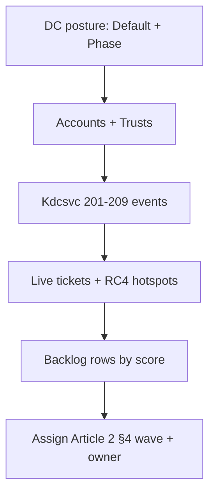

# `Invoke-KerberosEncryptionAudit.ps1`

Read-only PowerShell audit script that automates the inventory phase of the **RC4 Hardening** series. It correlates KDC-side configuration, account capability, KDC-flagged events and live Kerberos traffic into a unified HTML / JSON / CSV report, and produces the prioritized remediation backlog described in [Article 2 §0](../2.%20Legacy%20Dependency%20Mapping%20and%20Technical%20Inventory.md).

> **Read-only by design.** No `Set-AD*`, no registry writes, no password rotation, no GPO change. The script lives in the inventory phase — never in the remediation phase.

---

## What it does, mapped to Article 2

| Script function | Covers |
| --- | --- |
| `Get-KdcDefaultAudit` | Reads `DefaultDomainSupportedEncTypes` on every DC in scope — DC-side KDC posture (Article 2 §2 Source 0a, required by §8 Definition of Done). |
| `Get-Rc4DisablementPhaseAudit` | Reads `RC4DefaultDisablementPhase` (KB5073381 / Jan 2026) on every DC — the per-DC valve that controls whether Kdcsvc 201-209 are produced (Article 2 §2 Source 0b). |
| `Get-AccountKerberosAudit` | LDAP inventory of `msDS-SupportedEncryptionTypes` on users, computers and managed service accounts (Article 2 §2 Source 2 + §5 Pattern D capability evidence). |
| `Get-KerberosEventAudit` | Collects 4768 + 4769 over a configurable window, with the post-January-2025 fields `Available Keys`, `Advertised Etypes`, `Pre-Authentication EncryptionType`, and `Session Encryption Type` (Article 2 §2 Source 1 + §5 Patterns A, B, C). |
| `Get-KdcsvcEventAudit` | Collects Kdcsvc System-log events 201-209 from each DC at Phase ≥ 1, mapped to Patterns B / D / Hygiene per Article 1 §6 (Article 2 §2 Source 0c). |
| `Invoke-TrustEncryptionAudit` | Drives the sister script [`Get-TrustEncryptionAudit.ps1`](../Hardening%20Kerberos%20Encryption%20on%20AD%20Trusts/Get-TrustEncryptionAudit.ps1) when `-IncludeTrusts` is set, and folds TDO classification into the unified report (Article 2 §2 Source 3, §5 Pattern C). |
| `Build-Rc4Backlog` | Produces the §0 deliverable: one row per dependency with deterministic Blast-radius / Exposure / Fix-cost scoring (1–9), owner from `-OwnerMappingPath`, and a recommended action. |
| Report builder (HTML / JSON / CSV) | Renders the unified report and exports `Backlog.csv` plus per-section CSVs. |

---

## Prerequisites

**On the workstation running the script:**

- Windows PowerShell **5.1+** or PowerShell 7.x.
- **RSAT — Active Directory module** (`Get-ADUser`, `Get-ADComputer`, `Get-ADDomainController`, `Get-ADTrust`, `Get-ADRootDSE`).
- Network reachability to all DCs in scope (LDAP 389 / 636, RPC for `Get-WinEvent -ComputerName`, remote registry).

**Permissions:**

- **Domain Users** is sufficient to read `msDS-SupportedEncryptionTypes` on accounts and `DefaultDomainSupportedEncTypes` on the domain object (default ACL).
- **Event Log Readers** group membership (or equivalent) on every DC in scope — required to read Security log (4768/4769/4771) and System log (Kdcsvc 201-209) remotely.
- **Remote registry** read access on every DC — required for `RC4DefaultDisablementPhase`.
- No write permissions are needed and none are requested. If the running account has Domain Admin rights the script does not exercise them.

**On every DC in scope:**

- **Audit policy `Account Logon → Kerberos Authentication Service`** = Success (4768/4771 generation). Verify with `auditpol /get /category:"Account Logon"`.
- **Audit policy `Account Logon → Kerberos Service Ticket Operations`** = Success (4769 generation).
- **Security log size ≥ 1 GB** so 4768/4769 events are not rotated out of the observation window.
- For Kdcsvc 201-209 visibility: **`RC4DefaultDisablementPhase = 1` (or `2`)** in `HKLM\SYSTEM\CurrentControlSet\Services\Kdc\Parameters` (KB5073381, January 2026 cumulative or later). Phase 0 / absent registry → no Kdcsvc events; the audit will report this gap as a finding.

---

## Parameters

| Parameter | Type | Default | Purpose |
| --- | --- | --- | --- |
| `-Hours` | `int` | `24` | Observation window for 4768/4769/Kdcsvc collection. Common values: 24 (smoke test), 168 (1 week), 336 (2 weeks — recommended baseline). |
| `-DomainControllers` | `string[]` | All DCs in current forest | Optional subset. Use FQDNs. Useful for piloting on one DC before forest-wide collection. |
| `-MaxEventsPerDc` | `int` | `5000` | Per-DC cap on collected Kerberos events to avoid runaway runs in large environments. Increase if the report shows a "truncated" warning on hot DCs. |
| `-ExportCsv` | `switch` | off | Emit per-section CSVs alongside HTML/JSON (accounts, tickets, Kdcsvc, trusts, backlog). `Backlog.csv` is *always* written when the backlog has rows — independent of this switch. |
| `-OpenReport` | `switch` | off | Open the generated HTML report in the default browser when the run finishes. |
| `-IncludeTrusts` | `switch` | off | Drive the sister `Get-TrustEncryptionAudit.ps1` script and fold TDO classification into the report. Required to satisfy the Article 2 §0 deliverable end-to-end. |
| `-OwnerMappingPath` | `string` | `$null` | Path to a CSV file mapping account/SPN patterns to owners (see *Owner mapping* below). When omitted, every backlog row gets `Owner = TBD`. |
| `-OutputDir` | `string` | `Outputs\KerberosEncryptionAudit_<timestamp>` | Override the output directory. The default places one timestamped folder per run next to the script. |

---

## Quick start

```powershell
# Default: 24 h window, all DCs in current forest, HTML + JSON reports
.\Invoke-KerberosEncryptionAudit.ps1

# 7-day window, open the report when done
.\Invoke-KerberosEncryptionAudit.ps1 -Hours 168 -OpenReport

# 14-day window with all CSVs (spreadsheet work)
.\Invoke-KerberosEncryptionAudit.ps1 -Hours 336 -ExportCsv

# Full Article 2 §0 deliverable: include trust audit + load owner mapping
.\Invoke-KerberosEncryptionAudit.ps1 -Hours 168 -IncludeTrusts -OwnerMappingPath .\owners.csv -ExportCsv -OpenReport

# Targeted DC subset (pilot run)
.\Invoke-KerberosEncryptionAudit.ps1 -DomainControllers DC01.contoso.com,DC02.contoso.com -Hours 168
```

### Owner mapping CSV format

```csv
Pattern,Owner
SQL-*,Database team
WEB-*,Web platform team
*-DC*,AD operations
fileserver-*,Storage team
svc_iis_*,Web platform team
```

Pattern matching uses PowerShell `-like` semantics (so `*` is a wildcard). The first matching pattern wins; rows with no match get `Owner = TBD`.

---

## Output structure

Each run creates `Outputs\KerberosEncryptionAudit_<yyyyMMdd_HHmmss>\` (or the directory passed via `-OutputDir`) containing:

| File | When produced | Content |
| --- | --- | --- |
| `Report.html` | Always | Unified human-readable report (DC posture, accounts, tickets, Kdcsvc, trusts, backlog). |
| `Report.json` | Always | Same data as HTML, machine-readable — feed into a SIEM or downstream automation. |
| `Backlog.csv` | When ≥ 1 backlog row was scored | The Article 2 §0 deliverable. Not optional; always written. |
| `Accounts.csv`, `Tickets.csv`, `Kdcsvc.csv`, `Trusts.csv` | `-ExportCsv` only | Per-section dumps for spreadsheet triage. |

---

## Reading the report — four operational questions

The HTML output is structured around four questions, in this order:

1. **Is the DC posture already locked to AES-only?** — *KDC Default* + *Phase* sections. DCs that still allow mixed or implicit behavior are flagged, and DCs at Phase 0 / absent registry are explicitly called out as inventory blind spots.
2. **Which identities still block AES-only enforcement?** — *Accounts* + *Trusts* sections, with emphasis on SPN-bearing service identities and trust objects whose attribute is anything but AES-only.
3. **Is RC4 still present in live Kerberos traffic?** — *Kdcsvc* (KDC-side flagged events 201-209) + *Tickets* + *RC4 Hotspots* sections. The Kdcsvc table is usually the cheapest entry point because the KDC has already extracted the offending account name.
4. **What is the prioritized remediation backlog?** — the *Backlog* section materializes the Article 2 §0 deliverable with deterministic scoring. Rows at score ≥ 8 are immediate-wave; 6-7 are next wave; below 6 are after quick wins or decommission candidates.

Recommended triage order:



Move from control plane (what is allowed) to KDC-flagged events (what the KDC actually rejects) to data plane (what the KDC actually issues), then read the backlog rows top-down by score.

---

## Known limitations

The tool is read-only and forest-local by design. Its remaining honest limitations are:

- **Single-side trust view.** `Invoke-TrustEncryptionAudit` (driving `Get-TrustEncryptionAudit.ps1`) inventories only the LOCAL side of each trust. Each TDO has a twin on the remote side with its own `msDS-SupportedEncryptionTypes`. Run the same audit there to compare.
- **Attribute-only trust classification.** AES-only at the attribute level does not guarantee AES referrals — the trust password must have been rotated *after* the attribute change for AES keys to be materialized in `supplementalCredentials`. The tool flags this caveat but cannot read `supplementalCredentials`.
- **Phase 0 and absent-registry blind spot.** Until every DC is at `RC4DefaultDisablementPhase ≥ 1`, the Kdcsvc table is incomplete. The tool quantifies the gap ("DCs at Phase ≥ 1" KPI) but cannot fix it.
- **Passive Kerberos consumers (keytab-only services) stay invisible at the device level.** A non-Windows appliance with a static keytab consumes TGS without ever authenticating against the DC, so no 4768 is generated for the appliance host. The AD account behind the SPN remains visible (4769 ServiceName, msDS-SET, pwdLastSet), but mapping the SPN to a physical host requires a complementary field inventory (`klist -k /etc/krb5.keytab` on each Linux host, or a CMDB attribute). See Article 2 §2 Source 1a deep dive.
- **No SIEM correlation.** KQL / Splunk searches over historical 4768 / 4769 / Kdcsvc data live in the *RC4 telemetry & inventory reporting* annex, not in this tool.
- **Heuristic scoring.** Blast radius / Exposure / Fix cost are rule-of-thumb classifications. Adjust the thresholds in `Build-Rc4Backlog` for environments where SPN-bearing accounts are not always Critical, or where event counts have a different operational meaning.

---

## Common mistakes the tool helps you avoid

- Looking at `msDS-SupportedEncryptionTypes` only and ignoring 4768 / 4769 — capability ≠ runtime.
- Treating absent values as fully remediated just because KB5021131 improved the implicit default.
- Confusing `0x1C` (RC4 + AES) with "AES-only" — the RC4 bit is still set.
- Using `lastLogonTimestamp` as a "this account is unused" filter — passive SPN consumers do not bump it (Article 2 §2 Source 1a deep dive).
- Enforcing AES-only on the KDC before the priority accounts list is empty.

---

## Troubleshooting

| Symptom | Likely cause | Fix |
| --- | --- | --- |
| Empty *Tickets* section even though Kerberos is heavily used | Audit policy off on DCs (no 4768/4769 generated) | `auditpol /set /subcategory:"Kerberos Authentication Service" /success:enable` and the same for `Kerberos Service Ticket Operations`. Wait for the next observation window before re-running. |
| `Get-WinEvent` errors on one or more DCs | Account lacks Event Log Readers, or RPC blocked | Add the running account to the Event Log Readers group on the DC, or open `RPC Endpoint Mapper` + dynamic RPC ports. |
| *Tickets* section shows "truncated" warning on a hot DC | `MaxEventsPerDc` cap reached | Increase `-MaxEventsPerDc`, or split the run by `-DomainControllers` per DC, or shorten `-Hours`. |
| Kdcsvc section completely empty on a recent OS | DC at Phase 0 or KB5073381 not yet deployed | Verify `RC4DefaultDisablementPhase` (the script reports this in *DC posture*). Set to `1` once you are ready to surface the events. |
| Backlog rows all show `Owner = TBD` | No `-OwnerMappingPath` or no patterns matched | Provide an `owners.csv` with account/SPN wildcard patterns. |
| `Report.html` looks broken / missing sections | Run interrupted mid-collection | Re-run with the same parameters; each run writes a new timestamped folder. |

---

## Related references

- [Article 1 — RC4 Fundamentals, Obsolescence, and Risks of Continued Use](../1.%20RC4%20Fundamentals%2C%20Obsolescence%2C%20and%20Risks%20of%20Continued%20Use.md)
- [Article 2 — Legacy Dependency Mapping and Technical Inventory](../2.%20Legacy%20Dependency%20Mapping%20and%20Technical%20Inventory.md) — the methodology this tool automates.
- [Article 3 — Remediation, AES Migration, Cutover, and RC4 Extinction](../3.%20Remediation%2C%20AES%20Migration%2C%20Cutover%2C%20and%20RC4%20Extinction.md)
- [Hardening Kerberos Encryption on AD Trusts](../Hardening%20Kerberos%20Encryption%20on%20AD%20Trusts/Hardening%20Kerberos%20Encryption%20on%20AD%20Trusts.md) — sister article and home of `Get-TrustEncryptionAudit.ps1`.
- [Weak supported encryption algorithms on DCs](../Weak%20supported%20encryption%20algorithms%20on%20DCs.md)
