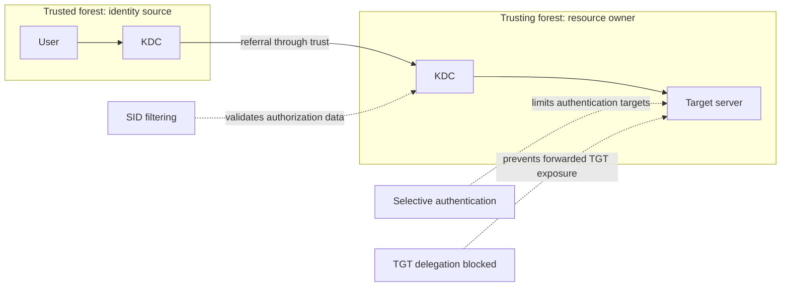
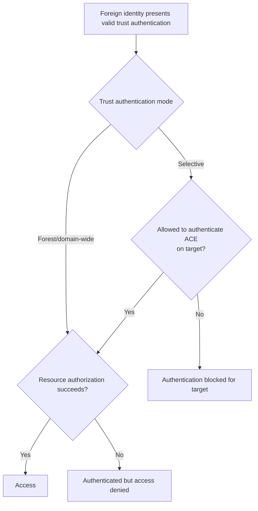

# Securing Active Directory Trusts: SID Filtering, Selective Authentication, TGT Delegation and Trust Auditing

A trust deliberately carries authentication across an Active Directory boundary. Its security therefore depends on more than the trust password: direction, SID filtering, selective authentication, Kerberos delegation, namespace routing and the administrative integrity of both forests all matter.

> **TL;DR**
>
> - A forest remains an administrative security boundary, but a trust creates an explicit authentication path across it.
> - Use the smallest trust scope and direction that satisfies the resource flow.
> - Keep SID filtering enabled. Relax it only for a controlled migration or a deliberately engineered PAM trust.
> - Prefer selective authentication when the trusted forest does not need to authenticate to every server in the trusting forest.
> - Keep cross-trust TGT delegation disabled. This has been the secure Windows default for forest and external trusts since the 2019 hardening updates.
> - Audit both TDOs, because each side stores and enforces its own trust configuration.
> - Treat unexpected trust creation, removal, attribute changes or SID history as Tier 0 security events.

## 1. Define the boundary correctly

The forest is the Active Directory administrative security boundary. Enterprise Admins, domain controllers, the Schema and Configuration partitions, and forest-wide replication all exist inside it.

A trust does not merge two forests or make their administrators equivalent. It does, however, let one forest accept authentication assertions originating from the other. Unsafe delegation, relaxed SID filtering, broad authentication scope or a compromised resource can turn that intended path into credential or privilege exposure.



The 2018 printer-coercion and unconstrained-delegation research demonstrated a real class of cross-forest risk: a compromised server trusted for unconstrained delegation could receive a foreign user's forwarded TGT. Microsoft changed Windows defaults in 2019 so that TGT delegation is blocked across forest and external trusts. Do not re-enable the old behavior to make a legacy application work without first redesigning the delegation model.

## 2. Start with minimum trust scope

Before hardening flags, challenge the trust itself:

1. Is a trust still required?
2. Which identities need to reach which resources?
3. Does access need to work in both directions?
4. Is a forest trust necessary, or is one nontransitive external trust sufficient?
5. Is the partner forest administered to an acceptable standard?
6. Is there a named business and technical owner on both sides?
7. Is there an end date or recurring review date?

Avoid overlapping trust paths. A forest trust plus external trusts between child domains creates inconsistent routing and makes security review harder. A shortcut trust is an intra-forest optimization, not a second cross-forest path.

The trust should be removed when the business relationship ends. Leaving it disabled in a diagram but active in AD is not decommissioning.

## 3. SID filtering

Kerberos authorization data can contain more SIDs than the user's primary SID, including group memberships and `SIDHistory`. SID filtering evaluates SIDs received across a trust and rejects values that the trusted side should not legitimately assert.

Without effective filtering, an administrator who controls the trusted domain could attempt to add or forge a SID belonging to a privileged group in the trusting domain. The trusting KDC must not accept that foreign assertion as local authority.

### 3.1 Forest and external trust behavior

Windows exposes different filtering states for different trust types:

- forest trusts use forest-aware SID filtering;
- external trusts can use quarantine filtering to accept SIDs appropriate to the directly trusted domain;
- `EnableSIDHistory` relaxes filtering for specific migration scenarios;
- Privileged Access Management trusts deliberately use special trust behavior and require their own threat model.

Do not infer secure or insecure status from one Boolean without considering `TrustType`, `IntraForest`, `ForestTransitive` and `trustAttributes` together.

### 3.2 SID history migration exception

Cross-forest migrations sometimes preserve a source SID in the target account's `SIDHistory` so existing ACLs continue to work. This is a temporary compatibility mechanism, not a permanent trust design.

A safe migration exception requires:

- a documented set of migrated SIDs and destination accounts;
- secured migration tooling and operators;
- selective authentication where possible;
- monitoring of events 4765 and 4766;
- removal of obsolete ACL references;
- re-enablement of normal filtering immediately after the migration window;
- validation from both sides of the trust.

Never relax filtering merely because an application owner reports access denied. First identify the missing SID, group scope and target ACL.

## 4. Selective authentication

Forest-wide authentication allows identities from the trusted forest to authenticate to computers in the trusting forest, although resource ACLs still determine access. Selective authentication changes that default: a foreign identity must also receive the **Allowed to authenticate** extended right on the target computer or service account.



Selective authentication does not grant access to the application, share or database. It adds a gate before the ordinary authorization check.

Use security groups rather than individual foreign users when assigning the right. Maintain a resource-to-group mapping and review it with the target server owner. Broadly granting Allowed to authenticate to `Authenticated Users` defeats the purpose.

### Inspect the right on a target computer

The following read-only example resolves the schema GUID instead of hard-coding it, then reports explicit Allowed to authenticate ACEs on one computer:

```powershell
Import-Module ActiveDirectory

$targetComputer = Get-ADComputer -Identity 'APP01'
$rootDse = Get-ADRootDSE
$extendedRightsBase = "CN=Extended-Rights,$($rootDse.ConfigurationNamingContext)"
$allowedToAuthenticate = Get-ADObject `
    -SearchBase $extendedRightsBase `
    -LDAPFilter '(displayName=Allowed to Authenticate)' `
    -Properties rightsGuid

$rightGuid = [Guid] $allowedToAuthenticate.rightsGuid
$acl = Get-Acl -Path "AD:\$($targetComputer.DistinguishedName)"

$acl.Access |
    Where-Object {
        $_.ObjectType -eq $rightGuid -and
        ($_.ActiveDirectoryRights -band
            [System.DirectoryServices.ActiveDirectoryRights]::ExtendedRight)
    } |
    Select-Object IdentityReference,
                  AccessControlType,
                  IsInherited,
                  ObjectType
```

An empty result can be expected if the trust uses forest-wide authentication. Determine trust mode before treating the output as a defect.

## 5. Block TGT delegation across trusts

Unconstrained delegation lets a service receive a user's forwardable TGT so it can impersonate that user to other services. Across a forest boundary, that means a server administered in one forest could receive reusable credentials for a user governed by another forest.

Microsoft's 2019 updates changed the behavior for forest and external trusts:

- new trusts were created with cross-trust TGT delegation disabled;
- the secure behavior was subsequently enforced for existing trusts;
- applications still authenticate, but delegation operations that depend on a forwarded TGT fail;
- constrained delegation or resource-based constrained delegation is the preferred redesign.

The secure state for `EnableTGTDelegation` is **No**. Do not set it to Yes as a generic compatibility workaround.

### Find local unconstrained-delegation principals

This read-only inventory identifies enabled users and computers configured for unconstrained delegation in the current domain:

```powershell
$delegatedUsers = Get-ADUser `
    -Filter 'Enabled -eq $true -and TrustedForDelegation -eq $true' `
    -Properties TrustedForDelegation,
                AccountNotDelegated,
                servicePrincipalName |
    Select-Object @{Name='ObjectClass'; Expression={'user'}},
                  SamAccountName,
                  DistinguishedName,
                  AccountNotDelegated,
                  servicePrincipalName

$delegatedComputers = Get-ADComputer `
    -Filter 'Enabled -eq $true -and TrustedForDelegation -eq $true' `
    -Properties TrustedForDelegation,
                AccountNotDelegated,
                servicePrincipalName,
                OperatingSystem |
    Select-Object @{Name='ObjectClass'; Expression={'computer'}},
                  SamAccountName,
                  DistinguishedName,
                  AccountNotDelegated,
                  servicePrincipalName,
                  OperatingSystem

$delegatedUsers + $delegatedComputers |
    Sort-Object ObjectClass, SamAccountName
```

A matching object is not automatically exploitable across a trust. Exposure also depends on trust direction, TGT-delegation policy, the authentication path and which identities reach the service. Nevertheless, unconstrained delegation should be removed wherever possible, especially from systems managed outside the user's forest.

Keep the Print Spooler disabled on domain controllers unless there is a documented operational requirement. This removes one historically important coercion surface but does not replace delegation hardening.

## 6. Inventory every local TDO

Run the following read-only audit from every domain that stores a relevant TDO. A forest-root query does not inventory external or shortcut trusts owned by other domains.

```powershell
Import-Module ActiveDirectory

$forest = Get-ADForest
$results = foreach ($domainName in $forest.Domains) {
    try {
        Get-ADTrust `
            -Filter * `
            -Server $domainName `
            -Properties trustAttributes,
                        'msDS-SupportedEncryptionTypes',
                        whenCreated,
                        whenChanged `
            -ErrorAction Stop |
            ForEach-Object {
                [pscustomobject]@{
                    QueriedDomain             = $domainName
                    Partner                   = $_.Target
                    Direction                 = $_.Direction
                    TrustType                 = $_.TrustType
                    IntraForest               = $_.IntraForest
                    ForestTransitive          = $_.ForestTransitive
                    SelectiveAuthentication   = $_.SelectiveAuthentication
                    SIDFilteringForestAware   = $_.SIDFilteringForestAware
                    SIDFilteringQuarantined   = $_.SIDFilteringQuarantined
                    TGTDelegation             = $_.TGTDelegation
                    TrustAttributes           = $_.trustAttributes
                    SupportedEncryptionTypes  = $_.'msDS-SupportedEncryptionTypes'
                    Created                   = $_.whenCreated
                    Changed                   = $_.whenChanged
                    DistinguishedName         = $_.DistinguishedName
                    QueryError                = $null
                }
            }
    } catch {
        [pscustomobject]@{
            QueriedDomain = $domainName
            Partner       = $null
            QueryError    = $_.Exception.Message
        }
    }
}

$results | Sort-Object QueriedDomain, Partner
```

Investigate, rather than automatically change:

- two-way trusts where access is only required one way;
- external and forest trusts with no current owner;
- `TGTDelegation = True`;
- unexpected SID-filtering exceptions;
- forest/external trusts without selective authentication in partner scenarios;
- stale namespace routes and exclusions;
- encryption settings that permit RC4;
- duplicate paths to the same destination;
- unexplained recent TDO changes.

`whenChanged` is context only. It does not identify the actor or prove when trust key material was last rotated.

## 7. Compare both sides

A two-way trust is not one object replicated between forests. Each side has its own TDO, policy and operational state.

Export the audit from both forests and compare:

- partner DNS and NetBIOS names;
- direction as seen from each side;
- forest-transitive and selective-authentication state;
- SID-filtering and migration exceptions;
- TGT-delegation state;
- routed suffixes and exclusions;
- Kerberos encryption support;
- named owners and approved resource flows.

Do not place credentials for both forests in a general-purpose audit script. Run read-only collection independently under each forest's approved administrative process, then compare sanitized outputs.

## 8. Kerberos encryption is a separate control

SID filtering, selective authentication and TGT-delegation blocking govern identity scope and credential forwarding. They do not ensure that the trust's Kerberos referral tickets use strong encryption.

TDO encryption requires coordinated configuration and trust-key rotation on both sides, followed by runtime validation. That process is documented in [Hardening Kerberos Encryption on AD Trusts](RC4%20Hardening/Hardening%20Kerberos%20Encryption%20on%20AD%20Trusts/Hardening%20Kerberos%20Encryption%20on%20AD%20Trusts.md).

Do not enforce AES-only DC policy before every required trust path can issue AES referrals. The wrong order can break cross-realm authentication.

## 9. Monitor trust administration

Collect and alert on these Security events from domain controllers:

| Event | Meaning |
|---:|---|
| 4706 | A new trust to a domain was created |
| 4707 | A trust to a domain was removed |
| 4716 | Trusted-domain information was modified |
| 4765 | SID history was added to an account |
| 4766 | An attempt to add SID history failed |
| 5136 | A directory object was modified; useful when Directory Service Changes auditing and an appropriate SACL are configured |

For trust changes, preserve the actor, target TDO, originating DC, changed attributes and approved change record. Event 4716 alone might not provide every LDAP attribute delta, so correlate it with 5136, replication metadata and administrative logs.

Also monitor:

- event 4769 for cross-realm referral activity and encryption types;
- additions of foreign identities to privileged or resource groups;
- changes to Allowed to authenticate ACEs;
- unconstrained-delegation flags on users and computers;
- Print Spooler state on domain controllers;
- changes to conditional forwarders and forest-trust name suffixes.

Send DC logs to storage that administrators of the monitored forest cannot silently erase.

## 10. Controlled change workflow

For any trust security change:

1. Name the identity and resource flows that must continue working.
2. Inventory both local and remote TDOs.
3. Validate DNS, time, DC reachability and replication first.
4. Identify applications using NTLM, unconstrained delegation or SID history.
5. Capture before-state exports and the current namespace routes.
6. Test in an equivalent environment where possible.
7. Apply one coordinated change with owners from both forests present.
8. Purge or renew relevant tickets when the change requires it.
9. Test real application SPNs, not only trust metadata.
10. Review 4768, 4769, Netlogon and application events.
11. Confirm the final configuration independently from both sides.
12. Retain rollback criteria and evidence.

Avoid a change that combines direction, filtering, delegation and encryption in one unobservable step. Coordinate related changes, but validate each control explicitly.

## 11. Recommended baseline

| Control | Recommended state |
|---|---|
| Trust existence | Documented business requirement and owner |
| Scope | Forest trust only when forest-wide routing is needed; otherwise narrow scope |
| Direction | One-way unless both access directions are required |
| SID filtering | Enabled; exceptions time-bound and monitored |
| Authentication | Selective for partner and limited-resource scenarios |
| TGT delegation | Disabled |
| Unconstrained delegation | Eliminated where possible, especially on DCs and cross-boundary services |
| Kerberos encryption | AES-capable TDOs with coordinated key rotation and wire validation |
| Namespace routing | Only approved, nonconflicting suffixes enabled |
| Monitoring | Events 4706, 4707, 4716, 4765, 4766 and relevant 5136 changes centralized |
| Review | Both sides compared on a recurring schedule |

## 12. Common mistakes

| Mistake | Security effect |
|---|---|
| Calling every trust a security-boundary failure | Hides the difference between intended authentication and unsafe configuration |
| Enabling SID history permanently | Expands which foreign SID assertions can be honored |
| Assuming selective authentication grants application access | It only permits authentication to the target; authorization remains separate |
| Enabling TGT delegation to fix a legacy application | Exposes forwarded credentials across the forest boundary |
| Auditing only the forest root | Misses TDOs stored in child domains and the remote-side configuration |
| Treating `whenChanged` as trust-password age | Produces unsupported conclusions from a generic object timestamp |
| Hardening only one side | Leaves asymmetric behavior and false assurance |
| Checking only TDO attributes for AES | Does not prove key material or runtime ticket encryption |
| Publishing offensive lab transcripts as operational guidance | Adds risk without improving defensive implementation |

## References

- [Updates to TGT delegation across incoming trusts](https://support.microsoft.com/en-us/topic/updates-to-tgt-delegation-across-incoming-trusts-in-windows-server-1a6632ac-1599-0a7c-550a-a754796c291e)
- [Netdom trust](https://learn.microsoft.com/en-us/windows-server/administration/windows-commands/netdom-trust)
- [Get-ADTrust](https://learn.microsoft.com/en-us/powershell/module/activedirectory/get-adtrust)
- [Active Directory security groups](https://learn.microsoft.com/en-us/windows-server/identity/ad-ds/manage/understand-security-groups)
- [Planning for compromise](https://learn.microsoft.com/en-us/windows-server/identity/ad-ds/plan/security-best-practices/planning-for-compromise)
- [Active Directory Trusts Explained](../Concepts/Active%20Directory%20Trusts%20Explained%20-%20Types,%20Direction,%20Transitivity,%20TDOs%20and%20Authentication%20Flows.md)
- [Active Directory Design Guidelines](../Concepts/Active%20Directory%20Design%20Guidelines%20%28Architecture%20Overview%29.md)
- [Hardening Kerberos Encryption on AD Trusts](RC4%20Hardening/Hardening%20Kerberos%20Encryption%20on%20AD%20Trusts/Hardening%20Kerberos%20Encryption%20on%20AD%20Trusts.md)
