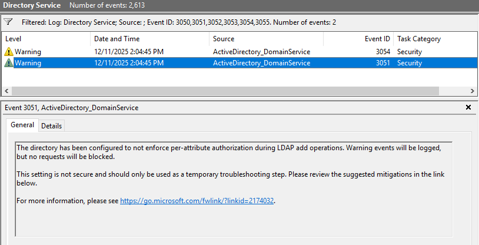
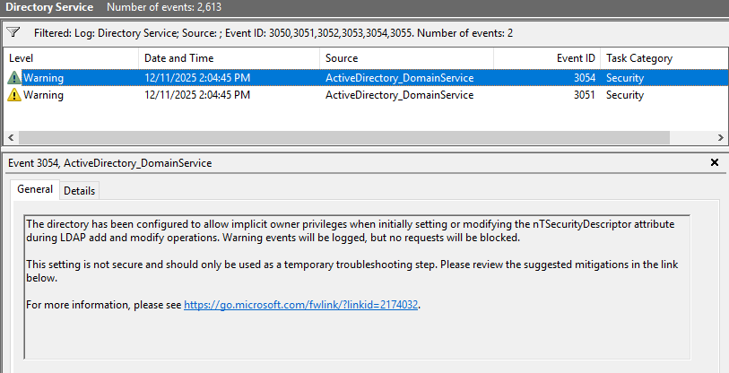

# 🛡️ dSHeuristics Hardening in Active Directory

### A friendly-but-deep-dive explanation + PowerShell remediation toolkit

This article explains **what dSHeuristics really does**, why security tools like **PingCastle** flag it, and how to **check, secure, or revert** the configuration cleanly using a PowerShell menu-driven script.

---

## 1. What is dSHeuristics?

`dSHeuristics` is a *string of magic switches* hidden deep inside Active Directory’s Configuration partition:

```
CN=Directory Service,
CN=Windows NT,
CN=Services,
CN=Configuration,<ForestDN>
```

Each **character position** in this string toggles a specific LDAP or AD DSA behaviour — legacy compatibility, password rules, anonymous access, ACL handling, etc.

If the attribute is **empty**, AD applies its built-in default for every position. Since November 2021 (KB5008383) that default has been *audit-enabled* for the LDAP-ACL hardening described below — meaning AD logs warning events but does not block the operations. Audit-by-default is safer than the pre-2021 behaviour, but it is **not** the same as full enforcement.

So far so good.

---

## 2. Why some Security Audit tools flags it

Some dSHeuristics positions directly affect **LDAP security**.

The important ones for modern AD security baselines are:

### Characters 28 and 29

(1-based indexing as per Microsoft documentation — the **28th** and **29th** characters of the string)

These two positions control how AD handles **securityDescriptor modifications via LDAP** — the area covered by **CVE-2021-42291** (KB5008383, November 2021).

The two characters are independent and each one accepts three values:

| Position | Name | Value `0` | Value `1` | Value `2` |
|---|---|---|---|---|
| **char 28** (Y) | Per-attribute AuthZ verification on LDAP add | Audit only (default) | Enforce — block illegal additions | Disable (no audit, no enforcement) |
| **char 29** (Z) | Temporary Implicit Ownership removal | Default — implicit ownership allowed | Enforce — implicit ownership removed | Disable |

The three operationally-meaningful combinations:

| Char 28 | Char 29 | State | Behaviour | Events |
|---|---|---|---|---|
| `0` | `0` (or attribute empty) | 🟠 **Audit enabled** (out-of-the-box default) | Warnings logged, no blocking | 3051 / 3054 |
| `1` | `1` | 🟢 **Mitigations + audit enforced** | Illegal LDAP add/modify blocked | 3050 / 3053 |
| `2` | `2` | 🔴 **Mitigations and audit disabled** | No audit, no enforcement (insecure) | 3052 / 3055 |

Other combinations (`01`, `12`, `02`…) are technically valid but not documented operating modes; security tooling such as PingCastle flags anything other than `11`.

Microsoft and security baselines recommend the **`11` enforced** state in modern domains.

### KB5008383 — what it does and how to read the timeline

KB5008383 (CVE-2021-42291), shipped November 2021 as *Permissions Updates*, addresses a privilege-escalation vulnerability allowing users with sufficient permissions to set arbitrary values on security-sensitive attributes of computer objects via LDAP Add or Modify. Built-in administrators are exempt from the new checks. Events 3044-3056 are the diagnostic feed.

Timeline summary:

| Date | Change |
|---|---|
| Nov 2021 (KB5008383) | Audit mode introduced; **enabled by default in code** even when the dSHeuristics attribute is unset. Enforcement available via registry override. |
| Apr 2022 | Enforcement attempted to be enabled by default; rolled back after compatibility issues. |
| Oct 2022 | Registry-based opt-out removed. From this point on, the **dSHeuristics 28/29 attribute is the only knob**: leave at default for audit, set `11` to enforce, set `22` to fully disable. |
| Today | Microsoft and most baselines treat `11` as the target state. `00` (or empty) is acceptable as a transition state. `22` is a finding. |

### Reading the dSHeuristics string

Quick read with PowerShell:

```powershell
$ds = "CN=Directory Service,CN=Windows NT,CN=Services," + (Get-ADRootDSE).configurationNamingContext
(Get-ADObject $ds -Properties dSHeuristics).dSHeuristics
```

The **recommended secure value** and the rules that govern its length are explained in detail in [section 3 below](#3-recommended-secure-value).

### Event mapping per mode

### 🔴 `00000000010000000002000000022` — MITIGATIONS AND AUDIT DISABLED

| Category | Event ID | Type | Description | Mitigations / Technical Explanation |
|---|---|---|---|---|
| **AuthZ Verification** | **3052** | 🔴 Error | Per-attribute authorization is *not* enforced during LDAP add operations. No events logged, no requests blocked. | **Most insecure configuration.** Only for temporary troubleshooting. Events fire on-the-fly and at NTDS restart. Investigate the downgrade and move back to audit mode ASAP. |
| **Implicit Ownership** | **3055** | 🔴 Error | The directory allows implicit owner privileges when setting or modifying `nTSecurityDescriptor`. No events logged, no requests blocked. | **Not secure.** Only for temporary troubleshooting. |

---

### 🟠 `00000000010000000002000000000` (OR NOT SET) — AUDIT ENABLED

| Category | Event ID | Type | Description | Mitigations / Technical Explanation |
|---|---|---|---|---|
| **AuthZ Verification** | **3051** | 🟠 Warning | Per-attribute authorization not enforced. Warning events logged; no requests blocked. | Environment still **vulnerable**. Audit must be monitored. Events fire on-the-fly and at NTDS restart. Triage all AuthZ / Implicit Ownership events then move to enforcement. |
| **Implicit Ownership** | **3054** | 🟠 Warning | Implicit owner privileges allowed during `nTSecurityDescriptor` modifications. Warning events logged; no requests blocked. | Not secure; transitional state only. |

---

### 🟢 `00000000010000000002000000011` — MITIGATIONS AND AUDIT ENABLED (target state)

| Category | Event ID | Type | Description | Mitigations / Technical Explanation |
|---|---|---|---|---|
| **AuthZ Verification** | **3050** | 🟢 Informational | Per-attribute authorization is enforced during LDAP add operations. | **Most secure configuration.** No further action required. Events fire on-the-fly and at NTDS restart. Handle any blocked operations as they appear. |
| **Implicit Ownership** | **3053** | 🟢 Informational | Implicit owner privileges are blocked during `nTSecurityDescriptor` operations. | **Most secure configuration.** |

---

## 3. Recommended secure value

Two forms are commonly published. Both produce **exactly the same security behaviour** — the only difference is the length of the string.

| Form | Value | Length | Source |
|---|---|---|---|
| Minimal | `00000000010000000002000000011` | 29 | Microsoft documentation — the shortest string that reaches char 28/29. |
| Extended | `0000000001000000000200000001130` | 31 | ANSSI / PingCastle reference — same content, padded to length 30+. |

### Why two forms? A simple rule about length

The `dSHeuristics` string has a strange built-in safety check. Every time the string crosses a multiple of 10, the character at that exact position must equal the multiplier:

| If your string is at least… | …then the character at position… | …must be… |
|---|---|---|
| 10 characters long | 10 | `1` |
| 20 characters long | 20 | `2` |
| 30 characters long | 30 | `3` |
| 40 characters long | 40 | `4` |

This is just an internal anti-corruption marker — it does **not** activate any security feature. It only proves that the string was set intentionally and not truncated.

### So what is each character actually doing?

Decoding the ANSSI form `0000000001000000000200000001130`:

```
0 0 0 0 0 0 0 0 0 1 0 0 0 0 0 0 0 0 0 2 0 0 0 0 0 0 0 1 1 3 0
1 2 3 4 5 6 7 8 9|10                  |20                  |30|31
                  ^                    ^                    ^
                  marker (must be 1)   marker (must be 2)   marker (must be 3)
                                                          ^^
                                                          | char 29 = 1 → Implicit Ownership removal: ENFORCE
                                                          char 28 = 1 → AuthZ verification: ENFORCE
```

Everything else is `0` (default). The only security-relevant characters in this string are **chars 28 and 29**. The `3` at position 30 is just the length marker — it is not a setting you can turn on or off.

### Which one should I use?

- **Pick the 29-character form** if you want the smallest possible value and your audit tooling (PingCastle, custom scripts) is happy with it. This is what Microsoft documents.
- **Pick the 31-character form (ANSSI)** if your compliance baseline does an exact string match against the ANSSI reference value, or if you want the attribute pre-padded for future Microsoft additions at positions 31+.

The script in this article ships with the 29-character form by default and lets you override it on demand.

---

## 4. Where it lives (visual)

```
Forest
└── Configuration NC
    └── CN=Services
        └── CN=Windows NT
            └── CN=Directory Service
                └── dSHeuristics  ← string controlling LDAP engine behaviour
```

---

## 5. Before / After diagram

### Before hardening — attribute empty or set to `00` (audit) / `22` (disabled)

```
LDAP Client
   │  Modify securityDescriptor via LDAP?
   ▼
 DC: Allowed
      │
      ├─ char 28/29 = 00 (or empty) → logged as Warning (3051/3054), not blocked
      └─ char 28/29 = 22            → not logged, not blocked (insecure)
```





### After hardening — char 28/29 = `11` (enforce)

```
LDAP Client
   │  Attempt risky ACL modification?
   ▼
 DC: BLOCKED
      │
      └─ logged as Informational (3050/3053) and prevents CVE-2021-42291 style abuse
```

---

## 6. Full PowerShell script (Check / Secure / Revert)

This script:

✔ Shows current value  
✔ Interprets characters 28–29  
✔ Applies secure mode  
✔ Reverts to original value captured at launch  

Paste into a PowerShell console running as **Enterprise Admin**.

```powershell
# =====================================================================
# dSHeuristics Control Script - Check / Secure / Revert
# Requirements : PowerShell 5.1 + RSAT AD / run as Enterprise Admin
# =====================================================================

Import-Module ActiveDirectory -ErrorAction Stop

# Start transcript in the script directory
$scriptDir  = if ($PSScriptRoot) { $PSScriptRoot } else { (Get-Location).Path }
$logFile    = Join-Path $scriptDir ("dSHeuristics_{0}.log" -f (Get-Date -Format 'yyyyMMdd_HHmmss'))
Start-Transcript -Path $logFile -Append | Out-Null
Write-Host "[INFO ] Transcript logging to: $logFile" -ForegroundColor Cyan

# Target a single DC (PDC Emulator) for all read/write operations
$script:TargetDC = (Get-ADDomain).PDCEmulator
Write-Host "[INFO ] Targeting DC: $script:TargetDC" -ForegroundColor Cyan

# ---------- Permissions check ----------
# dSHeuristics lives in the Configuration partition → requires Enterprise Admins
$currentUser    = [System.Security.Principal.WindowsIdentity]::GetCurrent()
$principal      = New-Object System.Security.Principal.WindowsPrincipal($currentUser)
$isAdmin        = $principal.IsInRole([System.Security.Principal.WindowsBuiltInRole]::Administrator)

$forestDN       = (Get-ADForest -Server $script:TargetDC).RootDomain
$eaSID          = (Get-ADDomain -Server $script:TargetDC -Identity $forestDN).DomainSID.Value + "-519"
$isEnterpriseAdmin = $currentUser.Groups | Where-Object { $_.Value -eq $eaSID }

if (-not $isAdmin) {
    Write-Host "[ERROR] This script must be run from an elevated (Run as Administrator) PowerShell session." -ForegroundColor Red
    Stop-Transcript | Out-Null
    exit 1
}
if (-not $isEnterpriseAdmin) {
    Write-Host "[WARN ] Current user ($($currentUser.Name)) is NOT a member of Enterprise Admins." -ForegroundColor Yellow
    Write-Host "[WARN ] Write operations on dSHeuristics (Configuration partition) will likely fail." -ForegroundColor Yellow
    $proceed = Read-Host "Continue anyway? (Y/N)"
    if ($proceed -ne 'Y') {
        Write-Host "[INFO ] Exiting." -ForegroundColor Cyan
        Stop-Transcript | Out-Null
        exit 0
    }
} else {
    Write-Host "[INFO ] Current user ($($currentUser.Name)) is a member of Enterprise Admins - OK" -ForegroundColor Green
}
# NOTE: $currentUser.Groups is evaluated at logon time. If you were just added
#       to Enterprise Admins, log off and back on for the membership to take effect.
#       Domain Admins of the *root* domain are added to Enterprise Admins implicitly
#       at logon and will pass this check naturally.

function ts { (Get-Date).ToString('yyyy-MM-dd HH:mm:ss') }
function Info ($m){ Write-Host ("[{0}] [INFO ] {1}"  -f (ts), $m) -ForegroundColor Cyan }
function Warn ($m){ Write-Host ("[{0}] [WARN ] {1}"  -f (ts), $m) -ForegroundColor Yellow }
function Err  ($m){ Write-Host ("[{0}] [ERROR] {1}" -f (ts), $m) -ForegroundColor Red }
function Ok   ($m){ Write-Host ("[{0}] [ OK  ] {1}" -f (ts), $m) -ForegroundColor Green }
function DC   ($m){ Write-Host ("[{0}] [  DC ] {1}" -f (ts), $m) -ForegroundColor Magenta }

$script:OriginalDSHeuristics = $null
$script:OriginalCaptured     = $false

# Two equivalent secure values (chars 28-29 = '11' enforce CVE-2021-42291):
#   - Microsoft minimal form (29 chars):  00000000010000000002000000011
#   - ANSSI / PingCastle form  (31 chars): 0000000001000000000200000001130
# The trailing '30' on the ANSSI form is the mandatory positional marker for
# length >= 30 (char 30 must equal '3') plus a default '0' at position 31.
# Both produce identical security behaviour. Switch by uncommenting the line you want.
$script:SecureDSHeuristics = "00000000010000000002000000011"     # Microsoft minimal
# $script:SecureDSHeuristics = "0000000001000000000200000001130"  # ANSSI / PingCastle

function Get-DirectoryServiceObject {
    $configNC  = (Get-ADRootDSE -Server $script:TargetDC).configurationNamingContext
    $dn = "CN=Directory Service,CN=Windows NT,CN=Services,$configNC"

    $obj = Get-ADObject -Identity $dn -Properties dSHeuristics -Server $script:TargetDC
    DC "READ  dSHeuristics from DC: $script:TargetDC"

    if (-not $script:OriginalCaptured) {
        $script:OriginalDSHeuristics = $obj.dSHeuristics
        $script:OriginalCaptured     = $true
    }

    return $obj
}

function Resolve-DSHeuristicsMode {
    <#
        Parses a dSHeuristics value and returns the operational mode based on
        characters 28 (Y, AuthZ verification) and 29 (Z, Implicit Ownership removal).
        Each character can be:
            '0' = audit / default
            '1' = enforce
            '2' = disable (no audit, no enforce)
        Documented modes are 00 (audit), 11 (enforce), 22 (disabled).
        Anything else is reported as 'UnknownCombination'.
    #>
    param([AllowNull()][string]$Value)

    $result = [ordered]@{
        Value  = $Value
        Length = 0
        Char28 = $null
        Char29 = $null
        Mode   = 'NotConfigured'
    }

    if ([string]::IsNullOrEmpty($Value)) { return $result }

    $result.Length = $Value.Length
    if ($Value.Length -lt 29) { return $result }

    $c28 = $Value[27]
    $c29 = $Value[28]
    $result.Char28 = $c28
    $result.Char29 = $c29

    $result.Mode = switch ("$c28$c29") {
        '00' { 'AuditEnabled' }       # default behaviour: audit logged, not blocked
        '11' { 'Enforce' }             # mitigations + audit enforced (target)
        '22' { 'MitigationsDisabled' } # no audit, no enforce (insecure)
        default { 'UnknownCombination' }
    }

    return $result
}

function Get-DSHeuristicsStatus {
    $obj = Get-DirectoryServiceObject
    $parsed = Resolve-DSHeuristicsMode -Value $obj.dSHeuristics

    return @{
        ObjectDN = $obj.DistinguishedName
        Value    = $parsed.Value
        Length   = $parsed.Length
        Char28   = $parsed.Char28
        Char29   = $parsed.Char29
        Mode     = $parsed.Mode
    }
}

function Set-DSHeuristicsValue {
    param([AllowNull()][string]$NewValue)

    $obj = Get-DirectoryServiceObject

    if ([string]::IsNullOrEmpty($NewValue)) {
        Info "Clearing dSHeuristics → back to default behaviour."
        DC "WRITE dSHeuristics on DC: $script:TargetDC"
        Set-ADObject -Identity $obj.DistinguishedName -Clear 'dSHeuristics' -Server $script:TargetDC
    }
    else {
        $currentValue = $obj.dSHeuristics
        if ([string]::IsNullOrEmpty($currentValue)) {
            # Attribute does not exist yet — must use -Add
            Warn "dSHeuristics is currently NOT SET on this forest."
            Warn "The attribute will be CREATED with value: $NewValue"
            $confirm = Read-Host "Confirm creation of dSHeuristics? (Y/N)"
            if ($confirm -ne 'Y') { Info "Operation cancelled."; return }
            Info "Creating dSHeuristics with value: $NewValue"
            DC "WRITE (Add) dSHeuristics on DC: $script:TargetDC"
            Set-ADObject -Identity $obj.DistinguishedName -Add @{ dSHeuristics = $NewValue } -Server $script:TargetDC
        }
        else {
            # Attribute already has a value — use -Replace
            Info "Setting dSHeuristics to: $NewValue"
            DC "WRITE (Replace) dSHeuristics on DC: $script:TargetDC"
            Set-ADObject -Identity $obj.DistinguishedName -Replace @{ dSHeuristics = $NewValue } -Server $script:TargetDC
        }
    }

    Ok "Applied on PDC ($script:TargetDC)."

    # Force replication of the Configuration partition to all DCs
    Info "Forcing replication of Configuration partition (repadmin /syncall)..."
    try {
        $configNC = (Get-ADRootDSE -Server $script:TargetDC).configurationNamingContext
        $repadminOutput = & repadmin /syncall /d /e /P /q $script:TargetDC $configNC 2>&1
        $repadminOutput | ForEach-Object { Info $_ }
        Ok "Replication triggered. Verify with option 1 after a few seconds."
    }
    catch {
        Warn "Could not force replication automatically: $($_.Exception.Message)"
        Warn "Run manually: repadmin /syncall /d /e /P $script:TargetDC $configNC"
    }
}

function Show-CurrentDSHeuristics {
    $s = Get-DSHeuristicsStatus

    Info "Object: $($s.ObjectDN)"
    Info "Value : '$($s.Value)' (length: $($s.Length))"
    Info "Mode  : $($s.Mode)"
    Info "Char28: '$($s.Char28)' | Char29: '$($s.Char29)'"
    Info "Recommended secure value: $script:SecureDSHeuristics"
}

function Show-AllDCsStatus {
    Info "Enumerating all Domain Controllers in the forest..."

    $configNC = (Get-ADRootDSE -Server $script:TargetDC).configurationNamingContext
    $dsDN     = "CN=Directory Service,CN=Windows NT,CN=Services,$configNC"

    try {
        # Enumerate every DC across every domain in the forest (not just GCs).
        $forest = Get-ADForest -Server $script:TargetDC
        $allDCs = foreach ($domain in $forest.Domains) {
            try {
                Get-ADDomainController -Filter * -Server $domain -ErrorAction Stop |
                    Select-Object -ExpandProperty HostName
            }
            catch {
                Warn "Could not enumerate DCs in domain '$domain': $($_.Exception.Message)"
            }
        }
        $allDCs = $allDCs | Sort-Object -Unique
    }
    catch {
        Err "Could not enumerate DCs: $($_.Exception.Message)"
        return
    }

    Info "Found $($allDCs.Count) DC(s). Querying dSHeuristics on each..."
    Write-Host ""
    Write-Host ("{0,-45} {1,-10} {2,-20} {3}" -f 'DC','Length','Mode','Value') -ForegroundColor White
    Write-Host ("{0,-45} {1,-10} {2,-20} {3}" -f ('-'*44),('-'*9),('-'*19),('-'*30)) -ForegroundColor DarkGray

    $inconsistent  = $false
    $unreachable   = @()
    $firstValue    = $null
    $firstSet      = $false

    foreach ($dc in $allDCs) {
        try {
            $obj    = Get-ADObject -Identity $dsDN -Properties dSHeuristics -Server $dc -ErrorAction Stop
            $val    = $obj.dSHeuristics
            $parsed = Resolve-DSHeuristicsMode -Value $val
            $len    = $parsed.Length
            $mode   = $parsed.Mode

            # Track consistency (only among reachable DCs)
            if (-not $firstSet) { $firstValue = $val; $firstSet = $true }
            elseif ($val -ne $firstValue) { $inconsistent = $true }

            # Color per mode
            $color = switch ($mode) {
                'Enforce'             { 'Green' }
                'AuditEnabled'        { 'Yellow' }
                'MitigationsDisabled' { 'Red' }
                'NotConfigured'       { 'Yellow' }
                'UnknownCombination'  { 'Red' }
                default               { 'Yellow' }
            }

            $displayVal = if ([string]::IsNullOrEmpty($val)) { '(not set)' } else { $val }
            Write-Host ("{0,-45} {1,-10} {2,-20} {3}" -f $dc, $len, $mode, $displayVal) -ForegroundColor $color
        }
        catch {
            Write-Host ("{0,-45} {1}" -f $dc, "UNREACHABLE: $($_.Exception.Message)") -ForegroundColor DarkGray
            $unreachable += $dc
        }
    }

    Write-Host ""

    # Summary: unreachable DCs
    if ($unreachable.Count -gt 0) {
        Warn "$($unreachable.Count) DC(s) could not be contacted:"
        $unreachable | ForEach-Object { Warn "  - $_" }
        Warn "These DCs are excluded from the consistency check."
        Write-Host ""
    }

    # Summary: value consistency (among reachable DCs only)
    if ($inconsistent) {
        Err  "INCONSISTENCY DETECTED: dSHeuristics value differs across reachable DCs!"
        Warn "This indicates a replication issue on the Configuration partition."
        Warn "Run: repadmin /replsummary  and  repadmin /showrepl  to investigate."
    }
    else {
        Ok "All reachable DCs report the same dSHeuristics value. Replication is consistent."
    }
}

function Show-Menu {
    Write-Host ""
    Write-Host "==== dSHeuristics Control Script ===="
    Write-Host "1) Check current configuration (PDC)"
    Write-Host "2) Apply secure value (Enforce mode)"
    Write-Host "3) Revert to original value"
    Write-Host "4) Check value on ALL DCs (replication check)"
    Write-Host "Q) Quit"
    Write-Host ""
}

do {
    Show-Menu
    $choice = Read-Host "Select option"

    switch ($choice.ToUpper()) {
        '1' { Show-CurrentDSHeuristics }
        '2' {
            Show-CurrentDSHeuristics
            $c = Read-Host "Apply secure value? (Y/N)"
            if ($c -eq 'Y') { Set-DSHeuristicsValue -NewValue $script:SecureDSHeuristics }
        }
        '3' {
            Show-CurrentDSHeuristics
            $c = Read-Host "Revert to original value? (Y/N)"
            if ($c -eq 'Y') { Set-DSHeuristicsValue -NewValue $script:OriginalDSHeuristics }
        }
        '4' { Show-AllDCsStatus }
        'Q' { Info "Exiting." }
    }

} while ($choice.ToUpper() -ne 'Q')

Stop-Transcript | Out-Null
Write-Host "[INFO ] Log saved to: $logFile" -ForegroundColor Cyan
```

---

## 6.5 Other security-relevant dSHeuristics positions

This article focuses on **chars 28-29** because they are the ones flagged by current security baselines (CVE-2021-42291). For completeness, here are other positions that audit tools or hardening guides occasionally call out. Verify against the official Microsoft `dSHeuristics` documentation before changing any of them — each position has its own compatibility caveats.

| Char | Common name | Effect when set to `1` |
|---|---|---|
| **3** | `DoListObject` | Enforces *List Object* access mode. Hides objects in containers a user cannot list. Rarely enabled — has GUI / DSA performance impact. |
| **7** | `fLDAPBlockAnonOps` | Blocks anonymous LDAP operations beyond rootDSE. Often a baseline recommendation but breaks anonymous LDAP queries. |
| **9** | `fDontStandardizeSDFlagsControl` | Compatibility flag for non-standard `SD_FLAGS` LDAP control behaviour. |
| **15** | `fAllowPasswordOperationsOverNonSecureConnection` | Inverted: setting `1` *blocks* password operations over non-secure (LDAP without sign/seal/TLS) channels. |
| **28-29** | AuthZ verification + Implicit Ownership removal | **Covered above (CVE-2021-42291).** |

When modifying any of these, remember the positional rules: extending the string forces character `10` to be `1` and character `20` to be `2`.

---

## 7. Is enforcement safe?

In most modern AD deployments: **yes.** That said, the change is forest-wide and replicated through the Configuration partition, so a small amount of pre-flight discipline pays off.

**Recommended rollout:**

1. **Stay in audit mode (`00` / attribute unset) for at least one full operational cycle** — typically 7-14 days, long enough to cover monthly batch jobs, backup windows, schema changes by management tools, and any seasonal automation.
2. **Triage events 3051 (AuthZ) and 3054 (Implicit Ownership) on every DC** during that window. Each event identifies the calling principal, the target object, and the attribute path that *would* be blocked under enforcement.
3. **Common offenders to look for:**
   - Older provisioning / IAM tooling (legacy MIM / FIM / custom scripts) writing ACEs via LDAP modify rather than via the standard SDDL APIs.
   - In-house LDAP applications that set `nTSecurityDescriptor` directly when creating computer or service objects.
   - Very old DFS-R or Exchange versions that touch `nTSecurityDescriptor` outside of the supported path.
   - Backup / migration agents performing `Add` on computer objects with explicit owner SIDs.
4. **Once 3051/3054 are silent for a sustained period, flip to `11`.** Watch for events 3050 / 3053 (informational — enforcement firing) and 3052 / 3055 (would only appear if anyone downgrades to `22`).
5. **Keep the revert path ready.** The script's option **3** restores the original captured value and triggers replication of the Configuration NC.

If any audit event remains and cannot be remediated quickly, leave the forest in audit mode rather than enforcing prematurely — audit mode is a meaningful security improvement on its own and is the documented Microsoft default since November 2021.

---

## 8. TL;DR

- `dSHeuristics` is a string of magic switches stored in the Configuration partition.
- Characters **28-29** govern the LDAP-ACL hardening introduced by **CVE-2021-42291**.
  - `00` (or empty) → audit only, the Microsoft default since November 2021.
  - **`11` → the recommended target state: illegal LDAP add/modify operations are blocked.**
  - `22` → audit and enforcement disabled (insecure, troubleshooting only).
- Two equivalent secure forms: `00000000010000000002000000011` (29 chars, Microsoft) or `0000000001000000000200000001130` (31 chars, ANSSI / PingCastle).
- Use the script in [section 6](#6-full-powershell-script-check--secure--revert) to **check**, **enforce**, or **revert** cleanly, with replication consistency check across all DCs.

Small change, giant security win.


