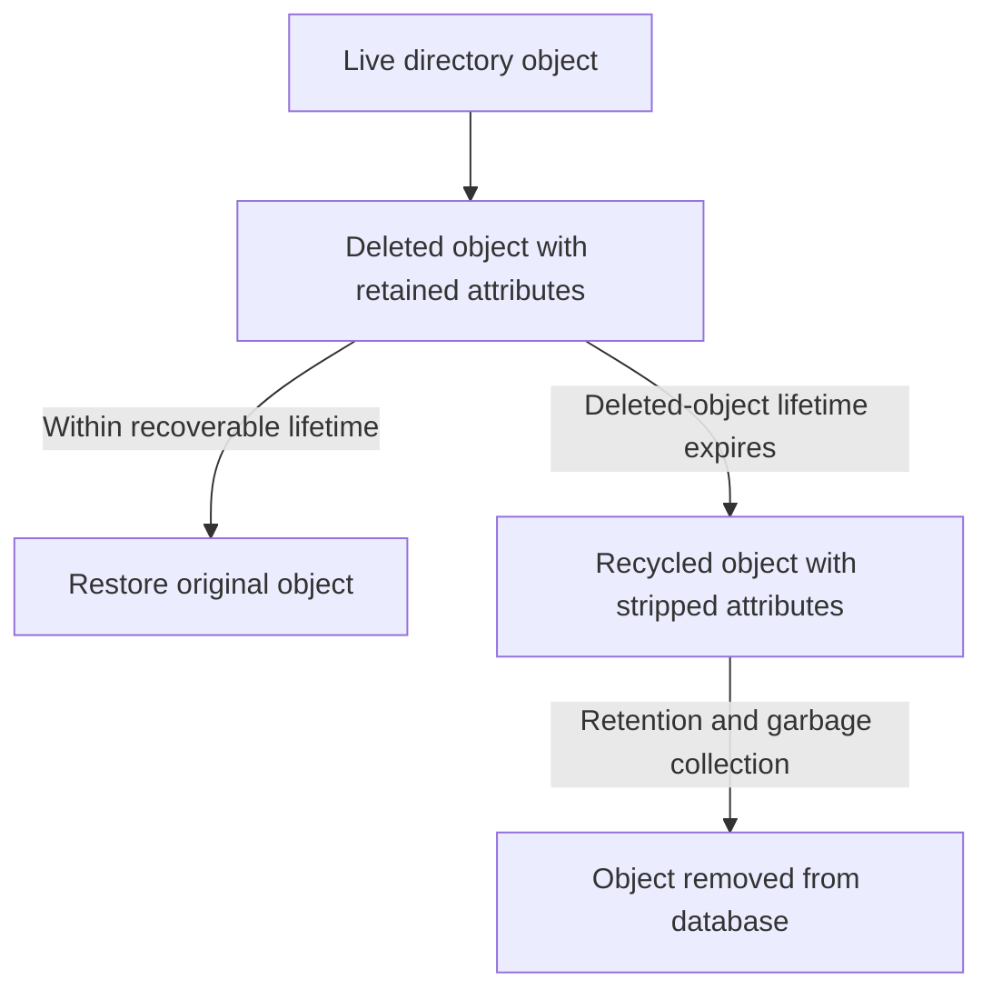

# Active Directory Recycle Bin: Enablement, Retention and Object Recovery

**Restoring the original object is different from creating another object with the same name.**

AD Recycle Bin preserves recoverable directory objects and their retained attributes after deletion. It is valuable for accidental deletions, but it is not an attribute-versioning system, a replacement for backups or an automatic reversal of every downstream change.

This guide covers Windows Server 2022/2025 AD DS, with an explicit single-user restoration example. Forest recovery, DC recovery and compromise response remain separate workflows.

> **TL;DR**
> - Query the forest feature's actual enabled scope; do not infer it from a DC's OS version.
> - Enabling Recycle Bin is irreversible and does not recover objects deleted before enablement.
> - Deleted-object retention and recycled-object retention are different phases.
> - Select the original GUID/SID and verify a live destination container.
> - Restore dependencies in order and verify the resulting permissions and hybrid effects.

## 1. Understand the object lifecycle



The recoverable phase depends on Recycle Bin having been enabled before the deletion. An object with `isRecycled = TRUE` is not a normal Recycle Bin restoration candidate. Increasing a retention value does not reconstruct attributes already stripped or bring a garbage-collected object back.

An object deleted before enablement cannot be retroactively recovered in full through this feature. Legacy tombstone reanimation and backup-based authoritative restoration have different limitations; do not present them as equivalent to a retained Recycle Bin object.

## 2. Verify the forest and enabled scope

Use the AD module and a selected writable DC in the relevant forest. Feature administration requires forest-level rights, typically Enterprise Admins or equivalent delegated authority. Ordinary recovery can use appropriately delegated rights instead of granting permanent broad administration.

```powershell
Import-Module ActiveDirectory -ErrorAction Stop
$domainController = 'dc01.corp.example'
$rootDse = Get-ADRootDSE -Server $domainController -ErrorAction Stop
$forest = Get-ADForest -Server $domainController -ErrorAction Stop
$feature = Get-ADOptionalFeature -Identity 'Recycle Bin Feature' `
    -Server $domainController -ErrorAction Stop
$forestScope = 'CN=Partitions,' + $rootDse.configurationNamingContext

[pscustomobject]@{
    Forest = $forest.Name
    ForestMode = $forest.ForestMode
    FeatureEnabledForForest = @($feature.EnabledScopes) -contains $forestScope
    EnabledScopes = @($feature.EnabledScopes) -join '; '
}
```

The feature requires a forest functional level of Windows Server 2008 R2 or later. Server OS, functional level and enabled-feature state are distinct observations. Existing and newly created forests can have different histories; query rather than assuming a universal default.

## 3. Enable deliberately, before an incident

If the feature is not enabled and prerequisites are met, preview the forest-wide operation:

```powershell
Enable-ADOptionalFeature -Identity 'Recycle Bin Feature' `
    -Scope ForestOrConfigurationSet -Target $forest.Name `
    -Server $domainController -WhatIf
```

Enabling is **irreversible**. There is no supported "disable Recycle Bin" rollback. After reviewing the forest change, apply without `-WhatIf`, confirm it, and verify the enabled scope and replication on the relevant DCs. AD Administrative Center also exposes the enablement operation.

Do not enable the feature during an incident expecting it to recover a deletion that already occurred.

## 4. Inspect retention without guessing its defaults

Read the directory-service object's configured values:

```powershell
$directoryServiceDn = 'CN=Directory Service,CN=Windows NT,CN=Services,' +
    $rootDse.configurationNamingContext

Get-ADObject -Identity $directoryServiceDn -Server $domainController `
    -Properties tombstoneLifetime, 'msDS-DeletedObjectLifetime' -ErrorAction Stop |
    Select-Object DistinguishedName, tombstoneLifetime, 'msDS-DeletedObjectLifetime'
```

`msDS-DeletedObjectLifetime` controls the recoverable deleted-object phase. If it is not explicitly set, the effective deleted-object lifetime follows the effective tombstone lifetime. The latter also participates in retention of recycled objects. Forest creation history and configuration matter; do not assume every forest has 180 days, and do not cast a missing value to zero and report "no retention".

Garbage collection and replication mean that these values are not a guarantee that an object disappears at an exact wall-clock second. Increasing them changes storage and replication considerations and is a separate design change, not a restoration prerequisite to apply automatically.

## 5. Find candidates, then choose one identity

For a deleted account whose retained SAM account name is `LabUser`, inspect candidates in the selected domain:

```powershell
$candidates = @(Get-ADObject `
    -LDAPFilter '(&(isDeleted=TRUE)(!(isRecycled=TRUE))(sAMAccountName=LabUser))' `
    -IncludeDeletedObjects -SearchBase $rootDse.defaultNamingContext `
    -Server $domainController -Properties objectSid, sAMAccountName,
        lastKnownParent, 'msDS-LastKnownRDN', isDeleted, isRecycled, whenChanged `
    -ErrorAction Stop)

$candidates | Select-Object ObjectGUID, ObjectClass, objectSid, sAMAccountName,
    lastKnownParent, 'msDS-LastKnownRDN', isDeleted, isRecycled, whenChanged
```

Several deleted generations may have the same name. Do not take the first row or pipe every match into `Restore-ADObject`. Match the GUID, SID, former location and incident timing to the intended object. A zero-result query is not proof that no deletion occurred: the name may no longer be retained, the object may be in another naming context, or the recovery window may have passed.

`whenChanged` is supporting evidence, not a complete deletion audit trail. For attribution and replication metadata, use [Tracing Deleted Active Directory Objects](../Troubleshoot/Tracing%20Deleted%20Active%20Directory%20Objects%20-%20Events%204726%20and%204743,%20Deleted%20Objects%20and%20Replication%20Metadata.md).

## 6. Check dependencies and access effects

Before restoring:

1. Establish that Recycle Bin was enabled before this deletion.
2. Restore a deleted parent OU/container before its children, or choose an explicit live destination.
3. Resolve naming/SAM/UPN collisions without deleting a newer object merely because it has the old name.
4. Identify related deleted groups and other objects that affect linked-attribute restoration.
5. Review restored account state, privileged memberships and previously granted resource access.
6. Review synchronization/export behavior if the object is in scope for a hybrid identity service.

Restoration can reestablish historical credentials, enabled state and memberships. A different OU changes inherited policy/permissions but does not automatically disable the user. Plan the access impact before the write, not after a successful sign-in surprises the application owner.

## 7. Preview a selected user restoration

The helper is intentionally limited to a normal **user** object. It does not restore DC computer objects, configuration containers or an entire OU tree. It rechecks the feature, deleted state, SID and destination immediately before the operation.

```powershell
function Restore-ReviewedADUser {
    [CmdletBinding(SupportsShouldProcess, ConfirmImpact = 'High')]
    param(
        [Parameter(Mandatory)][guid]$ObjectGuid,
        [Parameter(Mandatory)][ValidateNotNullOrEmpty()][string]$ExpectedSid,
        [Parameter(Mandatory)][ValidateNotNullOrEmpty()][string]$Server,
        [string]$TargetPath
    )

    $root = Get-ADRootDSE -Server $Server -ErrorAction Stop
    $feature = Get-ADOptionalFeature -Identity 'Recycle Bin Feature' `
        -Server $Server -ErrorAction Stop
    $scope = 'CN=Partitions,' + $root.configurationNamingContext
    if (@($feature.EnabledScopes) -notcontains $scope) {
        throw 'Recycle Bin is not enabled for this forest.'
    }

    $deleted = Get-ADObject -Identity $ObjectGuid -IncludeDeletedObjects `
        -Server $Server -Properties objectSid, isDeleted, isRecycled,
            lastKnownParent -ErrorAction Stop
    if ($deleted.ObjectClass -ne 'user' -or $deleted.isDeleted -ne $true -or
        $deleted.isRecycled -eq $true) {
        throw 'Select a retained, deleted normal user object, not a live or recycled object.'
    }
    if ([string]$deleted.objectSid -ne $ExpectedSid) {
        throw 'The deleted object does not match the reviewed SID.'
    }

    $destination = if ($TargetPath) { $TargetPath } else { [string]$deleted.lastKnownParent }
    if ([string]::IsNullOrWhiteSpace($destination)) { throw 'A live destination container is required.' }
    $parent = Get-ADObject -Identity $destination -Server $Server -ErrorAction Stop
    if ($parent.ObjectClass -notin 'organizationalUnit', 'container', 'domainDNS') {
        throw 'The selected destination is not an expected user container.'
    }

    if ($PSCmdlet.ShouldProcess("$ObjectGuid to $($parent.DistinguishedName)", 'Restore reviewed deleted user')) {
        Restore-ADObject -Identity $ObjectGuid -TargetPath $parent.DistinguishedName `
            -Server $Server -Confirm:$false -ErrorAction Stop
        $restored = Get-ADUser -Identity $ObjectGuid -Server $Server `
            -Properties memberOf, primaryGroupID -ErrorAction Stop
        if ([string]$restored.SID -ne $ExpectedSid) { throw 'Restored identity verification failed.' }
        $restored | Select-Object ObjectGUID, SID, SamAccountName, Enabled,
            DistinguishedName, primaryGroupID, memberOf
    }
}

$selectedGuid = [guid](Read-Host 'Reviewed deleted user GUID')
$expectedSid = Read-Host 'Reviewed original user SID'
Restore-ReviewedADUser -ObjectGuid $selectedGuid -ExpectedSid $expectedSid `
    -Server $domainController -TargetPath 'OU=Recovered Users,DC=corp,DC=example' -WhatIf
```

The destination OU must already exist. `-WhatIf` performs the read/preflight checks but does not restore the object. After reviewing the identity and access effects, invoke without `-WhatIf` and confirm. `Restore-ADObject` defaults to the retained RDN when no new name is specified; this helper does not rename away a collision automatically.

A query can fail because of insufficient deleted-object/container permissions, not just because the object is missing. Preserve that distinction. Restoration also requires a writable DC; do not redirect this operation to a mounted snapshot or an RODC.

## 8. Verify more than the return code

After an actual restoration, re-read the same GUID on the selected DC:

```powershell
Get-ADUser -Identity $selectedGuid -Server $domainController `
    -Properties memberOf, primaryGroupID, userAccountControl, AccountExpirationDate `
    -ErrorAction Stop |
    Select-Object ObjectGUID, SID, SamAccountName, UserPrincipalName, Enabled,
        DistinguishedName, primaryGroupID, memberOf, userAccountControl, AccountExpirationDate
```

Verify the original GUID/SID, expected parent/name, account state, retained attributes and memberships. Check relevant groups directly, replication to another DC and the application/hybrid outcome. A restored user and a separately restored group can require an ordered, dependency-aware recovery; do not promise every historical relationship merely because one restore command succeeded.

Do not test with a highly privileged identity and treat that success as proof of the user's effective access. Use a fresh appropriate session and the actual resource permissions.

## 9. Know when to use another recovery method

| Situation | Next path |
|---|---|
| Retained object deleted after feature enablement | Targeted Recycle Bin recovery |
| Historical attribute overwritten on a live object | Inspect a snapshot/backup and plan a specific correction |
| Object recycled, purged or deleted before enablement | Assess supported backup-based recovery and its limitations |
| Broad logical corruption or multiple DC failures | Forest/DC recovery plan, not a mass Recycle Bin pipeline |
| Compromise or untrusted historical state | Incident-response and credential/access recovery decisions |

Use [Inspecting Active Directory Snapshots](Inspecting%20Active%20Directory%20Snapshots%20-%20ntdsutil,%20dsamain%20and%20Recovery%20Boundaries.md) to examine historical state and [Recovering a Single-Domain Active Directory Forest](Recovering%20a%20Single-Domain%20Active%20Directory%20Forest.md) for forest-level recovery.

There is no universal "undo restore" button. Blindly deleting a restored object can create another deletion generation and trigger new downstream changes. Retain the recovery record and review any reversal as a new operation.

## References

- [Microsoft: enable Active Directory Recycle Bin and restore objects](https://learn.microsoft.com/en-us/windows-server/identity/ad-ds/get-started/adac/active-directory-recycle-bin)
- [Microsoft: Restore-ADObject](https://learn.microsoft.com/en-us/powershell/module/activedirectory/restore-adobject)
- [Microsoft: Get-ADOptionalFeature](https://learn.microsoft.com/en-us/powershell/module/activedirectory/get-adoptionalfeature)
- [Microsoft: ms-DS-Deleted-Object-Lifetime attribute](https://learn.microsoft.com/en-us/windows/win32/adschema/a-msds-deletedobjectlifetime)
- [Microsoft: determine how to recover an AD forest](https://learn.microsoft.com/en-us/windows-server/identity/ad-ds/manage/forest-recovery-guide/ad-forest-recovery-determine-how-to-recover)