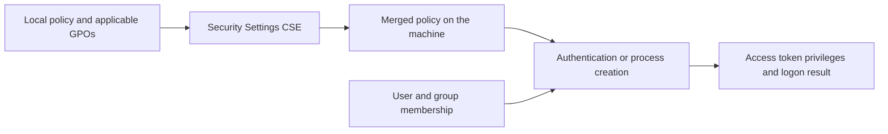
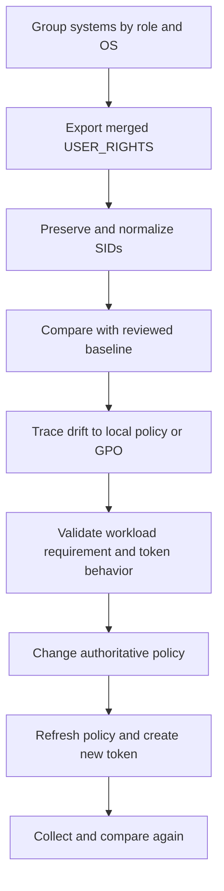

# Auditing User Rights Assignment Across Windows Systems

User Rights Assignment controls who can sign in through different logon types and who can perform privileged operating-system actions. A reliable audit must distinguish configured GPO sources, the merged policy on each machine, and privileges present in a particular access token.

> **TL;DR**
>
> - Export the merged local and domain policy with `secedit /export /mergedpolicy /areas user_rights`.
> - Preserve SIDs as the comparison key; translated account names are display metadata.
> - Collect on the target machine through controlled PowerShell remoting.
> - `whoami /priv` shows the current token, not every account assigned to a user right.
> - Compare systems by role and OS baseline; there is no safe universal assignment list.

## 1. Privileges and logon rights

The **User Rights Assignment** policy node contains two related categories:

| Category | Examples | Purpose |
|---|---|---|
| Privileges | `SeDebugPrivilege`, `SeBackupPrivilege`, `SeImpersonatePrivilege` | Permit sensitive operating-system operations |
| Logon rights | `SeServiceLogonRight`, `SeRemoteInteractiveLogonRight` | Permit a logon type |
| Deny logon rights | `SeDenyServiceLogonRight`, `SeDenyRemoteInteractiveLogonRight` | Explicitly block a logon type |

The policy path is:

```text
Computer Configuration
  Policies
    Windows Settings
      Security Settings
        Local Policies
          User Rights Assignment
```

A user can receive a right directly or through local/domain group membership. For corresponding logon types, a deny right takes precedence over an allow right. Membership expansion and token creation also matter, so changing an assignment does not rewrite existing access tokens.

## 2. Three views that must not be confused



| View | Question | Tool |
|---|---|---|
| Configured source | Which local policy or GPO declares the assignment? | GPMC report, GPO backup, `GptTmpl.inf` |
| Merged machine policy | Which principals are assigned on this system now? | `secedit /export /mergedpolicy` |
| Current token | Which privileges are in this process token, and are they enabled? | `whoami /priv` |

An assignment does not prove that a specific process token contains an enabled privilege. Conversely, `whoami /priv` cannot identify every user or group assigned that privilege on the computer.

## 3. Export the merged policy

Run from an elevated shell on the target system:

```powershell
$exportPath = Join-Path $env:TEMP 'UserRights.inf'
$logPath = Join-Path $env:TEMP 'UserRights.log'

secedit.exe /export /mergedpolicy /cfg $exportPath `
    /areas user_rights /log $logPath /quiet

if ($LASTEXITCODE -ne 0) {
    throw "secedit export failed with exit code $LASTEXITCODE. See $logPath"
}

Get-Content -LiteralPath $exportPath
```

`/mergedpolicy` asks `secedit` to merge domain and local security policy settings. Omitting it changes the evidence being collected and can hide the domain-policy contribution.

The relevant INF section looks like this:

```ini
[Privilege Rights]
SeBackupPrivilege = *S-1-5-32-544
SeServiceLogonRight = *S-1-5-80-0
```

The leading `*` marks a SID in security-template syntax. Keep the SID even when translation succeeds: account names can be renamed, localized or unavailable when the audit runs.

## 4. Return structured PowerShell objects

The following function exports only the User Rights area, parses only the `[Privilege Rights]` section, preserves raw SIDs, and cleans up its temporary files:

```powershell
function Get-UserRightAssignment {
    [CmdletBinding()]
    param()

    $exportPath = Join-Path $env:TEMP "$([guid]::NewGuid()).inf"
    $logPath = Join-Path $env:TEMP "$([guid]::NewGuid()).log"

    function Resolve-PrincipalName {
        param([Parameter(Mandatory)][string]$Identity)

        $normalizedIdentity = $Identity.Trim().TrimStart('*')

        try {
            $sid = [System.Security.Principal.SecurityIdentifier]::new(
                $normalizedIdentity
            )
            $name = $sid.Translate(
                [System.Security.Principal.NTAccount]
            ).Value
        } catch {
            $name = $normalizedIdentity
        }

        [pscustomobject]@{
            Sid  = $normalizedIdentity
            Name = $name
        }
    }

    try {
        & "$env:SystemRoot\System32\secedit.exe" /export /mergedpolicy `
            /cfg $exportPath /areas user_rights /log $logPath /quiet

        if ($LASTEXITCODE -ne 0) {
            throw "secedit failed with exit code $LASTEXITCODE"
        }

        $insidePrivilegeRights = $false

        foreach ($line in Get-Content -LiteralPath $exportPath) {
            if ($line -match '^\s*\[(?<Section>[^]]+)\]\s*$') {
                $insidePrivilegeRights =
                    $Matches.Section -eq 'Privilege Rights'
                continue
            }

            if (-not $insidePrivilegeRights) {
                continue
            }

            if ($line -notmatch '^\s*(?<Right>Se[^=\s]+)\s*=\s*(?<Subjects>.*)$') {
                continue
            }

            $right = $Matches.Right
            $subjects = $Matches.Subjects.Trim()

            if ([string]::IsNullOrWhiteSpace($subjects)) {
                [pscustomobject]@{
                    ComputerName = $env:COMPUTERNAME
                    Right        = $right
                    PrincipalSid = $null
                    Principal    = '<No principals>'
                }
                continue
            }

            foreach ($subject in $subjects -split ',') {
                $principal = Resolve-PrincipalName -Identity $subject

                [pscustomobject]@{
                    ComputerName = $env:COMPUTERNAME
                    Right        = $right
                    PrincipalSid = $principal.Sid
                    Principal    = $principal.Name
                }
            }
        }
    } finally {
        Remove-Item -LiteralPath $exportPath, $logPath `
            -Force -ErrorAction SilentlyContinue
    }
}

Get-UserRightAssignment |
    Sort-Object Right, Principal
```

The parser deliberately does not replace unknown SIDs with an empty value. An unresolved SID can identify a deleted account, an unavailable domain or a trust/connectivity problem, all of which are useful audit findings.

## 5. Collect from remote Windows systems

PowerShell remoting executes `secedit` on each target, so no SMB copy or second-hop access is required:

```powershell
$computers = @(
    'APP01.contoso.com'
    'APP02.contoso.com'
    'SQL01.contoso.com'
)

$collector = ${function:Get-UserRightAssignment}

$inventory = Invoke-Command `
    -ComputerName $computers `
    -ScriptBlock $collector `
    -ThrottleLimit 8

$inventory |
    Select-Object PSComputerName, Right, PrincipalSid, Principal |
    Export-Csv -Path '.\UserRights-Inventory.csv' `
        -NoTypeInformation -Encoding utf8
```

Prerequisites:

- WinRM is configured and allowed through the firewall.
- The collection identity can use the endpoint and export security policy.
- Name resolution and Kerberos work for the target names.
- The remoting endpoint runs Windows PowerShell or PowerShell on Windows.

Do not solve access failures by using Domain Admins for routine collection. Use a dedicated, constrained administration path and delegate only what the collector requires. Record unreachable systems separately; absence of output is not evidence of compliance.

## 6. Normalize and compare by SID

Create a baseline from a reviewed, representative system for each role and OS release:

```powershell
$baseline = Import-Csv '.\Baseline-WindowsServer2025-Member.csv'
$current = Import-Csv '.\UserRights-Inventory.csv' |
    Where-Object PSComputerName -eq 'APP01.contoso.com'

Compare-Object `
    -ReferenceObject $baseline `
    -DifferenceObject $current `
    -Property Right, PrincipalSid `
    -PassThru |
    Sort-Object Right, PrincipalSid
```

Interpret `SideIndicator` carefully:

- `=>` exists on the audited system but not in the baseline;
- `<=` exists in the baseline but not on the audited system.

Compare SIDs, not translated names. Built-in account names are localized, domain objects can be renamed, and the same display name can refer to different security principals.

## 7. Find inconsistent peers

Systems with the same role should usually expose the same normalized assignment set:

```powershell
$fingerprints = $inventory |
    Group-Object PSComputerName |
    ForEach-Object {
        $normalized = $_.Group |
            Sort-Object Right, PrincipalSid |
            ForEach-Object { "$($_.Right)|$($_.PrincipalSid)" }

        $bytes = [Text.Encoding]::UTF8.GetBytes($normalized -join "`n")
        $hash = [Convert]::ToHexString(
            [Security.Cryptography.SHA256]::HashData($bytes)
        )

        [pscustomobject]@{
            ComputerName = $_.Name
            Fingerprint  = $hash
        }
    }

$fingerprints | Group-Object Fingerprint |
    Sort-Object Count, Name
```

A different fingerprint is a triage signal, not proof of compromise. Separate systems by role, operating-system release and intentionally different application requirements before comparing them.

The `SHA256.HashData` and `Convert.ToHexString` methods require modern .NET. On Windows PowerShell 5.1, write the normalized strings to controlled files and use `Get-FileHash` instead.

## 8. Trace an assignment back to Group Policy

The merged export tells you what is configured, not which GPO won. Generate RSoP evidence and GPO reports:

```powershell
$output = 'C:\ProgramData\UserRightsAudit'
New-Item -Path $output -ItemType Directory -Force | Out-Null

gpresult.exe /scope computer /h (Join-Path $output 'Computer-RSoP.html') /f

Import-Module GroupPolicy
Get-GPOReport -All -ReportType Html `
    -Path (Join-Path $output 'All-GPOs.html')
```

For a GPO that configures security settings, the source data is normally in:

```text
\\<domain>\SYSVOL\<domain>\Policies\{GPO-GUID}\
  Machine\Microsoft\Windows NT\SecEdit\GptTmpl.inf
```

Inspect `GptTmpl.inf` read-only and correlate the GPO GUID with `Get-GPO`. Do not edit SYSVOL directly.

```powershell
$gpo = Get-GPO -Name 'C-Servers-User-Rights'
$domain = $gpo.DomainName
$template = "\\$domain\SYSVOL\$domain\Policies\{$($gpo.Id)}" +
    '\Machine\Microsoft\Windows NT\SecEdit\GptTmpl.inf'

Get-Content -LiteralPath $template
```

If several applicable GPOs configure the same right, use RSoP and link precedence to identify the winning source. Do not assume that principal lists from every GPO are combined.

## 9. Inspect one process token

Use these commands only after the assignment audit:

```powershell
whoami.exe /user
whoami.exe /groups
whoami.exe /priv
```

`whoami /priv` answers which privileges are present in the current process token and whether each is enabled or disabled. It does not list logon rights, other users' privileges or all LSA assignments.

A new group membership or User Rights Assignment normally requires a new logon or process token before it is visible. Restarting a service, signing out, or rebooting may be required depending on the account and workload.

## 10. Prioritize high-impact rights

Review every assignment against the Microsoft security baseline for that exact OS and role. Give particular attention to:

| Constant | Display name | Why it matters |
|---|---|---|
| `SeTcbPrivilege` | Act as part of the operating system | Trusted-computing-base level capability |
| `SeCreateTokenPrivilege` | Create a token object | Can create primary tokens |
| `SeDebugPrivilege` | Debug programs | Can access or modify other processes |
| `SeImpersonatePrivilege` | Impersonate a client after authentication | Common privilege-escalation target on services |
| `SeBackupPrivilege` | Back up files and directories | Can bypass file read ACLs |
| `SeRestorePrivilege` | Restore files and directories | Can bypass file write ACLs and set ownership |
| `SeTakeOwnershipPrivilege` | Take ownership of files or other objects | Can take control of securable objects |
| `SeLoadDriverPrivilege` | Load and unload device drivers | Extends control into the kernel |
| `SeSecurityPrivilege` | Manage auditing and security log | Controls security-log and SACL operations |
| `SeEnableDelegationPrivilege` | Enable accounts to be trusted for delegation | Changes high-impact Kerberos delegation state |

Service accounts legitimately require some rights. The finding is not merely “principal has a privilege”; it is “principal has a privilege without a documented workload requirement and controlled lifecycle.”

For AD delegation administration, review `SeEnableDelegationPrivilege` on the **DC processing the directory change**, not merely on the operator's workstation. The right does not grant directory-write access: protected delegation UAC changes and updates to the traditional KCD attribute `msDS-AllowedToDelegateTo` require the applicable privilege and object permissions. A service using Kerberos delegation does not itself need this administrative right just to perform S4U operations.

RBCD is a separate case: permission to change the back-end account's `msDS-AllowedToActOnBehalfOfOtherIdentity` is security-sensitive even without this privilege. A `secedit /export /areas user_rights` report does not contain those AD object ACLs and cannot, by itself, identify everyone who can configure delegation. See [Kerberos Delegation Explained](../Concepts/Kerberos%20Delegation%20Explained%20-%20KCD,%20Protocol%20Transition%20and%20RBCD.md) for the distinction between the caller's privilege, attribute-write access and the RBCD descriptor.

## 11. Audit deny and allow pairs

For logon rights, review the pair together:

| Allow | Deny |
|---|---|
| `SeNetworkLogonRight` | `SeDenyNetworkLogonRight` |
| `SeInteractiveLogonRight` | `SeDenyInteractiveLogonRight` |
| `SeRemoteInteractiveLogonRight` | `SeDenyRemoteInteractiveLogonRight` |
| `SeBatchLogonRight` | `SeDenyBatchLogonRight` |
| `SeServiceLogonRight` | `SeDenyServiceLogonRight` |

An account can be included in both through different group memberships. The deny right wins for that logon type. Expand nested membership when diagnosing a failed logon and inspect the relevant Security event, not only the allow assignment.

## 12. Operational workflow



Remediate the authoritative source. If a domain GPO controls the right, changing Local Security Policy creates only temporary or misleading state. After remediation, refresh computer policy, allow replication, create a new token where required, and collect again.

## 13. Historical source-note captures

The original note used a third-party `Get-Rights.ps1` script. Both captures are retained in source order, but the workflow above replaces that unversioned script with current inbox commands and SID-preserving output.

### 13.1 Launching the historical script


The capture includes a personal path and account name from the original environment. Treat such metadata as historical context, not as deployment guidance.

### 13.2 Historical tabular output


The table usefully separates the constant, display name and principal. The modern collector adds the raw SID and computer identity so output remains stable across renames and localized systems.

## References

- [secedit export](https://learn.microsoft.com/en-us/windows-server/administration/windows-commands/secedit-export)
- [User Rights Assignment](https://learn.microsoft.com/en-us/windows/security/threat-protection/security-policy-settings/user-rights-assignment)
- [Privilege constants](https://learn.microsoft.com/en-us/windows/win32/secauthz/privilege-constants)
- [Invoke-Command](https://learn.microsoft.com/en-us/powershell/module/microsoft.powershell.core/invoke-command)
- [Get-GPOReport](https://learn.microsoft.com/en-us/powershell/module/grouppolicy/get-gporeport)
- [Microsoft Security Compliance Toolkit](https://learn.microsoft.com/en-us/windows/security/operating-system-security/device-management/windows-security-configuration-framework/security-compliance-toolkit-10)
- [Enable computer and user accounts to be trusted for delegation](https://learn.microsoft.com/en-us/windows/security/threat-protection/security-policy-settings/enable-computer-and-user-accounts-to-be-trusted-for-delegation)