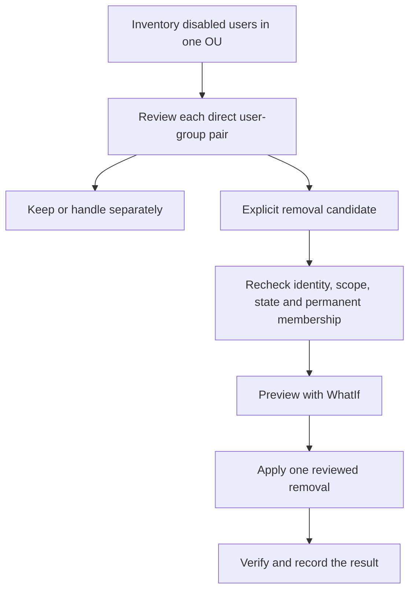

# Cleaning Up Group Memberships for Disabled AD Users

**A disabled account is a review candidate, not authorization to erase its entire access history.**

Removing memberships can reduce residual access and simplify deprovisioning, but it can also disrupt reactivation, application ownership, mail distribution and downstream synchronization. Inventory first, review individual user/group pairs, then revalidate each pair immediately before changing it.

The Windows Server 2022/2025 workflow below targets direct, permanent memberships in ordinary groups in one domain. It is not a forest-wide access-revocation engine.

> **TL;DR**
> - Keep the inventory and reviewed removal plan before modifying AD.
> - Use GUIDs and SIDs, not names that can be reused or localized.
> - Identify the primary group by SID/RID, not by the string "Domain Users".
> - Recheck disabled state, OU scope and membership on the chosen writable DC.
> - Refuse TTL, built-in and cross-domain cases in this generic workflow.
> - Preserve partial results; a multi-group cleanup is not an atomic transaction.

## 1. Decide what cleanup means

| Observation | Consequence |
|---|---|
| `Enabled = False` | The account is disabled; it may be temporarily suspended, retained for recovery or used by an application |
| Empty `memberOf` | No memberships returned by that backlink query; not proof of zero effective access |
| Primary group | Represented through `primaryGroupID`, not an ordinary `memberOf` entry |
| Nested membership | Effective access can come through several group paths; remove only the direct link selected for review |
| Cross-domain / FSP membership | Requires a resource-domain inventory; a home-domain query is not complete coverage |
| Existing token or application session | Membership removal does not necessarily terminate it immediately |

Do not change the primary group, delete the account, purge SIDHistory or remove direct ACL grants as hidden side effects of membership cleanup. Those are separate decisions.

Review temporarily disabled administrators, break-glass accounts, service identities, distribution groups and group-based application/licensing dependencies with their owners. For the underlying disabled flag, see [Understanding UserAccountControl](../Concepts/Understanding%20UserAccountControl%20-%20Flags,%20Computed%20State%20and%20Safe%20Changes.md).



## 2. Export the candidate pairs

Run from an AD management host using Windows PowerShell 5.1 and a current AD module. Reading requires access to the target population; applying changes requires the delegated ability to modify the selected groups. Use an existing, access-restricted evidence directory.

The inventory stops on lookup errors rather than labeling an unreadable group as absent. Every row defaults to **Keep**.

```powershell
Import-Module ActiveDirectory -ErrorAction Stop
$domainController = 'dc01.corp.example'
$searchBase = 'OU=Disabled Users,DC=corp,DC=example'
$evidenceDirectory = 'C:\AdminEvidence\MembershipCleanup'
if (-not (Test-Path -LiteralPath $evidenceDirectory -PathType Container)) {
    throw 'Prepare an access-restricted evidence directory first.'
}

$controller = Get-ADDomainController -Identity $domainController `
    -Server $domainController -ErrorAction Stop
if ($controller.IsReadOnly) { throw 'Select a writable domain controller.' }

$users = @(Get-ADUser -Filter { Enabled -eq $false } -SearchBase $searchBase `
    -SearchScope Subtree -Server $domainController `
    -Properties memberOf, primaryGroupID -ErrorAction Stop)

$plan = @(foreach ($user in $users) {
    $primaryGroupSid = '{0}-{1}' -f $user.SID.AccountDomainSid.Value, $user.primaryGroupID
    foreach ($groupDn in @($user.memberOf)) {
        $group = Get-ADGroup -Identity $groupDn -Server $domainController -ErrorAction Stop
        if ($group.SID.Value -eq $primaryGroupSid) { continue }
        [pscustomobject]@{
            UserObjectGuid = $user.ObjectGUID.ToString()
            UserSid = $user.SID.Value
            UserName = $user.SamAccountName
            GroupObjectGuid = $group.ObjectGUID.ToString()
            GroupSid = $group.SID.Value
            GroupName = $group.Name
            GroupCategory = $group.GroupCategory
            GroupScope = $group.GroupScope
            ReadFromDC = $domainController
            CapturedUtc = [datetime]::UtcNow.ToString('o')
            Decision = 'Keep'
        }
    }
})

$planPath = Join-Path $evidenceDirectory 'GroupMembershipPlan.csv'
if ($plan.Count -eq 0) {
    'No direct membership candidates were returned; no plan file was written.'
} else {
    $plan | Export-Csv -LiteralPath $planPath -NoTypeInformation `
        -Encoding UTF8 -NoClobber -ErrorAction Stop
}
```

An empty result does not mean the account has no access anywhere. `memberOf` does not expand nested groups or replace a resource-domain/FSP review. Directory query failures must be resolved before trusting an inventory.

## 3. Review the plan without turning it into executable code

Keep an unmodified inventory copy. Set `Decision` to `Remove` only for the selected user/group pairs in the reviewed copy, and retain the owner/change reference outside or alongside the CSV. Protect the reviewed file from untrusted modification.

```powershell
$reviewedPath = Join-Path $evidenceDirectory 'GroupMembershipPlan-reviewed.csv'
$approved = @(Import-Csv -LiteralPath $reviewedPath -ErrorAction Stop |
    Where-Object { $_.Decision -eq 'Remove' })

if ($approved.Count -eq 0) { throw 'No pairs were explicitly selected for removal.' }

$approved | Select-Object UserName, UserObjectGuid, GroupName,
    GroupObjectGuid, GroupCategory, GroupScope, Decision
```

The CSV supplies data, not PowerShell to execute. Names are for the reviewer; the action uses object GUIDs and verifies the retained SIDs. Do not turn a filtered inventory directly into a removal pipeline before review.

## 4. Revalidate and remove one permanent membership

The helper below queries the user's GUID **inside the selected OU scope**, rejects re-enabled accounts, verifies both SIDs, excludes the primary group and requires an ordinary same-domain group. It also refuses a TTL link instead of creating an ambiguous rollback plan.

```powershell
function Remove-ReviewedDisabledUserMembership {
    [CmdletBinding(SupportsShouldProcess, ConfirmImpact = 'High')]
    param(
        [Parameter(Mandatory)][guid]$UserObjectGuid,
        [Parameter(Mandatory)][string]$UserSid,
        [Parameter(Mandatory)][guid]$GroupObjectGuid,
        [Parameter(Mandatory)][string]$GroupSid,
        [Parameter(Mandatory)][ValidateNotNullOrEmpty()][string]$SearchBase,
        [Parameter(Mandatory)][ValidateNotNullOrEmpty()][string]$Server
    )

    $escapedGuid = -join ($UserObjectGuid.ToByteArray() | ForEach-Object { '\{0:X2}' -f $_ })
    $matchesInScope = @(Get-ADUser -LDAPFilter "(objectGUID=$escapedGuid)" `
        -SearchBase $SearchBase -SearchScope Subtree -Server $Server `
        -Properties memberOf, primaryGroupID -ErrorAction Stop)
    if ($matchesInScope.Count -ne 1) { throw 'The reviewed user is no longer uniquely present in the selected OU scope.' }
    $user = $matchesInScope[0]
    if ($user.Enabled -ne $false) { throw 'The user is no longer disabled.' }
    if ($user.SID.Value -ne $UserSid) { throw 'User identity no longer matches the reviewed SID.' }

    $group = Get-ADGroup -Identity $GroupObjectGuid -Server $Server `
        -Properties member -ShowMemberTimeToLive -ErrorAction Stop
    if ($group.SID.Value -ne $GroupSid) { throw 'Group identity no longer matches the reviewed SID.' }
    if ($null -eq $group.SID.AccountDomainSid -or
        $group.SID.AccountDomainSid -ne $user.SID.AccountDomainSid) {
        throw 'Built-in or cross-domain groups require a separate review and workflow.'
    }

    $primaryGroupSid = '{0}-{1}' -f $user.SID.AccountDomainSid.Value, $user.primaryGroupID
    if ($group.SID.Value -eq $primaryGroupSid) { throw 'The primary group must not be removed.' }

    foreach ($member in @($group.member)) {
        if ($member -match '^<TTL=[0-9]+,(?<dn>.*)>$' -and
            $Matches['dn'] -eq $user.DistinguishedName) {
            throw 'TTL membership requires its own expiry-aware workflow.'
        }
    }
    $listedByUser = @($user.memberOf) -contains $group.DistinguishedName
    $listedByGroup = @($group.member) -contains $user.DistinguishedName
    if ($listedByUser -ne $listedByGroup) {
        throw 'The current group and user views do not confirm the same permanent membership.'
    }

    $status = 'AlreadyAbsent'
    if ($listedByGroup) {
        $status = 'NotApplied'
        if ($PSCmdlet.ShouldProcess("$UserSid in $GroupSid", 'Remove reviewed direct permanent membership')) {
            Remove-ADGroupMember -Identity $group.ObjectGUID -Members $user.ObjectGUID `
                -Server $Server -DisablePermissiveModify -Confirm:$false -ErrorAction Stop
            $verified = Get-ADUser -Identity $user.ObjectGUID -Server $Server `
                -Properties memberOf -ErrorAction Stop
            if (@($verified.memberOf) -contains $group.DistinguishedName) {
                throw 'The removal did not pass the same-DC membership verification.'
            }
            $status = 'Removed'
        }
    }

    [pscustomobject]@{
        UserObjectGuid = $UserObjectGuid
        UserSid = $UserSid
        GroupObjectGuid = $GroupObjectGuid
        GroupSid = $GroupSid
        Server = $Server
        Status = $status
        ObservedUtc = [datetime]::UtcNow.ToString('o')
    }
}
```

`-DisablePermissiveModify`, available in current AD modules, prevents a concurrent disappearance of the membership from being silently accepted as a successful removal. The outer `ShouldProcess` decision controls the mutation; the inner `-Confirm:$false` avoids a second prompt for that same single action.

The group query reads `member` to distinguish permanent and TTL membership. This can be expensive for very large groups. Keep the population bounded and use a dedicated review for unusually large or complex groups rather than running this across the entire forest.

## 5. Preview, then execute the reviewed subset

Use the same selected DC and OU scope, not values substituted from arbitrary CSV columns. This example performs directory reads but no membership writes. It does write a local result report:

```powershell
$journalPath = Join-Path $evidenceDirectory ('MembershipResults-{0}.csv' -f [guid]::NewGuid().ToString('N'))

foreach ($row in $approved) {
    $parameters = @{
        UserObjectGuid = [guid]$row.UserObjectGuid
        UserSid = $row.UserSid
        GroupObjectGuid = [guid]$row.GroupObjectGuid
        GroupSid = $row.GroupSid
        SearchBase = $searchBase
        Server = $domainController
    }
    $result = Remove-ReviewedDisabledUserMembership @parameters -WhatIf
    $result | Export-Csv -LiteralPath $journalPath -Append `
        -NoTypeInformation -Encoding UTF8 -ErrorAction Stop
}
```

Check the preview and resolve every refused pair. To apply the selected subset, start a new result journal and remove `-WhatIf`; the helper then asks for confirmation. Do not add an exception handler that suppresses failed removals and reports the whole batch as complete.

A successful prior row remains changed if a later row fails. A verification or journal-write failure can occur after AD accepted a change. Reconcile current membership with the original plan and partial journal before retrying; do not assume an exception implies that nothing changed.

The read/check/write sequence is not a transaction. Coordinate concurrent reactivation and membership automation, because a user can be moved or re-enabled between the final check and the write. The helper reduces stale-plan risk but cannot eliminate every race.

## 6. Verify the remaining state

```powershell
$userGuids = @($approved.UserObjectGuid | Sort-Object -Unique)
foreach ($userGuid in $userGuids) {
    Get-ADUser -Identity ([guid]$userGuid) -Server $domainController `
        -Properties memberOf, primaryGroupID -ErrorAction Stop |
        Select-Object ObjectGUID, SamAccountName, Enabled, primaryGroupID, memberOf
}
```

Verify the intended links are gone, retained memberships remain, and the primary group is unchanged. Check replication on another relevant DC and downstream identity/application processing. Do not equate immediate membership removal with termination of every previously established session or token.

## 7. Make recovery a reviewed operation

The inventory preserves which direct memberships existed; it is not an automatic command to restore all historical privileges. Before restoring a pair, verify that both original GUIDs/SIDs still identify the intended objects, that the group still has the same purpose, and that regranting access is appropriate.

Use `Add-ADGroupMember` for a specifically reviewed permanent membership. Do not recreate deleted groups/accounts by name or restore an expiring link as permanent. TTL memberships were deliberately excluded from this workflow; use the [JIT administration guide](Active%20Directory%20Just%20In%20Time%20Administration/Active%20Directory%20Just%20In%20Time%20Administration.md) for their semantics.

For cross-domain access, include a [Foreign Security Principal review](../Concepts/What%20are%20FSPs%20-%20Audit%20and%20Manage%20them%20in%20AD.md). A clean home-domain membership report is not proof that every resource-domain grant has disappeared.

## References

- [Microsoft: Get-ADUser](https://learn.microsoft.com/en-us/powershell/module/activedirectory/get-aduser)
- [Microsoft: Get-ADGroup and ShowMemberTimeToLive](https://learn.microsoft.com/en-us/powershell/module/activedirectory/get-adgroup)
- [Microsoft: Remove-ADGroupMember](https://learn.microsoft.com/en-us/powershell/module/activedirectory/remove-adgroupmember)
- [Microsoft: primaryGroupID attribute](https://learn.microsoft.com/en-us/windows/win32/adschema/a-primarygroupid)
- [Microsoft: memberOf attribute](https://learn.microsoft.com/en-us/windows/win32/adschema/a-memberof)