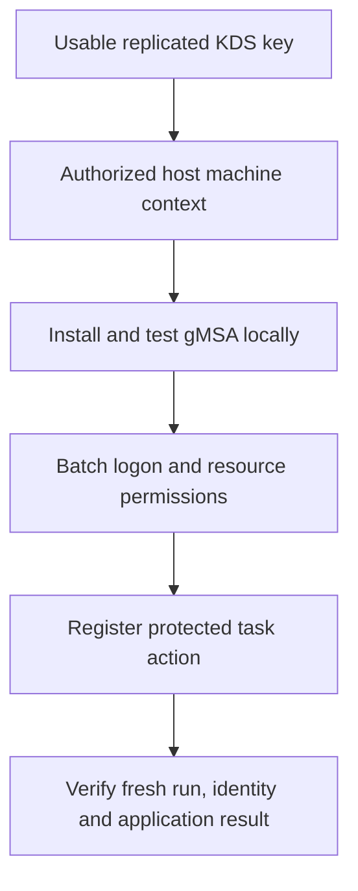

# Deploying gMSAs: KDS, Host Authorization and Scheduled Tasks

**A managed password removes manual password distribution. It does not remove the need to control who can obtain it or what the account can do.**

A group Managed Service Account (gMSA) lets supported services and scheduled tasks use a domain identity whose password is managed through AD and Key Distribution Services (KDS). Multiple authorized hosts can use the identity without an administrator embedding its password in a script or task definition.

This guide targets Windows Server 2022/2025 task hosts and current AD tooling. It combines account provisioning, host authorization and a small verifiable task workflow; it does not assume that every application supports gMSAs.

> **TL;DR**
> - Reuse an existing usable KDS root key; do not create one per service account.
> - Allow the KDS replication safety interval and verify replication.
> - Restrict password retrieval to the required host identities.
> - Test the gMSA locally on every execution host.
> - A scheduled task needs batch-logon and resource permissions, not Domain Admin membership.
> - Register the gMSA principal without entering or extracting its password.

## 1. Choose the account type deliberately

| Identity | Typical scope | Operational distinction |
|---|---|---|
| Built-in or virtual service identity | One Windows host | Network identity and isolation depend on the identity type |
| Standalone MSA (sMSA) | One associated host | Not a shared farm identity |
| gMSA | One or more explicitly authorized domain-joined hosts | DC-managed password, retrieved by authorized hosts |
| Ordinary domain user | Application-dependent | Password lifecycle and distribution remain your responsibility |

The "group" in gMSA does not mean that all domain computers can retrieve its password. Nor does creating a gMSA configure application permissions, DNS records or every required SPN automatically.

Use a separate identity per meaningful workload/security boundary. A host authorized to retrieve a privileged gMSA's password becomes part of that identity's security boundary. The group controlling retrieval deserves the same review as the account's resource privileges.

## 2. Establish prerequisites and ownership

Use supported DCs, healthy replication, functioning domain DNS/time, a suitable AD schema and the functional levels required by the supported deployment. Microsoft's current management guidance recommends Windows Server 2012 or later domain/forest functional levels. A functional-level change is its own compatibility decision, not an incidental command in a task setup.

Provisioning needs delegated rights to create/manage the host group and `msDS-GroupManagedServiceAccount` object. KDS administration has separate privileged requirements. Host installation/task registration requires the appropriate local administration rights; the runtime gMSA should receive only the workload's permissions.

From an AD management host:

```powershell
Import-Module ActiveDirectory -ErrorAction Stop
$domainController = 'dc01.corp.example'
Get-ADDomain -Server $domainController -ErrorAction Stop |
    Select-Object DNSRoot, DomainMode, PDCEmulator
Get-ADForest -Server $domainController -ErrorAction Stop |
    Select-Object Name, ForestMode
```

For application-specific migrations, also follow the product's supported process. The existing [AD FS gMSA migration guide](../../070%20-%20ADFS/How-to/ADFS%20Migrate%20Service%20Account%20to%20gMSA.md) handles AD FS permissions and farm sequencing separately.

## 3. Verify KDS without exporting key material

KDS root-key objects reside in the forest Configuration partition. They are not a per-host password file. On a DC with the KDS module, inspect only metadata:

```powershell
Import-Module KDS -ErrorAction Stop
Get-KdsRootKey -ErrorAction Stop |
    Select-Object KeyId, CreationTime, EffectiveTime
```

Do not use `Format-List *` or publish root-key data. Protect KDS keys and DC backups as Tier 0 material.

If the forest has no usable key, determine whether one is already being created or replicated before creating another. The following is a real, separate provisioning operation on the selected DC:

```powershell
$existingKeys = @(Get-KdsRootKey -ErrorAction Stop)
if ($existingKeys.Count -gt 0) {
    throw 'Existing KDS keys require review/reuse; do not create another key automatically.'
}
Add-KdsRootKey -EffectiveImmediately -ErrorAction Stop
```

Despite the name, `-EffectiveImmediately` does not remove the documented **up-to-ten-hour safety interval** before gMSA use. The interval allows replication convergence; waiting is not proof that broken or restricted replication has succeeded. Validate key visibility, AD replication and the relevant KDS events, including event 4004 when applicable.

Backdating the effective time is documented for a **single-DC test environment**, not as a production shortcut. Repeatedly deleting/recreating KDS root keys can introduce caching and service dependencies. Do not use the old Windows Server 2012 R2 KDS hotfix note as a generic repair for current servers.

## 4. Provision a narrowly scoped host group and gMSA

The following example creates new objects and a group membership. Choose a forest-unique gMSA name and existing OU paths. Preview supported AD cmdlets individually with `-WhatIf` when preparing the change; the commands below perform provisioning and request confirmation.

```powershell
$hostGroup = New-ADGroup -Name 'GG-gMSA-Report-Hosts' `
    -GroupCategory Security -GroupScope Global `
    -Path 'OU=Groups,DC=corp,DC=example' -Server $domainController `
    -PassThru -Confirm -ErrorAction Stop

$taskHost = Get-ADComputer -Identity 'task01' -Server $domainController -ErrorAction Stop
Add-ADGroupMember -Identity $hostGroup.ObjectGUID -Members $taskHost.ObjectGUID `
    -Server $domainController -Confirm -ErrorAction Stop

New-ADServiceAccount -Name 'gmsa-report' -DNSHostName 'gmsa-report.corp.example' `
    -PrincipalsAllowedToRetrieveManagedPassword $hostGroup.DistinguishedName `
    -ManagedPasswordIntervalInDays 30 -KerberosEncryptionType AES128,AES256 `
    -Server $domainController -Confirm -ErrorAction Stop
```

This is a staged sequence, not an idempotent installer: if a step fails or confirmation is declined, inspect what exists before continuing. Do not pipe every domain computer into the retrieval group.

The password interval is chosen at creation; Microsoft's guidance requires a new gMSA to change that interval later. The DNSHostName property is not proof that an application DNS record or service SPN exists. An outbound-only report task does not need arbitrary HTTP/CIFS SPNs registered on its account.

## 5. Install and test on the execution host

After directory replication, ensure the host's machine security context sees its new group membership. A planned host restart is a straightforward way to refresh it; an interactive administrator's sign-out is not the same operation.

On **task01**, from an elevated 64-bit PowerShell session with the AD module:

```powershell
Import-Module ActiveDirectory -ErrorAction Stop
Install-ADServiceAccount -Identity 'gmsa-report' -ErrorAction Stop
if (-not (Test-ADServiceAccount -Identity 'gmsa-report' -ErrorAction Stop)) {
    throw 'This host cannot use the gMSA yet. Resolve the cause before registering the task.'
}
```

A successful test establishes local usability, not that the task can read a database or write a remote share. Do not request, print or store `msDS-ManagedPassword` to troubleshoot a failed test.

Grant the gMSA **Log on as a batch job** on the task host through the owning policy. Check **Deny log on as a batch job**, including inherited group membership, because a deny wins. **Log on as a service** is a different right for Windows services. A task does not normally need interactive/RDP logon rights or local administrator membership.

Use [Auditing User Rights Assignment](Auditing%20User%20Rights%20Assignment%20Across%20Windows%20Systems.md) to verify the effective policy rather than only a local GUI setting.

## 6. Protect the action and its output

Place the task script in an administrator-controlled directory such as `C:\Program Files\Corp\Tasks`. Give the gMSA read/execute access to the action and only the required write access to a separate output directory, such as `C:\ProgramData\Corp\TaskEvidence`. Untrusted users must not be able to replace the script, its modules or its configuration.

An initial `Write-TaskEvidence.ps1` action can record the runtime identity and prove a bounded directory query, without exporting user data:

```powershell
$ErrorActionPreference = 'Stop'
Import-Module ActiveDirectory
$outputDirectory = 'C:\ProgramData\Corp\TaskEvidence'
if (-not (Test-Path -LiteralPath $outputDirectory -PathType Container)) {
    throw 'The protected output directory is missing.'
}

$rootDse = Get-ADRootDSE -Server 'dc01.corp.example' -ErrorAction Stop
$record = [pscustomobject]@{
    RunUtc = [datetime]::UtcNow.ToString('o')
    Computer = $env:COMPUTERNAME
    Identity = [Security.Principal.WindowsIdentity]::GetCurrent().Name
    DirectoryQuerySucceeded = -not [string]::IsNullOrWhiteSpace($rootDse.defaultNamingContext)
}
if (-not $record.DirectoryQuerySucceeded) { throw 'Directory query returned no default naming context.' }

$outputPath = Join-Path $outputDirectory ('Run-{0}.csv' -f [guid]::NewGuid().ToString('N'))
$record | Export-Csv -LiteralPath $outputPath -NoTypeInformation `
    -Encoding UTF8 -NoClobber -ErrorAction Stop
```

Successful RootDSE access is not proof of access to every protected directory object, nor proof of the exact authentication protocol. Follow with the actual application's least-privilege read/write test and relevant server-side evidence.

## 7. Register a task without supplying a password

Use `CORP\gmsa-report$` as the user principal. The task example uses the **Password** logon type with managed credentials, without passing a password to registration. The **ServiceAccount** enum is for the well-known built-in service identities; do not select it merely because the account is called a managed service account. **S4U** is not a generic replacement when the workload needs network credentials.

`Register-ScheduledTask` does not expose `-WhatIf`. This wrapper supplies `ShouldProcess`, checks local gMSA usability, and refuses to overwrite an existing task. It defaults to a limited token and a protected, explicitly named script.

```powershell
function Register-GmsaReportTask {
    [CmdletBinding(SupportsShouldProcess, ConfirmImpact = 'High')]
    param(
        [Parameter(Mandatory)][ValidateNotNullOrEmpty()][string]$TaskName,
        [Parameter(Mandatory)][ValidatePattern('^[^\\]+\\[^\\]+\$$')][string]$Gmsa,
        [Parameter(Mandatory)][string]$ScriptPath
    )

    $scriptFile = Get-Item -LiteralPath $ScriptPath -ErrorAction Stop
    if ($scriptFile.PSIsContainer -or $scriptFile.Extension -ne '.ps1') {
        throw 'Select the protected PowerShell script file.'
    }
    $existing = @(Get-ScheduledTask -ErrorAction Stop | Where-Object {
        $_.TaskPath -eq '\' -and $_.TaskName -eq $TaskName
    })
    if ($existing.Count -gt 0) { throw 'The task exists; review/export it instead of overwriting it.' }

    $samName = ($Gmsa -split '\\', 2)[1]
    $serviceAccountName = $samName.Substring(0, $samName.Length - 1)
    if (-not (Test-ADServiceAccount -Identity $serviceAccountName -ErrorAction Stop)) {
        throw 'The gMSA is not usable on this task host.'
    }

    $action = New-ScheduledTaskAction `
        -Execute "$env:WINDIR\System32\WindowsPowerShell\v1.0\powershell.exe" `
        -Argument ('-NoProfile -NonInteractive -File "{0}"' -f $scriptFile.FullName) `
        -WorkingDirectory $scriptFile.DirectoryName
    $principal = New-ScheduledTaskPrincipal -UserId $Gmsa -LogonType Password -RunLevel Limited
    $trigger = New-ScheduledTaskTrigger -Daily -At ([datetime]::Today.AddHours(3))
    $settings = New-ScheduledTaskSettingsSet -MultipleInstances IgnoreNew `
        -ExecutionTimeLimit (New-TimeSpan -Hours 1)

    if ($PSCmdlet.ShouldProcess("$TaskName as $Gmsa", 'Register a daily gMSA report task')) {
        Register-ScheduledTask -TaskName $TaskName -TaskPath '\' `
            -Action $action -Principal $principal -Trigger $trigger -Settings $settings `
            -Description 'Directory report with a dedicated managed service identity' -ErrorAction Stop
    }
}

Register-GmsaReportTask -TaskName 'Corp-gMSA-DirectoryReport' `
    -Gmsa 'CORP\gmsa-report$' `
    -ScriptPath 'C:\Program Files\Corp\Tasks\Write-TaskEvidence.ps1' -WhatIf
```

The preview still performs the read/preflight checks and creates in-memory task definitions, but does not register a task. After review, invoke the wrapper without `-WhatIf` and confirm registration. Honor the machine's script-signing and execution policy; do not add `ExecutionPolicy Bypass` as part of gMSA setup.

## 8. Verify a new run rather than an old success code

Starting the task is an active operation. On the task host:

```powershell
$taskName = 'Corp-gMSA-DirectoryReport'
$requestedAt = Get-Date
Start-ScheduledTask -TaskName $taskName -TaskPath '\' -ErrorAction Stop

Get-ScheduledTask -TaskName $taskName -TaskPath '\' -ErrorAction Stop |
    Select-Object TaskName, State, Principal
Get-ScheduledTaskInfo -TaskName $taskName -TaskPath '\' -ErrorAction Stop |
    Select-Object LastRunTime, LastTaskResult, NextRunTime, NumberOfMissedRuns
```

`Start-ScheduledTask` queues execution; it does not wait for completion. Re-read the state/info after the run finishes. Require a new `LastRunTime` corresponding to `$requestedAt`, the expected completion result, and a new protected evidence file showing the gMSA identity. An old `LastTaskResult = 0` is not evidence that the requested run completed.

Then validate the real workload's output and remote-resource permissions, a host restart, and subsequent managed-password rotation. Do not assume that one successful interactive administrator run validates the task's runtime context.



## 9. Diagnose the failing boundary

| Symptom | Check first |
|---|---|
| gMSA creation or retrieval fails | KDS key age/visibility, replication, selected DC and permissions |
| Works on one host only | Retrieval-group membership, refreshed machine context, installation and local test on each host |
| Test passes but task logon fails | Principal spelling including `$`, batch-logon allow/deny, task registration and local Security/Task Scheduler events |
| Task starts but action fails | Protected script path, architecture/modules, working directory, execution policy and output ACLs |
| Local output works but remote access fails | Resource ACLs, DNS, SPNs/protocol and actual runtime identity |
| Failure appears after a lifecycle change | DC reachability, password retrieval, removed host authorization and application support for managed credentials |

Do not fix a failed task by granting Domain Admin, exposing the managed password, weakening Kerberos globally or recreating KDS keys. Preserve the first useful error and follow the failing boundary.

## 10. Retire dependencies in order

Inventory all tasks/services using the identity before removal. Stop or disable the selected consumer, retain its definition and evidence, remove obsolete resource grants, uninstall the account from hosts that no longer need it, and then remove their retrieval authorization. Delete the AD gMSA only when no consumers remain.

Removing a host from the retrieval group is not immediate revocation of every already cached credential or established session. Compromise response and KDS-key recovery require a broader plan than routine deprovisioning.

## References

- [Microsoft: manage group Managed Service Accounts](https://learn.microsoft.com/en-us/windows-server/identity/ad-ds/manage/group-managed-service-accounts/group-managed-service-accounts/manage-group-managed-service-accounts)
- [Microsoft: create a KDS root key](https://learn.microsoft.com/en-us/windows-server/identity/ad-ds/manage/group-managed-service-accounts/group-managed-service-accounts/create-the-key-distribution-services-kds-root-key)
- [Microsoft: Install-ADServiceAccount](https://learn.microsoft.com/en-us/powershell/module/activedirectory/install-adserviceaccount)
- [Microsoft: Test-ADServiceAccount](https://learn.microsoft.com/en-us/powershell/module/activedirectory/test-adserviceaccount)
- [Microsoft: New-ScheduledTaskPrincipal](https://learn.microsoft.com/en-us/powershell/module/scheduledtasks/new-scheduledtaskprincipal)
- [Microsoft: task principal logon types](https://learn.microsoft.com/en-us/windows/win32/taskschd/principal-logontype)
- [Microsoft: Register-ScheduledTask](https://learn.microsoft.com/en-us/powershell/module/scheduledtasks/register-scheduledtask)