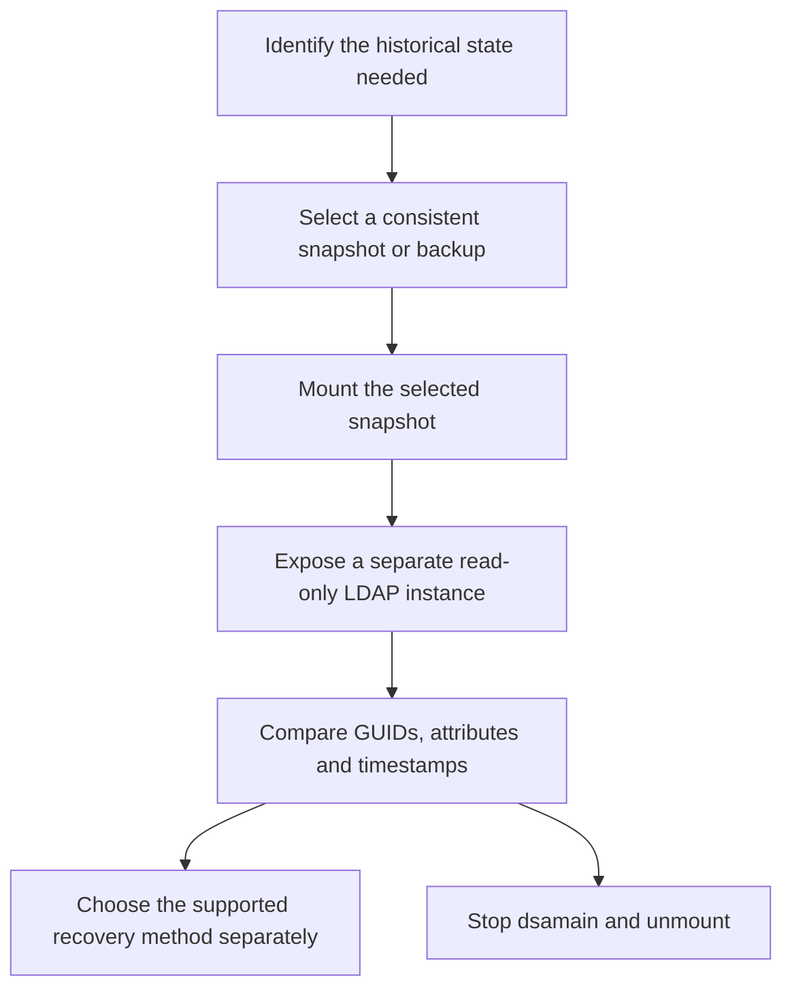

# Inspecting Active Directory Snapshots: ntdsutil, dsamain and Recovery Boundaries

**Looking at yesterday's directory is not the same operation as putting yesterday's directory back into production.**

An AD DS snapshot can help establish when an object or attribute changed and which backup contains an acceptable recovery point. `ntdsutil` manages database snapshots; `dsamain` exposes a consistent database through a separate, read-only LDAP instance. Neither turns a historical database into a live domain controller.

Microsoft's current forest-recovery guidance still describes this inspection method. The command reference and the seven source captures are historical; the workflow below separates their useful mechanics from old recovery shortcuts and applies to Windows Server 2022/2025 administration.

> **TL;DR**
> - Use snapshots to inspect directory state, not as the entire backup strategy.
> - Treat the database, mounted volume, logs and exports as Tier 0 data.
> - Choose unused LDAP and companion ports; do not interfere with the production DC listeners.
> - Browse the mounted instance explicitly. Do not accidentally inspect the live directory.
> - Stop the inspection process before unmounting, then remove only the snapshot selected for removal.

## 1. Choose the right recovery artifact

| Artifact or feature | Useful for | Not a substitute for |
|---|---|---|
| AD database snapshot | Historical inspection and comparison | An independent, tested system-state/full-server backup |
| AD-aware backup | Supported restoration and forest-recovery planning | Investigation of whether the chosen state is trustworthy |
| AD Recycle Bin | Recovering retained objects deleted after enablement | Recovering arbitrary overwritten attributes or the whole forest |
| Hypervisor checkpoint | Hypervisor-specific operational workflows | An AD recovery plan; VM-Generation ID safeguards have prerequisites |
| `dsamain` LDAP instance | Reading the selected historical database | A writable DC, replication partner, KDC or object-restoration engine |

VSS snapshots on the same storage can disappear with that storage or when shadow-copy space is reclaimed. A list of snapshots is not a backup-success report.



## 2. Prepare the inspection host

For snapshot creation, use an elevated session on the selected writable DC with appropriate directory-administration permissions. For inspection, use a compatible Windows Server installation with the AD DS tools and the required database access. Follow the backup product's supported extraction procedure if the source is a backup rather than an `ntdsutil` snapshot.

```powershell
$identity = [Security.Principal.WindowsIdentity]::GetCurrent()
$principal = New-Object Security.Principal.WindowsPrincipal($identity)
if (-not $principal.IsInRole([Security.Principal.WindowsBuiltInRole]::Administrator)) {
    throw 'Run the local snapshot tools from an elevated session.'
}

Get-Command ntdsutil.exe, dsamain.exe -ErrorAction Stop |
    Select-Object Name, Source
```

Record the source DC, database location, capture time, OS/build and investigation question. A current display name alone is not a reliable match for an object that was renamed or recreated; preserve its object GUID and SID where applicable.

The database must be consistent. Do not copy a running DC's database file and assume it is usable. Do not run database repair or `/allowupgrade` against the only retained recovery artifact.

## 3. Create and identify a snapshot

The following command creates a VSS snapshot. It changes local snapshot storage, so check space and retention before running it:

```powershell
ntdsutil.exe snapshot 'activate instance ntds' create 'list all' quit quit
if ($LASTEXITCODE -ne 0) {
    throw 'Snapshot creation did not complete successfully; inspect the native output.'
}
```

**Verify:** the tool reports successful creation and lists the expected capture time and snapshot set. Save the relevant snapshot identifiers with the investigation record. Do not assume list index `1` will continue to identify the same capture after other operations.

Snapshot creation does not stop AD DS. It can still have storage and performance consequences; a repeated scheduled capture needs an explicit retention policy.

## 4. Mount exactly the selected snapshot

Use the identifier returned by the snapshot list. The input below is an identifier, not a credential:

```powershell
$snapshotId = Read-Host 'Snapshot GUID selected from ntdsutil list all'
[void][guid]::Parse($snapshotId.Trim('{}'))

ntdsutil.exe snapshot "mount $snapshotId" quit quit
if ($LASTEXITCODE -ne 0) {
    throw 'Snapshot mount failed; do not continue with a guessed database path.'
}
```

Read the mounted path from the actual output. The database is not necessarily on the OS volume or in the default `Windows\NTDS` directory. Use the DC's recorded database location within the mounted volume.

PowerShell expands dollar signs in double-quoted strings. A mounted path containing `$SNAP_...` must be single-quoted when entered literally.

## 5. Expose the database on separate ports

With only `/ldapport` specified, the documented companion defaults are LDAP+1 for LDAP SSL, LDAP+2 for GC and LDAP+3 for GC SSL. Check all four, along with excluded/reserved TCP port ranges. Free TCP ports are a prerequisite, not a guarantee that every optional listener or TLS configuration will succeed.

Run this in the elevated console that will host the inspection process, replacing the path with the real mounted path:

```powershell
$databasePath = 'C:\$SNAP_REPLACE_WITH_ACTUAL_MOUNT\Windows\NTDS\ntds.dit'
if (-not (Test-Path -LiteralPath $databasePath -PathType Leaf)) {
    throw 'Set databasePath to the consistent database in the mounted snapshot.'
}

$inspectionPorts = 51389..51392
$listeners = @(Get-NetTCPConnection -State Listen -ErrorAction Stop)
$conflicts = @($listeners | Where-Object { $_.LocalPort -in $inspectionPorts })
if ($conflicts.Count -gt 0) {
    $conflicts | Select-Object LocalAddress, LocalPort, OwningProcess
    throw 'Choose another inspection port set and check it before continuing.'
}

dsamain.exe /dbpath $databasePath /ldapport 51389
```

This process remains running while the database is exposed. Review startup output, not just the existence of the process. If a port conflict remains, inspect excluded ranges with `netsh interface ipv4 show excludedportrange protocol=tcp` and its IPv6 equivalent, then choose a valid set.

Do not stop DNS, AD DS or another production service merely to free a convenient inspection port. Do not assume that connecting through `localhost` means the LDAP instance listens only on loopback; verify the listening addresses and keep network access restricted to the inspection need.

By default, `dsamain` limits access to Domain Admins and Enterprise Admins of the target domain, and permissions on directory data still apply. Do not add `/allowNonAdminAccess` as a routine troubleshooting switch. Enabling a listener also does not automatically provision a usable TLS certificate.

## 6. Prove which directory you are reading

From a second elevated PowerShell window on the inspection host:

```powershell
Get-NetTCPConnection -LocalPort 51389 -State Listen -ErrorAction Stop |
    Select-Object LocalAddress, LocalPort, OwningProcess

Get-Process -Name dsamain -ErrorAction Stop |
    Select-Object Id, ProcessName, StartTime
```

Compare the owning process ID with the intended `dsamain` process. Then use either:

- **AD Users and Computers:** Change Domain Controller, select the explicit instance, and enter `localhost:51389` when inspecting locally.
- **Ldp.exe:** connect to the inspection host and port, bind with an appropriate identity, then inspect RootDSE and the required naming context.

`dsamain` exposes LDAP; it does not create a new AD Web Services endpoint. These examples deliberately use LDAP-aware tools instead of assuming every AD PowerShell command can target the mounted instance.

**Verify:** the console is connected to the explicit inspection endpoint and the historical object/attribute state matches the selected capture. Open a separate console for live-directory comparison and label both. Two identical ADUC windows are an efficient way to compare a directory with itself.

## 7. Keep the restoration decision separate

Inspecting an old value does not establish that writing it back is correct. Recreating an object with the same name does not preserve its original security identity. Linked attributes, dependent objects, password state, replication and hybrid synchronization require their own recovery analysis.

For a forest-level recovery, use [Recovering a Single-Domain Active Directory Forest](Recovering%20a%20Single-Domain%20Active%20Directory%20Forest.md). For deletion evidence, use [Tracing Deleted Active Directory Objects](../Troubleshoot/Tracing%20Deleted%20Active%20Directory%20Objects%20-%20Events%204726%20and%204743,%20Deleted%20Objects%20and%20Replication%20Metadata.md).

Old comparison utilities mentioned in historical notes are not a general restoration recommendation for current servers. Validate a tool's supported platforms, handling of linked attributes and recovery semantics before considering it.

## 8. Close the inspection cleanly

Close the LDAP browsing sessions, then press **Ctrl+C** in the console running the selected `dsamain` process. Confirm that its listeners are gone before unmounting.

In the session where the selected identifier was recorded:

```powershell
if ([string]::IsNullOrWhiteSpace($snapshotId)) {
    throw 'Identify the mounted snapshot before unmounting it.'
}

ntdsutil.exe snapshot "unmount $snapshotId" 'list mounted' quit quit
if ($LASTEXITCODE -ne 0) {
    throw 'Unmount did not complete successfully; inspect the native output.'
}
```

Unmounting is not deletion. Delete only a specifically identified capture when retention permits it; avoid wildcard deletion. Retain investigation exports only where their directory data can be protected and remove temporary firewall changes introduced for inspection.

## 9. Historical source captures

These seven captures show a Windows Server 2012 R2-era Contoso lab. They are retained in source order to illustrate the workflow, not to prescribe current server names, ports, access controls or recovery settings.

### 9.1 Snapshot creation


### 9.2 Snapshot inventory


### 9.3 Mount output


### 9.4 Mounted volume in Explorer


### 9.5 Port conflict and a subsequent dsamain startup

The old capture includes a socket-address-in-use error. Diagnose the listener conflict; it is not evidence that restarting DNS is a required snapshot step.


### 9.6 Explicit directory-server selection


### 9.7 Connection to the inspection port


## References

- [Microsoft: determine how to recover an AD forest, including database inspection](https://learn.microsoft.com/en-us/windows-server/identity/ad-ds/manage/forest-recovery-guide/ad-forest-recovery-determine-how-to-recover)
- [Microsoft: dsamain command reference, archived](https://learn.microsoft.com/en-us/previous-versions/windows/it-pro/windows-server-2012-r2-and-2012/cc772168(v=ws.11))
- [Microsoft: ntdsutil snapshot command reference, archived](https://learn.microsoft.com/en-us/previous-versions/windows/it-pro/windows-server-2012-r2-and-2012/cc731620(v=ws.11))