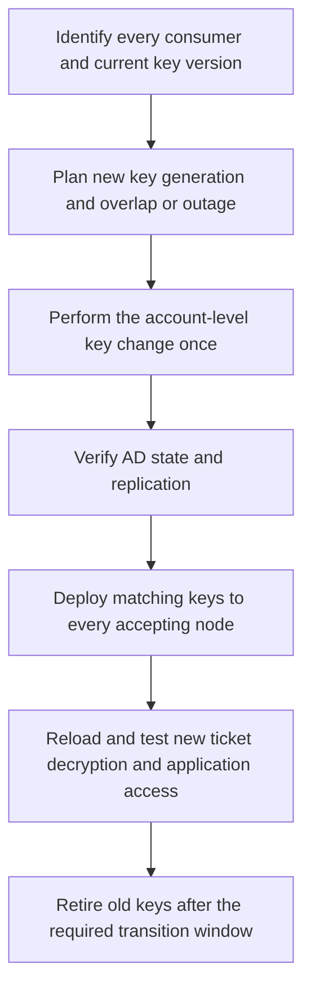

# Kerberos Keytabs with Active Directory: SPNs, AES, KVNO and Rotation

**A keytab is a credential, not a public configuration file.** It contains long-term Kerberos keys that let a service accept tickets or, when used as an initiator, authenticate as the associated principal. Copying it to another machine copies that capability.

This guide covers AD-backed Kerberos services using static keytabs, with Windows Server 2022/2025 administration and MIT Kerberos tools on the service host. Heimdal, Java and appliance tooling can expose different options; use the implementation's supported workflow rather than assuming every `klist` is the Windows command.

> **TL;DR**
>
> - Align the service principal, AD account, encryption type, key version and actual key bytes.
> - An SPN tells the KDC which account owns the service identity; a keytab must contain the corresponding usable key.
> - `ktpass` is not a read-only export of existing AD secret attributes. Its workflow can change account mappings and password/key state.
> - Select AES explicitly and validate principal case, salt and KVNO. Do not use `/crypto All` as a modern baseline.
> - Inspect metadata without displaying keys, then verify that a newly issued service ticket can be decrypted.
> - Rotate once per account-level change and update every dependent endpoint. Repeated independent generation can invalidate earlier files.

## 1. The values that must agree

A keytab entry associates a principal with an encryption type, key version and key material. It is not a TGT cache and does not contain a list of the user's current group memberships.

```text
Client requests:        HTTP/portal.corp.example@CORP.EXAMPLE
AD service identity:    CORP\svc_http_portal
Keytab entry:           principal + enctype + KVNO + long-term key
Accepting process:      must read the correct keytab and select that entry
```

| Value | Meaning | Common mismatch |
|---|---|---|
| Principal | Service name and realm stored in the entry | Alias, case, realm or service-class mismatch |
| SPN owner | AD account used by the KDC for the service ticket | SPN belongs to another account |
| Enctype | Kerberos algorithm associated with the key | Ticket uses an enctype absent from the keytab |
| KVNO | Key version number | Keytab carries an older account-key generation |
| Key bytes | Long-term secret derived/provisioned for that account | Wrong password, salt or derivation even though the labels match |

Matching names and KVNO does not prove matching key bytes. Likewise, changing a keytab's KVNO label does not rotate the AD password or turn an incorrect key into the correct one.

## 2. Use a dedicated service identity

Identify the actual service endpoint, aliases, accepting hosts and identity owner. Prefer a dedicated service account rather than a human administrator or a computer account managed by another lifecycle. Use gMSA where the application supports it; do not improvise a static export of its automatically managed secret.

Several SPNs can exist on an AD account, but its key material is account-scoped. A secret change can affect every application using that account. A keytab entry's principal label should not be treated as an independent security boundary against a holder of the underlying account key.

The generation example below deliberately uses one newly provisioned, dedicated ordinary service account and one principal. Shared identities, multiple enctypes and multi-node services need an application-specific rollout plan.

Read the existing state from a named writable DC:

```powershell
Import-Module ActiveDirectory

$domainController = 'dc01.corp.example'
$accountName = 'svc_http_portal'
$principal = 'HTTP/portal.corp.example@CORP.EXAMPLE'
$serviceSpn = 'HTTP/portal.corp.example'

$before = Get-ADUser -Identity $accountName -Server $domainController `
    -Properties servicePrincipalName, userPrincipalName, PasswordLastSet,
                'msDS-KeyVersionNumber', 'msDS-SupportedEncryptionTypes' `
    -ErrorAction Stop

$before | Select-Object SamAccountName, ObjectGUID, Enabled, UserPrincipalName,
    servicePrincipalName, PasswordLastSet, 'msDS-KeyVersionNumber',
    'msDS-SupportedEncryptionTypes'

setspn.exe -F -Q $serviceSpn
```

For a new principal, absence of a registration is expected before provisioning. For an existing service, verify ownership and every dependency before making changes. A forest query is not a search of all trusted forests.

Record the account GUID, mappings and version before generation. Do not reset a DC, trust, `krbtgt`, machine-managed account or shared application identity through this generic example.

## 3. Understand AES, salt and case

AES key derivation depends on more than the displayed password string. Principal/account naming, salt and string-to-key parameters must agree with the KDC's key material. A rename or a different case assumption can produce a key that looks plausible but does not decrypt the ticket.

Microsoft documents that `ktpass /princ` is case-sensitive and is used as supplied. It does not validate that its case matches the relevant account naming used for key generation. Use a consistent, reviewed principal and realm, and follow the service implementation's naming requirements.

Do not manually infer the correct salt from an arbitrary host name or blindly change iteration counts. Verify the account history and supported generation method. An old RC4 keytab that worked despite a naming inconsistency does not prove that an AES key generated with the same inconsistent assumptions will work.

AD's `msDS-SupportedEncryptionTypes` is a capability bitmask, not the key itself. It is also a different namespace from event-log enctype values. Changing the bitmask does not populate a deployed keytab or prove the KDC has the required key material.

## 4. Generate with explicit side effects

Use a restricted output directory that already exists. Check the actual tool build and the directory ACL before putting reusable credentials there:

```powershell
$ktpassPath = (Get-Command ktpass.exe -ErrorAction Stop).Source
(Get-Item -LiteralPath $ktpassPath).VersionInfo |
    Select-Object FileVersion, ProductVersion

$outputDirectory = 'C:\SecureKeytabs'
if (-not (Test-Path -LiteralPath $outputDirectory -PathType Container)) {
    throw 'Create and secure the keytab output directory before generation.'
}
Get-Acl -LiteralPath $outputDirectory | Select-Object Owner, Sddl
```

`ktpass` has no general `-WhatIf` safety mode. Depending on the operation/options, it can set a password and change UPN/SPN mappings. The example assumes those changes are intended for the dedicated account. Review mapping and `setupn` behavior against the installed tool; do not reuse the command as a harmless inspection step for an existing service.

**The tool's output can contain key material.** Run it in a controlled console and treat its output as secret. Do not paste it into a support ticket, ordinary transcript, CI log or article. `/pass *` prompts locally instead of placing a password in command history.

```powershell
$keytabPath = Join-Path $outputDirectory ('portal-' + [guid]::NewGuid().ToString() + '.keytab')
if (Test-Path -LiteralPath $keytabPath) {
    throw 'Refusing to overwrite an existing keytab.'
}

$ktpassArguments = @(
    '/out', $keytabPath,
    '/princ', $principal,
    '/mapuser', 'CORP\svc_http_portal',
    '/crypto', 'AES256-SHA1',
    '/ptype', 'KRB5_NT_PRINCIPAL',
    '/target', $domainController,
    '/pass', '*'
)

& $ktpassPath @ktpassArguments
if ($LASTEXITCODE -ne 0) {
    throw 'Generation failed. Re-read AD state before retrying; a partial account change may already have occurred.'
}
```

This is a **credential-changing operation**, not an audit command. AES256-SHA1 names the Kerberos AES256-CTS-HMAC-SHA1-96 enctype here; it is not a TLS cipher-suite selection. Confirm that the service supports the selected enctype. DES is not a compatibility option for Windows Server 2025, and `/crypto All` can introduce unwanted legacy entries.

Do not hard-code `/kvno 1` or assume that the pre-change KVNO is the output version. Microsoft documents a `/kvno` option; it labels the generated entry and is not a password-rotation mechanism. Whatever generation workflow and tool build is used, verify the **post-operation AD state and generated entry** before deployment. Stop on a mismatch rather than repeatedly resetting the account or relabeling keys without proof.

## 5. Re-read AD and inspect keytab metadata

```powershell
$after = Get-ADUser -Identity $before.ObjectGUID -Server $domainController `
    -Properties servicePrincipalName, userPrincipalName, PasswordLastSet,
                'msDS-KeyVersionNumber', 'msDS-SupportedEncryptionTypes' `
    -ErrorAction Stop

$after | Select-Object SamAccountName, ObjectGUID, UserPrincipalName,
    servicePrincipalName, PasswordLastSet, 'msDS-KeyVersionNumber',
    'msDS-SupportedEncryptionTypes'
```

Compare the mappings with the plan and retain sanitized metadata, not secret values. The account GUID should still identify the intended object. A successful process exit is not enough if the SPN was registered on the wrong identity or the application was omitted from the dependency list.

On a host with **MIT Kerberos** tools, inspect the transferred file without displaying its key bytes:

```bash
klist -k -t -e /etc/security/keytabs/portal.keytab
```

Check every principal, KVNO and enctype. MIT `klist -K` displays keys and should not be used for ordinary diagnostics. Windows `klist.exe` has different options and does not accept this keytab-inspection syntax.

A keytab timestamp is not a reliable password-rotation record. Use the recorded change, post-operation AD metadata and actual ticket/decryption tests.

## 6. Deploy the file as a secret

Transfer the keytab through an authenticated protected channel. Store it outside source repositories, general-purpose shares, web roots and container images. Restrict reads to the accepting service and its administrators; include backup copies, deployment packages and temporary files in that access review.

Confirm the configured absolute path, file ownership/mode and any mandatory-access-control policy on the host. Installing a new file does not guarantee that a running application reloads it. Some processes cache keys and need a supported reload or restart.

On a multi-node application, verify every accepting node and the load balancer's authentication design. One node with an old file can create intermittent failures that resemble a random KDC problem.

## 7. Prove decryption and the real application flow

Three tests answer different questions:

| Test | What it establishes | What it does not establish |
|---|---|---|
| `klist -k -t -e` | Readable keytab metadata | Correct key bytes or application use |
| `kinit -k -t ... principal`, where appropriate | Keytab can act as an initiator for that principal's AS exchange | An ordinary client's service ticket is accepted by the application |
| `kvno -k keytab service-principal` | Acquired service ticket can be decrypted with the specified keytab | Application configuration and authorization are correct |

Use the service implementation's supported tools. The following MIT example uses a temporary credential cache in a subshell so it does not replace the operator's normal cache. `kinit` prompts locally for the test user's credential; the operator also needs permission to read the service keytab for this diagnostic:

```bash
(
    umask 077
    cache_dir=$(mktemp -d) || exit 1
    export KRB5CCNAME="FILE:$cache_dir/ccache"
    trap 'kdestroy 2>/dev/null; rmdir "$cache_dir"' EXIT
    kinit 'LabUser@CORP.EXAMPLE' &&
        kvno -k /etc/security/keytabs/portal.keytab 'HTTP/portal.corp.example@CORP.EXAMPLE'
)
```

This requests authentication and creates temporary tickets; it is not a passive file inspection. Do not grant broad keytab-read access merely to let more users perform the test. The `-e` option on MIT `kvno` requests a **session-key** enctype, not a way to prove the service-ticket encryption algorithm.

After this succeeds, exercise the real client-to-application operation using the production service name. Confirm the accepting node, loaded file and observed protocol. A successful `kinit` as the service or a KDC ticket request is not the final application acceptance test.

## 8. Rotate as one coordinated account change



The ordering and overlap depend on the application and generation method. A static-keytab service may require a maintenance window. An implementation that supports multiple key versions can retain the old key temporarily for previously issued tickets, but that capability must be verified rather than assumed.

Account password changes affect all SPNs on that account. Do not run independent password-setting `ktpass` commands for each alias or each node and expect the first generated file to remain current. Plan the complete principal/enctype set for one coherent key generation.

Compare the post-change state on the relevant writable DCs:

```powershell
$replicaNames = 'dc01.corp.example', 'dc02.corp.example'

foreach ($replicaName in $replicaNames) {
    try {
        $replica = Get-ADUser -Identity $before.ObjectGUID -Server $replicaName `
            -Properties 'msDS-KeyVersionNumber', PasswordLastSet -ErrorAction Stop
        [pscustomobject]@{
            DomainController = $replicaName
            ObjectGuid = $replica.ObjectGUID
            KeyVersion = $replica.'msDS-KeyVersionNumber'
            PasswordLastSet = $replica.PasswordLastSet
            QueryError = $null
        }
    } catch {
        [pscustomobject]@{
            DomainController = $replicaName
            ObjectGuid = $before.ObjectGUID
            KeyVersion = $null
            PasswordLastSet = $null
            QueryError = $_.Exception.Message
        }
    }
}
```

Matching readable version metadata supports a convergence assessment but is not a comparison of secret bytes. Include the KDCs actually serving the application and test newly issued tickets. Previously cached tickets can still require an older service key until their validity ends.

Do not promise rollback by copying the old file back after an AD password change. Reverting the password can itself produce another key version, and the old keytab may not match fresh tickets. Define a recovery plan that reconciles AD and deployed keys together.

## 9. Diagnose by the first failed comparison

| Observation | Check next |
|---|---|
| Keytab cannot be opened | Actual path, permissions, service identity and file format |
| Expected principal absent | Generation/deployment scope, aliases, case and realm |
| Ticket KVNO differs from usable entries | Password history, DC convergence and stale node/file |
| KVNO/enctype labels match but decryption fails | Key derivation, salt, password source and SPN account ownership |
| `kvno -k` succeeds but application fails | Process reload, keytab selection, endpoint identity and application authorization |
| Failures alternate across nodes | Compare each node's file version, configuration and in-memory state |
| Only older tickets fail after rotation | Whether old-key overlap is supported and correctly implemented |

For SPN, KDC and PAC evidence, use [Troubleshooting Kerberos Authentication](../Troubleshoot/Troubleshooting%20Kerberos%20Authentication%20-%20SPNs,%20Tickets,%20Error%20Codes%20and%20NTLM%20Fallback.md). The wider encryption migration is covered in [Legacy Dependency Mapping and Technical Inventory](../Hardening/RC4%20Hardening/2.%20Legacy%20Dependency%20Mapping%20and%20Technical%20Inventory.md).

## References

- [Microsoft ktpass reference](https://learn.microsoft.com/en-us/windows-server/administration/windows-commands/ktpass)
- [Microsoft setspn reference](https://learn.microsoft.com/en-us/windows-server/administration/windows-commands/setspn)
- [Get-ADUser](https://learn.microsoft.com/en-us/powershell/module/activedirectory/get-aduser)
- [MIT klist: keytab metadata and key-display options](https://web.mit.edu/kerberos/krb5-latest/doc/user/user_commands/klist.html)
- [MIT kvno: acquire and verify service tickets](https://web.mit.edu/kerberos/krb5-latest/doc/user/user_commands/kvno.html)
- [MIT kinit](https://web.mit.edu/kerberos/krb5-latest/doc/user/user_commands/kinit.html)