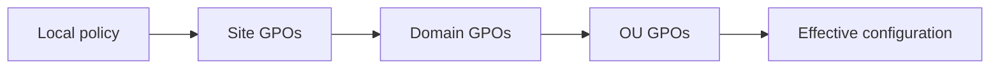
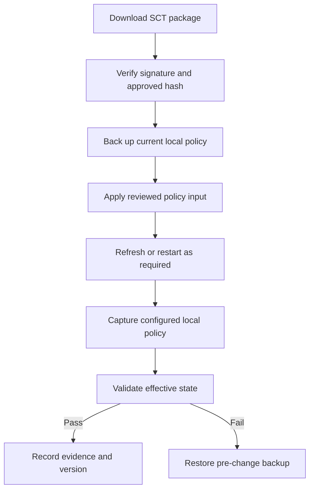

# LGPO.exe: Automating and Auditing Local Group Policy

`LGPO.exe` is Microsoft's command-line utility for automating Local Group Policy. It can capture a machine's local policy as a GPO backup, import supported policy components, translate `Registry.pol` files into reviewable text, and build policy files from that text. This makes it useful for workgroup systems, image engineering, isolated servers, test labs and incident-response comparisons.

> **TL;DR**
>
> - Obtain `LGPO.exe` from the Microsoft Security Compliance Toolkit (SCT), then verify its signature.
> - Always create an LGPO backup before applying a baseline or edited policy.
> - Use LGPO text for review and version control, but retain the complete backup for rollback.
> - Local policy has lower precedence than site, domain and OU GPOs on domain-joined systems.
> - Test imports on the exact Windows release and role you intend to manage.

## 1. What LGPO.exe manages

The current SCT distribution provides LGPO v3.0 or later and describes these capabilities:

| Capability | Typical switch | Use |
|---|---|---|
| Back up Local Group Policy | `/b` | Capture local policy in GPO backup format |
| Import a GPO backup | `/g` | Apply settings from one or more backup directories |
| Import Registry Policy | `/m`, `/u` | Apply machine or user `Registry.pol` content |
| Apply a security template | `/s` | Apply `GptTmpl.inf` security settings |
| Apply Advanced Audit Policy | `/a` or `/ac` | Import an audit-policy CSV, optionally clearing first |
| Apply LGPO text | `/t` | Apply reviewable registry policy commands |
| Parse Registry Policy | `/parse` | Convert `Registry.pol` to LGPO text |
| Build Registry Policy | `/r` with `/w` | Compile LGPO text into `Registry.pol` |
| Import Policy Analyzer rules | `/p` | Apply settings from a `.PolicyRules` file |
| Enable referenced CSEs | `/ef` | Enable extensions listed in a GPO backup's `backup.xml` |

This table lists the main operation switches, not every parameter. Options such as `/n` for a backup name and `/v` for verbose output are used in the examples below; run the bundled help for the complete syntax of the downloaded version.

The exact command surface is versioned with the tool. Run the help included with the downloaded executable before building automation:

```powershell
& .\LGPO.exe /?
```

`LGPO.exe` is not a replacement for GPMC, domain GPO replication, MDM or Desired State Configuration. It manages policy on the local Windows installation where it runs.

## 2. Obtain and verify the tool

Download `LGPO.zip` from the [Microsoft Security Compliance Toolkit](https://www.microsoft.com/en-us/download/details.aspx?id=55319). Keep the archive and its documentation together so operators can identify the command version used by an automation pipeline.

Validate the executable before moving it into a privileged management path:

```powershell
$lgpoPath = 'C:\Tools\LGPO\LGPO.exe'

$signature = Get-AuthenticodeSignature -FilePath $lgpoPath
$hash = Get-FileHash -Path $lgpoPath -Algorithm SHA256

$signature | Select-Object Status, StatusMessage, SignerCertificate
$hash | Select-Object Algorithm, Hash, Path

if ($signature.Status -ne 'Valid') {
    throw "LGPO.exe signature validation failed: $($signature.Status)"
}
```

Record the SHA-256 value in the deployment manifest after validating the Microsoft signature. A hash proves that subsequent copies match the reviewed binary; it does not establish trust by itself.

Run LGPO from an elevated process. Backups and exports can contain sensitive security configuration, account names and SIDs, so write them to an access-controlled location.

## 3. Understand the policy layers

Local policy is the first layer in the normal LSDOU order:



On a domain-joined machine, a domain GPO configuring the same policy normally takes precedence over LGPO. Consequently:

- importing local policy can succeed while the effective setting remains controlled by a domain GPO;
- a domain policy can later fall out of scope and reveal a previously configured local value;
- registry values written outside the policy stores are not necessarily represented in an LGPO backup;
- some settings require a refresh, sign-in or restart before their effective behavior changes.

Use `gpresult`, Policy Analyzer, `secedit`, audit-policy tools and direct state checks to distinguish configured local policy from effective policy.

## 4. Back up before changing anything

Create a timestamped, access-controlled backup:

```powershell
$lgpo = 'C:\Tools\LGPO\LGPO.exe'
$backupRoot = 'C:\ProgramData\PolicyBackups\LGPO'
$timestamp = Get-Date -Format 'yyyyMMdd-HHmmss'
$backupPath = Join-Path $backupRoot $timestamp

New-Item -Path $backupPath -ItemType Directory -Force | Out-Null
& $lgpo /b $backupPath /n "Pre-change-$timestamp"

if ($LASTEXITCODE -ne 0) {
    throw "LGPO backup failed with exit code $LASTEXITCODE"
}
```

The generated backup is the recovery artifact. Do not assume that an LGPO text export alone includes security templates, user-right assignments, Advanced Audit Policy and extension metadata.

Store backups outside a public source repository. Commit sanitized text exports when review is needed, not unreviewed machine snapshots.

## 5. Inspect Registry.pol as text

The computer and user registry policy files normally reside at:

```text
%windir%\System32\GroupPolicy\Machine\Registry.pol
%windir%\System32\GroupPolicy\User\Registry.pol
```

Parse an existing machine file into LGPO text:

```powershell
$lgpo = 'C:\Tools\LGPO\LGPO.exe'
$machinePolicy = Join-Path $env:windir 'System32\GroupPolicy\Machine\Registry.pol'
$textPath = 'C:\ProgramData\PolicyReview\Machine-LGPO.txt'

New-Item -Path (Split-Path $textPath) -ItemType Directory -Force | Out-Null
& $lgpo /parse /m $machinePolicy | Set-Content -Path $textPath -Encoding utf8

if ($LASTEXITCODE -ne 0) {
    throw "Registry.pol parsing failed with exit code $LASTEXITCODE"
}
```

LGPO text represents registry policy operations as blocks. A setting generally identifies the computer or user scope, registry key, value name, data type and data. Deletion directives are also supported; use the syntax documented with your version of LGPO.

Treat the text as code:

1. Generate it from a known baseline or controlled lab machine.
2. Normalize and review the diff.
3. Require approval for security-sensitive changes.
4. Test compilation and application on a disposable system.
5. Validate effective state, not only the command exit code.

## 6. Apply LGPO text safely

Use `/t` to apply reviewed LGPO text:

```powershell
$lgpo = 'C:\Tools\LGPO\LGPO.exe'
$policyText = 'C:\PolicySource\Workgroup-Baseline\Machine-LGPO.txt'

if (-not (Test-Path -LiteralPath $policyText -PathType Leaf)) {
    throw "Policy input not found: $policyText"
}

& $lgpo /t $policyText /v

if ($LASTEXITCODE -ne 0) {
    throw "LGPO import failed with exit code $LASTEXITCODE"
}

gpupdate.exe /target:computer /force
```

Apply registry policy input only after checking its scope. A machine LGPO text file and a user LGPO text file can contain similar-looking registry paths while affecting different policy stores.

Some settings require a restart or a new sign-in. Do not automatically add LGPO's `/boot` option to shared automation; let the deployment orchestrator control restart notification, maintenance windows and recovery.

## 7. Compile LGPO text into Registry.pol

Build a policy file when an image or another supported workflow needs a standalone `Registry.pol` artifact:

```powershell
$lgpo = 'C:\Tools\LGPO\LGPO.exe'
$sourceText = 'C:\PolicySource\Workgroup-Baseline\Machine-LGPO.txt'
$outputPolicy = 'C:\PolicyBuild\Machine\Registry.pol'

New-Item -Path (Split-Path $outputPolicy) -ItemType Directory -Force | Out-Null
& $lgpo /r $sourceText /w $outputPolicy /v

if ($LASTEXITCODE -ne 0) {
    throw "Registry.pol build failed with exit code $LASTEXITCODE"
}
```

Do not manually copy the result over a live policy file while Group Policy is processing. Import it through LGPO or stage it through the supported image-engineering workflow.

## 8. Import a complete GPO backup

Use `/g` when you need the supported components represented by a GPO backup, not only registry policy:

```powershell
$lgpo = 'C:\Tools\LGPO\LGPO.exe'
$gpoBackupRoot = 'C:\PolicySource\Windows Server 2025 Security Baseline\GPOs'

& $lgpo /g $gpoBackupRoot /v

if ($LASTEXITCODE -ne 0) {
    throw "GPO backup import failed with exit code $LASTEXITCODE"
}
```

The path supplied to `/g` can contain one or more GPO backups. Review the backup inventory first: importing a directory with several baselines can combine settings in an unintended order.

LGPO v3.0 captures locally configured CSE information during `/b` and `/g`. Its `/ef` option can enable extensions referenced in `backup.xml`. Enabling a CSE changes processing behavior; use `/ef` only when the imported backup requires it and the target supports that extension.

## 9. Security templates and Advanced Audit Policy

Apply a security template:

```powershell
$lgpo = 'C:\Tools\LGPO\LGPO.exe'
$securityTemplate = 'C:\PolicySource\Baseline\GptTmpl.inf'

& $lgpo /s $securityTemplate /v

if ($LASTEXITCODE -ne 0) {
    throw "Security template import failed with exit code $LASTEXITCODE"
}
```

Apply an Advanced Audit Policy backup:

```powershell
$auditPolicy = 'C:\PolicySource\Baseline\Audit.csv'

& $lgpo /a $auditPolicy /v

if ($LASTEXITCODE -ne 0) {
    throw "Advanced Audit Policy import failed with exit code $LASTEXITCODE"
}
```

`/ac` clears existing Advanced Audit Policy before importing the CSV. That is materially different from `/a` and can remove settings not present in the input. Use `/ac` only when the input is intended to be the complete authoritative audit policy.

Security templates can change user rights, service configuration and security options. Resolve account names to stable SIDs where the format supports it, and test domain identities from a machine that can contact the domain.

## 10. Audit configured and effective state

Capture local policy again after applying the candidate baseline:

```powershell
$postChangeRoot = 'C:\ProgramData\PolicyBackups\LGPO\PostChange'
New-Item -Path $postChangeRoot -ItemType Directory -Force | Out-Null

& $lgpo /b $postChangeRoot /n 'Post-change'

if ($LASTEXITCODE -ne 0) {
    throw "Post-change backup failed with exit code $LASTEXITCODE"
}
```

Then compare at three levels:

| Level | Question | Useful evidence |
|---|---|---|
| Source | What did the approved baseline request? | LGPO text, GPO backup, `.PolicyRules` |
| Configured local policy | What did LGPO place in local policy stores? | Post-change `/b` backup and `/parse` output |
| Effective state | What controls the running system? | Policy Analyzer, `gpresult`, `auditpol`, `secedit`, registry and feature-specific commands |

Export the merged security policy for review:

```powershell
$securityExport = 'C:\ProgramData\PolicyReview\Effective-Security.inf'

secedit.exe /export /mergedpolicy /cfg $securityExport /quiet

if ($LASTEXITCODE -ne 0) {
    throw "Security policy export failed with exit code $LASTEXITCODE"
}
```

Export Advanced Audit Policy separately:

```powershell
$auditExport = 'C:\ProgramData\PolicyReview\Effective-Audit.csv'
auditpol.exe /backup /file:$auditExport

if ($LASTEXITCODE -ne 0) {
    throw "Audit policy export failed with exit code $LASTEXITCODE"
}
```

No single export covers every setting family. Validate high-impact settings with the component that consumes them, such as Defender, Windows Firewall, AppLocker or Windows Update.

## 11. Roll back

Restore the pre-change GPO backup:

```powershell
$lgpo = 'C:\Tools\LGPO\LGPO.exe'
$preChangeBackup = 'C:\ProgramData\PolicyBackups\LGPO\20260924-090000'

& $lgpo /g $preChangeBackup /v

if ($LASTEXITCODE -ne 0) {
    throw "LGPO rollback failed with exit code $LASTEXITCODE"
}

gpupdate.exe /force
```

Rollback must be tested. Importing an older backup restores settings represented in that backup, but it might not remove every value introduced by a later script, preference action, MDM policy or application. Compare the post-rollback state with the original capture.

For disposable test systems, a known-good VM checkpoint can complement the LGPO backup. A checkpoint is not an enterprise rollback strategy for production systems.

## 12. Production automation pattern



A reliable deployment wrapper should:

- run elevated and fail on a nonzero LGPO exit code;
- log the LGPO binary hash, policy source version and target OS build;
- back up before applying changes;
- keep stdout, stderr and validation evidence;
- avoid secrets and private account data in shared logs;
- support a tested rollback path;
- remain repeatable when the same approved baseline is applied again.

## 13. Common mistakes

| Mistake | Consequence | Better approach |
|---|---|---|
| Copying `Registry.pol` directly into a live system | Races processing and omits related policy components | Use LGPO import modes |
| Treating local policy as the effective state | Domain or MDM policy can override it | Compare configured and effective state |
| Importing an entire baseline directory blindly | Multiple backups can combine unexpectedly | Inventory and stage the exact backup |
| Using `/ac` as if it were `/a` | Existing advanced audit settings are cleared | Reserve `/ac` for complete authoritative input |
| Keeping only LGPO text | Security and audit components can be lost | Retain the complete backup securely |
| Trusting success output alone | A setting can require restart or be overridden | Validate the consuming component |
| Reusing one baseline across OS releases | Unsupported or renamed settings create drift | Test per Windows release and role |

## References

- [Microsoft Security Compliance Toolkit Guide](https://learn.microsoft.com/en-us/windows/security/operating-system-security/device-management/windows-security-configuration-framework/security-compliance-toolkit-10)
- [Download the Microsoft Security Compliance Toolkit](https://www.microsoft.com/en-us/download/details.aspx?id=55319)
- [New and updated security tools: LGPO v3.0](https://techcommunity.microsoft.com/blog/microsoft-security-baselines/new--updated-security-tools/1631613)
- [Windows security baselines](https://learn.microsoft.com/en-us/windows/security/operating-system-security/device-management/windows-security-configuration-framework/windows-security-baselines)
- [secedit /export](https://learn.microsoft.com/en-us/windows-server/administration/windows-commands/secedit-export)
- [auditpol backup](https://learn.microsoft.com/en-us/windows-server/administration/windows-commands/auditpol-backup)