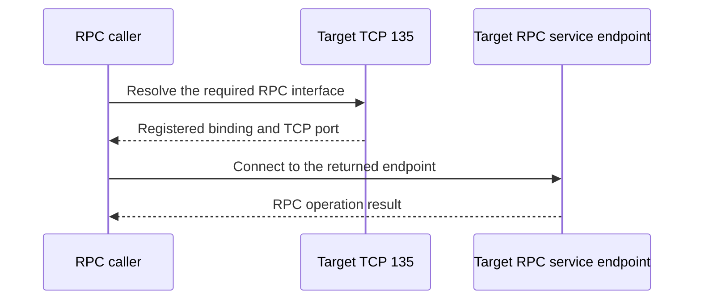

# Planning Active Directory RPC Ports: Dynamic Ranges, NTDS, Netlogon and DFSR

**An AD firewall design is a set of required conversations, not three registry values and a successful ping.**

Windows Server 2022 and 2025 support service-specific RPC port configuration, but fixing an endpoint does not remove DNS, Kerberos, LDAP, SMB or management dependencies. Start with the communicating roles and the business operation, then decide whether static endpoints are necessary.

> **TL;DR**
> - Separate member-to-DC, DC-to-DC, trust and administration flows.
> - TCP 135 is the endpoint mapper, not the entire RPC conversation.
> - NTDS, Netlogon and DFSR have different configuration controls.
> - A client's ephemeral source-port range is not the same setting as a service's RPC listening port.
> - Pilot one DC/site path, verify real operations after restart, and preserve the previous settings.

## 1. Follow the RPC conversation



Allowing TCP 135 while blocking the returned service port produces a partially working discovery path. Conversely, a static service port does not generally eliminate the need for endpoint-mapper access.

For AD replication, the destination DC pulls changes from its source. Either DC can therefore initiate connections during normal operation; model each direction instead of assuming that replication flows only from a central server to a branch.

## 2. Build the flow matrix

The table is a planning aid, not an instruction to open every port between every system:

| Conversation | Common destination ports | Scope and qualification |
|---|---|---|
| DNS queries | TCP/UDP 53 | Client/DC to its DNS servers; include TCP fallback and required server-to-server DNS flows |
| Kerberos authentication | TCP/UDP 88 | Clients and services to the appropriate KDCs |
| Password change | TCP/UDP 464 | Where Kerberos password-change operations are used |
| LDAP and DC Locator | TCP/UDP 389 | TCP LDAP and UDP CLDAP have different uses |
| LDAP over TLS | TCP 636 | When the application actually uses LDAPS; StartTLS uses the LDAP port |
| Global Catalog | TCP 3268/3269 | GC consumers; TLS on 3269 where used |
| SMB/SYSVOL/NETLOGON access | TCP 445 | Required file-access and applicable administrative flows |
| RPC endpoint mapper | TCP 135 | Precedes RPC interface access in the normal discovery path |
| Dynamic RPC service endpoints | Typically TCP 49152-65535 | Modern default range; assess supported static configuration by service |
| DFSR replication | RPC endpoint and the chosen dynamic/static service port | Between replication members, not ordinary clients reading SYSVOL |
| AD Web Services | TCP 9389 | AD administration tools that use ADWS |
| Windows Time | UDP 123 | According to the actual time hierarchy |

Trust direction does not directly equal packet direction. Authentication referrals, SID lookup and resource access can involve several domain controllers. Use [Troubleshooting Active Directory Trusts](../Troubleshoot/Troubleshooting%20Active%20Directory%20Trusts%20-%20DNS,%20Firewall,%20Time,%20Secure%20Channels%20and%20Name%20Suffix%20Routing.md) for the specific trust path.

WinRM, remote event-log access, backup software and monitoring may add separate requirements. A management channel used to deploy this configuration must also remain available. Do not add legacy NetBIOS/FRS allowances merely because an old port table lists them.

## 3. Distinguish three kinds of port setting

| Setting | Controls | Does not establish |
|---|---|---|
| NTDS/Netlogon/DFSR static endpoint | A service's registered RPC endpoint | A complete AD firewall policy |
| RPC runtime allocation policy under `HKLM\Software\Microsoft\Rpc\Internet` | Dynamic RPC server allocation for affected RPC applications | That a tiny range has adequate capacity for every role |
| TCP/IP dynamic-port configuration shown by `netsh` | Ephemeral ports used for connections | A service-specific NTDS or DFSR static endpoint |

Do not blindly replace the normal dynamic range with `50000-50100`. Port demand, additional server roles, concurrency and startup behavior matter. A quiet `netstat` sample is not a capacity study. Changing the system-wide client range can cause connection exhaustion without solving the service-endpoint requirement.

On the selected DC, record its build, listeners and TCP/IP ranges:

```powershell
Get-CimInstance Win32_OperatingSystem |
    Select-Object Caption, Version, BuildNumber

Get-NetTCPConnection -State Listen -ErrorAction Stop |
    Sort-Object LocalPort |
    Select-Object LocalAddress, LocalPort, OwningProcess

netsh.exe interface ipv4 show dynamicport tcp
netsh.exe interface ipv6 show dynamicport tcp
netsh.exe interface ipv4 show excludedportrange protocol=tcp
netsh.exe interface ipv6 show excludedportrange protocol=tcp
```

## 4. Inventory the existing service configuration

Run locally in an elevated PowerShell session on the DC. The registry inspection preserves the difference between an absent override and an explicit value; access or path failures stop the query.

```powershell
$settings = @(
    @{ Service = 'NTDS'; Path = 'HKLM:\SYSTEM\CurrentControlSet\Services\NTDS\Parameters'; Name = 'TCP/IP Port' }
    @{ Service = 'Netlogon'; Path = 'HKLM:\SYSTEM\CurrentControlSet\Services\Netlogon\Parameters'; Name = 'DCTcpipPort' }
)

foreach ($setting in $settings) {
    $key = Get-Item -LiteralPath $setting.Path -ErrorAction Stop
    try {
        $present = $key.GetValueNames() -contains $setting.Name
        [pscustomobject]@{
            Computer = $env:COMPUTERNAME
            Service = $setting.Service
            Path = $setting.Path
            Name = $setting.Name
            OverridePresent = $present
            Value = if ($present) { $key.GetValue($setting.Name) } else { $null }
            Kind = if ($present) { $key.GetValueKind($setting.Name) } else { $null }
        }
    } finally {
        $key.Close()
    }
}
```

For DFSR, use its management module rather than inferring its RPC configuration from the NTDS registry key:

```powershell
Import-Module DFSR -ErrorAction Stop
Get-DfsrServiceConfiguration -ComputerName $env:COMPUTERNAME -ErrorAction Stop |
    Select-Object ComputerName, RPCPort, DynamicRPCPort
```

Retain the raw before-state in the change record, together with relevant host-firewall rules and intermediate ACLs. Do not export unrelated registry branches containing secrets.

## 5. Plan NTDS and Netlogon endpoints together

Microsoft documents these separate `REG_DWORD` overrides:

| Component | Registry value | Reload requirement |
|---|---|---|
| NTDS | `HKLM\SYSTEM\CurrentControlSet\Services\NTDS\Parameters\TCP/IP Port` | Restart the computer |
| Netlogon | `HKLM\SYSTEM\CurrentControlSet\Services\Netlogon\Parameters\DCTcpipPort` | Restart Netlogon; the planned DC restart also covers this |

Use distinct, available ports. Clients use more than the Netlogon interface, including SAM/LSA and directory RPC interfaces; configuring only `DCTcpipPort` is not a complete client-to-DC restriction.

The following values illustrate the syntax, not recommended universal port assignments. Both writes are previews:

```powershell
$replicationPort = 55001
$netlogonPort = 55002
if ($replicationPort -eq $netlogonPort) {
    throw 'NTDS and Netlogon must not be assigned the same port.'
}

New-ItemProperty -LiteralPath 'HKLM:\SYSTEM\CurrentControlSet\Services\NTDS\Parameters' `
    -Name 'TCP/IP Port' -PropertyType DWord -Value $replicationPort -Force -WhatIf

New-ItemProperty -LiteralPath 'HKLM:\SYSTEM\CurrentControlSet\Services\Netlogon\Parameters' `
    -Name 'DCTcpipPort' -PropertyType DWord -Value $netlogonPort -Force -WhatIf
```

After choosing the actual ports, recording the original values and staging the necessary network rules, apply the specific writes without `-WhatIf` during the planned change. These endpoint settings do not globally eliminate every dynamic RPC listener on the DC.

Netlogon event 5809 can indicate a conflicting port. Microsoft also documents a service-restart case where the event is expected despite the configured port subsequently working. Inspect the listener, endpoint registration and operation result instead of accepting or rejecting the entire change from that event alone.

## 6. Configure DFSR separately when required

Current DFSR guidance recommends dynamic RPC by default. A static port can be used for a firewall requirement. The service-wide setting affects DFSR on that member, including other replicated folders; it is not a SYSVOL-only policy.

```powershell
$dfsrPort = 55003
Set-DfsrServiceConfiguration -ComputerName $env:COMPUTERNAME `
    -RPCPort $dfsrPort -WhatIf
```

Use a different available port from the NTDS and Netlogon choices. Plan the DFSR service restart or DC restart necessary to validate the effective listener after applying the setting. Do not modify automatic recovery, content freshness or replicated-folder state as part of a port change.

`-RPCPort 0` selects dynamic allocation. That is a rollback value only if dynamic allocation was the recorded before-state. Port 5722 from Windows Server 2008/2008 R2 DC guidance is not the universal DFSR port for Windows Server 2022/2025.

## 7. Stage the firewall change without hiding failures

Identify the source/destination hosts or subnets, address families, destination service ports, return traffic and every intermediate filter. Use role-aware Windows Firewall rules and the applicable network profile; do not disable the firewall for validation.

An additional narrow allow rule does not cancel an existing broad allow rule. Conversely, deleting the broad RPC allowance before all required interfaces are accounted for can break logon, backup, monitoring or management even if replication still works.

Use a staged sequence:

1. Capture baseline replication, SYSVOL and representative client-operation results.
2. Add the planned allowances while retaining a recovery path.
3. Apply the endpoint configuration to the selected DC/member.
4. Perform the planned restart and verify endpoint registration.
5. Test from every relevant network boundary with fresh connections.
6. Remove superseded allowances only after their remaining consumers are understood.
7. Repeat the tests under the final filtering policy and after a subsequent restart.

## 8. Test operations, not only TCP handshakes

From a relevant source host, substitute the target DC and its actual planned ports:

```powershell
$domainController = 'dc01.corp.example'
$portsToTest = 135, 55001, 55002, 55003

foreach ($port in $portsToTest) {
    Test-NetConnection -ComputerName $domainController -Port $port `
        -InformationLevel Detailed |
        Select-Object ComputerName, RemoteAddress, RemotePort,
            SourceAddress, TcpTestSucceeded
}
```

A successful TCP handshake does not identify the RPC interface or prove authorization. Endpoint-mapper inspection, service ownership and real operations provide the missing evidence. `Test-NetConnection -Port` is not a UDP test.

Validate directory replication in both relevant directions, SYSVOL health, group-policy retrieval, domain logon, password change, SID lookup and the actual management/backup workflows. Reuse [Troubleshooting Active Directory Replication](../Troubleshoot/Troubleshooting%20Active%20Directory%20Replication%20-%20repadmin,%20dcdiag,%20DNS,%20RPC,%20Time%20and%20Kerberos.md) and [Troubleshooting DFSR SYSVOL](../Troubleshoot/Troubleshooting%20DFSR%20SYSVOL%20-%20Missing%20Shares,%20Initial%20Synchronization%20and%20Content%20Freshness.md) for those checks.

## 9. Roll back the configuration, not the evidence

Restore the previous typed values, or remove an override only if it was absent before the change. Restore the previous DFSR RPC setting and network allowances. Repeat the necessary restart and the same functional tests. Do not leave every port open and declare the endpoint migration complete.

## References

- [Microsoft: restrict AD RPC traffic to specific ports](https://learn.microsoft.com/en-us/troubleshoot/windows-server/active-directory/restrict-ad-rpc-traffic-to-specific-port)
- [Microsoft: firewall requirements for AD domains and trusts](https://learn.microsoft.com/en-us/troubleshoot/windows-server/active-directory/config-firewall-for-ad-domains-and-trusts)
- [Microsoft: Set-DfsrServiceConfiguration](https://learn.microsoft.com/en-us/powershell/module/dfsr/set-dfsrserviceconfiguration)
- [Microsoft: Get-DfsrServiceConfiguration](https://learn.microsoft.com/en-us/powershell/module/dfsr/get-dfsrserviceconfiguration)
- [Microsoft: configure RPC dynamic port allocation with firewalls](https://learn.microsoft.com/en-us/troubleshoot/windows-server/networking/configure-rpc-dynamic-port-allocation-with-firewalls)