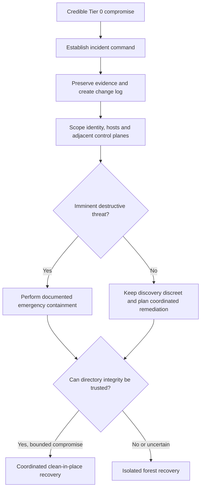
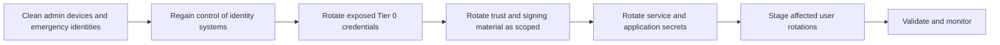

# Responding to an Active Directory Compromise: Containment, Credential Rotation and Recovery Decisions

An Active Directory compromise is an identity-control-plane incident. Resetting Domain Admin passwords is not enough: an adversary may retain access through domain controllers, delegated ACLs, certificates, federation, service accounts, trusts, virtualization or backups.

This guide covers the decisions between detection and recovery execution. It does not replace forensic expertise or the tested forest-recovery procedure.

> **TL;DR**
>
> - Establish incident command and a clean communications channel before broad remediation.
> - Preserve evidence and document every emergency change.
> - Scope identities, endpoints, domain controllers and adjacent control planes together.
> - Contain imminent harm, but do not reset every password at once or reveal a coordinated recovery prematurely.
> - Build a dependency-aware credential-rotation plan from a trusted administrative environment.
> - Recover the forest when directory integrity cannot be trusted; do not use forest recovery as a generic malware-cleanup step.
> - Rebuild compromised systems from known-good media and validate persistence paths before reconnecting them.

## 1. Declare the incident at the correct level

Evidence that a Tier 0 identity or system was compromised should trigger an identity-control-plane investigation. Examples include:

- interactive or remote use of a domain administrator outside approved workstations;
- DCSync-like directory replication from a non-DC;
- unauthorized changes to privileged groups, AdminSDHolder, domain-root ACLs or Group Policy;
- access to `NTDS.dit`, DC system-state backups or the `krbtgt` secret;
- forged Kerberos tickets or unexplained SID history;
- compromise of AD CS, AD FS, Microsoft Entra Connect, hypervisor or backup administration;
- persistence on a writable domain controller.

Do not let the first alert define the full scope. Sophisticated operators commonly establish more than one persistence mechanism.



## 2. Establish a clean command structure

Assign one incident commander with authority to approve containment and recovery changes. Name separate leads for investigation, identity, infrastructure, business continuity, legal and communications.

Assume production email, collaboration and administrative workstations may be visible to the adversary. Use a pre-established out-of-band channel or a clean tenant and clean devices. Restrict plans to people who need them without blocking evidence sharing between investigation teams.

Maintain two records from the start:

- an evidence log recording source, collector, time, hash, storage location and chain of custody;
- a change log recording approver, operator, exact action, target, time, expected impact and rollback plan.

Synchronize investigator clocks and record time zones. A timeline assembled from local time, UTC and unsynchronized DCs is easy to misread.

## 3. Preserve evidence before broad change

Microsoft's incident-response guidance is explicit: act quickly, but do no harm. Rushed remediation can destroy forensic data, interrupt critical services and alert an established adversary before all persistence paths are known.

Preserve according to legal and forensic requirements:

- volatile data and memory from relevant hosts;
- Security, Directory Service, DNS Server, AD FS, AD CS and PowerShell logs;
- EDR timelines and raw alerts;
- firewall, VPN, proxy, DHCP and authentication-provider logs;
- relevant Microsoft Entra audit and sign-in logs;
- DC system state and immutable backup metadata;
- suspicious binaries, scripts, scheduled tasks and registry artifacts;
- directory objects, ACLs and replication metadata for suspicious changes.

Do not upload targeted malware or documents to public analysis services without approval. The submission can reveal the investigation.

### Create a read-only directory snapshot

The following collection writes files locally but does not modify Active Directory:

```powershell
Import-Module ActiveDirectory

$timestamp = Get-Date -Format 'yyyyMMdd-HHmmss'
$caseRoot = Join-Path $env:ProgramData "AD-IR-$timestamp"
New-Item -Path $caseRoot -ItemType Directory -Force | Out-Null

Get-ADForest |
    Export-Clixml -Path (Join-Path $caseRoot 'forest.xml')

Get-ADDomain |
    Export-Clixml -Path (Join-Path $caseRoot 'domain.xml')

Get-ADDomainController -Filter * |
    Select-Object HostName, Site, IPv4Address, OperatingSystem,
                  IsGlobalCatalog, IsReadOnly, OperationMasterRoles |
    Export-Csv -Path (Join-Path $caseRoot 'domain-controllers.csv') `
        -NoTypeInformation

Get-FileHash -Path (Join-Path $caseRoot '*') -Algorithm SHA256 |
    Export-Csv -Path (Join-Path $caseRoot 'collection-hashes.csv') `
        -NoTypeInformation
```

Store the output in approved evidence storage, record custody and hash it again after transfer. A local folder on a potentially compromised system is not trustworthy evidence storage.

## 4. Scope beyond the first compromised account

Build the scope across four connected layers.

| Layer | Questions |
|---|---|
| Identities | Which users, service accounts, gMSAs, computer accounts, application identities and emergency accounts were exposed? |
| Directory | Were ACLs, groups, GPOs, trusts, schema, configuration, DNS, replication rights or authentication policies changed? |
| Systems | Which DCs, admin workstations, jump hosts, management servers, hypervisors and backup systems executed attacker-controlled code? |
| Adjacent control planes | Were AD CS, AD FS, Entra Connect, cloud administration, EDR, network management or password vaults exposed? |

An account is not "clean" merely because its password has changed. Credentials can be captured again if the account signs in to a compromised host.

### Snapshot privileged membership

Use stable identifiers and preserve nested membership paths where possible:

```powershell
$privilegedGroups = @(
    'Administrators',
    'Domain Admins',
    'Enterprise Admins',
    'Schema Admins',
    'Account Operators',
    'Server Operators',
    'Backup Operators',
    'Group Policy Creator Owners',
    'Key Admins',
    'Enterprise Key Admins'
)

$membership = foreach ($groupName in $privilegedGroups) {
    $group = Get-ADGroup -Identity $groupName -ErrorAction SilentlyContinue
    if (-not $group) {
        continue
    }

    Get-ADGroupMember -Identity $group -Recursive -ErrorAction Continue |
        Select-Object @{Name='ProtectedGroup'; Expression={$group.Name}},
                      Name,
                      ObjectClass,
                      SID,
                      DistinguishedName
}

$membership |
    Sort-Object ProtectedGroup, ObjectClass, Name |
    Export-Csv -Path (Join-Path $caseRoot 'privileged-membership.csv') `
        -NoTypeInformation
```

Add organization-specific delegated administration and Tier 0 groups. Review direct membership separately when the nesting path matters.

### Find sensitive recent changes

`whenChanged` is a screening field, not a forensic history. Replication metadata and audit events are needed to identify the originating DC, version and writer.

```powershell
$reviewStart = (Get-Date).AddDays(-14)
$domainDn = (Get-ADDomain).DistinguishedName

Get-ADObject `
    -Filter 'whenChanged -ge $reviewStart' `
    -SearchBase $domainDn `
    -Properties whenChanged, whenCreated, objectClass |
    Select-Object Name, ObjectClass, whenCreated, whenChanged,
                  DistinguishedName |
    Sort-Object whenChanged -Descending |
    Export-Csv -Path (Join-Path $caseRoot 'recent-directory-changes.csv') `
        -NoTypeInformation
```

Prioritize changes to privileged identities, delegation attributes, GPO links and files, authentication policies, trusts, DNS, AdminSDHolder and ACLs. Use `repadmin /showobjmeta` or equivalent directory replication metadata for each suspicious object.

### Inventory high-risk user attributes

```powershell
$properties = @(
    'adminCount',
    'DoesNotRequirePreAuth',
    'TrustedForDelegation',
    'TrustedToAuthForDelegation',
    'servicePrincipalName',
    'msDS-AllowedToDelegateTo',
    'msDS-AllowedToActOnBehalfOfOtherIdentity',
    'SIDHistory',
    'PasswordLastSet',
    'whenChanged'
)

Get-ADUser -Filter * -Properties $properties |
    Where-Object {
        $_.adminCount -eq 1 -or
        $_.DoesNotRequirePreAuth -or
        $_.TrustedForDelegation -or
        $_.TrustedToAuthForDelegation -or
        $_.servicePrincipalName.Count -gt 0 -or
        $_.'msDS-AllowedToDelegateTo'.Count -gt 0 -or
        $null -ne $_.'msDS-AllowedToActOnBehalfOfOtherIdentity' -or
        $_.SIDHistory.Count -gt 0
    } |
    Select-Object SamAccountName, Enabled, adminCount,
                  DoesNotRequirePreAuth, TrustedForDelegation,
                  TrustedToAuthForDelegation, PasswordLastSet,
                  whenChanged, SIDHistory, servicePrincipalName,
                  'msDS-AllowedToDelegateTo' |
    Export-Clixml -Path (Join-Path $caseRoot 'high-risk-users.xml')
```

Many legitimate accounts match these conditions. The value is in comparison with a known-good baseline and change evidence, not in treating every result as malicious.

## 5. Contain without destroying the investigation

Emergency containment is justified when the adversary is encrypting, deleting or exfiltrating critical data, or when continued privileged access presents greater risk than lost evidence and service interruption.

Possible emergency actions include:

- isolate confirmed compromised endpoints and servers through EDR or network controls;
- disable or restrict confirmed compromised accounts;
- revoke cloud sessions and review registered authentication methods;
- block confirmed command-and-control infrastructure;
- stop a dangerous replication or trust path under incident-command approval;
- protect immutable backups and management interfaces from production credentials.

Record each action. Preserve relevant evidence first when the delay is tolerable.

For an adversary with established redundant access, cleaning artifacts one by one can reveal the investigation. Prefer a consolidated remediation event after discovery, preparation and rehearsal. Early partial remediation often gives the attacker time to replace persistence, erase evidence or accelerate destructive actions.

## 6. Build a trusted recovery control plane

Before rotating broad credentials, establish a place from which those rotations can be trusted:

1. Use clean, patched devices built from known-good media.
2. Create or recover a small set of emergency administrative identities.
3. Enforce strong authentication and restrict where those identities can sign in.
4. Separate identity, virtualization, backup and cloud administration.
5. Use out-of-band communications and a clean password vault.
6. Confirm that EDR, logging and time synchronization are working.
7. Prevent recovered credentials from being entered on systems that are still suspect.

Do not use ordinary production workstations to perform the recovery because they are convenient.

## 7. Plan credential rotation as a dependency graph

Never reset all passwords simultaneously. Uncoordinated resets can cause outages, account lockouts, unrecoverable encrypted data and a flood of noise that hides attacker activity.

For each secret, record:

- owner and business service;
- storage locations and consumers;
- privilege and exposure evidence;
- rotation method and rollback;
- dependent services, tasks, pools and appliances;
- validation owner and success criteria;
- earliest safe rotation time.



The diagram is a dependency model, not a universal command sequence. Active attacker access, hybrid dependencies and the selected recovery method can change the order.

### Credential families to assess

| Family | Recovery consideration |
|---|---|
| Privileged users | Reset from clean devices, revoke sessions and review authentication methods and group membership |
| `krbtgt` | Two controlled resets per domain, separated by the effective maximum ticket lifetime; include RODC-specific accounts in the plan |
| Domain controllers | Rebuild or recover according to the selected forest procedure; do not casually reset DC machine accounts |
| Trusts | Rotate exposed interdomain, interforest and external trust secrets with both sides coordinated |
| DSRM | Set a unique protected value on every DC and remove unsafe synchronization practices |
| Service accounts | Coordinate with application owners and update every dependency before validation |
| gMSA and KDS | If a writable AD database was compromised, assess Golden gMSA exposure; Microsoft may require a new KDS root key and gMSA recreation |
| AD CS | Assess CA private keys, templates, enrollment agents and issued certificates; a compromised CA may require hierarchy recovery, not only account resets |
| AD FS | Assess service accounts, token-signing/decrypting certificates, trust configuration and relying parties |
| Entra Connect | Assess sync accounts, connector credentials, server integrity, application credentials and cloud roles |
| Hypervisor and backup | Rotate from their own clean control planes; these systems can reintroduce compromised DCs or expose directory backups |
| Local administrators | Rotate with Windows LAPS or the approved platform after host integrity is restored |

### Treat krbtgt as one task, not the whole response

A double `krbtgt` reset invalidates old domain Kerberos key material after ticket lifetimes expire. It does not remove malware, malicious certificates, ACL backdoors, stolen service secrets or cloud persistence.

Do not perform back-to-back resets. Do not improvise the operation while replication is unhealthy. If forest recovery is selected, follow the reset sequence in [Recovering a Single-Domain Active Directory Forest](Recovering%20a%20Single-Domain%20Active%20Directory%20Forest.md).

## 8. Hunt identity persistence

At minimum, compare the current environment with known-good baselines for:

- privileged and nested group membership;
- AdminSDHolder, domain-root, OU, GPO and Configuration partition ACLs;
- DCSync-capable replication rights;
- SID history and shadow credentials (`msDS-KeyCredentialLink`);
- unconstrained, constrained and resource-based constrained delegation;
- accounts without Kerberos preauthentication and unexpected SPNs;
- authentication policies, silos and protected-user membership;
- newly created users, computers, groups and service connections;
- GPO content in both AD and SYSVOL;
- scheduled tasks, services, WMI subscriptions and startup scripts on Tier 0 systems;
- rogue DCs, replication partners, DNS records and sites/subnets;
- trusts and selective-authentication settings;
- AD CS templates, CA ACLs, enrollment services and certificate issuance;
- AD FS and Entra Connect configuration;
- backup, hypervisor and security-tool administration.

For protected-account ACL analysis, see [AdminSDHolder and SDProp: Protected Accounts, adminCount and Safe Cleanup](../Concepts/AdminSDHolder%20and%20SDProp%20-%20Protected%20Accounts,%20adminCount%20and%20Safe%20Cleanup.md).

Absence of a known indicator is not proof of integrity. Attackers with domain-level privileges can erase logs and modify the same controls used for validation.

## 9. Decide: clean in place or recover the forest

The decision is about trust in directory integrity, not only availability.

### Clean in place may be defensible when

- the compromise is bounded to identified accounts or member systems;
- there is no evidence that a writable DC or AD database was accessed;
- directory changes and credential exposure can be confidently enumerated;
- sufficient telemetry covers the attack window;
- trusted administrators, devices and recovery infrastructure exist;
- persistence can be removed and the result independently validated.

### Forest recovery should be strongly considered when

- a writable DC or `NTDS.dit` was compromised;
- the attacker obtained domain-wide replication secrets or persistent domain control;
- schema, Configuration partition, domain-root ACLs or critical GPO integrity cannot be established;
- multiple DCs contain attacker persistence or untrusted code;
- unauthorized replication, rogue DC behavior or widespread identity corruption occurred;
- the team cannot prove that all persistence mechanisms are understood;
- ransomware, destructive changes or operational failure made the forest untrustworthy.

| Question | Favors clean in place | Favors forest recovery |
|---|---|---|
| Is the affected scope bounded? | Yes, with corroborating evidence | No or uncertain |
| Are writable DCs trusted? | No compromise evidence | Compromised or unverifiable |
| Is the change history observable? | Telemetry and baselines cover the window | Logs are missing or manipulated |
| Can persistence be enumerated? | Yes, independently validated | Multiple unknown paths likely |
| Is there a trusted backup? | Useful but not required for bounded cleanup | Required, predating compromise |
| Can recovery be isolated and rehearsed? | Coordinated remediation is feasible | Isolation is required to regain trust |

Business pressure alone cannot make an untrusted directory trustworthy. Conversely, forest recovery does not automatically clean compromised applications, endpoints or adjacent control planes.

## 10. If forest recovery is selected

Use Microsoft's forest-recovery guidance and a tested organization-specific plan. Core principles include:

1. identify a trusted backup from before the compromise;
2. isolate recovery networking from production;
3. shut down writable DCs where possible;
4. restore one trusted writable DC per domain in the prescribed order;
5. prevent old DCs from replicating back into the recovered forest;
6. rebuild remaining DCs and RODCs rather than reconnecting untrusted instances;
7. perform the required credential rotations and validate each recovery phase;
8. reconnect only systems that have their own integrity decision.

The detailed single-domain implementation is documented in [Recovering a Single-Domain Active Directory Forest](Recovering%20a%20Single-Domain%20Active%20Directory%20Forest.md). Do not substitute VM snapshots or unsupported system-state moves for that procedure.

## 11. Validate before declaring recovery

Define success criteria before the remediation event. Validate from clean systems and retain the evidence.

### Directory health

```powershell
Get-ADReplicationFailure `
    -Target * `
    -Scope Forest |
    Format-Table Server, FirstFailureTime, FailureCount,
                 LastError -AutoSize

Get-ADReplicationPartnerMetadata `
    -Target * `
    -Scope Forest |
    Select-Object Server, Partner, Partition,
                  LastReplicationSuccess, LastReplicationResult |
    Sort-Object Server, Partition, Partner
```

Also validate DNS, time, SYSVOL, Global Catalog availability, secure channels, backup jobs and event forwarding. Run `dcdiag` and `repadmin` from clean administration systems and investigate every unexplained failure.

### Security control

Confirm that:

- emergency accounts work only from approved administrative devices;
- old privileged credentials and sessions no longer work;
- privileged groups and delegated ACLs match the approved baseline;
- no unapproved replication principal exists;
- certificate, federation, synchronization and trust changes are complete;
- service owners validated every rotated dependency;
- EDR and centralized logging cover all rebuilt Tier 0 systems;
- detections for the original attack path and persistence methods are active.

Keep enhanced monitoring through at least the longest relevant credential, ticket, certificate and log-retention windows. An attacker may wait for normal operations to resume.

## 12. Post-incident improvements

Convert findings into owned engineering work:

- separate administrative identities and devices by control-plane scope;
- remove standing privilege and obsolete delegation;
- deploy Windows LAPS and gMSAs where supported;
- protect and test immutable AD-aware backups;
- centralize DC logs with retention aligned to investigation needs;
- baseline privileged membership, ACLs, trusts, GPOs and certificate services;
- monitor directory replication rights and sensitive attribute changes;
- test forest recovery in an isolated environment;
- document owners and rotation procedures for every Tier 0 secret;
- exercise the incident plan with identity, infrastructure and business teams.

The incident is not closed when authentication works again. It is closed when control has been re-established, business services are stable, residual risk is accepted by the right authority and the lessons have changed future behavior.

## 13. Common mistakes

| Mistake | Consequence |
|---|---|
| Resetting every password immediately | Outages, lost evidence and attacker warning |
| Resetting `krbtgt` twice back-to-back | Invalidates useful tickets without respecting key history and replication needs |
| Reusing production admin workstations | Newly rotated credentials can be stolen again |
| Focusing only on Domain Admins | Misses certificates, delegation, federation, synchronization and infrastructure control planes |
| Cleaning artifacts one at a time during an established intrusion | Gives the adversary time to adapt |
| Restoring the newest backup automatically | May restore attacker persistence |
| Reconnecting old DCs after forest recovery | Can reintroduce dangerous directory data |
| Treating forest recovery as complete enterprise recovery | Leaves endpoints, apps and adjacent control planes compromised |

## References

- [Microsoft incident response overview](https://learn.microsoft.com/en-us/security/operations/incident-response-overview)
- [Active Directory forest recovery guide](https://learn.microsoft.com/en-us/windows-server/identity/ad-ds/manage/forest-recovery-guide/ad-forest-recovery-guide)
- [Determine how to recover an Active Directory forest](https://learn.microsoft.com/en-us/windows-server/identity/ad-ds/manage/forest-recovery-guide/ad-forest-recovery-determine-how-to-recover)
- [Recover from a Golden gMSA attack](https://learn.microsoft.com/en-us/troubleshoot/windows-server/windows-security/recover-from-golden-gmsa-attack)
- [Planning for compromise](https://learn.microsoft.com/en-us/windows-server/identity/ad-ds/plan/security-best-practices/planning-for-compromise)
- [Securing privileged access](https://learn.microsoft.com/en-us/security/privileged-access-workstations/privileged-access-access-model)
- [Recovering a Single-Domain Active Directory Forest](Recovering%20a%20Single-Domain%20Active%20Directory%20Forest.md)