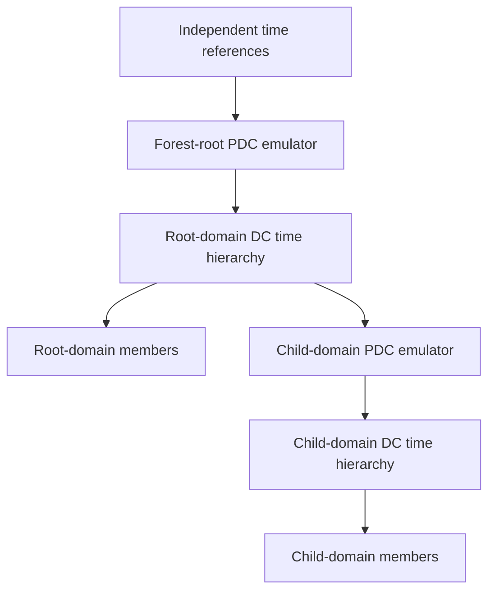

# Windows Time in Active Directory: Forest-Root PDC, Domain Hierarchy and Verification

**A configured NTP peer is an intention. A recent successful synchronization with the expected source is evidence.**

AD DS provides a time hierarchy, but the forest-root PDC emulator still needs a deliberate upstream reference. In Windows Server 2022/2025 environments, Group Policy, virtual-machine time providers, firewall behavior and role transfers can all change the effective path.

> **TL;DR**
> - Identify the PDC emulator of the forest root, not just the local domain's PDC.
> - Use independent, trusted upstream time sources there; ordinary domain members normally use NT5DS.
> - Inspect effective policy and active providers before changing registry values.
> - A successful stripchart is not proof that the W32Time service can synchronize.
> - Verify source, last successful synchronization, offset and behavior after restart/role changes.

## 1. Understand the intended hierarchy



This is an illustrative hierarchy, not a promise that every computer contacts its PDC directly. W32Time considers domain relationships, site/location and reliable-source information when selecting a source. A deliberately engineered alternative should have an equally explicit authority and failover model.

Domain members normally use **NT5DS**. The conventional forest-root PDC configuration uses manual **NTP** peers outside that AD time hierarchy. Avoid a loop in which the reference, hypervisor and DC ultimately obtain their time from one another.

## 2. Locate the forest-root role holder

From a management host with the AD module:

```powershell
Import-Module ActiveDirectory -ErrorAction Stop
$forest = Get-ADForest -ErrorAction Stop
$rootDomain = Get-ADDomain -Identity $forest.RootDomain `
    -Server $forest.RootDomain -ErrorAction Stop
$rootPdc = Get-ADDomainController -Identity $rootDomain.PDCEmulator `
    -Server $forest.RootDomain -ErrorAction Stop

[pscustomobject]@{
    Forest = $forest.Name
    RootDomain = $forest.RootDomain
    RootPdc = $rootPdc.HostName
    Site = $rootPdc.Site
}
```

Do not configure every child-domain PDC to use unrelated public sources simply because its local role is PDC emulator. In the conventional design, child domains remain part of the forest hierarchy.

## 3. Capture effective state on the affected host

Use an elevated session on the computer being investigated:

```powershell
Get-Service -Name W32Time -ErrorAction Stop |
    Select-Object Name, Status, StartType

foreach ($query in '/source', '/status', '/configuration', '/peers') {
    w32tm.exe /query $query /verbose
    if ($LASTEXITCODE -ne 0) { throw "W32Time query failed: $query" }
}
```

Record the source, time since last good synchronization, stratum, leap indicator, last error and active configuration source. `Local CMOS Clock`, an unexpected host provider or a very old last-success time needs explanation; a running service alone is not enough.

Policies under `Computer Configuration > Administrative Templates > System > Windows Time Service` can overwrite local configuration. Use the effective `/configuration` output and computer GPO results. A registry value under the service key can be different from the policy-owned value actually used.

## 4. Verify the upstream path before changing the clock

Use a bounded offset sample against a chosen reference:

```powershell
w32tm.exe /stripchart /computer:ntp01.corp.example /dataonly /samples:5
if ($LASTEXITCODE -ne 0) { throw 'The bounded NTP comparison failed.' }
```

The names in this guide are placeholders for real independent time sources, not additional DCs pointing back into the same hierarchy.

The built-in W32Time NTP client uses **UDP 123 as its source port**, while `stripchart` uses an **ephemeral UDP source port**. A firewall/NAT policy can permit one and block the other. `Test-NetConnection -Port 123` tests TCP, not NTP over UDP.

Investigate a large offset before forcing synchronization. A clock correction can be a step rather than a gradual adjustment and can affect authentication, certificates, databases and event ordering. Kerberos's commonly cited five-minute skew tolerance is not a time-accuracy target or a ticket lifetime.

## 5. Configure the selected role with a guarded preview

For managed systems, change the owning GPO and verify its targeting. The helper below is for an explicitly selected local configuration/pilot where policy ownership has already been checked. It requires the AD module on the target so it can re-read the current role holder.

The manual-peer branch requires three distinct peer names/addresses, following current Microsoft guidance to prefer three or more sources. Distinct names do not prove independent clocks; that is an infrastructure design check. If only two sources are available, design the documented primary/fallback behavior separately rather than pretending that two agreeing names establish correctness.

```powershell
function Set-ADTimeConfiguration {
    [CmdletBinding(SupportsShouldProcess, ConfirmImpact = 'High')]
    param(
        [Parameter(Mandatory, ParameterSetName = 'RootPdc')]
        [ValidateNotNullOrEmpty()][string[]]$NtpServers,

        [Parameter(Mandatory, ParameterSetName = 'DomainHierarchy')]
        [switch]$UseDomainHierarchy
    )

    $computer = Get-CimInstance Win32_ComputerSystem -ErrorAction Stop
    if (-not $computer.PartOfDomain) { throw 'This workflow requires a domain-joined computer.' }
    $forest = Get-ADForest -Server $computer.Domain -ErrorAction Stop
    $rootDomain = Get-ADDomain -Identity $forest.RootDomain `
        -Server $forest.RootDomain -ErrorAction Stop
    $pdc = Get-ADDomainController -Identity $rootDomain.PDCEmulator `
        -Server $forest.RootDomain -ErrorAction Stop
    $isRootPdc = $computer.DomainRole -ge 4 -and
        $computer.Domain -eq $forest.RootDomain -and $computer.Name -eq $pdc.Name

    $arguments = @('/config')
    if ($PSCmdlet.ParameterSetName -eq 'RootPdc') {
        if (-not $isRootPdc) { throw 'Manual root time configuration must run on the current forest-root PDC.' }
        foreach ($server in $NtpServers) {
            if ([uri]::CheckHostName($server) -eq [UriHostNameType]::Unknown) {
                throw "Provide a DNS name or IP address without embedded peer flags: $server"
            }
        }
        $peers = @($NtpServers | ForEach-Object { $_.TrimEnd('.').ToLowerInvariant() } | Select-Object -Unique)
        if ($peers.Count -lt 3) { throw 'This example requires at least three distinct upstream peers.' }
        if ($peers -contains $pdc.HostName -or $peers -contains $pdc.Name) {
            throw 'The root PDC must not reference itself.'
        }
        $peerList = ($peers | ForEach-Object { '{0},0x8' -f $_ }) -join ' '
        $arguments += "/manualpeerlist:$peerList", '/syncfromflags:manual', '/reliable:yes'
    } else {
        if (-not $UseDomainHierarchy -or $isRootPdc) {
            throw 'Do not return the root PDC to the conventional domain hierarchy or pass a false mode switch.'
        }
        $arguments += '/syncfromflags:domhier'
        if ($computer.DomainRole -ge 4) { $arguments += '/reliable:no' }
    }
    $arguments += '/update'

    if ($PSCmdlet.ShouldProcess($computer.Name, 'Configure time source, restart W32Time and resynchronize')) {
        w32tm.exe @arguments
        if ($LASTEXITCODE -ne 0) { throw 'W32Time configuration failed.' }
        Restart-Service -Name W32Time -ErrorAction Stop
        w32tm.exe /resync /rediscover
        if ($LASTEXITCODE -ne 0) { throw 'Configuration changed, but resynchronization failed; investigate and verify.' }
    }
}

Set-ADTimeConfiguration -NtpServers 'ntp01.corp.example',
    'ntp02.corp.example', 'ntp03.corp.example' -WhatIf
```

`0x8` selects NTP client mode. `0x1` requests special-interval behavior; it is not required just to use a manual peer. `0x2` is the fallback-only flag and can be combined with the appropriate mode. Do not copy old `SpecialPollInterval` tweaks into an NT5DS deployment and expect them to control domain-hierarchy polling.

The preview performs role/argument checks but does not change configuration, restart a service or synchronize the clock. Apply without `-WhatIf` only after recording the before-state and reviewing the clock-change consequences. `/reliable:yes` is an advertisement choice, not proof that the clock is correct.

## 6. Return an ordinary member to the domain hierarchy

On a domain member, or a non-root-PDC DC that is intended to follow the conventional hierarchy, use the other parameter set:

```powershell
Set-ADTimeConfiguration -UseDomainHierarchy -WhatIf
```

For a DC, this example also clears an explicit reliable-source designation. Do not use that branch on a deliberately designated alternative reliable DC without reviewing the design. The forest-root PDC is refused even if someone accidentally invokes this example there.

The helper is not transactional: a service restart or resynchronization can fail after configuration was accepted. Preserve the failure and re-read the effective state rather than reporting the whole operation as successful.

## 7. Handle virtual machines and role changes explicitly

A VM can receive time through its hypervisor integration provider as well as the guest's network time service. Startup/resume corrections and steady-state synchronization are different behaviors. Determine which provider is active and follow the supported hypervisor/platform guidance for DC guests.

Do not disable every integration service or blindly apply one registry value to Hyper-V, VMware and cloud VMs. In particular, avoid a forest-root PDC following a host that itself depends on that same DC for time.

When the forest-root PDC role moves, verify upstream configuration and effective policy on the new holder and return the old holder to its intended role. A manually configured peer list does not magically follow an FSMO transfer. Recheck any role-targeted GPO filtering and provider settings.

## 8. Prove convergence after the change

On the changed host, then from a relevant management host for the selected DC comparison:

```powershell
w32tm.exe /query /source
if ($LASTEXITCODE -ne 0) { throw 'Cannot read the selected time source.' }
w32tm.exe /query /status /verbose
if ($LASTEXITCODE -ne 0) { throw 'Cannot read synchronization status.' }
w32tm.exe /query /peers
if ($LASTEXITCODE -ne 0) { throw 'Cannot read the peer state.' }

w32tm.exe /monitor /computers:dc01.corp.example,dc02.corp.example
if ($LASTEXITCODE -ne 0) { throw 'DC time comparison failed.' }
```

Require the intended active source, recent successful synchronization, acceptable offset/dispersion and no continuing synchronization errors. Repeat after policy refresh and restart. A small offset in one sample does not prove sustained accuracy, and a peer appearing in the configuration does not prove it is selected.

For recent service events:

```powershell
Get-WinEvent -FilterHashtable @{
    LogName = 'System'
    ProviderName = 'Microsoft-Windows-Time-Service'
    StartTime = (Get-Date).AddHours(-4)
} -MaxEvents 100 -ErrorAction Stop |
    Select-Object TimeCreated, Id, LevelDisplayName, Message
```

No matching events is different from an unreadable log. Correlate service messages with the actual source, firewall path and policy state. Preserve time zones and UTC timestamps when comparing evidence from machines with incorrect clocks.

## 9. Avoid configuration resets as a first response

Do not begin with `w32tm /unregister`, arbitrary phase-correction thresholds or repeated forced clock changes. Those can erase the evidence and change the service configuration while leaving the source/policy problem unresolved.

Restore the recorded configuration through its original owner if rollback is necessary. Reversing a policy value does not undo timestamps already written by applications or safely reverse a clock step. For Kerberos failures, use [Troubleshooting Kerberos Authentication](../Troubleshoot/Troubleshooting%20Kerberos%20Authentication%20-%20SPNs,%20Tickets,%20Error%20Codes%20and%20NTLM%20Fallback.md) to correlate the time evidence with the actual protocol error.

## References

- [Microsoft: how the Windows Time service works](https://learn.microsoft.com/en-us/windows-server/networking/windows-time-service/how-the-windows-time-service-works)
- [Microsoft: Windows Time service tools and settings](https://learn.microsoft.com/en-us/windows-server/networking/windows-time-service/windows-time-service-tools-and-settings)
- [Microsoft: support boundary for high-accuracy time](https://learn.microsoft.com/en-us/windows-server/networking/windows-time-service/support-boundary)
- [Microsoft: virtualized domain controllers on Hyper-V](https://learn.microsoft.com/en-us/windows-server/identity/ad-ds/get-started/virtual-dc/virtualized-domain-controllers-hyper-v)