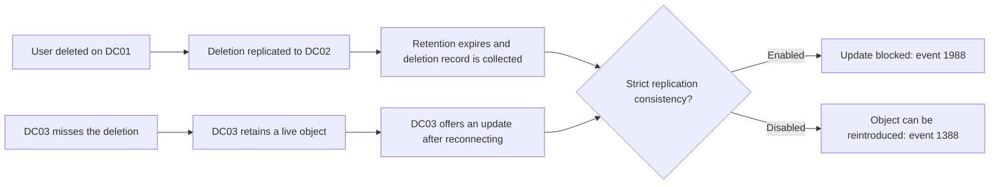

# Active Directory Lingering Objects: Detection, Advisory Mode, Cleanup and Prevention

**A lingering object is a replica that missed the deletion, not an object waiting in the Recycle Bin.** A DC that remains disconnected long enough can retain a live object after other replicas have deleted it and discarded the deletion record. Reconnecting that DC does not make its database safe to replicate.

This guide applies to AD DS on supported Windows Server versions, including 2022 and 2025. It separates discovery from removal and distinguishes a blocked stale object from one already reintroduced into the directory.

> **TL;DR**
>
> - Read the forest's actual retention settings; do not assume every forest uses 180 days.
> - Event 1988 identifies a suspect **source**. The DC logging the event is blocking inbound replication from that source for the affected partition.
> - Choose a current, writable reference replica of that exact partition. PDC ownership and GC status do not make a DC authoritative for every partition.
> - Run `repadmin /removelingeringobjects ... /advisory_mode` before considering removal.
> - A completed scan with reviewed results is evidence. An empty display after a failed query is not.
> - Do not disable strict replication consistency or extend retention to make an already stale replica acceptable.

## 1. How a live object outlives its deletion

Consider three DCs holding a domain partition. DC03 stops receiving changes. An administrator deletes a user on DC01, and DC02 receives that deletion. After the deletion record has completed its retention lifecycle and garbage collection, DC01 and DC02 no longer have it. DC03 still has a live copy.



The stale object may sit unnoticed until it is updated or conflicts with a new object. Global Catalog partial replicas can also retain objects from other domains. A forest review must therefore consider more than the writable DCs in the object's original domain.

USN rollback is a different failure mechanism. It involves reused replication identity/sequence state, not simply a missed deletion. See [Active Directory Replication Internals](../Concepts/Active%20Directory%20Replication%20Internals%20-%20USNs,%20Invocation%20IDs,%20High-Watermark%20and%20Up-to-Dateness%20Vectors.md).

## 2. Retention is not a fixed 180-plus-180 rule

Without AD Recycle Bin, a deletion normally produces a tombstone retaining a reduced attribute set. With Recycle Bin enabled, the object first remains in the deleted state with recoverable attributes, then becomes recycled and eventually eligible for garbage collection.

| Setting or process | Meaning |
|---|---|
| `tombstoneLifetime` | Retention boundary used for tombstones and recycled objects; also important to stale-replication safeguards |
| `msDS-DeletedObjectLifetime` | Deleted-object retention with Recycle Bin; when unset, it inherits the tombstone-lifetime value |
| Garbage collection | Local periodic removal of eligible objects, normally every 12 hours |
| Lingering object | A live or otherwise stale replica that failed to receive the lifecycle changes; not a normal retention state |

New forests created with current Windows Server versions normally use 180 days for `tombstoneLifetime`. An older forest may retain a different value; an unset attribute has legacy default behavior rather than meaning zero days. Upgrading the DC operating system does not rewrite the forest's retention history.

Read the configuration before doing any age arithmetic:

```powershell
Import-Module ActiveDirectory

$queryDc = 'dc01.corp.example'
$rootDse = Get-ADRootDSE -Server $queryDc
$directoryServiceDn = "CN=Directory Service,CN=Windows NT,CN=Services,$($rootDse.ConfigurationNamingContext)"

Get-ADObject -Identity $directoryServiceDn -Server $queryDc `
    -Properties tombstoneLifetime, 'msDS-DeletedObjectLifetime' |
    Select-Object DistinguishedName, tombstoneLifetime, 'msDS-DeletedObjectLifetime'

Get-ADOptionalFeature -Identity 'Recycle Bin Feature' -Server $queryDc |
    Select-Object Name, EnabledScopes
```

Do not treat two retention intervals as permission to leave a DC offline for their sum. Replication age safeguards and safe backup age require their own evaluation. Increasing a lifetime today does not recreate deletion records already garbage-collected yesterday.

## 3. Read the event before choosing a repair

```powershell
$loggingDc = 'dc02.corp.example'

Get-WinEvent -ComputerName $loggingDc -FilterHashtable @{
    LogName = 'Directory Service'
    Id = 1388, 1988, 2042
    StartTime = (Get-Date).AddDays(-7)
} -ErrorAction Stop |
    Select-Object TimeCreated, Id, MachineName, RecordId, Message
```

| Evidence | Interpretation and next step |
|---|---|
| Event 1988 | The destination refused an update for an object absent locally. Record the named source, object GUID and partition. |
| Event 1388 | An object was reintroduced because strict consistency did not block it. Ordinary reference comparison may no longer identify it correctly. |
| Event 2042 or replication error 8614 | Excessive time since replication. This signals risk, not proof that every object is stale. |
| Error 8606 | Insufficient attributes to create an object; investigate object state and retention rather than assuming one universal cause. |
| Event 2095 | USN rollback: stop this procedure and follow the supported DC recovery path. |

For 1988, do not reverse the roles: the **source DC in the event** is the initial cleanup candidate, while the **destination that logged it** rejected the update. Neither fact proves that the logging DC is clean in every other partition.

Preserve the event's full message. A count of "three errors" loses the DC GUID, naming context and object identity needed to investigate.

## 4. Define the comparison before running a tool

Build a small evidence table for each affected partition:

| Field | Required evidence |
|---|---|
| Suspect DC | The replica that retains the object or has the stale history |
| Partition DN | Exact naming context from the event |
| Reference DC | Healthy replication history and a writable copy of that partition |
| Reference DSA object GUID | `objectGUID` of its NTDS Settings object, not its Invocation ID |
| Candidate object GUIDs | Correlated with deletion history and other replicas |
| Other replicas | Writable DCs, RODCs and GC partial replicas that may require inspection |

Being the PDC emulator does not make a DC the best reference. A root-domain GC has a read-only partial replica of a child domain; that partial replica is not a valid writable reference for the child's partition. Likewise, an RODC cannot serve as the writable reference.

Before comparison, correct ordinary DNS/RPC/authentication failures that prevent the tools from reading the chosen systems. Do not force a stale partition to synchronize as a connectivity test. If no trustworthy reference exists, or deletion intent is uncertain, stop and involve directory recovery expertise.

## 5. Resolve and check the reference identity

The following read-only preparation uses the directory object's GUID directly and rejects an obviously unsuitable reference. The checks establish eligibility, not historical cleanliness.

```powershell
Import-Module ActiveDirectory

$suspectDc = 'dc03.corp.example'
$referenceDc = 'dc01.corp.example'
$partitionDn = 'DC=corp,DC=example'

$reference = Get-ADDomainController -Identity $referenceDc -Server $referenceDc -ErrorAction Stop
if ($reference.IsReadOnly -or $reference.HostName -eq $suspectDc) {
    throw 'Select a different, writable reference DC.'
}

$referenceNtds = Get-ADObject -Identity $reference.NTDSSettingsObjectDN `
    -Server $referenceDc -Properties 'msDS-hasMasterNCs', hasMasterNCs -ErrorAction Stop
$writablePartitions = @($referenceNtds.'msDS-hasMasterNCs') + @($referenceNtds.hasMasterNCs)
if ($partitionDn -notin $writablePartitions) {
    throw 'The reference does not advertise a writable replica of this partition.'
}

$referenceDsaGuid = $referenceNtds.ObjectGUID.ToString()
[pscustomobject]@{
    SuspectDc = $suspectDc
    ReferenceDc = $reference.HostName
    ReferenceDsaGuid = $referenceDsaGuid
    Partition = $partitionDn
}

repadmin.exe /showrepl $referenceDc /all /verbose
```

Compare the GUID with the reference's `/showrepl` header. Confirm the reference's recent replication history with other healthy partners, its object state and its recovery history. A current-looking timestamp alone is insufficient.

Use the same PowerShell session for the following steps so these reviewed values remain explicit. Re-resolve them if a DC has since been rebuilt or replaced.

## 6. Run advisory mode first

From an elevated RSAT session with the required directory rights:

```powershell
$scanStarted = Get-Date

repadmin.exe /removelingeringobjects $suspectDc $referenceDsaGuid $partitionDn /advisory_mode
if ($LASTEXITCODE -ne 0) {
    throw 'Advisory comparison failed; no clean result can be inferred.'
}
```

The order is **DC to inspect, reference DSA GUID, partition DN**. `/advisory_mode` requests identification without deleting the objects. It still consumes server resources and records diagnostic events.

Review Directory Service events on the **suspect DC**, including event 1946 for identified objects, and verify that the comparison completed. Record the exact scan window, command and result. A started or interrupted comparison is not a completed clean scan.

```powershell
Get-WinEvent -ComputerName $suspectDc -FilterHashtable @{
    LogName = 'Directory Service'
    Id = 1946
    StartTime = $scanStarted
} -ErrorAction Stop |
    Select-Object TimeCreated, Id, MachineName, RecordId, Message
```

No matching 1946 events may mean no candidates, but only after a completed scan and a successful log query. Access denied, RPC failure or log rollover is an evidence gap.

Garbage collection runs independently on each DC. Objects near the retention boundary can appear transiently different until the next local collection. Review object state and timing before treating every advisory result as a live stale security principal.

## 7. Choose the cleanup method

Microsoft currently recommends **Lingering Object Liquidator v2 (LOLv2)** for discovery and cleanup workflows, with `repadmin` as a native alternative. Obtain it through the Microsoft download link in the references and check its stated prerequisites and support terms. The tool description explicitly states that the utility is provided as-is; a Microsoft download is not a guarantee of a supported product lifecycle.

Use topology detection, select the naming context/reference/target, run detection, and export the result before selecting removal. Forest-wide pairwise scans can be expensive; a blank selection must not accidentally turn a targeted investigation into an all-forest operation. Tool access to the remote event logs is also required to display scan evidence.

For a **confirmed ordinary lingering-object case**, the native removal operation is the same comparison without advisory mode. This example requires typing the selected target name to separate it from the preceding diagnostic blocks:

```powershell
$confirmation = Read-Host "Delete confirmed lingering objects from $suspectDc in $partitionDn? Type the target DC FQDN"
if ($confirmation -cne $suspectDc) {
    throw 'Cleanup cancelled.'
}

repadmin.exe /removelingeringobjects $suspectDc $referenceDsaGuid $partitionDn
if ($LASTEXITCODE -ne 0) {
    throw 'Cleanup failed; preserve the command output and Directory Service events.'
}
```

This deletes objects identified by the comparison in that partition; it is not a per-object undoable edit. Retain candidate exports and backups before removal. Directory-read access alone is insufficient: Microsoft documents Domain Admin rights for the target domain, and Enterprise Admin rights for forest-wide Configuration/Schema cleanup, as applicable.

Do not replace the target with `*` merely because more than one DC is affected. Work through the documented set of replicas and partitions, with an appropriate writable reference for each.

## 8. Cases that need a different path

### Objects already reintroduced: event 1388

Microsoft's 1388/1988 guidance warns that the normal LOLv2/Repadmin cleanup path cannot simply remove the already-reintroduced case. Once the object exists on the presumed reference too, absence-based comparison is no longer the same evidence.

Establish the original deletion, identify all surviving/reintroduced copies, and use the case-specific Microsoft guidance or support. Do not pick an arbitrary reference until one produces a desired deletion list.

### Lingering links and transient objects

Stale linked values are not automatically cleaned by an object-removal scan. Do not assume that successful object cleanup repairs all historical membership inconsistencies. Compare linked-value metadata when group membership is the symptom.

### DC offline beyond the retention boundary

Event 2042 requires a choice between a justified cleanup/reconnection procedure and rebuilding the stale DC. Rebuilding is often clearer when there are healthy peers and no unique required changes, but it still requires handling roles, metadata and replacement planning.

Do not set **Allow Replication With Divergent and Corrupt Partner** as a standing configuration. Any documented temporary override belongs after the required stale-object assessment, with its removal explicitly included. Extending `tombstoneLifetime` is not a retroactive cleanup.

## 9. Prove the final state

After confirmed cleanup:

1. Repeat advisory comparison for the same target/reference/partition.
2. Confirm successful completion and no unexplained remaining candidates.
3. Inspect all other replicas identified in the incident, including relevant GC partial replicas.
4. Resume replication only when the stale-replica safeguards have been addressed through the documented path.
5. Check current partner/partition results and new Directory Service events.
6. Validate the affected application lookup or group membership, not just the command exit code.

Record the reference selection and the coverage. "No objects found" on one DC does not mean "forest clean".

Use [Troubleshooting Active Directory Replication](Troubleshooting%20Active%20Directory%20Replication%20-%20repadmin,%20dcdiag,%20DNS,%20RPC,%20Time%20and%20Kerberos.md) for the ordinary connectivity and authentication checks.

## 10. Prevent recurrence

Keep strict replication consistency enabled on each DC. The setting blocks unsafe inbound replication; it does not itself delete an existing stale object. Its defaults depend on forest history, and raising a functional level is not a reliable way to change an inherited legacy setting.

For a confirmed DC that needs the setting enabled, the supported explicit change is:

```powershell
$domainController = 'dc03.corp.example'
repadmin.exe /regkey $domainController +strict
if ($LASTEXITCODE -ne 0) {
    throw 'Could not enable strict replication consistency.'
}
```

This changes configuration. Validate the resulting `Strict Replication Consistency` registry value on the target and check newly promoted DCs as well. Never publish the inverse operation as a repair for event 1988.

Monitor last-success ages well before the retention limit, retire failed DCs properly, keep clocks accurate and use AD-aware backups. Treat long-isolated staged DCs as stale replicas to evaluate, not appliances that can simply be plugged back in months later.

## References

- [Lingering objects in an AD DS forest](https://learn.microsoft.com/en-us/troubleshoot/windows-server/active-directory/information-lingering-objects)
- [Events 1388 and 1988](https://learn.microsoft.com/en-us/troubleshoot/windows-server/active-directory/active-directory-replication-event-id-1388-1988)
- [Description and limitations of Lingering Object Liquidator](https://learn.microsoft.com/en-us/troubleshoot/windows-server/active-directory/lingering-object-liquidator-tool)
- [Lingering Object Liquidator download](https://www.microsoft.com/download/details.aspx?id=56051)
- [Lingering objects after an out-of-date GC returns](https://learn.microsoft.com/en-us/troubleshoot/windows-server/active-directory/lingering-objects-remain)
- [Get-ADOptionalFeature](https://learn.microsoft.com/en-us/powershell/module/activedirectory/get-adoptionalfeature)