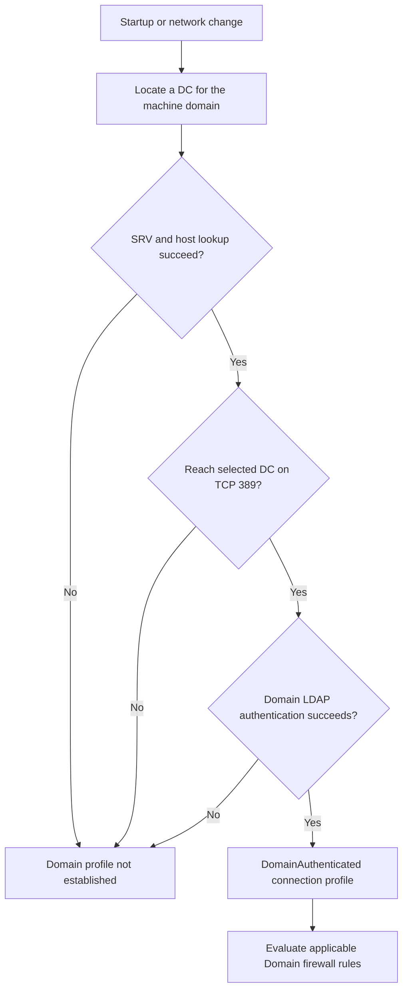

# Domain Controller Uses the Public Firewall Profile: NLA, DC Locator and LDAP Troubleshooting

**A domain controller can be healthy enough to run AD DS and still fail domain-network detection.** After startup, its adapter may show Public rather than DomainAuthenticated, leaving the expected Domain-profile firewall rules inactive for that connection.

The useful question is not how to force the label. It is which step of domain discovery or authentication failed, on which interface, and at what time. The checks below are suitable for Windows Server 2022 and 2025; service behavior and product defects must be evaluated against the actual build.

> **TL;DR**
>
> - Domain membership, domain-network authentication and internet connectivity are different states.
> - Inspect `Get-NetConnectionProfile` per adapter; multiple profiles can be relevant on a multihomed machine.
> - Domain detection depends on DC discovery and a successful LDAP authentication path, not merely a reachable gateway.
> - A TCP 389 probe proves a connection, not an authenticated LDAP bind.
> - `Set-NetConnectionProfile` cannot manually set DomainAuthenticated.
> - Keep the firewall running. A service restart or adapter bounce can erase startup evidence and disrupt remote administration.

## 1. Understand what the profile represents

Windows automatically classifies a connection as DomainAuthenticated after successful domain detection. Manually assigning Private is not equivalent: the Domain firewall policy still does not become the authenticated-domain result.



Network Connectivity Status Indicator (NCSI) internet tests are not proof of domain authentication. A disconnected Tier 0 network can correctly use the Domain profile without internet access. A server with working internet access can still fail to authenticate to a DC.

Microsoft's domain-profile troubleshooting guidance describes the historical NLA path and notes that **Windows 11 moved domain-profile detection to Network List Manager**. Do not infer identical service ownership or recovery behavior on every Windows Server build from an old NLA article or a client-only note. Record the server version and use the matching servicing documentation before changing services.

## 2. Capture the affected interface and build

Run the local checks on the affected DC. Keep console or out-of-band access available before any later operation that can interrupt its network; the diagnostic commands below do not disable an adapter.

```powershell
Get-CimInstance -ClassName Win32_OperatingSystem |
    Select-Object Caption, Version, BuildNumber, LastBootUpTime

Get-ItemProperty -LiteralPath 'HKLM:\SOFTWARE\Microsoft\Windows NT\CurrentVersion' |
    Select-Object CurrentBuildNumber, UBR

Get-NetConnectionProfile |
    Select-Object Name, InterfaceAlias, InterfaceIndex, NetworkCategory,
                  IPv4Connectivity, IPv6Connectivity

Get-Service NlaSvc, netprofm, Netlogon, NTDS, MpsSvc |
    Select-Object Name, Status, StartType
```

Record whether the problem affects every adapter or one specific connection. A management-only NIC without the domain authentication path need not have the same category as the production NIC. Do not reclassify all interfaces to make the output look uniform.

If the profile becomes correct after several minutes or after reconnecting a NIC, that supports a timing/dependency hypothesis. It does not identify the dependency. Capture when DNS, Netlogon, AD DS and the network became usable.

## 3. Test DC discovery from the affected DC

Use the machine's **own AD domain**, not a trusted partner and not a public DNS suffix that merely resembles it. Choose the actual interface index from the preceding output:

```powershell
$domainName = 'corp.example'
$interfaceIndex = 12

Get-NetIPConfiguration -InterfaceIndex $interfaceIndex -Detailed
Get-DnsClientServerAddress -InterfaceIndex $interfaceIndex

Resolve-DnsName -Name "_ldap._tcp.dc._msdcs.$domainName" -Type SRV -DnsOnly
nltest.exe /dsgetdc:$domainName /force
```

`/force` refreshes discovery rather than relying only on cached DC Locator information. Save the selected DC, address and site. Test site-specific SRV records as needed, and query each configured DNS resolver explicitly when answers differ.

Check for:

- external DNS resolvers that do not host or forward the AD namespace;
- stale SRV targets or wrong A/AAAA records;
- a DC selected in a site unreachable from the affected interface;
- wrong routes or preferred interfaces;
- multiple NICs publishing addresses that clients and peers cannot reach;
- DNS or AD DS still initializing when domain detection first ran.

An additional gateway is not a substitute for domain discovery. Likewise, disabling IPv6 is not a diagnosis. Correct the specific address, routing or name-resolution fault shown by the evidence.

See [Troubleshooting Active Directory DNS](Troubleshooting%20Active%20Directory%20DNS%20-%20Registration,%20dcdiag,%20Logging%20and%20Client%20Configuration.md) for registration and resolver checks, and [Multihomed Domain Controllers](../How-to/Multihomed%20Domain%20Controllers%20-%20Hiding%20the%20Admin%20NIC%20from%20DNS%20Clients.md) for publishing only the intended addresses.

## 4. Separate TCP reachability from LDAP authentication

Use the FQDN returned by DC Locator, not an IP address substituted into an authentication test. First test TCP 389, then an authenticated LDAP bind:

```powershell
$selectedDc = 'dc01.corp.example'
Test-NetConnection -ComputerName $selectedDc -Port 389

Add-Type -AssemblyName System.DirectoryServices.Protocols
$ldap = [System.DirectoryServices.Protocols.LdapConnection]::new($selectedDc)
$ldap.AuthType = [System.DirectoryServices.Protocols.AuthType]::Negotiate
$ldap.Timeout = [timespan]::FromSeconds(10)
$ldap.SessionOptions.ProtocolVersion = 3
$ldap.SessionOptions.Signing = $true
$ldap.SessionOptions.Sealing = $true

try {
    $ldap.Bind()
    'LDAP bind succeeded for the current process credentials.'
} finally {
    $ldap.Dispose()
}
```

The example uses the **current process credentials**, not a blank-password simple bind. Its success narrows the network and authentication investigation for that context. It does **not** prove that the domain-detection service's machine context completed the same operation at startup.

If the administrative bind succeeds but automatic detection fails, compare the service-context authentication and timing through NetworkProfile, Netlogon/Kerberos events and a trace. Do not weaken LDAP signing or channel-binding policy to make the test pass.

If discovery selects the DC itself, local success does not prove that another DC would have been reachable during initialization. Correlate the selected endpoint at the time of failure, not just the endpoint selected after all services have started.

## 5. Build the startup timeline

```powershell
$startTime = (Get-Date).AddHours(-2)

Get-WinEvent -FilterHashtable @{
    LogName = 'Microsoft-Windows-NetworkProfile/Operational'
    StartTime = $startTime
} -ErrorAction Stop |
    Select-Object TimeCreated, Id, RecordId, Message

Get-WinEvent -FilterHashtable @{
    LogName = 'System'
    StartTime = $startTime
    Level = 1, 2, 3
} -ErrorAction Stop |
    Select-Object TimeCreated, Id, ProviderName, RecordId, Message
```

Match profile transitions to DNS Client, Netlogon, Time-Service and service-start failures. Include Directory Service and DNS Server logs when those roles were still initializing. Distinguish an absent or disabled log from a log with no matching events.

For a reproducible case, collect a short boot or network trace using the current Microsoft troubleshooting procedure. Identify the actual DNS request, chosen DC, TCP connection and authentication result. SASL signing/sealing can limit payload inspection, so correlate with event records instead of assuming that unreadable traffic means no bind occurred.

A trace collected after restarting services may prove that the second attempt worked while missing the first failure entirely.

## 6. Inspect effective firewall policy without turning it off

```powershell
Get-NetFirewallProfile -PolicyStore ActiveStore |
    Select-Object Name, Enabled, DefaultInboundAction, DefaultOutboundAction,
                  AllowLocalFirewallRules, LogBlocked, LogFileName

Get-NetFirewallRule -PolicyStore ActiveStore -Enabled True -Direction Inbound |
    Select-Object Name, DisplayName, Profile, Action, PolicyStoreSourceType
```

`Get-NetFirewallProfile` lists policy for profiles. It does not prove that every listed profile is active on the affected interface; pair it with `Get-NetConnectionProfile`.

Inspect the relevant rule's protocol, port, remote-address and interface filters, plus matching block rules and firewall logs. An enabled rule restricted to Domain may be irrelevant to a Public-classified connection. An explicit block or a remote-address restriction may still deny traffic after classification succeeds.

Do not disable the Windows Defender Firewall service, turn off all profiles, or broaden every AD rule to Any as a troubleshooting shortcut. If temporary connectivity is essential, define the exact dependency and source/destination scope, record the temporary rule, and remove it when the underlying fault is corrected.

For recurring configuration auditing, see [How to check firewall state on DC with Powershell](../How-to/Check%20Firewall%20State%20on%20all%20DCs/How%20to%20check%20firewall%20state%20on%20DC%20with%20Powershell.md).

## 7. Match remediation to the evidence

| Proven failure | Appropriate repair direction |
|---|---|
| No usable AD SRV/host response | Correct the resolver, forwarding, registration or stale address |
| Wrong interface or unreachable selected DC | Correct routing, site/subnet mapping or NIC publication |
| TCP 389 blocked | Correct the narrow network or firewall dependency |
| LDAP authentication fails | Investigate machine identity, time, authentication policy and DC health |
| Detection runs before dependencies are ready | Investigate the startup timeline and version-specific servicing guidance |
| Failure matches a documented OS build defect | Install the applicable cumulative fix and retest the triggering condition |
| Profile is DomainAuthenticated but access still fails | Investigate effective rules, ports and application authorization separately |

Check the release-health and update history for the exact OS build. The symptom is not a reliable identifier for one historical KB. A fix or service workaround for an older release must not be assumed necessary on a fully updated Windows Server 2025 installation.

Avoid permanent scheduled tasks that restart NLA after every boot, hand-edited `DependOnService` chains, forced NetworkList category values and arbitrary startup delays. They can conceal DNS or authentication failures and create new service-ordering problems.

A controlled service restart or adapter reconnect can trigger reevaluation after a dependency is fixed. It is a state-changing test with network impact, not proof of a durable repair and not a command to execute over the only remote session.

## 8. Verify more than the label

After the specific repair:

1. Confirm the intended adapter reaches DomainAuthenticated automatically.
2. Verify the selected DC and authenticated LDAP path.
3. Test the actual affected service from its real source network.
4. Check effective firewall rule scope and new drop events.
5. Reproduce the original startup condition during the next maintenance restart.
6. Remove temporary rules or diagnostic changes and repeat the check.

The outcome is stable domain detection with the intended firewall policy, not just a manually altered network label.

## References

- [Domain-joined machines cannot detect the domain profile](https://learn.microsoft.com/en-us/troubleshoot/windows-client/networking/domain-joined-machines-cannot-detect-domain-profile)
- [Set-NetConnectionProfile: DomainAuthenticated cannot be set manually](https://learn.microsoft.com/en-us/powershell/module/netconnection/set-netconnectionprofile)
- [Get-NetConnectionProfile](https://learn.microsoft.com/en-us/powershell/module/netconnection/get-netconnectionprofile)
- [Get-NetFirewallProfile](https://learn.microsoft.com/en-us/powershell/module/netsecurity/get-netfirewallprofile)
- [Windows Server 2025 release health](https://learn.microsoft.com/en-us/windows/release-health/status-windows-server-2025)
- [LDAP Bind Anatomy](../Concepts/LDAP%20Bind%20Anatomy%20-%20Anonymous,%20Simple,%20SASL,%20Kerberos%20and%20TLS.md)