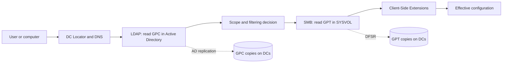
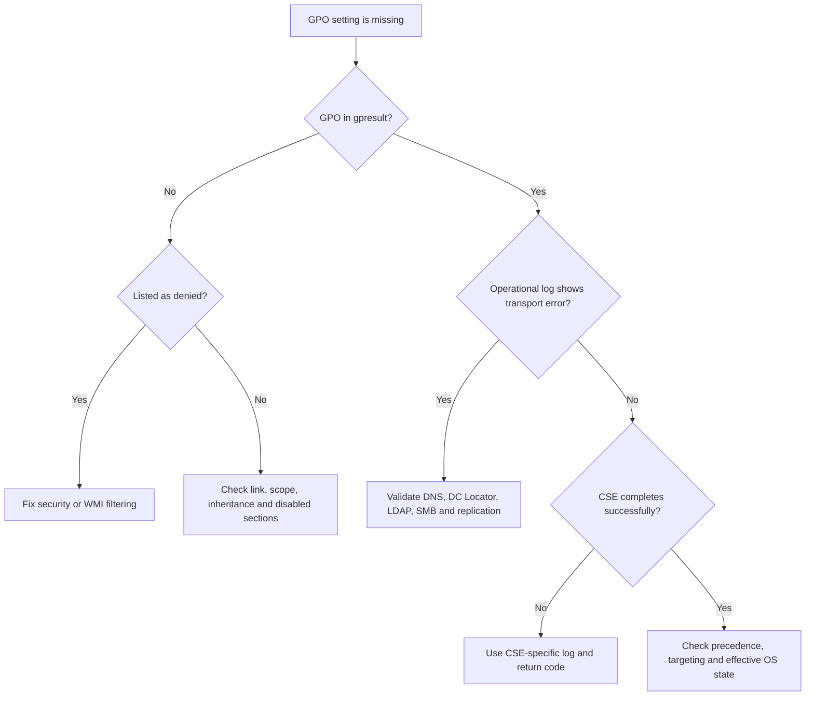

# Group Policy Troubleshooting: From `gpresult` to the Actual Root Cause

**"The GPO is not applying" is a symptom, not a diagnosis.**

A policy can be out of scope, denied by security filtering, missing from SYSVOL, inconsistent between Active Directory and DFSR, or selected correctly before failing inside a Client-Side Extension (CSE). Running `gpupdate /force` repeatedly does not distinguish any of those cases. It only gives the failure another lap.

> 🎯 **TL;DR**
>
> 1. Reproduce the issue in the correct **user or computer context**.
> 2. Use `gpresult` to determine whether the GPO was **applied, denied, or absent**.
> 3. Find the processing instance's **Activity ID** and follow it through the Group Policy Operational log.
> 4. Identify the failed layer: **scope, DC discovery, LDAP/GPC, SMB/GPT, replication, or CSE**.
> 5. Enable GPSvc debug logging only when the normal evidence does not explain the failure.

---

## 🧭 1 — Use the Right Mental Model

A domain GPO is not one indivisible object. It has two coordinated halves:

| Component | Location | Retrieved with | Replicated by | Typical content |
|---|---|---|---|---|
| **Group Policy Container (GPC)** | `CN={GPO-GUID},CN=Policies,CN=System,<domain DN>` | LDAP | Active Directory replication | Version, status, extensions, security descriptor, WMI filter reference |
| **Group Policy Template (GPT)** | `\\<domain>\SYSVOL\<domain>\Policies\{GPO-GUID}` | SMB | DFSR | `gpt.ini`, registry policy, scripts, security templates, preference XML files |

The client first discovers a domain controller, evaluates the GPO metadata in Active Directory, then reads the corresponding files from SYSVOL. Finally, one or more CSEs interpret those files and apply the settings.



This immediately gives us six different questions:

1. Did the client find the right DC?
2. Could it read the GPC through LDAP?
3. Was the GPO in scope and allowed to apply?
4. Could it read the GPT through SMB?
5. Were the GPC and GPT consistent on that DC?
6. Did the responsible CSE complete successfully?

> 🧠 **A useful split:** if the GPO does not appear in the applied or denied lists, investigate **scope and discovery**. If it appears as applied but the setting is absent, investigate the **CSE and the effective configuration**.

---

## 🔎 2 — Define the Failing Processing Instance

Before collecting logs, pin down the context. Group Policy processing is not a single global event.

| Question | Why it matters |
|---|---|
| Is this a **user** or **computer** setting? | They use different security principals, scopes and processing times. |
| Did it fail at **startup/logon** or during a background refresh? | Some extensions only process in the foreground. |
| Which user and computer reproduced the issue? | RSoP is specific to that pair. |
| Which DC serviced the client? | The problem might exist on one AD or SYSVOL replica only. |
| Is the GPO absent, denied, applied, or applied with a failed extension? | Each state sends the investigation down a different path. |

Start with the client that actually experiences the problem:

```powershell
# Current computer and user context
whoami
hostname

# DC selected for the current logon session
$env:LOGONSERVER

# Discover a DC for the domain again
nltest.exe /dsgetdc:contoso.com /force
```

Do not begin by editing the GPO, unlinking it, restarting every DC, or deleting `Registry.pol`. Those actions alter the evidence before we know which layer failed. Configuration roulette is not troubleshooting.

---

## 📋 3 — Start with Resultant Set of Policy

Generate the report **on the affected computer**, in the affected context:

```powershell
# Fast summary
gpresult.exe /r

# Computer-side processing only
gpresult.exe /r /scope:computer

# Full HTML report for the current user and computer
gpresult.exe /h "$env:TEMP\GPResult.html" /f
```

The PowerShell equivalent can generate HTML or XML:

```powershell
Get-GPResultantSetOfPolicy `
    -ReportType Html `
    -Path "$env:TEMP\GPResult.html"
```

Inspect four things:

1. **Applied Group Policy Objects** — the GPO reached the processing list.
2. **Denied Group Policy Objects** — read the reason, not just the name.
3. **Security groups** — confirm the user or computer token contains the expected group.
4. **Last Group Policy application and DC name** — identify the exact processing attempt and replica.

### 3.1 — What the result means

| Observation | Most likely investigation |
|---|---|
| GPO is listed as **Denied: Security** | Security filtering, Read permission, Apply Group Policy permission, group membership/token |
| GPO is listed as **Denied: WMI Filter** | Query result, namespace, permissions, timeout, unsupported class |
| GPO is not listed at all | Link, OU/site/domain scope, inheritance, disabled link/GPO section, wrong user/computer context |
| GPO is applied but one setting is missing | CSE, precedence, unsupported setting, item-level targeting, foreground-only processing |
| No domain GPOs appear | DC discovery, DNS, secure channel, LDAP/SMB connectivity, authentication |

> 🔵 **Important:** RSoP is the fastest classifier, but it is not the full execution trace. An "applied" GPO means that it entered processing; it does not prove that every extension successfully materialized every setting.

---

## 🧬 4 — Validate Scope Before Chasing Transport

A technically healthy GPO still does nothing when it is linked to the wrong place or filtered out.

### 4.1 — Link, inheritance and precedence

```powershell
Import-Module GroupPolicy

$targetOu = 'OU=Workstations,DC=contoso,DC=com'
Get-GPInheritance -Target $targetOu
```

Check:

- whether the GPO is linked to the site, domain or OU containing the target;
- whether the link is enabled;
- whether the relevant user/computer half of the GPO is enabled;
- Block Inheritance and Enforced links;
- link order and another GPO configuring the same setting later;
- loopback processing when user settings depend on the computer's OU.

For the processing model itself, see [Active Directory Design Guidelines](<../Concepts/Active Directory Design Guidelines (Architecture Overview).md#-9--group-policy-strategy>).

### 4.2 — Security filtering

```powershell
Get-GPPermission -Name 'C-Workstations-Security-Baseline' -All |
    Sort-Object Trustee |
    Format-Table Trustee, Permission, Inherited
```

The target needs both:

- **Read** on the GPO;
- **Apply Group Policy**.

For a user GPO, remember the post-MS16-072 behavior: the computer account also needs to read the GPO. Removing `Authenticated Users` entirely and granting only a user group **Apply** permission is a classic way to create a policy that looks correctly filtered but cannot be retrieved by the machine.

Also remember that changing group membership does not rewrite an existing logon token. Sign out/in for a user token or restart the computer for a computer token before concluding that filtering is broken.

### 4.3 — WMI filters

Test the filter locally in the same namespace and architecture used by the target. A query can be valid and still return no rows.

```powershell
# Example only: test the logic represented by the WMI filter
Get-CimInstance -Namespace root\cimv2 -ClassName Win32_OperatingSystem |
    Select-Object Caption, Version, ProductType
```

A slow WMI provider can also cause the filter to time out. Do not treat `False` and `Timed out` as the same diagnosis.

---

## 🧾 5 — Follow the Activity ID

Windows assigns a unique **Activity ID** to each Group Policy processing instance. This is the cleanest way to separate one user logon from a background refresh or another concurrent session.

### 5.1 — Find the processing instance

1. Open **Event Viewer** on the affected client.
2. Go to **Windows Logs → System**.
3. Open the Group Policy warning or error associated with the reproduction.
4. In **Details**, locate `ActivityID` under `System/Correlation`.

Then query the dedicated log:

```powershell
$activityId = '{00000000-0000-0000-0000-000000000000}' # Replace with the real ID
$logName = 'Microsoft-Windows-GroupPolicy/Operational'

Get-WinEvent -LogName $logName -FilterXPath `
    "*[System/Correlation/@ActivityID='$activityId']" |
    Sort-Object TimeCreated |
    Select-Object TimeCreated, Id, LevelDisplayName, Message
```

The trace exposes three broad phases:

1. **Pre-processing** — DC discovery, network state, user/computer identity and GPO list.
2. **Processing** — each CSE starts, processes its settings and returns a status.
3. **Post-processing** — overall completion, elapsed time and final status.

> ⚠️ **A new refresh means a new Activity ID.** After `gpupdate`, do not keep filtering on the previous GUID and wonder why the log stopped moving.

### 5.2 — Useful CSE events

| Event | Meaning |
|---|---|
| **4016** | A Client-Side Extension started processing. |
| **5016** | A Client-Side Extension completed processing. Inspect its elapsed time and return code. |

The CSE name tells you where to continue: Registry, Security, Scripts, Folder Redirection, Group Policy Preferences, Advanced Audit Policy, and so on.

> 🟡 **Do not misdiagnose AuditCSE.** Return value `0x8000000A` (`E_PENDING`) can be expected: the extension successfully started asynchronous processing. Correlate it with `Microsoft-Windows-Security-Audit-Configuration-Client/Operational` before declaring failure.

---

## 🌐 6 — Validate DC Discovery and Transport

Group Policy depends on DNS, Kerberos, LDAP and SMB. "The network works" is not enough evidence.

### 6.1 — DC Locator and DNS

```powershell
$domain = 'contoso.com'

Resolve-DnsName "_ldap._tcp.dc._msdcs.$domain" -Type SRV
nltest.exe /dsgetdc:$domain /force
nltest.exe /sc_verify:$domain
```

Confirm that the client uses the domain DNS service, maps to the correct AD site, and can establish a secure channel. A public DNS resolver might resolve internet names perfectly while knowing absolutely nothing about `_ldap._tcp.dc._msdcs`.

### 6.2 — LDAP and SMB

Test the exact DC recorded in the event or RSoP report:

```powershell
$dc = 'DC01.contoso.com'

Test-NetConnection $dc -Port 389 # LDAP: GPC
Test-NetConnection $dc -Port 445 # SMB: GPT in SYSVOL

Get-ChildItem "\\$dc\SYSVOL\contoso.com\Policies" -ErrorAction Stop |
    Select-Object -First 5 Name
```

For an event 1058, build the precise path from the GPO GUID and test `gpt.ini`:

```powershell
$gpoGuid = '{31B2F340-016D-11D2-945F-00C04FB984F9}'
$gptIni = "\\$dc\SYSVOL\contoso.com\Policies\$gpoGuid\gpt.ini"

Get-Content $gptIni -ErrorAction Stop
```

Run the access test in the failing security context whenever possible. An administrator successfully opening SYSVOL does not prove that the affected user or computer can read the same path.

---

## 🔄 7 — Detect a GPC/GPT or Replication Problem

Because the two halves use different replication engines, a GPO can be current in Active Directory but stale or absent in SYSVOL on one DC.

### 7.1 — Compare the client-selected DC with another DC

```powershell
$domain = 'contoso.com'
$gpoGuid = '{YOUR-GPO-GUID}'
$dcs = 'DC01.contoso.com', 'DC02.contoso.com'

foreach ($dc in $dcs) {
    $path = "\\$dc\SYSVOL\$domain\Policies\$gpoGuid\gpt.ini"
    [pscustomobject]@{
        DC      = $dc
        Exists  = Test-Path $path
        Version = if (Test-Path $path) {
            (Select-String -Path $path -Pattern '^Version=').Line
        }
    }
}
```

Then verify both replication systems:

```powershell
repadmin.exe /replsummary
repadmin.exe /showrepl * /errorsonly
dfsrdiag.exe replicationstate
```

Typical evidence of a split GPO:

- the GPC exists but the corresponding SYSVOL folder does not;
- `gpt.ini` differs between DCs;
- GPMC reports an AD/SYSVOL version mismatch;
- the problem follows whichever DC services the client;
- AD replication is healthy while DFSR is not, or vice versa.

Do not repair this by copying random policy folders between DCs. Diagnose DFSR first. For SYSVOL recovery mechanics, see [DFSR - Authoritative and Non-Authoritative restore](<./DFSR - Authoritative and Non-Authoritative restore.md>).

---

## 🧩 8 — When the GPO Applies but the Setting Does Not

At this point, the GPO appears in the applied list and its GPC/GPT are readable. The remaining question is what happened inside the extension.

### 8.1 — Identify the responsible CSE

Installed CSE registrations are visible here:

```powershell
$csePath = 'HKLM:\SOFTWARE\Microsoft\Windows NT\CurrentVersion\Winlogon\GPExtensions'

Get-ChildItem $csePath | ForEach-Object {
    $properties = Get-ItemProperty $_.PSPath
    [pscustomobject]@{
        Guid        = $_.PSChildName
        DisplayName = $properties.'(default)'
        DllName     = $properties.DllName
    }
} | Format-Table -AutoSize
```

Prefer the CSE name recorded in events 4016/5016 over a static GUID list copied from an old operating system. Extensions change; evidence from the affected machine wins.

### 8.2 — Check the extension-specific log

Examples include:

| Setting family | Additional evidence |
|---|---|
| Advanced Audit Policy | `Microsoft-Windows-Security-Audit-Configuration-Client/Operational` |
| Group Policy Preferences | Group Policy Operational event plus the relevant preference XML in the GPT |
| Scripts | Script path, execution policy, working directory and script-specific output |
| Folder Redirection | Folder Redirection Operational events and target share access |
| Security settings | Group Policy Operational events and local security policy result |

Also verify the **effective state** using the product's native command. A registry preference should be checked in the registry; a firewall rule with `Get-NetFirewallRule`; an audit setting with `auditpol.exe /get /category:*`. A green GPO report is not the same thing as a configured operating system.

---

## 🪵 9 — Escalate to GPSvc Debug Logging

The Operational log normally gives enough direction. Enable GPSvc logging when it does not, especially for ordering, access or CSE handoff problems.

```powershell
$diagnosticsPath = 'HKLM:\SOFTWARE\Microsoft\Windows NT\CurrentVersion\Diagnostics'
$logDirectory = Join-Path $env:windir 'debug\usermode'

New-Item -Path $diagnosticsPath -Force | Out-Null
New-Item -Path $logDirectory -ItemType Directory -Force | Out-Null

New-ItemProperty `
    -Path $diagnosticsPath `
    -Name 'GPSvcDebugLevel' `
    -PropertyType DWord `
    -Value 0x00030002 `
    -Force | Out-Null

gpupdate.exe /force
```

The log is written to:

```text
%windir%\debug\usermode\gpsvc.log
```


Correlate timestamps with the Activity ID trace and search for:

- the user/computer SID and processing mode;
- the selected domain controller;
- GPO GUIDs;
- LDAP or SYSVOL access failures;
- CSE start/end and return codes;
- elapsed time and timeout indicators.

Disable verbose logging after reproducing the issue:

```powershell
New-ItemProperty `
    -Path 'HKLM:\SOFTWARE\Microsoft\Windows NT\CurrentVersion\Diagnostics' `
    -Name 'GPSvcDebugLevel' `
    -PropertyType DWord `
    -Value 0 `
    -Force | Out-Null
```

> 🟡 **GPSvc logging is not a permanent monitoring feature.** It is verbose, consumes disk space and becomes harder to interpret when left running across unrelated processing cycles.

---

## 🚨 10 — Common Events Without Guesswork

The event ID identifies the stage; the associated error code and path identify the cause.

| Event | What failed | First evidence to collect |
|---|---|---|
| **1006** | LDAP bind to Active Directory | Error code, DC name, credentials/secure channel, port 389 |
| **1030** | Retrieval of Group Policy information | DNS, LDAP, GPC permissions, DC used |
| **1053** | User/computer name resolution | Error code, DNS, AD replication, object permissions |
| **1058** | Reading policy files from SYSVOL | Exact `gpt.ini` path, SMB access, DFSR state, error code |
| **1097** | Computer account could not be determined/authenticated | Secure channel, time, computer account, Kerberos |
| **1129** | No DC/network connectivity for policy processing | DC Locator, DNS SRV records, LDAP TCP handshake |
| **4016/5016** | CSE start/completion | CSE name, return code, extension-specific log |

Useful error-code translations:

| Code | Meaning | Typical direction |
|---|---|---|
| `3` | Path not found | Wrong/missing GPT path or replication gap |
| `5` | Access denied | GPO, SYSVOL or target-resource permissions |
| `49` | Invalid LDAP credentials | Expired/stale credentials, service account context |
| `53` | Network path not found | DNS, SMB, DFS client, firewall |
| `258` | Timeout | DNS, unreachable DC, slow dependency |
| `525` | User not found | AD replication, wrong domain/DC, deleted object |
| `1355` | Domain unavailable | DNS/DC Locator/connectivity |
| `1727` | RPC call failed | Firewall, network path, remote service |

> 🔴 **Never troubleshoot an event ID without its error code.** Event 1058 with code 5 and event 1058 with code 53 share a headline and have different root causes.

---

## 📦 11 — Collect Evidence Before Changing the Environment

The following creates a small evidence pack on the affected client. Run it from an elevated Windows PowerShell session.

```powershell
$timestamp = Get-Date -Format 'yyyyMMdd-HHmmss'
$output = Join-Path $env:TEMP "GPO-Troubleshooting-$timestamp"
New-Item -Path $output -ItemType Directory -Force | Out-Null

gpresult.exe /h "$output\GPResult.html" /f
gpresult.exe /r > "$output\GPResult.txt"

wevtutil.exe epl System "$output\System.evtx" /ow:true
wevtutil.exe epl Application "$output\Application.evtx" /ow:true
wevtutil.exe epl Microsoft-Windows-GroupPolicy/Operational `
    "$output\GroupPolicy-Operational.evtx" /ow:true

reg.exe export `
    'HKLM\SOFTWARE\Microsoft\Windows NT\CurrentVersion\Winlogon\GPExtensions' `
    "$output\GPExtensions.reg" /y

$gpsvcLog = Join-Path $env:windir 'debug\usermode\gpsvc.log'
if (Test-Path $gpsvcLog) {
    Copy-Item $gpsvcLog $output
}

Compress-Archive -Path "$output\*" -DestinationPath "$output.zip" -Force
Write-Host "Evidence pack: $output.zip"
```

Review the archive before sharing it. RSoP, event logs and GPSvc logs can contain user names, computer names, domain names, UNC paths and policy configuration.

For deep or intermittent cases, Microsoft's TroubleShootingScript (TSS) toolkit currently provides:

```powershell
# On the affected client
.\TSS.ps1 -Scenario ADS_AuthEx

# On a domain controller, when DC-side data is required
.\TSS.ps1 -Scenario ADS_Auth
```

TSS is an escalation collector, not the first diagnostic step. Start with the processing instance and its Activity ID; collect the larger dataset when the smaller evidence does not close the case.

---

## ✅ 12 — Prove the Fix

After correcting the root cause:

1. Trigger only the scope you need:

```powershell
gpupdate.exe /target:computer /force
# or
gpupdate.exe /target:user /force
```

2. Capture the **new** Activity ID.
3. Confirm the GPO is applied and no longer denied.
4. Confirm the relevant CSE completes successfully.
5. Verify the actual setting on the operating system.
6. If the issue was replica-specific, repeat against another DC or wait for proven convergence.
7. Disable temporary GPSvc logging and remove transient diagnostic settings.

### Decision tree



The endpoint is not "`gpupdate` returned successfully." The endpoint is **the intended setting is effective, the relevant processing trace is clean, and the result is reproducible**.

---

## 🔗 Related Articles

- [Active Directory Design Guidelines — Group Policy Strategy](<../Concepts/Active Directory Design Guidelines (Architecture Overview).md#-9--group-policy-strategy>)
- [Restore Default Domain Policies](<./Restore Default Domain Policies.md>)
- [DFSR - Authoritative and Non-Authoritative restore](<./DFSR - Authoritative and Non-Authoritative restore.md>)
- [GPO Permissions - Add Administrators Full Control](<../Hardening/GPO Permissions - Add Administrators Full Control/GPO Permissions - Add Administrators Full Control.md>)
- [Dangerous ACLs expose GPOs applied to privileged group members](<../Hardening/Dangerous ACLs expose GPOs applied to privileged group members (attack path).md>)

## 📚 References

- [Applying Group Policy troubleshooting guidance](https://learn.microsoft.com/en-us/troubleshoot/windows-server/group-policy/applying-group-policy-troubleshooting-guidance)
- [Group Policy processing for Windows](https://learn.microsoft.com/en-us/windows-server/identity/ad-ds/manage/group-policy/group-policy-processing)
- [`gpresult` command reference](https://learn.microsoft.com/en-us/windows-server/administration/windows-commands/gpresult)
- [`Get-GPResultantSetOfPolicy`](https://learn.microsoft.com/en-us/powershell/module/grouppolicy/get-gpresultantsetofpolicy)
- [Collect data to analyze Group Policy scenarios with TSS](https://learn.microsoft.com/en-us/troubleshoot/windows-client/windows-tss/collect-data-analyze-troubleshoot-group-policy-scenarios)
