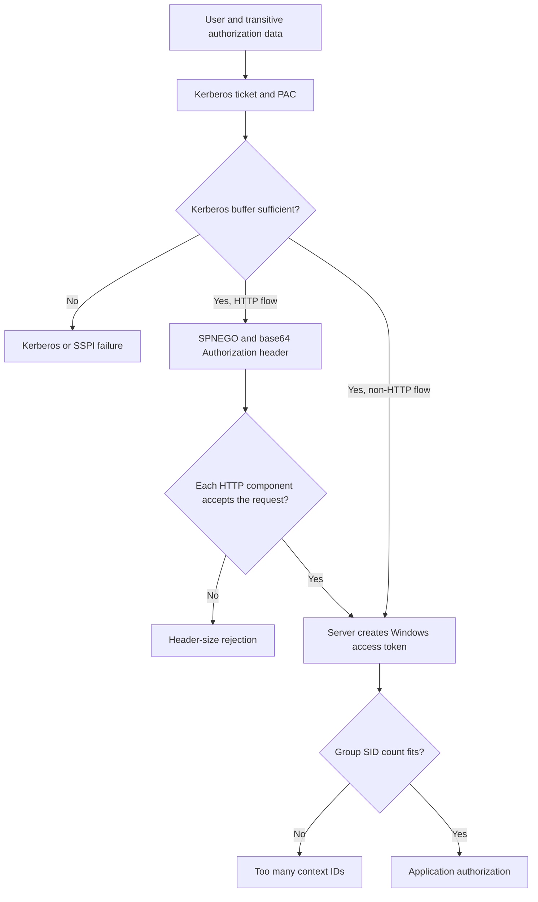

# Kerberos Token Bloat: PAC Size, MaxTokenSize and HTTP Limits

**"The user belongs to too many groups" can describe three different failures.** A Kerberos authentication buffer can be too small, Windows can fail to construct an access token with too many SIDs, or an HTTP component can reject the encoded authentication header. Increasing one limit does not fix the other two.

This guide focuses on Windows Server 2022 and 2025. The old 12,000-byte Kerberos default is not the baseline for these systems: Windows Server 2012 and later use a default `MaxTokenSize` of **48,000 bytes**.

> **TL;DR**
>
> - PAC authorization data, a Windows access token and an HTTP Authorization header are related but different structures.
> - `MaxTokenSize` is a Kerberos authentication-buffer setting measured in bytes, not a group-count allowance.
> - The Windows access-token group-SID limit is independent of Kerberos versus NTLM. `STATUS_TOO_MANY_CONTEXT_IDS` is not repaired by increasing `MaxTokenSize`.
> - HTTP base64 encoding increases the authentication blob's size; proxies and servers can impose separate per-field and total-header limits.
> - Direct group membership and a formula are useful clues, not measurements of every resource-specific token.
> - Reduce unnecessary authorization data first. Change a limit only after proving which component rejected the operation.

## 1. Identify the failing boundary



The PAC carries authorization information in a Kerberos ticket; it is not a serialized copy of every final local token on every server. Resource-domain groups, server-local groups, claims, SID filtering and the logon context can affect the resulting authorization state.

| Evidence | Primary investigation |
|---|---|
| `0xC000015A` / `STATUS_TOO_MANY_CONTEXT_IDS` | Windows access-token SID limit |
| Kerberos/SSPI buffer errors tied to a large authentication exchange | Effective Kerberos buffer, ticket data and participating systems |
| HTTP 400/431 or a documented request-header-too-long reason | The rejecting proxy, HTTP stack or server's field/aggregate limit |
| Ticket issued and accepted, then application access denied | Authorization or application-specific limits, not automatically token bloat |
| Only one resource domain or server fails | Resource-domain/local group expansion and that server's configuration |

Record the affected user, source client, exact resource name, protocol, failure time and one known-good comparison. Do not diagnose token bloat from HTTP status 400 alone: malformed requests, cookies and unrelated headers can cause similar errors.

## 2. Read the Kerberos configuration accurately

The relevant registry location is:

```text
HKLM\SYSTEM\CurrentControlSet\Control\Lsa\Kerberos\Parameters
    MaxTokenSize (REG_DWORD, bytes)
```

| Operating system generation | Default when no explicit override applies |
|---|---:|
| Windows Server 2008 R2 / Windows 7 and earlier documented versions | 12,000 bytes |
| Windows Server 2012 / Windows 8 and later | 48,000 bytes |

48,000 decimal bytes is not 48 KiB. Writing 48,000 on a current machine already using that default is not an increase, and an absent value is not evidence that the old 12,000-byte limit applies.

Use the following read-only helper to preserve the distinction between absent configuration and failed collection. It reports only the specified local values and does not expand an absent value into an assumed effective policy:

```powershell
function Get-OptionalRegistryValues {
    [CmdletBinding()]
    param(
        [Parameter(Mandatory)][string]$Path,
        [Parameter(Mandatory)][string[]]$Names
    )

    $registryKey = $null
    try {
        try {
            $registryKey = Get-Item -LiteralPath $Path -ErrorAction Stop
        } catch [System.Management.Automation.ItemNotFoundException] {
            foreach ($name in $Names) {
                [pscustomobject]@{ Path=$Path; Name=$name; Present=$false; Value=$null; Kind=$null }
            }
            return
        }
        $presentNames = @($registryKey.GetValueNames())
        foreach ($name in $Names) {
            $present = $presentNames -contains $name
            [pscustomobject]@{
                Path = $Path
                Name = $name
                Present = $present
                Value = if ($present) { $registryKey.GetValue($name) } else { $null }
                Kind = if ($present) { [string]$registryKey.GetValueKind($name) } else { $null }
            }
        }
    } finally {
        if ($null -ne $registryKey) { $registryKey.Close() }
    }
}

Get-CimInstance -ClassName Win32_OperatingSystem |
    Select-Object Caption, Version, BuildNumber

Get-OptionalRegistryValues -Path 'HKLM:\SYSTEM\CurrentControlSet\Control\Lsa\Kerberos\Parameters' `
    -Names 'MaxTokenSize'
```

Access denied and other collection failures terminate the query instead of being reported as an absent override. Check the value's type as well as its number. Compare client, front-end and back-end systems involved in the actual authentication path, not only a DC.

Group Policy can be the authoritative source for these settings. A current registry snapshot also does not prove that a setting requiring restart has taken effect in every process. Record the effective policy, build and restart history before drawing conclusions.

## 3. Do not confuse byte size with the Windows SID limit

Windows LSA builds a local access token for the logon. Microsoft documents a group-SID array limit of 1,024, with practical failures around 1,010 custom group memberships because the token also needs well-known and context-specific SIDs. The exact usable margin varies by logon type and target system.

This limit applies with both Kerberos and NTLM. More Kerberos buffer space cannot enlarge it. Nor does an estimate of 1,009 groups guarantee a valid token: transitive membership, SIDHistory and target-local additions matter.

Inspect an existing session in the affected context:

```powershell
whoami.exe /user
whoami.exe /groups
whoami.exe /all
```

These commands inspect the current token, not every token the same identity could receive on other servers. If the affected logon could not create a token at all, a working session elsewhere is only a comparison. Do not count lines in `whoami` and claim a complete universal SID count; some context-specific SIDs are not displayed.

For directory-side investigation, inspect a single identity and its authorization groups:

```powershell
Import-Module ActiveDirectory

$queryDc = 'dc01.corp.example'
$account = Get-ADUser -Identity 'LabUser' -Server $queryDc `
    -Properties memberOf, primaryGroupID, SIDHistory -ErrorAction Stop

$account | Select-Object ObjectGUID, SID, SamAccountName, primaryGroupID, SIDHistory

$authorizationGroups = @(Get-ADAccountAuthorizationGroup -Identity $account `
    -Server $queryDc -ErrorAction Stop)

$authorizationGroups | Select-Object Name, SID, GroupScope, DistinguishedName |
    Sort-Object GroupScope, Name
```

`memberOf` alone omits nested membership and does not represent the primary-group relationship. The authorization-group query provides more context but is still not a byte measurement or a complete resource-server-local token. Resolve collection/GC availability errors instead of interpreting them as zero groups.

For difficult cross-domain cases, Microsoft's group membership evaluation guidance covers account-domain, Global Catalog and resource-domain inputs. Also inspect local groups on the particular failing resource server. Do not assume the same user's token has the same SID set everywhere.

## 4. Understand what increases PAC size

Potential contributors include transitive security groups, SIDHistory on users and groups, cross-domain group relationships, resource groups, user/device claims and delegation-related data. Resource SID compression and the precise ticket type change the space required.

Microsoft's historical estimate, `1200 + 40*d + 8*s`, can help explain why different SID categories have different costs. It is **not an exact serialized-ticket measurement** and does not replace observed evidence, especially when claims, compression and delegation are involved.

Do not multiply a direct `memberOf` count by one constant and publish the result as the exact token size. Likewise, increasing ticket lifetime does not reduce its authorization-data size; it changes how long credentials remain usable.

The KDC policy **Computer Configuration > Administrative Templates > System > KDC > Warning for large Kerberos tickets** can produce warning event 31 when configured and the threshold is exceeded. A warning threshold is not itself a hard authentication limit, and no event is not proof of a small ticket if the policy, provider or retention did not cover the request.

## 5. Account for HTTP encoding and every intermediary

An HTTP `Authorization: Negotiate ...` header carries an encoded authentication blob. Its size includes more than the PAC, and the HTTP request contains other headers and a request line. Base64 expands a binary blob of `n` bytes to `4 * ceil(n / 3)` characters.

This small calculation reports only the encoded blob plus the `Negotiate ` value prefix. Supply a measured **complete authentication-blob size**, not a group count or just the PAC size:

```powershell
function Get-NegotiateHeaderBudget {
    [CmdletBinding()]
    param([Parameter(Mandatory)][ValidateRange(0, 1048576)][int]$BlobBytes)

    $base64Characters = [long](4 * [math]::Ceiling($BlobBytes / 3.0))
    [pscustomobject]@{
        BlobBytes = $BlobBytes
        Base64Characters = $base64Characters
        AuthorizationValueBytes = $base64Characters + [Text.Encoding]::ASCII.GetByteCount('Negotiate ')
    }
}

Get-NegotiateHeaderBudget -BlobBytes 48000
```

The example yields 64,000 base64 characters and 64,010 bytes for that header value. It excludes the header name, separators, other fields and the request line. It is not a recommended registry value and does not assert that the actual ticket is 48,000 bytes long.

| Boundary | What to verify |
|---|---|
| Browser/client HTTP stack | Whether it sends the intended authentication blob and request |
| Reverse proxy, gateway or load balancer | Per-field and total-header limits, plus which hop performs authentication |
| HTTP.sys | `MaxFieldLength` for individual fields and `MaxRequestBytes` for the request line plus headers |
| Web server/application | Any further parsing or authentication limits |

On the Windows HTTP server, use the helper from section 2:

```powershell
Get-OptionalRegistryValues -Path 'HKLM:\SYSTEM\CurrentControlSet\Services\HTTP\Parameters' `
    -Names 'MaxFieldLength', 'MaxRequestBytes'
```

Both values can be absent while product defaults apply. Consult the exact stack/version documentation rather than interpreting absence as unlimited. The HTTP.sys settings are not the IIS maximum request-body/content-length settings, and changing them does not change a reverse proxy's limits.

Identify the rejecting hop through its logs and timing. HTTP.sys can reject a request before it reaches normal IIS/application logging, so inspect the relevant HTTP error logs as well. Preserve sizes and metadata without publishing the Authorization header, cookies or encoded ticket.

## 6. Reduce the authorization footprint deliberately

Prioritize changes with a known owner and understood access impact:

1. Find redundant or obsolete security-group membership, including nested paths.
2. Review groups that contribute many transitive memberships to otherwise unrelated workloads.
3. Assess SIDHistory dependencies against actual resource ACLs before removing migration history.
4. Remove unused authorization data through the identity/application lifecycle, not by deleting all large-account memberships.
5. Reevaluate claims and resource authorization design where those are the dominant contributors.

Changing group scope, converting security groups or deleting SIDHistory can change access. A high count is an investigation queue, not permission to run bulk removal. Do not create new domains or disable SID filtering merely to work around one large token.

After a membership change, wait for the relevant directory convergence and create fresh appropriate logon/ticket state. An existing Windows access token is not rebuilt just because an administrator removed a group in AD. Purging Kerberos tickets alone does not replace the current process token.

## 7. Change a limit only for a proven constraint

| Proven constraint | Appropriate decision |
|---|---|
| Old explicit Kerberos override below the supported current default | Reconcile it with policy and the intended supported value |
| Measured Kerberos buffer constraint remains after justified cleanup | Evaluate the documented limit across the entire flow and its compatibility implications |
| HTTP field or total-header constraint | Size that boundary with measured request data and bounded headroom |
| Windows token has too many SIDs | Reduce the applicable SID set; `MaxTokenSize` is not the repair |

Raising HTTP limits increases how much unauthenticated request data the stack can accept and buffer. Do not set every value to its maximum. Include proxy limits, memory implications, service owners and rollback criteria in the change.

Microsoft documents a computer restart for `MaxTokenSize` changes and an HTTP service restart, with dependent-service impact, for the HTTP.sys header settings. Changing a DWORD without the required lifecycle step is not a completed repair. Keep the before-state and validate effective behavior after the restart.

Do not switch an application to NTLM solely to hide an oversized Kerberos header. That can break delegation and reintroduce a protocol dependency while leaving the underlying group/SID problem unresolved.

## 8. Verify the same user and path

Retest the originally failing user, client, URL/service and target after the controlled change. Compare a previously healthy account too. Verify:

- fresh relevant tickets and logon context;
- the protocol actually selected, without relying on a cached application session;
- the rejecting component's logs and measured sizes;
- successful application authorization;
- alternate nodes and proxy/failover paths;
- that unnecessary membership or configuration does not return through automation.

Keep the distinction in the incident report: **Kerberos buffer repaired**, **HTTP header limit adjusted**, or **access-token SID count reduced**. Those are different claims, with different evidence.

## References

- [Kerberos authentication problems when a user belongs to many groups](https://learn.microsoft.com/en-us/troubleshoot/windows-server/windows-security/kerberos-authentication-problems-if-user-belongs-to-groups)
- [Windows access-token SID limit and STATUS_TOO_MANY_CONTEXT_IDS](https://learn.microsoft.com/en-us/troubleshoot/windows-server/windows-security/logging-on-user-account-fails)
- [HTTP 400 request-header-too-long with Kerberos](https://learn.microsoft.com/en-us/troubleshoot/developer/webapps/iis/www-authentication-authorization/http-bad-request-response-kerberos)
- [Get-ADAccountAuthorizationGroup](https://learn.microsoft.com/en-us/powershell/module/activedirectory/get-adaccountauthorizationgroup)
- [Troubleshooting Kerberos Authentication](Troubleshooting%20Kerberos%20Authentication%20-%20SPNs,%20Tickets,%20Error%20Codes%20and%20NTLM%20Fallback.md)
- [Windows Interactive Logon](../Concepts/Windows%20Interactive%20Logon%20-%20From%20Credential%20Provider%20to%20Kerberos%20Ticket%20Cache.md)