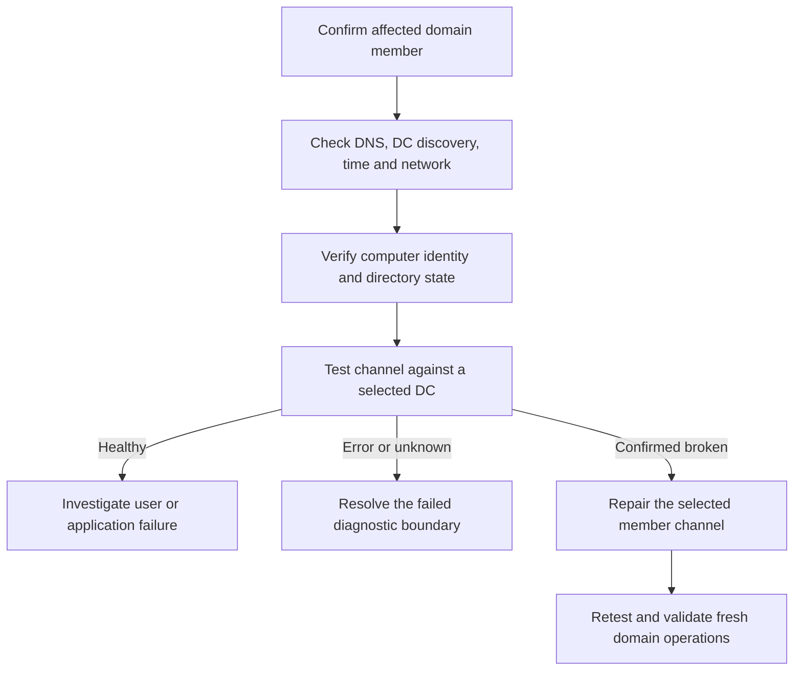

# Repairing a Broken Domain Secure Channel: Machine Passwords and Trust Relationship Failures

**A failed domain logon is not proof that the computer must leave and rejoin the domain.**

A domain-joined member maintains a machine-account secret locally and a corresponding computer account in AD. Netlogon uses that relationship for the secure channel. A secret mismatch is one possible failure; DNS, DC availability, time, account state and replication can produce overlapping symptoms.

This guide covers Windows workstations and Windows Server 2022/2025 **member servers**. A domain controller requires a different recovery procedure.

> **TL;DR**
> - Identify the affected member and the actual DC before changing the machine password.
> - Thirty days offline does not automatically expire a member's trust secret in AD.
> - Check discovery, connectivity, time and the computer object's identity/state.
> - Use one supported repair method, then verify against the selected DC.
> - Do not run the member repair on a DC or hide failed verification with repeated resets.

## 1. Understand what the password age means

By default, a domain member initiates a machine-account password change approximately every 30 days. The **Domain member: Maximum machine account password age** policy controls when the member submits a change; it is not an AD-side countdown that automatically invalidates every offline computer after that interval.

A long offline period can coincide with account cleanup, disablement, deletion/recreation, restored images or directory changes. Investigate those facts rather than treating elapsed time alone as the cause.

Typical mismatch scenarios include restoring an old member image, using improperly duplicated machine identities, resetting/reusing the AD computer account independently of the member, or directory recovery/replication problems. Disabling machine-password rotation or setting a very large age masks the lifecycle issue and increases credential exposure.

## 2. Confirm the role and preserve access

On the affected computer, use an elevated session reachable without depending solely on the broken domain logon, such as an established local-administration recovery path:

```powershell
$computer = Get-CimInstance Win32_ComputerSystem -ErrorAction Stop
$computer | Select-Object Name, Domain, PartOfDomain, DomainRole

if (-not $computer.PartOfDomain) { throw 'The computer is not currently domain joined.' }
if ($computer.DomainRole -ge 4) { throw 'Use a domain-controller-specific recovery procedure.' }

Get-CimInstance Win32_OperatingSystem |
    Select-Object Caption, Version, BuildNumber
Get-Service -Name Netlogon -ErrorAction Stop |
    Select-Object Name, Status, StartType
```

Do not remove domain membership first and only then discover that no usable local administration path exists. Do not delete the computer object as a routine repair step; its GUID/SID, memberships, delegated permissions and dependent services can matter.



## 3. Check discovery and time before resetting anything

Use the affected member's actual domain name:

```powershell
$domainName = $computer.Domain
Resolve-DnsName -Name ("_ldap._tcp.dc._msdcs.{0}" -f $domainName) `
    -Type SRV -ErrorAction Stop

nltest.exe "/dsgetdc:$domainName"
if ($LASTEXITCODE -ne 0) { throw 'DC discovery failed; investigate DNS and connectivity first.' }

w32tm.exe /query /status
if ($LASTEXITCODE -ne 0) { throw 'Could not establish the local time-service state.' }
```

Verify the member uses DNS servers that can resolve the AD namespace, that the returned DC belongs to the intended domain, and that the required Netlogon/RPC/Kerberos paths work. A ping response or successful TCP 389 connection is not the complete secure-channel test.

Use [Planning Active Directory RPC Ports](../How-to/Planning%20Active%20Directory%20RPC%20Ports%20-%20Dynamic%20Ranges,%20NTDS,%20Netlogon%20and%20DFSR.md) for network boundaries and [Windows Time in Active Directory](../How-to/Windows%20Time%20in%20Active%20Directory%20-%20Forest-Root%20PDC,%20Domain%20Hierarchy%20and%20Verification.md) for synchronization evidence.

## 4. Test against an explicitly selected DC

After selecting a reachable, appropriate DC in the member's domain:

```powershell
$domainController = 'dc01.corp.example'
Test-ComputerSecureChannel -Server $domainController -Verbose -ErrorAction Stop
```

`True` means the tested member channel works for that path. It does not prove the user's password, logon rights, Kerberos service ticket or application permissions are correct. `False` warrants investigation; a thrown error is not interchangeable with `False`.

Microsoft explicitly limits `Test-ComputerSecureChannel` to domain members. It can report misleading failures on DCs. Do not turn a DC result into a reason to run `-Repair` there.

## 5. Compare the computer object where necessary

From an AD management host with directory-read access, inspect the same computer on the relevant DCs:

```powershell
Import-Module ActiveDirectory -ErrorAction Stop
$computerName = 'MEMBER01'
$controllers = 'dc01.corp.example', 'dc02.corp.example'

foreach ($controller in $controllers) {
    try {
        $account = Get-ADComputer -Identity $computerName -Server $controller `
            -Properties PasswordLastSet -ErrorAction Stop
        [pscustomobject]@{
            DC = $controller
            State = 'Read'
            ObjectGUID = $account.ObjectGUID
            SID = $account.SID
            Enabled = $account.Enabled
            PasswordLastSet = $account.PasswordLastSet
            QueryError = $null
        }
    } catch {
        [pscustomobject]@{
            DC = $controller
            State = 'Unknown'
            ObjectGUID = $null
            SID = $null
            Enabled = $null
            PasswordLastSet = $null
            QueryError = $_.Exception.Message
        }
    }
}
```

A query failure remains unknown; do not label it an absent computer. Compare GUID/SID, enabled state, recent account operations and replication evidence. `PasswordLastSet` is useful metadata, not a way to read or prove equality of the actual secrets.

If the account was deleted/recreated, the issue includes identity continuity and dependent permissions. If only one DC has an unexpected view, use [Troubleshooting Active Directory Replication](Troubleshooting%20Active%20Directory%20Replication%20-%20repadmin,%20dcdiag,%20DNS,%20RPC,%20Time%20and%20Kerberos.md) before repeatedly resetting passwords against different replicas.

## 6. Repair the member with explicit credentials and verification

Repair needs local administrative execution and an appropriate domain identity with permission to perform the computer-account operation. Use delegated rights where possible. Enter credentials interactively in the administrative session; do not embed passwords in command lines, scripts, transcripts or ticket attachments.

The wrapper below refuses DCs/workgroup machines, preserves an indeterminate diagnostic result, and includes a real post-repair test. `ShouldProcess` controls the only mutation:

```powershell
function Repair-MemberSecureChannel {
    [CmdletBinding(SupportsShouldProcess, ConfirmImpact = 'High')]
    param(
        [Parameter(Mandatory)][ValidateNotNullOrEmpty()][string]$DomainController,
        [Parameter(Mandatory)][pscredential]$Credential
    )

    $computer = Get-CimInstance Win32_ComputerSystem -ErrorAction Stop
    if (-not $computer.PartOfDomain -or $computer.DomainRole -ge 4) {
        throw 'This repair is only for domain-joined member computers, not domain controllers.'
    }

    $before = Test-ComputerSecureChannel -Server $DomainController -ErrorAction Stop
    if ($before -isnot [bool]) { throw 'The channel test returned no definite Boolean result.' }
    $status = 'AlreadyHealthy'
    $after = $before

    if (-not $before) {
        $status = 'NotApplied'
        $after = $null
        if ($PSCmdlet.ShouldProcess("$($computer.Name) via $DomainController", 'Repair the member secure channel')) {
            $repaired = Test-ComputerSecureChannel -Repair -Server $DomainController `
                -Credential $Credential -Confirm:$false -ErrorAction Stop
            if ($repaired -isnot [bool] -or $repaired -ne $true) { throw 'The repair did not report success.' }

            $after = Test-ComputerSecureChannel -Server $DomainController -ErrorAction Stop
            if ($after -isnot [bool] -or $after -ne $true) { throw 'Repair returned success, but the new channel test failed.' }
            $status = 'RepairedAndVerified'
        }
    }

    [pscustomobject]@{
        Computer = $computer.Name
        Domain = $computer.Domain
        DomainController = $DomainController
        HealthyBefore = $before
        HealthyAfter = $after
        Status = $status
    }
}

$credential = Get-Credential -Message 'Domain identity delegated to repair this computer account'
Repair-MemberSecureChannel -DomainController $domainController `
    -Credential $credential -WhatIf
```

The preview still reads local role information and tests the channel, but does not reset it. After the preceding diagnosis identifies a repair as appropriate, invoke the wrapper without `-WhatIf` and confirm the action.

`Reset-ComputerMachinePassword` is another supported member-computer tool, not an extra command to run automatically after every repair. Choose one method and verify it. Resetting only the AD object in a GUI is not the same as reconciling the local member's secret.

## 7. Validate domain operations and replication

Retest the selected DC first. After normal directory convergence, compare another appropriate DC:

```powershell
foreach ($controller in 'dc01.corp.example', 'dc02.corp.example') {
    [pscustomobject]@{
        DomainController = $controller
        Healthy = Test-ComputerSecureChannel -Server $controller -ErrorAction Stop
    }
}
```

A repair can be followed by a replication delay. Investigate that delay instead of resetting the secret repeatedly against alternating DCs. The operation is not an atomic forest-wide change, and a verification error after mutation does not prove that the member remained untouched.

Test a fresh domain authentication and the affected resource/application. Cached interactive sign-in or a pre-existing SMB/application session is not a reliable proof of a newly repaired channel. Follow any supported restart requirement for the specific recovery path; a successful test does not automatically refresh every user or service session.

For recent member-side Netlogon evidence:

```powershell
Get-WinEvent -FilterHashtable @{
    LogName = 'System'
    ProviderName = 'NETLOGON'
    StartTime = (Get-Date).AddHours(-2)
} -MaxEvents 100 -ErrorAction Stop |
    Select-Object TimeCreated, Id, LevelDisplayName, Message
```

Correlate the messages with the exact computer/DC and operation. A no-logon-server event can be a network/discovery failure rather than proof of an incorrect machine password.

## 8. Escalate the correct problem

| Finding | Next action |
|---|---|
| Channel is healthy, user logon fails | Investigate user state, logon rights and authentication evidence |
| DNS/time/network path is broken | Repair that path before another secret reset |
| Computer object is disabled or unexpectedly replaced | Review the account lifecycle and original identity |
| One DC differs from other replicas | Investigate replication and selected-DC state |
| Repeated mismatch after restoring/cloning the member | Correct the image/deployment lifecycle |
| A DC is affected | Use the DC-specific Netlogon/Kerberos/replication recovery procedure |
| A domain rejoin is genuinely necessary | Preserve dependencies and follow current account-reuse/join-hardening rules |

Do not bypass domain-join hardening, disable machine-account password changes or weaken authentication protocols to make a broken lifecycle appear stable. Preserve the computer object's identity where the supported recovery permits it, and document any unavoidable replacement effects.

## References

- [Microsoft: Test-ComputerSecureChannel](https://learn.microsoft.com/en-us/powershell/module/microsoft.powershell.management/test-computersecurechannel?view=powershell-5.1)
- [Microsoft: Reset-ComputerMachinePassword](https://learn.microsoft.com/en-us/powershell/module/microsoft.powershell.management/reset-computermachinepassword?view=powershell-5.1)
- [Microsoft: maximum machine-account password age](https://learn.microsoft.com/en-us/windows/security/threat-protection/security-policy-settings/domain-member-maximum-machine-account-password-age)
- [Microsoft: machine-account password process](https://techcommunity.microsoft.com/blog/askds/machine-account-password-process/396026)
- [Microsoft: DC-specific machine-password reset with netdom](https://learn.microsoft.com/en-us/troubleshoot/windows-server/windows-security/use-netdom-reset-domain-controller-password)