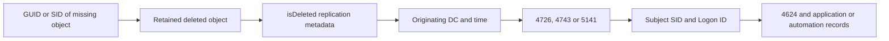

# Tracing Deleted Active Directory Objects: Events 4726 and 4743, Deleted Objects and Replication Metadata

**The Recycle Bin can retain an object; it does not retain the name of the person who deleted it.** To investigate a deletion, combine the object's identity, its replication metadata and the Security events on the DC that processed the original operation.

The workflow below uses current AD PowerShell and Windows event schemas and applies to Windows Server 2022 and 2025. It is an investigation procedure, not an object-restoration runbook.

> **TL;DR**
>
> - Prefer object GUID and SID over a display name that may have been reused.
> - `Get-ADObject -IncludeDeletedObjects` finds retained deleted objects when the caller has permission to view them.
> - The originating change to `isDeleted` can identify the DC and time, but not the actor.
> - Event 4726 records user-account deletion; 4743 records computer-account deletion; 5141 covers directory-object deletion when the required audit policy and SACL existed.
> - In deletion events, `Subject*` identifies the requesting security context; `Target*` or `Object*` identifies what was deleted.
> - Missing audit history cannot be recreated by enabling auditing after the event.

## 1. Keep three questions separate

| Question | Evidence |
|---|---|
| Which object disappeared? | GUID, SID, original RDN, last known parent and retained attributes |
| Where and when did deletion originate? | Replication metadata for the deletion transition |
| Which account requested it? | Security audit event on the originating DC |
| Which person or application used that account? | Correlated logon, automation and endpoint records |



A service-account name in the Subject fields identifies the security context used. It does not establish which human initiated an automation job or whether those credentials were misused.

First rule out a renamed or moved object, a query against the wrong domain, insufficient read permissions and replication lag. "Not visible in this console" is not equivalent to "deleted everywhere".

## 2. Audit prerequisites must predate the deletion

Configure Advanced Audit Policy through the intended DC policy, verify its effective application on every writable DC, and retain the resulting events centrally.

| Event | Audit subcategory | Additional condition |
|---|---|---|
| 4726 | Audit User Account Management, Success | For domain users, investigate the DC that processed deletion; the same event can describe local users on other computers |
| 4743 | Audit Computer Account Management, Success | Generated on a DC for computer-account deletion |
| 5141 | Audit Directory Service Changes, Success | A matching Delete audit entry in the object's effective SACL is required |

On an English-language DC, inspect the effective subcategories without changing them:

```powershell
auditpol.exe /get /subcategory:"User Account Management"
auditpol.exe /get /subcategory:"Computer Account Management"
auditpol.exe /get /subcategory:"Directory Service Changes"
```

Subcategory display names are localized. Use `auditpol /list /subcategory:* /v` to obtain local names and GUIDs on other language builds. Check that advanced subcategory policy is not being overridden by conflicting legacy category policy.

A SACL controls auditing, not permission to delete. Conversely, protection from accidental deletion is a permission control, not a substitute for audit collection. Validate the effective SACL on representative objects and the resulting events; do not assume a setting on an OU automatically covers every child.

## 3. Find the retained deleted object

Use RSAT's ActiveDirectory module and a named DC in the object's domain. Reading Deleted Objects requires appropriate permissions; a normal search permission elsewhere in the directory is not sufficient evidence of access to this container.

```powershell
Import-Module ActiveDirectory

$queryDc = 'dc01.corp.example'
$domainDn = (Get-ADRootDSE -Server $queryDc).DefaultNamingContext
$deletedContainer = "CN=Deleted Objects,$domainDn"

$candidates = @(Get-ADObject -Server $queryDc -SearchBase $deletedContainer `
    -SearchScope OneLevel -IncludeDeletedObjects `
    -LDAPFilter '(&(isDeleted=TRUE)(sAMAccountName=LabUser))' `
    -Properties objectSid, sAMAccountName, lastKnownParent, 'msDS-LastKnownRDN',
                isDeleted, isRecycled, whenChanged -ErrorAction Stop)

$candidates | Select-Object ObjectGUID, objectSid, sAMAccountName,
    lastKnownParent, 'msDS-LastKnownRDN', isDeleted, isRecycled,
    whenChanged, DistinguishedName
```

For a computer, use its actual SAM name, such as `APP01$`. This filter contains a fixed example; escape LDAP-special characters if building filters from external input.

Several deleted generations can have the same SAM name. Do not pipe the results into a restoration command or silently take the first match. Compare GUID, SID, expected parent and timing.

`lastKnownParent` and `msDS-LastKnownRDN` help reconstruct the former location. Which attributes remain available depends on the deletion state, Recycle Bin status and attribute preservation rules. An unsuccessful name search does not prove the object never existed.

If the GUID is known from inventory or an audit event, select that identity directly:

```powershell
$objectGuid = [guid]'11111111-2222-3333-4444-555555555555'

$deleted = Get-ADObject -Identity $objectGuid -Server $queryDc `
    -IncludeDeletedObjects -Properties objectSid, sAMAccountName,
        lastKnownParent, 'msDS-LastKnownRDN', isDeleted, isRecycled -ErrorAction Stop

if (-not $deleted.isDeleted) {
    throw 'The selected object is not currently deleted on this DC.'
}

$metadata = Get-ADReplicationAttributeMetadata -Object $deleted `
    -Server $queryDc -IncludeDeletedObjects -ErrorAction Stop

$metadata | Where-Object AttributeName -eq 'isDeleted' |
    Select-Object AttributeName, Version, LastOriginatingChangeTime,
        LastOriginatingChangeDirectoryServerIdentity,
        LastOriginatingChangeDirectoryServerInvocationId,
        LastOriginatingChangeUsn
```

Replace the placeholder GUID with the reviewed candidate. The originating server identity points to the DC that originated that attribute change, not necessarily the DC answering this query.

`whenChanged` and the local USN are not a reliable substitute: replica-local updates and later lifecycle transitions can change them. Metadata records the latest surviving change to an attribute, not a complete timeline. Restore/delete cycles and garbage collection can therefore limit what it proves.

An originating Invocation ID is a replication database identity, not the GUID of the DC's computer account. If the original DC was rebuilt or retired, current topology may no longer resolve that identity; use retained inventory or logs. Never label the unresolved GUID as an administrator.

## 4. Query the DC that processed the operation

Use the metadata timestamp to select a bounded window, accounting for clock accuracy. The example timestamps are UTC placeholders:

```powershell
$originatingDc = 'dc02.corp.example'
$startTime = [datetimeoffset]::Parse('2026-09-24T10:00:00Z').UtcDateTime
$endTime = [datetimeoffset]::Parse('2026-09-24T11:00:00Z').UtcDateTime

$events = @(Get-WinEvent -ComputerName $originatingDc -FilterHashtable @{
    LogName = 'Security'
    ProviderName = 'Microsoft-Windows-Security-Auditing'
    Id = 4726, 4743, 5141
    StartTime = $startTime
    EndTime = $endTime
} -ErrorAction Stop)
```

Security logs do not replicate through AD. If the originating DC is unknown, query the relevant DCs or the central collector, preserving each event's original computer name. Do not search only the PDC emulator and conclude that nothing happened.

`Get-WinEvent` reports no matching events differently from a network or access error. Preserve the actual result. An unavailable DC, overwritten log or failed query is not proof of absence.

## 5. Parse named XML fields, not localized messages

The three event types have different target fields. This helper normalizes them without treating field position as a stable contract:

```powershell
function Convert-ADDeletionEvent {
    [CmdletBinding()]
    param([Parameter(Mandatory)][xml]$EventXml)

    $eventId = [int]$EventXml.Event.System.EventID
    if ($eventId -notin 4726, 4743, 5141) {
        throw 'Expected a user, computer or directory-object deletion event.'
    }
    if ($EventXml.Event.System.Provider.GetAttribute('Name') -ne 'Microsoft-Windows-Security-Auditing') {
        throw 'Unexpected event provider.'
    }

    $data = @{}
    foreach ($item in $EventXml.Event.EventData.Data) {
        $data[$item.GetAttribute('Name')] = $item.InnerText
    }

    [pscustomobject]@{
        TimeUtc = ([datetimeoffset]$EventXml.Event.System.TimeCreated.SystemTime).UtcDateTime
        Computer = [string]$EventXml.Event.System.Computer
        RecordId = [long]$EventXml.Event.System.EventRecordID
        EventId = $eventId
        ActorSid = $data['SubjectUserSid']
        ActorName = '{0}\{1}' -f $data['SubjectDomainName'], $data['SubjectUserName']
        ActorLogonId = $data['SubjectLogonId']
        TargetName = $data['TargetUserName']
        TargetSid = $data['TargetSid']
        ObjectGuid = if ($data['ObjectGUID']) { [guid]$data['ObjectGUID'] } else { $null }
        ObjectDn = $data['ObjectDN']
        ObjectClass = $data['ObjectClass']
        CorrelationId = $data['OpCorrelationID']
    }
}

$normalized = @($events | ForEach-Object {
    Convert-ADDeletionEvent -EventXml ([xml]$_.ToXml())
})

$targetSid = [string]$deleted.objectSid
$matches = @($normalized | Where-Object {
    ($targetSid -and $_.TargetSid -eq $targetSid) -or
    ($_.ObjectGuid -and $_.ObjectGuid -eq $deleted.ObjectGUID)
})

$matches | Sort-Object TimeUtc | Format-Table -AutoSize
```

The fields mean:

- `SubjectUserSid` and `SubjectUserName`: the account requesting the deletion.
- `TargetSid` and `TargetUserName`: the deleted user or computer in 4726/4743.
- `ObjectGUID`, `ObjectDN` and `ObjectClass`: the deleted directory object in 5141.
- `SubjectLogonId`: the requesting session on the DC, useful for correlation.
- `OpCorrelationID`: a directory-operation correlation value when present, not a universal cross-host session identifier.

Compare SID/GUID before falling back to names. A newly created account with the same name is a different security principal. A null field on an event type that does not define it is not evidence of a malformed event.

## 6. Follow the requesting session

For a selected deletion event, match its `SubjectLogonId` to the **TargetLogonId** of event 4624 on the **same originating DC**. Also keep the time window within the relevant boot/session history; logon IDs are not globally unique identifiers.

```powershell
$logonId = '0x12345'
$logonXPath = "*[System[(EventID=4624) and TimeCreated[timediff(@SystemTime) <= 86400000]]] and *[EventData[Data[@Name='TargetLogonId']='$logonId']]"

Get-WinEvent -ComputerName $originatingDc -LogName Security `
    -FilterXPath $logonXPath -ErrorAction Stop |
    Select-Object TimeCreated, Id, MachineName, RecordId, Message
```

This sample searches the preceding 24 hours relative to query time. Use an appropriate historical window when investigating older deletions, and widen it when the requesting session began long before the deletion. Substitute the actual hexadecimal logon ID from the selected event.

The matching logon may expose a source address, workstation name, logon type or authentication package. Those fields can be absent, local, proxied or associated with a management server. Correlate them with identity-management jobs, PowerShell logs, scheduled-task history, application logs and endpoint telemetry before attributing the action to a person.

See [Windows Logon Types Decoded](../Concepts/Windows%20Logon%20Types%20Decoded%20-%20Events%204624%20and%204625.md) for the difference between a network logon, an interactive session and cached authentication.

## 7. Preserve evidence before restoring

Restoration changes the object state and can change the metadata used above. Capture the surviving state first:

```powershell
$evidenceDirectory = Join-Path (Get-Location).Path ('DeletionEvidence-' + (Get-Date -Format 'yyyyMMdd-HHmmss'))
New-Item -ItemType Directory -Path $evidenceDirectory -ErrorAction Stop | Out-Null

$deleted | Export-Clixml -LiteralPath (Join-Path $evidenceDirectory 'DeletedObject.xml')
$metadata | Export-Clixml -LiteralPath (Join-Path $evidenceDirectory 'ReplicationMetadata.xml')
$events | ForEach-Object { $_.ToXml() } |
    Export-Clixml -LiteralPath (Join-Path $evidenceDirectory 'RawEventXml.xml')
$matches | Export-Csv -LiteralPath (Join-Path $evidenceDirectory 'MatchingEvents.csv') -NoTypeInformation -Encoding UTF8
```

This writes local evidence files but does not change AD. The XML snapshots are working evidence, not a substitute for retaining original EVTX records and the organization's incident-handling requirements. Preserve the queried DCs, collection time, filters and collection failures too. Restrict access to exports containing account names, SIDs and directory structure.

Do not restore an object just to determine its former name, and do not publish the raw exports as example data.

## 8. Be explicit about what cannot be proved

| Observation | Defensible conclusion |
|---|---|
| Deleted object and `isDeleted` metadata exist, but no retained Security event | Object and originating-change evidence may be available; actor attribution remains unproven |
| Event 4726/4743 exists, but the object was garbage-collected | Deletion can still be investigated from SID, event fields and prior inventory |
| No 5141, but 4726 exists | Directory-object SACL auditing may be absent; the account-management event is still useful |
| Name exists again with a different GUID/SID | A replacement object, not proof that the original was restored |
| Object exists on one DC but not peers | Investigate replication and object state before calling it a lingering object |
| Audit Subject is an automation account | That security context requested deletion; identify the job or session separately |

Enabling auditing now improves the next investigation. It does not reconstruct the past. Report missing evidence as missing evidence, not as certainty that a specific administrator was responsible.

## References

- [Get-ADObject](https://learn.microsoft.com/en-us/powershell/module/activedirectory/get-adobject)
- [Get-ADReplicationAttributeMetadata](https://learn.microsoft.com/en-us/powershell/module/activedirectory/get-adreplicationattributemetadata)
- [Event 4726: a user account was deleted](https://learn.microsoft.com/en-us/windows/security/threat-protection/auditing/event-4726)
- [Event 4743: a computer account was deleted](https://learn.microsoft.com/en-us/windows/security/threat-protection/auditing/event-4743)
- [Event 5141: a directory service object was deleted](https://learn.microsoft.com/en-us/windows/security/threat-protection/auditing/event-5141)
- [AD Recycle Bin](https://learn.microsoft.com/en-us/windows-server/identity/ad-ds/get-started/adac/active-directory-recycle-bin)
- [Active Directory Lingering Objects](Active%20Directory%20Lingering%20Objects%20-%20Detection,%20Advisory%20Mode,%20Cleanup%20and%20Prevention.md)