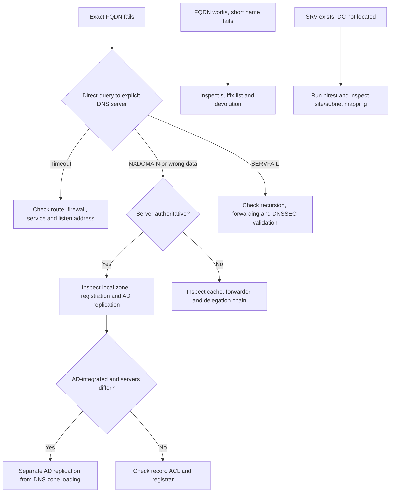

# Troubleshooting Active Directory DNS: Registration, `dcdiag`, Logging and Client Configuration

“DNS is broken” can mean that a client queried the wrong server, appended the wrong suffix, received stale cached data, could not reach an authoritative server, failed a secure dynamic update, or located no domain controller for its site. The shortest investigation keeps those layers separate.

> **TL;DR**
>
> 1. Capture the exact name, record type, client, DNS server and response code.
> 2. Test the FQDN against one explicit DNS server with `Resolve-DnsName`.
> 3. Decide whether the failure is client search behavior, authoritative data, recursion, registration, DC Locator or AD replication.
> 4. Use `dcdiag /test:DNS` for AD-wide checks, but inspect the failing subtest rather than treating its summary as a root cause.
> 5. Enable Analytical or debug logging only after ordinary queries, event logs and replication evidence fail to explain the issue.

## 1. Define one failing transaction

Record these facts before clearing caches or restarting services:

| Fact | Example |
|---|---|
| Client | `APP01.contoso.com` |
| Query name | `_ldap._tcp.dc._msdcs.contoso.com` |
| Record type | SRV |
| DNS server queried | `10.10.0.10` |
| Expected answer | DC locator SRV set |
| Actual result | timeout, `NXDOMAIN`, `SERVFAIL`, refused, wrong data |
| First observed | timestamp and timezone |

These responses point in different directions:

| Result | First interpretation |
|---|---|
| Timeout | Reachability, firewall, service, listen address or overload |
| `NXDOMAIN` | Authoritative “name does not exist” answer, possibly cached |
| `SERVFAIL` | Server could not complete processing, recursion or DNSSEC validation |
| Refused | Server policy, recursion disabled or transfer/update not authorized |
| Correct FQDN, failed short name | Suffix search list or devolution |
| Different answers by server | Replica, zone-loading, cache or policy difference |

Do not begin with `ipconfig /flushdns`, `net stop dns`, record deletion or repeated DC promotion. Those actions change evidence before the failed layer is known.

## 2. Capture the client configuration

```powershell
ipconfig.exe /all

Get-DnsClientServerAddress -AddressFamily IPv4 |
    Where-Object ServerAddresses |
    Select-Object InterfaceAlias, ServerAddresses

Get-DnsClient |
    Select-Object InterfaceAlias, ConnectionSpecificSuffix,
        RegisterThisConnectionsAddress, UseSuffixWhenRegistering

Get-DnsClientGlobalSetting
```

Verify:

- the active interface has the expected IP address, gateway and DNS servers;
- domain members query internal DNS servers that can resolve the AD namespace;
- no public or ISP resolver appears as an alternate DNS server on a domain member;
- the primary and connection-specific suffixes are intentional;
- the suffix search list and devolution explain how a short name is expanded.

The DNS Client service does not round-robin through configured servers for every query. It remains with a responsive server and fails over mainly when that server does not respond. An authoritative but wrong answer does not make it try the next server.

### Domain controller client settings

For the first and only DC/DNS server, point the DNS client to that server's own IP address. During promotion of an additional DC, point it to an existing DNS server for the target AD domain and site until inbound and outbound replication are healthy. Afterwards, using itself and another internal DNS server as preferred/alternate is valid; choose the order according to resilience and replication design.

Do not use an ISP resolver on a DC. Configure external resolution through DNS forwarders or root hints on the internal DNS service.

## 3. Test an FQDN against one explicit server

Start with a fully qualified name, explicit type and explicit server. This removes suffix-search ambiguity and identifies which server supplied the answer.

```powershell
$name = 'app01.contoso.com'
$server = '10.10.0.10'

Resolve-DnsName -Name $name -Type A -Server $server -DnsOnly
Resolve-DnsName -Name $name -Type A -Server $server -DnsOnly -NoRecursion
```

The first query permits recursion. `-NoRecursion` helps distinguish locally authoritative or cached behavior from a recursive path. Repeat the same query against each intended DNS server:

```powershell
$servers = '10.10.0.10', '10.20.0.10'

foreach ($dnsServer in $servers) {
    try {
        Resolve-DnsName -Name 'app01.contoso.com' -Type A `
            -Server $dnsServer -DnsOnly -ErrorAction Stop |
            Select-Object @{Name = 'Server'; Expression = { $dnsServer }},
                Name, Type, IPAddress, NameHost
    }
    catch {
        [pscustomobject]@{
            Server = $dnsServer
            Name = 'app01.contoso.com'
            Type = 'ERROR'
            IPAddress = $null
            NameHost = $_.Exception.Message
        }
    }
}
```

`nslookup.exe <name> <server>` remains useful for a direct query and does not use the Windows DNS client cache. Prefer `Resolve-DnsName` for structured output and DNSSEC-aware testing.

## 4. Separate the caches

Windows can involve two independent caches:

1. the local DNS Client resolver cache;
2. the recursive cache on the DNS Server service.

Inspect the client cache before clearing it:

```powershell
Get-DnsClientCache |
    Where-Object Entry -Like '*contoso.com*'
```

A cached negative answer explains why a corrected record still fails locally until its negative TTL expires. If a direct query to the server is correct but the normal application query is wrong, clear only the client cache:

```powershell
Clear-DnsClientCache
```

If the DNS server itself returns stale recursive data, inspect and then clear its server cache:

```powershell
Show-DnsServerCache
Clear-DnsServerCache -Force
```

Neither operation changes an authoritative zone. Do not clear every server cache before identifying which server has stale data.

## 5. Determine authority and recursion

On the server that produced the failure:

```powershell
Get-DnsServerZone |
    Select-Object ZoneName, ZoneType, IsDsIntegrated,
        ReplicationScope, IsPaused

Get-DnsServerForwarder
Get-DnsServerRecursion
```

If the server is authoritative for the zone, inspect its local data:

```powershell
Get-DnsServerResourceRecord -ZoneName 'contoso.com' `
    -Name 'app01' -RRType A
```

If the server is not authoritative, follow the recursion chain:

- verify the configured forwarder responds;
- verify conditional forwarders match the intended namespace;
- verify root hints and DNS egress if no forwarder is used;
- check parent NS records and glue for a delegated child zone;
- test UDP and TCP 53 because large or retried responses can require TCP.

## 6. Diagnose dynamic registration

A domain controller uses two registration paths:

| Record family | Registrar | Retrigger |
|---|---|---|
| Host A/AAAA | DNS Client service | `ipconfig /registerdns` for static/DC registration scenarios |
| DC locator SRV and GUID CNAME | Netlogon | Restart Netlogon or run the registration test |

First verify zone policy and existing ownership:

```powershell
Get-DnsServerZone -Name 'contoso.com' |
    Select-Object ZoneName, IsDsIntegrated, DynamicUpdate

Get-DnsServerResourceRecord -ZoneName 'contoso.com' `
    -Name $env:COMPUTERNAME
```

For a domain controller, inspect the records Netlogon expects:

```powershell
Get-Content "$env:SystemRoot\System32\Config\Netlogon.dns"

dcdiag.exe /test:RegisterInDNS /DnsDomain:contoso.com /v
```

If locator registration is missing, verify Netlogon, the DC's primary DNS suffix, its DNS client servers, secure-update permissions and the authoritative zone before restarting anything. If host registration alone is missing, inspect per-interface registration settings and multihoming.

For DHCP clients where DHCP owns A/PTR updates, use `ipconfig /renew`. Current Microsoft guidance warns that `ipconfig /registerdns` bypasses DHCP and can change record ownership, which can break future DHCP updates.

For a multihomed DC that publishes an unwanted interface, use the dedicated procedure in [Multihomed Domain Controllers - Hiding the Admin NIC from DNS Clients](../How-to/Multihomed%20Domain%20Controllers%20-%20Hiding%20the%20Admin%20NIC%20from%20DNS%20Clients.md).

## 7. Test DC Locator directly

AD clients locate services through SRV records and then validate candidates with DC Locator. Test both layers:

```powershell
$domainName = (Get-CimInstance Win32_ComputerSystem).Domain

Resolve-DnsName "_ldap._tcp.dc._msdcs.$domainName" -Type SRV
nltest.exe "/dsgetdc:$domainName" /force
nltest.exe /dsgetsite
```

Then test the site-specific owner name:

```powershell
$domainName = (Get-CimInstance Win32_ComputerSystem).Domain
$siteName = (nltest.exe /dsgetsite | Select-Object -First 1).Trim()

Resolve-DnsName "_ldap._tcp.$siteName._sites.dc._msdcs.$domainName" `
    -Type SRV
```

If the global SRV query works but the site-specific query does not, inspect AD Sites and Services, subnet mappings and Netlogon registration. A client absent from every configured AD subnet can be authenticated by a DC but has no reliable site affinity; domain controllers record `NO_CLIENT_SITE` entries in `%SystemRoot%\Debug\Netlogon.log` and can emit event 5807.

## 8. Use `dcdiag /test:DNS` as a suite

The DNS test is not part of the default `dcdiag` run and must be requested explicitly:

```powershell
# One DC, all DNS subtests except external-name resolution.
dcdiag.exe /test:DNS /DnsAll /s:DC01 /v

# All DCs in the forest; can be slow when servers are offline.
dcdiag.exe /test:DNS /DnsAll /e /v /f:C:\Temp\dcdiag-dns.txt
```

Run narrower tests when you already know the failing layer:

| Test | What it adds to `DnsBasic` |
|---|---|
| `/DnsForwarders` | Forwarder configuration |
| `/DnsDelegation` | Delegation correctness |
| `/DnsDynamicUpdate` | Whether the AD zone permits dynamic update |
| `/DnsRecordRegistration` | A, CNAME and well-known SRV registration inventory |
| `/DnsResolveExtName` | Resolution of a specified or default external name |

```powershell
dcdiag.exe /test:DNS /DnsRecordRegistration /s:DC01 /v
dcdiag.exe /test:DNS /DnsDynamicUpdate /s:DC01 /v
dcdiag.exe /test:DNS /DnsForwarders /s:DC01 /v
```

Read the named subtest and server in the output. One unreachable DC can create a noisy forest-wide report; one passing summary does not prove that every client queries the same server or receives the same cached answer.

## 9. Distinguish AD replication from DNS zone loading

For an AD-integrated zone, a record can pass through three states:

1. committed to AD on the accepting DNS/DC;
2. replicated to AD on another DC;
3. loaded into the destination DNS Server service's in-memory zone.

Compare the same record against each DNS server first. Then check directory replication:

```powershell
repadmin.exe /replsummary
repadmin.exe /showrepl DC02

Get-DnsServerDsSetting -ComputerName DC02 | Format-List *
```

The DNS Server directory polling interval has historically defaulted to 180 seconds. A short lag after AD replication can therefore be normal. A persistent difference is not: correlate AD replication, DNS Server audit event 564 (update from DS), partition enlistment and zone state.

Do not reduce the polling interval until you have proved that polling, rather than AD replication or registration, is the limiting stage.

## 10. Diagnose short names, suffixes and promotion checks

If an FQDN resolves but a short name does not, inspect search behavior:

```powershell
Get-DnsClientGlobalSetting |
    Select-Object UseSuffixSearchList, SuffixSearchList,
        UseDevolution, DevolutionLevel

Get-DnsClient |
    Select-Object InterfaceAlias, ConnectionSpecificSuffix
```

Avoid “fixing” this by appending a long list of unrelated suffixes. It increases query volume and can make a short name resolve differently by location. Prefer FQDNs for service configuration and keep the AD domain first where a suffix search list is required.

Before promotion, `dcdiag` can test DNS prerequisites, including a configured DNS server, suffix consistency, authority, dynamic updates and an existing forest's LDAP locator record:

```powershell
dcdiag.exe /test:DcPromo /DnsDomain:contoso.com `
    /NewForest /ForestRoot:contoso.com /v
```

Choose the promotion arguments for the intended deployment; do not paste the example unchanged. A vague promotion error such as “managing the network session failed” is not evidence that the suffix list is the root cause. Capture the promotion log, run the appropriate DCPromo DNS test and prove which prerequisite fails.

## 11. Escalate logging in stages

Start with normal channels:

- **DNS Server** for service and zone-loading failures;
- **Microsoft-Windows-DNSServer/Audit** for record, update, scavenging and configuration changes;
- **System** and **Directory Service** for AD replication or service dependencies;
- client DNS events when registration or validation fails.

Audit events are enabled by default. Query a focused window:

```powershell
$startTime = (Get-Date).AddHours(-2)

Get-WinEvent -FilterHashtable @{
    LogName = 'Microsoft-Windows-DNSServer/Audit'
    StartTime = $startTime
    Id = 515, 516, 519, 520, 521, 541, 564
} | Select-Object TimeCreated, Id, Message
```

If the transaction remains unexplained, enable the DNS Server Analytical channel for a bounded reproduction. It records queries, responses, recursive traffic and dynamic updates. On high-volume servers, monitor overhead and log size.

Legacy DNS debug logging is the last step. Filter it to the relevant direction, protocol, operation and client IP; set a file-size limit; reproduce once; then disable it. Leaving full packet logging enabled can degrade performance and fill the system volume.

## 12. Evidence-first decision tree



## 13. Common traps

- Configuring a public resolver as an alternate DNS server on a domain member or DC.
- Treating preferred and alternate DNS servers as per-query load balancing.
- Testing only a short name and overlooking suffix expansion.
- Assuming `ping` proves DNS health; it mixes name resolution with ICMP reachability.
- Recreating Netlogon SRV records manually instead of fixing registration.
- Running `ipconfig /registerdns` on DHCP-managed clients and changing record ownership.
- Clearing all caches before identifying where the stale response lives.
- Treating `dcdiag /test:DNS` as one pass/fail test instead of a set of subtests.
- Blaming DNS polling when AD replication has not converged.
- Leaving Analytical or debug logging enabled indefinitely.

## References

- [Troubleshooting DNS clients](https://learn.microsoft.com/en-us/windows-server/networking/dns/troubleshoot/troubleshoot-dns-client)
- [Troubleshooting DNS Servers](https://learn.microsoft.com/en-us/windows-server/networking/dns/troubleshoot/troubleshoot-dns-server)
- [Recommendations for DNS client settings](https://learn.microsoft.com/en-us/troubleshoot/windows-server/networking/best-practices-for-dns-client-settings)
- [`dcdiag` command reference](https://learn.microsoft.com/en-us/windows-server/administration/windows-commands/dcdiag)
- [Dynamic DNS Update in Windows and Windows Server](https://learn.microsoft.com/en-us/windows-server/networking/dns/dynamic-update)
- [Enable DNS Logging and Diagnostics in Windows Server](https://learn.microsoft.com/en-us/windows-server/networking/dns/dns-logging-and-diagnostics)