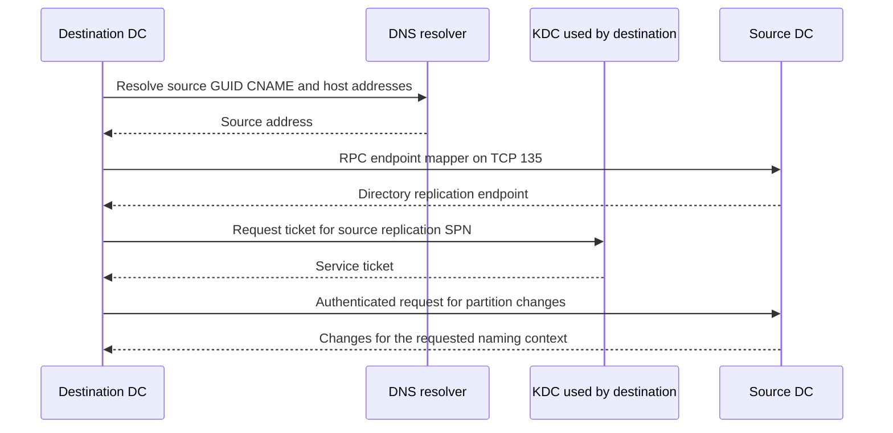
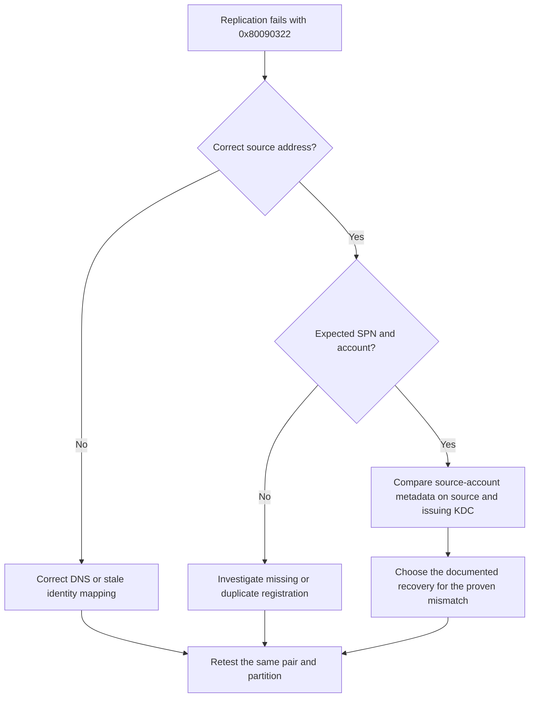

# Troubleshooting Active Directory Replication: repadmin, dcdiag, DNS, RPC, Time and Kerberos

An account exists on one domain controller but not another. A password works in one site and fails in the next. These are replication symptoms, not diagnoses. The useful unit of investigation is one **destination DC, source DC and naming context**, together with the last successful replication and the exact error.

This guide targets supported AD DS deployments, including Windows Server 2022 and 2025. It covers directory replication, not the DFSR replication of SYSVOL files.

> **TL;DR**
>
> - The destination DC pulls changes from the source. For that operation, the destination is the RPC and Kerberos client.
> - Start with `repadmin /replsummary`, then read `/showrepl` for the failing destination and partition.
> - Prove the source's GUID CNAME, host addresses, RPC endpoint, clock and authentication path before changing replication settings.
> - `0x80090322` can mean the wrong server was contacted or the KDC used a stale source-DC password, not just a bad SPN.
> - Stop ordinary repair when you find lingering-object, tombstone-lifetime or USN-rollback safeguards.
> - A successful RPC replication call is not proof that a particular object or SYSVOL file has converged.

## 1. Capture one failing replication relationship

Record these fields before forcing synchronization or clearing tickets:

| Evidence | Why it matters |
|---|---|
| Destination and source FQDN | Establishes the direction of the failing operation |
| Naming context DN | Domain, Configuration, Schema and DNS partitions can fail independently |
| Last success and failure times | Separates a recent interruption from prolonged divergence |
| Decimal and hexadecimal error | Similar messages can describe different failure classes |
| Sites, OS builds and recent changes | Identifies network, patch, promotion or recovery boundaries |
| A known-good relationship | Provides a comparison without changing the failing pair |



The diagram summarizes dependencies; cached DNS, tickets and RPC bindings can change the packet sequence. A DC can use its own KDC, so absence of network Kerberos traffic does not prove absence of Kerberos.

Run the examples from an approved administrative workstation with RSAT AD DS tools and Windows PowerShell 5.1, or locally where stated. AD reads, remote event access and diagnostic tools require different permissions and firewall paths. A denied diagnostic query is not automatically an AD replication failure.

## 2. Establish scope, then narrow it

```powershell
Import-Module ActiveDirectory

$destinationDc = 'dc02.corp.example'
$sourceDc = 'dc01.corp.example'
$partitionDn = 'DC=corp,DC=example'

repadmin.exe /replsummary
repadmin.exe /showrepl $destinationDc /all /verbose
repadmin.exe /queue $destinationDc

Get-ADReplicationPartnerMetadata -Target $destinationDc -Scope Server |
    Where-Object Partition -eq $partitionDn |
    Select-Object Server, Partner, Partition, LastReplicationAttempt,
                  LastReplicationSuccess, LastReplicationResult,
                  ConsecutiveReplicationFailures
```

Read `/showrepl` as **inbound neighbors of the named destination**, not as a list of changes that it sends. A forest summary is a routing aid; it does not replace the per-partner, per-partition result. `/queue` shows queued replication work, not a count of all unreplicated objects or attributes.

| Pattern | First investigation |
|---|---|
| Every destination fails against one source | Source DNS identity, endpoint, service state or machine-account key |
| One destination fails against many sources | Destination resolver, network, KDC, time or local service health |
| One partition fails | Replica ownership, partition permissions, topology or consistency safeguard |
| One site fails | Routed network path, site-link schedule and available bridgeheads |
| Calls succeed but one value differs | Attribute metadata, conflict resolution or an application reading another DC |

For an enterprise overview, `repadmin /showrepl * /csv` can preserve all reported rows. Retain collection errors too: an unreachable DC that could not be queried is an unknown, not a healthy replica.

## 3. Select tests deliberately

```powershell
dcdiag.exe /s:$destinationDc /test:Replications /v
dcdiag.exe /s:$destinationDc /test:Advertising /v
dcdiag.exe /s:$destinationDc /test:NCSecDesc /v
dcdiag.exe /s:$destinationDc /test:CheckSecurityError /ReplSource:$sourceDc /v
dcdiag.exe /s:$destinationDc /test:DNS /DnsBasic /v
```

These commands investigate a named DC without requesting a repair. Their successful execution still depends on the operator's access and the management protocols used by each test.

- `Replications` reports recent results and disabled replication.
- `Advertising` checks advertised capabilities. It does not prove that a firewall permits actual Kerberos requests.
- `NCSecDesc` checks required permissions on naming contexts; it is relevant to replication authorization failures.
- `CheckSecurityError` investigates machine identity, SPNs and security dependencies for the specified source.
- `/DnsBasic` makes the requested DNS scope explicit.

Do not label every `dcdiag` invocation read-only. `/fix` repairs machine-account SPNs; comprehensive tests can include operations that trigger replication; `/DnsDynamicUpdate` tests updates. Start with selected tests, not `/c /e /fix` as an incident ritual.

A historical event can keep an event-based test red after the underlying fault is fixed. Match the event time and repeat a current operation before declaring the repair unsuccessful.

## 4. Resolve the actual source, not merely the domain name

Directory replication uses the source DC's **NTDS Settings object GUID**. This is not its computer-object GUID and not its Invocation ID.

First obtain that GUID from the source's `/showrepl` header. Then run DNS checks **on the destination**, against each DNS resolver configured there:

```powershell
$sourceDc = 'dc01.corp.example'
$forestDnsName = 'corp.example'
$sourceNtdsGuid = '11111111-2222-3333-4444-555555555555'
$dnsServer = '192.0.2.53'

$sourceAlias = "$sourceNtdsGuid._msdcs.$forestDnsName"

Resolve-DnsName -Name $sourceAlias -Type CNAME -Server $dnsServer -DnsOnly
Resolve-DnsName -Name $sourceDc -Type A -Server $dnsServer -DnsOnly
Resolve-DnsName -Name $sourceDc -Type AAAA -Server $dnsServer -DnsOnly
Get-DnsClientServerAddress | Select-Object InterfaceAlias, AddressFamily, ServerAddresses
```

The GUID and IP address above are placeholders. Compare the returned addresses with the source's actual NIC configuration. An absent AAAA record is not an error when no IPv6 host record is expected; an incorrect or unreachable published address is.

Investigate stale GUID aliases, reused server names, obsolete host records and hosts-file overrides. Do not repair a wrong-address problem by resetting a DC password. Querying DNS successfully proves an answer was returned, not that it names the correct computer.

Use [Troubleshooting Active Directory DNS](Troubleshooting%20Active%20Directory%20DNS%20-%20Registration,%20dcdiag,%20Logging%20and%20Client%20Configuration.md) for record registration and resolver configuration. Avoid changing DNS registration globally to fix one stale record.

## 5. Prove the RPC path from the destination

AD DS replication normally discovers its RPC endpoint through TCP 135, then connects to the returned TCP port. Modern Windows Server uses TCP 49152-65535 for dynamic RPC by default, unless an explicit supported configuration changes the endpoint.

```powershell
$sourceDc = 'dc01.corp.example'

foreach ($port in 135, 88, 389) {
    $probe = Test-NetConnection -ComputerName $sourceDc -Port $port
    [pscustomobject]@{
        SourceAddress = $probe.SourceAddress
        RemoteAddress = $probe.RemoteAddress
        Port = $port
        Connected = $probe.TcpTestSucceeded
    }
}
```

These are TCP probes, not an exhaustive firewall validation. LDAP and Kerberos are dependencies; reaching TCP 389 does not exercise the DRS replication endpoint. Reaching TCP 135 proves only the first RPC connection. Use an endpoint-mapper query, a short network trace or firewall logs to identify and test the returned DRS endpoint.

Do not scan all 16,384 dynamic ports as a substitute for endpoint evidence. Confirm the flow from the failing destination, and the reciprocal flow when each DC also replicates in the opposite direction. DNS, time and administrative collection have their own network requirements.

Error 1722 usually points toward reachability or a lower-layer failure. Error 1753 can mean the contacted host does not expose the requested interface, including when DNS led to the wrong host. Neither means "open every port".

## 6. Check time and local service health

Run the local queries on each affected DC. Compare both with the KDC that issued the failing ticket, which may be a third DC:

```powershell
Get-Service NTDS, KDC, Netlogon, W32Time, RpcSs |
    Select-Object Name, Status, StartType

w32tm.exe /query /status
w32tm.exe /query /source
w32tm.exe /monitor /domain:corp.example
```

Kerberos normally permits five minutes of clock skew, but the effective domain policy controls the tolerance. Compare offsets, not the appearance of local clock displays in different time zones. W32Time probes also require working network paths; a timeout does not measure an offset.

Check disk capacity, storage errors and NTDS-related events when connectivity is healthy but replication stalls. Do not apply old `MaxUserPort` or `TcpTimedWaitDelay` recipes based solely on a memory or connection error. Establish resource exhaustion with current counters and connection evidence first.

## 7. Interpret the failure class

| Error or event | What to establish next |
|---|---|
| 1722, RPC server unavailable | Name-to-address mapping, endpoint mapper, dynamic endpoint and service health |
| 1753, no more endpoints | Correct source host and registered DRS interface |
| 8524, DNS lookup failure; events 2087/2088 | Source GUID CNAME and host lookup; 2088 can indicate successful fallback despite a DNS defect |
| 5, access denied | Authentication, user rights, clock and security policy; distinguish from partition authorization |
| 8453, replication access denied | Caller authorization and naming-context security descriptor |
| `0x80090322`, target principal name incorrect | Actual target identity, replication SPN and source-account key as known by the issuing KDC |
| 8606 or event 1988 | Possible lingering object; identify the partition and source named in the event |
| 8614 or event 2042 | Excessive replication age; inspect the effective tombstone lifetime before any resumption |
| Event 2095 | USN rollback safeguard; isolate and use a supported recovery path |

An error is evidence for a hypothesis, not permission to run a repair command. In particular, the DC logging event 1988 is refusing an update from a suspect source; it is not necessarily the stale DC that needs cleanup.

## 8. Work the Kerberos case: target principal name is incorrect

Suppose DC02 pulls from DC01. DC02 is the Kerberos client; DC01 is the service target. The ticket must be encrypted with key material that DC01 can use. If DC02's KDC has an older password for DC01's computer account, the target can reject the ticket even when the SPN is correct.



Inspect the source's SPNs and compare nonsecret metadata:

```powershell
$sourceDc = 'dc01.corp.example'
$issuingKdc = 'dc03.corp.example'
$sourceAccountDn = (Get-ADDomainController -Identity $sourceDc -Server $sourceDc).ComputerObjectDN

setspn.exe -L DC01
repadmin.exe /showobjmeta $sourceDc $sourceAccountDn
repadmin.exe /showobjmeta $issuingKdc $sourceAccountDn
```

Use the exact replication SPN observed in the ticket or diagnostic output for a targeted `setspn -Q` lookup; add `-F` only when forest scope is needed. Do not register a guessed SPN or run a forest-wide duplicate scan before identifying the failing name.

Compare password-related metadata, particularly version and originating change, rather than trying to read password values. A metadata discrepancy supports a stale-replica hypothesis; matching `pwdLastSet` alone does not prove every secret is synchronized. A DC discovered by `nltest /dsgetdc /kdc` is a candidate, not definitive proof of which KDC issued a cached ticket.

Microsoft's [0x80090322 troubleshooting guide](https://learn.microsoft.com/en-us/troubleshoot/windows-server/active-directory/replication-error-2146893022) distinguishes wrong-address, SPN and password-version cases. Its recovery can involve temporarily changing KDC availability, obtaining a ticket from a healthy KDC and, for a confirmed mismatch, resetting the affected DC's machine-account password.

Those are coordinated changes, not read-only tests. Confirm the affected account, a healthy writable peer, another available KDC, a maintenance window and a service-restoration plan before following the matching procedure. Never stop every KDC, reset every DC, or assume `netdom trust /reset` repairs a DC machine-account password.

`klist purge` normally clears the operator's tickets, not the Local System session used by AD DS. A SYSTEM ticket purge can affect DC services and belongs inside the controlled procedure, not the initial evidence collection.

## 9. Collect events without losing their context

```powershell
$destinationDc = 'dc02.corp.example'
$startTime = (Get-Date).AddHours(-4)
$eventIds = 1311, 1925, 1988, 2042, 2087, 2088, 2095

Get-WinEvent -ComputerName $destinationDc -FilterHashtable @{
    LogName = 'Directory Service'
    Id = $eventIds
    StartTime = $startTime
} -ErrorAction Stop |
    Select-Object TimeCreated, Id, MachineName, RecordId, Message
```

A no-events result and an access failure are different outcomes. Preserve the provider, timestamp, source DC GUID, naming context and error embedded in each message. Correlate with System/KDC/Netlogon events and the issuing KDC's Security events when the relevant auditing was already enabled.

Collect a short trace around one reproduction only when the preceding evidence leaves an ambiguity. Treat traces and exports as sensitive operational data. Do not publish real directory names, identities or authentication material.

## 10. Validate the repair at two levels

Once the root cause is corrected and no consistency safeguard prohibits replication, one explicit synchronization can test the intended relationship:

```powershell
$destinationDc = 'dc02.corp.example'
$sourceDc = 'dc01.corp.example'
$partitionDn = 'DC=corp,DC=example'

repadmin.exe /replicate $destinationDc $sourceDc $partitionDn
if ($LASTEXITCODE -ne 0) {
    throw 'The targeted replication attempt failed; retain its output.'
}
repadmin.exe /showrepl $destinationDc /all /verbose
```

This block **triggers replication**. It is not part of the read-only baseline. Do not add force/full-sync options to bypass a failure, or use `/syncall` to conceal which relationship was repaired.

Then confirm the affected business object on the source and destination. Compare its relevant values and replication metadata, and observe another normal replication cycle. Verify other affected partitions, sites and partners before closing a wider incident.

Use [Active Directory Replication Internals](../Concepts/Active%20Directory%20Replication%20Internals%20-%20USNs,%20Invocation%20IDs,%20High-Watermark%20and%20Up-to-Dateness%20Vectors.md) for attribute metadata and UTD vectors, and [Active Directory Replication Topology](../Concepts/Active%20Directory%20Replication%20Topology%20-%20KCC,%20Intra-Site,%20Inter-Site%20and%20Site%20Links.md) for site schedules and connection objects. Do not compare raw local USNs from different DCs as if they were one global counter.

SYSVOL requires separate DFSR validation. Successful AD replication of a GPO container does not prove the corresponding policy files are consistent.

## 11. Stop conditions and escalation

Stop ordinary repair when the evidence indicates USN rollback, a stale DC beyond the deletion-retention boundary, storage corruption or compromise. Do not remove `Dsa Not Writable`, disable strict replication consistency, edit replication vectors or restore an arbitrary old snapshot to make an error disappear.

Escalate with the failing triplet, recent and last-success timestamps, sanitized `/showrepl` output, DNS results, endpoint evidence, time offsets, event records and any recovery history. Document which operations were only reads and which changed state.

## References

- [Troubleshooting Active Directory replication problems](https://learn.microsoft.com/en-us/windows-server/identity/ad-ds/manage/troubleshoot/troubleshooting-active-directory-replication-problems)
- [DCDiag reference](https://learn.microsoft.com/en-us/windows-server/administration/windows-commands/dcdiag)
- [Replication error 0x80090322](https://learn.microsoft.com/en-us/troubleshoot/windows-server/active-directory/replication-error-2146893022)
- [Replication error 5](https://learn.microsoft.com/en-us/troubleshoot/windows-server/active-directory/replications-fail-with-error-5)
- [AD domains and trusts firewall requirements](https://learn.microsoft.com/en-us/troubleshoot/windows-server/active-directory/config-firewall-for-ad-domains-and-trusts)
- [AD Health Check Script](../Tools/AD-HealthCheck/AD%20Health%20Check%20Script.md)