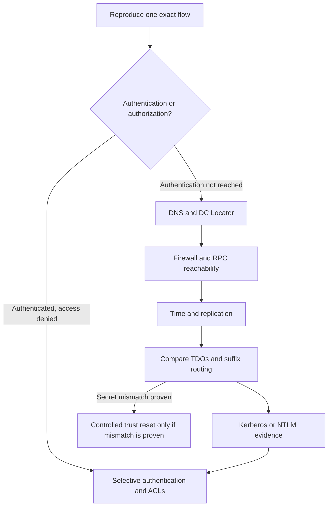

# Troubleshooting Active Directory Trusts: DNS, Firewall, Time, Secure Channels and Name Suffix Routing

A trust error is often reported as one problem even though several independent systems are involved. The fastest investigation separates name routing, DNS and DC Locator, network reachability, time, trust metadata, Kerberos or NTLM, selective authentication and application authorization.

> **TL;DR**
>
> - Reproduce one exact identity-to-resource flow and record whether Kerberos or NTLM was used.
> - Query DNS SRV records from the affected client and domain controllers; a successful ping is not a DC Locator test.
> - Test the ports required by the actual flow. Modern Windows Server RPC uses TCP 49152-65535 by default.
> - Verify time and replication before changing the trust.
> - Compare `Get-ADTrust`, `netdom trust /verify /kerberos` and namespace routing from both sides.
> - Distinguish selective-authentication denial from application authorization denial.
> - Reset a trust password only after proving a secure-channel secret mismatch and coordinating both sides.
> - Never delete and recreate a trust as an exploratory troubleshooting step.

## 1. Build one failing scenario

Do not start with a generic statement such as "the trust is broken." Record one test case:

| Field | Example |
|---|---|
| User | `user@accounts.example` |
| Client | `WS01.accounts.example` |
| Resource | `HTTP/app.resources.example` |
| Trusting side | `resources.example` |
| Trusted side | `accounts.example` |
| Expected access | HTTPS application sign-in |
| Failure time | UTC timestamp with time zone |
| Protocol observed | Kerberos, NTLM or unknown |
| Error | Exact UI, event or command output |

Then test a second known-good identity or resource. This creates a useful boundary:

- all users to all resources suggests trust, DNS, routing or network dependencies;
- one user suggests account state, group membership, SID history or authorization;
- one server suggests SPN, selective authentication, local policy or application configuration;
- one site suggests DNS, firewall, time or DC reachability;
- Kerberos fails but NTLM works suggests SPN, DNS, encryption or ticket-routing trouble;
- authentication succeeds but the application returns access denied suggests authorization, not the trust.

Do not use an interactive sign-in to a domain controller as a routine trust test. Test the intended application protocol against an ordinary target.

## 2. Follow the dependency order



Changing the trust before its dependencies are known destroys evidence and can turn an isolated failure into an outage.

## 3. Establish the trust topology

From each relevant domain, inventory the local TDO and make the perspective explicit:

```powershell
Import-Module ActiveDirectory

$partner = 'partner.example'

Get-ADTrust `
    -Identity $partner `
    -Properties trustAttributes,
                'msDS-SupportedEncryptionTypes',
                whenCreated,
                whenChanged |
    Select-Object Name,
                  Source,
                  Target,
                  Direction,
                  TrustType,
                  IntraForest,
                  ForestTransitive,
                  SelectiveAuthentication,
                  SIDFilteringForestAware,
                  SIDFilteringQuarantined,
                  TGTDelegation,
                  trustAttributes,
                  'msDS-SupportedEncryptionTypes',
                  whenCreated,
                  whenChanged,
                  DistinguishedName
```

Confirm:

- the trust exists on every expected side;
- each direction matches the intended resource flow;
- the trust type and transitivity are expected;
- selective authentication and SID filtering match the approved baseline;
- no duplicate external trust creates an alternate path;
- the partner names match the current DNS and NetBIOS namespaces.

`Get-ADTrust` proves only that the queried DC can read its local directory object. It does not contact the partner or validate the trust password.

## 4. Validate DNS and DC Locator

Active Directory trust operations depend on DNS SRV records, not merely host A records. Test from the affected client and from DCs that must communicate across the trust.

```powershell
$partnerDnsName = 'partner.example'

$queries = @(
    "_ldap._tcp.dc._msdcs.$partnerDnsName"
    "_kerberos._tcp.$partnerDnsName"
    "_kerberos._udp.$partnerDnsName"
)

foreach ($query in $queries) {
    Resolve-DnsName `
        -Name $query `
        -Type SRV `
        -DnsOnly `
        -ErrorAction Continue |
        Select-Object @{Name='Query'; Expression={$query}},
                      NameTarget,
                      Port,
                      Priority,
                      Weight
}

nltest.exe /dsgetdc:$partnerDnsName /force
nltest.exe /dclist:$partnerDnsName
```

Check both directions. A conditional forwarder configured in Forest A does not prove that Forest B can resolve Forest A. Confirm:

- the client uses only approved AD-aware DNS resolvers;
- conditional forwarders or delegations point to live authoritative servers;
- UDP and TCP 53 work where required;
- SRV targets resolve to reachable addresses;
- stale or duplicate records do not send clients to retired DCs;
- site and subnet mappings do not select an unreachable DC;
- DNS suffix search lists do not mask an unqualified-name problem.

A successful `Resolve-DnsName` result does not prove the target port is reachable. A successful `Test-Connection` result does not prove DNS SRV discovery or Kerberos works.

For the full discovery sequence, see [How Domain Controllers are Located Across Trusts](../Concepts/How%20Domain%20Controllers%20are%20Located%20Across%20Trusts.md).

## 5. Test the required network paths

Firewall requirements vary by operation. Do not open every port from every host to every DC.

### 5.1 Common AD trust dependencies

| Service | Protocol and port | Typical use |
|---|---|---|
| DNS | TCP/UDP 53 | Name and SRV resolution |
| Kerberos | TCP/UDP 88 | Ticket requests and referrals |
| Kerberos password change | TCP/UDP 464 | Password operations when required |
| LDAP | TCP/UDP 389 | Directory and DC Locator-related operations |
| LDAPS | TCP 636 | LDAP over TLS when used |
| Global Catalog | TCP 3268/3269 | Forest-wide queries when used |
| RPC endpoint mapper | TCP 135 | Discovers dynamically assigned RPC endpoints |
| Dynamic RPC | TCP 49152-65535 | Modern Windows Server RPC default range |
| SMB | TCP 445 | Trust creation and selected administrative/Netlogon operations |
| AD Web Services | TCP 9389 | Active Directory PowerShell and management tools when used |
| NTP | UDP 123 | Time synchronization |

Windows Server 2008 and later use TCP 49152-65535 as the default dynamic RPC range. A smaller custom range is possible but must be engineered consistently; do not assume the legacy 1025-5000 range applies to Windows Server 2022 or 2025.

Microsoft's current firewall guidance distinguishes ordinary trust operation from creation and administration. TCP 445 is required when creating a trust, but it is not part of every ordinary authentication transaction. Test it when the failing operation actually depends on SMB, Netlogon administration or policy access.

Network rules normally need to support relevant clients, resource servers and DC-to-DC paths, not just one management workstation. Stateful firewall return traffic is not the same as allowing a new connection in the reverse direction.

### 5.2 Run targeted TCP probes

`Test-NetConnection` checks one TCP connection. It cannot validate UDP and a successful result does not prove that the application protocol succeeds.

```powershell
$domainController = 'dc01.partner.example'
$tcpPorts = 53, 88, 135, 389, 445, 464, 636, 3268, 3269, 9389

$results = foreach ($port in $tcpPorts) {
    $test = Test-NetConnection `
        -ComputerName $domainController `
        -Port $port `
        -WarningAction SilentlyContinue

    [pscustomobject]@{
        ComputerName     = $domainController
        RemoteAddress    = $test.RemoteAddress
        Port             = $port
        TcpTestSucceeded = $test.TcpTestSucceeded
        SourceAddress    = $test.SourceAddress
        InterfaceAlias   = $test.InterfaceAlias
    }
}

$results | Format-Table -AutoSize
```

RPC cannot be cleared by testing TCP 135 alone. The endpoint mapper tells the client which dynamic port to use next. Use `PortQry`, a network trace or firewall logs to prove both stages when RPC is suspected.

Test from the same source network and security context as the failing flow. A probe from an administrator workstation proves only that workstation's path.

## 6. Check time before Kerberos

Kerberos rejects requests when clocks differ beyond the effective policy tolerance, commonly five minutes. Compare UTC time, synchronization source and service state on the client, target server and DCs on both sides.

```powershell
$computers = @(
    'client01.accounts.example'
    'dc01.accounts.example'
    'dc01.resources.example'
    'app01.resources.example'
)

foreach ($computer in $computers) {
    Write-Output "--- $computer ---"
    w32tm.exe /stripchart /computer:$computer /samples:5 /dataonly
}

w32tm.exe /query /status
w32tm.exe /query /source
w32tm.exe /query /configuration
```

`w32tm /stripchart` requires UDP 123 reachability to the queried host and can fail because of a firewall even when the remote clock is correct. Correlate the result with System log events from `Microsoft-Windows-Time-Service`.

In each forest, the forest-root PDC emulator should ultimately follow an approved reliable time source. Member systems should follow the AD hierarchy unless there is a documented exception.

## 7. Check replication and DC consistency

A trust object or its latest change may not yet be visible on every DC. Query more than one DC and inspect replication before resetting anything.

```powershell
$partner = 'partner.example'
$domainControllers = Get-ADDomainController -Filter *

foreach ($domainController in $domainControllers) {
    try {
        Get-ADTrust `
            -Identity $partner `
            -Server $domainController.HostName `
            -Properties trustAttributes,
                        whenChanged `
            -ErrorAction Stop |
            Select-Object @{Name='DomainController'; Expression={$domainController.HostName}},
                          Target,
                          Direction,
                          TrustType,
                          trustAttributes,
                          whenChanged
    } catch {
        [pscustomobject]@{
            DomainController = $domainController.HostName
            Target           = $partner
            Error            = $_.Exception.Message
        }
    }
}

repadmin.exe /replsummary
repadmin.exe /showrepl * /errorsonly
```

Do not interpret different `whenChanged` values alone as a broken trust. Confirm whether the TDO values differ, whether replication converges and whether the queried DC owns the failing authentication attempt.

## 8. Verify the trust and secure channel

Use supported tools from an elevated prompt under an account authorized for the operation. Start with read-only verification:

```powershell
$localDomain = $env:USERDNSDOMAIN
$partnerDomain = 'partner.example'

netdom.exe trust $localDomain `
    /domain:$partnerDomain `
    /verify `
    /kerberos

nltest.exe /sc_query:$partnerDomain
nltest.exe /sc_verify:$partnerDomain
```

Interpret the commands carefully:

- `netdom trust /verify` verifies the secure channel for the specified trust relationship;
- `/kerberos` makes `netdom` use Kerberos authentication for the operation rather than NTLM;
- `nltest /sc_query` reports information about an established secure channel;
- `nltest /sc_verify` checks the channel and may establish a new one if needed;
- success from one machine and DC does not prove every site or DC path works.

Capture the full command, source host, contacted DC, timestamp and result. Run corresponding verification with the partner administrators from their side.

Common trust-related messages include:

| Error | Likely investigation path |
|---|---|
| `ERROR_NO_LOGON_SERVERS` / 1311 | DNS, DC Locator, site routing, firewall, DC service health |
| `ERROR_NO_TRUST_LSA_SECRET` / 1786 | Missing or inconsistent local trust secret; confirm TDOs and history |
| `ERROR_TRUSTED_DOMAIN_FAILURE` / 1788 | Trust relationship or secure-channel failure; compare both sides |
| `ERROR_TRUSTED_RELATIONSHIP_FAILURE` / 1789 | Secure-channel, account or trust-password mismatch |
| `KDC_ERR_S_PRINCIPAL_UNKNOWN` | Missing or duplicate SPN, wrong target name or wrong realm routing |
| `KDC_ERR_ETYPE_NOSUPP` | No common Kerberos encryption type or stale trust key material |
| `KRB_AP_ERR_SKEW` | Clock difference beyond accepted tolerance |
| Access denied after successful ticket issue | Selective authentication, user rights, group membership or resource ACL |

An error code narrows the investigation; it does not by itself prove the root cause.

## 9. Inspect Kerberos and NTLM evidence

Clear tickets only on a dedicated test session when doing so will not disrupt production work. Reproduce one access attempt, then inspect the resulting tickets:

```powershell
$targetSpn = 'HTTP/app.resources.example'

klist.exe purge
klist.exe get $targetSpn
klist.exe
```

Look for:

- a referral TGT for the destination realm;
- the expected service ticket and SPN;
- the ticket encryption type;
- the KDC that issued the ticket;
- events 4768 and 4769 on the processing DCs;
- Kerberos operational events on the client;
- NTLM event 8004 and related NTLM operational logs when fallback is suspected.

Use `klist purge` only in the test logon session. It removes that session's Kerberos tickets and can interrupt access until they are renewed.

If no service ticket appears but access succeeds, determine whether NTLM was used. NTLM success does not validate Kerberos or forest-trust namespace routing.

For encryption-specific diagnosis and trust-key rotation, see [Hardening Kerberos Encryption on AD Trusts](../Hardening/RC4%20Hardening/Hardening%20Kerberos%20Encryption%20on%20AD%20Trusts/Hardening%20Kerberos%20Encryption%20on%20AD%20Trusts.md).

## 10. Inspect forest name suffix routing

Forest trusts route DNS, UPN and SPN suffixes according to forest-trust information. Duplicate or excluded suffixes can send a referral to the wrong forest or prevent routing entirely.

```powershell
$localForestRoot = (Get-ADForest).RootDomain
$partnerForestRoot = 'partner.example'

netdom.exe trust $localForestRoot `
    /domain:$partnerForestRoot `
    /namesuffixes
```

Review the output for:

- disabled suffixes;
- exclusions;
- duplicate UPN suffixes across forests;
- stale domains that no longer exist;
- child-domain names that collide with another routed namespace;
- application aliases that do not map to the expected SPN realm.

If a suffix must be changed, list suffixes immediately before the approved operation. Do not rely on a number recorded earlier: Microsoft documents that suffix ordering can change. Make the corresponding review with both forest owners and test representative UPNs and SPNs afterward.

DNS and suffix routing solve different questions:

- DNS answers where a host or service record is located;
- trust routing answers which forest should process a Kerberos name.

Both must be correct.

## 11. Diagnose selective authentication

With selective authentication enabled, a valid foreign user can still be denied before reaching the application's normal ACL check. The user or an appropriate foreign group needs the Allowed to authenticate extended right on the target computer or service account.

Use this decision sequence:

1. Confirm the local TDO has `SelectiveAuthentication = True`.
2. Identify the directory object representing the actual service endpoint.
3. Check whether the user receives Allowed to authenticate through an explicit or inherited ACE.
4. Confirm the ACE resolves to the intended foreign SID.
5. Then evaluate logon rights, group scope and the application ACL.

Do not disable selective authentication to diagnose one server. Compare the working and failing target ACEs, then grant the right to a purpose-built group if the access is approved.

An FSP that no longer resolves may indicate a deleted foreign object or DNS/trust lookup trouble. It does not prove that every FSP with the same display symptom is orphaned. See [What are FSPs - Audit and Manage them in AD](../Concepts/What%20are%20FSPs%20-%20Audit%20and%20Manage%20them%20in%20AD.md).

## 12. Collect event evidence

The following read-only query builds a narrow time window on one DC. Adjust the event list to the observed protocol and avoid collecting an unbounded Security log.

```powershell
$domainController = 'dc01.resources.example'
$startTime = (Get-Date).AddMinutes(-30)
$eventIds = 4768, 4769, 4771, 4776, 4706, 4707, 4716

Get-WinEvent `
    -ComputerName $domainController `
    -FilterHashtable @{
        LogName   = 'Security'
        Id        = $eventIds
        StartTime = $startTime
    } `
    -ErrorAction Stop |
    Select-Object TimeCreated,
                  Id,
                  MachineName,
                  ProviderName,
                  Message
```

Correlate events by UTC timestamp, user, client address, service name and ticket encryption type. Also review:

- `System` for Netlogon, DNS Client, Time-Service and LSA events;
- `Microsoft-Windows-Kerberos/Operational` on affected systems when enabled;
- `Microsoft-Windows-NTLM/Operational` for fallback evidence;
- firewall accept and drop logs;
- application authentication and authorization logs.

Event 4769 success shows that a KDC issued a service ticket. It does not prove that the target service accepted it or authorized the user.

## 13. Use a network trace when layers disagree

A trace from the affected endpoint can settle questions that command summaries cannot:

- Which DNS server answered, and with what SRV targets?
- Which DC did DC Locator select?
- Did TCP 135 lead to a reachable dynamic RPC endpoint?
- Was Kerberos tried before NTLM?
- Which realm returned the referral or error?
- Did the target reset the connection before application authentication?

Capture the smallest practical window around one reproduction. Protect traces as sensitive data: they can contain hostnames, SIDs, service names, user names and authentication metadata. Do not publish production traces in a blog or support transcript without sanitization.

## 14. Reset only a proven trust-password mismatch

A trust reset changes shared secret material and requires suitable authorization. It does not repair DNS, time, firewall, suffix-routing, SPN or ACL problems.

Before a reset:

1. Verify the same trust from both sides and retain the output.
2. Confirm DNS, required ports, time and replication are healthy.
3. Confirm the TDO exists with the intended direction on both sides.
4. Rule out Kerberos encryption and name-routing mismatches.
5. Agree on the affected trust direction, maintenance window and rollback plan.
6. Use supported `netdom trust` operations with the partner administrator present.
7. Verify from both sides and test a real application immediately afterward.

Never paste administrative passwords into a script, command history or ticket. Let supported tools prompt securely, or use an approved privileged-access mechanism.

Deleting and recreating a forest trust can discard name-suffix routing, selective-authentication state, filtering settings and audit continuity. It is not a harmless alternative to understanding the mismatch.

## 15. Evidence checklist

Collect this package before escalation:

- UTC failure time and exact user-client-resource tuple;
- expected trust and access direction;
- sanitized `Get-ADTrust` output from every relevant side;
- DC Locator and DNS SRV results from affected networks;
- contacted DCs and sites;
- targeted port tests plus firewall drops;
- time source and offset evidence;
- replication health for the TDO-owning domains;
- `netdom /verify /kerberos` and `nltest` output;
- `klist` referral and service-ticket details;
- relevant Security, Kerberos, NTLM, Netlogon and application events;
- forest name suffix routes and exclusions;
- selective-authentication ACEs on the failing target;
- a known-good comparison case;
- recent approved trust, DNS, firewall, delegation or encryption changes.

Sanitize domain names, user names, SIDs, IP addresses and ticket data before sharing outside the support boundary.

## 16. Anti-patterns

| Anti-pattern | Why it fails |
|---|---|
| Ping both domains | ICMP does not test SRV lookup, Kerberos, LDAP or RPC |
| Test only TCP 135 | RPC also needs the assigned dynamic endpoint |
| Run every test from an admin workstation | Proves the wrong network and often the wrong DNS path |
| Disable the firewall temporarily | Removes evidence and creates an uncontrolled exposure |
| Disable selective authentication | Converts one access problem into a broad security change |
| Enable NTLM fallback | Masks Kerberos and SPN defects |
| Enable TGT delegation | Reintroduces cross-forest credential exposure |
| Reset the trust first | Cannot fix dependencies and destroys useful evidence |
| Delete and recreate the trust | Loses security and routing configuration |
| Test only one DC | Misses replication, site and per-DC reachability defects |
| Treat access denied as a trust failure | Authentication may have succeeded before local authorization denied access |

## References

- [Active Directory and AD DS port requirements](https://learn.microsoft.com/en-us/troubleshoot/windows-server/active-directory/config-firewall-for-ad-domains-and-trusts)
- [Netdom trust](https://learn.microsoft.com/en-us/windows-server/administration/windows-commands/netdom-trust)
- [Nltest](https://learn.microsoft.com/en-us/previous-versions/windows/it-pro/windows-server-2012-r2-and-2012/cc731935(v=ws.11))
- [Get-ADTrust](https://learn.microsoft.com/en-us/powershell/module/activedirectory/get-adtrust)
- [Resolve-DnsName](https://learn.microsoft.com/en-us/powershell/module/dnsclient/resolve-dnsname)
- [Windows Time Service tools and settings](https://learn.microsoft.com/en-us/windows-server/networking/windows-time-service/windows-time-service-tools-and-settings)
- [Kerberos authentication troubleshooting guidance](https://learn.microsoft.com/en-us/troubleshoot/windows-server/windows-security/kerberos-authentication-troubleshooting-guidance)
- [Active Directory Trusts Explained](../Concepts/Active%20Directory%20Trusts%20Explained%20-%20Types,%20Direction,%20Transitivity,%20TDOs%20and%20Authentication%20Flows.md)
- [Securing Active Directory Trusts](../Hardening/Securing%20Active%20Directory%20Trusts%20-%20SID%20Filtering,%20Selective%20Authentication,%20TGT%20Delegation%20and%20Trust%20Auditing.md)
- [How Domain Controllers are Located Across Trusts](../Concepts/How%20Domain%20Controllers%20are%20Located%20Across%20Trusts.md)
- [Hardening Kerberos Encryption on AD Trusts](../Hardening/RC4%20Hardening/Hardening%20Kerberos%20Encryption%20on%20AD%20Trusts/Hardening%20Kerberos%20Encryption%20on%20AD%20Trusts.md)
