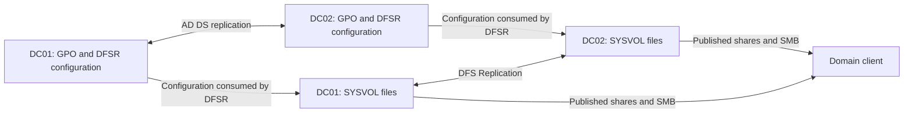
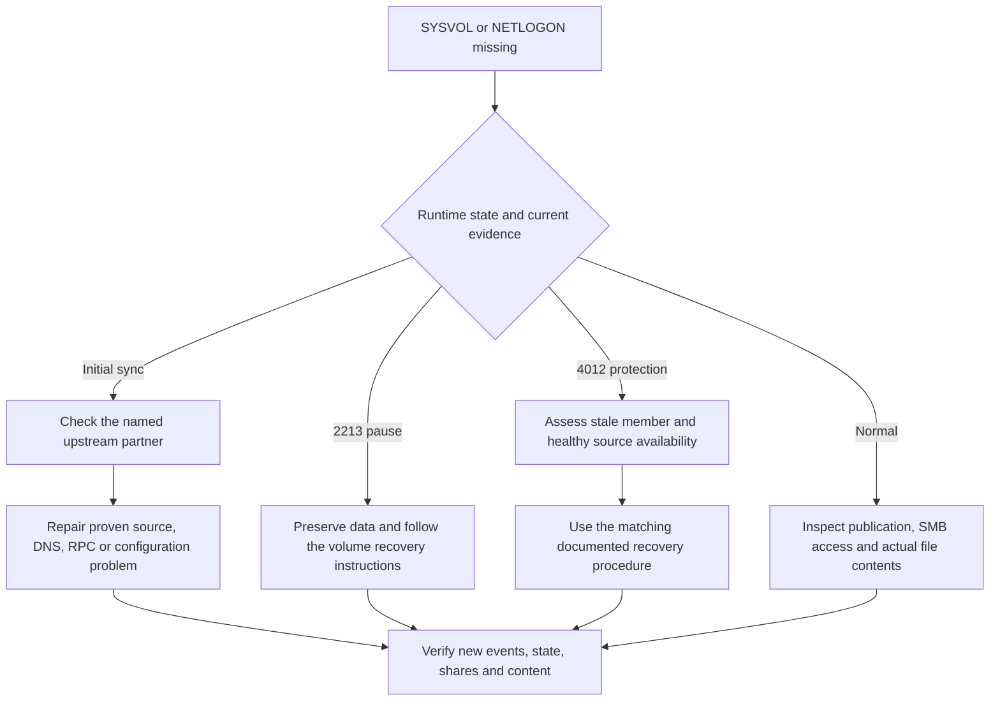
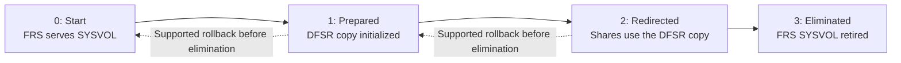

# Troubleshooting DFSR SYSVOL: Missing Shares, Initial Synchronization and Content Freshness

**A missing SYSVOL share is an outcome, not an instruction to rebuild the DFSR database.** A newly promoted DC may be waiting for its initial source. An upstream DC may have paused replication. Another DC may be protecting itself against stale content. Those conditions need different responses.

This guide targets DFSR-replicated SYSVOL on supported Windows Server versions, including 2022 and 2025. It provides the diagnostic path before the separate [authoritative and non-authoritative restoration procedure](DFSR%20-%20Authoritative%20and%20Non-Authoritative%20restore.md).

> **TL;DR**
>
> - Separate AD configuration replication, DFSR file replication and SMB share publication.
> - Query the runtime state on every relevant DC. An absent CIM instance or a failed query is not state 4, Normal.
> - Events 4612/4614 indicate initial synchronization is still pending; 4604 reports its completion on a non-authoritative member.
> - Investigate the actual upstream partner before changing the waiting DC.
> - Event 2213 and event 4012 describe different recovery conditions. Do not bypass content-freshness protection to silence an error.
> - Preserve SYSVOL, PreExisting and ConflictAndDeleted evidence before reinitialization or restoration.

## 1. Identify which layer failed

SYSVOL has several cooperating components:

| Layer | Responsibility | Useful evidence |
|---|---|---|
| AD DS | Replicates GPO containers and DFSR configuration objects | `repadmin`, subscription attributes and replication metadata |
| DFS Replication | Synchronizes policy and script files between DCs | Runtime folder state, DFS Replication events, backlog and file contents |
| Netlogon/share publication | Publishes SYSVOL and NETLOGON when the required initialization conditions are met | Local share inventory, Netlogon events and readiness state |
| SMB client access | Lets clients read the published files | Access to a named DC's share from the affected client |



A successful AD replication call does not copy the corresponding GPO files. A successful `gpupdate` on one client does not prove that every DC has the same files. Likewise, a domain path such as `\\corp.example\SYSVOL` can send the client to a healthy DC and conceal another DC's missing share.

Test explicit paths such as `\\dc02.corp.example\SYSVOL` when identifying the affected replica. A DFS Namespaces root or folder target is a different configuration object; deleting an orphaned namespace target does not repair a SYSVOL subscription.

## 2. Establish the local baseline

Run these commands on the affected DC in an administrative PowerShell session. Record the build, last restart and incident time before restarting a service:

```powershell
Get-CimInstance -ClassName Win32_OperatingSystem |
    Select-Object Caption, Version, BuildNumber, LastBootUpTime

Get-Service DFSR, Netlogon | Select-Object Name, Status, StartType

Get-SmbShare -ErrorAction Stop |
    Where-Object Name -in 'SYSVOL', 'NETLOGON' |
    Select-Object Name, Path, ShareState
```

If the share query succeeds but returns no matching rows, the shares are absent locally. An access or service-query error is a different result. If the shares exist but a client cannot read them, investigate SMB reachability and permissions rather than starting with DFSR recovery.

Use the actual returned paths and the subscription's root path when preserving files. Do not assume that every domain uses `C:\Windows\SYSVOL_DFSR` or that NETLOGON and SYSVOL are independent replicas: NETLOGON exposes the domain's scripts directory within SYSVOL.

A running DFSR service alone does not establish which engine a historically upgraded domain uses for SYSVOL. If that history is uncertain, use the migration-state checks in section 11 before applying a DFSR-specific recovery procedure.

## 3. Read the runtime folder state

The `DfsrReplicatedFolderInfo` provider exposes the local state of each replicated folder. Use CIM instead of depending on the legacy `wmic.exe` command-line tool:

```powershell
$stateNames = @{
    0 = 'Uninitialized'
    1 = 'Initialized'
    2 = 'Initial Sync'
    3 = 'Auto Recovery'
    4 = 'Normal'
    5 = 'In Error'
}

$folders = @(Get-CimInstance -Namespace 'root\MicrosoftDfs' `
    -ClassName DfsrReplicatedFolderInfo `
    -Filter "ReplicatedFolderName='SYSVOL Share' AND ReplicationGroupName='Domain System Volume'" `
    -ErrorAction Stop)

if ($folders.Count -ne 1) {
    throw "Expected one SYSVOL runtime instance; received $($folders.Count). Investigate before classifying this DC."
}

$folder = $folders[0]
$stateLabel = 'Unknown'
if ($null -ne $folder.State -and $stateNames.ContainsKey([int]$folder.State)) {
    $stateLabel = $stateNames[[int]$folder.State]
}

[pscustomobject]@{
    Computer = $env:COMPUTERNAME
    State = $folder.State
    StateLabel = $stateLabel
    ReplicatedFolderGuid = $folder.ReplicatedFolderGuid
    MemberGuid = $folder.MemberGuid
    LastErrorCode = $folder.LastErrorCode
    LastErrorMessageId = $folder.LastErrorMessageId
    CurrentStageSizeInMb = $folder.CurrentStageSizeInMb
    CurrentConflictSizeInMb = $folder.CurrentConflictSizeInMb
}
```

| State | Interpretation |
|---:|---|
| 0, Uninitialized | Runtime initialization has not completed |
| 1, Initialized | The instance is initialized, but this is not the Normal state |
| 2, Initial Sync | The member is waiting for or performing initial synchronization |
| 3, Auto Recovery | Database recovery is in progress |
| 4, Normal | The folder is in its normal runtime state; content convergence still needs verification |
| 5, In Error | Read the associated error and current events before choosing recovery |
| No instance / query failure | Unknown or incomplete initialization, missing provider, stopped service, or a collection problem; not healthy |

These are **DFSR runtime states**, not the numbered `dfsrmig` migration states. Runtime state 3 means Auto Recovery, not that FRS migration has reached Eliminated.

The provider documentation is archived, but it describes the `root\MicrosoftDfs` interface still used by Microsoft's SYSVOL troubleshooting guidance. A missing class or namespace should be investigated on the target; do not silently substitute a different provider and assume identical property names.

## 4. Build an event sequence, not an event count

```powershell
$incidentStart = (Get-Date).AddHours(-6)

Get-WinEvent -FilterHashtable @{
    LogName = 'DFS Replication'
    Id = 1202, 2212, 2213, 2214, 4012, 4114, 4612, 4614, 4602, 4604, 5002, 5008
    StartTime = $incidentStart
} -ErrorAction Stop |
    Sort-Object TimeCreated |
    Select-Object TimeCreated, Id, MachineName, RecordId, Message
```

| Event | Question to answer |
|---:|---|
| 1202 | Can DFSR read its AD configuration from a DC? |
| 4612 / 4614 | Which partner is required for initial synchronization, and can it supply usable SYSVOL content? |
| 4604 | Did this member complete initial synchronization for the current attempt? |
| 4602 | Was SYSVOL initialized as a primary member in the applicable initialization/recovery scenario? |
| 2213 | Did DFSR pause after an unexpected shutdown, and what recovery action does this event request? |
| 2212 / 2214 | Did database recovery start and subsequently complete? |
| 4012 | Did the offline interval exceed the configured content-freshness limit? |
| 4114 | Was the SYSVOL subscription disabled, intentionally or unexpectedly? |
| 5002 / 5008 | Which partner, RPC error and replication group are involved in the communication failure? |

Read the folder/group identity in each event. A DFSR event for a different replicated folder is not a SYSVOL checkpoint. Preserve the full error code and partner name, not only the event ID.

An old 4604 from a previous initialization does not prove that today's recovery completed. Conversely, no event in a short query window does not prove it never occurred. Match events to the incident timeline, current state and retained log coverage.

## 5. Investigate the initial source

A newly promoted DC can finish replicating the directory while SYSVOL initial synchronization is still waiting. The waiting member may be functional enough to query, but it must not be treated as a healthy source for other DCs.

The 4612/4614 message names the partner involved. During seeding, the `Parent Computer` setting may also identify the intended source. Inspect it locally without changing it:

```powershell
$domainName = (Get-CimInstance -ClassName Win32_ComputerSystem).Domain
$seedingPath = Join-Path 'HKLM:\SYSTEM\CurrentControlSet\Services\DFSR\Parameters\SysVols\Seeding SysVols' $domainName

if (Test-Path -LiteralPath $seedingPath) {
    Get-ItemProperty -LiteralPath $seedingPath -ErrorAction Stop |
        Select-Object PSPath, 'Parent Computer'
} else {
    'No seeding key is present; use the event and topology evidence for the current operation.'
}
```

The seeding setting is not a complete description of the steady-state replication topology. Its absence after initialization is not by itself a fault.

Check the named source's runtime state, shares and events. Common dead ends include a source that is itself waiting for initial sync, a source paused by event 2213, and a source protected by event 4012. Changing only the downstream member cannot supply data that no upstream member can serve.

Microsoft documents a case-specific change to `Parent Computer` when the initial source is unavailable. Prefer restoring the source's name resolution/reachability when appropriate. Only consider changing the seeding source after identifying a healthy, current replacement; it is not a general fix for an established replication topology.

## 6. Separate configuration access from file-replication transport

First establish that the DFSR subscription exists and has reached the DCs consuming it. The [read-only preflight in the restoration guide](DFSR%20-%20Authoritative%20and%20Non-Authoritative%20restore.md#read-only-preflight-subscription-content-and-events) shows how to resolve the subscription DN from the real DC computer object and inspect its enabled state and root path.

AD replication transports that configuration. DFSR then polls AD and applies it. Files subsequently travel over the DFSR connection. These are separate stages.

From the affected member, check the actual partner rather than only the domain name:

```powershell
$sourceDc = 'dc01.corp.example'

Resolve-DnsName -Name $sourceDc -DnsOnly -ErrorAction Stop
Test-NetConnection -ComputerName $sourceDc -Port 135
Test-NetConnection -ComputerName $sourceDc -Port 445
repadmin.exe /showrepl $env:COMPUTERNAME
```

TCP 445 is relevant to SMB access; a successful SMB connection does not validate DFSR. TCP 135 is the RPC endpoint mapper; it does not prove that the subsequently assigned DFSR endpoint is reachable. Verify that second connection through the endpoint mapper, a short trace or firewall evidence.

Modern Windows Server normally uses dynamic RPC ports in TCP 49152-65535 unless a supported explicit port configuration changes that behavior. Do not carry forward the old claim that every DC always uses TCP 5722 for DFSR. Also distinguish the DRS interface used by AD replication from the DFSR interface used for files.

If AD itself is inconsistent, use [Troubleshooting Active Directory Replication](Troubleshooting%20Active%20Directory%20Replication%20-%20repadmin,%20dcdiag,%20DNS,%20RPC,%20Time%20and%20Kerberos.md). If the host uses an unexpected firewall profile, use [Domain Controller Uses the Public Firewall Profile](Domain%20Controller%20Uses%20the%20Public%20Firewall%20Profile%20-%20NLA,%20DC%20Locator%20and%20LDAP%20Troubleshooting.md).

## 7. Distinguish crash recovery from stale-content protection

Read the effective local DFSR configuration:

```powershell
Get-CimInstance -Namespace 'root\MicrosoftDfs' -ClassName DfsrMachineConfig `
    -ErrorAction Stop |
    Select-Object MaxOfflineTimeInDays, StopReplicationOnAutoRecovery,
                  RpcPortAssignment, DsPollingIntervalInMin,
                  EnableDebugLog, DebugLogFilePath
```

### Event 2213: paused recovery

An unexpected shutdown can lead to automatic database recovery or a pause requiring action, depending on the build, configuration and recorded condition. Follow the current event's instructions for the identified volume after preserving the data. The documented `ResumeReplication` operation is not equivalent to discarding the database and reinitializing every folder on the volume.

Investigate recurring storage/ESENT errors and unclean shutdowns. Do not treat repeated recovery as normal simply because a service restart temporarily clears the symptom.

### Event 4012: content freshness

`MaxOfflineTimeInDays` defines the allowed disconnection interval before stale-folder protection intervenes. Microsoft documents 60 days as a common enabled configuration; zero disables the protection. Read the actual value instead of assuming the default.

This DFSR setting is **not** the AD tombstone lifetime. Increasing either value does not reconstruct missed deletion history. Do not set the limit to zero merely to resume a stale replica.

The recovery choice depends on available healthy copies. One stale member with a healthy source is a different situation from a domain in which no DC has a usable initialized copy. Follow the Microsoft scenario guidance and use the restoration procedure only when that diagnosis calls for it.

## 8. Choose the least disruptive matching action



After a **known intended configuration change** has replicated to the relevant DC, a local poll can ask DFSR to read it sooner:

```powershell
dfsrdiag.exe pollad
if ($LASTEXITCODE -ne 0) {
    throw 'DFSR could not complete the configuration poll; preserve the command output.'
}
```

This is an operational reload, not a purely passive query. It does not synchronize AD objects between DCs, force file-content convergence or prove that a partner is healthy.

Do not create the shares manually or set `SysvolReady = 1` to conceal incomplete initialization. Do not delete the DFSR database, clear `DfsrPrivate`, empty preserved-file stores, or make a newly promoted DC authoritative merely because it has no share. Those actions can destroy evidence or distribute an incomplete copy.

## 9. Prove convergence after the repair

Verify the current runtime state, the relevant new events, the local shares and representative policy/script contents. For one direction of an actual partner relationship:

```powershell
$sendingDc = 'dc01.corp.example'
$receivingDc = 'dc02.corp.example'

dfsrdiag.exe backlog /rgname:"Domain System Volume" /rfname:"SYSVOL Share" /smem:$sendingDc /rmem:$receivingDc
if ($LASTEXITCODE -ne 0) {
    throw 'Backlog collection failed; no convergence conclusion can be drawn.'
}
```

The sending/receiving direction matters. Query the reverse direction where relevant, and assess the other affected partners. Backlog is a point-in-time view; an empty backlog or instantaneous `ReplicationState` display is not proof that every expected file exists or that a deletion was intended.

Compare the relevant GPO directories, `gpt.ini` and scripts through explicit DC paths. Use the [Group Policy troubleshooting guide](Group%20Policy%20Troubleshooting%20-%20From%20gpresult%20to%20the%20Actual%20Root%20Cause.md) to relate the file side to the GPO's AD metadata and client processing. Equal file counts alone are weak evidence.

Preserve contents of `PreExisting` and `ConflictAndDeleted` before repeating any initialization. Those stores are quota/retention constrained, not a replacement for backups, and repeated initial synchronization can remove evidence that the first attempt preserved.

For record identities, change-origin tracing and extraction of preserved versions, see [Investigating DFSR File Deletions](../../110%20-%20Platform/Windows%20Server/Troubleshoot/Investigating%20DFSR%20File%20Deletions%20-%20GVSNs,%20Originating%20Members,%20Debug%20Logs%20and%20Preserved%20Files.md).

## 10. Extend collection to the domain

This read-only inventory queries one domain's DCs and reports collection failures explicitly. Run it from RSAT with access to the remote WMI providers. It uses DCOM deliberately; a default remote CIM session normally uses WSMan instead, which has different access requirements.

```powershell
Import-Module ActiveDirectory

$directoryDc = 'dc01.corp.example'
$domainControllers = @(Get-ADDomainController -Filter * -Server $directoryDc -ErrorAction Stop)
$sessionOptions = New-CimSessionOption -Protocol Dcom

$inventory = foreach ($domainController in $domainControllers) {
    $session = $null
    $result = [ordered]@{
        Computer = $domainController.HostName
        ObservedAtUtc = (Get-Date).ToUniversalTime()
        State = $null
        LastErrorCode = $null
        QueryError = $null
    }
    try {
        $session = New-CimSession -ComputerName $domainController.HostName `
            -SessionOption $sessionOptions -ErrorAction Stop
        $instances = @(Get-CimInstance -CimSession $session -Namespace 'root\MicrosoftDfs' `
            -ClassName DfsrReplicatedFolderInfo `
            -Filter "ReplicatedFolderName='SYSVOL Share' AND ReplicationGroupName='Domain System Volume'" `
            -ErrorAction Stop)
        if ($instances.Count -ne 1) {
            throw "Expected one SYSVOL instance; received $($instances.Count)."
        }
        $result.State = $instances[0].State
        $result.LastErrorCode = $instances[0].LastErrorCode
    } catch {
        $result.QueryError = $_.Exception.Message
    } finally {
        if ($null -ne $session) { Remove-CimSession -CimSession $session }
    }
    [pscustomobject]$result
}

$inventory | Sort-Object Computer
```

This is a runtime-state inventory, not an automatic repair tool or a forest-wide health verdict. Run it separately in each relevant domain. Rows with a query error or null state remain unknown and must not be counted as Normal.

## 11. Legacy migration check

For a domain that historically used FRS, inspect both the requested global state and whether all DCs reached it. Run these read-only checks on the domain's PDC emulator:

```powershell
dfsrmig.exe /getglobalstate
dfsrmig.exe /getmigrationstate
```



Only the stable migration states are shown. Intermediate per-DC migration states are not the same as `DfsrReplicatedFolderInfo.State`. The global requested state alone does not establish that every DC converged.

**Eliminated is the irreversible boundary.** Migration is a separate planned operation, not a troubleshooting reset. Do not run `/setglobalstate` to see whether an incident improves. Follow the current migration guide for prerequisites, transition checks and supported rollback before elimination. This article intentionally does not reproduce FRS repair tools or BurFlags recipes.

## References

- [Troubleshoot missing SYSVOL and Netlogon shares](https://learn.microsoft.com/en-us/troubleshoot/windows-server/networking/troubleshoot-missing-sysvol-and-netlogon-shares)
- [A newly promoted DC fails to advertise](https://learn.microsoft.com/en-us/troubleshoot/windows-server/active-directory/newly-promoted-domain-controller-fail-advertise)
- [DFSR SYSVOL authoritative/non-authoritative synchronization](https://learn.microsoft.com/en-us/troubleshoot/windows-server/group-policy/force-authoritative-non-authoritative-synchronization)
- [DfsrReplicatedFolderInfo provider reference](https://learn.microsoft.com/en-us/previous-versions/windows/desktop/dfsr/dfsrreplicatedfolderinfo)
- [DfsrMachineConfig provider reference](https://learn.microsoft.com/en-us/previous-versions/windows/desktop/dfsr/dfsrmachineconfig)
- [DFS Replication overview](https://learn.microsoft.com/en-us/windows-server/storage/dfs-replication/dfs-replication-overview)
- [Migrate SYSVOL from FRS to DFSR](https://learn.microsoft.com/en-us/windows-server/storage/dfs-replication/migrate-sysvol-to-dfsr)