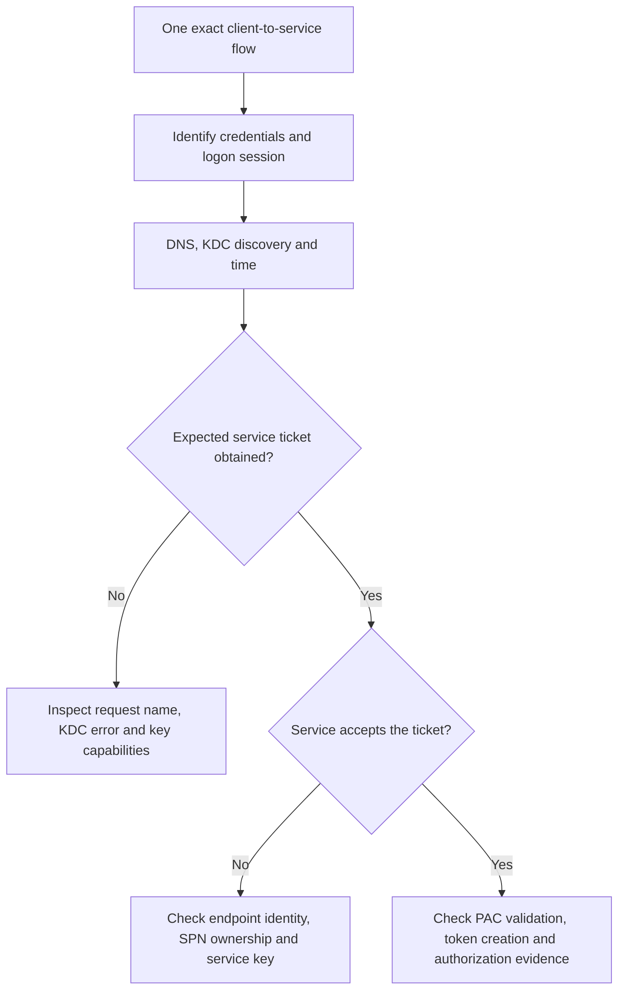
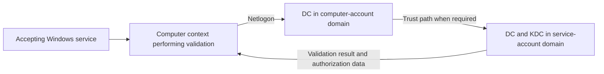

# Troubleshooting Kerberos Authentication: SPNs, Tickets, Error Codes and NTLM Fallback

**A ticket in the cache is not a successful application logon.** Kerberos can locate a KDC, issue the requested ticket and still fail when the service attempts to accept it, validate authorization data or authorize the operation.

This guide investigates application authentication on Windows Server 2022 and 2025. It complements the existing replication, trust, delegation and encryption guides instead of treating every failure as the same SPN problem.

> **TL;DR**
>
> - Record one exact user, client process, logon session, target name and service identity.
> - Distinguish ticket acquisition, ticket acceptance, PAC validation and application authorization.
> - Query the SPN actually requested, including aliases and service-class/port rules used by the application.
> - `KDC_ERR_PREAUTH_REQUIRED` can be normal negotiation; `KDC_ERR_PREAUTH_FAILED` describes a different outcome.
> - `KRB_AP_ERR_MODIFIED` often points to a target/key mismatch, not proof that packets were maliciously modified.
> - Test in the affected session. Do not purge SYSTEM tickets or change trust secrets as an exploratory step.

## 1. Define a reproducible flow

| Field | Example |
|---|---|
| Identity | `LabUser@corp.example` |
| Client and process | Browser on `WS01.corp.example` |
| Name actually used | `https://portal.corp.example` |
| Expected SPN | `HTTP/portal.corp.example`, subject to the application's actual naming behavior |
| Target service identity | `CORP\svc_web` or the relevant computer/gMSA account |
| Failure time | UTC timestamp with source clock accuracy |
| Result | Exact protocol/application error and whether NTLM was observed |

Compare a known-good identity, client or endpoint. An alias-only failure suggests a different boundary from all users failing against every name. A second-hop failure is not the same as a failed browser-to-web-server authentication.



Use a remote client representative of the real workload. A localhost test may take a different authentication path and encounter loopback protections. Do not remove those protections merely to make a local test resemble a remote one.

## 2. Inspect the correct logon session

Run the first checks in the affected user's context, before clearing anything:

```powershell
whoami.exe /user
klist.exe tickets
```

Record the client principal, server/SPN, realm, start/end/renew times, ticket flags and encryption fields. Ticket encryption and session-key encryption are separate values.

For a service, scheduled task, IIS worker or an alternate-credential process, the interactive administrator's cache may be irrelevant. `klist sessions` can help locate sessions when the caller has the required access. Use the appropriate LUID with `klist -li ... tickets` only after identifying the actual session; include `-lh` if the high part is nonzero.

Inspection of other sessions requires additional privilege. Elevating or opening a new shell can also change the security context you are testing. A user ticket does not prove that the machine or application-pool identity can obtain one.

Do not routinely use `klist tgt` in publishable evidence: its detailed output can include encoded ticket material. Ticket caches and traces are sensitive, even when no password is visible.

## 3. Prove names and KDC reachability

On the affected client:

```powershell
$accountDomain = 'corp.example'
$serviceHost = 'portal.corp.example'

Resolve-DnsName -Name $serviceHost -DnsOnly -ErrorAction Stop
Resolve-DnsName -Name "_kerberos._tcp.$accountDomain" -Type SRV -DnsOnly -ErrorAction Stop
nltest.exe /dsgetdc:$accountDomain /kdc
```

Check that the resolved address belongs to the intended endpoint, not merely that DNS returned an answer. For a load-balanced application, identify where Windows authentication terminates and which identity owns the keys on every accepting node.

DC Locator output identifies a candidate DC. It is not conclusive evidence that a cached ticket came from that DC. Correlate KDC events, client data or a short trace to identify the actual issuer when necessary.

Access by IP address commonly prevents the expected hostname-based Kerberos path. Do not generalize that to a blanket statement that IP-based Kerberos is impossible; explicit supported configurations exist, but the ordinary fix is to use the intended service name and correct its SPN ownership.

Client-to-KDC traffic and client-to-application traffic are different paths. Test the relevant ports from the actual source network. A TCP 88 connection proves reachability, not successful ticket issuance; it also says nothing about the service's HTTP, SMB or SQL endpoint.

## 4. Check time without changing it first

```powershell
$kdcName = 'dc01.corp.example'

w32tm.exe /query /status
w32tm.exe /query /source
w32tm.exe /stripchart /computer:$kdcName /samples:5 /dataonly
```

Compare client, KDC and service clocks. The usual Kerberos clock-skew tolerance is five minutes, controlled by the effective policy. Time zones displayed in a UI are not clock offsets. A failed UDP time probe is not a measured skew.

Preserve the observed state before resynchronizing. Correct the time-source problem instead of increasing tolerance or manually moving clocks to make an expired ticket usable.

## 5. Establish unique SPN ownership

A Service Principal Name identifies a service instance. Its registration determines the account whose key the KDC uses for the service ticket. The accepting service must possess the corresponding key, directly or through its Windows service identity.

```powershell
$targetSpn = 'HTTP/portal.corp.example'

setspn.exe -F -Q $targetSpn
setspn.exe -L 'CORP\svc_web'
```

The forest-scoped query checks the exact name in that forest. It does not query every trusted forest. A DNS alias, URL port and physical host name do not necessarily produce the same SPN; obtain the requested value from the application/ticket/trace evidence.

Also account for Windows service-class mappings to HOST where applicable. The absence of an explicit service-class string on an object is not always proof that the KDC cannot resolve the requested identity.

Before changing a registration:

1. Identify the requested SPN and the account that currently owns it.
2. Establish the identity and key actually used by the accepting service.
3. Review every endpoint and application sharing that account.
4. Correct only the proven ownership problem using the supported application workflow.
5. Allow directory convergence and retest with fresh relevant tickets.

`setspn -S` performs duplicate checking when adding a registration; it does not decide whether the selected account is the correct owner. Do not add the same SPN to several load-balanced computer accounts or move SPNs speculatively.

### Inventory registered SPNs without claiming usage

```powershell
Import-Module ActiveDirectory

$queryDc = 'dc01.corp.example'
$domainDn = (Get-ADRootDSE -Server $queryDc).DefaultNamingContext
$principals = Get-ADObject -Server $queryDc -SearchBase $domainDn `
    -LDAPFilter '(servicePrincipalName=*)' `
    -Properties servicePrincipalName, sAMAccountName -ErrorAction Stop

$spnInventory = foreach ($principal in $principals) {
    foreach ($registeredSpn in $principal.servicePrincipalName) {
        [pscustomobject]@{
            QueriedDc = $queryDc
            Account = $principal.sAMAccountName
            ObjectClass = $principal.ObjectClass
            ObjectGuid = $principal.ObjectGUID
            DistinguishedName = $principal.DistinguishedName
            Spn = $registeredSpn
        }
    }
}

$spnInventory | Sort-Object Spn, Account
```

This lists registrations in one domain, including computer and managed-service objects, not only users. Repeat explicitly in other relevant domains. Collection errors are not empty inventories.

A registered SPN is not evidence that it was used. Event 4769 normally identifies the **service account** through `ServiceName`/`ServiceSid`, not the full requested SPN. One account can own several names, so exact endpoint usage may require client, application or trace evidence.

## 6. Test acquisition, then acceptance

After preserving the initial cache, request the exact service ticket in the test session:

```powershell
$targetSpn = 'HTTP/portal.corp.example'

klist.exe get $targetSpn
if ($LASTEXITCODE -ne 0) {
    throw 'Ticket acquisition failed; preserve the KDC error before changing configuration.'
}
klist.exe tickets
```

This is an active authentication test and can change the cache. Success establishes ticket acquisition for that session; it does not connect to the application or prove that the application can decrypt the ticket.

Now perform the intended application operation and correlate the server-side result. If the service cannot accept the ticket, check wrong SPN ownership, a node using different credentials, a stale keytab, a recently rotated service secret and incorrect name-to-address mapping.

If fresh tickets are required, use a dedicated test logon and understand that `klist purge` clears its entire Kerberos cache, not one selected SPN. Purging Local System tickets can disrupt services and AD operations. Do not include it in a generic first-response checklist.

## 7. Read errors in their protocol context

The values below are **Kerberos protocol error codes**, not Windows NTSTATUS values or event-message resource identifiers:

| Hex / decimal | Name | Investigation |
|---|---|---|
| `0x19` / 25 | `KDC_ERR_PREAUTH_REQUIRED` | Often normal AS negotiation asking for preauthentication; inspect the next request and final result |
| `0x18` / 24 | `KDC_ERR_PREAUTH_FAILED` | Invalid preauthentication proof; investigate credentials, keys and the actual exchange |
| `0x6` / 6 | `KDC_ERR_C_PRINCIPAL_UNKNOWN` | Client identity/realm not found |
| `0x7` / 7 | `KDC_ERR_S_PRINCIPAL_UNKNOWN` | Requested service identity cannot be resolved in the relevant realm |
| `0x8` / 8 | `KDC_ERR_PRINCIPAL_NOT_UNIQUE` | Nonunique principal mapping |
| `0xE` / 14 | `KDC_ERR_ETYPE_NOSUPP` | No usable common encryption/key combination for the operation |
| `0xD` / 13 | `KDC_ERR_BADOPTION` | Requested ticket option or delegation request cannot be honored; inspect the specific S4U flow |
| `0x22` / 34 | `KRB_AP_ERR_REPEAT` | Authenticator considered a replay; inspect duplicated requests and replay-cache context |
| `0x25` / 37 | `KRB_AP_ERR_SKEW` | Clock difference exceeds the accepted tolerance |
| `0x29` / 41 | `KRB_AP_ERR_MODIFIED` | Integrity/decryption check failed; commonly a wrong target identity or key |

Do not remove preauthentication to suppress `PREAUTH_REQUIRED`. Do not enable RC4 or weaken a PAC check to make an encryption/validation error disappear. Identify the failing layer and the relevant account/key first.

Windows can wrap lower-layer failures. For example, `0x80090322` is an SSPI status, not the Kerberos error `0x22`. Preserve both the application status and the underlying protocol error when available.

## 8. Correlate KDC and service events

On the KDC that handled the attempt, query a bounded window. The helper logic below reads named XML fields rather than relying on localized message text or property indexes:

```powershell
$domainController = 'dc01.corp.example'
$startTime = (Get-Date).AddMinutes(-30)

Get-WinEvent -ComputerName $domainController -FilterHashtable @{
    LogName = 'Security'
    ProviderName = 'Microsoft-Windows-Security-Auditing'
    Id = 4768, 4769, 4771
    StartTime = $startTime
} -ErrorAction Stop | ForEach-Object {
    [xml]$eventXml = $_.ToXml()
    $data = @{}
    foreach ($item in $eventXml.Event.EventData.Data) {
        $data[$item.GetAttribute('Name')] = $item.InnerText
    }
    [pscustomobject]@{
        TimeUtc = $_.TimeCreated.ToUniversalTime()
        DomainController = $_.MachineName
        EventId = $_.Id
        EventVersion = $_.Version
        RecordId = $_.RecordId
        Account = $data['TargetUserName']
        ServiceAccount = $data['ServiceName']
        ClientAddress = $data['IpAddress']
        Status = $data['Status']
        PreAuthType = $data['PreAuthType']
        TicketEncryptionType = $data['TicketEncryptionType']
        SessionKeyEncryptionType = $data['SessionKeyEncryptionType']
    }
}
```

Audit policy and retention must cover the attempted operation. A missing field on an older event version is unknown, not zero. Interpret 4768 and 4769 encryption fields using their own schema and update level; they are not interchangeable.

On the accepting server:

```powershell
$serviceServer = 'app01.corp.example'

Get-WinEvent -ComputerName $serviceServer -FilterHashtable @{
    LogName = 'Security'
    Id = 4624, 4625
    StartTime = $startTime
} -ErrorAction Stop |
    Select-Object TimeCreated, Id, MachineName, RecordId, Message
```

Add the relevant System/Kerberos/Netlogon and application logs. A successful 4769 means ticket issuance, a server-side 4624 means a logon context was created, and application authorization is another decision. Avoid attributing an old cached ticket or unrelated concurrent logon to the test solely because the account name matches.

## 9. Account for current PAC validation

The Privilege Attribute Certificate carries authorization information inside Windows Kerberos tickets. PAC signature validation checks integrity; it is not a fresh enumeration of every group membership in AD on each application access.

Where Windows performs PAC validation using the current Network Ticket Logon flow, the accepting computer sends the request through Netlogon to a DC in its computer-account domain. If the service-account domain differs, the request can traverse the required trusts to that domain. The validating DC involves the KDC for ticket/PAC checks and returns authorization information.



This is not a universal direct client-to-Global-Catalog lookup. Inspect the actual validation path, Netlogon availability, trust direction/filtering and the patch levels of all participating systems.

[KB5037754](https://support.microsoft.com/help/5037754) documents the 2024 deployment and the 2025 enforcement phases for PAC validation and cross-domain filtering. For a fully updated 2026 estate, do not design a fix around an earlier temporary compatibility mode. Consult the exact build's guidance for mismatched or non-Windows participants.

Do not grant the application account **Act as part of the operating system** or disable PAC validation as a troubleshooting shortcut. A valid service ticket can expose a downstream validation dependency that must be repaired rather than bypassed.

## 10. Follow the specialized branch when evidence supports it

| Finding | Next guide |
|---|---|
| NTLM is actually selected or explicitly requested | [Auditing and Reducing NTLM](../Hardening/Auditing%20and%20Reducing%20NTLM%20-%20Versions,%20Dependencies,%20Exceptions%20and%20Enforcement.md) |
| First hop works, delegated second hop fails | [Kerberos Delegation Explained](../Concepts/Kerberos%20Delegation%20Explained%20-%20KCD,%20Protocol%20Transition%20and%20RBCD.md) |
| Cross-realm referral, selective authentication or trust routing fails | [Troubleshooting Active Directory Trusts](Troubleshooting%20Active%20Directory%20Trusts%20-%20DNS,%20Firewall,%20Time,%20Secure%20Channels%20and%20Name%20Suffix%20Routing.md) |
| DC-to-DC replication authentication fails | [Troubleshooting Active Directory Replication](Troubleshooting%20Active%20Directory%20Replication%20-%20repadmin,%20dcdiag,%20DNS,%20RPC,%20Time%20and%20Kerberos.md) |
| Ticket encryption/key availability is the cause | [Kerberos encryption inventory](../Hardening/RC4%20Hardening/2.%20Legacy%20Dependency%20Mapping%20and%20Technical%20Inventory.md) |
| A non-Windows service has a principal, keytab or KVNO mismatch | [Kerberos Keytabs with Active Directory](../How-to/Kerberos%20Keytabs%20with%20Active%20Directory%20-%20SPNs,%20AES,%20KVNO%20and%20Rotation.md) |
| Large-ticket, HTTP-header or access-token SID limit is implicated | [Kerberos Token Bloat](Kerberos%20Token%20Bloat%20-%20PAC%20Size,%20MaxTokenSize%20and%20HTTP%20Limits.md) |

After the repair, repeat the same named flow with fresh appropriate credentials/tickets, verify the protocol actually used and test the intended authorization. Retain before/after evidence and remove temporary diagnostic changes. A working administrator session is not a substitute for the affected application's identity.

## References

- [Kerberos authentication troubleshooting guidance](https://learn.microsoft.com/en-us/troubleshoot/windows-server/windows-security/kerberos-authentication-troubleshooting-guidance)
- [Klist reference](https://learn.microsoft.com/en-us/windows-server/administration/windows-commands/klist)
- [Setspn reference](https://learn.microsoft.com/en-us/windows-server/administration/windows-commands/setspn)
- [Unknown or nonunique service principal errors](https://learn.microsoft.com/en-us/troubleshoot/windows-server/windows-security/kerberos-error-kdc-err-s-principal-unknown-or-not-unique)
- [Kerberos protocol, RFC 4120](https://www.rfc-editor.org/rfc/rfc4120.html)
- [PAC validation changes, KB5037754](https://support.microsoft.com/help/5037754)
- [Windows Interactive Logon](../Concepts/Windows%20Interactive%20Logon%20-%20From%20Credential%20Provider%20to%20Kerberos%20Ticket%20Cache.md)