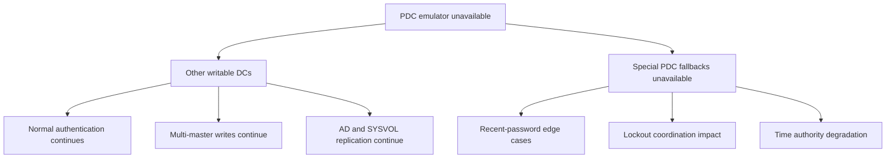
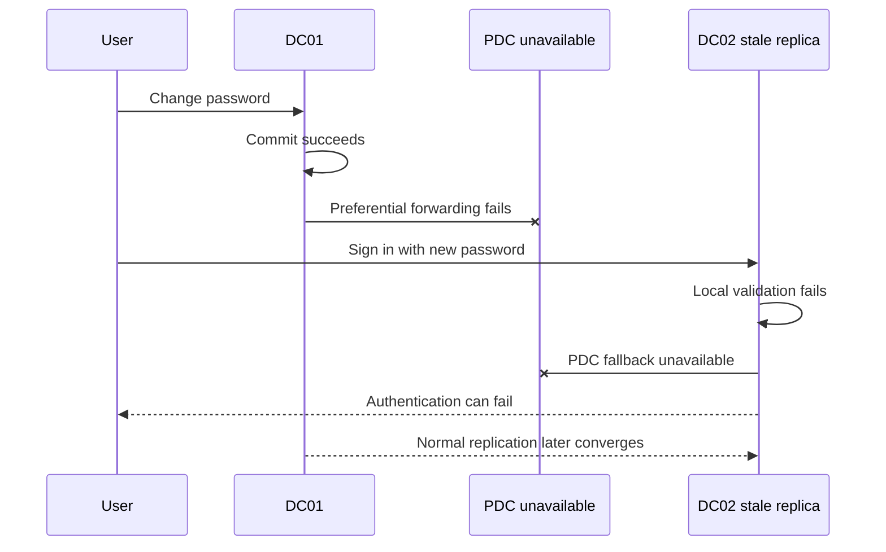

# What Really Happens When the PDC Emulator Is Unavailable?

**Losing the PDC emulator does not stop an Active Directory domain. It removes several coordination and fallback behaviors whose symptoms appear at different times.**

The message `The server holding the PDC role is down` is also less precise than it looks. `dcdiag /test:FSMOCheck` uses DC Locator capabilities, including time-service advertising. A reachable DC can therefore fail that test because it is not discoverable for the requested role or is not advertising as a suitable time source.

> 🎯 **TL;DR**
>
> - Other writable DCs continue normal authentication and directory writes.
> - Recent password changes can fail against stale DCs because PDC fallback is unavailable.
> - Lockout coordination and time hierarchy lose their preferred authority.
> - Group Policy and SYSVOL remain multi-master; the PDC is preferred by tooling, not their only writable copy.
> - Diagnose **ownership**, **reachability**, **advertising**, **replication** and **time** separately.
> - Transfer the role for planned work. Seize it only when the former owner will not return safely.

---

## 🧭 1 — One Role, Several Behaviors

There is one PDC emulator per domain. Its modern responsibilities include:

| Responsibility | Why the PDC matters |
|---|---|
| Recent password changes | Other DCs preferentially forward changes and retry failed validation against it |
| Account lockout | It coordinates authoritative lockout processing for the domain |
| Domain time | It is the preferred domain time authority |
| Forest time root | The forest-root PDC should obtain time from approved external sources |
| Group Policy administration | Management tools normally prefer it to reduce edit conflicts |
| Legacy compatibility | It emulates historical PDC behavior for old clients and applications |

These are not one service. A PDC can answer LDAP while its Netlogon advertising, W32Time state or replication is unhealthy.

---

## 🧱 2 — What Keeps Working?

AD DS remains multi-master. During a temporary PDC outage:

- other writable DCs authenticate users whose current credentials they know;
- Kerberos KDC and Netlogon services continue on other DCs;
- administrators can create and modify ordinary directory objects;
- DNS and normal AD replication continue when their own dependencies are healthy;
- SYSVOL remains available from other healthy DCs;
- clients can locate another DC through DC Locator.



The outage becomes visible through edge cases and duration, not an immediate domain-wide shutdown.

---

## 🔑 3 — Password Changes and Validation

When a password changes on another writable DC, that DC attempts to forward the update preferentially to the PDC emulator. If a different DC later rejects the new password against its stale replica, it can ask the PDC before returning failure.

With the PDC unavailable:

1. the password can still be changed on another writable DC;
2. normal replication still distributes it;
3. preferential PDC forwarding fails;
4. a stale DC cannot use the PDC as its last-chance validator;
5. users can see intermittent failures until replication converges.



This is why the PDC outage can look like a random password problem across sites.

---

## 🔒 4 — Account Lockout

The PDC is central to lockout processing and receives lockout information with special urgency. Its absence does not make passwords universally usable, but it weakens the domain-wide coordination path.

During investigation, query replicas directly rather than treating `badPwdCount` as one replicated global counter:

```powershell
$User = 'alice'
$DomainControllers = Get-ADDomainController -Filter * |
    Where-Object IsReadOnly -eq $false

$Results = foreach ($DomainController in $DomainControllers) {
    Get-ADUser $User -Server $DomainController.HostName `
        -Properties LockedOut, lockoutTime, badPwdCount, badPasswordTime |
        Select-Object @{Name = 'DomainController'; Expression = {
            $DomainController.HostName
        }}, LockedOut, lockoutTime, badPwdCount, badPasswordTime
}

$Results | Format-Table -AutoSize
```

See [Urgent Replication Is Not Immediate Convergence](../Concepts/Urgent%20Replication%20Is%20Not%20Immediate%20Convergence.md) for the replication distinction.

---

## 🕐 5 — Time Does Not Fail All at Once

Domain members normally use the AD DS time hierarchy. The PDC emulator in the forest-root domain is the top of that hierarchy and should synchronize with approved, reliable external time sources.

If it goes offline:

- clocks do not instantly jump or stop;
- systems continue from their last disciplined local clock;
- W32Time attempts source rediscovery according to its configuration;
- accuracy and confidence degrade over time;
- excessive skew can eventually break Kerberos and other signed protocols.

Check runtime state instead of reading registry screenshots:

```powershell
w32tm.exe /query /source
w32tm.exe /query /status /verbose
w32tm.exe /query /configuration
w32tm.exe /monitor /domain:contoso.com
```

After correcting configuration or connectivity:

```powershell
w32tm.exe /resync /rediscover
```

Do not set `AnnounceFlags`, `Type` or public NTP peers from a generic recipe. Group Policy can override local registry values, and Windows Server 2022/2025 behavior must be validated from `w32tm /query /configuration`.

### Source note captures

The following captures are retained from the original troubleshooting note, in their original order. The commands and registry values shown must be assessed against the current guidance above before reuse.


---

## 📁 6 — Group Policy and SYSVOL

The PDC is preferred by Group Policy management tools because directing edits to one DC reduces conflicting administrative changes. It is not the only writable copy of either GPC data in AD or GPT data in SYSVOL.

During an outage:

- clients continue to process already replicated GPOs from healthy DCs;
- AD and DFSR continue their own multi-master replication;
- an administrator can target another DC for management;
- new edits should be minimized until replication and role placement are understood.

Do not infer a DFSR outage from a PDC outage. Diagnose AD replication and SYSVOL/DFSR separately.

---

## 🔎 7 — Diagnose Five Independent Questions

### 1. Who owns the role?

```powershell
Get-ADDomain | Select-Object DNSRoot, PDCEmulator
netdom.exe query fsmo
```

Read ownership from AD, but remember that replicated ownership data does not prove that the owner is operational.

### 2. Can DC Locator discover it as the PDC?

```powershell
$Domain = (Get-ADDomain).DNSRoot
nltest.exe /dsgetdc:$Domain /pdc /force
```

### 3. Is the DC reachable and advertising correctly?

```powershell
$PDC = (Get-ADDomain).PDCEmulator

Resolve-DnsName $PDC
Test-NetConnection $PDC -Port 135
Test-NetConnection $PDC -Port 389
Test-NetConnection $PDC -Port 445

dcdiag.exe /s:$PDC /test:Connectivity /test:Advertising `
    /test:Services /test:NetLogons
```

### 4. Is replication healthy?

```powershell
$PDC = (Get-ADDomain).PDCEmulator
repadmin.exe /showrepl $PDC /all /verbose
repadmin.exe /replsummary
```

### 5. Is time service healthy and advertised?

```powershell
$PDC = (Get-ADDomain).PDCEmulator
w32tm.exe /query /computer:$PDC /source
w32tm.exe /query /computer:$PDC /status /verbose
dcdiag.exe /s:$PDC /test:FSMOCheck /v
```

This sequence distinguishes a dead server from a locator, replication or time-advertising problem.

---

## ⚠️ 8 — Interpreting `dcdiag /test:FSMOCheck`

A typical failure mentions calls such as:

```text
DsGetDcName(TIME_SERVER) failed
DsGetDcName(GOOD_TIME_SERVER_PREFERRED) failed
The server holding the PDC role is down
```

That output does **not** prove that the server cannot answer LDAP, Kerberos or administrative consoles. It proves that the requested locator test did not find a DC advertising the required capability.

Check:

- Netlogon and W32Time service state;
- DNS registration and DC Locator records;
- role ownership replication;
- W32Time source, stratum and last successful synchronization;
- firewall access, especially DNS, RPC and UDP 123;
- policy values overriding local W32Time settings.

The exact failed locator flag is more useful than the final generic sentence.

---

## 🔁 9 — Transfer, Seize or Wait?

| Situation | Action |
|---|---|
| Planned maintenance, owner healthy | Transfer the role |
| Short outage with known recovery time | Monitor and restore the owner |
| Owner permanently lost | Seize onto a healthy, replicated writable DC |
| Forest recovery | Follow the recovery plan; do not improvise from normal operations |

Planned transfer with PowerShell:

```powershell
$TargetDC = 'DC02'
Move-ADDirectoryServerOperationMasterRole `
    -Identity $TargetDC `
    -OperationMasterRole PDCEmulator
```

For a permanent loss, the same cmdlet supports `-Force`, but seizure is a recovery decision. Before acting:

- verify the target has current inbound replication;
- ensure the old owner is isolated if its state is uncertain;
- confirm the new ownership replicated;
- reconfigure and validate the forest-root time authority if applicable;
- do not reconnect the former owner until ownership and replication safety are established.

For a wider disaster, use [Recovering a Single-Domain Active Directory Forest](../How-to/Recovering%20a%20Single-Domain%20Active%20Directory%20Forest.md).

---

## ✅ 10 — Recovery Validation

```powershell
$Domain = Get-ADDomain
$PDC = $Domain.PDCEmulator

Get-ADDomain | Select-Object DNSRoot, PDCEmulator
nltest.exe /dsgetdc:$($Domain.DNSRoot) /pdc /force
dcdiag.exe /s:$PDC /test:Advertising /test:FSMOCheck /v
repadmin.exe /showrepl $PDC /all
w32tm.exe /query /computer:$PDC /source
w32tm.exe /monitor /domain:$($Domain.DNSRoot)
```

Then test the behaviors that matter:

1. Change a lab user's password on a non-PDC DC.
2. Verify preferential convergence and authentication from another site.
3. Confirm lockout handling with a controlled test account.
4. Verify time sources and offsets, not just service status.
5. Open and read a GPO from a management host without making an unnecessary edit.

The reliable conclusion is not "the PDC responds to ping." It is:

> **The role is owned, discoverable, replicated, advertising the required capabilities and performing each critical fallback.**

---

## 📚 References

- [Active Directory FSMO roles](https://learn.microsoft.com/en-us/troubleshoot/windows-server/active-directory/fsmo-roles)
- [Planning operations master role placement](https://learn.microsoft.com/en-us/windows-server/identity/ad-ds/plan/planning-operations-master-role-placement)
- [Windows Time Service tools and settings](https://learn.microsoft.com/en-us/windows-server/networking/windows-time-service/windows-time-service-tools-and-settings)
- [How the Windows Time Service works](https://learn.microsoft.com/en-us/windows-server/networking/windows-time-service/how-the-windows-time-service-works)
- [Seizing an operations master role](https://learn.microsoft.com/en-us/windows-server/identity/ad-ds/manage/forest-recovery-guide/ad-forest-recovery-seizing-operations-master-role)