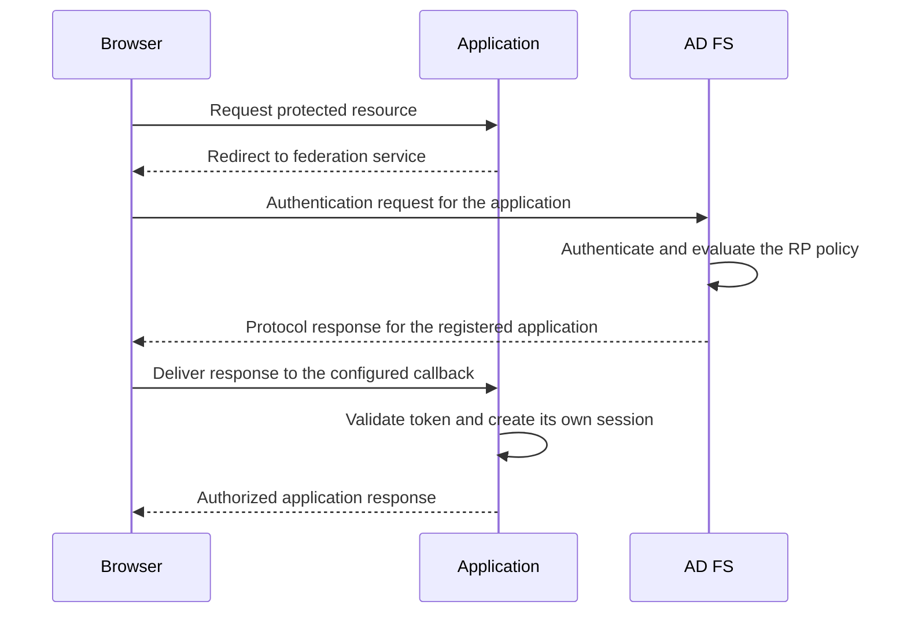
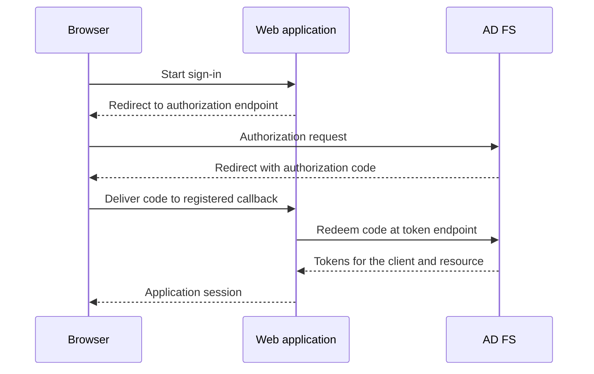

# AD FS Authentication Flows: Trusts, Identifiers, Metadata and Endpoints

**The federation service name, token issuer and application callback can resemble URLs while identifying three different things.**

AD FS authenticates identities and issues tokens that applications validate. Understanding a deployed Windows Server 2022/2025 farm starts with the actors and the selected protocol, not a fixed list of endpoints copied from AD FS 2.0.

This is a technical map of an existing deployment. For the decision to retain or replace federation, see [Do I Really Need ADFS?](Do%20I%20really%20need%20ADFS.md).

> **TL;DR**
> - A claims provider supplies identities/claims; a relying party consumes the resulting token.
> - A federation trust is not an AD DS forest trust.
> - Browser SSO, SOAP token requests and OAuth token exchanges use different conversations.
> - An issuer identifier is not necessarily a network location to visit.
> - Inventory configured endpoints, proxy exposure and real application dependencies separately.

## 1. Name the actors before drawing arrows

| Actor | Responsibility |
|---|---|
| User and browser/native client | Initiate an application or protocol operation and carry some of its messages |
| Identity provider / security token service | Authenticate a principal, apply policy and issue a token |
| Claims provider trust in AD FS | Describe a source of claims, such as the built-in AD provider or another federation service |
| Relying party (RP) / SAML service provider (SP) | Validate tokens issued for that application and make its own authorization/session decisions |
| OAuth client | Request tokens for a resource; may be a public/native client or a confidential server application |
| Resource server / web API | Validate the access token intended for that API and authorize the operation |
| Web Application Proxy (WAP) | Provide the configured external publication/proxy path; not an independent token issuer |

AD FS can rely on an upstream claims provider while acting as the issuer trusted by a downstream application. The roles are relative to each relationship. It does not simply forward the upstream token unchanged: its policy and issuance process determine the token for the downstream RP.

An AD DS trust may enable Windows authentication across domains, but it does not create a SAML relying-party trust. Conversely, two organizations can establish federation without creating an AD DS forest trust or sharing their password databases.

## 2. Separate identifiers from addresses

A URI identifies a resource; some URIs are also URLs that describe a network location. A URN is another URI form used for naming. Do not decide what a field does solely from whether its value starts with `http`.

| Value | Example | Meaning |
|---|---|---|
| Federation service hostname | `fs.corp.example` | DNS/TLS name used to reach the service |
| Federation service identifier | `http://fs.corp.example/adfs/services/trust` | Configured identity used in the applicable federation relationship |
| SAML RP identifier/entity ID | `urn:corp:applications:portal` | Identifies the application/trust; need not be browseable |
| SAML assertion consumer service (ACS) | `https://portal.corp.example/saml/acs` | Address and binding that receive the SAML response |
| OIDC client ID | An assigned application identifier | Identifies the registered client, not necessarily the API audience |
| OIDC redirect URI | `https://portal.corp.example/signin-oidc` | Registered callback used by the authentication flow |
| Token issuer and audience | Protocol/token-specific `iss`/`aud` or SAML fields | Values the consumer must validate against the intended issuer/resource |

An `http://` federation identifier does **not** mean that tokens are transported over unencrypted HTTP. Changing it to `https://` merely to satisfy a string-based scan changes the identity that partners expect. It is a trust migration, not a TLS hardening step.

Do not assume that the OIDC discovery `issuer`, access-token issuer and configured WS-Federation/SAML identifier are textually identical. Read the applicable metadata and validate the token type the application actually consumes.

From an authorized AD FS administration session:

```powershell
Import-Module ADFS -ErrorAction Stop
Get-AdfsProperties -ErrorAction Stop |
    Select-Object HostName, Identifier, FederationPassiveAddress,
        HttpsPort, TlsClientPort, EnableIdpInitiatedSignonPage
```

These are observations, not values to normalize in bulk. Preserve the configuration and partner impact before considering an identifier or hostname change.

## 3. Understand browser-based SSO

In a common SAML HTTP-POST or WS-Federation passive flow, the browser carries the authentication request and the returned token between the application and AD FS:



SSO can avoid another credential prompt because AD FS already has a usable session or can authenticate transparently. It does not mean applications share one session cookie, nor that a successful federation response grants every application permission.

With an upstream identity provider, AD FS may perform home realm discovery (HRD), redirect to that provider, process its response and then issue the downstream token. HRD chooses the identity source; it is not the same thing as choosing the final application landing page through RelayState.

The diagram does not prove that the application needs no connectivity to AD FS. Metadata/key refresh, SAML artifact resolution and other protocol operations may require back-channel communication.

## 4. Keep OAuth and OpenID Connect distinct

OAuth 2.0 supplies an authorization framework for accessing resources. OpenID Connect adds an authentication layer, including an ID token for the client. A JWT is a token format, not a replacement name for either protocol.

| Artifact | Intended consumer | Do not use it as |
|---|---|---|
| ID token | OIDC client | A generic bearer access token for unrelated APIs |
| Access token | The intended resource/API | Proof of a session in every application |
| Refresh token | Authorization server during renewal | A credential to send to an API or publish in troubleshooting output |
| Authorization code | Token endpoint through the selected flow | A reusable application session token |

A confidential web application using Authorization Code makes a direct request to the token endpoint after the browser delivers the code. PKCE binds code redemption to the initiating client flow; a confidential client also uses its configured client authentication.



"Passive" historically describes browser-mediated federation, while "active" describes a client that directly implements a token-request protocol such as WS-Trust. Do not use those labels as synonyms for modern/legacy authentication: an OIDC flow can contain both browser and direct HTTP exchanges.

This article does not recommend obsolete ADAL.js, implicit-grant or password-grant tutorials as the default for a new application. Select a supported library and flow for the actual AD FS version/client; see [AD FS token customization](../How-to/ADFS%20and%20Access_Token%20-%20ID_Token%20Customization.md) for the separate claims topic.

## 5. Map the endpoint to the operation

The following paths are common conventions, not proof that an endpoint is enabled or externally reachable in a particular farm:

| Endpoint or family | Purpose | Common confusion |
|---|---|---|
| `/adfs/ls/` | Browser SAML/WS-Federation operations | The path alone does not identify every protocol message or operation |
| `/federationmetadata/2007-06/federationmetadata.xml` | Federation metadata, including identities, endpoints and public certificates | Not a login page or a private-key export |
| `/adfs/services/trust/mex` | WS-MetadataExchange for applicable active clients | Metadata exchange is not token issuance |
| `/adfs/services/trust/...` | WS-Trust SOAP endpoints with specific versions/credentials | Do not enable all credential variants to fix one client |
| SAML artifact-resolution endpoint | Resolve an artifact through its configured back channel | A browser carrying an artifact is not carrying the full assertion |
| `/adfs/oauth2/authorize` | OAuth/OIDC authorization request | Not the token-redemption endpoint |
| `/adfs/oauth2/token` | Code exchange or another supported token grant | Authentication/authorization requirements depend on the grant/client |
| `/adfs/.well-known/openid-configuration` | OIDC discovery | Not interchangeable with federation XML or WS-Trust MEX |
| `/adfs/discovery/keys` | Public signing-key discovery | Does not contain private signing keys |
| Advertised `end_session_endpoint` | OIDC sign-out | Does not automatically revoke every previously issued token |

TLS server authentication and user certificate authentication are also different. In default binding mode, user certificate authentication uses a non-443 port, commonly 49443; alternate mode uses the `certauth` hostname on 443. Do not infer WAP proxy-trust behavior from that port number.

For the separate TLS, signing and encryption roles, see [AD FS Certificates Explained](AD%20FS%20Certificates%20Explained%20-%20TLS,%20Token%20Signing,%20Token%20Decryption%20and%20Rollover.md).

## 6. Inventory enabled and proxy-published endpoints

```powershell
Get-AdfsEndpoint -ErrorAction Stop |
    Sort-Object Protocol, AddressPath |
    Select-Object Protocol, AddressPath, FullUrl,
        Enabled, Proxy, ClientCredentialType, SecurityMode
```

`Enabled` and `Proxy` are separate configuration observations. A proxy flag does not prove the public DNS, load balancer, firewall and WAP path works. Conversely, an endpoint's presence in this inventory does not prove that applications actively use it.

Do not preserve the historical claim that every AD FS installation has exactly 48 endpoints. Endpoint availability and behavior depend on version, farm behavior level and configuration.

For a change, identify the client/RP dependency, record the before-state, select only the relevant endpoint and use the supported AD FS command. Do not disable every WS-Trust endpoint merely from its name, or enable a password endpoint broadly without understanding its consumers and exposure.

## 7. Inspect the trusts and the right metadata

Keep the inventory focused rather than printing every rule or credential-related property:

```powershell
Get-AdfsRelyingPartyTrust -ErrorAction Stop |
    Select-Object Name, Identifier, Enabled, MetadataUrl,
        MonitoringEnabled, AutoUpdateEnabled

Get-AdfsClaimsProviderTrust -ErrorAction Stop |
    Select-Object Name, Identifier, Enabled, MetadataUrl,
        MonitoringEnabled, AutoUpdateEnabled
```

For an OIDC application, read the actual HTTPS discovery document:

```powershell
$discovery = Invoke-RestMethod `
    -Uri 'https://fs.corp.example/adfs/.well-known/openid-configuration' `
    -Method Get -TimeoutSec 20 -ErrorAction Stop

foreach ($required in 'issuer', 'authorization_endpoint', 'token_endpoint', 'jwks_uri') {
    if ([string]::IsNullOrWhiteSpace([string]$discovery.$required)) {
        throw "Expected OIDC metadata field is missing: $required"
    }
}

$discovery | Select-Object issuer, authorization_endpoint, token_endpoint,
    jwks_uri, userinfo_endpoint, end_session_endpoint
```

Metadata describes supported addresses and public trust material. It does not prove that a partner refreshed its cached signing keys, that a client has a valid registration or that a real user meets the RP access policy.

## 8. Validate one concrete application flow

Record the application, client type, protocol, issuer/resource identifiers, callback, internal/external path and exact time. Then test:

1. DNS and TLS for the name actually used, including any WAP/load-balancer termination.
2. The configured request and callback rather than an arbitrary AD FS welcome page.
3. The actual browser and back-channel legs of the selected flow.
4. Issuer, audience, lifetime, signature and request-correlation checks in the application.
5. The resulting application permissions and session, not merely an AD FS success event.

HAR files, SAML traces and token dumps can contain credentials or usable session material. Keep them private and publish only redacted or synthetic examples.

For browser-policy failures, use [Hardening AD FS HTTP Response Headers](../How-to/Hardening%20AD%20FS%20HTTP%20Response%20Headers%20-%20HSTS,%20CSP%20and%20Validation.md) to distinguish configured headers from those received through WAP or a load balancer.

For landing-page state, use [Understanding RelayState](What%20is%20ADFS%20Relay%20State.md). For session termination and historical SAML captures, use [AD FS Logout Explained](AD%20FS%20Logout%20Explained%20-%20Application%20Sessions,%20Federation%20Cookies%20and%20Single%20Logout.md).

## References

- [Microsoft: AD FS OpenID Connect/OAuth concepts](https://learn.microsoft.com/en-us/windows-server/identity/ad-fs/development/ad-fs-openid-connect-oauth-concepts)
- [Microsoft: Get-AdfsProperties](https://learn.microsoft.com/en-us/powershell/module/adfs/get-adfsproperties)
- [Microsoft: Get-AdfsEndpoint](https://learn.microsoft.com/en-us/powershell/module/adfs/get-adfsendpoint)
- [Microsoft: Get-AdfsRelyingPartyTrust](https://learn.microsoft.com/en-us/powershell/module/adfs/get-adfsrelyingpartytrust)
- [Microsoft: Get-AdfsClaimsProviderTrust](https://learn.microsoft.com/en-us/powershell/module/adfs/get-adfsclaimsprovidertrust)
- [RFC 3986: URI syntax](https://datatracker.ietf.org/doc/html/rfc3986)