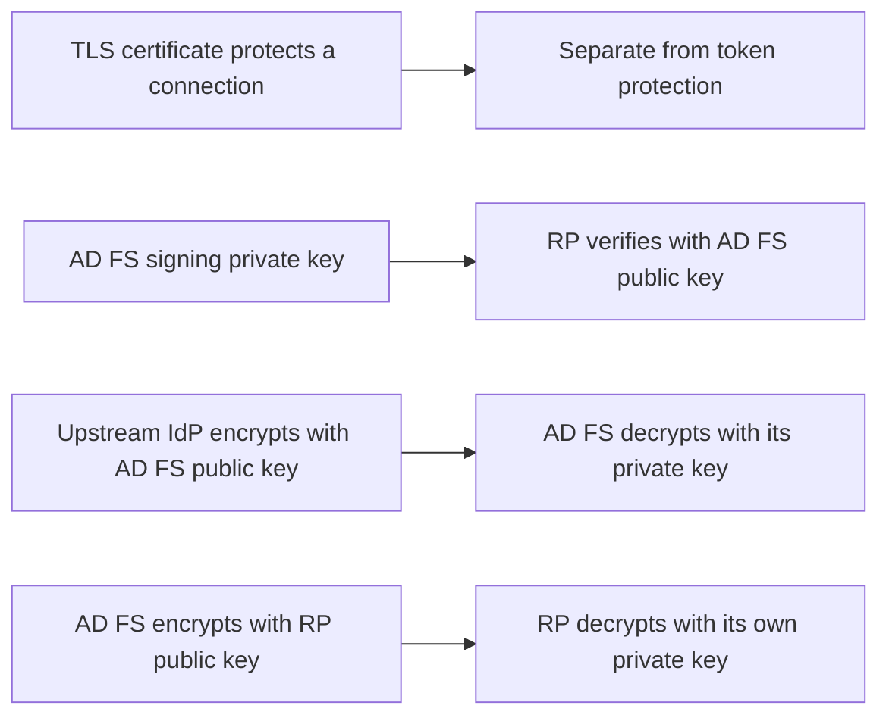
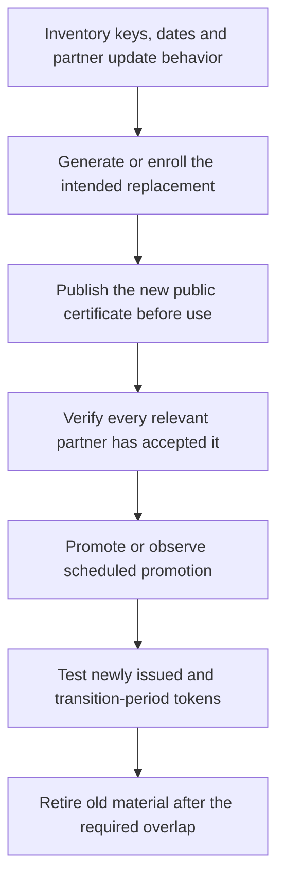

# AD FS Certificates Explained: TLS, Token Signing, Token Decryption and Rollover

**A valid HTTPS certificate does not prove that an application trusts the key signing its tokens.**

AD FS uses certificates for different purposes: TLS, token signatures, incoming-token decryption and proxy registration. Their private-key owners, consumers and renewal workflows differ. Treating them as one certificate change makes a working browser padlock a misleading success criterion.

This guide explains those roles for existing Windows Server 2022/2025 deployments. For binding updates, use the separate [AD FS and WAP TLS replacement procedure](../How-to/ADFS%20and%20WAP%20-%20Replace%20SSL%20Certificate.md).

> **TL;DR**
> - TLS protects the connection; token signing establishes the issuer of the token.
> - AD FS decrypts incoming encrypted tokens with its token-decryption private key.
> - For outgoing encrypted tokens, the recipient's encryption certificate is a different trust setting.
> - Automatic token-certificate rollover is not automatic TLS renewal or proof of partner readiness.
> - Exchange public certificates with federation partners, not PFX files or private keys.

## 1. Separate the roles

| Role | Who uses the private key? | What the other party needs |
|---|---|---|
| AD FS TLS certificate | The TLS-serving AD FS node | Trusted chain and a certificate covering the hostname actually requested |
| WAP federation TLS certificate | The WAP node | Trusted chain and the correct external federation-service name |
| Service Communications record | A separate AD FS configuration surface | Do not treat this record as the source of truth for HTTP.sys TLS bindings |
| AD FS token-signing certificate | AD FS as token issuer | Public signing key/certificate trusted by the token consumer |
| AD FS token-decryption certificate | AD FS as encrypted-token recipient | Upstream sender needs the public encryption certificate |
| RP encryption certificate | The receiving application/RP | AD FS needs the recipient's public encryption certificate when encrypting for it |
| WAP proxy-trust certificate | Registered federation proxy | AD FS validates the separately established proxy credential |

The names describe functions, not necessarily a mandatory count of distinct certificate objects. Do not reuse a key across roles merely because the UI permits it, and do not invent a universal rule that every deployment must contain exactly three certificates.



Signature validation establishes integrity and issuer trust when performed correctly; it does not make the token confidential. Encryption protects content for the recipient but does not replace the required signature, issuer, audience and lifetime checks.

## 2. TLS bindings are not the Service Communications entry

Inspect both surfaces rather than assuming that updating one updates the other:

```powershell
Import-Module ADFS -ErrorAction Stop
Get-AdfsSslCertificate -ErrorAction Stop
Get-AdfsCertificate -CertificateType Service-Communications -ErrorAction Stop
```

In default client-certificate binding mode, user certificate authentication normally uses 49443. In alternate mode it uses `certauth.<federation-name>` on 443. Those are not instructions to run generic WAP proxy-trust traffic on 49443.

Use the appropriate supported TLS cmdlet for the deployment mode. Modern multi-node AD FS updates and per-WAP updates have different scopes. Verify the actual certificate presented for each relevant hostname/path, including any load balancer that terminates TLS.

A TLS certificate must meet the current AD FS certificate requirements, including the requested names and private-key/provider requirements. A wildcard for `*.corp.example` does not cover `certauth.fs.corp.example`. Do not copy every old lab server name into a new SAN list without identifying its purpose.

## 3. Inventory token certificates without exporting secrets

The following helper reports the certificate dates and role while retaining an unknown primary flag as unknown. `WithinDates` is deliberately not called "trusted" or "working": chain/key access, partner trust and actual cryptographic use still need validation.

```powershell
function Convert-AdfsCertificateRecord {
    [CmdletBinding()]
    param(
        [Parameter(Mandatory, ValueFromPipeline)]$Record,
        [datetime]$AsOfUtc = [datetime]::UtcNow
    )

    process {
        $certificate = $Record.Certificate
        if ($null -eq $certificate -or $null -eq $certificate.NotBefore -or
            $null -eq $certificate.NotAfter) {
            throw 'The AD FS record did not contain a certificate with validity dates.'
        }
        $observedUtc = $AsOfUtc.ToUniversalTime()
        $notBeforeUtc = $certificate.NotBefore.ToUniversalTime()
        $notAfterUtc = $certificate.NotAfter.ToUniversalTime()
        $dateState = if ($observedUtc -lt $notBeforeUtc) {
            'NotYetValid'
        } elseif ($observedUtc -ge $notAfterUtc) {
            'Expired'
        } else {
            'WithinDates'
        }

        [pscustomobject]@{
            CertificateType = [string]$Record.CertificateType
            IsPrimary = if ($Record.IsPrimary -is [bool]) { $Record.IsPrimary } else { $null }
            Thumbprint = $certificate.Thumbprint
            Subject = $certificate.Subject
            NotBeforeUtc = $notBeforeUtc
            NotAfterUtc = $notAfterUtc
            DateState = $dateState
            DaysUntilExpiry = [math]::Floor(($notAfterUtc - $observedUtc).TotalDays)
            HasPrivateKeyLocally = $certificate.HasPrivateKey
            ObservedUtc = $observedUtc
        }
    }
}

Get-AdfsCertificate -CertificateType Token-Signing -ErrorAction Stop |
    Convert-AdfsCertificateRecord
Get-AdfsCertificate -CertificateType Token-Decrypting -ErrorAction Stop |
    Convert-AdfsCertificateRecord
```

A local `HasPrivateKey` flag is not a complete test of access by the runtime identity on every farm node. Do not export private keys merely to prove that they exist. Metadata and certificate inventories also reveal infrastructure details; keep unredacted operational output in the appropriate administration record.

For AD FS-generated token certificates, a self-signed certificate is not inherently a TLS configuration defect. Federation partners establish signing/encryption trust through the configured relationship and validated metadata/certificates. That is different from public browser TLS trust.

## 4. Understand automatic rollover and the overlap window

Read the actual configuration instead of assuming every farm uses the historical defaults:

```powershell
Get-AdfsProperties -ErrorAction Stop |
    Select-Object AutoCertificateRollover, CertificateDuration,
        CertificateGenerationThreshold, CertificatePromotionThreshold,
        CertificateCriticalThreshold, CertificateThresholdMultiplier
```

`AutoCertificateRollover` governs AD FS-generated **token-signing and token-decryption certificates**. It does not renew a public-CA TLS certificate, import that certificate into WAP or update a load balancer.

The generation threshold controls when a replacement is generated before expiry; the promotion threshold controls when the generated replacement becomes primary. Verify the configured values and their documented units/behavior for the build, then inspect the actual primary/secondary certificates. Do not calculate a production deadline from an old screenshot alone.

For token signing, AD FS uses the primary signing key for newly issued tokens. Publishing a secondary certificate gives consumers time to accept the new public key before promotion. Consumers must also handle tokens issued with the previous key during the applicable overlap window.

For decryption, the direction is reversed: upstream senders need the right AD FS public key for new encrypted tokens, while AD FS must retain the appropriate private keys for tokens still arriving during transition. Do not remove the old decryption key simply because the TLS certificate changed.



An emergency promotion can invalidate assumptions about partner caches and existing tokens. Do not use `Update-AdfsCertificate -Urgent` as a routine "renew everything" command. This conceptual guide intentionally separates the lifecycle decision from any certificate-changing command.

## 5. Prove that partners have the key they need

```powershell
Get-AdfsRelyingPartyTrust -ErrorAction Stop |
    Select-Object Name, Identifier, MetadataUrl, MonitoringEnabled, AutoUpdateEnabled

Get-AdfsClaimsProviderTrust -ErrorAction Stop |
    Select-Object Name, Identifier, MetadataUrl, MonitoringEnabled, AutoUpdateEnabled
```

These settings describe **this farm's** handling of its partners. They do not prove that an external RP polls your AD FS metadata or has loaded your new signing certificate. Obtain confirmation from that consumer, or test a token signed with the intended key through its real validation path.

| Partner behavior | Required evidence |
|---|---|
| Consumes federation metadata | Actual refresh, cached keys and acceptance of the replacement certificate |
| Pins a certificate/public key | Coordinated update before promotion, with an appropriate overlap |
| Uses OIDC JWKS | Key-set refresh and signature validation using the token's applicable key identifier |
| Sends encrypted tokens to AD FS | Sender is using the intended AD FS encryption certificate and AD FS can decrypt the result |
| Receives encrypted tokens from AD FS | The RP's separate encryption-certificate configuration and its private-key availability |

Transfer only the required public certificate/key material, such as `.cer`. Never send the token-signing PFX, its password, DKM data or an entire credential-bearing database to a relying party.

For Microsoft Entra federation, use the current supported federation-certificate procedure and verify that relationship specifically. A third-party RP test is not a substitute for the cloud federation test.

## 6. Protect the private-key dependencies

AD FS-generated token-certificate material is protected/shared using the configuration database and AD DS DKM resources. The existing [DKM article](Purpose%20of%20DKM%20in%20ADFS.md) explains that mechanism. DKM is not a security boundary against administrators who control the necessary Tier 0 directory, hosts and backups.

Do not generalize that storage path to every TLS certificate or every externally enrolled token certificate. Inventory the actual stores, key providers, access permissions and recovery dependencies on all nodes.

For current TLS updates, supported AD FS TLS cmdlets grant the `adfssrv` principal the required private-key read permission. Externally enrolled token certificates have their own documented service-account access requirements. Granting Full Control to a service account or making all private keys exportable is not a default prerequisite.

## 7. Historical UI captures

The following Contoso lab captures illustrate the UI concepts. The dates and certificate values are historical, not a baseline to copy into a current deployment.

### Certificate categories and promotion

The console separates Service Communications, token-decrypting and token-signing entries. "Set as Primary" changes the selected certificate's role in the applicable lifecycle; it does not mean every partner has already refreshed its trust.


### Read permission is different from Full Control

The historical permissions view shows a read grant for `adfssrv`. Use the current supported certificate-management cmdlet and verify the relevant principal/key provider rather than copying unrelated ACL entries from a lab.


## 8. Diagnose the failed role

| Symptom | Start with |
|---|---|
| Browser TLS warning | Presented certificate, requested name, chain and TLS termination point |
| Valid TLS but RP rejects new tokens | Issuer/audience, signing key, metadata cache and partner validation |
| AD FS cannot process an encrypted incoming token | Sender's selected encryption certificate and AD FS decryption-key availability |
| RP cannot decrypt the token | RP encryption certificate/private key, not AD FS's incoming-token certificate |
| External path fails but internal path works | WAP/load-balancer TLS, publication and proxy-trust evidence |
| Only one farm node fails | Local certificate/key access and incomplete per-node configuration |

Correlate one real application flow with the server logs and exact certificate role. A clean expiry report and an HTTP 200 response are useful observations, not an end-to-end cryptographic test.

## References

- [Microsoft: manage TLS/SSL certificates in AD FS and WAP](https://learn.microsoft.com/en-us/windows-server/identity/ad-fs/operations/manage-ssl-certificates-ad-fs-wap)
- [Microsoft: token-signing and token-decryption certificate lifecycle](https://learn.microsoft.com/en-us/windows-server/identity/ad-fs/operations/configure-ts-td-certs-ad-fs)
- [Microsoft: Get-AdfsCertificate](https://learn.microsoft.com/en-us/powershell/module/adfs/get-adfscertificate)
- [Microsoft: Get-AdfsProperties](https://learn.microsoft.com/en-us/powershell/module/adfs/get-adfsproperties)
- [Microsoft: AD FS requirements](https://learn.microsoft.com/en-us/windows-server/identity/ad-fs/overview/ad-fs-requirements)