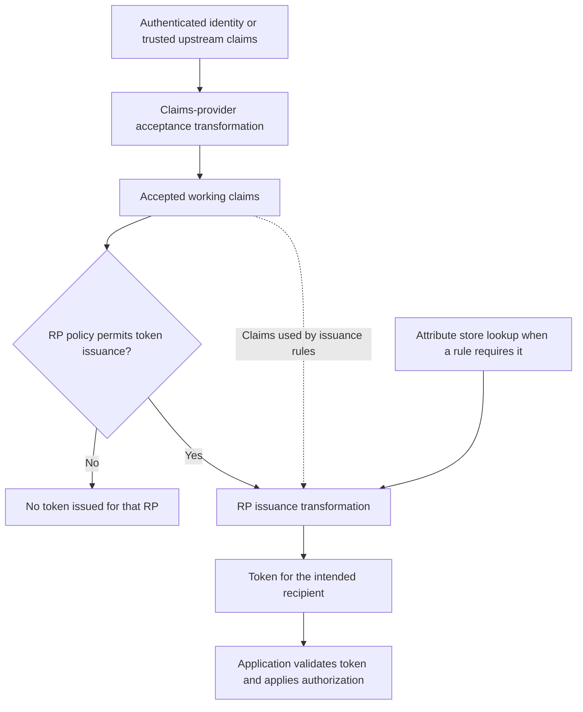

# AD FS Claims Explained: Attribute Stores, Claim Descriptions and Token Issuance

**Adding a claim description does not put that claim in an application's token.**

An attribute can exist in Active Directory, a claim type can appear in the AD FS console, and an application can still receive neither. Those observations concern different stages of the system. Troubleshooting becomes much easier once the directory, the claims engine and the application's token contract stop being treated as one object.

This article explains that model for existing AD FS deployments, including Windows Server 2022/2025. It is not another collection of custom rules: the [claim-rule examples](../How-to/ADFS%20Claim%20rules%20-%20Examples%20and%20Samples.md), [cross-forest group guide](../How-to/ADFS%20Claim%20rule%20cross%20Forest.md) and [OIDC token-customization guide](../How-to/ADFS%20and%20Access_Token%20-%20ID_Token%20Customization.md) cover those separate tasks.

> **TL;DR**
> - An attribute is source data; a claim is a statement made in an identity context.
> - A claim description names and advertises a claim type. It does not query a directory or authorize its release.
> - Claims-provider acceptance, token-issuance authorization and RP issuance transformation answer different questions.
> - `add` creates working data for the current rule set; `issue` also contributes to that rule set's output.
> - The receiving application must validate the token and apply its own authorization. A decoded value is not proof of either.

## 1. Name the objects before following the claim

| Object | Example | What it establishes |
|---|---|---|
| Directory attribute | `division = Research` on a user object | Data stored in a directory; not automatically sent to an application |
| Attribute store | The configured `Active Directory` store | A source that claim rules can query |
| Claim type | `https://claims.corp.example/division` | The meaning of a statement, agreed with its consumer |
| Claim value | `Research` | The statement's data for this subject and issuance context |
| Claim description | Display name `Division` and its claim-type URI | An administrative catalog entry, with metadata-publishing options |
| Claim rule | Mapping, filtering or lookup logic | How a particular rule set processes its available claims |
| Security token | A signed SAML assertion or JWT, depending on the protocol | A protocol artifact carrying claims and security constraints |
| Application session | The application's own session cookie/state | The application's session after it has accepted a sign-in |

A URI used as a claim type is an identifier, not necessarily a URL to fetch. Registering `https://claims.corp.example/division` does not create a web endpoint, an AD schema attribute or a new query.

Within the rule engine, a claim has more context than a label and a value. Its value type and issuer can matter to a condition. A statement from the local AD authority and the same-looking statement from an external claims provider are not automatically interchangeable. The issuer information available to a rule is also not a substitute for validating the enclosing token's issuer at the application.

Claims form a collection, not necessarily a dictionary with one value per type. A user can have several role claims. A missing value, an empty string and several values are different cases that the application contract must define.

## 2. Separate authentication from attribute retrieval

An attribute store provides data. Authentication establishes who the requester is. The same directory may participate in both, but configuring a lookup does not create a new authentication method.

AD FS provides an Active Directory attribute store and supports SQL and custom attribute-store integrations. A rule can use an already established identity to retrieve a department, employee identifier or application entitlement. That lookup still depends on the configured connection, query, permissions and matching key.

| Configuration | Purpose | It does not automatically do this |
|---|---|---|
| Claims provider trust | Establish which identity source and incoming claims AD FS trusts | Publish all incoming claims to every downstream application |
| Attribute store | Supply values during claims processing | Authenticate users merely because their records exist there |
| Relying party trust | Describe a downstream application and its issuance policy | Grant all authenticated users every application role |
| LDAP local claims provider | Support a specific non-AD authentication integration | Follow automatically from adding an attribute store |

Run the following read-only inventories in a Windows PowerShell 5.1 administration session on an AD FS server, with permission to read its configuration:

```powershell
Import-Module ADFS -ErrorAction Stop

Get-AdfsAttributeStore -ErrorAction Stop |
    Select-Object Name

Get-AdfsClaimsProviderTrust -ErrorAction Stop |
    Select-Object Name, Identifier, Enabled
```

The attribute-store inventory intentionally omits its configuration dictionary. Depending on the implementation, that dictionary can contain connection details or credentials. A list of configured names is enough to establish which stores exist; it is not a connection test.

**Verify:** identify the store used by the relevant rule, the identity used as its lookup key and whether it returns the expected number of values. A successful Windows sign-in does not prove that a later SQL lookup succeeds.

## 3. Treat claim descriptions as a catalog, not a release policy

The **Claim Descriptions** node gives claim types a name and description. Its **Publish as Accepted** and **Publish as Sent** options advertise capabilities in federation metadata.

They do not populate claims, run LDAP queries or replace the acceptance and issuance rules for a trust. In particular, publishing a claim as accepted is not permission for every upstream identity provider to assert a privileged value. Publishing it as sent is not a promise that every token will contain it.


*Historical console capture: this is a catalog of claim types, not the contents of a user's token.*

```powershell
Get-AdfsClaimDescription -ErrorAction Stop |
    Sort-Object ClaimType |
    Select-Object Name, ClaimType, IsAccepted, IsOffered
```

Here, `IsAccepted` and `IsOffered` describe the catalog's publishing configuration. Inspect the actual trust policies to establish how a request is processed.

For a custom `Division` claim, distinguish three separate decisions:

1. Define the application's expected claim type, values and multiplicity.
2. Configure the appropriate lookup/transformation and release it to that application.
3. Add or maintain the description when it helps administration and metadata interoperability.

Creating the catalog entry alone completes neither the lookup nor the release. Conversely, a missing friendly label is not proof that a custom rule cannot emit that claim type.


*This historical lab uses the label `Departement` and a Fabrikam example URI. The two checkboxes publish metadata; neither checkbox is an LDAP mapping or a token-issuance rule. The `http://` claim identifier is not the transport used to deliver a token.*

## 4. Follow the claims through the right policy stages

The following is a simplified view of claims-provider and relying-party processing. Authentication, additional authentication and protocol-specific operations are not a single universal sequence of UI tabs.



| Stage | Question it answers | Where to look |
|---|---|---|
| Acceptance transformation | Which statements do I accept from this claims provider, and in what form? | The applicable claims provider trust |
| Issuance authorization | May this requester receive a token for this relying party? | The RP's authorization rules or configured access control policy |
| Issuance transformation | Which claims should this relying party receive? | The RP's issuance transform rules |
| Application authorization | May this signed-in user perform this operation? | The application's own role/permission model |

In the claims-rule model, authorization produces a permit/deny decision that gates issuance. Its output is not simply appended to the user's application claims. The accepted claims are the starting input for the separate issuance-transform rule set.

Access control policies on newer AD FS versions provide another administrative way to express access/MFA conditions. Do not remove a policy merely to make a historical rule editor or script look familiar. First establish which policy surface controls the target RP.

For OAuth/OIDC, identify the application group and the resource/Web API whose issuance policy applies. Do not assume that a SAML RP rule or a claim present in an access token will automatically appear in the client's ID token. Use the [existing token-customization guide](../How-to/ADFS%20and%20Access_Token%20-%20ID_Token%20Customization.md) for that distinction.

## 5. Understand what `add` and `issue` actually mean

Each rule set has its own input and output claim collections. The output starts empty. Rules run in their configured order, and later rules can use claims added by earlier rules.

| Action | Available to later rules in this rule set? | Included in this rule set's output? |
|---|---|---|
| Incoming claim with no matching output rule | Yes | No, not merely because it arrived |
| `add` | Yes | No, unless another rule issues it |
| `issue` | Yes | Yes |

```text
Incoming claims --> working input collection --> rule 1 --> rule 2 --> ...
                              ^                    |          |
                              +------ add ---------+          |
                              +------ issue ------------------+
                                        |
                                        v
                              rule-set output collection
```

The word **issue** is relative to the current rule set. A claim issued by a claims-provider acceptance rule still needs to survive the downstream RP processing; it has not bypassed all remaining rules and landed in the application's token.

Rule ordering matters for temporary values and lookups. A later rule cannot supply a claim retroactively to an earlier rule that already ran. Independent rules may all match, so a rule set is not implicitly an `if/elseif` chain. Likewise, multiple matching claims can produce multiple results.

This is the conceptual foundation behind the existing examples of temporary claims, regular expressions, aggregate conditions and LDAP queries. It is not a reason to copy every incoming claim to every RP.

## 6. Trace one attribute into one application's token

Consider a fictional application, **ClaimsPortal**, that needs a `Division` claim for display and a separate application role for authorization.

| Checkpoint | Expected evidence | Common wrong conclusion |
|---|---|---|
| Source | `LabUser` has the expected `division` value in the authoritative store | The value must already be in the token |
| Lookup identity | The rule queries the intended user, not merely a similarly named record | A successful query proves it selected the correct subject |
| Policy input | The required identity/context claims reach the relevant rule set | Adding a claim description supplies the missing input |
| RP output | The newly issued token contains the agreed claim type and value | A working temporary claim is automatically published |
| Application mapping | The validated identity exposes the expected value to the application | A middleware-friendly display name is the exact on-wire claim type |
| Authorization | The application's own permission check grants only the intended operation | Having a division or group claim grants a role automatically |

To inspect one classic RP without changing its rules:

```powershell
$rpName = 'ClaimsPortal'
$relyingParties = @(Get-AdfsRelyingPartyTrust -ErrorAction Stop |
    Where-Object { $_.Name -eq $rpName })

if ($relyingParties.Count -ne 1) {
    throw "Expected exactly one relying party named '$rpName'."
}

$relyingParty = $relyingParties[0]
$relyingParty | Select-Object Name, Identifier, Enabled, AccessControlPolicyName
$relyingParty | Select-Object IssuanceAuthorizationRules, IssuanceTransformRules
```

The configuration output can contain organizational names and policy details. Read it locally; sharing the entire rule set is not necessary to explain a single missing claim.

**Verify:** obtain a fresh token for the intended recipient and correlate it with the application-side result. Changing an attribute or a rule does not rewrite an already issued signed token, and the application may continue to use its own session.

### Historical example: mapping and observing a Department claim

The two captures below use `Departement`, rather than the fictional `Division` contract above. They illustrate the same distinction between a mapping and its observed result, without introducing another custom-rule recipe.


*The LDAP template links a source attribute to an outgoing claim type. The friendly names shown in the dropdowns are not sufficient to prove the exact claim URI on the wire.*


*Two excerpts from the same historical result view: the column headings and the relevant row. Unrelated account/group rows and issuer columns were removed. This proves what that viewer displayed, not that the viewer correctly validated the token's signature or audience.*

## 7. A group claim is not a Windows access token

An AD group membership can be an input to a federation rule. An application role can be an output derived from that membership. Neither is automatically the same object as the Windows access token that the operating system uses for local authorization.

Choose the application contract deliberately: a SID, a group name, a stable subject identifier and a business role have different meanings and change characteristics. Sending every group creates coupling and increases token size; it does not teach the application what to authorize. Nested and cross-forest membership also require an explicit lookup strategy, addressed in the existing cross-forest guide.

NameID is another protocol-specific contract. For its formats and handling, see [Name identifiers in SAML with AD FS](../How-to/How%20to%20Request%20a%20Specific%20Name%20ID%20Format%20from%20a%20Claims%20Provider%20During%20SAML%202.0%20SSO.md). Renaming an arbitrary claim to `NameID` is not equivalent to meeting that contract.

## 8. Validate the token, not just its decoded contents

A SAML assertion or JWT is not merely a bag of user properties. It also has an issuer, intended audience, validity constraints and protocol-specific protections. The consumer must use an appropriate library to validate the signature, trusted issuer, audience and time conditions, plus the protocol's correlation/replay requirements.

Decoding displays data; validation establishes whether the application should trust it. A JWT's encoded payload is not encryption, and not every token is encrypted. For the separate signing and encryption roles, see [AD FS certificates explained](AD%20FS%20Certificates%20Explained%20-%20TLS,%20Token%20Signing,%20Token%20Decryption%20and%20Rollover.md).

Do not submit live assertions, bearer tokens or session cookies to public decoders. Use local inspection and remove the values from screenshots and examples. Even an expired token can expose personal data and internal application identifiers.

| Symptom | Next distinction to test |
|---|---|
| Claim appears in the console but not in a token | Description/metadata versus actual issuance |
| Lookup returns a value, but the RP receives nothing | Working input versus rule-set output; correct target policy |
| Claim disappears between identity providers | Upstream issuance versus downstream acceptance and reissuance |
| Claim appears in the access token but not the ID token | Resource policy versus OIDC client/token customization |
| User receives a token but gets an application 403 | Token issuance versus application authorization |
| New rule seems to have no effect | Fresh token versus existing token/application session |

## References

- [Microsoft Learn: The role of claims, including claim descriptions](https://learn.microsoft.com/en-us/windows-server/identity/ad-fs/technical-reference/the-role-of-claims)
- [Microsoft Learn: The role of attribute stores](https://learn.microsoft.com/en-us/windows-server/identity/ad-fs/technical-reference/the-role-of-attribute-stores)
- [Microsoft Learn: The role of claim rules](https://learn.microsoft.com/en-us/windows-server/identity/ad-fs/technical-reference/the-role-of-claim-rules)
- [Microsoft Learn: The role of the claims engine](https://learn.microsoft.com/en-us/windows-server/identity/ad-fs/technical-reference/the-role-of-the-claims-engine)
- [Microsoft Learn: Get-AdfsClaimDescription](https://learn.microsoft.com/en-us/powershell/module/adfs/get-adfsclaimdescription?view=windowsserver2025-ps)
- [Microsoft Learn: Get-AdfsAttributeStore](https://learn.microsoft.com/en-us/powershell/module/adfs/get-adfsattributestore?view=windowsserver2025-ps)