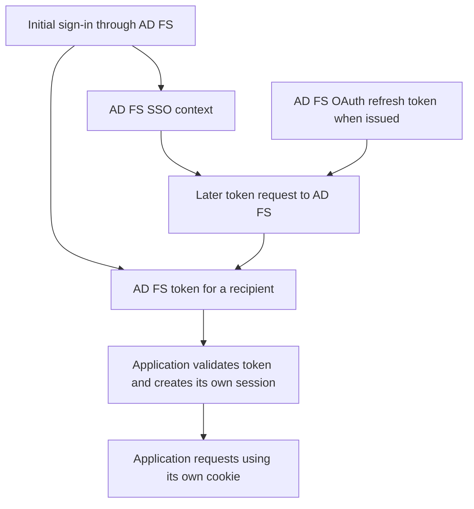

# AD FS Token and Session Lifetimes: SSO, Persistent SSO and KMSI

**A one-hour token does not necessarily mean a password prompt every hour, or a one-hour application session.**

An AD FS sign-in can create several kinds of state, owned by different components. The federation cookie, the issued token, an OAuth refresh token and the application's session do not have one shared expiration clock. Changing the wrong clock can produce more redirects without delivering the expected security outcome.

This guide separates those lifetimes for existing AD FS deployments, including Windows Server 2022/2025. Microsoft's current SSO guidance describes the model introduced with AD FS 2016; older 2012 R2 values are identified as historical, not copied into a modern baseline.

> **TL;DR**
> - `SsoLifetime` governs AD FS browser SSO, not every application's session.
> - Persistent SSO can survive browser sessions. KMSI is one way to obtain persistence on an unregistered device, not a synonym for every form of SSO.
> - A relying party's `TokenLifetime` concerns the issued token, not a global logout deadline.
> - Record settings in their native units and inspect actual issued-token timestamps.
> - AD FS cannot directly revoke another issuer's refresh tokens or an application's independent session.

## 1. Identify the state and its owner

| State | Owner or validator | Used for | Its expiration does not automatically mean |
|---|---|---|---|
| AD FS browser SSO cookie | AD FS | Recognizing an existing authentication context on a later request | Every application cookie is deleted |
| AD FS-issued SAML token or JWT | Intended RP/resource | Accepting a protocol assertion or authorizing an API request | A user must enter a password immediately |
| OAuth refresh token issued by AD FS | AD FS token endpoint | Requesting more tokens within the permitted client/resource context | Every browser session has the same lifetime |
| Application session | Application or its middleware | Keeping a signed-in application session | Its lifetime equals the original assertion's lifetime |
| Entra-issued tokens/session | Microsoft Entra ID and the target resource | Cloud sign-in and access after federation | AD FS settings govern the entire cloud session |



The application may intentionally align its session with token validity, or configure different idle, absolute and sliding expiration behavior. That is an application decision to verify, not a universal AD FS guarantee.

For the underlying claims and issuance model, see [AD FS claims explained](AD%20FS%20Claims%20Explained%20-%20Attribute%20Stores,%20Claim%20Descriptions%20and%20Token%20Issuance.md).

## 2. SSO is not the absence of authentication processing

With a usable AD FS authentication context, a later token request may complete without showing another credential form. AD FS still processes that request and its applicable policy.

If the current request requires MFA and the existing context does not satisfy it, AD FS can require the additional authentication even while an SSO context exists. Conversely, no visible password prompt does not prove that no authentication happened: Windows Integrated Authentication can authenticate silently.

Distinguish these questions when reading a trace:

1. Did the application contact AD FS at all?
2. Did AD FS reuse a context or perform new authentication?
3. Was additional authentication required and satisfied?
4. Did AD FS issue a new token?
5. Did the application create, renew or simply reuse its own session?

Looking only for a password box answers none of these reliably.

## 3. Read the farm before quoting its defaults

Run these read-only examples in Windows PowerShell 5.1 on an AD FS server with permission to read the configuration. Record the server version/build and farm behavior level alongside the result. A newer OS does not by itself prove that the farm has adopted every newer behavior.

The helper below reports whether a property actually exists. It preserves `$false`, zero and `$null` as distinct observations instead of converting a missing property into a plausible default.

```powershell
function ConvertTo-AdfsSessionSnapshot {
    [CmdletBinding()]
    param(
        [Parameter(Mandatory)]
        [psobject]$Properties
    )

    $propertyNames = @(
        'CurrentFarmBehavior',
        'SsoLifetime',
        'PersistentSsoEnabled',
        'PersistentSsoLifetimeMins',
        'DeviceUsageWindowInDays',
        'KmsiEnabled',
        'KmsiLifetimeMins',
        'PersistentSsoCutoffTime'
    )

    foreach ($propertyName in $propertyNames) {
        $property = $Properties.PSObject.Properties[$propertyName]
        $state = if ($null -eq $property) {
            'NotExposed'
        } elseif ($null -eq $property.Value) {
            'Null'
        } else {
            'Observed'
        }

        [pscustomobject]@{
            Property = $propertyName
            State = $state
            Value = if ($null -eq $property) { $null } else { $property.Value }
        }
    }
}

Import-Module ADFS -ErrorAction Stop
$properties = Get-AdfsProperties -ErrorAction Stop
ConvertTo-AdfsSessionSnapshot -Properties $properties
```

An absent value requires checking that version's returned object and help. It is not evidence that the feature is disabled. The helper reports only selected properties and does not dump unrelated connection strings or rules.

| Property returned by the service | Unit or type | Meaning |
|---|---|---|
| `SsoLifetime` | Minutes | Browser session SSO duration |
| `PersistentSsoEnabled` | Boolean | Whether persistent SSO is enabled |
| `PersistentSsoLifetimeMins` | Minutes | Maximum persistent SSO period for the applicable device-based scenario |
| `DeviceUsageWindowInDays` | Days | Device usage window within that persistent SSO model |
| `KmsiEnabled` | Boolean | Whether the AD FS KMSI option is enabled |
| `KmsiLifetimeMins` | Minutes | Persistent SSO duration for KMSI |
| `PersistentSsoCutoffTime` | Date/time | Cutoff for rejecting previously issued persistent SSO state and AD FS refresh tokens |

The getter property and setter parameter are not always named identically: `PersistentSsoEnabled` corresponds to `-EnablePersistentSso`, and `KmsiEnabled` to `-EnableKmsi`. A historical script's property spelling is not a reason to treat an empty result as zero.

## 4. Session SSO, device persistence and KMSI

These are reference points from Microsoft's [AD FS SSO settings guide](https://learn.microsoft.com/en-us/windows-server/identity/ad-fs/operations/ad-fs-single-sign-on-settings), not measurements from your farm:

| Scenario | Documented reference behavior | What must also be true |
|---|---|---|
| Unregistered device, no KMSI persistence | Session SSO is 480 minutes, or 8 hours, by default | The AD FS context and browser session remain usable |
| Unregistered device with KMSI selected | 1,440 minutes, or 24 hours, by default; documented maximum 7 days | KMSI is enabled and selected; persistent SSO is not disabled |
| Registered/authenticated device, AD FS 2016 model | Maximum 90 days, with a 14-day device usage window, by default | AD FS recognizes and validates the device context; persistent SSO remains valid |
| Registered device, historical AD FS 2012 R2 model | 7 days by default | Historical behavior, not a value to impose on a newer farm |

Ninety days is **129,600 minutes**. A remembered number from an old presentation should not overrule either the unit conversion or the actual farm's value.

### Session cookies

A session cookie is intended for the browser session. The server-side validity limit still matters: keeping a browser open does not make an expired AD FS context valid indefinitely.

Closing a window is not a dependable revocation test. Other browser processes, restored sessions and separate application cookies can affect the result. Inspect the actual request and cookie/session behavior instead of assuming that a new window means a clean sign-in.

### Persistent SSO

A persistent cookie can survive browser sessions. The device-based model also has a usage window: an outer maximum period and a shorter inactivity-related device window are different constraints.

An Entra device record, a domain-joined machine or a compliant-device status is not sufficient evidence that this request satisfied AD FS device authentication. Verify the device context that AD FS actually received. Device registration and trust-model deployment are separate topics.

### Keep Me Signed In

KMSI is an AD FS sign-in choice when enabled and available in the relevant forms-based flow. Enabling the feature does not mean every requester selected it. Nor is it the same setting as Entra's browser persistence controls or an application's own "remember me" option.

Microsoft's SSO guidance documents KMSI as disabled and persistent SSO as enabled by default. Treat those as deployment defaults, not as facts about a farm that has been upgraded or customized.

## 5. A relying party's token lifetime is a separate setting

```powershell
Get-AdfsRelyingPartyTrust -ErrorAction Stop |
    Sort-Object Name |
    Select-Object Name, Identifier, TokenLifetime,
        AlwaysRequireAuthentication, AccessControlPolicyName
```

`TokenLifetime` is expressed in minutes. A raw `0` is not proof of a zero-minute token: it can represent use of the service default rather than an explicit override. The current RP cmdlet documentation gives **60 minutes** as the default. Do not substitute the ten-hour value found in much older AD FS material.

The inventory deliberately leaves the raw value visible. To establish actual token validity, inspect a newly issued token's timestamps for the intended application and protocol. For a JWT, compare its relevant issuance/validity fields; for SAML, inspect the assertion conditions and any applicable subject-confirmation constraints. Their meanings and allowed clock skew are not interchangeable.

**Verify:** measure the actual validity interval and the consumer's validation behavior. A generic decoded `exp` field is not a measurement of the application's session timeout.

For OAuth/OIDC application groups, also inspect the applicable Web API/resource configuration instead of assuming that a same-named classic RP controls it:

```powershell
Get-AdfsWebApiApplication -ErrorAction Stop |
    Sort-Object Name |
    Select-Object Name, Identifier, TokenLifetime
```

The resource's access-token settings are not a universal switch for ID tokens, refresh tokens or every application-group component. Keep the distinction described in the [OIDC customization guide](../How-to/ADFS%20and%20Access_Token%20-%20ID_Token%20Customization.md).

`AlwaysRequireAuthentication` is likewise not an application idle-timeout setting. It changes authentication requirements when AD FS receives a relevant request for that RP. It does not cause each HTTP request to the application to revisit AD FS, and it does not by itself specify a particular MFA method. Protocol requests for fresh authentication and the selected authentication method also affect the experience.

## 6. Identify who issued the refresh token

An OAuth refresh token is used at its issuing authorization server, not sent to the business API as an access token. When AD FS issues one, its issuance and renewal behavior depend on the client, resource, device and SSO context.

Microsoft's SSO guide relates AD FS refresh-token expiration to the applicable session/KMSI/device persistence model. That does not mean every grant receives a refresh token, that each redemption restarts an unlimited lifetime, or that the device's maximum persistence equals the validity of every individual refresh token. Inspect the supported flow and its renewal behavior instead of hard-coding one lifetime for all OAuth clients.

In a federated Microsoft 365 sign-in, AD FS authenticates the user to Entra ID. Entra ID then issues its own tokens for cloud resources. A later Entra refresh-token redemption can complete without visiting AD FS. Shortening AD FS browser SSO therefore does not directly shorten all Entra access or refresh tokens.

```text
AD FS-issued refresh token --> AD FS token endpoint --> AD FS-issued token

Entra-issued refresh token --> Entra token endpoint --> Entra-issued token

Application session cookie --> application --> application session decision
```

The token's issuer is the first question to answer, before changing a lifetime setting.

## 7. Walk through an illustrative timeline

Assume a test application has an independently configured session, and AD FS uses an eight-hour session SSO period and a one-hour RP token. These are chosen example values, not a recommendation.

| Time | Observation | Interpretation |
|---|---|---|
| 09:00 | User authenticates; AD FS issues a token expiring at 10:00 | A token validity interval has started |
| 09:00 | Application validates the response and creates its own session | A separate application session has started |
| 10:05 | User loads another page using a still-valid application cookie | The application may serve the request without replaying the expired assertion |
| 10:05 | An API receives the old expired access token | It must not accept that token merely because the browser still has an application session |
| 10:10 | A fresh token request reaches AD FS while its SSO context is usable | Another token may be issued without a credential prompt, subject to policy |
| After the AD FS SSO limit | A later request needs new authentication | The method may be silent WIA or an interactive flow; existing application sessions are separate |

These observations are compatible. Neither "the user is still in the application" nor "the old API token was rejected" proves that the other component's timeout is broken.

## 8. Expiration, logout and revocation are different operations

| Operation or event | Relevant effect | Important boundary |
|---|---|---|
| Issued token expires | Consumer rejects its use outside the permitted validity conditions | Does not rewrite an independent application session |
| Application logout | Application clears/invalidates its own session according to its implementation | May leave AD FS and other application sessions intact |
| AD FS persistent SSO rejected | That context cannot be reused at AD FS | Does not remotely delete every downstream cookie/token |
| `PersistentSsoCutoffTime` advanced | AD FS rejects persistent SSO cookies and its OAuth refresh tokens issued before the cutoff | Farm-wide impact; not a per-RP application-session timeout |
| AD attribute/group changes | Later evaluation can reflect the new data | Existing tokens are immutable snapshots; cached identity/session state can delay the visible change |

Microsoft documents several persistent-SSO rejection conditions, including password changes, device disablement or deregistration, device-certificate issues, disabling persistence/KMSI where applicable, and an administrative cutoff. They matter when AD FS evaluates that state; do not reinterpret them as instantaneous universal revocation at every downstream application.

There is deliberately no bulk cutoff command in this guide. It has a different purpose and blast radius from diagnosing a single application's sign-in frequency.

For protocol-specific logout and its limits, see [AD FS logout explained](AD%20FS%20Logout%20Explained%20-%20Application%20Sessions,%20Federation%20Cookies%20and%20Single%20Logout.md).

## 9. Verify the behavior you actually want

Define the requirement first: maximum token validity, application idle timeout, browser persistence, freshness of an authentication event or interruption after an account change. Those are different requirements.

| Test | Record | What it discriminates |
|---|---|---|
| Initial sign-in | Authentication time, issuing authority, token timestamps, application session creation | Starting state and the clocks involved |
| Token renewal without closing the application | Which authority receives the request; token timestamps | Silent token renewal versus application-cookie reuse |
| New session with KMSI not selected, then selected | Cookie persistence and AD FS request result | Feature availability versus actual user selection |
| Registered-device case versus ordinary browser | Device authentication evidence and relevant farm settings | Device-based PSSO versus merely owning a device record |
| RP requiring fresh authentication | Authentication events, MFA context and visible UX | New authentication versus just a visible prompt |
| Source attribute change followed by a new token request | Claims in the new token and application identity/session | Rule evaluation versus cached context or old token |
| Logout followed by access to two applications | Each application and IdP session independently | Local logout versus federation-wide expectations |

Keep timestamps in a common timezone and account for documented skew and processing delays. Record the baseline, change one relevant setting through its supported management surface, repeat the same cases, and restore the recorded value if the result is not the intended one. Avoid reducing every lifetime at once: it obscures which component actually changed.

## References

- [Microsoft Learn: AD FS single sign-on settings](https://learn.microsoft.com/en-us/windows-server/identity/ad-fs/operations/ad-fs-single-sign-on-settings)
- [Microsoft Learn: Get-AdfsProperties](https://learn.microsoft.com/en-us/powershell/module/adfs/get-adfsproperties?view=windowsserver2025-ps)
- [Microsoft Learn: Set-AdfsProperties parameter definitions](https://learn.microsoft.com/en-us/powershell/module/adfs/set-adfsproperties?view=windowsserver2025-ps)
- [Microsoft Learn: Set-AdfsRelyingPartyTrust, including TokenLifetime](https://learn.microsoft.com/en-us/powershell/module/adfs/set-adfsrelyingpartytrust?view=windowsserver2025-ps)
- [Microsoft Learn: Get-AdfsWebApiApplication](https://learn.microsoft.com/en-us/powershell/module/adfs/get-adfswebapiapplication?view=windowsserver2025-ps)