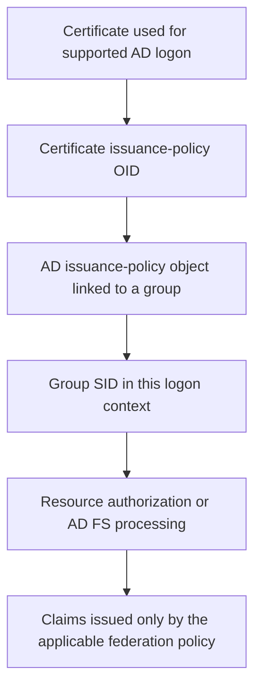

# AD FS and Authentication Mechanism Assurance (AMA)

**AMA represents how a user authenticated, not a permanent membership added to the user's AD account.**

Authentication Mechanism Assurance is an AD DS capability introduced with Windows Server 2008 R2. For the supported certificate-based logon path, an issuance-policy OID in the certificate can cause a linked group's SID to appear in the user's resulting authorization context. AD FS can use that context in an appropriate federation scenario, but the OID is not automatically copied into every SAML assertion or JWT.

## The mechanism in one picture



| Element | Meaning |
|---|---|
| Certificate issuance policy | An OID stating the issuing policy under which the certificate was issued |
| EKU | A different extension constraining intended certificate uses; a Client Authentication EKU is not an AMA group link |
| `msDS-OIDToGroupLink` | Link from an AD enterprise OID object to the associated security group |
| Linked group | The documented AMA design uses an **empty universal security group**, not a conventional group populated with users |
| Resulting group SID | A property of the relevant authentication/token context, not a new value in the user's persistent `memberOf` attribute |

A fictional high-assurance policy could map to an `AMA-High-Assurance` group. A resource can require that SID for a particular operation. A password logon by the same account should not gain the SID merely because that account also owns an eligible certificate.

The assurance is only as meaningful as the PKI issuance controls and the protection of the OID-to-group link. Allowing an inappropriate subject to enroll for the certificate, or changing that link, can change effective access. The words "High Assurance" in a template's display name are not a security guarantee.

## Prerequisites and version boundary

Microsoft's original guide requires the Windows Server 2008 R2 domain functional level and compatible certificate-based logon infrastructure. Treat this as the feature's historical baseline, **not** a recommendation to deploy obsolete clients, CAs on domain controllers or the guide's sample administrative permissions today.

In an existing deployment, verify the actual certificate's issuance policies, the OID object and linked group, compatible logon/KDC behavior, and current chain, revocation and strong account-mapping requirements. AMA does not bypass those certificate-authentication checks. See [user certificate authentication through WAP](../Troubleshoot/AD%20FS%20User%20Certificate%20Authentication%20through%20WAP%20-%20Flow,%20Prerequisites%20and%20Troubleshooting.md) for those separate boundaries.

## Observe the links, without changing them

On an AD administration host with the ActiveDirectory module and directory read permission, select a DC in the intended forest:

```powershell
Import-Module ActiveDirectory -ErrorAction Stop
$directoryServer = 'dc01.corp.example'
$rootDse = Get-ADRootDSE -Server $directoryServer -ErrorAction Stop
$oidContainer = 'CN=OID,CN=Public Key Services,CN=Services,' + $rootDse.ConfigurationNamingContext

Get-ADObject -Server $directoryServer -SearchBase $oidContainer `
    -LDAPFilter '(&(objectClass=msPKI-Enterprise-Oid)(flags=2)(msDS-OIDToGroupLink=*))' `
    -Properties displayName,msPKI-Cert-Template-OID,msDS-OIDToGroupLink -ErrorAction Stop |
    Select-Object DisplayName, DistinguishedName,
        'msPKI-Cert-Template-OID', 'msDS-OIDToGroupLink'
```

This inventories configured links, not effective access. Check that each linked object is the intended empty universal security group and that the actual certificate carries the intended policy. Do not create a link or add members based only on matching display names.

## Prove the result at both boundaries

For the supported Windows logon scenario, compare a fresh password logon and a fresh certificate/smart-card logon by the same test user. In the affected user's session:

```powershell
whoami.exe /groups
if ($LASTEXITCODE -ne 0) {
    throw 'Unable to inspect the current logon groups.'
}
```

**Verify:** the expected AMA SID appears only in the intended logon context. This command reports the local process context; it does not inspect a remote AD FS identity or a federation token.

Then verify the specific AD FS authentication path and its newly issued claims. A directory `memberOf` query is not a reconstruction of dynamic authentication-context membership. Likewise, a successful smart-card Windows logon followed by an unrelated forms sign-in is not proof that AD FS received the earlier assurance context.

The original Microsoft guide demonstrates a legacy AD FS integration. Do not assume its old UI or claim extraction applies unchanged to a current farm. Test the accepted identity context and RP output rather than manually asserting a high-assurance or MFA claim when the mechanism has not been established.

AMA is not synonymous with AD FS MFA, Entra authentication strengths, or the mere presence of an X.509 certificate. For how incoming context becomes outgoing claims, see [AD FS claims explained](AD%20FS%20Claims%20Explained%20-%20Attribute%20Stores,%20Claim%20Descriptions%20and%20Token%20Issuance.md).

## Reference

- [Microsoft: Authentication Mechanism Assurance for AD DS](https://learn.microsoft.com/en-us/previous-versions/windows/it-pro/windows-server-2008-r2-and-2008/dd378897%28v=ws.10%29), archived mechanism and validation walkthrough. The note above retains the concept, not its obsolete deployment recipe.