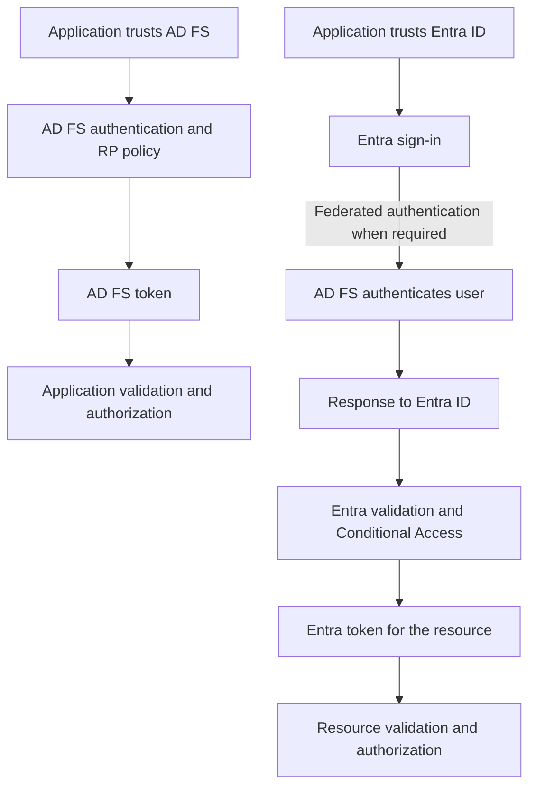
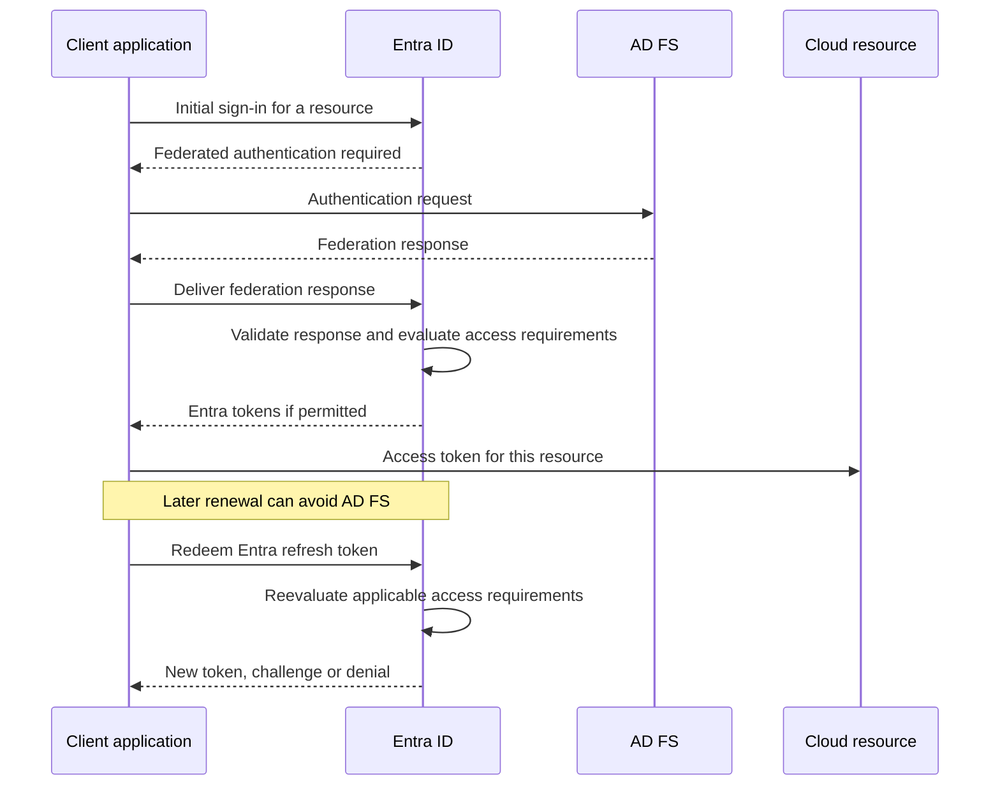

# AD FS and Entra Conditional Access: Where Policies Are Enforced

**Federating a domain to AD FS does not move Microsoft Entra Conditional Access into the federation server.**

AD FS can authenticate a user, require additional authentication and control token issuance to its relying parties. Entra ID can then evaluate a different request, apply Conditional Access and issue its own tokens. The application or resource still has its own authorization and session behavior.

The distinction explains why an AD FS rule can block an initial sign-in yet do nothing to an already established cloud session, and why an Entra Conditional Access policy does not automatically cover an application that trusts AD FS directly.

> **TL;DR**
> - Start with the application's token issuer and actual access path, not the user's federated UPN alone.
> - Use AD FS policy for requests AD FS processes; use Entra Conditional Access for the resources and sign-ins that Entra governs.
> - A cloud token renewal can occur entirely between the client and Entra ID.
> - Federated MFA is an explicit trust decision, not a reason to assume that any `multipleauthn` claim satisfies every authentication requirement.
> - Verify initial sign-in, renewal and resource access separately. A successful first test is not coverage of the whole session.

## 1. Draw the two architectures separately

### Application trusting AD FS directly

An on-premises or SaaS application can trust AD FS as its SAML/WS-Federation identity provider, or use an AD FS OAuth/OIDC application configuration. AD FS policy applies to its requests, and the application consumes the resulting AD FS-issued token.

Entra ID is not automatically in that path. A Conditional Access policy in the same organization's tenant cannot govern a sign-in that never reaches the relevant Entra integration. Merely creating a tenant application object does not reroute the application's authentication.

### Application trusting Entra ID, with a federated user domain

The application uses Entra ID. For the relevant federated authentication path, Entra redirects the user to AD FS and validates its response. Entra then applies its own access requirements and issues tokens intended for the cloud resource.



This is a logical ownership diagram, not a promise of identical redirects on every request. Existing sessions, staged rollout and the selected client/authentication flow can change whether AD FS is contacted.

An Entra preauthentication or migration design can put Entra controls in front of some on-premises access paths. That requires an actual supported integration and verification of alternate/direct paths; it is not a consequence of domain federation alone.

## 2. Assign each control to the component that can enforce it

| Requirement | Primary place to evaluate it | Boundary to remember |
|---|---|---|
| Release a specific claim to an AD FS RP | AD FS issuance policy | Does not make the claim an Entra CA condition |
| Require MFA for a directly federated AD FS application | Its applicable AD FS authentication/access policy | Entra domain-federation settings do not install an AD FS adapter |
| Require controls for a particular Entra resource | Entra Conditional Access | Target the intended resource and include its required dependencies |
| Evaluate supported Entra device compliance or risk signals | Entra Conditional Access and the services supplying those signals | An AD FS network or User-Agent claim is not the same signal |
| Limit what a signed-in user may do in an application | Application/resource authorization | A successful IdP sign-in is not business authorization |
| Reject access after a supported critical event or location change | Resource enforcement and, where supported, Continuous Access Evaluation | Not every resource/client/session combination supports the same behavior |
| Protect AD FS against password spray or abuse of its endpoints | AD FS/WAP and the relevant identity/network protections | Conditional Access is not an edge firewall or a replacement for those protections |

Microsoft documents Conditional Access enforcement after first-factor authentication. It can block access to a resource even when primary authentication succeeded; it is not intended to prevent all traffic or password attempts from reaching an exposed IdP.

For AD FS-side orientation, this read-only command shows the configured RP identities and policy names. Run it in a Windows PowerShell 5.1 administration session on an AD FS server:

```powershell
Import-Module ADFS -ErrorAction Stop

Get-AdfsRelyingPartyTrust -ErrorAction Stop |
    Sort-Object Name |
    Select-Object Name, Identifier, Enabled, AccessControlPolicyName
```

A blank `AccessControlPolicyName` does not prove there is no authorization or MFA requirement. Custom rules, global authentication policy and requirements arriving through the federation protocol also matter. This is an inventory, not an effective-access evaluator.

## 3. Why one AD FS rule is not a Microsoft 365 application policy

In the traditional Microsoft 365 federation relationship, Entra ID is the relying party from AD FS's perspective. That relationship is not one independent AD FS trust for every downstream cloud workload.

Do not treat an AD FS request's User-Agent or a historical client-application claim as an authoritative map of the Entra resource being accessed. Some hints describe the client or protocol rather than the final service, and their availability varies by flow.

This distinction has practical consequences:

- A broad denial on the cloud federation trust can interfere with enrollment, registration or other bootstrap operations, not just the intended business application.
- Allowing a request to that trust does not exempt the user from Entra Conditional Access for the requested resource.
- Resource dependencies can make a single application experience involve several Entra resources. Review the actual sign-in/resource records instead of inferring the target from the window's title.

An AD FS denial can stop that authentication path before Entra obtains a usable response. Entra cannot grant access by overriding that missing authentication result. Conversely, AD FS's successful authentication does not force Entra to grant the final request.

## 4. Renewal is a different request from initial federation

Once Entra has issued an access token and an applicable refresh token, a client can request another Entra token without sending a new authentication request to AD FS.



If fresh federated authentication is required, AD FS can reenter the flow. The important point is that it is not consulted on every renewal or every business API request.

```text
AD FS saw a sign-in from inside the network at 09:00
                         |
                         v
Entra issued its own tokens and the user moved networks
                         |
                         v
Later cloud access does not necessarily revisit AD FS
                         |
                         v
Evaluate location and session requirements where that access is governed
```

Reducing `SsoLifetime` on AD FS does not directly set Entra's token or session lifetimes. See [AD FS token and session lifetimes](AD%20FS%20Token%20and%20Session%20Lifetimes%20-%20SSO,%20Persistent%20SSO%20and%20KMSI.md) for the separate clocks.

Nor should the opposite shortcut be used: Conditional Access is not universally reevaluated for every packet or every request to every application. Token issuance/renewal, session controls, the resource's behavior and supported CAE capabilities determine the relevant enforcement points.

## 5. Federated MFA is a specific trust decision

There are three separate questions:

1. Does this Entra request require MFA or a particular authentication strength?
2. Did the federated identity provider perform and correctly represent an acceptable authentication?
3. Is Entra configured to accept that federated MFA result?

The Microsoft Graph `internalDomainFederation` resource exposes `federatedIdpMfaBehavior`:

| Recorded value | Behavior when an applicable Entra policy requires MFA |
|---|---|
| `acceptIfMfaDoneByFederatedIdp` | Accept the federated IdP's MFA; if it was not performed, Entra performs MFA |
| `enforceMfaByFederatedIdp` | Accept the federated IdP's MFA; if it was not performed, redirect to the federated IdP to perform it |
| `rejectMfaByFederatedIdp` | Do not accept the federated IdP's MFA result for this purpose; Entra performs MFA |

This controls whose MFA result is accepted, not an unconditional prompt on every application request. An acceptable existing authentication/session context and other policies can affect the visible experience. A generic accepted MFA assertion also does not, by itself, prove a phishing-resistant method: verify the authentication-strength requirements and supported method mappings.

Do not turn an absent recorded value into a guessed effective setting. Microsoft documents that:

- When `federatedIdpMfaBehavior` is set, it takes precedence over the older `SupportsMfa` setting.
- When it has never been set, the older setting can still be honored.
- If neither is set, the documented fallback behavior is `acceptIfMfaDoneByFederatedIdp`.

### Read the configuration without changing it

Use a current Microsoft Graph PowerShell installation with `Microsoft.Graph.Identity.DirectoryManagement` and an already authenticated session for the intended tenant. As of this article's date, the Graph list-federation API documents **`Domain-InternalFederation.Read.All`** as its least-privileged read permission. Delegated access also requires a supported role, such as **Security Reader** or **Global Reader**. Check the linked API permissions rather than copying historical broad write scopes.

```powershell
Import-Module Microsoft.Graph.Identity.DirectoryManagement -ErrorAction Stop

$domainId = 'corp.example'
$configurations = @(Get-MgDomainFederationConfiguration -DomainId $domainId -ErrorAction Stop)

if ($configurations.Count -ne 1) {
    throw "Expected one federation configuration for '$domainId'; review the tenant and domain."
}

$configurations[0] |
    Select-Object DisplayName, IssuerUri, PreferredAuthenticationProtocol,
        FederatedIdpMfaBehavior
```

The API can return `404` when no federation configuration exists. A managed domain, a wrong domain/tenant and an authorization failure are not interchangeable diagnoses. The example leaves errors visible and does not create a missing configuration. It also preserves a missing MFA-behavior value instead of filling it with a default.

For an actual change of federation settings, use the separate [federated/managed authentication procedure](../../010%20-%20Entra%20ID/Authentication/Switch%20between%20Federated%20and%20Managed%20Authentication%20in%20Entra%20ID%20with%20PowerShell/Switch%20between%20Federated%20and%20Managed%20Authentication%20in%20Entra%20ID%20with%20PowerShell.md). The observation above does not approve a change of MFA authority or validate an adapter deployment.

## 6. Do not promote weak hints into strong device or application evidence

Historical federation recipes sometimes filter iOS/Office applications with `x-ms-client-user-agent`. User-Agent strings can change, be shared by unrelated applications or be spoofed. Such a filter does not demonstrate that an app is managed or that an Intune app-protection policy is enforced.

Likewise, AD FS's `insidecorporatenetwork` context describes the federation request's relevant path. It is not a permanent location property of the user and not a substitute for the IP/device evidence used by Entra and the resource later in the session.

| Historical shortcut | Better question |
|---|---|
| This User-Agent looks like Outlook | Which supported client, resource and app-protection signals are actually evaluated? |
| AD FS saw an intranet sign-in | What location does Entra and the resource observe for the current request? |
| The device is registered somewhere | Which device identity and trust/compliance state are present in this sign-in? |
| `/adfs/ls/` was used, so all legacy authentication is blocked | What protocol and client flow occurred, and which other authentication paths still exist? |
| The token contains an MFA-looking claim | Which issuer made the statement, why is it trusted, and what requirement does it satisfy? |

For Microsoft 365 mobile access, evaluate the currently supported Conditional Access device/app-protection controls and their client/platform prerequisites. Do not repackage an old User-Agent allowlist as their equivalent.

## 7. Account for Continuous Access Evaluation and session controls

Continuous Access Evaluation (CAE) adds cooperation between Entra ID, supported resources and capable clients. A resource can reject an otherwise unexpired token following a supported event or location-policy evaluation, and the client can process a claims challenge to obtain a new decision.

That is different from simply waiting for an access token's `exp` value. It is also different from assuming that every CA change is enforced everywhere instantly.

- Check the current resource/client support matrix. Support can differ across services used by the same application.
- Distinguish supported critical events from policy edits and group-membership changes, which have their own propagation behavior.
- For location enforcement, verify the supported IP-based conditions and the egress addresses visible to both Entra and the resource. A VPN or proxy can make them differ.
- Sign-in frequency and browser persistence are session controls, not a universal API-token revocation switch or a command to delete every application cookie.
- A direct AD FS RP is not automatically CAE-enabled because its users also have Entra accounts.

For detailed applicability, use the [current CAE documentation](https://learn.microsoft.com/en-us/entra/identity/conditional-access/concept-continuous-access-evaluation) rather than a fixed list copied from an older slide.

## 8. Prove the policy at each relevant point

Begin with the intended outcome, such as "a user on an unmanaged device cannot access this Entra resource". Then identify the user, client, resource, device state and network path that make the test meaningful.

| Test | Evidence to collect | What it can reveal |
|---|---|---|
| Fresh interactive sign-in | AD FS result where involved; Entra sign-in resource, authentication details and CA results | Which service actually required or denied something |
| Existing cloud session or refresh-token renewal | Entra non-interactive sign-in/renewal evidence and resource result | Access that does not depend on a fresh AD FS authentication |
| Allowed-to-disallowed network change | IPs seen by Entra/resource, CA/CAE applicability and subsequent access result | Whether ongoing location enforcement matches the intended design |
| Expected managed versus unmanaged device | Device identity/compliance details for the actual sign-in | A missing device signal mistaken for policy failure |
| MFA satisfied at IdP versus required in Entra | Recorded federation behavior and Entra authentication details | Who performed MFA and why it was accepted |
| Enrollment or registration bootstrap | The actual dependency/resource requests and policy results | A broad restriction that prevents the device becoming compliant |
| Direct AD FS application | Its own authentication, policy and application logs | A path outside the assumed Entra controls |

Correlate timestamps and the request identifiers available at each service, but do not assume one Activity ID is carried unchanged through every AD FS, Entra and application log. Protect the logs' identifiers and token/session data when sharing evidence.

Use **report-only** to evaluate supported Entra policy scenarios before enforcement and inspect the corresponding sign-in results. "Not applied" is not "passed"; identify the unmatched conditions or exclusions. A report-only failure is a predicted result, not an enforced block, and another enabled policy may determine the actual outcome.

Report-only is not entirely invisible in every case: Microsoft's documentation notes that compliant-device evaluation can still cause device-certificate selection prompts on some platforms. It also does not provide an equivalent simulation mode for arbitrary AD FS custom rules.

After evaluating the results, use a limited deployment and verify the same cases with enforcement enabled. Preserve the existing control until its replacement demonstrably covers the intended access, including bootstrap and alternate paths. Keep a viable administrative recovery path while changing identity policy.

## 9. Choose the right place without duplicating the rule catalog

For applications that trust AD FS directly, continue to use the appropriate AD FS policy and the application's own authorization. For resources governed by Entra ID, design the relevant Conditional Access controls in Entra and verify how federation and MFA satisfy their prerequisites.

Using Entra Conditional Access does not require moving the domain to managed authentication first. Conversely, moving to managed authentication does not automatically migrate every direct AD FS RP or repair all application dependencies.

The [existing Conditional Access guide](../../010%20-%20Entra%20ID/Conditional%20Access/Advanced%20Conditional%20Access%20How%20Entra%20Decides%20in%20a%20Zero%20Trust%20World.md) covers broader policy design. The purpose here is narrower: know which component observes the request, which authority issues the token and which policy can still affect the resource being used.

Conditional Access requires the applicable Entra licensing; Microsoft's overview lists P1 for the feature and P2 for Identity Protection risk-based policies. Device/app-protection scenarios can require additional product licensing. A federation topology is not a substitute for those prerequisites.

## References

- [Microsoft Learn: Conditional Access overview](https://learn.microsoft.com/en-us/entra/identity/conditional-access/overview)
- [Microsoft Graph: internalDomainFederation and federatedIdpMfaBehavior](https://learn.microsoft.com/en-us/graph/api/resources/internaldomainfederation?view=graph-rest-1.0)
- [Microsoft Graph: List domain federation configuration and permissions](https://learn.microsoft.com/en-us/graph/api/domain-list-federationconfiguration?view=graph-rest-1.0)
- [Microsoft Learn: Continuous Access Evaluation](https://learn.microsoft.com/en-us/entra/identity/conditional-access/concept-continuous-access-evaluation)
- [Microsoft Learn: Conditional Access report-only evaluation](https://learn.microsoft.com/en-us/entra/identity/conditional-access/concept-conditional-access-report-only)