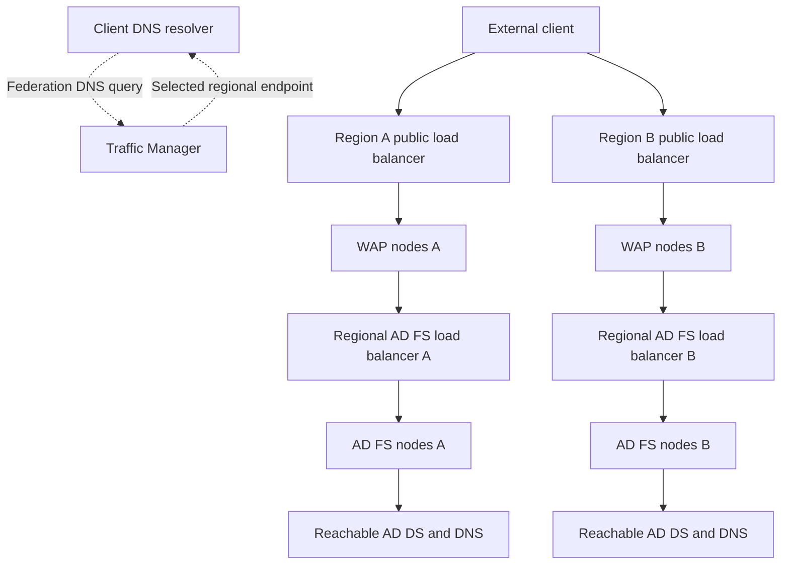

# AD FS in Azure: High Availability and Traffic Manager

**Two public endpoints do not make two independently functioning identity services.**

Azure Traffic Manager can direct new DNS resolutions toward an available regional AD FS/WAP deployment. It does not proxy sign-ins, replicate configuration, make a domain controller reachable or move an existing TCP connection. A useful architecture separates those responsibilities before choosing a routing method.

This guide modernizes a historical cross-region AD FS design. It describes an existing federation service deployed on Azure VMs, not an application-development tutorial or an automated infrastructure deployment. Confirm current Windows Server, farm behavior level, Azure service and database support for the chosen design.

## 1. Separate global DNS from regional traffic



The client uses one selected regional path, not both on each request. Traffic Manager is shown on the DNS path only. Configuration replication, database connections and directory replication are additional dependencies, deliberately omitted from the traffic diagram and addressed below.

| Layer | Responsibility | Does not provide |
|---|---|---|
| Public federation DNS and Traffic Manager | Select a regional endpoint for a DNS response | TLS termination, token validation or connection migration |
| Regional public load balancer | Distribute federation traffic to WAP nodes | A working AD FS farm behind an otherwise responsive WAP |
| WAP | Publish supported federation endpoints and authenticate as the registered proxy | Directory or database availability |
| Regional internal load balancer | Select an AD FS node | Replication of that node's configuration or keys |
| AD FS, AD DS and database design | Authentication, policy and token issuance | Automatic coordination of unrelated farms simply sharing a hostname |

Use supported zone-aware or other fault-isolation choices inside a region as well as regional redundancy. A second region is not a substitute for avoiding a single VM, DC, network appliance or database failure in the active region. Size surviving capacity for the expected failover load.

## 2. Keep one federation identity and an explicit state model

The public name, for example `fs.corp.example`, identifies the federation service the clients and partners expect. The regional endpoint DNS names are routing targets, not new issuer identities to substitute into requests or metadata.

Each serving path must present the correct certificates and honor the same intended trust, keys, policies and application configuration. WAP registration, service-account access, custom authentication providers, theme resources and operational configuration all need to be included in the design.

Do not create two independent AD FS farms, give them the same public name and assume Traffic Manager makes their issued tokens or sessions interchangeable. An independent-farm disaster-recovery design needs an explicit supported state/keys/partner strategy. That is different from distributing nodes of one farm across regions.

### WID versus SQL

| Configuration-store model | Cross-region question |
|---|---|
| WID | Which node is the writable primary, how do secondary nodes synchronize, and what is the tested process when that primary/region is unavailable? |
| SQL | Which database topology, listener and failover process are supported, and can each AD FS node reach the active database under regional failure? |
| Independent recovery deployment | Which configuration, certificates, keys and dependencies are restored, and how is cutover validated without conflicting active state? |

A WID secondary can serve requests using its replicated configuration; this does not make it a second writable primary or eliminate configuration/renewal dependencies. Do not assume automatic promotion or make policy changes on an isolated stale replica. SQL availability likewise depends on a deliberate supported database design, not merely a connection string copied into another region.

For a confirmed WID farm, record synchronization roles on the relevant AD FS nodes:

```powershell
Import-Module ADFS -ErrorAction Stop
Get-AdfsSyncProperties -ErrorAction Stop
```

AD DS replication, configuration synchronization, SQL connectivity and administration still require their appropriate network paths. A statement in an old architecture example that no direct regional VNet connection is needed is not a general statement that these dependencies need no connectivity. The path may be transitive through other networks, but it must exist and survive the failures the design claims to tolerate.

## 3. Keep regional authentication dependencies local where practical

Place sufficient AD DS/DNS capacity so that a regional AD FS node does not unnecessarily depend on a single distant DC for routine authentication. Model AD sites, trusts, GC requirements, replication and the relevant writable-DC operations. Also consider outbound access to PKI revocation endpoints and MFA providers.

```text
Regional endpoint reachable
    + WAP trust and federation path
    + AD FS configuration and usable private keys
    + directory / DNS / time
    + database and replication dependencies
    + PKI and any external MFA dependencies
    = a candidate working authentication path, to be tested end to end
```

Local replicas do not prove freshness or independent operability. Document how password/account changes and policy changes reach the surviving region, and which management operations are unavailable during an outage. Include those limitations in the recovery objectives.

## 4. Preserve the hostname and TLS model

The public federation name can point to the Traffic Manager profile through the documented public DNS pattern. The user's HTTPS request still uses the federation hostname: it must not switch to an arbitrary regional IP or `trafficmanager.net` name as the expected TLS identity.

Internal DNS and the WAP-to-AD FS route must remain deliberate. WAP should reach the intended internal farm rather than loop back to its own public endpoint. Internal Windows authentication has its own DNS/SPN requirements; a public Traffic Manager CNAME is not a recipe to replace every intranet record.

Microsoft's AD FS requirements exclude TLS termination at the load balancer on the federation path. Preserve the supported SNI/TLS behavior. AD FS and WAP also have certificate/key consistency requirements when proxying WIA or using extended protection; follow the [WAP architecture guide](Web%20Application%20Proxy%20Explained%20-%20AD%20FS%20Proxy,%20Preauthentication%20and%20Application%20Publishing.md), not a generic HTTPS-offload pattern.

When used, `certauth.<federation-name>` and device-registration names require their own correct DNS, certificate coverage and routing. A forms sign-in on 443 does not test every certificate-authentication path.

## 5. Choose routing and understand its failure behavior

| Routing method | Suitable question | Important limitation |
|---|---|---|
| Priority | Which healthy region should normally serve the federation name? | Cached answers and existing connections can keep using the previous region |
| Performance | Which eligible regional endpoint is preferred by the service's latency mapping? | Not a measurement of the current AD FS authentication transaction or server load |
| Weighted | How should new eligible DNS decisions be distributed? | Weight is not a guaranteed percentage of user sessions or HTTP requests |
| Geographic | Which deployment should serve a defined geography? | Do not assume automatic alternate-region failover; geographic mappings may need nested profiles for the intended resilience |

DNS decisions often reflect the querying recursive resolver and supported client-subnet information, not simply the browser's visible physical location. Test from the actual client networks and resolvers.

The historical note's claim that Traffic Manager accepts **only DNS-label endpoints** is too broad for the service's current capabilities. Select the supported Azure, external or nested endpoint type and its appropriate target. Retain a regional DNS label where required by that Azure-resource integration; do not turn an old portal screenshot into a universal limitation.

Failover time includes detection, DNS TTL/cache expiry and client reconnection behavior. Lowering TTL does not terminate existing sessions or guarantee a fixed recovery time. Test failback too: a returning endpoint may receive traffic again before its entire identity stack is ready.

## 6. Do not overstate health probes

The documented AD FS/WAP load-balancer probe is HTTP `/adfs/probe`, commonly on port 80. It is a local, unauthenticated health response, **not a complete test of backend services**. Publishing that probe for the monitoring path does not mean publishing password authentication over HTTP.

| Check | What it can establish | What it cannot establish alone |
|---|---|---|
| Local AD FS/WAP probe | The probed service/listener responds | Successful directory access, WAP trust renewal, database operation or user authentication |
| Traffic Manager HTTP/HTTPS probe | Configured status/path responds from monitoring locations | All authentication flows or application permissions work |
| Traffic Manager TCP probe | The endpoint accepts a connection | A valid HTTPS certificate or completed federation exchange |
| Fresh synthetic sign-in | The selected identity/client/RP path works at that time | Every other RP, certificate flow or MFA provider works |

Traffic Manager HTTPS monitoring checks for a TLS connection/certificate presence but **does not validate the certificate's trust or validity**. Use separate certificate monitoring. Configure expected status codes deliberately: treating a redirect to an error or login page as healthy can conceal a fault.

There are two monitoring layers: Traffic Manager evaluates the regional endpoint, and the regional load balancer evaluates its nodes. Neither should depend on an assumed transitive meaning of the other's HTTP 200. Allow probe traffic through the required rules, using the maintained `AzureTrafficManager` service tag where appropriate, without exposing unrelated administration endpoints.

**All-degraded behavior matters:** when all eligible endpoints are degraded, Traffic Manager can return endpoints on a best-effort basis as if they were online. A DNS answer is therefore not proof that a healthy region exists. Inspect endpoint status, monitoring configuration and synthetic authentication together.

## 7. Verify routing and actual federation separately

From a representative Windows client or diagnostic host, these read-only queries show DNS observations, not an authentication result:

```powershell
$federationName = 'fs.corp.example'
Resolve-DnsName -Name $federationName -Type CNAME -DnsOnly -ErrorAction Stop
Resolve-DnsName -Name $federationName -Type A -DnsOnly -ErrorAction Stop
```

A design using an alias/flattened record might not return a CNAME; inspect the actual record type rather than diagnosing an outage from that query alone. Record resolver and TTL information and correlate the resolved endpoint with the node handling the sign-in. `ping` is not a federation health test.

| Failure exercise | Evidence required |
|---|---|
| One WAP or AD FS node unavailable | Regional load balancer excludes it; new sign-ins succeed on another node |
| One regional public endpoint unavailable | Endpoint status changes; new resolutions and connections use the expected surviving path |
| Directory or database dependency unavailable | Monitoring detects the actual authentication failure even if the local probe remains positive |
| WID primary/configuration path unavailable | Known behavior for current authentication, configuration changes, renewal and recovery |
| Regional network partition | Defined source of truth, state freshness and recovery; no accidental competing writable configuration |
| Region returns | Trust/configuration/certificates are ready before normal traffic and management resume |

Use a real intended RP and fresh authentication, not just an existing browser session or the IdP-initiated test page. Include MFA, user-certificate authentication and application publishing when they are part of the service. Do not enable extra endpoints merely to obtain a convenient probe.

Recovery capability is another layer: retain and test version-compatible backups and the key material required by the chosen recovery process. The [existing Rapid Restore guide](../How-to/ADFS%20Migrate%20from%20WID%20to%20SQL%20via%20Rapid%20Restore%20Tool%20-%20Parallel%20deployment.md) describes a separate restoration/migration workflow, not automatic regional failover.

## References

- [Microsoft Learn: Cross-geographic AD FS and Traffic Manager design](https://learn.microsoft.com/en-us/windows-server/identity/ad-fs/deployment/active-directory-adfs-in-azure-with-azure-traffic-manager), historical deployment example; interpret its assumptions against the chosen farm and current Azure features.
- [Microsoft Learn: How Traffic Manager works](https://learn.microsoft.com/en-us/azure/traffic-manager/traffic-manager-how-it-works)
- [Microsoft Learn: Endpoint monitoring, failover and all-degraded behavior](https://learn.microsoft.com/en-us/azure/traffic-manager/traffic-manager-monitoring)
- [Microsoft Learn: AD FS requirements, including TLS and local probes](https://learn.microsoft.com/en-us/windows-server/identity/ad-fs/overview/ad-fs-requirements)
- [Microsoft Learn: Federation server farm using WID](https://learn.microsoft.com/en-us/windows-server/identity/ad-fs/design/federation-server-farm-using-wid)