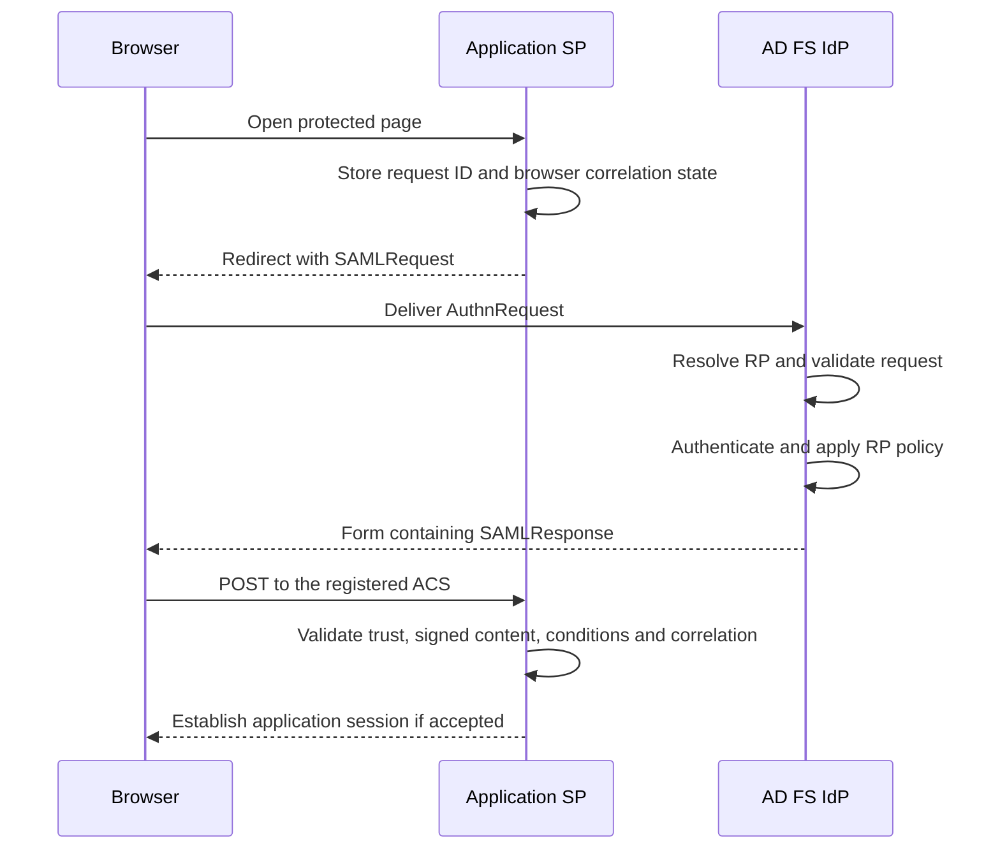

# SAML 2.0 with AD FS: Assertions, Bindings and Request/Response Validation

**A readable assertion, a successful AD FS sign-in and an accepted application session are three different results.**

SAML troubleshooting often starts with a captured `SAMLResponse` and the question "why does the application reject this?" The answer can be in the trust, the binding, the recipient, the request correlation or the signature. A claim rule is not a universal repair tool for all five.

This guide explains SAML 2.0 Web Browser SSO with AD FS as the identity provider for an existing relying party. It covers the protocol and its operational checks, not application development. The AD FS configuration examples are read-only and intended for existing Windows Server 2022/2025 deployments; verify the actual farm version, partner implementation and metadata rather than assuming every SAML feature is enabled.

> **TL;DR**
> - An assertion contains statements; a protocol defines messages; a binding carries them; a profile defines a usable scenario.
> - The SP entity ID, ACS URL, message destination and assertion recipient have different jobs.
> - Validate the exact signed content that is consumed, with the trusted issuer's key. Merely finding a signature is not validation.
> - A solicited response must correlate with the original request and browser transaction. IdP-initiated SSO is a different case, not a reason to disable correlation globally.
> - HTTPS, XML signatures and assertion encryption solve different problems. A successful SAML status does not replace any required check.

## 1. Separate the four layers

| Layer | Question answered | Examples |
|---|---|---|
| Assertion | What does an issuer say about a subject, under which conditions? | Authentication statement, attributes, audience and validity conditions |
| Protocol | Which request/response operation is taking place? | `AuthnRequest`/`Response`, `LogoutRequest`/`LogoutResponse`, `ArtifactResolve`/`ArtifactResponse` |
| Binding | How is that message carried? | HTTP-Redirect, HTTP-POST, HTTP-Artifact and SOAP |
| Profile | How are assertions, protocols and bindings combined for a use case? | Web Browser SSO, Single Logout |


*Historical diagram retained from the source notes. The nested boxes represent conceptual layers, not the XML nesting inside a SAML response.*

An assertion can contain an `AuthnStatement` describing authentication, an `AttributeStatement` carrying attributes, or an `AuthzDecisionStatement` describing an authorization decision. The existence of that last statement type does not mean that every AD FS browser-SSO assertion carries the application's business permissions. The application still applies its own authorization contract.

**SAML assertion format is not synonymous with SAML 2.0 SSO protocol.** WS-Federation or WS-Trust can carry SAML tokens without using a SAML 2.0 `AuthnRequest`/`Response` exchange. An older diagram showing Office, MEX or a WS-Trust `usernamemixed` endpoint is not a diagram of the browser-SSO flow below.

On AD FS, `/adfs/ls/` can participate in different browser federation operations. Inspect the actual message and parameters: a SAML `SAMLRequest` or `SAMLResponse` is not the same exchange as WS-Federation parameters such as `wa`, `wtrealm` and `wresult`. See [AD FS authentication flows](AD%20FS%20Authentication%20Flows%20-%20Trusts,%20Identifiers,%20Metadata%20and%20Endpoints.md) for the wider protocol map.

## 2. Identify the actors and the names they compare

The **principal** is the user. The **identity provider (IdP)** authenticates that principal and issues assertions. The **service provider (SP)** consumes those assertions; in AD FS administration, that downstream application is represented by a **relying party trust (RP)**.

The browser carries messages, but is not the authority that makes their contents trustworthy. WAP can provide the external publication path without becoming a separate SAML issuer. If AD FS relies on an upstream IdP, there is another trust relationship and another issuance step; do not assume the original assertion is forwarded unchanged.

| Item | Fictional example | Meaning |
|---|---|---|
| IdP entity ID / expected issuer | `http://fs.corp.example/adfs/services/trust` | The configured identity the SP trusts, not necessarily a browseable address |
| IdP SSO endpoint | `https://fs.corp.example/adfs/ls/` | Address to which the browser sends the authentication request for the chosen binding |
| SP entity ID / RP identifier | `urn:corp:claimsportal` | Identity of the application, normally also an allowed assertion audience |
| Assertion Consumer Service (ACS) | `https://claims.corp.example/saml/acs` | SP endpoint receiving the SSO response |
| Single Logout endpoint | A separately registered SLO URL | Logout destination, not an interchangeable ACS |
| Metadata URL | The configured federation metadata location | A document describing identities, supported endpoints and public keys |

An `http://` identifier is not evidence of plaintext token transport. Nor should an administrator replace the SP entity ID with its ACS URL simply because both appear in a configuration form. Compare identifiers as agreed by the partners; do not normalize scheme, case or trailing slashes merely to make two strings look alike.

The IdP must resolve or validate the requested ACS against the trusted RP configuration. A request's return address is not permission to post an assertion to an arbitrary location.

## 3. Follow an SP-initiated browser exchange

The common example below uses HTTP-Redirect for the request and HTTP-POST for the response. The request binding and response binding need not be the same.



An existing AD FS session or Windows Integrated Authentication may remove a visible credential prompt. It does not remove the protocol exchange or the SP's validation duties.

AD FS issuing a response and the SP accepting it are separate checkpoints. An HTTP 200 may merely deliver an auto-submit form or an error page. Read the SAML status and the receiving application's result as well.

## 4. Know what the binding puts on the wire

| Binding | What is carried | Inspection consequence |
|---|---|---|
| HTTP-Redirect | Message in URL parameters; the common DEFLATE encoding compresses the XML, then Base64-encodes and URL-encodes it | Decode according to the binding. Do not apply the POST decoding procedure blindly |
| HTTP-POST | Base64-encoded XML in a form field such as `SAMLResponse` | This binding does not apply the Redirect binding's DEFLATE step. An encrypted assertion can remain unreadable after Base64 decoding |
| HTTP-Artifact | A reference, commonly in `SAMLart`, rather than the complete protocol message | The receiver resolves it using the partner's artifact-resolution service; browser traffic alone is insufficient |
| SOAP | A direct message exchange, for example artifact resolution | Server-to-server connectivity, trust and binding-specific protections matter |

Base64 is encoding, not encryption. For Redirect signatures, the signed input includes the binding-defined encoded query parameters and their ordering. Re-serializing the decoded XML or reconstructing a "cleaner" URL is not a valid way to reproduce that signature input.

```text
HTTP-POST example:
AD FS --> browser carrying SAMLResponse --> SP ACS

HTTP-Artifact example:
AD FS --> browser carrying SAMLart --> SP ACS
                                      |
                                      +--> IdP artifact-resolution service
                                      <-- resolved protocol message
```

Artifact resolution changes the communication path; it does not remove assertion validation. Check that the binding is supported and configured by both partners before diagnosing a missing back-channel request as a network defect. The generic protocol's capabilities are not proof of this farm's configuration.

`RelayState` accompanies some bindings to preserve transaction or navigation state. It is not the assertion's audience, a user identity or a substitute for request correlation. It also needs integrity protection and constrained handling when used to derive a redirect URL. See the [existing AD FS RelayState guide](What%20is%20ADFS%20Relay%20State.md) rather than constructing a second URL generator here.

## 5. Read a request and its response without trusting them yet

The following messages are **synthetic reading aids**, with fixed IDs and times. They are not captured credentials or a working sign-in. Signatures are deliberately absent: the sample POST response is not acceptable as an authenticated SSO response. Real implementations generate fresh unpredictable request IDs and retain the corresponding transaction state.

### The request

```xml
<samlp:AuthnRequest
    xmlns:samlp="urn:oasis:names:tc:SAML:2.0:protocol"
    xmlns:saml="urn:oasis:names:tc:SAML:2.0:assertion"
    ID="_request_example_01" Version="2.0"
    IssueInstant="2026-09-25T09:00:00Z"
    Destination="https://fs.corp.example/adfs/ls/"
    AssertionConsumerServiceURL="https://claims.corp.example/saml/acs"
    ProtocolBinding="urn:oasis:names:tc:SAML:2.0:bindings:HTTP-POST">
  <saml:Issuer>urn:corp:claimsportal</saml:Issuer>
  <samlp:NameIDPolicy
      Format="urn:oasis:names:tc:SAML:1.1:nameid-format:unspecified"
      AllowCreate="true" />
</samlp:AuthnRequest>
```

| Request field | Check |
|---|---|
| `ID` | Unique transaction identifier retained by the SP, not a value reused for all sign-ins |
| `Issuer` | SP identifier recognized by the IdP's RP configuration |
| `Destination` | Intended IdP endpoint for this request |
| `AssertionConsumerServiceURL` or registered endpoint index | Requested response destination, resolved and checked against the trust |
| `ProtocolBinding` | Requested **response** binding, not necessarily how this request arrived |
| `NameIDPolicy` | Desired subject-identifier contract, not an instruction to add an arbitrary attribute |
| Optional `RequestedAuthnContext`, `ForceAuthn` or `IsPassive` | Requested authentication behavior; support and policy determine whether it can be fulfilled |

A Redirect request can be signed through its query string without containing an XML `<Signature>` element. A missing XML signature alone therefore does not establish that the received request was unsigned.

For NameID formats and configuration, use the [dedicated NameID article](../How-to/How%20to%20Request%20a%20Specific%20Name%20ID%20Format%20from%20a%20Claims%20Provider%20During%20SAML%202.0%20SSO.md). Do not interpret `ForceAuthn` as a universal instruction to perform a particular MFA method, or `AllowCreate` as permission to provision a user account in the application.

### The response and enclosed assertion

```xml
<samlp:Response
    xmlns:samlp="urn:oasis:names:tc:SAML:2.0:protocol"
    xmlns:saml="urn:oasis:names:tc:SAML:2.0:assertion"
    ID="_response_example_01" Version="2.0"
    IssueInstant="2026-09-25T09:00:05Z"
    Destination="https://claims.corp.example/saml/acs"
    InResponseTo="_request_example_01">
  <saml:Issuer>http://fs.corp.example/adfs/services/trust</saml:Issuer>
  <samlp:Status>
    <samlp:StatusCode Value="urn:oasis:names:tc:SAML:2.0:status:Success" />
  </samlp:Status>
  <saml:Assertion ID="_assertion_example_01" Version="2.0"
      IssueInstant="2026-09-25T09:00:05Z">
    <saml:Issuer>http://fs.corp.example/adfs/services/trust</saml:Issuer>
    <saml:Subject>
      <saml:NameID Format="urn:oasis:names:tc:SAML:1.1:nameid-format:unspecified">LabUser</saml:NameID>
      <saml:SubjectConfirmation Method="urn:oasis:names:tc:SAML:2.0:cm:bearer">
        <saml:SubjectConfirmationData
            Recipient="https://claims.corp.example/saml/acs"
            InResponseTo="_request_example_01"
            NotOnOrAfter="2026-09-25T09:05:05Z" />
      </saml:SubjectConfirmation>
    </saml:Subject>
    <saml:Conditions NotBefore="2026-09-25T09:00:05Z"
        NotOnOrAfter="2026-09-25T09:05:05Z">
      <saml:AudienceRestriction>
        <saml:Audience>urn:corp:claimsportal</saml:Audience>
      </saml:AudienceRestriction>
    </saml:Conditions>
    <saml:AuthnStatement AuthnInstant="2026-09-25T08:59:50Z"
        SessionIndex="_session_example_01">
      <saml:AuthnContext>
        <saml:AuthnContextClassRef>urn:oasis:names:tc:SAML:2.0:ac:classes:PasswordProtectedTransport</saml:AuthnContextClassRef>
      </saml:AuthnContext>
    </saml:AuthnStatement>
    <saml:AttributeStatement>
      <saml:Attribute Name="https://claims.corp.example/division">
        <saml:AttributeValue>Research</saml:AttributeValue>
      </saml:Attribute>
    </saml:AttributeStatement>
  </saml:Assertion>
</samlp:Response>
```

The request issuer is the **SP**; the response/assertion issuer is the **IdP**. `Destination` and `Recipient` are ACS addresses in this POST example; `Audience` is the SP's identity. `InResponseTo` refers to the request ID, not the assertion ID or session index.

`AuthnInstant` describes the authentication event, while `IssueInstant` describes issuance. SSO can reuse an earlier authentication event. `SessionIndex` helps identify a session for applicable logout exchanges; it is neither a password nor a promise that every application has the same session lifetime.

XML namespace prefixes such as `saml` and `samlp` are aliases. The namespace URI and element name determine meaning. A parser or inspection tool must not identify the assertion merely by whichever prefix a sample happened to use.

## 6. Validate the whole acceptance contract

Use the receiving product's maintained SAML implementation for these checks. This table is a diagnostic model, not a replacement XML-signature validator.

| Check | Required distinction | Typical defect |
|---|---|---|
| Message structure and status | Correct message/version, successful SAML result and assertions appropriate to the profile | Treating HTTP 200 or a readable XML document as successful authentication |
| Issuer and trusted key | Trusted IdP identity and an approved verification key | Trusting any certificate supplied inside the received message |
| Signed-content coverage | The assertion and identity consumed are protected by the validated signature under the agreed profile | Finding one valid signature elsewhere in the XML while consuming different data |
| Response destination | Expected receiving endpoint under the selected binding's rules | A proxy/internal hostname appearing where the public ACS is expected |
| Bearer recipient | `SubjectConfirmationData.Recipient` matches the ACS receiving the response | Confusing an entity ID with an endpoint URL |
| Audience restrictions | This SP satisfies every applicable restriction | Using the IdP issuer or login URL as the SP audience |
| Time conditions | Assertion conditions and bearer-confirmation expiry are independently satisfied | Ignoring one timestamp or adding a large skew allowance to hide a clock problem |
| Request and browser correlation | Solicited response matches the outstanding request in the same client transaction | Accepting a response from another tab/session, a stale request or an unrelated login |
| Replay protection | The implementation prevents prohibited reuse within the acceptance window | Treating an unexpired signed response as indefinitely reusable |
| Subject and attributes | Identifier format, values and multiplicity match the application's contract | Successful protocol validation followed by failed account mapping |

In the Web Browser SSO bearer profile, a qualifying `SubjectConfirmationData` includes a `Recipient` and `NotOnOrAfter`; it must **not** include `NotBefore`. A `NotBefore` on the enclosing assertion's `Conditions` is a different, valid construct. For a response to an `AuthnRequest`, the bearer `InResponseTo` must match that request as well as the response-level correlation required by the protocol.

`NotOnOrAfter` is an exclusive upper bound: at that instant, the applicable validity window has ended, before considering the implementation's configured allowance for clock skew. Use synchronized UTC time and a measured, bounded skew policy rather than extending validity until the error disappears.

With multiple audiences, an audience list within one `AudienceRestriction` is an alternative set; multiple `AudienceRestriction` conditions must all be satisfied. With multiple assertions, validate each assertion relied on. Multiple bearer confirmations are alternatives under the profile, but a receiver still needs a valid confirmation for the assertion it consumes. OASIS Errata E26 and E46 clarify these cases.

An optional `SessionNotOnOrAfter` has separate profile-level consequences for sessions derived from the assertion. Do not confuse it with assertion expiry, or ignore it simply because the application has another cookie. See [token and session lifetimes](AD%20FS%20Token%20and%20Session%20Lifetimes%20-%20SSO,%20Persistent%20SSO%20and%20KMSI.md) for the separate clocks.

## 7. Locate the signature and the encryption boundary

For the Web Browser SSO profile over HTTP-POST, OASIS Errata E26/E93 clarify that each assertion must be protected by a digital signature: signing the individual assertions or the enclosing response can provide that protection. This does **not** mean every partner accepts both choices.

If an SP declares `WantAssertionsSigned`, a response signature alone does not satisfy that assertion-signing requirement. A partner can also require both response and assertion signatures. Match the actual trust agreement and consumer's supported checks instead of trying settings until one stops rejecting the message.

| AD FS RP setting | Purpose | Not equivalent to |
|---|---|---|
| `SignedSamlRequestsRequired` | Require signatures on SAML requests received from that RP | Selecting how AD FS signs outgoing responses |
| `RequestSigningCertificate` | Public certificate(s) used to verify requests from the RP | AD FS's own token-signing private key |
| `SamlResponseSignature` | `AssertionOnly`, `MessageOnly` or `MessageAndAssertion` for the response signature placement | Encrypting assertion contents |
| `SignatureAlgorithm` | Configured signing algorithm for that relationship | Changing the HTTPS certificate or globally upgrading every partner |
| `EncryptClaims` and `EncryptionCertificate` | Outgoing assertion encryption for the RP recipient | Signature validation or encrypting with AD FS's incoming token-decryption certificate |

A browser-to-SP HTTPS connection authenticates the HTTPS server and protects that connection. It does not prove that the posted assertion came from the trusted IdP. Conversely, an XML signature provides integrity and origin authentication under the configured trust but does not hide the assertion's contents from its holder.

Encryption is also not a replacement for integrity. In particular, OASIS Errata E93 explains why CBC-encrypted assertions need protection at the encryption layer, commonly a signed enclosing response. Rely on current supported algorithms and the maintained implementation's processing order; do not transplant the standards' historical SSL 3.0/TLS 1.0 examples into a current deployment.

**Verify:** establish which element is signed, which trusted key verified it, and whether that protection covers the exact assertion consumed. Keep the original message unchanged for local cryptographic diagnosis. Redacting, pretty-printing or otherwise rewriting signed XML can invalidate the evidence; use a separate derivative for publication.

For key ownership, rollover and partner synchronization, see [AD FS certificates explained](AD%20FS%20Certificates%20Explained%20-%20TLS,%20Token%20Signing,%20Token%20Decryption%20and%20Rollover.md). Do not disable signature verification to compensate for a stale partner key.

## 8. Inspect the AD FS configuration without changing it

Run the following in Windows PowerShell 5.1 on an AD FS server with permission to read its configuration. The inventory describes configured values; it does not prove external reachability or successful token validation.

```powershell
Import-Module ADFS -ErrorAction Stop

Get-AdfsProperties -ErrorAction Stop |
    Select-Object HostName, Identifier

Get-AdfsEndpoint -ErrorAction Stop |
    Sort-Object Protocol, AddressPath |
    Select-Object Protocol, AddressPath, FullUrl, Enabled, Proxy
```

For one fictional SP, use its identifier and require an unambiguous trust:

```powershell
$spIdentifier = 'urn:corp:claimsportal'
$relyingParties = @(Get-AdfsRelyingPartyTrust -Identifier $spIdentifier -ErrorAction Stop)

if ($relyingParties.Count -ne 1) {
    throw "Expected one relying party for '$spIdentifier'."
}

$relyingParty = $relyingParties[0]
$relyingParty | Select-Object Name, Identifier, Enabled, ProtocolProfile,
    SignedSamlRequestsRequired, SamlResponseSignature, SignatureAlgorithm,
    EncryptClaims, MetadataUrl, MonitoringEnabled, AutoUpdateEnabled

$relyingParty.SamlEndpoints |
    Select-Object Protocol, Binding, Uri, ResponseUri, Index, IsDefault

$relyingParty.RequestSigningCertificate |
    Select-Object Thumbprint, NotBefore, NotAfter

$relyingParty.EncryptionCertificate |
    Select-Object Thumbprint, NotBefore, NotAfter
```

The RP's SAML endpoints are the partner-side destinations; they are not the AD FS listener list returned by `Get-AdfsEndpoint`. An ACS, a logout endpoint and an artifact-resolution endpoint must not be substituted for each other because they share a hostname.

Compare the effective RP configuration, the SP's configured IdP settings and the relevant metadata. Metadata advertises endpoints and public keys; it is not automatically trusted merely because it is XML over HTTPS, and importing it once does not prove either party has refreshed it since a rollover. Preserve the established metadata/signing-key trust process. Do not export private keys for a protocol comparison.

## 9. Treat IdP-initiated SSO as a separate acceptance path

In SP-initiated SSO, the SP has an outstanding request and browser correlation state. In IdP-initiated SSO, the IdP can send an unsolicited response without a preceding `AuthnRequest` from that SP.

The latter has no original request ID to match. The unsolicited-response rules omit `InResponseTo` rather than inventing a value. Issuer, signature, recipient, audience, validity and replay checks still apply, and the SP must deliberately support this mode.

OASIS Errata E90 calls out the CSRF risk of unsolicited responses. A deployment should be able to refuse them when unnecessary; an unexpected missing correlation value should not silently switch an SP-initiated transaction into permissive IdP-initiated processing.

Enabling an AD FS IdP-initiated page or constructing a RelayState link does not prove that the application accepts unsolicited SAML responses. Likewise, making an unsolicited test work does not validate the application's normal SP-initiated request/callback handling.

## 10. Diagnose from the first failed boundary

| Observation | Evidence to compare next |
|---|---|
| AD FS cannot identify the application | Request `Issuer`, configured RP identifiers and exact request destination |
| AD FS rejects the return location | Requested ACS URL/index/binding against the registered endpoints |
| AD FS returns an error status | Top-level and nested SAML status, request requirements and relevant AD FS event; not only the browser's HTTP status |
| SP reports signature failure after rollover | Trusted keys at the SP, actual signing key, signature placement and algorithm; original unmodified message |
| SP reports an audience or recipient error | SP entity ID versus ACS URL versus public/internal proxy addresses |
| SP reports expired or not-yet-valid data | Assertion conditions, bearer confirmation, UTC clocks, delay and allowed skew |
| SP reports missing or mismatched correlation | Original request ID, response/bearer `InResponseTo`, session/correlation state and whether the flow was unsolicited |
| Validation succeeds but access is denied | NameID/account mapping, issued attributes and application permissions |
| Sign-in works but logout does not | Separate SLO configuration and session handling; use the existing logout guide |

Capture one complete transaction locally with browser developer tools or a suitable local SAML inspection tool. Preserve the request and response binding, original message, timestamps and applicable AD FS/SP events. Do not upload live assertions to public decoders: Base64 fields, HAR files, cookies and artifacts can contain credentials or personal data. Even expired assertions reveal identity and application information.

A decoder establishes what a message says. Only the receiving implementation's validation outcome establishes whether that message is acceptable. For diagnostic XML tooling, keep external entity/DTD resolution disabled and bound message sizes; do not replace the RP's supported SAML stack with an improvised parser and signature check.

Use synthetic or sanitized test fixtures with the product's supported test tooling to verify negative cases: wrong audience, wrong recipient, unknown signing key, expired confirmation, unmatched request and replay. Each should be rejected for the intended reason, without changing production trust settings or disabling verification. An XML document merely parsing successfully is not a passing SAML security test.

After acceptance, the application establishes its own session and business authorization. For the adjacent topics, use [claims processing](AD%20FS%20Claims%20Explained%20-%20Attribute%20Stores,%20Claim%20Descriptions%20and%20Token%20Issuance.md) and [AD FS logout](AD%20FS%20Logout%20Explained%20-%20Application%20Sessions,%20Federation%20Cookies%20and%20Single%20Logout.md), rather than treating a longer assertion lifetime or a new claim as a fix for every session problem.

## References

- [OASIS: SAML 2.0 Assertions and Protocols (Core)](https://docs.oasis-open.org/security/saml/v2.0/saml-core-2.0-os.pdf), especially assertion conditions and the authentication request protocol.
- [OASIS: SAML 2.0 Bindings](https://docs.oasis-open.org/security/saml/v2.0/saml-bindings-2.0-os.pdf), especially HTTP-Redirect, HTTP-POST and HTTP-Artifact.
- [OASIS: SAML 2.0 Profiles](https://docs.oasis-open.org/security/saml/v2.0/saml-profiles-2.0-os.pdf), section 4.1, Web Browser SSO.
- [OASIS: SAML 2.0 approved errata](https://docs.oasis-open.org/security/saml/v2.0/sstc-saml-approved-errata-2.0.html), especially E7, E26, E46, E52, E79, E90, E92 and E93. Read the original specifications together with these corrections.
- [Microsoft Learn: Get-AdfsRelyingPartyTrust](https://learn.microsoft.com/en-us/powershell/module/adfs/get-adfsrelyingpartytrust?view=windowsserver2025-ps).
- [Microsoft Learn: Set-AdfsRelyingPartyTrust parameter meanings](https://learn.microsoft.com/en-us/powershell/module/adfs/set-adfsrelyingpartytrust?view=windowsserver2025-ps). This article inventories those settings; it does not apply changes.