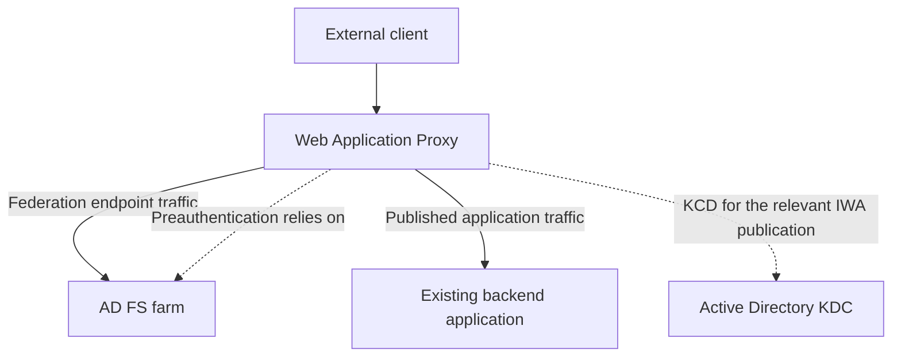
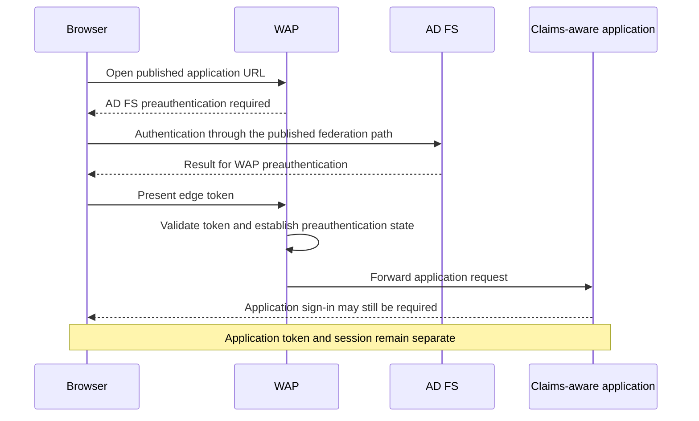

# Web Application Proxy Explained: AD FS Proxy, Preauthentication and Application Publishing

**A working AD FS proxy does not prove that a published application is reachable, authenticated or authorized correctly.**

Windows Server Web Application Proxy (WAP) has two related jobs: publishing the federation service's external endpoints and publishing application URLs. Both can involve AD FS, but their configuration, credentials and success criteria are not identical.

This guide explains an existing on-premises WAP deployment, including current Windows Server deployments. It concerns publishing applications that already exist, not developing them. WAP is also not Microsoft Entra application proxy: the products have different control planes, connectors and access paths. Check the installed server build and application support before applying a scenario from older documentation.

> **TL;DR**
> - Federation proxy registration and application publishing are separate operations.
> - AD FS preauthentication checks access at WAP; the backend application can still require its own authentication and authorization.
> - Pass-through publication skips WAP's AD FS preauthentication. It does not mean a TCP tunnel or the absence of application authentication.
> - Kerberos constrained delegation (KCD) to an Integrated Windows Authentication backend requires additional AD configuration and a domain-joined WAP.
> - Validate the public name, backend connection and authentication result independently. A metadata page or health probe is not an end-to-end application test.

## 1. Separate the two jobs

| WAP role | Configuration question | Evidence of success |
|---|---|---|
| AD FS federation proxy | Is this WAP registered with the correct federation service, and are the required endpoints proxy-enabled and reachable? | A fresh external authentication reaches the intended AD FS farm through WAP |
| Application reverse proxy | Which external URL maps to which backend, with which preauthentication and backend-authentication mode? | The intended client reaches that application and receives the expected identity and authorization result |



The federation service remains the token issuer. WAP's proxy-trust credential authenticates the proxy to AD FS; it is not the end user's certificate and not the backend application's TLS certificate.

AD FS also stores WAP configuration. Selecting pass-through for an application does not remove the role's configuration/registration dependency on AD FS. It only changes whether that publication performs AD FS preauthentication for its requests.

Registration alone does not publish every internal web server. Conversely, a backend application returning HTTP 200 does not establish that the federation proxy trust is healthy. Use the [proxy-trust troubleshooting guide](../Troubleshoot/WAP%20trust%20to%20ADFS%20broken.md) when the failed boundary is registration or configuration retrieval.

## 2. Choose the publication mode deliberately

| Mode | Before forwarding to the backend | What the backend still does |
|---|---|---|
| AD FS preauthentication, claims-aware application | WAP obtains and validates the applicable AD FS preauthentication result | Its own federation/token validation, session management and application authorization |
| AD FS preauthentication, Integrated Windows Authentication application | WAP validates the preauthentication result and uses the configured KCD path | Accepts the Kerberos-authenticated identity and applies application permissions |
| Pass-through publication | WAP does not perform AD FS preauthentication for that publication | Whatever authentication and authorization the application itself requires |

**Pass-through is an authentication choice here, not a description of the TLS topology.** WAP is still an application reverse proxy. A load balancer's layer-4 TLS pass-through setting describes something different: whether that device forwards the TLS conversation without terminating it.

A pass-through application may redirect the user to an identity provider itself. That is application authentication, not WAP suddenly enforcing its preauthentication policy. Do not claim MFA or device-policy coverage at the edge for a pass-through publication merely because the organization also uses AD FS.


*Historical wizard capture: this selects the publication's preauthentication mode, not TLS pass-through at a load balancer. The example federation name is not a value to reuse.*

WAP supports version-specific publication options beyond this table, including HTTP-to-HTTPS redirection and some historical client-specific flows. The existence of an HTTP publication feature is not a recommendation to transmit credentials or application data without TLS. Older MS-OFBA, Basic-authentication and Microsoft Store examples also do not prove that a current application or client supports the same flow.

## 3. Understand the two authentication stages

In the documented browser preauthentication flow, AD FS issues an **edge token** for the published resource. WAP validates the issuer's signature, the intended application and expiry, then maintains its preauthenticated session state.

That edge token is not automatically the backend application's SAML assertion, OIDC ID token or API access token. A claims-aware backend can redirect to AD FS for its own application token; an existing AD FS SSO context may make the second exchange invisible to the user.



The diagram is a logical view: external browser requests for the federation service are themselves routed through its published WAP path. It is not a recommendation to expose the internal AD FS servers directly to the Internet.

**Verify:** record whether a failure occurs before WAP forwards the request, during the backend connection, during application authentication or during application authorization. A second redirect is not necessarily an authentication loop; identify which session or token the recipient needs.

## 4. Know when domain membership and KCD matter

WAP proxy trust is certificate-based. Domain membership is not a universal prerequisite for the federation-proxy or claims-aware publication roles. For SSO to an Integrated Windows Authentication backend using KCD, however, Microsoft requires a domain-joined WAP and the corresponding delegation configuration.

| KCD dependency | Question to answer |
|---|---|
| Non-claims-aware AD FS RP | Is there a policy object representing this published application for preauthentication? |
| User identity | Can the authenticated user be resolved to the appropriate AD identity for delegation? |
| Backend service SPN | Does the requested `HTTP/<service-name>` identify the account actually serving that application? |
| Constrained delegation | Is the WAP identity allowed to delegate to exactly the intended backend service under the chosen design? |
| AD connectivity and time | Can WAP reach the required domain services and obtain tickets with synchronized time? |
| User/account restrictions | Is delegation permitted for this user and compatible with the applicable account protections? |
| Backend configuration | Does the application actually accept Kerberos for that service identity? |

Classic constrained delegation and resource-based constrained delegation place the permission on different directory objects. Use the appropriate supported design; do not turn an unknown SPN or delegation failure into unconstrained delegation, broad administrative membership or a copied directory change.

The browser does not need to give its password to WAP for each backend Kerberos request. WAP uses the supported delegation mechanism after preauthentication. A successful AD FS MFA step does not, by itself, prove that the backend Kerberos ticket can be obtained.

For the AD-side investigation, use the existing [Kerberos troubleshooting guide](../../060%20-%20Active%20Directory/Troubleshoot/Troubleshooting%20Kerberos%20Authentication%20-%20SPNs,%20Tickets,%20Error%20Codes%20and%20NTLM%20Fallback.md). Distinguish the backend application's SPN from the federation service's own SPN and from the proxy-trust certificate.

## 5. Draw the names and TLS connections

```text
Browser
  | public application name, external listener and certificate
  v
WAP
  | backend URL, internal DNS and backend certificate validation
  v
Application

Separately:
WAP --> federation service name --> AD FS farm
       TLS + registered proxy identity, not the application's KCD ticket
```

| Boundary | Validate independently |
|---|---|
| Public client to WAP | Public DNS, routing, external URL, listener, certificate name/chain and client trust |
| WAP to application | Backend DNS as resolved from WAP, port, URL/path, TLS name/chain and application response |
| WAP to AD FS | Federation-service DNS/routing, TLS binding and proxy authentication |
| AD FS to AD or farm dependencies | Applicable directory connectivity, time and per-node health |
| WAP to AD for KCD | Required domain connectivity, ticket acquisition and constrained-delegation permissions |

Use the correct public hostname, not an IP address substituted into an HTTPS URL. TLS SNI, HTTP Host, certificate names and application redirects can depend on it. Split DNS may preserve one logical name while directing WAP to an internal destination.

Each TLS-serving endpoint needs the correct local binding and private-key access, not necessarily a different certificate. Microsoft's AD FS requirements call for the same TLS certificate/key at WAP and the federation servers when proxying Windows Integrated Authentication or when `ExtendedProtectionTokenCheck` is enabled. Do not treat a separately issued certificate with the same hostname as automatically interchangeable in those cases.

Document every load-balancer or inspection point. Microsoft's AD FS requirements explicitly exclude TLS termination at the load balancer on the federation path. Preserve TLS and SNI through that hop; WAP's own supported proxy processing is not permission for an arbitrary intermediary to terminate and reconstruct client-certificate authentication. Do not disable certificate validation or extended protection to accommodate the topology.

For binding updates and certificate roles, use the existing [AD FS/WAP TLS replacement procedure](../How-to/ADFS%20and%20WAP%20-%20Replace%20SSL%20Certificate.md) and [certificate-role guide](AD%20FS%20Certificates%20Explained%20-%20TLS,%20Token%20Signing,%20Token%20Decryption%20and%20Rollover.md).

## 6. Treat URL translation as a limited feature

Microsoft's WAP publication documentation permits different external and backend hostnames but requires the same application path. For example, mapping `https://portal.corp.example/app/` to `https://app01.corp.example/app/` is a hostname change; mapping it to `/different-app/` is not the same operation.

This is not a general rewrite engine for every absolute link, script, cookie, signed protocol message or application-generated redirect. Check how the application constructs its own URLs and whether it supports the proposed external address. Keep federation identifiers, ACS/redirect URLs and certificates consistent with the actual application contract.


*The relevant distinction remains hostname versus path translation. This is not a guarantee that every URL inside the application's response body will be rewritten.*

**Verify:** test a deep link, navigation after sign-in, a redirect back from AD FS and application logout. A home page loading successfully says little about the next signed callback.

## 7. Inventory publication and federation separately

On the WAP server, use a Windows PowerShell 5.1 administration session with permission to read the role configuration:

```powershell
Import-Module WebApplicationProxy -ErrorAction Stop

Get-WebApplicationProxyApplication -ErrorAction Stop |
    Sort-Object Name |
    Select-Object Name, ID, ExternalPreauthentication, ExternalUrl,
        BackendServerUrl, BackendServerAuthenticationSPN
```

These are configured publications, not a health report. An empty list is not proof that WAP's separate federation-proxy role is disabled. If the installed version does not expose a field, inspect its supported object/help rather than interpreting the missing value as a working default.

On an AD FS server, inspect the endpoint publication independently:

```powershell
Import-Module ADFS -ErrorAction Stop

Get-AdfsEndpoint -ErrorAction Stop |
    Sort-Object Protocol, AddressPath |
    Select-Object Protocol, AddressPath, Enabled, Proxy
```

`Enabled` and `Proxy` answer different questions. Neither proves that the public network path reaches the endpoint. Likewise, an application's configured RP must be examined on its correct policy surface; a non-claims-aware publication is not interchangeable with a SAML trust merely because the display names match.

For one known HTTPS backend, basic observations from WAP can isolate name resolution and TCP reachability:

```powershell
$backendHost = 'app01.corp.example'
Resolve-DnsName -Name $backendHost -ErrorAction Stop
Test-NetConnection -ComputerName $backendHost -Port 443 -InformationLevel Detailed
```

A TCP success is not a TLS, Kerberos, token or application authorization success. These examples do not publish an application, change delegation or re-register WAP.

## 8. Publish an existing application as a controlled configuration change

1. **Record the contract.** Identify the current backend URL, supported clients, authentication method, public URL, certificate names and any callbacks. First verify that the application works on its intended internal path.
2. **Choose the mode.** Decide whether WAP should enforce AD FS preauthentication. If so, identify the correct claims-aware or non-claims-aware RP and its policy. Pass-through is not a workaround to apply silently when preauthentication fails.
3. **Resolve the dependencies.** Prepare the relevant DNS, TLS, firewall and, only where required, domain/KCD configuration. Keep the application path compatible with WAP's translation limits.
4. **Apply the reviewed publication.** Use the supported wizard or cmdlet for the installed WAP version, with the explicit external/backend URLs and RP association. This creates or changes an exposure path; retain its previous definition where one exists.
5. **Test outside-in.** Use the actual external hostname and intended client, then validate identity and authorization at the application. Test an intended denial as well as an allowed user.
6. **Repeat across nodes.** Verify configuration retrieval and local certificates on every WAP, and the actual federation/backend path through the load balancers. Restore the recorded publication if the result is not the intended one.

There is deliberately no bulk publication or delegation script here. The important work is selecting the right access contract, not generating a plausible wizard command for an unknown application.

## 9. Use evidence from the first failing boundary

| Symptom | First distinction to test |
|---|---|
| External TLS warning | Public name, certificate chain and actual TLS termination point |
| Backend connection error | WAP's own DNS, route, backend TLS and URL/path |
| Preauthentication succeeds, backend returns 401 | Backend federation or KCD, not necessarily another AD FS password failure |
| Authentication succeeds, application returns 403 | Application permissions versus edge authorization |
| Login redirects repeat | Which component needs a session, and whether callback/cookie/URL handling preserves it |
| Behavior changes with the selected node | Local binding/certificate, configuration retrieval, routing or node-specific dependencies |
| Application works internally but not externally | External publication and client path; internal success does not exercise WAP |

Correlate the WAP, AD FS and application records for the same attempt. Keep timestamps and observed node names in the investigation record, but remove user identifiers, cookies and tokens from published traces.

An anonymous probe or federation-metadata response can show reachability and some service health. It does not prove preauthentication, client-certificate authentication, KCD or the application's final access decision. Test those behaviors directly instead of promoting one HTTP 200 into a complete health verdict.

## References

- [Microsoft Learn: Web Application Proxy in Windows Server](https://learn.microsoft.com/en-us/windows-server/remote/remote-access/web-application-proxy/web-app-proxy-windows-server)
- [Microsoft Learn: Publishing applications using AD FS preauthentication](https://learn.microsoft.com/en-us/windows-server/remote/remote-access/web-application-proxy/publishing-applications-using-ad-fs-preauthentication)
- [Microsoft Learn: AD FS requirements, including proxy TLS and load balancers](https://learn.microsoft.com/en-us/windows-server/identity/ad-fs/overview/ad-fs-requirements)
- [Microsoft Learn: Get-WebApplicationProxyApplication](https://learn.microsoft.com/en-us/powershell/module/webapplicationproxy/get-webapplicationproxyapplication?view=windowsserver2025-ps)
- [Microsoft Learn: Get-AdfsEndpoint](https://learn.microsoft.com/en-us/powershell/module/adfs/get-adfsendpoint?view=windowsserver2025-ps)