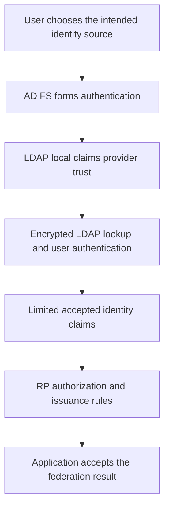

# AD FS Authentication with LDAP Directories: Local Claims Provider Trusts

**An LDAP attribute lookup enriches an identity. A local claims provider establishes one.**

AD FS 2016 and later can authenticate users stored in an LDAP v3 directory through a **local claims provider trust**. That directory can be AD LDS, an appropriate untrusted AD directory or a non-Microsoft LDAP implementation. This guide connects an existing directory; it does not install AD LDS or create a new user-provisioning system.

## 1. Keep the three integrations separate

| Integration | Purpose |
|---|---|
| LDAP local claims provider trust | Find and authenticate a user in that directory |
| Attribute store and issuance rules | Retrieve and transform attributes for an already established identity |
| Provisioning/synchronization | Create, update, correlate or remove accounts in another system |

See [Claims Explained](../Concepts/AD%20FS%20Claims%20Explained%20-%20Attribute%20Stores,%20Claim%20Descriptions%20and%20Token%20Issuance.md) for the wider claims pipeline. Adding an attribute store does not authenticate LDAP users, and emitting a UPN or ImmutableID claim does not create an Entra account.



Microsoft documents forms-based authentication for LDAP identities; Windows Integrated Authentication and certificate authentication are not supported for this LDAP user-authentication path. Passive federation protocols and the documented WS-Trust scenarios have their own requirements. Do not infer support merely because a cmdlet enum lists Kerberos or Negotiate.

## 2. Define the directory contract first

For the example below, an existing directory exposes LDAPS on `ldap01.partner.example:636`, with users of class `inetOrgPerson` under `ou=People,dc=partner,dc=example`.

| Setting | Decision to make |
|---|---|
| LDAP server and replicas | Reachable from every serving AD FS node; equivalent directory data/schema |
| TLS | Server certificate name, chain, validity, revocation and supported protocol/ciphers |
| Search credential | Dedicated account with the required read/search rights, not a directory administrator |
| User class/container | Limit the eligible population instead of searching an unrelated directory root |
| Login/anchor attribute | Unique within the searched population; define case, rename and collision behavior |
| Issued subject | Stable application identity contract, with the correct issuer/source distinction |
| Lifecycle | Disabled/locked/expired users, password changes, bind-credential rotation and deprovisioning |

The `AnchorClaimLdapAttribute` is used to match the username entered by the user. In this example it is `uid`; users enter the corresponding value. Do not assume that an email alias, a DN and a `domain\user` name are interchangeable. The anchor claim type is chosen for this example's application contract, not imposed on every RP.

Validate LDAP TLS and a representative lookup with the directory's supported tools from the AD FS network. A successful TCP connection or construction of a PowerShell connection object is not proof that certificate validation, lookup and user authentication all succeed.

## 3. Inventory and choose a new trust identity

Run Windows PowerShell with the ADFS module and farm-administration rights. Make WID farm writes on the primary. Record existing identity routing and applicable RP rules before adding a new source.

```powershell
Import-Module ADFS -ErrorAction Stop
$trustName = 'Partner LDAP'
$trustIdentifier = 'urn:corp:partner-ldap'
$existingTrusts = @(Get-AdfsLocalClaimsProviderTrust -ErrorAction Stop)
if (@($existingTrusts | Where-Object {
    $_.Name -eq $trustName -or $_.Identifier -eq $trustIdentifier
}).Count -gt 0) {
    throw 'The proposed local trust name or identifier already exists; review rather than overwrite it.'
}
$existingTrusts | Select-Object Name, Identifier, Enabled
```

Do not dump connection objects, credentials or an unrestricted configuration export into public logs. A trust identifier is a logical identifier, not necessarily a URL to browse.

## 4. Build an encrypted connection and limited mappings

Use the bind DN expected by this directory. The password is collected interactively, never embedded in the example:

```powershell
$bindName = 'uid=adfs-reader,ou=Services,dc=partner,dc=example'
$bindPassword = Read-Host 'LDAP search account password' -AsSecureString
if ($bindPassword.Length -eq 0) {
    throw 'No LDAP search credential was supplied.'
}
$bindCredential = [pscredential]::new($bindName, $bindPassword)
$ldapConnection = New-AdfsLdapServerConnection -HostName 'ldap01.partner.example' `
    -Port 636 -SslMode Ssl -AuthenticationMethod Basic `
    -Credential $bindCredential -ErrorAction Stop
```

`Ssl` selects the encrypted LDAP connection mode; it is not advice to enable the obsolete SSL 3.0 protocol. Use current supported TLS on the directory and Windows. Do not copy a lab's `-SslMode None` with Basic credentials or suppress certificate errors. For replicas, create a connection object for each reviewed server and supply the documented connection array.

The example adds only a given-name attribute and passes the chosen anchor and given-name claim into further processing:

```powershell
$givenNameMapping = New-AdfsLdapAttributeToClaimMapping -LdapAttribute 'givenName' `
    -ClaimType 'http://schemas.xmlsoap.org/ws/2005/05/identity/claims/givenname' -ErrorAction Stop
$acceptanceRules = @'
subjectClaim:[Type == "http://schemas.xmlsoap.org/ws/2005/05/identity/claims/nameidentifier"]
 => issue(claim = subjectClaim);
givenNameClaim:[Type == "http://schemas.xmlsoap.org/ws/2005/05/identity/claims/givenname"]
 => issue(claim = givenNameClaim);
'@
```

This is not a blanket pass-through of every LDAP attribute. Adapt the minimum accepted claim types to the real application requirements and test the subject's uniqueness. Reusing an AD user's subject value for a different LDAP user can create an account-correlation vulnerability if the application ignores the identity source.

## 5. Preview a disabled trust, then test the intended scope

```powershell
Add-AdfsLocalClaimsProviderTrust -Name $trustName -Identifier $trustIdentifier `
    -Type Ldap -LdapServerConnection $ldapConnection `
    -UserObjectClass 'inetOrgPerson' -UserContainer 'ou=People,dc=partner,dc=example' `
    -LdapAuthenticationMethod Basic -AnchorClaimLdapAttribute 'uid' `
    -AnchorClaimType 'http://schemas.xmlsoap.org/ws/2005/05/identity/claims/nameidentifier' `
    -LdapAttributeToClaimMapping @($givenNameMapping) `
    -AcceptanceTransformRules $acceptanceRules -Enabled $false -WhatIf -ErrorAction Stop
```

After reviewing the directory/claim contract, replace `-WhatIf` with `-Confirm` for the actual creation. This creates an intentionally **disabled** trust; it cannot yet authenticate users. After that real creation, read back the specific trust:

```powershell
$createdTrust = @(Get-AdfsLocalClaimsProviderTrust -ErrorAction Stop | Where-Object {
    $_.Identifier -eq $trustIdentifier
})
if ($createdTrust.Count -ne 1 -or $createdTrust[0].Enabled -isnot [bool] -or
    $createdTrust[0].Enabled -ne $false) {
    throw 'Expected exactly one staged, disabled local trust.'
}
$createdTrust[0] | Select-Object Name, Identifier, Enabled
```

Once the test RP, routing and acceptance/issuance policy are ready, activate that exact trust using the supported `Enable-AdfsLocalClaimsProviderTrust` command with its documented target and confirmation options. Read it back and perform real authentication tests. A disabled-trust inventory is not a successful LDAP authentication test.

For username-suffix discovery, the documented `OrganizationalAccountSuffix` configuration disambiguates identity sources, including the relevant active-protocol scenarios. Select suffixes deliberately and inspect existing [Home Realm Discovery](AD%20FS%20Home%20Realm%20Discovery%20-%20Choosing%20the%20Identity%20Provider.md) behavior. A suffix route does not authorize a user or fix a nonunique lookup.

Do not assume existing AD-only rules are suitable for the new population. Review RP source restrictions, issuer checks, immutable subject mapping and MFA-provider compatibility. Successful primary LDAP authentication alone must not manufacture a `multipleauthn` claim.

## 6. Prove each boundary

| Test | What to establish |
|---|---|
| Valid user and correct password | Exactly the intended directory identity is authenticated |
| Wrong password, disabled/locked/expired account | Directory-specific policy and returned failure are handled correctly |
| Duplicate or missing login attribute | No unintended account match or fallback |
| Existing AD user and overlapping identifier | Routing and application correlation preserve identity-source boundaries |
| Second LDAP replica / each AD FS node | TLS, bind rights and lookup work on all serving paths |
| Authenticated but unauthorized user | RP/application access is denied despite successful LDAP authentication |
| Bind-password or LDAP TLS certificate rotation | New credentials/certificate are actually usable before old dependencies are removed |

For rollback of a newly enabled source, use the documented disable command for that exact local trust and restore any separately changed routing/RP configuration. Disabling a source does not revoke every existing application session. Preserve its reviewed definition before removal. Connection, credential and schema changes can require a different supported update/recreation process from a simple `Set-AdfsLocalClaimsProviderTrust` rule change; verify the installed cmdlet surface instead of inventing parameters.

## 7. Do not relabel claim issuance as provisioning

Historical LDAP-to-Microsoft-365 labs often added an LDAP attribute store and rules for UPN, issuer and ImmutableID. These rules only shape federation output. They do not prove that a cloud account exists, that its source anchor matches, or that a Generic LDAP connector inside Entra Connect Sync is a supported inbound provisioning design.

Validate the account lifecycle separately against current supported product documentation. MIM's Generic LDAP connector and Entra's outbound provisioning to LDAP solve different integration problems; neither automatically certifies the old lab's inbound Entra Connect customization. The existing claim-rule collection is not repeated here.

## References

- [Microsoft Learn: Authenticate users in LDAP directories](https://learn.microsoft.com/en-us/windows-server/identity/ad-fs/operations/configure-ad-fs-to-authenticate-users-stored-in-ldap-directories)
- [Microsoft Learn: New-AdfsLdapServerConnection](https://learn.microsoft.com/en-us/powershell/module/adfs/new-adfsldapserverconnection?view=windowsserver2022-ps)
- [Microsoft Learn: Add-AdfsLocalClaimsProviderTrust](https://learn.microsoft.com/en-us/powershell/module/adfs/add-adfslocalclaimsprovidertrust?view=windowsserver2022-ps)
- [Microsoft Learn: Enable-AdfsLocalClaimsProviderTrust](https://learn.microsoft.com/en-us/powershell/module/adfs/enable-adfslocalclaimsprovidertrust?view=windowsserver2022-ps)
- [Microsoft Learn: Entra Connect supported topologies and configuration boundaries](https://learn.microsoft.com/en-us/entra/identity/hybrid/connect/plan-connect-topologies)
- [Microsoft Learn: Generic LDAP connector and outbound provisioning context](https://learn.microsoft.com/en-us/microsoft-identity-manager/reference/microsoft-identity-manager-2016-connector-genericldap)