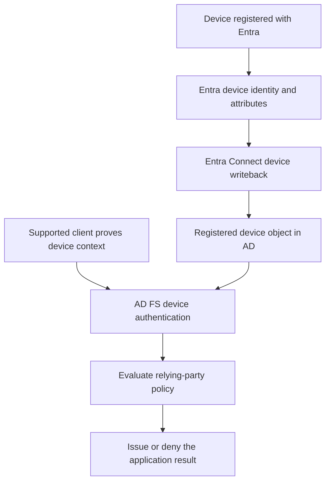

# AD FS Device Authentication: DRS, Device Writeback and Device Claims

**An Entra device object is not automatically a device identity that AD FS can authenticate.**

AD FS can use authenticated device context when making access decisions for its relying parties. In a cloud-registered device scenario, that depends on the registration authority, device writeback, AD objects and permissions, and the authentication path actually used by the client.

This guide covers the AD FS 2016-and-later device-policy model and its operational checks. It is separate from [Entra hybrid join](../../010%20-%20Entra%20ID/Entra%20Connect/Microsoft%20Entra%20Hybrid%20Join%20with%20AD%20FS%20-%20Configuration%20and%20Diagnostics.md), Intune enrollment and a complete Windows Hello deployment.

## 1. Separate registration, writeback and authentication

| Mechanism | What it provides | What it does not automatically provide |
|---|---|---|
| Entra device registration / hybrid join | Device identity and keys associated with Entra | An Intune enrollment or an AD FS device-policy decision |
| On-premises DRS | The on-premises device-registration service/configuration for its supported scenarios | A replacement for the Entra registration service |
| Entra Connect device writeback | Applicable device objects and attributes represented in AD | A copy of all Entra Conditional Access policies |
| AD FS device authentication | Verification of device context using the enabled supported methods | Unconditional user authentication or authorization |
| RP access/issuance policy | A decision using the available trusted claims | Evidence that absent device claims mean compliance |



The device certificate, transport key, user certificate, federation TLS certificate and MFA adapter certificate have different jobs. A user selecting a smartcard certificate is not proof that the device-authentication branch succeeded.

## 2. Establish whether writeback is needed and supported

Microsoft documents device writeback for AD FS-protected device-based access and Windows Hello for Business **hybrid certificate trust**. It is not a universal prerequisite for hybrid join, cloud Kerberos trust or Intune enrollment.

For this design, check:

- Microsoft Entra ID P1/P2 licensing for device writeback, and Intune licensing where management/compliance signals are required.
- Supported AD FS and Entra Connect versions, actual farm behavior level and the AD schema needed by the scenario. The AD FS 2016 device-policy documentation requires schema 85 or later; newer farm upgrades can require more.
- The writeback topology. Microsoft's current reference specifies one target forest, devices in the same forest as their users, and no multiple-user-forest or multiple-Entra-directory writeback design.
- Device-registration authority and discovery, including client-side SCP settings on AD FS when using the documented targeted-deployment model.
- AD FS service identity and Entra Connect's **AD DS connector account**. These are different accounts with different required permissions.

Retain the existing registration configuration, container locations, relevant ACLs, device policy and RP policies before changing them. Schema preparation and directory initialization are forest changes, not per-PC troubleshooting actions.

## 3. Inventory AD FS and the directory

On AD FS, use an administrative Windows PowerShell session. Preserve the actual enabled flag and method for rollback:

```powershell
Import-Module ADFS -ErrorAction Stop
$devicePolicyBefore = Get-AdfsGlobalAuthenticationPolicy -ErrorAction Stop
if ($devicePolicyBefore.DeviceAuthenticationEnabled -isnot [bool] -or
    $null -eq $devicePolicyBefore.DeviceAuthenticationMethod) {
    throw 'Device-authentication before-state is incomplete; do not guess it.'
}
$devicePolicyBefore | Select-Object DeviceAuthenticationEnabled, DeviceAuthenticationMethod
Get-AdfsDeviceRegistration -ErrorAction Stop | Format-List *
```

Record registration/cleanup settings too. The absence of an expected cmdlet/property is a version or configuration question, not an instruction to create an empty default.

On an AD management host, locate the existing DRS configuration and obtain the device-container DN from it:

```powershell
Import-Module ActiveDirectory -ErrorAction Stop
$directoryServer = 'dc01.corp.example'
$rootDse = Get-ADRootDSE -Server $directoryServer -ErrorAction Stop
$configurationBase = 'CN=Device Registration Configuration,CN=Services,' +
    $rootDse.ConfigurationNamingContext
$drsConfigurations = @(Get-ADObject -Server $directoryServer -SearchBase $configurationBase `
    -LDAPFilter '(objectClass=msDS-DeviceRegistrationService)' `
    -Properties msDS-DeviceLocation -ErrorAction Stop)
if ($drsConfigurations.Count -ne 1 -or
    [string]::IsNullOrWhiteSpace($drsConfigurations[0].'msDS-DeviceLocation')) {
    throw 'Expected one complete DRS configuration; inspect initialization and topology.'
}
$deviceContainer = $drsConfigurations[0].'msDS-DeviceLocation'
Get-ADObject -Identity $deviceContainer -Server $directoryServer -ErrorAction Stop |
    Select-Object DistinguishedName, ObjectClass
```

Typical objects include the `RegisteredDevices` container in a domain partition and the Device Registration configuration/service/DKM objects in the configuration partition. Discover their actual locations; do not assume a particular domain DN from an old lab.

**Verify permissions:** AD FS needs the documented access to the registration configuration and device data; the AD DS connector account needs the writeback permissions on the intended objects/containers. A successful read as a forest administrator does not prove either service account can perform its job. Do not grant broad rights to both accounts as a substitute for verifying the intended ACLs.

## 4. Prepare only the missing configuration

If the farm has never been configured for the relevant device scenario, follow Microsoft's directory preparation workflow. For the on-premises DRS initialization step, the native cmdlet supports a preview:

```powershell
Initialize-ADDeviceRegistration -ServiceAccountName 'CORP\AdfsService$' `
    -DeviceLocation 'corp.example' -WhatIf -ErrorAction Stop
```

Here `DeviceLocation` is the target **domain name**, not the `RegisteredDevices` container DN from the read-only query. Replace the example with the existing AD FS service identity; keep the trailing `$` for a gMSA. Use the required forest-administration context. Apply with confirmation only when initialization is actually needed and the resulting objects/permissions have been reviewed.

Initializing directory objects, enabling a local on-premises Workplace Join service and enabling **device authentication** are distinct operations. Do not enable every registration endpoint merely to consume devices that are registered in Entra. Use the workflow for the selected registration authority.

For Entra device writeback:

1. On Entra Connect, select **Configure device options > Configure device writeback**.
2. Verify the target forest and existing device container/configuration.
3. Prepare AD with the wizard's documented administrative option or its generated preparation script, using the actual AD DS connector account.
4. Complete the configuration and review synchronization/import/export results.
5. Verify an intended Entra device appears in the correct AD container with the expected attributes.

The documented writeback delay can be up to three hours. Distinguish normal propagation from a blocked export or missing attribute flow. If the AD schema changed after Connect was configured, refresh the connector schema through the supported workflow and review the applicable rules; an OS upgrade alone does not refresh that connector view.

For partial or duplicate configuration, investigate object ownership, references and the setup history before repair. This guide does not reproduce blanket deletion of `Device Registration Configuration` or edits to the client's `Enrollments` registry tree.

## 5. Inspect one written-back device

Use a known registration GUID and the discovered container. The query reports key presence without dumping key-credential values:

```powershell
$registrationId = [guid]'aaaaaaaa-bbbb-cccc-dddd-eeeeeeeeeeee'
$deviceFilter = '(&(objectClass=msDS-Device)(msDS-DeviceID=' + $registrationId + '))'
$registeredDevices = @(Get-ADObject -Server $directoryServer -SearchBase $deviceContainer `
    -LDAPFilter $deviceFilter -Properties msDS-DeviceID, msDS-KeyCredentialLink,
        msDS-IsManaged, msDS-IsCompliant -ErrorAction Stop)
if ($registeredDevices.Count -ne 1) {
    throw 'Expected one written-back device; correlate the registration ID and synchronization result.'
}
$registeredDevices[0] | Select-Object DistinguishedName, msDS-DeviceID,
    msDS-IsManaged, msDS-IsCompliant,
    @{Name='KeyCredentialValues';Expression={
        @($_.'msDS-KeyCredentialLink' | Where-Object { $null -ne $_ }).Count
    }}
```

Use a DC serving the device-container domain, and account for AD replication. `KeyCredentialValues > 0` is a presence check, not validation that the correct transport key is linked to this device. Missing management/compliance values must not be treated as `true` or repaired by manually stamping them.

## 6. Enable the intended authentication methods and prove the policy

Once registration, writeback and permissions are working, preview the documented all-supported-methods configuration:

```powershell
Set-AdfsGlobalAuthenticationPolicy -DeviceAuthenticationEnabled $true `
    -DeviceAuthenticationMethod All -WhatIf -ErrorAction Stop
```

`All` is an explicit method choice, not a mandatory default for every farm. Review ClientTLS, signed-token and PKeyAuth requirements for the clients in scope and installed version. Apply the reviewed choice with `-Confirm` instead of `-WhatIf`, then read it back.

Use an existing RP and an appropriate diagnostic/test identity to observe the claims actually issued. Microsoft documents device-policy signals including `isManaged`, `isCompliant` and `trusttype`; the client flow and RP rules determine what is available and released. An AD attribute existing does not mean every token contains a corresponding claim.

| Test | Expected evidence |
|---|---|
| Intended registered device | Correct device identity and authentication context on the selected path |
| Unregistered or unsupported device | Missing/failed device evidence handled by the intended policy, not silently granted |
| Managed versus unmanaged | Actual trusted signal and resulting access decision |
| Changed compliance or disabled device | Measured propagation and new-token behavior, not a promise of instant application-session revocation |
| Each federation/WAP path | Node, endpoint and client-method compatibility |

Device-aware AD FS policy is not Entra Conditional Access policy synchronization. See [where the two policy systems are enforced](../Concepts/AD%20FS%20and%20Entra%20Conditional%20Access%20-%20Where%20Policies%20Are%20Enforced.md).

## 7. Diagnose MSIS9424 and transport-key failures

An AD FS event reporting **MSIS9424** can state that the device certificate signing an OAuth JWT bearer request must be registered with a transport key. Preserve the full event wording, request time, node and device identity; an event number alone is not a root cause.

For that specific signed-device scenario:

1. Confirm the endpoint's registration ID, tenant and relevant `EnterprisePrt` versus `AzureAdPrt` state in the affected user context.
2. Correlate the same device in Entra and in the AD writeback container. Do not substitute the user's account or the AD computer object for the registered-device object.
3. Inspect whether the expected `msDS-KeyCredentialLink` data is present and readable by the required identities.
4. Review Connect's schema view, device attributes, synchronization rules and export errors. An older connector configuration that never learned the required schema/attribute is a specific candidate, not the explanation for every MSIS9424 event.
5. After repairing the demonstrated configuration and allowing synchronization/replication, reproduce the same authentication and correlate the new result.

Microsoft's on-premises device-policy reference explicitly calls out refreshing the connector schema after the schema upgrade so that the `msDS-KeyCredentialLink` synchronization rule is configured. This provides a public basis for checking that dependency, not a guarantee that refreshing schema alone resolves all transport-key errors.

Do not add arbitrary key-credential values, clear the TPM or delete/re-register every device to suppress the event. Transport-key proof, AD FS enterprise SSO and an Entra PRT are related but different parts of the path. The [existing Windows Hello guide](../../010%20-%20Entra%20ID/Authentication/Windows%20Hello%20for%20Business%20-%20Complete%20Practical%20Guide.md) covers the broader user-key and SSO model.

## Restore the scope that changed

For only the device-authentication policy pair, preview restoration of the captured values:

```powershell
Set-AdfsGlobalAuthenticationPolicy `
    -DeviceAuthenticationEnabled $devicePolicyBefore.DeviceAuthenticationEnabled `
    -DeviceAuthenticationMethod $devicePolicyBefore.DeviceAuthenticationMethod `
    -WhatIf -ErrorAction Stop
```

Apply with confirmation and verify the affected RP paths. This does not undo directory preparation, device writeback, cleanup settings or RP rules. Those require their own recorded before-state and lifecycle plan; deleting shared registration containers is not a policy rollback.

## References

- [Microsoft Learn: Configure device-based access on premises](https://learn.microsoft.com/en-us/windows-server/identity/ad-fs/operations/configure-device-based-conditional-access-on-premises)
- [Microsoft Learn: Device writeback requirements, topology and verification](https://learn.microsoft.com/en-us/entra/identity/hybrid/connect/how-to-connect-device-writeback)
- [Microsoft Learn: Initialize-ADDeviceRegistration](https://learn.microsoft.com/en-us/powershell/module/adfs/initialize-addeviceregistration?view=windowsserver2022-ps)
- [Microsoft Learn: Targeted hybrid join and AD FS device authority](https://learn.microsoft.com/en-us/entra/identity/devices/hybrid-join-control)
- [Microsoft Learn: PRT device and transport keys](https://learn.microsoft.com/en-us/entra/identity/devices/concept-primary-refresh-token)