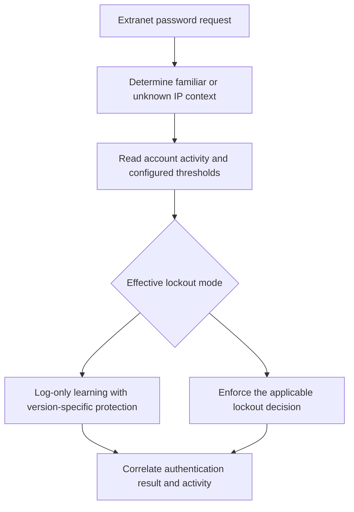

# AD FS Extranet Smart Lockout: Deployment and Account Activity

**Changing a lockout mode to make a diagnostic command work also changes who can sign in.**

Extranet Smart Lockout (ESL) tracks familiar and unknown locations for users and maintains separate bad-password activity. It helps reduce malicious extranet lockouts, but does not replace MFA, AD account policy or incident response.

This guide consolidates configuration and account-activity diagnostics. It uses the supported AD FS management surface rather than promoting direct queries against an internal artifact-store table into an administration API.

## 1. Know the protection boundary

ESL applies to the documented extranet **username/password** authentication path through WAP or an appropriate MS-ADFSPIP-compatible proxy. It is not a general limit on every protocol, intranet request or authentication method. Direct access to a federation node is not automatically an extranet request.

| State | Meaning |
|---|---|
| Familiar location | AD FS recognizes the relevant IP context from successful authentication history |
| Unknown location | The request contains an IP context not fully recognized as familiar |
| Familiar/unknown bad-password count | Authentication failures tracked for the respective context |
| ESL lockout | AD FS applies its extranet policy; not the same as AD DS account lockout |
| AD DS lockout | Directory account policy, which can independently block authentication |

Familiar does not mean trustworthy forever. NAT, VPNs and proxies can cause multiple people to share observed addresses. A correct stolen password can still succeed and contribute familiar-location history. Preserve trustworthy proxy/header handling and investigate suspicious success as well as failure.



## 2. Check version, permissions and availability

For AD FS 2016, Microsoft's documented prerequisites include the June 2018 updates or later on **all** nodes and the 2016 farm behavior level. Use current supported cumulative updates, not only the original enabling patch. ESL is built into AD FS 2019, with important behavioral differences.

Confirm WinRM availability as required by the management workflow, AD FS security auditing and the applicable local audit policy on all nodes. The AD FS service account also needs the documented artifact-database permissions to create the activity table. Use the version/topology-specific `Update-AdfsArtifactDatabasePermission` procedure where needed; SQL-backed farms can require database administration involvement. Do not grant blanket database roles just because one activity query failed.

Account activity has an owning farm node. Microsoft's current reference describes the WID primary as the activity primary, while SQL farms select an activity-primary node. Inspect `FarmRoles` on versions that expose it. Inter-node activity communication and artifact-store availability are operational dependencies, not details hidden by a healthy web probe.

## 3. Record the actual configuration

On an AD FS administration session, retain the mode and enabled flag before making changes. The returned property is `ExtranetLockoutEnabled`, while the `Set-AdfsProperties` parameter is `EnableExtranetLockout`; their names are not interchangeable:

```powershell
Import-Module ADFS -ErrorAction Stop
$lockoutBefore = Get-AdfsProperties -ErrorAction Stop
if ($lockoutBefore.ExtranetLockoutEnabled -isnot [bool] -or
    $null -eq $lockoutBefore.ExtranetLockoutMode) {
    throw 'The lockout before-state is incomplete; do not guess its enabled flag or mode.'
}
$lockoutBefore | Format-List *ExtranetLockout*, ExtranetObservationWindow
Get-AdfsFarmInformation -ErrorAction Stop | Format-List CurrentFarmBehavior, FarmRoles
```

Review thresholds, observation window and PDC dependency alongside the effective AD account-lockout policy, including fine-grained password policies for the affected population. Where AD lockout is configured, choose an extranet threshold that provides the intended protection before directory lockout; a copied number is not a universal baseline. AD policy and other sources of bad passwords still matter.

This guide's mode changes leave thresholds and `ExtranetLockoutRequirePDC` unchanged. Configure them deliberately through their documented settings before the rollout, recording their own before-state. Plan disk/memory capacity for the activity store and a controlled service restart sequence.

## 4. Learn before enforcement, without confusing the versions

| Mode/design | Critical distinction |
|---|---|
| Classic `ADPasswordCounter` | Older soft-lockout behavior, not ESL's familiar-location activity model |
| `ADFSSmartLockoutLogOnly` on 2016 | Learns/logs without ESL blocking; it also disables the prior AD FS soft-lockout behavior |
| 2019 log-only with classic protection | The deployment reference documents mode value `3` for this combined behavior; not interchangeable with ordinary 2016 log-only |
| `ADFSSmartLockoutEnforce` | Applies the smart-lockout decisions using learned activity and thresholds |

**On 2016, log-only is not a no-impact switch.** AD DS lockout can still occur while the previous AD FS soft-lockout protection is absent. Assess the exposure during learning, particularly during an active attack. For 2019 or later, verify the supported combined mode in the installed version rather than blindly applying the 2016 command.

For the explicitly chosen ordinary log-only path, preview the mode and enabled flag:

```powershell
Set-AdfsProperties -ExtranetLockoutMode ADFSSmartLockoutLogOnly -WhatIf -ErrorAction Stop
Set-AdfsProperties -EnableExtranetLockout $true -WhatIf -ErrorAction Stop
```

After reviewing the version-specific behavior, thresholds, auditing and recovery route, use `-Confirm` instead of `-WhatIf` to apply the intended configuration. Complete the documented AD FS service restart on all nodes using a drained, node-by-node maintenance sequence, and read the configuration back. A preview does not enable learning.

Microsoft recommends a learning period of 3-7 days and discusses a minimum of 24 hours when accounts are under attack. These are deployment guidelines, not proof that every user has established familiar locations. Check actual activity and representative client/proxy routes before enforcement.

Read one user's activity using the documented identity argument:

```powershell
$userUpn = 'labuser@corp.example'
Get-AdfsAccountActivity $userUpn -ErrorAction Stop |
    Format-List BadPwdCountFamiliar, BadPwdCountUnknown, FamiliarLockout,
        UnknownLockout, LastFailedAuthFamiliar, LastFailedAuthUnknown, FamiliarIPs
```

The cmdlet uses the activity service rather than a guessed local SQL table. A query failure is not a zero counter. Counter names in an old SQL excerpt and properties returned by the public management command need not be identical.

## 5. Move to enforcement and prove the result

Once the chosen learning mode has produced the intended state and the thresholds are acceptable:

```powershell
Set-AdfsProperties -ExtranetLockoutMode ADFSSmartLockoutEnforce -WhatIf -ErrorAction Stop
```

Apply with confirmation, perform the required controlled service restarts and verify the effective mode on the farm. Test with designated accounts and a bounded number of attempts; do not create a password-spray exercise against ordinary users to prove the setting.

| Test | Evidence |
|---|---|
| Valid login from a learned location | Correct user result and expected familiar context |
| Failure from an unknown location | Appropriate unknown counter and lockout behavior at the selected threshold |
| AD lockout versus ESL lockout | Directory and AD FS evidence agree on which control denied access |
| Different WAP/AD FS nodes | Consistent activity service access and authentication behavior |
| Observation window expires | Actual retry behavior, not an assumption that every counter was reset |

The observation window does not simply erase all history. Microsoft's reference describes a permitted retry after the window and count reset after successful authentication. Read the actual counters and result rather than guessing from elapsed time.

## 6. Diagnose PS0357 before changing modes

An activity query can report **PS0357** and state that the account store is unavailable, asking that `EnableExtranetLockout` be true and the mode be a smart-lockout mode. The captured historical case had classic-mode configuration.


*Historical error excerpt. The command lines containing the account and workstation identity were cropped out.*


*The feature flag was true, but the mode was classic `ADPasswordCounter`. These thresholds and version-dependent fields are the captured lab state, not recommended baseline values. The private command prompt was cropped out.*

Check, in order:

1. The actual enabled flag and mode, including whether the farm is still using classic soft lockout.
2. Installed updates, farm behavior level and the configuration being read from the intended farm.
3. Completion of the artifact-store preparation and required permissions.
4. Activity-primary role, inter-node connectivity and associated AD FS errors.
5. Whether the required service restarts after a mode change were completed.

Do **not** jump straight to `ADFSSmartLockoutEnforce` merely to make `Get-AdfsAccountActivity` work. That replaces a diagnostic problem with an access-control change and can affect users whose familiar locations have not yet been learned.

For recent service-side errors, inspect a bounded sample of the AD FS Admin log:

```powershell
Get-WinEvent -LogName 'AD FS/Admin' -MaxEvents 200 -ErrorAction Stop |
    Where-Object { $_.Id -in 557, 562, 563 } |
    Select-Object TimeCreated, Id, Message
```

Those event IDs are documented for the 2019 activity-service behavior; check their actual messages and version. No matching event in this sample is not proof of health. Security auditing provides additional authentication/lockout evidence, including events 1203 and 1210 where applicable. Correlate time, user, node and observed IPs, and redact those identifiers before publishing traces.

## 7. Reset a specific lockout, not the whole activity store

After identifying the user and cause, `Reset-AdfsAccountLockout` can reset the **Familiar** or **Unknown** location counter using its documented `-Location` choice. Use installed help for the command surface, record the before-state, and read the user's activity again after the operation. A reset allows another attempt; it does not remove an ongoing attack or unlock a separately locked AD account.

`Set-AdfsAccountActivity` can add familiar IPs, but that is a trust-affecting operation, not a cosmetic repair. Do not mark a shared proxy range or an attacker's address familiar to suppress a symptom. Use scoped administration, including documented JEA delegation where appropriate, rather than giving the help desk unrestricted farm access.

The historical `AdfsArtifactStore` SQL query was useful for understanding storage, but internal table schemas are not a stable public reporting contract. For operations, use account-activity commands, AD FS audit events and supported Connect Health reporting as applicable. This guide performs no direct database reads, updates or table cleanup.

## 8. Restore only what this change altered

For the enabled flag and mode changed in these examples, preview restoration:

```powershell
Set-AdfsProperties -EnableExtranetLockout $lockoutBefore.ExtranetLockoutEnabled `
    -ExtranetLockoutMode $lockoutBefore.ExtranetLockoutMode -WhatIf -ErrorAction Stop
```

Apply with confirmation and complete the required controlled restarts. Restore any separately changed thresholds/audit settings from their own before-state. Mode rollback does not erase activity or revoke application sessions; never drop the artifact table as a rollback technique.

## References

- [Microsoft Learn: Extranet Smart Lockout deployment, activity commands and version differences](https://learn.microsoft.com/en-us/windows-server/identity/ad-fs/operations/configure-ad-fs-extranet-smart-lockout-protection)
- [Microsoft Learn: Delegating AD FS PowerShell access](https://learn.microsoft.com/en-us/windows-server/identity/ad-fs/operations/delegate-ad-fs-pshell-access)