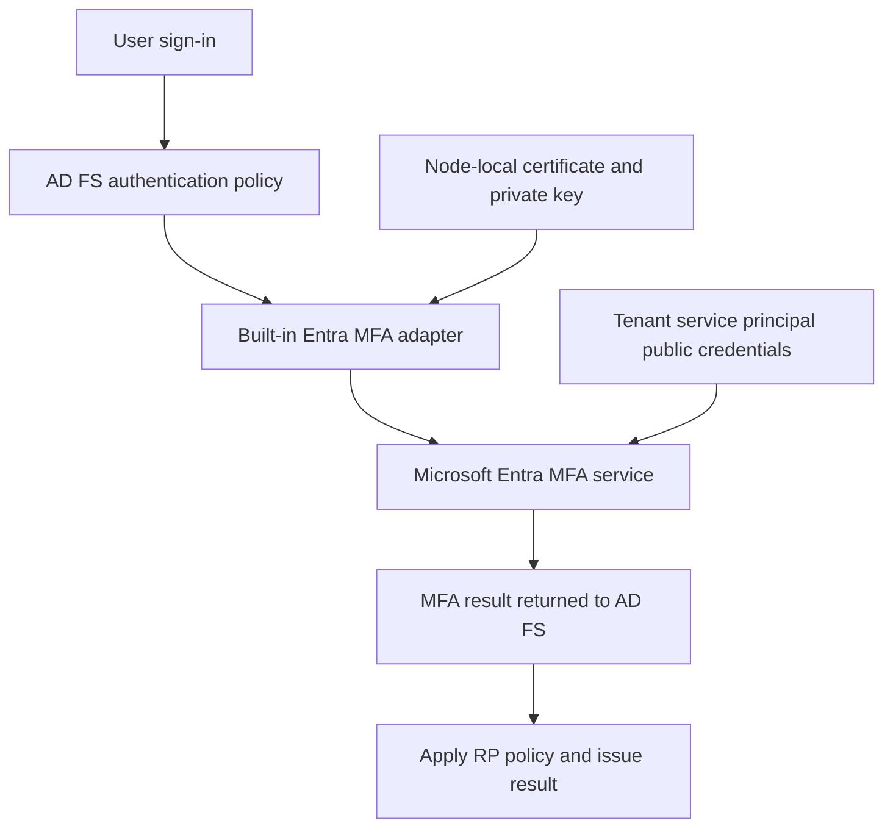

# AD FS and Microsoft Entra MFA: Configuration and Certificate Renewal

**The certificate used by the MFA adapter is not the federation TLS certificate.**

AD FS on Windows Server 2016 and later includes the Microsoft Entra MFA adapter. It calls the cloud MFA service without requiring the old on-premises MFA Server product or a separately installed adapter. Configuring this connection is different from writing an AD FS rule that requires MFA.

This guide covers the adapter's tenant connection, per-node credentials, authentication choices and renewal. It replaces historical MSOnline credential-registration examples with Microsoft Graph. It does not change an application's MFA requirement automatically.

## 1. Separate node credentials, farm settings and policy

| Item | Scope | Purpose |
|---|---|---|
| MFA tenant certificate and private key | Each AD FS node's local computer certificate store | Authenticate that node to the MFA service |
| Public certificate in `keyCredentials` | MFA client service principal in the Entra tenant | Let the cloud service verify the node's credential |
| AD FS tenant/client configuration | Farm | Bind the built-in adapter to the intended tenant/client |
| Authentication provider selection and RP policy | Farm/RP, as applicable | Decide when the adapter is invoked |
| Entra federation and Conditional Access configuration | Entra tenant/domain/resource | Decide whether and how the federated MFA result satisfies a cloud requirement |



The well-known client application ID is `981f26a1-7f43-403b-a875-f8b09b8cd720`. The service principal's **object ID in your tenant is different**. Neither value is an AD FS Windows service account or a Kerberos SPN.

## 2. Check prerequisites and retain the before-state

- Use a patched, supported AD FS version and the applicable Microsoft Entra MFA licensing. For the documented topology, the environment is federated with the intended Entra tenant.
- Users need a supported, allowed verification method registered in Entra. Registration in another MFA system does not populate this adapter's methods.
- Each AD FS node needs the documented outbound HTTPS access, including `adnotifications.windowsazure.com` and `login.microsoftonline.com` for the public cloud. Check the actual service-account/proxy/TLS path, not just an administrator's browser. Sovereign clouds have different endpoint/configuration requirements.
- Use elevated Windows PowerShell with the ADFS module for local/farm operations. Entra administration can run from a separate management host with `Microsoft.Graph.Authentication` and `Microsoft.Graph.Applications` installed.
- The Graph write examples require consented `Application.ReadWrite.All` and an appropriate role, such as Application Administrator under the documented deployment requirements. These are credential-management privileges; ordinary MFA users do not need them.

Record current authentication provider lists, tenant binding, node certificate thumbprints/validity/private-key access, and existing cloud key IDs. Retain a working authentication path while changing policy. In a WID farm, perform farm configuration writes on the primary; **local certificate work is still required on every serving node**.

For a new configuration, use the tenant GUID recorded in the Entra admin center. Older deployments may have used a tenant domain name in AD FS. During renewal, preserve the established AD FS tenant identifier rather than silently changing it; use the directory's GUID for the Graph connection.

## 3. Obtain the certificate on each AD FS node

For initial configuration, run on one node at a time. Replace the sample tenant ID. This command can create a certificate after confirmation; it can also return an already configured certificate. It is not a read-only inventory command:

```powershell
Import-Module ADFS -ErrorAction Stop
$adfsTenantId = '11111111-2222-3333-4444-555555555555'
$certBase64 = New-AdfsAzureMfaTenantCertificate -TenantId $adfsTenantId `
    -Confirm -ErrorAction Stop
```

Decode the returned public certificate and verify that the same node has its private key. This decoding step also works with the output of the renewal command later in this guide:

```powershell
if ([string]::IsNullOrWhiteSpace($certBase64)) {
    throw 'No MFA certificate was returned; stop before tenant registration.'
}
$mfaCertificate = [Security.Cryptography.X509Certificates.X509Certificate2]::new(
    [Convert]::FromBase64String($certBase64)
)
if ($mfaCertificate.NotAfter.ToUniversalTime() -le [DateTime]::UtcNow) {
    throw 'The returned MFA certificate has expired.'
}
$localCertificate = Get-Item -LiteralPath ('Cert:\LocalMachine\My\' + $mfaCertificate.Thumbprint) `
    -ErrorAction Stop
if (-not $localCertificate.HasPrivateKey) {
    throw 'The MFA certificate on this node has no private key.'
}
$localCertificate | Select-Object Subject, Thumbprint, NotBefore, NotAfter, HasPrivateKey
```

Verify the tenant identity in the subject. The native cmdlet reference describes certificates with `CN=<tenant identifier>` and `OU=Microsoft AD FS Azure MFA`; product renaming does not mean that every certificate subject has been renamed. `HasPrivateKey` shows presence, not proof that the AD FS service identity can use the key.

For cloud registration from another host, transfer only the reviewed **public certificate** and initialize `$mfaCertificate` from it there. Do not transfer a PFX/private key to Graph. DER is binary certificate data; reading a DER file in a text editor does not produce a valid base64 string. The base64 output above is already suitable for `FromBase64String`.

## 4. Register the public certificate without dropping other nodes' keys

Connect explicitly to the intended tenant and resolve the existing service principal:

```powershell
Import-Module Microsoft.Graph.Authentication -ErrorAction Stop
Import-Module Microsoft.Graph.Applications -ErrorAction Stop
$directoryTenantId = '11111111-2222-3333-4444-555555555555'
$mfaClientId = '981f26a1-7f43-403b-a875-f8b09b8cd720'
Connect-MgGraph -TenantId $directoryTenantId -Scopes 'Application.ReadWrite.All' `
    -ContextScope Process -NoWelcome -ErrorAction Stop
if ((Get-MgContext).TenantId -ne $directoryTenantId) {
    throw 'The Graph session is not connected to the intended tenant.'
}
$candidates = @(Get-MgServicePrincipal -Filter "appId eq '$mfaClientId'" `
    -Property Id, AppId -ErrorAction Stop)
if ($candidates.Count -ne 1) {
    throw 'Expected one MFA client service principal; review the tenant and provisioning state.'
}
$servicePrincipalId = $candidates[0].Id
```

This procedure does not create a similarly named app or guess an object ID if discovery fails.

**`Update-MgServicePrincipal -KeyCredentials` supplies the entire collection, not an append operation.** Read the single object by ID with an explicit `keyCredentials` selection to retrieve public key material. A list response or default-property response is not an adequate payload to write back.

Serialize credential changes for this service principal. Do not run parallel registration scripts from all farm nodes. Rebuild the following payload from a fresh read immediately before the real write, including after a long review pause:

```powershell
$servicePrincipal = Get-MgServicePrincipal -ServicePrincipalId $servicePrincipalId `
    -Property Id, AppId, KeyCredentials -ErrorAction Stop
if ($servicePrincipal.AppId -ne $mfaClientId -or $null -eq $servicePrincipal.KeyCredentials) {
    throw 'Unexpected MFA client or missing credential collection; do not replace it.'
}
$existingKeys = @($servicePrincipal.KeyCredentials)
$publicCertBase64 = [Convert]::ToBase64String($mfaCertificate.RawData)
foreach ($credential in $existingKeys) {
    if ($null -eq $credential.Key -or $credential.Key.Length -eq 0) {
        throw 'An existing credential has no returned key bytes; do not overwrite the collection.'
    }
    if ([Convert]::ToBase64String($credential.Key) -eq $publicCertBase64) {
        throw 'This certificate is already registered; verify it instead of adding a duplicate.'
    }
}
$newKey = @{
    KeyId = [guid]::NewGuid()
    DisplayName = 'AD FS MFA - FS03'
    Type = 'AsymmetricX509Cert'
    Usage = 'Verify'
    Key = $mfaCertificate.RawData
    CustomKeyIdentifier = $mfaCertificate.GetCertHash()
    StartDateTime = $mfaCertificate.NotBefore.ToUniversalTime()
    EndDateTime = $mfaCertificate.NotAfter.ToUniversalTime()
}
$pendingKeys = @($existingKeys) + @($newKey)
$pendingKeys | Select-Object KeyId, DisplayName, Type, Usage, StartDateTime, EndDateTime
```

Replace the display label with the corresponding node. Retain the existing key IDs and public certificate inventory. A genuinely empty returned collection is different from a missing collection or missing key bytes.

Preview the write:

```powershell
Update-MgServicePrincipal -ServicePrincipalId $servicePrincipalId `
    -KeyCredentials $pendingKeys -WhatIf -ErrorAction Stop
```

After reviewing the complete payload and ensuring no concurrent administrator or job is updating it, replace `-WhatIf` with `-Confirm` for the real write. This manual read/modify/write sequence is **not an atomic concurrency lock**. Never repair a rejected payload by discarding keys belonging to other nodes or removing unknown credentials.

After the real update, read the object again and check both the new key and all retained keys:

```powershell
$registered = Get-MgServicePrincipal -ServicePrincipalId $servicePrincipalId `
    -Property Id, AppId, KeyCredentials -ErrorAction Stop
foreach ($expectedKey in $pendingKeys) {
    $observed = @($registered.KeyCredentials | Where-Object { $_.KeyId -eq $expectedKey.KeyId })
    if ($observed.Count -ne 1 -or $null -eq $observed[0].Key) {
        throw 'An expected key is missing after registration; stop and investigate.'
    }
    if ([Convert]::ToBase64String($observed[0].Key) -ne [Convert]::ToBase64String($expectedKey.Key)) {
        throw 'Registered certificate bytes differ from the reviewed payload.'
    }
}
$registered.KeyCredentials | Select-Object KeyId, DisplayName, StartDateTime, EndDateTime
```

Repeat the node certificate and serialized cloud-registration steps for every serving AD FS node. A farm-wide policy does not copy the local certificate/private key to another node. Keep a node-to-thumbprint/key-ID record for renewal and troubleshooting.

## 5. Configure the farm, then select authentication behavior

After every serving node's public certificate is registered, preview the tenant binding once for the farm, using the recorded AD FS tenant identifier:

```powershell
Set-AdfsAzureMfaTenant -TenantId $adfsTenantId `
    -ClientId '981f26a1-7f43-403b-a875-f8b09b8cd720' -WhatIf -ErrorAction Stop
```

Replace `-WhatIf` with `-Confirm` for the actual configuration. Complete the documented service restart on each AD FS node, draining one node at a time from the load balancer and validating it before returning it to service. Do not restart every node at once or assume the preview configured the farm.

Inventory provider availability and current policy:

```powershell
Get-AdfsAuthenticationProvider -ErrorAction Stop
Get-AdfsGlobalAuthenticationPolicy -ErrorAction Stop |
    Format-List PrimaryIntranetAuthenticationProvider, PrimaryExtranetAuthenticationProvider,
        AdditionalAuthenticationProvider, AllowAdditionalAuthenticationAsPrimary
```

In AD FS Management, select the provider in the intended primary or additional authentication settings. The additional-provider tab is named **Additional** in AD FS 2019. Enabling the provider makes it available; the applicable authentication/access policy must still require it. If using PowerShell to change provider arrays, preserve all required current entries rather than replacing a collection with a single provider by accident.

| Choice | Important distinction |
|---|---|
| Password/WIA followed by Entra MFA as additional authentication | A two-step path when the policy actually invokes and successfully completes the second factor |
| Entra MFA adapter as primary authentication | Microsoft documents this use as a single factor; the adapter's product name does not automatically make it two factors |
| External provider as primary, password as additional on AD FS 2019 | Requires the corresponding supported provider/FBL/policy configuration; a generic provider registration does not enable this ordering |

For the documented **AD FS 2019 Entra MFA-as-primary** scenario, Microsoft also calls out changing the built-in Active Directory claims-provider anchor to the UPN claim. Review the current `AnchorClaimType` and the linked scenario-specific instructions before doing so. This is not a mandatory change for every farm upgrade or every additional-MFA deployment.

The 2019 external-as-primary capability uses `AllowAdditionalAuthenticationAsPrimary` and the paginated sign-in experience. Preserve enrollment, alternative sign-in and recovery paths when selecting it. Merely moving an adapter earlier in the flow does not establish a phishing-resistant authentication strength.

For Microsoft 365/Entra resources, check the domain's `federatedIdpMfaBehavior` and the actual MFA result. When set, that behavior takes precedence over legacy `SupportsMfa`; do not copy an old `Set-MsolDomainFederationSettings` recipe. See [where AD FS and Conditional Access policies are enforced](../Concepts/AD%20FS%20and%20Entra%20Conditional%20Access%20-%20Where%20Policies%20Are%20Enforced.md) and the [existing additional-authentication rule examples](ADFS%20and%20MFA%20-%20Configuring%20multiple%20additional%20authentication%20rules.md).

## 6. Renew before expiry, with an overlap

The documented MFA tenant certificates normally last two years. Monitor each node's actual `NotBefore`/`NotAfter`, not the TLS certificate or a single farm member. Inspect the matching entries in `Cert:\LocalMachine\My` without using a creation cmdlet as a monitoring probe.

While the existing certificate is still valid, generate the replacement **on each node**, after reviewing that node's state:

```powershell
$certBase64 = New-AdfsAzureMfaTenantCertificate -TenantId $adfsTenantId `
    -Renew $true -Confirm -ErrorAction Stop
```

Then repeat the decoding/private-key check and public-key registration steps with this new output. The documented renewal certificate starts being valid approximately **two days later**, allowing time to register it in Entra before AD FS selects it. Do not rewrite its start date to make it immediately active, and do not retire the current credential during that interval.

```text
Generate replacement -> register its public key -> wait for actual NotBefore
                    -> observe selection on each node -> verify real MFA
                    -> retire only proven-unused old credentials later
```

Once valid, automatic selection can take a few hours to a day. AD FS/Admin event **547** records the tenant and old/new thumbprints. Correlate that event with the intended certificate and a fresh MFA transaction on the same node; a cloud key-list entry alone does not prove the node is using it.

For renewal before expiry, Microsoft does not require an AD FS service restart merely to switch certificates. If the old certificate has **already expired**, follow the documented recovery path **without `-Renew $true`**, register the replacement public credential and restart the affected AD FS service after draining the node. A not-yet-valid renewal certificate is not an immediate outage repair.

Do not delete the service principal or replace its whole credential collection with the newest key during cleanup. Remove only a specifically identified obsolete credential after all dependent nodes and the recovery window have been accounted for. Re-read the collection before any later change.

## 7. Verify and diagnose by failure boundary

| Symptom | First evidence to inspect |
|---|---|
| Failures depend on which node handles the request | That node's local certificate, private-key access and corresponding tenant public key |
| All nodes fail after a credential update | Wrong tenant/client or existing keys lost from a collection replacement |
| New certificate exists but is not used | `NotBefore`, cloud registration, selection timing and event 547 |
| Failure after expiry | Correct expired-certificate replacement path, public-key registration and controlled service restart |
| Provider unavailable for additional authentication | Provider enabled in the intended policy, not just a tenant binding |
| Unregistered user cannot complete authentication | Enrollment/bootstrap path; do not assume a missing verification method is a certificate failure |
| AD FS succeeds but Entra still requires MFA | Federation MFA behavior, claims, session and resource policy |

Test known enrolled users, an unenrolled user, each serving node, intranet/extranet paths in scope and the actual relying-party applications. Confirm not only a successful prompt but the expected authorization result and cloud interpretation where applicable.

## 8. Diagnose double prompts and MSIS7042 loops

*Added from the AD FS 2016 operational notes, 2026-10-01.* Two prompts do not necessarily mean that the MFA adapter was invoked twice. Identify each authority and the factor it actually requested:

```text
Entra resource policy requests MFA
    -> federation behavior determines whether AD FS or Entra must satisfy it
    -> AD FS authenticates under its actual provider/RP policy
    -> the returned result must truthfully describe what happened
    -> Entra evaluates that result and the resource's remaining requirements
```

| Observation | Check |
|---|---|
| AD FS performs MFA, then Entra requests another challenge | The actual returned MFA claim, domain federation behavior, authentication strength and session requirements |
| Entra repeatedly sends the browser back to AD FS | A requested factor cannot be completed or the expected result is missing/unacceptable; also inspect cookies and redirect continuity |
| AD FS reports `MSIS7042` | Loop detection has stopped repeated requests; this is a symptom, not a unique diagnosis of missing MFA claims |
| Some users loop while enrolled users succeed | Enrollment, permitted methods and the intended provider path |
| Failure depends on the node | Local adapter credential, outbound connectivity and provider configuration |


*Historical screenshot excerpt from [Kevin Saye's archived federation/MFA example](https://learn.microsoft.com/en-us/archive/blogs/pauljones/advanced-customization-of-adfs-for-cloud-usage-part-2-of-4), cropped with the account/server row masked. The capture shows event 364 and `MSIS7042`; diagnose the message and correlated requests, not a different event number quoted in the old prose. Its 2015 MSOnline configuration recipe is not the current procedure in this guide.*

For WS-Federation, a request may contain `wauth` requesting `multipleauthn`. That is a **request**, not evidence that two factors were performed. Likewise, a result containing `http://schemas.microsoft.com/claims/authnmethodsreferences` with value `http://schemas.microsoft.com/claims/multipleauthn` must originate from a trusted, correctly represented authentication result.

Inspect the specific Microsoft 365 RP without changing its rule collections:

```powershell
$cloudRelyingParties = @(Get-AdfsRelyingPartyTrust -Identifier 'urn:federation:MicrosoftOnline' `
    -ErrorAction Stop)
if ($cloudRelyingParties.Count -ne 1) {
    throw 'Expected one Microsoft 365 relying party; verify the farm and identifier.'
}
$cloudRelyingParties[0] | Format-List Name, Identifier, AccessControlPolicyName,
    AdditionalAuthenticationRules, IssuanceTransformRules
```

Protect exported rules and traces because they can contain organizational identifiers. Compare the actual authentication result with the applicable acceptance and issuance rules; a rule existing in configuration is not proof it fired on this request.

Do not resolve a loop by unconditionally issuing `multipleauthn`, or by translating every `AzurePrimaryAuthentication` result into MFA. As described earlier, the Entra MFA adapter used as primary can represent only one factor. Falsely asserting MFA can make a resource accept authentication that never met its requirement.

For the cloud decision, read the current `federatedIdpMfaBehavior`. Its configured value takes precedence over legacy `SupportsMfa`: `rejectMfaByFederatedIdp`, for example, intentionally leaves the MFA requirement to Entra rather than accepting the IdP result. Use the [federation-policy explanation](../Concepts/AD%20FS%20and%20Entra%20Conditional%20Access%20-%20Where%20Policies%20Are%20Enforced.md) instead of toggling an obsolete MSOnline switch until the symptom disappears.

For an unenrolled user, use the [registration guidance](../Troubleshoot/AD%20FS%20and%20MFA%20Registration%20-%20Guiding%20Unregistered%20Users.md), not a fabricated claim or a blanket enrollment-policy exemption. A historic on-premises MFA Server integration is also not the built-in cloud adapter configured in this article.

**Verify:** reproduce one fresh sign-in, record the resource, node, request time and relevant correlation identifiers, and inspect both AD FS and Entra authentication evidence. Test the intended denial as well as success. Preserve working rule collections and restore only the specific reviewed change if necessary; do not replace the RP's entire rule set with a single pass-through rule.

## References

- [Microsoft Learn: Configure AD FS and Microsoft Entra MFA, including renewal and expired-certificate recovery](https://learn.microsoft.com/en-us/windows-server/identity/ad-fs/operations/configure-ad-fs-and-azure-mfa)
- [Microsoft Learn: New-AdfsAzureMfaTenantCertificate syntax and certificate identity](https://learn.microsoft.com/en-us/powershell/module/adfs/new-adfsazuremfatenantcertificate?view=windowsserver2022-ps)
- [Microsoft Learn: Set-AdfsAzureMfaTenant](https://learn.microsoft.com/en-us/powershell/module/adfs/set-adfsazuremfatenant?view=windowsserver2022-ps)
- [Microsoft Graph: Get a service principal and explicitly select keyCredentials](https://learn.microsoft.com/en-us/graph/api/serviceprincipal-get?view=graph-rest-1.0)
- [Microsoft Graph PowerShell: Update-MgServicePrincipal](https://learn.microsoft.com/en-us/powershell/module/microsoft.graph.applications/update-mgserviceprincipal?view=graph-powershell-1.0)
- [Microsoft Learn: AD FS paginated sign-in and external authentication as primary](https://learn.microsoft.com/en-us/windows-server/identity/ad-fs/operations/ad-fs-paginated-sign-in)