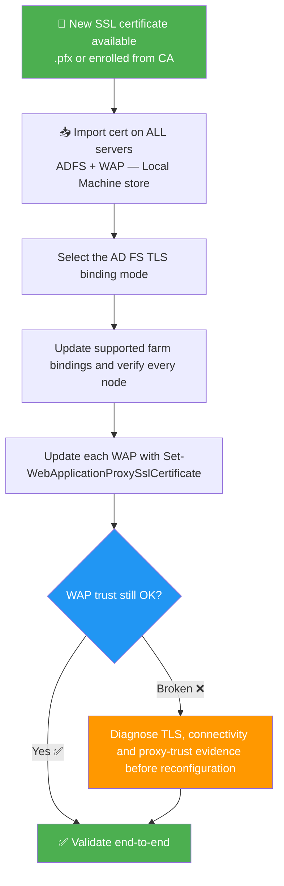

# ADFS & WAP — Replace the SSL Certificate

> This article walks you through replacing the **SSL/TLS certificate** on an **AD FS farm** and its **Web Application Proxy (WAP)** servers — the right way, without breaking the WAP trust.

🗓️ Published: 2026-04-23

---

## 🗂️ Table of Contents

- [1. Context and Scope](#1-context-and-scope)
- [2. Prerequisites](#2-prerequisites)
- [3. Import the Certificate on All Servers](#3-import-the-certificate-on-all-servers)
- [4. Update the Certificate on ADFS Servers](#4-update-the-certificate-on-adfs-servers)
  - [4.1. Update the SSL Binding](#41-update-the-ssl-binding)
  - [4.2. Update the Service Communications Certificate](#42-update-the-service-communications-certificate)
  - [4.3. Verify Bindings and the Presented Certificate](#43-verify-bindings-and-the-presented-certificate)
- [5. Update the Certificate on WAP Servers](#5-update-the-certificate-on-wap-servers)
  - [5.1. Server 2016 and Later](#51-server-2016-and-later)
  - [5.2. Server 2012 R2](#52-server-2012-r2)
- [6. Re-establish the WAP Trust (if needed)](#6-re-establish-the-wap-trust-if-needed)
- [7. End-to-End Validation](#7-end-to-end-validation)
- [8. Gotchas and Common Issues](#8-gotchas-and-common-issues)

---

## 📊 Operation Overview



---

## 1. Context and Scope

The certificate roles and configuration surfaces must be kept separate:

| Role | Description |
|---|---|
| **HTTPS binding** | TLS certificate presented to browsers and clients on port 443 |
| **Service Communications** | Certificate reference in AD FS configuration; changing it is not changing the HTTP.sys TLS bindings |
| **User certificate authentication** | Uses port 49443 in default binding mode, or `certauth.<federation-name>` on 443 in alternate TLS binding mode |
| **WAP TLS binding** | Certificate used by WAP for the federation service; Microsoft recommends a common suitable TLS certificate across AD FS and WAP |
| **WAP proxy-trust certificate** | Separate credential established during proxy registration; not the Service Communications entry |

**Port 49443 is not the generic WAP-to-AD FS trust port.** In default mode it serves user certificate authentication. Updating `Set-AdfsCertificate -CertificateType Service-Communications` does not renew the TLS bindings on either 443 or 49443. Use the supported TLS cmdlet for the actual binding mode and verify the certificate presented over the network.

Typical ADFS certificate (SAN):
- `adfs.contoso.com` — the federation service name
- `enterpriseregistration.contoso.com` — optional, for Workplace Join / device registration
- `certauth.adfs.contoso.com` - required by an alternate client TLS binding deployment; a wildcard for `*.contoso.com` does not cover this two-label name

This workflow focuses on current Windows Server 2022/2025 farms. Confirm the farm behavior level, certificate-authentication mode and topology before applying commands from a different AD FS generation.

For token-signing/decryption rollover and partner trust, see [AD FS Certificates Explained](../Concepts/AD%20FS%20Certificates%20Explained%20-%20TLS,%20Token%20Signing,%20Token%20Decryption%20and%20Rollover.md). Those operations are not part of an ordinary TLS-binding renewal.

---

## 2. Prerequisites

Before starting:

- The **new certificate** is available as a `.pfx` (with private key) or already enrolled in the machine store
- The certificate covers the **federation service FQDN** (e.g. `adfs.contoso.com`)
- You have **local admin + ADFS admin** rights on all ADFS and WAP servers
- You know the **thumbprint** of the new certificate (you'll need it throughout)
- Record existing bindings, thumbprints, mode, farm nodes and WAP configuration before changing them
- Plan the maintenance/rollback sequence; do not force-restart every service as an unconditional certificate-renewal step

> 💡 To get the thumbprint from the certificate store:
> ```powershell
> Get-ChildItem -Path Cert:\LocalMachine\My | Where-Object { $_.Subject -like "*adfs*" } | Select-Object Subject, Thumbprint, NotAfter
> ```

---

## 3. Import the Certificate on All Servers

This step must be done on **every ADFS server** and **every WAP server**.

If you have a `.pfx` file, import it with:

```powershell
$pfxPath = "C:\Certs\new-adfs-cert.pfx"
$pfxPassword = Read-Host -AsSecureString -Prompt "PFX Password"

Import-PfxCertificate -FilePath $pfxPath `
    -CertStoreLocation Cert:\LocalMachine\My `
    -Password $pfxPassword
```

After import, confirm the thumbprint:

```powershell
Get-ChildItem Cert:\LocalMachine\My | Where-Object { $_.Subject -like "*adfs*" } | Select-Object Thumbprint, Subject, NotAfter
```

Note the thumbprint — you'll use it in the next steps.

For current AD FS TLS bindings, Microsoft's supported TLS cmdlets grant the `adfssrv` service principal the required private-key read permission. Do not apply a generic service-account ACL script to a guessed CNG/CSP key-file path. Token-signing/decryption certificate access is a different operation with different requirements.

Verify the private key, Server Authentication use, certificate names, chain and validity on each node. Possession of a certificate file without its usable private key is not sufficient.

---

## 4. Update the Certificate on ADFS Servers

For supported modern farms, the TLS cmdlets are multi-node operations. Run from the designated AD FS administration node, the primary in a WID farm, and check the documented farm/build prerequisites. They use PowerShell remoting to reach the other AD FS nodes; import the certificate on every node first and verify the result on each one. WAP servers are updated separately.

### 4.1. Update the SSL Binding

Inspect the existing bindings and recorded deployment mode first:

```powershell
Get-AdfsSslCertificate -ErrorAction Stop
Get-AdfsFarmInformation -ErrorAction Stop
```

Use `Set-AdfsSslCertificate` for the **default** mode. Use `Set-AdfsAlternateTlsClientBinding` when **alternate client TLS binding** is already configured. The latter manages the alternate binding and the other TLS bindings for AD FS. Choosing a different branch is not an incidental way to migrate the certificate-authentication architecture.

The wrapper supplies a preview and rejects a certificate without a private key or outside its validity period. It does not replace the SAN, chain, farm-node and mode review:

```powershell
function Set-ReviewedAdfsTlsBinding {
  [CmdletBinding(SupportsShouldProcess, ConfirmImpact = 'High')]
  param(
    [Parameter(Mandatory)][ValidateSet('Default', 'Alternate')][string]$BindingMode,
    [Parameter(Mandatory)][ValidatePattern('^[0-9A-Fa-f]{40}$')][string]$Thumbprint
  )

  $certificate = Get-Item -LiteralPath "Cert:\LocalMachine\My\$Thumbprint" -ErrorAction Stop
  if (-not $certificate.HasPrivateKey) { throw 'The local certificate has no private key.' }
  $now = Get-Date
  if ($certificate.NotBefore -gt $now -or $certificate.NotAfter -le $now) {
    throw 'The certificate is not currently valid.'
  }

  if ($PSCmdlet.ShouldProcess("AD FS farm: $BindingMode mode", "Bind TLS certificate $Thumbprint")) {
    if ($BindingMode -eq 'Alternate') {
      Set-AdfsAlternateTlsClientBinding -Thumbprint $Thumbprint -ErrorAction Stop
    } else {
      Set-AdfsSslCertificate -Thumbprint $Thumbprint -ErrorAction Stop
    }
  }
}

$thumbprint = (Read-Host 'Reviewed TLS certificate thumbprint').Replace(' ', '')
Set-ReviewedAdfsTlsBinding -BindingMode Default -Thumbprint $thumbprint -WhatIf
```

Select the verified mode, inspect the preview, then remove `-WhatIf` and confirm the intended change. A multi-node operation can partially succeed: retain its output and inspect every node before retrying. Do not manually delete HTTP.sys bindings as a routine fallback.

### 4.2. Update the Service Communications Certificate

Review this configuration record separately:

```powershell
Get-AdfsCertificate -CertificateType Service-Communications -ErrorAction Stop
```

If the deployment's supported procedure also calls for replacing this record, `Set-AdfsCertificate -CertificateType Service-Communications` is the separate configuration operation. It does not update HTTP.sys or rotate the WAP proxy-trust certificate. Do not infer that the TLS renewal failed solely because this record differs from the certificate presented on 443.

### 4.3. Verify Bindings and the Presented Certificate

```powershell
Get-Service -Name adfssrv -ErrorAction Stop |
  Select-Object Name, Status
Get-AdfsSslCertificate -ErrorAction Stop
```

Use a fresh TLS connection with normal certificate validation. Supplying a node address as `ConnectTo` while retaining the federation hostname as `ServerName` allows node-specific checks without losing SNI/name validation:

```powershell
function Get-PresentedTlsCertificate {
  [CmdletBinding()]
  param(
    [Parameter(Mandatory)][string]$ConnectTo,
    [Parameter(Mandatory)][string]$ServerName,
    [ValidateRange(1, 65535)][int]$Port = 443
  )

  $client = New-Object Net.Sockets.TcpClient
  $stream = $null
  $certificate = $null
  try {
    $connection = $client.ConnectAsync($ConnectTo, $Port)
    if (-not $connection.Wait(5000)) { throw 'TCP connection timed out.' }
    $stream = New-Object Net.Security.SslStream($client.GetStream(), $false)
    $stream.ReadTimeout = 5000
    $stream.WriteTimeout = 5000
    $stream.AuthenticateAsClient($ServerName)
    $certificate = New-Object Security.Cryptography.X509Certificates.X509Certificate2($stream.RemoteCertificate)
    [pscustomobject]@{
      ConnectTo = $ConnectTo
      ServerName = $ServerName
      Port = $Port
      Subject = $certificate.Subject
      Thumbprint = $certificate.Thumbprint
      NotAfter = $certificate.NotAfter
    }
  } finally {
    if ($null -ne $certificate) { $certificate.Dispose() }
    if ($null -ne $stream) { $stream.Dispose() }
    $client.Dispose()
  }
}

Get-PresentedTlsCertificate -ConnectTo 'adfs.contoso.com' -ServerName 'adfs.contoso.com'
```

Compare the presented thumbprint with the intended certificate on the internal and external paths. A load balancer may present its own TLS certificate. Validate each relevant SNI hostname and the configured certificate-authentication binding, then test certificate authentication itself; a TLS handshake alone does not exercise the complete authentication flow.

The IdP-initiated sign-on page may intentionally be disabled. Do not enable it merely to test renewal or treat its absence as proof of a TLS failure. Use an existing RP flow and the published metadata endpoint instead. Do not bypass TLS validation to obtain a green test result.

---

## 5. Update the Certificate on WAP Servers

The WAP server has its own HTTPS binding on port 443 (external-facing). This must also be updated.

Run the following on **each WAP server**.

### 5.1. Server 2016 and Later

```powershell
$thumbprint = (Read-Host 'Reviewed WAP TLS certificate thumbprint').Replace(' ', '')

Set-WebApplicationProxySslCertificate -Thumbprint $thumbprint -ErrorAction Stop
```

This is a real update on the local WAP. Verify the private key, names and chain first, retain the old valid certificate for the rollback window, and check the external TLS/authentication result afterward. Do not assume the AD FS farm-wide update also changed WAP.

### 5.2. Server 2012 R2

Legacy AD FS/WAP has different build and multi-node behavior. Use the installed module's capabilities and the version-specific supported procedure; do not assume the WAP cmdlet is absent or delete a binding using a guessed AppId. This article does not prescribe a Windows Server 2012 R2 manual `netsh` replacement procedure.

---

## 6. Re-establish the WAP Trust (if needed)

WAP proxy registration establishes a separate trust credential. Its backend federation-service connection normally uses HTTPS on 443. Certificate-authentication publication can add other requirements, but this does not make 49443 the generic trust port.

If a problem appears after renewal, check DNS/load-balancer routing, certificate names, trust chains, HTTP.sys bindings, time and proxy-registration evidence before deciding to re-register. A TLS exception is not proof that the proxy-trust credential must be replaced:

```
The federation server proxy has encountered an error.
The underlying connection was closed: Could not establish trust relationship...
```

Only when diagnostics identify a registration/trust recovery need, retain the existing WAP configuration and application inventory, then use the supported reconfiguration on the affected WAP:

```powershell
$cred = Get-Credential -Message 'Identity with the required AD FS proxy-registration rights'

Install-WebApplicationProxy `
    -FederationServiceTrustCredential $cred `
    -CertificateThumbprint $thumbprint `
    -FederationServiceName "adfs.contoso.com"
```

`Install-WebApplicationProxy` changes registration/configuration. Do not describe it as a risk-free mandatory step after every TLS renewal. Verify the published application configuration and functional paths afterward.

Compare the application inventory with the retained before-state:

```powershell
Get-WebApplicationProxyApplication | Select-Object Name, BackendServerUrl, ExternalUrl
```

Listing configured applications is not an end-to-end proxy-trust test. Require a fresh authentication through WAP and review AD FS and WAP event logs for the same attempt.

---

## 7. End-to-End Validation

Once all servers are updated:

| Check | Command / Action |
|---|---|
| AD FS TLS certificate | Fresh TLS check for the federation name, each required binding and each farm node |
| ADFS federation metadata | `Invoke-WebRequest https://adfs.contoso.com/federationmetadata/2007-06/federationmetadata.xml` |
| Service Communications record | `Get-AdfsCertificate -CertificateType Service-Communications`; record separately from TLS bindings |
| WAP external binding | Browse from outside the network — confirm new cert is presented |
| WAP trust health | Fresh authentication through WAP, correlated with proxy-registration/authentication events |
| Event logs | Review **AD FS/Admin** and **Microsoft-Windows-WebApplicationProxy/Admin** on the appropriate servers |
| Authentication test | Do a full SSO test through a published application |

---

## 8. Gotchas and Common Issues

| Symptom | Investigation |
|---|---|
| Private key cannot be used | Identify the certificate role, key provider/store and supported service-principal permissions; do not guess the key-file path |
| WAP reports a TLS or 503 error | Separate backend TLS/connectivity from proxy registration; re-register only when the evidence supports it |
| Old certificate on 49443 | Inspect the default certificate-authentication TLS binding and actual node reached; changing Service Communications is not the binding fix |
| Old certificate on the public name | Check every WAP/load-balancer TLS termination point and routing path |
| Farm-wide operation partially fails | Inspect per-node results and remoting prerequisites before retrying; retain functioning nodes |

---

### ⚠️ Certificate not trusted by clients after renewal

**Symptom**: Browsers show a certificate warning even though the new cert is correctly bound.

**Root cause**: The new certificate's CA chain is not trusted, or the intermediate certificate is missing from the Local Machine store.

**Fix**: Install required intermediates on the TLS-serving systems and ensure clients trust the issuing root through the established trust policy. Installing a root on AD FS alone does not make every browser trust it. Do not install an unverified root or disable certificate validation to hide the failure.

For rollback, restore the recorded bindings on the affected nodes using the same supported mode-specific commands and the retained, still-valid old certificate. Re-test internal, external and certificate-authentication flows. A certificate rollback does not automatically reverse an unrelated WAP re-registration.

---

## 📚 Sources

- [Microsoft: manage TLS/SSL certificates in AD FS and WAP](https://learn.microsoft.com/en-us/windows-server/identity/ad-fs/operations/manage-ssl-certificates-ad-fs-wap)
- [Microsoft: alternate hostname binding for certificate authentication](https://learn.microsoft.com/en-us/windows-server/identity/ad-fs/operations/ad-fs-support-for-alternate-hostname-binding-for-certificate-authentication)
- [Microsoft Learn — Set-AdfsSslCertificate](https://learn.microsoft.com/en-us/powershell/module/adfs/set-adfssslcertificate)
- [Microsoft Learn — Set-AdfsCertificate](https://learn.microsoft.com/en-us/powershell/module/adfs/set-adfscertificate)
- [Microsoft Learn — Install-WebApplicationProxy](https://learn.microsoft.com/en-us/powershell/module/webapplicationproxy/install-webapplicationproxy)
- [Microsoft Learn — Set-WebApplicationProxySslCertificate](https://learn.microsoft.com/en-us/powershell/module/webapplicationproxy/set-webapplicationproxysslcertificate)
