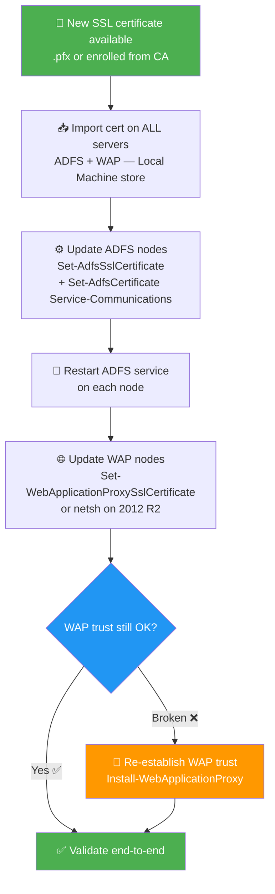

# ADFS & WAP — Replace the SSL Certificate

> This article walks you through replacing the **SSL/TLS certificate** on an **AD FS farm** and its **Web Application Proxy (WAP)** servers — the right way, without breaking the WAP trust.

🗓️ Published: 2026-04-23

---

## 🗂️ Table of Contents

- [1. Context and Scope](#1-context-and-scope)
- [2. Prerequisites](#2-prerequisites)
- [3. Import the Certificate on All Servers](#3-import-the-certificate-on-all-servers)
- [4. Update the Certificate on ADFS Servers](#4-update-the-certificate-on-adfs-servers)
  - [4.1. Update the SSL Binding](#41-update-the-ssl-binding)
  - [4.2. Update the Service Communications Certificate](#42-update-the-service-communications-certificate)
  - [4.3. Restart ADFS and Verify](#43-restart-adfs-and-verify)
- [5. Update the Certificate on WAP Servers](#5-update-the-certificate-on-wap-servers)
  - [5.1. Server 2016 and Later](#51-server-2016-and-later)
  - [5.2. Server 2012 R2](#52-server-2012-r2)
- [6. Re-establish the WAP Trust (if needed)](#6-re-establish-the-wap-trust-if-needed)
- [7. End-to-End Validation](#7-end-to-end-validation)
- [8. Gotchas and Common Issues](#8-gotchas-and-common-issues)

---

## 📊 Operation Overview



---

## 1. Context and Scope

The ADFS SSL certificate covers several things at once:

| Role | Description |
|---|---|
| **HTTPS binding** | TLS certificate presented to browsers and clients on port 443 |
| **Service Communications** | Certificate registered in the ADFS configuration — used for the WAP-to-ADFS trust on port 49443 |
| **WAP external binding** | The same (or a different) certificate used by WAP on its public-facing interface |

> ⚠️ **Both the SSL binding AND the Service Communications certificate must be updated.** Forgetting the Service Communications cert will leave ADFS presenting the old cert on port 49443, potentially breaking the WAP trust or causing certificate warnings even after the swap.

Typical ADFS certificate (SAN):
- `adfs.contoso.com` — the federation service name
- `enterpriseregistration.contoso.com` — optional, for Workplace Join / device registration

---

## 2. Prerequisites

Before starting:

- The **new certificate** is available as a `.pfx` (with private key) or already enrolled in the machine store
- The certificate covers the **federation service FQDN** (e.g. `adfs.contoso.com`)
- You have **local admin + ADFS admin** rights on all ADFS and WAP servers
- You know the **thumbprint** of the new certificate (you'll need it throughout)
- Plan a **maintenance window** — ADFS service restarts are required

> 💡 To get the thumbprint from the certificate store:
> ```powershell
> Get-ChildItem -Path Cert:\LocalMachine\My | Where-Object { $_.Subject -like "*adfs*" } | Select-Object Subject, Thumbprint, NotAfter
> ```

---

## 3. Import the Certificate on All Servers

This step must be done on **every ADFS server** and **every WAP server**.

If you have a `.pfx` file, import it with:

```powershell
$pfxPath = "C:\Certs\new-adfs-cert.pfx"
$pfxPassword = Read-Host -AsSecureString -Prompt "PFX Password"

Import-PfxCertificate -FilePath $pfxPath `
    -CertStoreLocation Cert:\LocalMachine\My `
    -Password $pfxPassword
```

After import, confirm the thumbprint:

```powershell
Get-ChildItem Cert:\LocalMachine\My | Where-Object { $_.Subject -like "*adfs*" } | Select-Object Thumbprint, Subject, NotAfter
```

Note the thumbprint — you'll use it in the next steps.

> ⚠️ **Private key permissions**: The ADFS service account (or gMSA) must have **Read** access to the private key. If the service fails to start after the swap, this is the first thing to check.
>
> ```powershell
> # Grant read access to the private key for the ADFS service account
> $cert = Get-Item "Cert:\LocalMachine\My\<THUMBPRINT>"
> $rsaKey = [System.Security.Cryptography.X509Certificates.RSACertificateExtensions]::GetRSAPrivateKey($cert)
> $keyPath = "$env:ALLUSERSPROFILE\Microsoft\Crypto\Keys\$($rsaKey.Key.UniqueName)"
>
> $acl = Get-Acl $keyPath
> $rule = New-Object System.Security.AccessControl.FileSystemAccessRule("domain\adfssvc", "Read", "Allow")
> $acl.AddAccessRule($rule)
> Set-Acl -Path $keyPath -AclObject $acl
> ```

---

## 4. Update the Certificate on ADFS Servers

Run the following on **each ADFS server** (primary first, then secondary nodes).

### 4.1. Update the SSL Binding

`Set-AdfsSslCertificate` updates the **HTTP.SYS TLS binding** on port 443 for the ADFS service:

```powershell
$thumbprint = "AABBCCDDEEFF..."  # Replace with your new cert thumbprint

Set-AdfsSslCertificate -Thumbprint $thumbprint
```

> 💡 This cmdlet replaces the `netsh http add sslcert` binding for ADFS — you don't need to run `netsh` manually on ADFS servers.

### 4.2. Update the Service Communications Certificate

This registers the new certificate as the **Service Communications** cert in the ADFS configuration. This is what WAP uses to trust the ADFS backend on port 49443:

```powershell
Set-AdfsCertificate -CertificateType Service-Communications -Thumbprint $thumbprint
```

Confirm both are updated:

```powershell
# Check SSL binding
Get-AdfsSslCertificate

# Check Service Communications cert
Get-AdfsCertificate -CertificateType Service-Communications
```

### 4.3. Restart ADFS and Verify

```powershell
Restart-Service adfssrv -Force
```

Check that ADFS is running and serving the new cert:

```powershell
# Quick check from the ADFS server itself
Invoke-WebRequest -Uri "https://adfs.contoso.com/adfs/ls/idpinitiatedsignon" -UseDefaultCredentials | Select-Object StatusCode
```

Or from a remote machine:

```powershell
$cert = (New-Object Net.Sockets.TcpClient("adfs.contoso.com", 443)).GetStream() | ForEach-Object {
    $ssl = New-Object Net.Security.SslStream($_)
    $ssl.AuthenticateAsClient("adfs.contoso.com")
    $ssl.RemoteCertificate
}
$cert | Select-Object Subject, Thumbprint, NotAfter
```

---

## 5. Update the Certificate on WAP Servers

The WAP server has its own HTTPS binding on port 443 (external-facing). This must also be updated.

Run the following on **each WAP server**.

### 5.1. Server 2016 and Later

```powershell
$thumbprint = "AABBCCDDEEFF..."

Set-WebApplicationProxySslCertificate -Thumbprint $thumbprint
```

Then restart the WAP service:

```powershell
Restart-Service AppProxySvc -Force
```

### 5.2. Server 2012 R2

`Set-WebApplicationProxySslCertificate` is not available on Windows Server 2012 R2. Update the binding manually with `netsh`:

```powershell
# First, get the Application ID for WAP (always this GUID for ADFS/WAP)
$appId = "{5d89a20c-beab-4389-9447-324788eb944a}"
$thumbprint = "AABBCCDDEEFF..."
$ip = "0.0.0.0"
$port = 443

# Remove old binding
netsh http delete sslcert ipport=$ip`:$port

# Add new binding
netsh http add sslcert ipport=$ip`:$port certhash=$thumbprint appid=$appId
```

Then restart:

```powershell
Restart-Service AppProxySvc -Force
```

---

## 6. Re-establish the WAP Trust (if needed)

The WAP trust with ADFS relies on the **Service Communications certificate** for mutual authentication on port 49443. After updating the Service Communications cert on ADFS, the WAP servers may lose trust and show errors like:

```
The federation server proxy has encountered an error.
The underlying connection was closed: Could not establish trust relationship...
```

To re-establish the trust, run on each WAP server:

```powershell
$cred = Get-Credential  # ADFS admin credentials

Install-WebApplicationProxy `
    -FederationServiceTrustCredential $cred `
    -CertificateThumbprint $thumbprint `
    -FederationServiceName "adfs.contoso.com"
```

> 💡 `Install-WebApplicationProxy` is **non-destructive** when the WAP role is already installed — it just updates the trust configuration and certificate binding. Published applications are preserved.

Verify the trust is healthy:

```powershell
Get-WebApplicationProxyApplication | Select-Object Name, BackendServerUrl, ExternalUrl
```

If the WAP-to-ADFS proxy trust is healthy, this command should return your published applications without error.

---

## 7. End-to-End Validation

Once all servers are updated:

| Check | Command / Action |
|---|---|
| ADFS SSL cert (from outside) | Browse to `https://adfs.contoso.com/adfs/ls/idpinitiatedsignon` — check cert in browser |
| ADFS federation metadata | `Invoke-WebRequest https://adfs.contoso.com/federationmetadata/2007-06/federationmetadata.xml` |
| Service Communications cert | `Get-AdfsCertificate -CertificateType Service-Communications` |
| WAP external binding | Browse from outside the network — confirm new cert is presented |
| WAP trust health | `Get-WebApplicationProxyHealth` |
| Event logs | Check **ADFS Admin** log and **WAP Admin** log for errors (Event Viewer → Applications and Services Logs → AD FS) |
| Authentication test | Do a full SSO test through a published application |

---

## 8. Gotchas and Common Issues

### ⚠️ Private key not accessible — ADFS service fails to start

**Symptom**: ADFS service won't start after the cert swap. Event log shows "The service account does not have access to the private key".

**Fix**: Grant the ADFS service account (or gMSA) **Read** access to the private key of the new certificate (see step 3).

---

### ⚠️ WAP trust broken after Service Communications cert update

**Symptom**: WAP can no longer communicate with ADFS. Proxy returns 503 or certificate trust errors.

**Root cause**: The WAP trust is pinned to the Service Communications cert thumbprint. Updating this cert on ADFS invalidates the existing trust.

**Fix**: Re-run `Install-WebApplicationProxy` on each WAP server (see [step 6](#6-re-establish-the-wap-trust-if-needed)).

---

### ⚠️ Old cert still showing on port 49443

**Symptom**: Browser sees the new cert on port 443, but WAP-to-ADFS trust is using the old cert.

**Root cause**: `Set-AdfsCertificate -CertificateType Service-Communications` was skipped.

**Fix**: Run the cmdlet and restart `adfssrv`.

---

### ⚠️ netsh binding conflict on WAP (2012 R2)

**Symptom**: `netsh http add sslcert` fails with "The parameter is incorrect" or "Cannot create a file when that file already exists".

**Fix**: Always delete the old binding first before adding the new one:

```powershell
netsh http delete sslcert ipport=0.0.0.0:443
netsh http add sslcert ipport=0.0.0.0:443 certhash=<NEWTHUMBPRINT> appid="{5d89a20c-beab-4389-9447-324788eb944a}"
```

---

### ⚠️ Certificate not trusted by clients after renewal

**Symptom**: Browsers show a certificate warning even though the new cert is correctly bound.

**Root cause**: The new certificate's CA chain is not trusted, or the intermediate certificate is missing from the Local Machine store.

**Fix**: Import the full certificate chain (root CA + intermediates) into **Cert:\LocalMachine\CA** and **Cert:\LocalMachine\Root** as appropriate, on all ADFS and WAP servers.

---

## 📚 Sources

- [Microsoft Learn — Set-AdfsSslCertificate](https://learn.microsoft.com/en-us/powershell/module/adfs/set-adfssslcertificate)
- [Microsoft Learn — Set-AdfsCertificate](https://learn.microsoft.com/en-us/powershell/module/adfs/set-adfscertificate)
- [Microsoft Learn — Install-WebApplicationProxy](https://learn.microsoft.com/en-us/powershell/module/webapplicationproxy/install-webapplicationproxy)
- [Microsoft Learn — Set-WebApplicationProxySslCertificate](https://learn.microsoft.com/en-us/powershell/module/webapplicationproxy/set-webapplicationproxysslcertificate)
