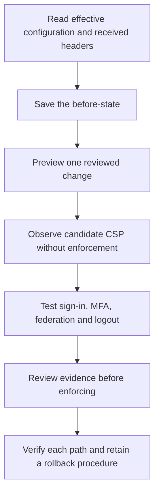

# Hardening AD FS HTTP Response Headers: HSTS, CSP and Validation

**A header scanner can report a stronger policy while your users stare at a broken sign-in page. Validate both the protection and the authentication flow.**

AD FS provides supported response-header configuration. Windows Server 2022/2025 administrators still need to account for the farm's settings, WAP/load-balancer behavior, browser support, customized pages and protocol callbacks. The response received by the browser is the final evidence.

> **TL;DR**
> - Inventory the current configuration and retain a protected before-state.
> - Change one reviewed header, not the whole security-header feature.
> - Use CSP report-only observation before considering an enforcing change.
> - Treat HSTS persistence, framing and CORS as different mechanisms.
> - Test internal and WAP-facing flows, including MFA and logout.

## 1. Verify capabilities and current settings

Microsoft introduced the header-management functionality with AD FS 2019 and backported much of it to updated AD FS 2016, with differences including CORS support. Check the actual installed build and commands; a missing cmdlet is not a reason to edit an undocumented configuration file.

In an authorized AD FS administration session:

```powershell
Import-Module ADFS -ErrorAction Stop
Get-Command Get-AdfsResponseHeaders, Set-AdfsResponseHeaders -ErrorAction Stop |
    Select-Object Name, Source

$before = Get-AdfsResponseHeaders -ErrorAction Stop
$before | Select-Object ResponseHeadersEnabled, CORSEnabled, CORSTrustedOrigins
$before.ResponseHeaders.GetEnumerator() |
    Sort-Object Key |
    Select-Object Key, Value
```

Run the following preparation examples in the same session, or deliberately reload the saved state. AD FS response-header configuration affects the federation service, not just the one RP used for a test. A report-only change can still be farm-wide, even though it does not enforce the proposed CSP.

`ResponseHeadersEnabled` controls whether AD FS emits its configured response headers. Do not turn the entire feature off to resolve one compatibility issue. Some intermediaries can also add, remove or duplicate headers, so configuration output alone is not proof of the external response.

## 2. Know what each mechanism does

| Mechanism | Intended control | Important limitation |
|---|---|---|
| `Strict-Transport-Security` | Browser remembers HTTPS-only access for the host | Persistent browser state; optional subdomain scope must be reviewed |
| `Content-Security-Policy` | Restricts resource loading, framing and other browser behavior through specific directives | An incompatible policy can block AD FS scripts, themes, MFA or protocol-related frames |
| `Content-Security-Policy-Report-Only` | Observes candidate CSP violations without enforcing that candidate | Does not disable another enforcing CSP already present |
| `X-Frame-Options` | Restricts framing in supporting browsers | `ALLOW-FROM` is obsolete; do not copy it as a modern cross-origin framing solution |
| `X-Content-Type-Options: nosniff` | Prevents relevant MIME-type sniffing behavior | Does not repair incorrect content types or replace CSP |
| CORS headers | Permit selected cross-origin script access | Not RP authorization, CSRF protection or the CORS policy for an API hosted elsewhere |
| `X-XSS-Protection` | Legacy browser XSS-filter behavior | Deprecated/nonstandard; can introduce problems and is not a modern protection baseline |

Older Microsoft examples describe browser behavior and defaults that should not be treated as a current universal recommendation. Check current browser documentation as well as the AD FS implementation.

## 3. Retain the before-state

Use an existing, access-restricted evidence directory. This captures header configuration, not a complete AD FS backup:

```powershell
$evidenceDirectory = 'C:\AdminEvidence\AdfsHeaders'
if (-not (Test-Path -LiteralPath $evidenceDirectory -PathType Container)) {
    throw 'Prepare an access-restricted evidence directory before changing headers.'
}

$snapshotPath = Join-Path $evidenceDirectory ('Headers-{0}.clixml' -f [guid]::NewGuid().ToString('N'))
$before | Export-Clixml -LiteralPath $snapshotPath -Depth 8 -NoClobber -ErrorAction Stop
```

Also record the affected URLs, nodes, WAP/load-balancer routes, current browser behavior and any custom theme/MFA dependencies. Keep real origin lists and trace contents out of public examples.



## 4. Prepare a guarded, single-header change

The helpers below preserve unrelated headers and reject a stale value for the selected header. They do not infer a security policy from a scanner score or silently enable a globally disabled response-header feature.

```powershell
function Get-AdfsHeaderEntry {
    [CmdletBinding()]
    param(
        [Parameter(Mandatory)][AllowEmptyCollection()][Collections.IDictionary]$Headers,
        [Parameter(Mandatory)][ValidatePattern('^[A-Za-z0-9-]+$')][string]$Name
    )

    $entries = @($Headers.GetEnumerator() | Where-Object { [string]$_.Key -ieq $Name })
    if ($entries.Count -gt 1) { throw 'Duplicate case-insensitive header names require review.' }
    if ($entries.Count -eq 1 -and $entries[0].Value -isnot [string]) {
        throw 'The configured header value is not a single string.'
    }
    [pscustomobject]@{
        Name = if ($entries.Count) { [string]$entries[0].Key } else { $Name }
        Present = $entries.Count -eq 1
        Value = if ($entries.Count) { $entries[0].Value } else { $null }
    }
}

function Set-ReviewedAdfsHeader {
    [CmdletBinding(SupportsShouldProcess, ConfirmImpact = 'High')]
    param(
        [Parameter(Mandatory)][ValidatePattern('^[A-Za-z0-9-]+$')][string]$Name,
        [Parameter(Mandatory)][bool]$ExpectedPresent,
        [AllowNull()][AllowEmptyString()][string]$ExpectedValue,
        [Parameter(Mandatory)][ValidateNotNullOrEmpty()][string]$ProposedValue
    )

    if ($ProposedValue.IndexOfAny([char[]]"`r`n") -ge 0) {
        throw 'A header value must not contain line breaks.'
    }
    $configuration = Get-AdfsResponseHeaders -ErrorAction Stop
    if ($configuration.ResponseHeadersEnabled -isnot [bool] -or
        $configuration.ResponseHeadersEnabled -ne $true) {
        throw 'Review the global response-header setting before using this single-header workflow.'
    }
    $current = Get-AdfsHeaderEntry -Headers $configuration.ResponseHeaders -Name $Name
    if ($current.Present -ne $ExpectedPresent -or
        ($current.Present -and $current.Value -cne $ExpectedValue)) {
        throw 'The selected header changed since capture. Re-read and review it.'
    }

    $status = 'NotApplied'
    $value = $current.Value
    if ($PSCmdlet.ShouldProcess($current.Name, 'Set the reviewed AD FS response header')) {
        $null = Set-AdfsResponseHeaders -SetHeaderName $current.Name `
            -SetHeaderValue $ProposedValue -ErrorAction Stop
        $after = Get-AdfsResponseHeaders -ErrorAction Stop
        $observed = Get-AdfsHeaderEntry -Headers $after.ResponseHeaders -Name $Name
        if ($after.ResponseHeadersEnabled -isnot [bool] -or
            $after.ResponseHeadersEnabled -ne $true -or -not $observed.Present -or
            $observed.Value -cne $ProposedValue) {
            throw 'The update did not pass configuration read-back; inspect the state before retrying.'
        }
        $status = 'AppliedAndReadBack'
        $value = $observed.Value
    }
    [pscustomobject]@{ Header = $current.Name; Value = $value; Status = $status }
}

$headerName = 'Content-Security-Policy-Report-Only'
$original = Get-AdfsHeaderEntry -Headers $before.ResponseHeaders -Name $headerName
Set-ReviewedAdfsHeader -Name $headerName -ExpectedPresent $original.Present `
    -ExpectedValue $original.Value `
    -ProposedValue "default-src 'self'; object-src 'none'; base-uri 'self'" -WhatIf
```

This is a candidate **report-only** policy, not a recommended enforcing baseline for every AD FS page. The preview reads configuration but does not write. Apply the reviewed change without `-WhatIf` and confirm it only when its scope and monitoring are understood.

The read/check/write sequence is not transactional. A read-back or network error can occur after the change was accepted. Keep the original snapshot and inspect current state before retrying; do not automatically restore unrelated headers from an old snapshot.

## 5. Use CSP evidence without breaking authentication

AD FS pages and customizations can depend on inline scripts, styles and other resources. The documented AD FS default includes allowances such as `'unsafe-inline'` and `'unsafe-eval'`; removing them blindly can interrupt authentication. A static header setter is not a per-request nonce generator, so do not paste a fixed nonce as a workaround.

Inspect report-only violations in browser developer tools while exercising actual flows. Configuring a report-only header alone does not create a central reporting pipeline. If you add reporting endpoints, control their ownership and retention: reports can reveal URLs and application details.

Distinguish CSP `frame-src` (what this page loads in frames) from `frame-ancestors` (who can frame this page). `default-src` does not provide a fallback for `frame-ancestors`. Preserve supported anti-framing protections and investigate protocol/MFA dependencies before allowing additional ancestors.

An enforcing CSP from a reverse proxy and another from AD FS both constrain the page. Adding a more permissive second policy does not necessarily relax the first. Diagnose duplicates and their owners rather than repeatedly appending headers.

## 6. Review HSTS and CORS separately

HSTS is accepted over valid HTTPS. Before adding `includeSubDomains`, review the descendants of the federation hostname, including a possible `certauth.fs.corp.example` binding. That scope is not automatically every host under `corp.example`, and it can still affect real endpoints you did not test.

Reducing a configured HSTS lifetime does not instantly erase the longer policy already stored by browsers. Removing the server header is also not immediate browser rollback. Plan persistent-client behavior, and do not submit a hostname for preload as a routine AD FS header adjustment.

For CORS, allow only the required origins, with the correct scheme, host and port. A redirect URI and an origin are not the same field. Do not use `*` merely to silence a browser error, and do not expect AD FS CORS settings to configure the API's own CORS policy.

CORS does not grant a client application permission to a resource, replace token validation or make interactive cross-origin sign-in work in every browser context. Resolve the exact failed request before changing it.

## 7. Inspect a fresh HTTPS response without following redirects

This Windows PowerShell 5.1-compatible helper sends no default credentials or stored cookies and does not follow redirects. It reports only selected security headers, not `Set-Cookie`, tokens or the page body:

```powershell
Add-Type -AssemblyName System.Net.Http

function Get-HttpsSecurityHeaders {
    [CmdletBinding()]
    param([Parameter(Mandatory)][uri]$Uri)

    if (-not $Uri.IsAbsoluteUri -or $Uri.Scheme -ne 'https' -or $Uri.UserInfo) {
        throw 'Use an explicit HTTPS URL without embedded credentials.'
    }
    $handler = [Net.Http.HttpClientHandler]::new()
    $handler.AllowAutoRedirect = $false
    $handler.UseCookies = $false
    $handler.UseDefaultCredentials = $false
    $client = [Net.Http.HttpClient]::new($handler)
    $client.Timeout = [timespan]::FromSeconds(20)
    $reply = $null
    try {
        $reply = $client.GetAsync($Uri, [Net.Http.HttpCompletionOption]::ResponseHeadersRead).GetAwaiter().GetResult()
        foreach ($name in 'Strict-Transport-Security', 'Content-Security-Policy',
            'Content-Security-Policy-Report-Only', 'X-Frame-Options',
            'X-Content-Type-Options', 'Access-Control-Allow-Origin') {
            [Collections.Generic.IEnumerable[string]]$values = $null
            $present = $reply.Headers.TryGetValues($name, [ref]$values)
            [pscustomobject]@{
                StatusCode = [int]$reply.StatusCode
                Header = $name
                Present = $present
                ValueCount = if ($present) { @($values).Count } else { 0 }
                Value = if ($present) { $values -join ' | ' } else { $null }
            }
        }
    } finally {
        if ($null -ne $reply) { $reply.Dispose() }
        $client.Dispose()
        $handler.Dispose()
    }
}

Get-HttpsSecurityHeaders -Uri 'https://fs.corp.example/adfs/ls/'
```

TLS validation remains enabled. An error is not converted into a successful header report. A 302 response is reported as 302 rather than silently showing the destination site's headers; missing headers are explicitly marked absent.

Run observations from the relevant internal and external locations, preserving the intended hostname and routing. Then use the browser to inspect the authenticated pages and redirects that this unauthenticated request does not exercise. Do not include live token/cookie values in exported traces.

## 8. Validate the workflows and the rollback

| Workflow | Evidence |
|---|---|
| Internal and WAP-facing sign-in | Correct headers at the browser and successful intended authentication |
| Customized page and MFA adapter | No unreviewed script/resource/frame failures |
| SAML and WS-Federation RP callbacks | Application receives and validates the protocol response |
| OIDC client and required cross-origin calls | Correct origin handling without broadening unrelated access |
| Logout across participating applications | Each required local/federation session is cleaned up as designed |
| Error/redirect paths | Headers belong to the expected response and are not duplicated unexpectedly |

For logout limits, see [AD FS Logout Explained](../Concepts/AD%20FS%20Logout%20Explained%20-%20Application%20Sessions,%20Federation%20Cookies%20and%20Single%20Logout.md).

To reverse one change, first verify that the current value is still the value you applied. Restore the original value if it existed, or remove only the added header with the supported `Set-AdfsResponseHeaders -RemoveHeaders` operation if it was absent. Keep the global enabled state, CORS configuration and unrelated headers unchanged unless they were explicitly part of the change.

Read back configuration and repeat the browser tests. Account separately for cached HSTS and any intermediary cache/policy; a configuration rollback is not proof that all clients have already reverted.

## References

- [Microsoft: customize AD FS HTTP security response headers](https://learn.microsoft.com/en-us/windows-server/identity/ad-fs/operations/customize-http-security-headers-ad-fs)
- [MDN: Content-Security-Policy](https://developer.mozilla.org/en-US/docs/Web/HTTP/Reference/Headers/Content-Security-Policy)
- [MDN: Content-Security-Policy-Report-Only](https://developer.mozilla.org/en-US/docs/Web/HTTP/Reference/Headers/Content-Security-Policy-Report-Only)
- [MDN: Strict-Transport-Security](https://developer.mozilla.org/en-US/docs/Web/HTTP/Reference/Headers/Strict-Transport-Security)
- [MDN: X-Frame-Options](https://developer.mozilla.org/en-US/docs/Web/HTTP/Reference/Headers/X-Frame-Options)
- [MDN: X-XSS-Protection deprecation](https://developer.mozilla.org/en-US/docs/Web/HTTP/Reference/Headers/X-XSS-Protection)