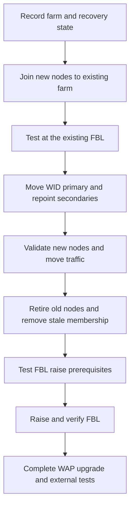

# Upgrading an AD FS WID Farm: Mixed Mode, Farm Behavior Level and WAP

**A newer federation server does not automatically make the farm a newer farm.**

Replacing servers, moving the writable WID role and raising the **farm behavior level (FBL)** are separate operations. Keeping them separate provides useful validation and recovery points.

This guide covers the documented WID side-by-side upgrade model, including the 2012 R2/2016 to 2019/2022 transition. It is not an in-place Windows upgrade, a WID-to-SQL migration or a universal procedure for every future version. Select a supported target for the actual application requirements; a historical note mentioning 2019 is not a recommendation to deploy 2019 today. Microsoft recommends evaluating migration to Entra ID where AD FS is no longer required.

## 1. Understand the three version boundaries

| Boundary | What it controls | Verification |
|---|---|---|
| Windows Server version on each node | Installed binaries and supported local components | OS inventory and installed updates |
| AD FS farm behavior level | Features available to the farm | `Get-AdfsFarmInformation` |
| AD schema version | Directory definitions required by the upgrade | Schema naming-context `objectVersion` |

The AD schema version is **not** the domain/forest functional level. Microsoft's WID upgrade reference lists schema 85 or later for AD FS 2016 and 88 or later for AD FS 2019 and later.

| Documented version | FBL | Configuration database name in the upgrade reference |
|---|---:|---|
| 2012 R2 | 1 | `AdfsConfiguration` |
| 2016 | 3 | `AdfsConfigurationV3` |
| 2019 and 2022 | 4 | `AdfsConfigurationV4` |

Do not infer a database name from the OS alone: a newer node can still be operating at an older FBL. Raising FBL creates a new configuration database. Do not delete old databases as an improvised cleanup or use this table to move database files.



Mixed mode is a transition, not a long-term architecture. New-version features remain unavailable until the farm supports them. A successful sign-in during mixed mode cannot prove that a new FBL-dependent feature works.

## 2. Record the current state and recovery route

Use elevated Windows PowerShell on the relevant federation servers, with farm-administration rights. Inventory all nodes, versions, roles and synchronization before choosing the future primary. On a node exposing the farm-information cmdlet:

```powershell
Import-Module ADFS -ErrorAction Stop
$farmBefore = Get-AdfsFarmInformation -ErrorAction Stop
$syncBefore = Get-AdfsSyncProperties -ErrorAction Stop
$farmBefore | Format-List CurrentFarmBehavior, FarmNodes
$syncBefore | Format-List *
Get-CimInstance -ClassName Win32_OperatingSystem -ErrorAction Stop |
    Select-Object Caption, Version, BuildNumber
```

Record existing routing and authentication behavior too. Preserve the service identity, federation name/identifier, TLS and token certificates/private keys, WAP configuration, custom provider installation requirements, themes, trusts and policy. A list of relying parties is not a complete backup.

For schema inventory, use an AD management host with the ActiveDirectory module, explicitly choosing a DC in the farm's forest:

```powershell
Import-Module ActiveDirectory -ErrorAction Stop
$directoryServer = 'dc01.corp.example'
$rootDse = Get-ADRootDSE -Server $directoryServer -ErrorAction Stop
$schema = Get-ADObject -Identity $rootDse.SchemaNamingContext `
    -Server $directoryServer -Properties objectVersion -ErrorAction Stop
if ($null -eq $schema.objectVersion -or [int]$schema.objectVersion -lt 88) {
    throw 'The documented schema prerequisite for a 2019/2022 target is not met.'
}
$schema | Select-Object DistinguishedName, objectVersion
```

Schema preparation, if needed, is its own directory change. The query does not perform it. Verify replication before relying on a schema update.

Test a version-compatible backup/recovery process before replacing the old servers. Rapid Restore has its own version and topology limits, including AD FS 2016 or later and matching backup/restore AD FS versions; it is not a way to restore a 2012 R2 farm directly into a newer AD FS version. See the [separate Rapid Restore workflow](ADFS%20Migrate%20from%20WID%20to%20SQL%20via%20Rapid%20Restore%20Tool%20-%20Parallel%20deployment.md) and its Microsoft reference.

## 3. Join and validate new federation nodes

1. Provision patched target-version servers and the AD FS role. Verify directory, DNS, time, certificates and the existing service account's prerequisites.
2. In the federation configuration wizard, select **Add a federation server to a federation server farm**. Join the existing farm using its existing configuration and service identity. Creating a new farm with the same DNS name is not this upgrade process.
3. Install required compatible custom authentication/attribute-store components on each new node. Farm configuration does not deploy every third-party binary or local private key.
4. Confirm configuration synchronization and test the new nodes at the existing FBL before moving ordinary traffic. Use a controlled route that preserves the federation hostname and TLS identity.

For per-node MFA credentials, certificates and private-key access, verify the new node itself; another node's successful sign-in is not evidence about this one.

## 4. Transfer the WID primary deliberately

Freeze configuration writes during the transition. Choose exactly one synchronized new node as the future primary. The next two examples **change local synchronization roles immediately**; `Set-AdfsSyncProperties` has no documented `-WhatIf` or `-Confirm`. They are separate per-machine steps, not a script to run wholesale on every server.

On the chosen new primary, represented here by **FS03**:

```powershell
$newPrimaryShortName = 'FS03'
if ($env:COMPUTERNAME -ine $newPrimaryShortName) {
    throw 'Run this step locally on the chosen new primary after reviewing its synchronized state.'
}
Set-AdfsSyncProperties -Role PrimaryComputer -ErrorAction Stop
Get-AdfsSyncProperties -ErrorAction Stop
```

Immediately demote the former primary and repoint every remaining secondary. Run this next block **on each other federation node**, not on FS03, after replacing the example name:

```powershell
$newPrimaryFqdn = 'fs03.corp.example'
if ($env:COMPUTERNAME -ieq ($newPrimaryFqdn -split '\.')[0]) {
    throw 'This secondary-role step must not run on the new primary.'
}
Set-AdfsSyncProperties -Role SecondaryComputer `
    -PrimaryComputerName $newPrimaryFqdn -ErrorAction Stop
Get-AdfsSyncProperties -ErrorAction Stop
```

**Verify:** there is one primary, secondaries target its server FQDN, and synchronization actually completes. Validate the required synchronization network path, including its configured port, rather than pointing it at an arbitrary federation VIP. The documented default uses HTTP port 80 between secondary and primary. Preserve any intentionally configured nondefault settings.

The WID primary is the configuration-write authority, not the only node that can authenticate users. Do not route all sign-ins there as a substitute for repairing synchronization.

## 5. Move traffic, retire old nodes, then raise FBL

Move the load-balancer/backend paths to the validated new nodes and observe real application sign-ins. Drain the old nodes before removing them. Follow the documented decommissioning process, uninstall their AD FS role and remove stale farm membership with `Set-AdfsFarmInformation -RemoveNode` for the specific retired node. Removing an inventory entry alone does not drain traffic or uninstall a live server.

On the new WID primary, once the eligible farm membership and recovery state are ready:

```powershell
Test-AdfsFarmBehaviorLevelRaise -ErrorAction Stop
```

Inspect all test results and warnings. Do not cast the returned object to Boolean and call that a successful preflight. Fix failed prerequisites before proceeding; use the service-account parameters required by the installed version and existing account model where necessary.

Preview the operation separately:

```powershell
Invoke-AdfsFarmBehaviorLevelRaise -WhatIf -ErrorAction Stop
```

`-WhatIf` does not replace the preceding test and does not raise FBL. For the actual planned change, replace `-WhatIf` with `-Confirm`. There is no target-level number in this command: review the installed farm versions and eligible membership first. Do not add `-Force` to suppress an unresolved prerequisite or prompt.

After the **real** raise, verify the expected level. The following expectation is specifically for the 2019/2022 target discussed here:

```powershell
$farmAfter = Get-AdfsFarmInformation -ErrorAction Stop
if ($null -eq $farmAfter.CurrentFarmBehavior -or [int]$farmAfter.CurrentFarmBehavior -ne 4) {
    throw 'The expected 2019/2022 farm behavior level has not been observed.'
}
$farmAfter | Format-List CurrentFarmBehavior, FarmNodes
```

Recheck every node, configuration synchronization and the authentication matrix below. Do not assume a successful management command tests relying-party sign-in.

## 6. Complete the WAP upgrade

Deploy and register the new WAP nodes with the same federation service name and the required certificate/private key. Use a version-compatible coexistence sequence and then drain/remove old WAP nodes. The [WAP architecture guide](../Concepts/Web%20Application%20Proxy%20Explained%20-%20AD%20FS%20Proxy,%20Preauthentication%20and%20Application%20Publishing.md) and [WAP trust troubleshooting guide](../Troubleshoot/WAP%20trust%20to%20ADFS%20broken.md) cover the separate proxy registration and TLS requirements.

On a WAP administration session:

```powershell
Get-WebApplicationProxyConfiguration -ErrorAction Stop | Format-List *
```

Review the connected-server list and configuration version. **`Windows Server 2016` is the documented WAP configuration version for 2016 and later**, not proof that a newer OS failed to upgrade. Only use the documented `Set-WebApplicationProxyConfiguration -UpgradeConfigurationVersion` step when the existing configuration actually needs it. Updating `ConnectedServersName` supplies the intended server list; do not accidentally discard a still-required proxy.

## 7. Test the paths users actually use

| Path | Evidence to retain |
|---|---|
| Intranet WIA and forms where enabled | New-node sign-in and correct identity, not just an HTTP 200 |
| External sign-in through WAP | Proxy trust, hostname/TLS, normal application return |
| MFA | Each provider and each serving node, including local adapter credentials |
| Certificate/device authentication | Correct endpoint, mapping, registration model and device-dependent policy |
| SAML, WS-Federation and OAuth applications in use | Application accepts the issued result; identifiers and endpoints unchanged |
| Custom pages and logout | Existing theme/JavaScript behavior and expected session handling |
| Configuration management | Writes at the primary reach the intended secondary nodes |

### Do not turn a device-authentication symptom into a universal fix

An old upgrade note reported hybrid-joined Windows clients attempting device-related authentication after the server change. That observation alone does not identify the failing request or justify enabling Device Registration Service (DRS).

Read the current policy and correlate the actual AD FS event/request:

```powershell
Get-AdfsGlobalAuthenticationPolicy -ErrorAction Stop | Format-List *Device*
```

Distinguish Entra hybrid join, on-premises DRS registration, device authentication at AD FS and Windows Hello for Business trust models. An Entra Connect service connection point does not, by itself, establish that AD FS DRS has been initialized or should be enabled.

Microsoft documents a **specific Windows Hello for Business certificate-trust** case on AD FS 2019 or later: an OAuth request is rejected for scope `ugs`. Use that documented scope/permission repair only when the scenario, client/resource and error match. It is not a fix for every hybrid-join warning, and this guide does not create scopes or enable device authentication automatically.

## Recovery boundaries

```text
Before FBL raise: routing and node-role recovery under the recorded old-FBL state
After FBL raise:  a version-specific farm recovery, not simply an old VM restart
```

Review the documented `Test-AdfsFarmBehaviorLevelRestore` and `Restore-AdfsFarmBehaviorLevel` capabilities for the actual starting/target versions and retained state. A new configuration database does not imply automatic merging of later changes back into the old one. Recovery must account for configuration writes since the upgrade, roles, routing, WAP and service/key material. Keep the tested backup until the recovery window is closed.

## References

- [Microsoft Learn: Upgrade an AD FS WID farm, including schema, FBL, WAP and the certificate-trust case](https://learn.microsoft.com/en-us/windows-server/identity/ad-fs/deployment/upgrading-to-ad-fs-in-windows-server)
- [Microsoft Learn: Add a federation server to an existing farm](https://learn.microsoft.com/en-us/windows-server/identity/ad-fs/deployment/configure-a-federation-server#add-a-federation-server-to-an-existing-federation-server-farm)
- [Microsoft Learn: Set-AdfsSyncProperties](https://learn.microsoft.com/en-us/powershell/module/adfs/set-adfssyncproperties?view=windowsserver2022-ps)
- [Microsoft Learn: Test-AdfsFarmBehaviorLevelRaise](https://learn.microsoft.com/en-us/powershell/module/adfs/test-adfsfarmbehaviorlevelraise?view=windowsserver2022-ps)
- [Microsoft Learn: Invoke-AdfsFarmBehaviorLevelRaise](https://learn.microsoft.com/en-us/powershell/module/adfs/invoke-adfsfarmbehaviorlevelraise?view=windowsserver2022-ps)
- [Microsoft Learn: AD FS Rapid Restore requirements](https://learn.microsoft.com/en-us/windows-server/identity/ad-fs/operations/ad-fs-rapid-restore-tool)