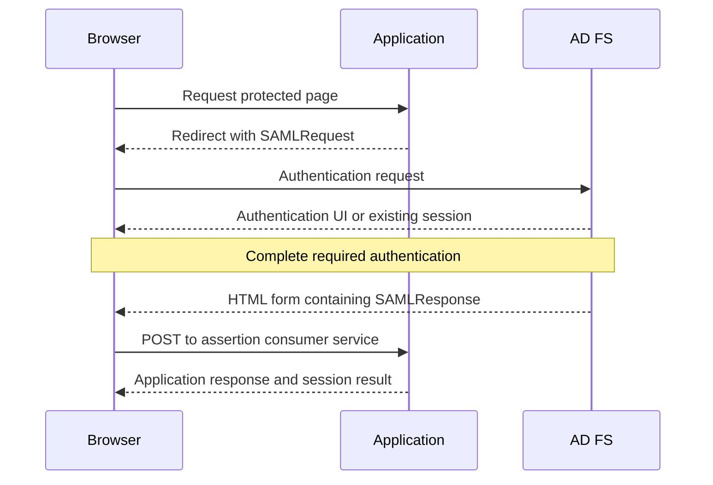

# AD FS HTTP Traces: Capture, Read and Redact

**A readable token is not a validated token, and an intercepted connection is not the original connection.**

An HTTP trace can show where a federation journey changes direction: a challenge, a redirect, a form POST, a rejected cookie or an application error. It cannot by itself explain every directory lookup, prove MFA or establish that a signature was accepted.

> **TL;DR:** Capture one short transaction, preserve the HTTP sequence and correlate it with server events. Use local decoding for sensitive payloads. Treat HAR and SAZ files as authentication evidence, not harmless screenshots.

## 1. Select the least disruptive observation point

| Tool or source | What it shows | What it changes or misses |
|---|---|---|
| Browser developer tools, Network view | The browser's requests, responses, initiators and cookie behavior | Does not show server-to-server calls or every native client |
| Fiddler Classic with HTTPS decryption | HTTP content for traffic actually routed through its proxy | Substitutes a certificate and creates different TLS connections |
| Packet capture without TLS keys | Addresses, timing and visible handshake metadata | Encrypted HTTP bodies are not readable |
| AD FS/WAP/application logs | Server processing and decisions | Must be correlated with the client transaction |

Start with browser developer tools when the failure is in a browser. Enable **Preserve log** before navigation so redirects do not erase earlier steps. Record whether cache and existing cookies were retained. A fresh browser profile is a useful comparison, but it also changes SSO state.

With Fiddler Classic, HTTPS decryption is configured under **Tools > Options > HTTPS**. Trusting its interception CA changes the client's trust configuration. Follow the vendor's current instructions and scope capture/decryption to the participating hosts and client. A display filter is not a guarantee that unrelated sessions were never captured or saved.

Do not enable interception on an AD FS server as the default diagnostic step. On the client, compare the failure without interception first. Channel binding, mutual TLS, certificate pinning and proxy-aware behavior can differ under interception. Do not disable Extended Protection to make a trace look successful.

Historical Federation Inspector/Thinktecture add-ins and CodePlex DLL-copy instructions are not prerequisites. Built-in headers, form and text views are enough to follow the HTTP exchange. Check current provenance and compatibility before adding an inspector.

## 2. Capture a single reproduction

1. Record client time/UTC offset, federation hostname, RP, browser version and internal/external path.
2. Start capture immediately before the action. Close unrelated tabs and avoid other sign-ins during the interval.
3. Reproduce once and note the exact error and Activity ID, if supplied.
4. Stop capture immediately. Record the end time and identify the first divergent request compared with a working case.
5. Preserve the restricted original, then work on a separate redacted copy.

Do not replay a production assertion, authorization code or credential POST merely to test a viewer. Single-use values, nonce checks and session state make replay both misleading and potentially consequential.

## 3. Read the sequence before reading claims

This simplified **SP-initiated SAML browser POST** flow is one possible journey, not an OAuth or WS-Federation template:



The HTML page containing a token can return **200 OK**. The browser then submits a separate POST to the application; it is not necessarily another HTTP 302. Inspect the destination and the next response.

| Observation | Interpret it as |
|---|---|
| 401 with `WWW-Authenticate: Negotiate` | An integrated-auth challenge, not proof that Kerberos succeeded |
| 302/303 and `Location` | A redirect target; inspect the next request and method |
| 200 with a login form | A successful HTTP response that may still require authentication |
| 200 with an auto-submitted form | A browser-mediated protocol step; inspect the form fields and destination |
| A token POST followed by application error | Investigate application token validation and session handling |
| Repeated redirects | Compare cookies, destinations and server errors before blaming token lifetime |
| Browser console frame/cookie error | A client enforcement decision; inspect the response policy and context |

The [WIA guide](AD%20FS%20WIA%20-%20Browser%20Configuration%20and%20Forms%20Fallback.md) covers browser selection and authentication. The [SAML guide](../Concepts/SAML%202.0%20with%20AD%20FS%20-%20Assertions,%20Bindings%20and%20Request-Response%20Validation.md) covers issuer, audience, destination, request correlation and signature validation.

## 4. Match decoding to the protocol and binding

| Payload | Interpretation |
|---|---|
| SAML HTTP-POST `SAMLResponse` | Form-decode the field, then Base64-decode its XML |
| SAML HTTP-Redirect `SAMLRequest` | Standard Redirect encoding additionally uses DEFLATE; POST decoding alone is insufficient |
| WS-Federation `wresult` | A form-encoded XML token response, not necessarily Base64 |
| `wctx` or SAML `RelayState` | Application/protocol context; not an issued identity claim |
| OAuth authorization `code` | A sensitive exchange artifact, not a JWT to decode |
| JWT-shaped token | Base64url parts; reading them does not validate signatures, issuer, audience or lifetime |
| Encrypted assertion/token | Requires the intended recipient's decryption capability; a text viewer cannot expose its claims |


*Historical parsed query-string view; all values have been removed with an opaque mask. It illustrates field inspection, not a token POST, a successful sign-in or data to replay.*

Use the browser's parsed form-field value or a proper form parser. Do not repeatedly URL-decode a value: a plus sign and a space are not interchangeable inside Base64. Never submit a real token or credential-bearing trace to an online decoder.

### A small offline structural check

This **Windows PowerShell 5.1** function accepts an already form-decoded SAML POST value. It reads only the XML structure, rejects DTDs and bounds input size. It performs **no signature or protocol validation** and does not decrypt assertions:

```powershell
function Get-SamlPostStructure {
    [CmdletBinding()]
    param(
        [Parameter(Mandatory)]
        [ValidateNotNullOrEmpty()]
        [string]$Base64Value
    )

    if ($Base64Value.Length -gt 1400000) {
        throw 'Input exceeds the diagnostic size limit.'
    }
    $payloadBytes = [Convert]::FromBase64String($Base64Value)
    if ($payloadBytes.Length -gt 1048576) {
        throw 'Decoded input exceeds 1 MiB.'
    }
    $settings = New-Object System.Xml.XmlReaderSettings
    $settings.DtdProcessing = [System.Xml.DtdProcessing]::Prohibit
    $settings.XmlResolver = $null
    $settings.MaxCharactersInDocument = 1048576
    $stream = New-Object System.IO.MemoryStream(,$payloadBytes)
    $reader = $null
    try {
        $reader = [System.Xml.XmlReader]::Create($stream, $settings)
        $responseXml = New-Object System.Xml.XmlDocument
        $responseXml.XmlResolver = $null
        $responseXml.Load($reader)
        $rootElement = $responseXml.DocumentElement
        if ($rootElement.LocalName -ne 'Response' -or
            $rootElement.NamespaceURI -ne 'urn:oasis:names:tc:SAML:2.0:protocol') {
            throw 'Expected a SAML 2.0 protocol Response.'
        }
        $namespaces = New-Object System.Xml.XmlNamespaceManager($responseXml.NameTable)
        $namespaces.AddNamespace('samlp', 'urn:oasis:names:tc:SAML:2.0:protocol')
        $namespaces.AddNamespace('saml', 'urn:oasis:names:tc:SAML:2.0:assertion')
        $namespaces.AddNamespace('ds', 'http://www.w3.org/2000/09/xmldsig#')
        $status = $responseXml.SelectSingleNode(
            '/samlp:Response/samlp:Status/samlp:StatusCode', $namespaces
        )
        if ($null -eq $status -or [string]::IsNullOrWhiteSpace($status.GetAttribute('Value'))) {
            throw 'No top-level SAML status code was found.'
        }
        [pscustomobject]@{
            StatusCode = $status.GetAttribute('Value')
            PlaintextAssertions = $responseXml.SelectNodes('/samlp:Response/saml:Assertion', $namespaces).Count
            EncryptedAssertions = $responseXml.SelectNodes('/samlp:Response/saml:EncryptedAssertion', $namespaces).Count
            ResponseSignaturePresent = $null -ne $responseXml.SelectSingleNode('/samlp:Response/ds:Signature', $namespaces)
        }
    }
    finally {
        if ($null -ne $reader) { $reader.Dispose() }
        $stream.Dispose()
    }
}
```

Exercise it with this deliberately incomplete, unsigned synthetic response, not a usable authentication token:

```powershell
$syntheticXml = @'
<samlp:Response xmlns:samlp="urn:oasis:names:tc:SAML:2.0:protocol" xmlns:saml="urn:oasis:names:tc:SAML:2.0:assertion">
  <samlp:Status><samlp:StatusCode Value="urn:oasis:names:tc:SAML:2.0:status:Success" /></samlp:Status>
  <saml:Assertion />
</samlp:Response>
'@
$syntheticValue = [Convert]::ToBase64String([Text.Encoding]::UTF8.GetBytes($syntheticXml))
Get-SamlPostStructure -Base64Value $syntheticValue
```

**Verify:** The synthetic result has one plaintext assertion, no encrypted assertion and no response signature. Even `ResponseSignaturePresent = True` would mean only that an element exists. Assertion signatures are separate, and neither is verified by this function. Editing a signed token to anonymize it invalidates the signature.

## 5. What does `pullStatus=0` mean?

A 2021 Microsoft Q&A answer describes this AD FS URL flag as skipping **Primary Refresh Token (PRT) fetching**. That is a useful clue when comparing browser journeys, not a documented general-purpose OAuth option or a WID replication setting.

The same thread reports an iframe issue, but the answer does not establish why the flag changed that behavior. Do not turn the anecdote into a universal silent-refresh fix, weaken `X-Frame-Options` or append the flag to every request. Compare server/client versions, cookies and the actual response producing the frame restriction.

## 6. Redact the artifact, not only the screenshot

| Data | Publication treatment |
|---|---|
| `Authorization`, `Proxy-Authorization`, cookies and `Set-Cookie` | Remove complete values |
| Password fields, SAML/WS-Fed tokens, codes, access/refresh tokens | Remove complete values, including copies inside encoded content |
| URLs, POST bodies, response HTML and redirect headers | Inspect all of them; secrets do not live only in headers |
| UPNs, email addresses, SIDs, tenant/customer IDs and private hostnames | Replace consistently with fictional values when needed for explanation |
| Screenshots | Crop and apply opaque masks; inspect the exported pixels at full size |
| HAR/SAZ archives | Review all saved sessions and metadata, not just the displayed selection |

An exported HAR's default sanitization is not proof that POST bodies or response content are anonymous. A masked screenshot does not sanitize the underlying archive. For publication, a small synthetic request/response sequence often preserves the explanation better than a heavily censored production trace.

Keep only what the diagnosis needs, restrict raw evidence access and set a deletion date. An old capture can still contain private identifiers even when its tokens have expired.

## 7. Remove diagnostic side effects

Stop capture, restore the client's previous proxy settings and turn off temporary HTTPS decryption. Remove only interception certificates introduced for this capture, using the tool's documented cleanup and the recorded before-state; do not delete shared certificates by a broad name match.

Repeat the relevant check without interception. Correlate the result with the [AD FS logging guide](Troubleshooting%20AD%20FS%20-%20Logs,%20Activity%20IDs%20and%20Evidence%20Collection.md), then report the failing step and evidence. A successful run only through the debugging proxy is a different result from a fixed native path.

## References

- [Progress Telerik: Configure Fiddler Classic to decrypt HTTPS](https://www.telerik.com/fiddler/fiddler-classic/documentation/configure-fiddler/decrypthttps)
- [Microsoft Learn: AD FS events and logging](https://learn.microsoft.com/en-us/windows-server/identity/ad-fs/troubleshooting/ad-fs-tshoot-logging)
- [Microsoft Q&A: What does the pullStatus parameter do?](https://learn.microsoft.com/en-us/answers/questions/236116/what-does-the-pullstatus-parameter-for-adfs-do)
- [Microsoft Learn: XmlReaderSettings.DtdProcessing](https://learn.microsoft.com/en-us/dotnet/api/system.xml.xmlreadersettings.dtdprocessing)