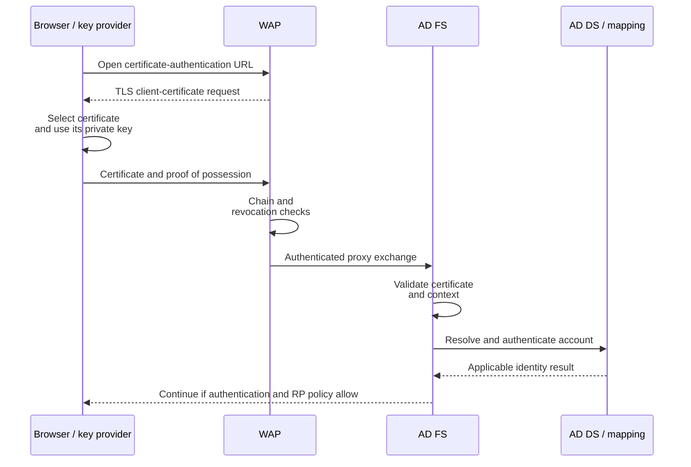

# AD FS User Certificate Authentication through WAP: Flow, Prerequisites and Troubleshooting

**Certificate present, certificate offered and user authenticated are three different states.**

An empty certificate picker is not diagnosed the same way as a selected certificate rejected by AD FS. Neither is automatically a broken WAP trust. The useful approach is to follow the request through the browser, the certificate-authentication listener, WAP, AD FS and the applicable account-mapping path.

This article covers user certificate authentication to AD FS through an existing Windows Server Web Application Proxy deployment. It does not configure Microsoft Entra certificate-based authentication, issue a PKI template, or develop an application. Historical traces illustrate mechanisms; current bindings, browser policy, Windows updates and certificate-mapping requirements determine the actual deployment behavior.

> **TL;DR**
> - The user's certificate is not WAP's proxy-trust certificate, the HTTPS server certificate or a device-registration certificate.
> - Certificate selection depends on the actual TLS request, available client credentials and browser/provider behavior.
> - A client-authentication EKU and a trusted chain are not, on their own, proof of successful user mapping or application access.
> - In the default AD FS binding mode, user certificate authentication commonly uses port 49443; alternate hostname binding uses `certauth.<federation-name>` on 443.
> - Check every validating machine's chain and revocation dependencies, including service-context connectivity and caches.
> - Do not weaken certificate mapping, disable revocation or install interception roots to make a diagnostic test pass.

## 1. Label the certificates before inspecting them

| Certificate role | Private key normally used by | Purpose |
|---|---|---|
| External HTTPS server certificate | The TLS-serving WAP/listener | Lets the client authenticate the server it reached |
| Backend federation HTTPS certificate | The AD FS TLS endpoint | Lets WAP authenticate the federation-service connection |
| WAP proxy-trust certificate | WAP | Authenticates the registered proxy to AD FS |
| User authentication certificate | The user's client/key provider, potentially a smart card | Proves possession of the user's private key in the client-authentication exchange |
| Device authentication certificate | The applicable registered device | Establishes a separate device context, not automatically the user's identity |
| Token-signing certificate | AD FS | Signs the token issued after successful processing |

WAP does not need a copy of the user's private key. Sending a serialized public certificate through the supported proxy mechanism is not exporting that private key, and possessing the public certificate alone is not proof of possession of the key.

For the broader distinction between publishing an application and proxying federation, see [Web Application Proxy explained](../Concepts/Web%20Application%20Proxy%20Explained%20-%20AD%20FS%20Proxy,%20Preauthentication%20and%20Application%20Publishing.md). For token/TLS key roles, see [AD FS certificates explained](../Concepts/AD%20FS%20Certificates%20Explained%20-%20TLS,%20Token%20Signing,%20Token%20Decryption%20and%20Rollover.md).

## 2. Follow the certificate-authentication path



This is a logical sequence, not a complete packet trace for every supported version. The response returns through the published proxy path. AD FS may require further authentication or deny issuance under the application's policy after it has identified the user.

The public 2017 WAP trace referenced below observed the `/adfs/backendproxytls/` exchange carrying the serialized client certificate and request context over the registered proxy relationship. That is an implementation detail of the supported federation proxy, not a public API to call manually or a generic header that an arbitrary reverse proxy may inject.

The same historical investigation observed certificate/CRL processing at WAP and AD FS. Check the relevant trust and revocation paths on **both** machines instead of assuming that a chain valid on the user's workstation is automatically valid throughout the service.


*Excerpt from the public 2017 trace: the selected method appears in the request body. This does not prove that certificate validation or account authentication succeeded.*


*The structure illustrates the certificate/request context described in that historical investigation. Sensitive values are covered with opaque masks; unrelated trace areas were cropped. It is not a payload to replay or a version-independent API contract.*

## 3. Verify the listener and binding mode

| Mode | Normal federation traffic | User certificate authentication | Main dependency |
|---|---|---|---|
| Default hostname/port separation | `fs.corp.example:443` | Commonly `fs.corp.example:49443` | The certificate-authentication port must be reachable through the required path |
| Alternate hostname binding, available from Server 2016 | `fs.corp.example:443` | `certauth.fs.corp.example:443` | Correct SAN, DNS, SNI routing and supported bindings |

The alternate hostname requires certificate coverage for that name. A certificate valid for `*.corp.example` does not cover `certauth.fs.corp.example`. A successful connection to the ordinary login hostname does not validate the alternate certificate-authentication hostname.

These modes describe user certificate authentication; they do not make 49443 the generic WAP proxy-registration port. Microsoft's AD FS requirements distinguish the firewall hops: without alternate `certauth` binding on 443, the 49443 requirement applies to **client-to-WAP** access, not as a general requirement between WAP and the federation servers. The supported WAP-to-AD FS proxy path uses 443. A direct intranet client and an external client through WAP do not necessarily exercise identical connections.

Do not copy backend-port observations from an instrumented historical lab into a current firewall specification. Establish the configured mode and the failing hop. A TLS-terminating load balancer on the federation path is unsupported by the AD FS requirements and can break client-certificate processing.

On an AD FS server, use a Windows PowerShell 5.1 administration session to read the relevant configuration:

```powershell
Import-Module ADFS -ErrorAction Stop

Get-AdfsProperties -ErrorAction Stop |
    Select-Object HostName, TlsClientPort

Get-AdfsSslCertificate -ErrorAction Stop

Get-AdfsGlobalAuthenticationPolicy -ErrorAction Stop |
    Select-Object PrimaryIntranetAuthenticationProvider,
        PrimaryExtranetAuthenticationProvider, AdditionalAuthenticationProvider
```

The global policy inventory is not a complete evaluation of every RP or request. Confirm the actual authentication method offered for the external flow, not merely a setting somewhere in the console. Binding changes belong in the [TLS binding procedure](../How-to/ADFS%20and%20WAP%20-%20Replace%20SSL%20Certificate.md), with validation across the farm.

Inspect the local HTTP.sys configuration on the affected AD FS and WAP nodes separately:

```powershell
netsh http show sslcert
if ($LASTEXITCODE -ne 0) {
    throw 'HTTP.sys binding inventory failed.'
}
```

This displays configuration; it does not modify it. Match hostnames, ports and certificate hashes to the node and mode being tested. Do not delete bindings or paste another server's AppId to repair an unexplained TLS error.

## 4. Why a certificate appears, disappears or is selected silently

The server requests a client certificate during the applicable TLS handshake. The client considers the request's constraints together with the certificates and key providers available in the relevant user context. The exact behavior depends on the browser, platform and policy.

| Selection factor | What to verify |
|---|---|
| Correct endpoint | Did the browser reach the listener that actually requests user certificate authentication? |
| User/key-provider context | Is the certificate available to this browser session, including any smart-card or hardware provider? |
| Private key access | Can the user and provider use the key, including any required PIN or middleware? A public `.cer` import is insufficient |
| Certificate validity | Are dates and applicable key usage/algorithm requirements suitable? |
| Intended usage | Does the certificate satisfy the required client-authentication purpose, including EKU where restricted? |
| Acceptable issuer information | Does the server's request constrain which certificate chains the client offers? |
| Browser policy/state | Is automatic certificate selection configured, or is previous TLS/authentication state being reused? |

The Client Authentication EKU OID is **`1.3.6.1.5.5.7.3.2`**. Do not confuse it with the Server Authentication EKU merely because both certificates are used in TLS. An absent EKU extension and an explicit restrictive EKU list have different semantics; inspect the application's certificate requirements rather than labeling every missing extension automatically valid or invalid.

For a Windows client using the current user's certificate store, this read-only inventory is a starting point. Run it as the affected user, not as a different administrator account:

```powershell
Get-ChildItem -Path Cert:\CurrentUser\My -ErrorAction Stop |
    Sort-Object NotAfter |
    Select-Object Subject, Issuer, Thumbprint, NotBefore, NotAfter,
        HasPrivateKey, EnhancedKeyUsageList
```

This list is not the browser's eligible-certificate list. `HasPrivateKey` reports key association, not a successful signing operation by the user/provider. Hardware-backed keys, browser-specific stores and cached state also need to be considered. Do not export a PFX as a routine troubleshooting step.

### Issuer hints are not the complete trust decision

TLS can carry a list of acceptable CA distinguished names to help certificate selection. Older AD FS discussions often call the filtering mechanism a *CTL*. Keep the on-wire issuer hints, the HTTP.sys/store configuration and the server's eventual chain validation distinct.

Microsoft documents Schannel's default `SendTrustedIssuerList` behavior as false from Windows Server 2012 onward. The absence of an issuer list therefore does not prove a broken trust store or that no certificate can be offered. Nor does sending a CA name establish that a presented certificate will pass expiry, revocation and account-mapping checks.

Edge's `AutoSelectCertificateForUrls` policy can select a matching certificate without showing a picker. Its filter does not override the server's certificate-request constraints. Review the effective browser policy and actual TLS/authentication evidence before changing the certificate template or the server trust settings.


*Only the method choices are retained from the historical page; the account field and browser URL were cropped out. An offered method, a selected certificate and a successfully mapped user remain separate checkpoints.*

```text
Certificate available to the client
    -> eligible for this request and key provider
        -> accepted by the validating service
            -> mapped/authenticated as the intended user
                -> allowed by the RP and application
```

## 5. Establish chain trust and revocation from the validating context

Having the issuing CA's name visible in a console is not the whole chain validation. Check the leaf, intermediates and trust anchor in the appropriate stores and contexts on WAP and AD FS. An intermediate belongs in the appropriate intermediate store, not indiscriminately in Trusted Root Certification Authorities.

| Check | Distinction that matters |
|---|---|
| Chain building | Issuer certificate availability and correct chain, not just a matching display name |
| Trust anchor | Explicitly trusted root under the relevant machine/service policy |
| Time validity | All applicable certificate validity periods, not only the leaf |
| Revocation | The validator can obtain and use the required current CRL/OCSP information |
| Network context | Service-account/system access may differ from an administrator's browser or proxy settings |
| Cache state | A usable cached CRL may avoid a new HTTP request; a successful download may still contain expired revocation data |

Identify the actual CDP/AIA/OCSP locations and their reachability from the machines that validate the certificate. An HTTP CDP is not itself evidence of plaintext user authentication: a CRL is signed validation data, with its own validation and freshness requirements.

Do not infer "revocation is disabled" from the absence of a CRL download in one trace. Equally, do not infer successful validation merely because a CDP returned HTTP 200. Inspect the Windows chain/revocation result and the data's validity period.

Avoid broad cache purges, registry changes or installing a debugging proxy root merely to reproduce a historical trace. Such changes affect the test and can disrupt other consumers. Prefer existing AD FS/WAP events and a scoped capture whose interpretation includes the current cache and service context.

## 6. Verify account mapping under current Windows requirements

Certificate selection and TLS proof of key possession do not establish which AD user should be authenticated. The account-mapping/authentication stage must identify the intended principal under the supported configuration, including any relevant certificate identifiers, account state and mapping rules.

An old recipe that maps a certificate by subject or email is not automatically suitable for a fully patched environment. Microsoft's **KB5014754** describes strong certificate mapping for the affected domain-controller authentication paths. Its timeline reached full enforcement in 2025, with the compatibility fallback removed by the September 2025 updates.

Where the AD FS flow reaches the affected KDC or Schannel-to-KDC certificate-mapping path, include those requirements and the relevant DC events in the investigation. Do not apply that KB indiscriminately to unrelated application-local mappings or confuse it with the WAP-to-AD FS proxy-trust certificate, which serves a different purpose.

**Verify:** correlate the AD FS failure with the actual DC/mapping result, identify whether the certificate's issuance or mapping meets the supported strong-binding requirements, and correct that cause. A nonempty UPN, an email address in the subject or a trusted root alone does not establish a strong mapping.

This guide does not prescribe an `altSecurityIdentities` edit or a compatibility-mode registry workaround. Certificate reissuance and explicit mappings need the actual PKI/account design, and should not weaken protections to preserve an old demonstration.

## 7. Match the symptom to the first failed stage

| Observation | Investigate first | Do not conclude immediately |
|---|---|---|
| Certificate option is absent from the sign-in page | Applicable AD FS policy, requested flow and endpoint | The user's certificate is malformed |
| Option is selected, but no TLS client-certificate request reaches the browser | DNS, port/hostname mode, routing and TLS termination | Reissuing the certificate will fix it |
| Request arrives but no candidate appears | User store/provider, key access, purpose, request constraints and browser policy | Every server trust store is necessarily wrong |
| No picker appears, but authentication succeeds | Automatic selection or existing state | Certificate authentication did not occur |
| Certificate is selected and the handshake fails | Certificate/key operation, chain, revocation and listener requirements | Proxy re-registration is always needed |
| WAP receives the certificate, but AD FS rejects authentication | Backend proxy path, AD FS validation and account mapping | The client picker determines server acceptance |
| Authentication succeeds, application denies access | RP policy, claims and application authorization | The PKI must be rebuilt |
| Internal access works, external fails | Differences introduced by WAP, external binding and validation dependencies | Internal success has tested the same path |

Microsoft's certificate troubleshooting reference lists **event 319** for client-certificate chain-building failure and **event 360** for a certificate-transport request without a client certificate. Use the event message, node, provider and timestamp; neither event number alone establishes a universal root cause.

Collect recent AD FS Admin records on the AD FS node handling the attempt, without changing auditing:

```powershell
$since = (Get-Date).AddMinutes(-15)
Get-WinEvent -FilterHashtable @{
    LogName = 'AD FS/Admin'
    StartTime = $since
} -MaxEvents 100 -ErrorAction Stop |
    Select-Object TimeCreated, Id, LevelDisplayName, ProviderName, MachineName, Message
```

No matching records, an inaccessible log and insufficient permissions are different outcomes. Keep errors visible; do not report a clean bill of health from an empty or failed query. Event messages may include user/certificate identifiers, so retain the full output locally and redact shared evidence.

## 8. Confirm the complete result

1. Record the public certificate-authentication hostname/port, client/browser and affected user context.
2. Establish whether a fresh request selected and used the intended certificate. Separate an existing session from a fresh authentication test.
3. Confirm the validating nodes' chain and revocation results, then the AD FS/account-mapping result.
4. Confirm the intended RP policy and application access result. User authentication alone is not application authorization.
5. Repeat through the relevant WAP and AD FS nodes. Compare external and internal tests without assuming they exercise the same listeners or validators.

Preserve a working configuration while isolating the failed boundary. The [WAP trust recovery guide](WAP%20trust%20to%20ADFS%20broken.md) addresses the separate proxy-registration credential; re-registering the proxy is not a general repair for client certificate selection.

## References

- [Microsoft Learn: AD FS alternate hostname binding for certificate authentication](https://learn.microsoft.com/en-us/windows-server/identity/ad-fs/operations/ad-fs-support-for-alternate-hostname-binding-for-certificate-authentication)
- [Microsoft Learn: AD FS requirements for user certificates, firewall hops and load balancers](https://learn.microsoft.com/en-us/windows-server/identity/ad-fs/overview/ad-fs-requirements)
- [Microsoft Learn: AD FS certificate troubleshooting](https://learn.microsoft.com/en-us/windows-server/identity/ad-fs/troubleshooting/ad-fs-tshoot-certs)
- [Microsoft Learn: TLS registry settings, including SendTrustedIssuerList and certificate mapping](https://learn.microsoft.com/en-us/windows-server/security/tls/tls-registry-settings)
- [Microsoft Learn: Edge AutoSelectCertificateForUrls policy](https://learn.microsoft.com/en-us/deployedge/microsoft-edge-policies/autoselectcertificateforurls)
- [Microsoft Support: KB5014754, certificate-based authentication changes on domain controllers](https://support.microsoft.com/en-us/topic/kb5014754-certificate-based-authentication-changes-on-windows-domain-controllers-ad2c23b0-15d8-4340-a468-4d4f3b188f16)
- [Journey of the Geek: user certificate authentication through WAP](https://journeyofthegeek.com/2017/08/24/deep-dive-into-ad-fs-and-ms-wap-user-certificate-authentication-through-a-wap/), historical 2017 trace, not a current deployment recipe.