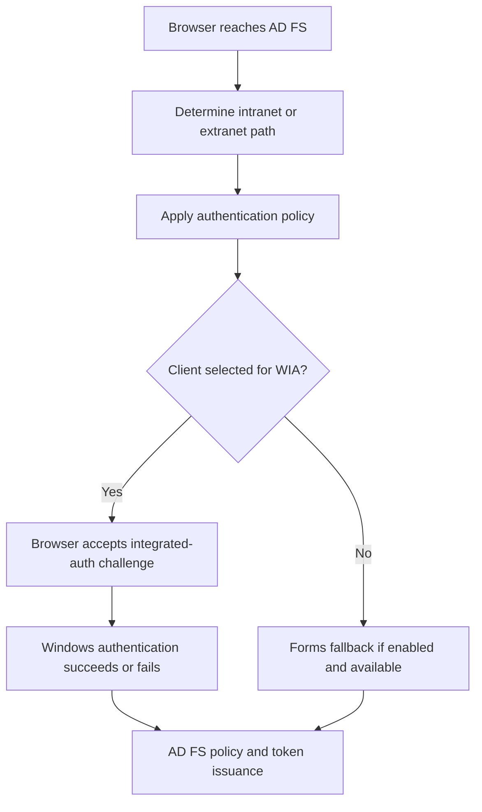

# AD FS WIA: Browser Configuration and Forms Fallback

**Recognizing a browser as WIA-capable does not give it a Kerberos ticket.**

Windows Integrated Authentication (WIA) can authenticate an intranet browser to AD FS without asking the user to type a password again. Three decisions must align: AD FS selects the method, the browser permits integrated authentication to that service, and Windows can complete the negotiated authentication.

This guide combines browser/user-agent configuration and forms fallback. It does not change claim-rule client filters or enable WIA indiscriminately on external paths.

## 1. Locate the failed decision



An intranet user's browser can still resolve the public federation name to WAP and take an extranet path. Conversely, a domain-joined device is not automatically classified as intranet merely because it is joined. First identify DNS, routing and the actual request path.

WIA normally uses Negotiate, which can select Kerberos or NTLM. A silent login is not proof that Kerberos was used. A browser password dialog after an HTTP challenge is also not the AD FS forms sign-in page.

## 2. Read the farm's current settings

On an AD FS administration host, use Windows PowerShell 5.1. Configuration changes are farm-wide; in WID, write from the primary. Retain the complete values before changing them.

```powershell
Import-Module ADFS -ErrorAction Stop
$propertiesBefore = Get-AdfsProperties -ErrorAction Stop
$policyBefore = Get-AdfsGlobalAuthenticationPolicy -ErrorAction Stop

if ($null -eq $propertiesBefore.PSObject.Properties['WIASupportedUserAgents'] -or
    $policyBefore.WindowsIntegratedFallbackEnabled -isnot [bool]) {
    throw 'Expected settings are not exposed; check the installed version.'
}
$wiaAgentsBefore = @($propertiesBefore.WIASupportedUserAgents)
$propertiesBefore | Select-Object WIASupportedUserAgents
$policyBefore | Select-Object PrimaryIntranetAuthenticationProvider,
    PrimaryExtranetAuthenticationProvider, WindowsIntegratedFallbackEnabled
```

Keep unsupported/missing settings distinct from `$false`. A new farm's documented defaults do not establish the current state of an upgraded or customized deployment.

## 3. Update user-agent selection without erasing the existing list

`WIASupportedUserAgents` helps AD FS decide which browsers or browser controls should use WIA. On AD FS 2016 and later, entries beginning with `=~` can be regular expressions. Microsoft's browser guidance uses the following pattern for Windows Edge scenarios:

```powershell
$reviewedPattern = '=~Windows\s*NT.*Edg.*'
$candidateAgents = @($wiaAgentsBefore)
if ($candidateAgents -notcontains $reviewedPattern) {
    $candidateAgents += $reviewedPattern
}
Set-AdfsProperties -WIASupportedUserAgents $candidateAgents -WhatIf -ErrorAction Stop
```

This example preserves existing entries; it is not an instruction to add the pattern when the installed configuration already covers the tested browser. Inspect the **actual** User-Agent received, browser platform and server version. Review all existing broad patterns too: preserving a bad match does not make it correct.

Do not replace the array with a copied list of old Internet Explorer, Windows Phone or mobile strings. Do not use a generic `Mozilla/5.0` match to force all clients through WIA. A User-Agent match is a compatibility hint, not a reliable device identity or a security boundary.

## 4. Permit the browser to authenticate to the right service

For Microsoft Edge, review the effective **AuthServerAllowlist** policy. It identifies servers to which integrated authentication is allowed. If unset, Edge attempts to identify intranet servers; an Internet-classified server is not treated the same way. The policy documentation requires a browser restart after a change.

Use the federation hostname narrowly, for example `fs.corp.example`, according to the organization's browser-management design. Do not add all Internet sites or a broad wildcard merely to remove a prompt. `AuthNegotiateDelegateAllowlist` is a different control for delegation, not a prerequisite to turn on blindly for normal sign-in.

Chrome and Firefox have their own policies/settings and platform dependencies. Use their currently supported enterprise controls; an AD FS-side User-Agent change does not configure the browser itself. Internet/Intranet zone behavior also matters on applicable Windows clients, but a screenshot of an old IE dialog is not evidence of the effective policy in today's browser.

## 5. Enable forms fallback only as an intentional behavior

Microsoft documents forms fallback when the client does not match WIA selection and `WindowsIntegratedFallbackEnabled` is true. Forms authentication must also be available for the intranet. The following preview preserves the existing intranet-provider list:

```powershell
if ($policyBefore.PrimaryIntranetAuthenticationProvider -notcontains 'WindowsAuthentication') {
    throw 'The captured policy does not select intranet WIA; review the intended design.'
}
$candidateProviders = @($policyBefore.PrimaryIntranetAuthenticationProvider)
if ($candidateProviders -notcontains 'FormsAuthentication') {
    $candidateProviders += 'FormsAuthentication'
}
Set-AdfsGlobalAuthenticationPolicy `
    -PrimaryIntranetAuthenticationProvider $candidateProviders `
    -WindowsIntegratedFallbackEnabled $true -WhatIf -ErrorAction Stop
```

This changes the global sign-in behavior when actually applied. It is not a per-application exception, an MFA policy or a guarantee that every failed Kerberos negotiation subsequently becomes a forms login. Diagnose an actual WIA failure separately from choosing forms for a client that does not support WIA.

For either preview, recheck that the retained baseline is still current, then replace `-WhatIf` with `-Confirm` to apply the reviewed change. Read the settings back. Do not apply every example merely because it is present on this page.

## 6. When WIA is selected but authentication fails

| Evidence | Next check |
|---|---|
| No response to the integrated-auth challenge | Effective browser policy, endpoint classification and client capabilities |
| Repeated 401/challenges | Requested service identity, SPN ownership, tickets, time and service-account context |
| NTLM used unexpectedly | Actual Kerberos error/fallback reason, not just the `Negotiate` label |
| One farm node fails | Node-specific certificate, service identity, routing and authentication evidence |
| WIA works directly but differs through WAP | Different intranet/extranet policy and supported proxy authentication path |
| Sign-in succeeds but the app denies access | RP policy, claims and application authorization rather than browser recognition |

Verify the federation-service DNS name and the AD FS service identity's SPNs. Do not delete or reassign `HTTP/` or `HOST/` registrations just because another environment used a different registration pattern. Use the [Kerberos troubleshooting guide](../../060%20-%20Active%20Directory/Troubleshoot/Troubleshooting%20Kerberos%20Authentication%20-%20SPNs,%20Tickets,%20Error%20Codes%20and%20NTLM%20Fallback.md) to correlate ticket and server evidence.

For each supported browser/platform, test a fresh intranet sign-in, a client expected to use forms, the external WAP path and an intended access denial. Keep the authentication result separate from whether a password box was visible.

## 7. Restore the actual before-state

Preview restoration of only the settings changed in this guide:

```powershell
Set-AdfsProperties -WIASupportedUserAgents $wiaAgentsBefore -WhatIf -ErrorAction Stop
Set-AdfsGlobalAuthenticationPolicy `
    -PrimaryIntranetAuthenticationProvider $policyBefore.PrimaryIntranetAuthenticationProvider `
    -WindowsIntegratedFallbackEnabled $policyBefore.WindowsIntegratedFallbackEnabled `
    -WhatIf -ErrorAction Stop
```

Apply the relevant restoration with confirmation after reviewing the state. Browser policy changes need their own rollback and browser restart. Re-test the same client/path matrix; do not mistake cached SSO for a fresh verification. For identity entered in forms versus WIA identity, see [Alternate Login ID](../How-to/AD%20FS%20Alternate%20Login%20ID.md).

## References

- [Microsoft Learn: Configure browsers for WIA with AD FS](https://learn.microsoft.com/en-us/windows-server/identity/ad-fs/operations/configure-ad-fs-browser-wia)
- [Microsoft Learn: Intranet forms fallback for clients that do not support WIA](https://learn.microsoft.com/en-us/windows-server/identity/ad-fs/operations/configure-intranet-forms-based-authentication-for-devices-that-do-not-support-wia)
- [Microsoft Learn: Set-AdfsGlobalAuthenticationPolicy](https://learn.microsoft.com/en-us/powershell/module/adfs/set-adfsglobalauthenticationpolicy?view=windowsserver2025-ps)
- [Microsoft Learn: Edge AuthServerAllowlist](https://learn.microsoft.com/en-us/deployedge/microsoft-edge-policies/authserverallowlist)