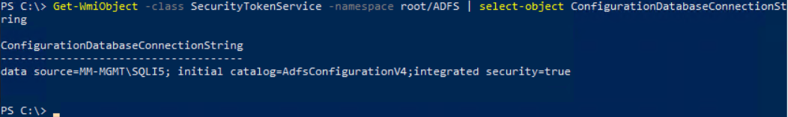

## How to Check Whether AD FS Uses SQL or WID

To determine whether your Active Directory Federation Services (AD FS) environment is using a Windows Internal Database (WID) or a full SQL Server backend, you can use the following PowerShell command:

```powershell
Get-WmiObject -Class SecurityTokenService -Namespace root/ADFS | Select-Object ConfigurationDatabaseConnectionString
```



### Output Interpretation

#### ✅ If your AD FS farm uses WID, you will see:
```
ConfigurationDatabaseConnectionString
-------------------------------------
Data Source=np:\\.\pipe\microsoft##WID\tsql\query;Initial Catalog=AdfsConfiguration;Integrated Security=True
```

#### ✅ If your AD FS farm uses SQL Server, you will see:
```
ConfigurationDatabaseConnectionString
-------------------------------------
Data Source=<SQL SERVER>\<INSTANCE>;Initial Catalog=AdfsConfiguration;Integrated Security=True
```

This quick check can help you validate the underlying database configuration of your ADFS farm.

