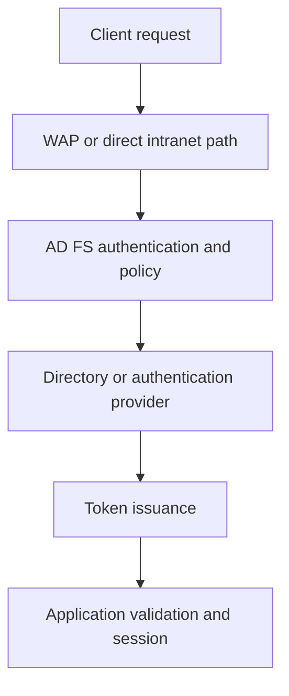

# Troubleshooting AD FS: Logs, Activity IDs and Evidence Collection

**An error page is the start of an investigation, not the name of the broken component.**

A failed sign-in can stop at the browser, WAP, AD FS, a domain controller, an MFA provider or the application. Collect enough evidence to locate that boundary before changing authentication policies, certificates or claims.

> **TL;DR:** Record the time, path, node and Activity ID. Start with existing Admin and audit events. Enable detailed tracing only for a short reproduction, then restore its previous state. Token issuance success does not prove application acceptance.

## 1. Define one reproducible transaction

Record the following in the private incident record:

| Evidence | Why it matters |
|---|---|
| Start/end time with UTC offset | An apparent ordering problem can be a time-zone mismatch |
| Federation hostname, RP identifier and protocol | Different applications can take different authentication paths |
| Intranet or external path; actual WAP/AD FS nodes | DNS, load balancing and cookies can select different nodes |
| Browser/client version and authentication method | A forms failure is not necessarily a WIA failure |
| Exact error code and Activity ID, if displayed | A searchable anchor, not a complete diagnosis |
| Existing session versus fresh authentication | SSO can skip credential validation entirely |
| Expected result and one comparison that works | Distinguishes a node, user, client or application-specific failure |

Retain identities and full URLs only in the restricted evidence set. A query string, POST body or cookie can contain credentials or tokens. Do not ask users to paste an entire browser trace into a public issue.



This is an investigation map, not a claim that every protocol uses every step. Start at the last step with positive evidence and inspect the next boundary.

## 2. Choose the evidence source

| Source | Useful evidence | Limit |
|---|---|---|
| **AD FS/Admin** | Service, configuration and request failures | Not a complete record of every successful sign-in |
| **Security**, AD FS audit events | Credential validation, token issuance and other audited operations | Requires the effective audit prerequisites; absence is not proof of no activity |
| **AD FS Tracing/Debug** | Detailed processing around a reproduction | High volume, performance cost and potentially sensitive content |
| WAP Admin events | Proxy trust, backend connection and publication failures | Collect on the WAP node that handled the request |
| System/Schannel and certificate evidence | TLS role, trust, protocol and certificate failures | Not every TLS failure reaches AD FS request processing |
| Browser/network trace | HTTP challenges, redirects, form posts and client-side errors | HTTPS interception can change the failure being investigated |
| Application logs | Token rejection, audience/issuer checks and application session creation | A successful AD FS event does not establish this result |

On an AD FS node, run the following read-only inventory in **Windows PowerShell 5.1**, with rights to read the listed logs. Elevation is normally needed for Security. It does not enable logging:

```powershell
Import-Module ADFS -ErrorAction Stop
$adfsProperties = Get-AdfsProperties -ErrorAction Stop
$adfsProperties | Select-Object AuditLevel
Get-WinEvent -ListLog 'AD FS/Admin', 'AD FS Tracing/Debug', 'Security' `
    -Force -ErrorAction Stop |
    Select-Object LogName, IsEnabled, LogMode, MaximumSizeInBytes, RecordCount
```

Channel names, event payloads and available settings must match the installed version. Do not translate an old AD FS 2.0 screenshot into a current event-number checklist.

For Security auditing, check the **effective** Application Generated success/failure audit policy and the **Generate security audits** assignment for the service's effective security context, including its configured service SIDs. Also inspect the AD FS audit settings for that version. Domain policy can override a local setting. A farm AuditLevel value alone does not prove events reach every node's Security log.

## 3. Query a bounded time window

The example reads only the local Admin log. Replace the example UTC times with the reproduction interval. It refuses a window longer than 15 minutes and detects truncation instead of quietly treating the newest 2,000 events as complete evidence.

```powershell
$startUtc = [DateTimeOffset]::Parse('2026-10-01T10:00:00Z')
$endUtc = [DateTimeOffset]::Parse('2026-10-01T10:05:00Z')
if ($endUtc -le $startUtc -or ($endUtc - $startUtc).TotalMinutes -gt 15) {
    throw 'Use an increasing interval no longer than 15 minutes.'
}
$eventLimit = 2000
$events = @()
try {
    $events = @(Get-WinEvent -FilterHashtable @{
        LogName = 'AD FS/Admin'
        StartTime = $startUtc.LocalDateTime
        EndTime = $endUtc.LocalDateTime
    } -MaxEvents ($eventLimit + 1) -ErrorAction Stop)
}
catch {
    if ($_.FullyQualifiedErrorId -notlike 'NoMatchingEventsFound*') { throw }
}
if ($events.Count -gt $eventLimit) {
    throw 'Collection limit reached. Narrow the interval before correlating events.'
}
$events | Select-Object TimeCreated, MachineName, LogName, ProviderName,
    Id, RecordId, LevelDisplayName
```

**Verify:** The log is enabled, retained data covers the interval, the node is correct and collection did not fail or hit the limit. An empty result is not a successful sign-in. Check rotation, access, node selection and timestamps before widening the search.

For a multi-node case, perform the same bounded collection on the relevant AD FS/WAP nodes. Preserve machine name, channel, event RecordId, UTC time and the original XML. Do not clear logs to make the next reproduction easier to read.

## 4. Correlate the Activity ID, not every GUID in the message

An AD FS Activity ID identifies a request and can correlate its events across participating federation components. In Event Viewer, inspect **Details > XML > System > Correlation**. The error page can also expose the ID.

The following filters the already collected Admin events by the structured `ActivityID` field. It does not search for a GUID inside an unrelated certificate, device or user identifier:

```powershell
$activityId = [guid]'11111111-2222-3333-4444-555555555555'
$correlatedEvents = @($events | Where-Object {
    [xml]$eventXml = $_.ToXml()
    $correlation = $eventXml.SelectSingleNode(
        '/*[local-name()="Event"]/*[local-name()="System"]/*[local-name()="Correlation"]'
    )
    $parsedActivityId = [guid]::Empty
    $null -ne $correlation -and
        [guid]::TryParse($correlation.GetAttribute('ActivityID'), [ref]$parsedActivityId) -and
        $parsedActivityId -eq $activityId
})
$correlatedEvents | Sort-Object TimeCreated |
    Select-Object TimeCreated, MachineName, Id, RecordId, Message
```

Messages are displayed here for **local investigation**, not automatic publication. XML and message fields can contain personal data and authentication material.

An empty result can mean that the event type uses another documented payload field, the request failed before correlation existed, or the ID belongs to another request. Inspect the original XML. `RelatedActivityID` describes a relationship, not an interchangeable identifier. Do not assume an application correlation ID, an Entra sign-in correlation ID and an AD FS Activity ID are identical.

## 5. Interpret the operation, not just success/failure

Microsoft documents these audit event families for **AD FS on Windows Server 2016**. Confirm the provider and payload on the installed release before using them in alert rules:

| Event IDs | Operation | What success does not prove |
|---|---|---|
| 1202 / 1203 | Fresh credential validation: success / error | That an RP token was issued or accepted |
| 1200 / 1201 | Application token: success / failure | That the application created a session |
| 1204 / 1205 | Password change: success / error | That every client refreshed its stored credentials |
| 1206 / 1207 | Sign-out: success / failure | That every independent application session ended |

A request using an existing SSO session need not generate fresh credential validation. Likewise, a token failure after successful authentication can be an authorization or claim-issuance problem. Read the full exception chain and compare the same transaction, not two nearby events for different users.

## 6. Increase detail temporarily, with a return path

For versions exposing `AuditLevel`, retain the actual value before previewing a change. In a WID farm, administer farm settings from the primary node:

```powershell
$auditLevelBefore = $adfsProperties.AuditLevel
if ($null -eq $auditLevelBefore -or
    [string]$auditLevelBefore -notin @('None', 'Basic', 'Verbose')) {
    throw 'The expected AuditLevel is not available; check this AD FS version.'
}
Set-AdfsProperties -AuditLevel Verbose -WhatIf -ErrorAction Stop
```

Recheck that no one changed the setting since the capture, then replace `-WhatIf` with `-Confirm` when the increased detail is needed. Read back the value, reproduce once and preview restoration:

```powershell
Set-AdfsProperties -AuditLevel $auditLevelBefore -WhatIf -ErrorAction Stop
```

Restore with confirmation and read back again. Do not assume the previous level was Basic.

For **Debug** tracing, Event Viewer exposes the channel after **View > Show Analytic and Debug Logs**. Record its previous enabled state and retention settings on each node. Enable it only on the nodes needed for the short reproduction, collect the evidence, then restore those exact states. Do not disable a trace that was already enabled for another investigation.


*Historical Event Viewer captures, cropped to the relevant controls. They illustrate how to reveal and enable the channel, not its current state, retention policy or a universal requirement to enable it.*

WCF/WIF message tracing involves service configuration and a restart; it is not a prerequisite for ordinary Admin-log diagnosis. Use the documented version-specific procedure only when that layer is actually needed. Detailed traces can expose tokens and claims and should not become permanent verbose telemetry.

## 7. Monitoring is a different question

| Signal | Question it can answer |
|---|---|
| Service and node-local health probe | Is this node responding to the selected check? |
| Request rate, failed requests and latency trends | When did behavior change, and on which nodes? |
| CPU, memory and connection pressure | Is resource pressure correlated with the incident? |
| End-to-end synthetic sign-in | Can the tested identity/path/application complete its journey? |
| Connect Health, where deployed | What does the configured monitoring service report within its collection scope? |

Use Performance Monitor to discover the installed AD FS counter sets and establish a comparable baseline. Counter names can be localized and vary by release. Keep sampling duration and interval explicit; high frequency across every counter is not automatically more informative.

`/adfs/probe` is a local health signal, not a directory lookup, MFA transaction or complete sign-in. Its load-balancer role and limits are covered in [AD FS in Azure](../Concepts/AD%20FS%20in%20Azure%20-%20High%20Availability%20and%20Traffic%20Manager.md).

Historical notes about the **ADFSDiagnostics** PowerShell module describe a separate tool, not the built-in logging contract and not Microsoft Entra Connect Health itself. Check the exact package's publisher, supported releases, collection contents and prerequisites before using it. A 2015 gallery download or an old successful test is not evidence of current support.

## 8. Close with evidence, not a bundle of guesses

Keep the raw EVTX/XML and traces in restricted storage with a retention deadline. Hash transferred evidence when integrity matters. Redact a separate publication copy, including identities, tokens, cookies and request bodies; deleting one visible username is not sufficient.

The incident result should name the failed boundary, the evidence supporting it, the change made and the same before/after test. Link to the relevant [WIA](AD%20FS%20WIA%20-%20Browser%20Configuration%20and%20Forms%20Fallback.md), [WAP trust](WAP%20trust%20to%20ADFS%20broken.md) or [user certificate](AD%20FS%20User%20Certificate%20Authentication%20through%20WAP%20-%20Flow,%20Prerequisites%20and%20Troubleshooting.md) investigation instead of changing all three at once.

## References

- [Microsoft Learn: Troubleshoot AD FS with events and logging](https://learn.microsoft.com/en-us/windows-server/identity/ad-fs/troubleshooting/ad-fs-tshoot-logging)
- [Microsoft Learn: Get-WinEvent](https://learn.microsoft.com/en-us/powershell/module/microsoft.powershell.diagnostics/get-winevent?view=powershell-5.1)
- [Microsoft Learn: Set-AdfsProperties](https://learn.microsoft.com/en-us/powershell/module/adfs/set-adfsproperties?view=windowsserver2025-ps)
- [Microsoft Learn: Monitor AD FS with Microsoft Entra Connect Health](https://learn.microsoft.com/en-us/entra/identity/hybrid/connect/how-to-connect-health-adfs)